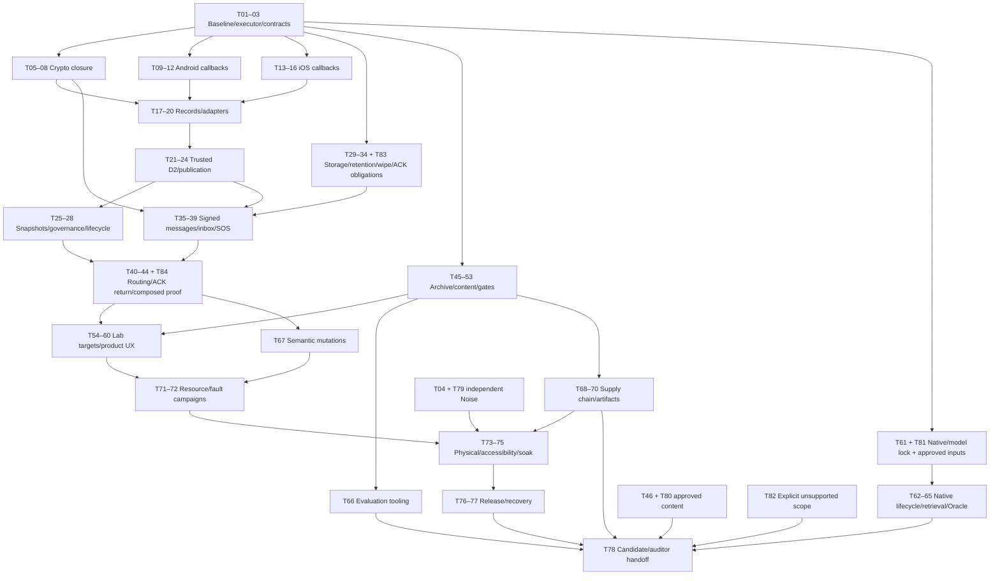

# GODSTONE — MASTER IMPLEMENTATION BLUEPRINT

Planning-only handoff • 9 September 2026 • Baseline `b5c3d3d394b70cf356cdde33b47511dad7cbb95c`

Intended builder: the user's local Qwen 3.8 Flash Next installation through Oh My Pi on DGX Spark. Those installations and their CLI/API contracts have **not** been verified. This document does not invent their commands. A Mac executor is required for Xcode and Apple device evidence. This blueprint, TASKS.json and templates are deliverables outside the application repository; no implementation was performed after the planning-only instruction.

Use this document as architecture and TASKS.json as the task scheduler input. Sections 1–31 are normative together. Proposed new types, payloads, budgets and tools are explicitly implementation instructions, not claims that they exist. Existing source paths are relative to the checkout in code blocks and absolute/clickable in task records. Portability: replace the checkout root when using DGX/Mac executors; do not copy this Mac path into product code.

## 1. EXECUTIVE ASSESSMENT

GODSTONE is an offline knowledge application with substantial nonshipping work toward authenticated nearby communication, durable mesh routing, SOS and local retrieval-assisted inference. **The actual shipping application graph is currently a LIGHT Archive reader on Android and iOS.** Mesh, SOS, bulk transfer and Oracle are excluded or disabled. Their source presence and hundreds of tests do not establish a usable radio or inference product.

The repository has valuable foundations: canonical GMP/2.1 codecs, a frozen BLE record layer and LinkInfo election, identity bindings, durable trust and delivery primitives, strict private-draft answer handling, and many host tests. Preserve these. The largest distance to production is in the composition between these pieces: actual OS callback lifetimes, trusted handshake transport, DATA crypto parity, end-to-end authorship, durable recipient delivery, routing, real content packaging and platform behavior.

Critical observed defects include replay state mutation before authentication on Android; incompatible Android/Swift DATA envelopes; unsafe unilateral Swift rekeying; per-session lifecycle races; iOS callback validation separated from subsequent mutation; absent D2 integration; unauthenticated claimed authors inside sealed messages; and unsupported delivery claims based on local send acceptance. These are source findings, not evidence of an exploited released product. The shipping graph's exclusions currently limit their exposure.

The plan preserves Archive-only as the accepted first release. It also completes internally implementable mesh and Oracle work in explicitly nonshipping lab profiles. It does **not** silently declare the entire project complete by narrowing the scope to Archive. Unsupported group/bulk/tier promises are tracked separately. A later product/architecture acceptance must decide which experimental capabilities become a release profile; the smaller builder cannot make that decision by flipping flags.

“10/10” is an acceptance target within an explicit capability profile, not a score awarded after executing this document. A candidate still needs independent audit. Missing external inputs, hardware results or unresolved correctness/security failures prevent an unqualified candidate claim.

## 2. VERIFIED BASELINE

| Item | Verified state |
|---|---|
| Local checkout | `/Users/oculus/Projects/GODSTONE` |
| Current branch | `codex/archive-reliability` |
| Planning HEAD | `b5c3d3d394b70cf356cdde33b47511dad7cbb95c` |
| HEAD subject | `stage4: bind CoreBluetooth manager callbacks to epochs` |
| Direct parent / audited anchor | `921b93903dea32b30ee591c3c0b454f706333c69` |
| Parent of audited anchor | `e7de98660dbfae247afbbca6fa9bf2a300880f0b` |
| Live remote remediation tip | Same `b5c3d3d...` |
| Live remote main | `16e5a2bb66c1ab8281899790bb77355026ec0619`; do not assume main includes remediation |
| Worktree | Dirty: 18 tracked modified paths and 15 untracked porcelain entries, some directories; 33 entries is not a file count |
| Repository CI at exact HEAD | `repository-verification` run33669689375 successful; external `release-gates` run33669689120 failed |
| Readiness | Android `LINK_LAYER_READY=false`; iOS `linkLayerReady=false` in transport/node |
| D2 | Production HS record dispatch still absent; trusted controllers exist but are not integrated |

Remote history was rechecked during this planning continuation. Relevant predecessors include relation-generation/publication authority (`8a60225`), serialized per-peer BLE lifetimes (`e7de986`), platform relation tokens (`921b939`), and manager epoch delegates (`b5c3d3d`). Do not discard these improvements.

The latest iOS commit changes the older audit: it adds manager epoch delegate proxies, improves terminal/quarantine handling, and stores the actual inbound `CBCentral`. Therefore “no epoch proxy”, “no retained CBCentral” and “didFail always remains closing” must not be repeated as unchanged findings. The remaining issues concern whether the real manager source identity is immutable, whether validation and mutation are atomic, and whether ambiguous same-identity lifetimes remain fail-closed. Android retains useful fresh server callbacks, GATT lifetime tokens, capacity leases, duplicate LinkInfo handling and relation publication reducers.

Earlier, before the planning-only brief, implementation produced Archive-related WIP: Python build/manifest/staging changes, Android bundled SQLite/install/search/UI, iOS reader/metadata/resource changes and CI/inspector updates. Preserve all of it. None is part of the committed baseline. Known unresolved WIP: `ios/project.yml` adds an `optional:true` Archive resource that still causes a missing `CpResource` input under XcodeGen2.46.0 when no asset is staged. It must be repaired in T51; adding a development fixture to Approved is not the fix.

Prior execution evidence is historical and scoped: baseline Swift package run reported664 passing tests;13 new Archive tests were separately exercised; Python baseline checks and WIP content tests passed in their respective trees. The final full677-test WIP run and final release/install results were not established as a clean integrated proof. No physical BLE interoperability, signed store artifact or complete production corpus was demonstrated. Reproduce all required evidence in the builder's clean worktree.

[Repository verification run](https://github.com/oculusrex14/GODSTONE/actions/runs/33669689375) and [release gates run](https://github.com/oculusrex14/GODSTONE/actions/runs/33669689120) are historical exact-HEAD evidence, not proof for later WIP.

## 3. SYSTEM ARCHITECTURE MAP

```text
SHIPPING ANDROID
MainActivity → GodstoneNavHost → Home/Browse → BrowseViewModel
  → ArchiveRepository → read-only Archive SQLite/FTS
app release dependencies: :core; :llm is testImplementation; :mesh is excluded

SHIPPING IOS
GodstoneApp → AppContainer → RootView/ArchiveView
  → GodstoneCore.ArchiveRepository → read-only Archive SQLite/FTS
app product dependency: GodstoneCore; GodstoneMesh/LLM not linked

CANONICAL NONSHIPPING MESH COMPOSITION
startup wipe barrier → one LocalIdentityState + separate private message/trust stores
  → PeerIdentityRepository → RepositoryPeerBindingTrustAuthority
  → BoundRecipientKeyResolver → recipient-authenticated DeliveryTracker
  → SessionManager → TrustedHandshakeController → NoiseSession
  → MeshNode/Router → BleTransport → OS GATT/CoreBluetooth adapters

INTENDED COMPLETE MESSAGE PATH
UI command → exact recipient trust version → one logical nonce → signed/sealed envelope
  → transaction(held frame + delivery) → anti-entropy pump
  → role-bound link → trusted Noise → DATA encrypt → BLE fragments
  → peer reassembly → authenticated decrypt → bounded router
  → recipient envelope verify → transaction(inbox + dedup) → signed recipient ACK
  → origin expected-recipient/CAS verification → durable DELIVERED

CONTENT / ORACLE
licensed source + human final-chunk approval → deterministic chunker
  → optional pinned embedder → schema3 Archive → signed manifest → trusted staging
  → verified runtime Archive → lexical or exact-compatible semantic retrieval
  → bounded private native draft → citation/quantity/qualifier validation → UI
```

Ownership decisions: one runtime lifecycle gate; one authoritative link reducer per transport context; one relation key and capacity lease; one SessionSlot per relation; one store transaction authority; one durable delivery row; one UI projection of those authorities. Platform delegates translate information available from the OS into immutable events. They do not invent generations after arrival.

Canonical files include `wire/wire_v2.yaml`, BLE reference/vector files, `crypto/gmp21.py` and identity vectors. iOS source/test authority is `ios/Godstone`; `ios/Packages/GodstoneFoundation` is generated by `scripts/sync_ios_foundation_package.py`. Never hand-maintain both copies independently.

## 4. CURRENT PRODUCTION-READINESS SCORECARD

Scores assess complete product readiness, not code volume; “component tested” never means “shipping wired”. P=Python/repository tests, J=JVM, S=Swift host, X=Xcode, B=binary checks. Criticality: H high, M medium. No row is10/10.

| Subsystem | Purpose | Android implementation | iOS implementation | Production wiring | Test maturity | CI coverage | Criticality | Known defects | Missing | External blocker | Score | Next |
|---|---|---|---|---|---|---|---|---|---|---|---:|---|
| App shell/tiering | Installable offline surface | LIGHT app/core; dormant views excluded | LIGHT Core app | Archive-only | Basic host/build proof | J/S/B; historical X | M | Metadata/resource WIP unresolved | Real install/journeys | Devices/signing | 4 | T49–54 |
| Archive engine | Search/read knowledge | Platform FTS portability; bundled WIP | SQLite errors hidden; actor WIP | Wired | New tests partly exercised | Core coverage WIP | H | Stale cache, false availability | Verified production bytes | Approved content | 3 | T45–52 |
| Content approval | Provenance/rights/safety | Shared Python | Shared Python | Build tooling | Validator unit tests | P | H | Approvals not fully final-byte-bound | Real reviewed corpus | Editorial/legal | 3 | T46/T80 |
| Wire/identity codecs | Canonical interoperable bytes | Generated GMP/2.1 | Generated GMP/2.1 | Nonshipping mesh | Strong pure vectors | P/J/S | H | Runtime GATT constants drift | Adapter proof | None for tooling | 6 | T10/T40 |
| BLE records | Bounded framing | Fragment/reassembly implemented | Parallel implementation | Physical substrate only | Strong component tests | P/J/S/structural | H | Admission/sequence/deadline edges | Writer integration | Hardware | 5 | T18–20 |
| Discovery/election | Find peer/select direction | Wrong advertising payload; scan risks | Accepted election; OS limits | Nonshipping | Reducer tests | J/S/structural | H | Epoch/bounds; UUID mismatch | Physical behavior | Apple limitation | 3 | T09–16 |
| Callback lifetimes | No stale mutation/leaks | Stronger tokens, local terminal gap | Epoch proxies; TOCTOU/ambiguity | Nonshipping adapters | Many synthetic seams | J/S/X logic | H | Current-state correlation | Real-shape trace suite | Devices | 3 | T11–20 |
| Noise transport | Session confidentiality/replay | Pre-auth replay update | Incompatible nonce/rekey | Not end-to-end | Same-platform loopbacks | J/S; A06 red | H | Crypto divergence/races | Independent DATA conformance | A06 | 2 | T05–08/T79 |
| Trusted handshake | Bind remote key/identity/trust | Durable authority implemented | Parallel trusted controller | D2 absent | Strong lower layers | J/S/structural | H | No record driver | HS/READY integration | A06/device | 4 | T21–24 |
| Local identity | Persist/recreate keys | Encrypted prefs/generation | Keychain/generation | Nonshipping runtime | Crash/state tests | J/S | H | Lifecycle/error integration gaps | Real lock/wipe evidence | Hardware | 6 | T29–34 |
| Peer trust | TOFU/rotation/revocation | Durable CAS repository | Durable CAS repository | Crypto composition; no UI | Strong components | J/S | H | No user decision path | Verification/rotation UX | Human acceptance | 5 | T55–56 |
| Private store | Durable bounded custody | SQLCipher; JDBC tests | Protected system SQLite | Nonshipping | Strong transaction tests | J/S | H | Erasure/protection errors; quotas | Encryption parity/migrations | Device/native review | 4 | T29–34 |
| End-to-end sealing | Hide body from relays | Ephemeral X25519/AES-GCM | Matching construction | Partial/nonshipping | Crypto helpers | J/S | H | Claimed author unauthenticated | Signed envelope | Crypto review | 2 | T35–37 |
| Routing/anti-entropy | Durable multihop exchange | Helpers, no complete pump | Optional store/dead forward hook | Incomplete | Router/sim tests | J/S/P | H | No full durable convergence | Pump/exact reconciliation | Devices | 2 | T40–44 |
| Delivery/ACK | Honest recipient receipt | Durable CAS/bound signer | Matching repository | Dispatch seams | Strong components | J/S | H | ATT→handed claim; inbox absent | Recipient commit/ACK path | Hardware | 4 | T36–43 |
| SOS | Authenticated distress broadcast | Zero-signature construction | Different signing/cancel path | Disabled | Internal dispatch tests | J/S | H | Divergence/non-atomic state | Signed protocol/UX | Product/hardware | 1 | T38–39/T57–58 |
| Abuse controls | Bound malicious peer costs | Partial, unbounded/racy maps | Missing parity governor | Too late in receive path | Limited | Mostly J | H | Preauth/resource exposure | Shared admission policy | Load devices | 2 | T26–27 |
| Wipe/recovery | Stop and erase private state | Durable journal, deletion gaps | Keychain journal; no store cryptoerase | Partial runtime barrier | Crash matrix components | J/S | H | Queued transport/deletion errors | Full drain/DEK removal | Physical proof | 4 | T34/T77 |
| Oracle validation | Grounded user output | Private draft/validators | Private draft/validators | Excluded | Good deterministic probes | P/J/S | H | Small eval set/cancel edges | Native product proof | Reviewed corpus/models | 4 | T64–66 |
| Native inference | Generate/embed locally | Missing embed/racy JNI | Blocking actor/cancel issue | Excluded | Limited real native proof | Native gate red | H | Missing pin/ownership | Full lifecycle/tests | Native/model artifacts | 1 | T61–65/T81 |
| Mesh/product UX | Explain backend truth | Dormant screens | Unlinked views | Disabled | Little real UI evidence | No full flow | H | No complete send/receive/trust flow | Integrated journeys | Devices | 1 | T54–60 |
| Bulk/group/tier delivery | Larger assets/group authoring | WifiAware stub | Multipeer stub | Excluded | Scaffolding | Exclusion | H | No interoperable design/key distribution | Accepted product scope | Human/platform | 0 | T82 |
| CI/control quality | Regression evidence | Repository/shared gates | Host and some Xcode | Active workflows | Many structural controls | Green repo/red externals | H | False mutation scores/stale status | Semantic controls | External gate inputs | 5 | T53/T67–68 |
| Release/recovery ops | Reproducible install/update | Unsigned Archive exclusion proof | Source build partial | No accepted release | Partial | B/supply-chain gaps | H | Assets/signing/device evidence missing | Clean candidate bundle | Signing/store/hardware | 2 | T69–78 |

## 5. FROZEN CONTRACTS / NON-NEGOTIABLE INVARIANTS

1. C8.4C: 8-byte BLE record header; HS1/HS2/HS3/DATA/CLOSE; uint8 sequence; at most64 fragments,16384 record bytes,four incomplete assemblies,30-second assembly timeout; balanced stride; duplicate/conflict rejection; encrypt then fragment. Admission respects ATT capacity as well as the absolute cap. No implicit expansion of frozen limits.
2. LinkInfo: UUID-only discovery and provisional GATT; A004=`6764A004-9A5E-4C7B-B0A1-3E5D8C2F7A10`;13 bytes=version1+flags1+hint4+digest6+queue1. **Version byte is0x02**; `V1` in a type name denotes the structure revision. LinkInfo is not a record.
3. Node ID is BLAKE2s-128(Ed25519 identity public key); hint is its first4 bytes. Smaller unsigned lexicographic hint retains central/initiator; larger cancels wrong-direction central; responder requires remote<local; equal fails closed. Never use OS identity, RSSI, timing, random choice or platform to elect.
4. No HS before ROLE_BOUND and physical duplex transport readiness. No DATA before trusted cryptographic READY. HS3 must precede DATA in writer order. Public usable-link publication additionally requires the key-confirmation exchange.
5. Android/iOS readiness remains false. Completion of D2, a lab target or CI is not permission to change it. Only explicit project acceptance may authorize a later enabling change; this backlog contains no such automatic task.
6. Preserve Noise_XX_25519_ChaChaPoly_BLAKE2s and GMP2 prologue, IdentityBindingV1 signature preimage, full node IDs, canonical message-ID/PoW/ACK formulas and canonical outer frame types/layout. Proposed DATA envelope and signed application payload amendments are narrowly scoped and must have explicit ADRs/vectors. Do not implement the OPEN SHA256 cipher ADR as an unrelated cleanup.
7. Durable database state owns custody/delivery. No send before outbound commit; no recipient ACK before inbox commit; no DELIVERED without intended-recipient authenticated ACK; retries reuse exact logical identity and authored bytes. Revocation is sticky and rotation is exact-candidate CAS.
8. Runtime startup is barred by a pending wipe. Stop/wipe cannot leave an old epoch capable of sending or publishing. Never return healthy-empty on correctness-critical storage failure.
9. Archive-only release remains `io.godstone.app`, LIGHT, no radio/model/Oracle/experimental dependencies or permissions. Canonical tier changes require coordinated generation and explicit scope acceptance.
10. Preserve Apple's background limitation. Background advertising places service UUIDs in an overflow area discoverable only by explicitly scanning iOS devices; do not promise Android discovery of a suspended iOS peripheral or force-quit resurrection. This is a product limitation, not a missing workaround. [Apple Core Bluetooth background documentation](https://developer.apple.com/library/archive/documentation/NetworkingInternetWeb/Conceptual/CoreBluetooth_concepts/CoreBluetoothBackgroundProcessingForIOSApps/PerformingTasksWhileYourAppIsInTheBackground.html).
11. No secrets, real message content or persistent contact graph in logs/evidence. No private-key export, automatic cloud telemetry, hidden network dependency or fabricated reviewer evidence.

## 6. ARCHITECTURAL DEFECTS

| Severity | Defect and actual implication | Evidence anchors | Required correction |
|---|---|---|---|
| Critical | Forged Android nonce can advance replay window or trigger unsafe arithmetic before AEAD | Android NoiseSession.decrypt/recordNonce | T05; preview/authenticate/commit |
| Critical | Swift/Android DATA formats disagree; Swift rekey can desynchronize keys | Both NoiseSession encrypt/decrypt | T06–07; explicit envelope/retirement |
| Critical | Per-peer drop/cipher races and nonterminal destroyed references | Both SessionManager/TrustedHandshakeController | T08/T17; SessionSlot/typed terminal |
| Critical | Sealed envelope does not authenticate claimed author | Both SealedSender/open-message validation | T35; signed application body |
| High | Manager epoch proxy does not itself prove source identity; validate/unlock/current-driver mutation races | iOS BleTransport delegates and process handlers | T13–16; fresh contexts/serial reducer |
| High | Android local close can orphan CLOSING; scan callbacks outlive sessions | Android drivers/GattClient/scan callback | T11–12 |
| High | UUID-only advertising violated and canonical characteristic UUIDs bypassed | Android startAdvertising; both runtime UUID declarations | T09–10 |
| High | D2 absent, HS ignored, nil-session plaintext fallback, READY too weak | Both transports/BleConnection/SessionManager | T17/T21–24 |
| High | Queue admission after encryption and incomplete record acceptance | Both transport.send implementations | T18–19 |
| High | Durable origin dispatch is not durable recipient receive or relay custody | MeshNode/Router/DeliveryTracker | T36–44 |
| High | iOS protected SQLite does not support claimed crypto-erasure; file errors swallowed | iOS MessageStore/PanicWipe | T30/T34 |
| High | Retention/metadata/WAL growth and governor maps not fully bounded | MessageStore/PeerGovernor | T26–27/T32–33 |
| High | Production content gate can miss actual editorial approval and embedded final asset | release-gates/content release_gate/staging | T45–53/T80 |
| High | Native context races, missing embedding and blocked cancellation | JNI/LlamaRunner/RagPipeline | T61–65 |
| Medium | Observers/flow emissions can block, leak or lose authoritative events | LinkInfoSnapshotAuthority/MeshNode | T24–25 |
| Medium | Stale documentation and superficial control scores conceal missing evidence | role_matrix/ADRs/ci mutations/status | T03/T53/T67 |

A deterministic host reproduction establishes a source defect; physical-device exposure remains a separate evidence class. Do not claim a proof for global SessionManager invalidation races that the source does not support: global destroy/invalidate already uses an exclusive lifecycle lock. The missing lock is on per-relation cipher/drop/readiness operations.

## 7. SECURITY THREAT MODEL

| Actor/attack | Entry point | Asset/boundary | Existing defense | Missing defense | Planned control | Verification |
|---|---|---|---|---|---|---|
| Malformed advertiser/Sybil | Scan callbacks | RAM/radio, unauthenticated OS→app | UUID filters/cap constants | Epoch/bounded related maps | T09/T11/T26–27 |10k identities, delayed result, no growth |
| Malicious GATT client | LinkInfo/write/subscribe | Capacity and state before trust | Strict LinkInfo/election/leases | Real callback correlation | T12–20 | Same-object stale terminals/unsubscribe |
| Stale OS callback/timer | Manager/GATT/timer event | New relation state | Partial tokens/proxies | Atomic context validation | T13–16 | Barrier schedules through real-shape adapter |
| Replay/nonce attacker | DATA record | Session availability/confidentiality | AEAD/window | Auth-before-commit/range parity | T05–08 | Forged high then valid, reorder/duplicate |
| Identity/MITM attacker | HS2/HS3 | Remote key→durable identity | Binding/trust controller | D2 wiring/confirmed link | T21–24/T79 | Wrong binding/static/hint, revoked key |
| Malicious relay/author spoof | Sealed MESSAGE | Recipient's believed sender | E2E confidentiality | Authenticated authorship | T35–37 | Anyone-with-recipient-key forgery rejected |
| Forged delivery claim | ACK/local send callback | User delivery belief | Recipient signature/CAS | Complete receive commit/accurate labels | T37/T43 | ACK-before-commit mutant, wrong recipient |
| Distress spam | SOS/header priority | Battery/custody/user attention | Frame structure/partial governor | Valid signing/all-class limits | T26–27/T38–39 | Zero sig, SOS flood, finite cap |
| Storage compromise/corruption | DB/Keychain/backup | Private keys/messages/trust | SQLCipher Android, Data Protection iOS | iOS DEK/error treatment | T29–34 | Wrong key, corrupt schema, lock/wipe crash |
| Restart during mutation | Transaction/migration/wipe | Durable truth | Journals/CAS | Full runtime drain/retention | T31–34/T77 | Kill at every durable boundary |
| Malicious archive/model | File import/native parser | User guidance/native memory | Hash/manifest drafts | Independent trust/final-byte approval | T45–46/T61–66 | Self-signed archive, malformed GGUF, sanitizer |
| Supply-chain attacker | Dependency/model/cache | Build/artifact integrity | Action SHA pins | Transitive locks/clean evidence | T68/T78–81 | Same filename changed hash rejected |
| Local logs/export | Diagnostics/support | User privacy | Offline design | Enforced redaction/bounds | T71/T76 | Secret/plaintext sentinels absent |

Threat limits: this is not protection against a fully compromised unlocked OS. Static-recipient sealed encryption does not provide retrospective secrecy after recipient-key compromise; routing tags derived from known public identities are not strong unlinkability. State these limitations; do not market the existing construction as anonymous, universally forward-secret, guaranteed delivery or rescue coordination with an emergency service.

## 8. COMPLETE DEPENDENCY GRAPH

`TASKS.json.dependencies` is the complete machine-readable DAG. T01–T20 are the mandatory initial sequence even where the DAG permits independent work. Thereafter choose the lowest numbered dependency-satisfied task with available required executor/input. External task numbers79–81 may run earlier than their numbers when they unblock a lower-numbered task. Never bypass a failed dependency gate.



The full edge table below is authoritative over this compressed diagram. Model availability does not block Archive, mesh tooling, mutation work or general resource instrumentation. Oracle-specific measurements run when its native dependencies are satisfied.

| Task | Depends on | External input needed for completion |
|---|---|---|
| T01 Preserve the planning baseline and all earlier WIP | None | Internal task; separate device gates as specified |
| T02 Install the deterministic executor and evidence contracts | T01 | Internal task; separate device gates as specified |
| T03 Normalize the normative contract set and capability profiles | T02 | Internal task; separate device gates as specified |
| T04 Make the independent Noise input gate structurally rigorous | T03 | Internal task; separate device gates as specified |
| T05 Commit Android replay state only after authentication | T03 | Internal task; separate device gates as specified |
| T06 Unify Swift DATA nonce framing with Android | T05 | Internal task; separate device gates as specified |
| T07 Replace unilateral rekey with deterministic session retirement | T06 | Internal task; separate device gates as specified |
| T08 Make SessionSlot the serialization authority | T07 | Internal task; separate device gates as specified |
| T09 Advertise only the canonical service UUID on Android | T03 | Internal task; separate device gates as specified |
| T10 Use generated GATT characteristic UUIDs everywhere | T09 | Internal task; separate device gates as specified |
| T11 Bind Android scan callbacks to bounded scan epochs | T10 | Internal task; separate device gates as specified |
| T12 Terminate Android locally cancelled attempts explicitly | T11 | Internal task; separate device gates as specified |
| T13 Create fresh iOS manager contexts per transport epoch | T10 | Internal task; separate device gates as specified |
| T14 Reduce iOS validation and mutation on one serial executor | T13 | Internal task; separate device gates as specified |
| T15 Make every iOS timer own an immutable operation key | T14 | Internal task; separate device gates as specified |
| T16 Close iOS ambiguous subscription and terminal lifetimes | T15 | Internal task; separate device gates as specified |
| T17 Remove plaintext and synthetic READY from production paths | T08, T12, T16 | Internal task; separate device gates as specified |
| T18 Add whole-record reservation and completion to Android writes | T17 | Internal task; separate device gates as specified |
| T19 Add whole-record reservation and backpressure to iOS writes | T18 | Internal task; separate device gates as specified |
| T20 Prove platform lifetime rules with semantic adapter controls | T12, T16, T18, T19 | Internal task; separate device gates as specified |
| T21 Connect the trusted initiator to HS1/HS2/HS3 records | T20, T08 | Internal task; separate device gates as specified |
| T22 Connect the trusted responder to HS1 and HS3 records | T21 | Internal task; separate device gates as specified |
| T23 Complete handshake failure, duplicate and key-confirmation policy | T22 | Internal task; separate device gates as specified |
| T24 Publish only relation-bound authenticated peers | T23 | Internal task; separate device gates as specified |
| T25 Make LinkInfo snapshots nonblocking and subscription-owned | T24 | Internal task; separate device gates as specified |
| T26 Bound Android admission and authenticated traffic budgets | T24 | Internal task; separate device gates as specified |
| T27 Implement equivalent iOS traffic governance | T26 | Internal task; separate device gates as specified |
| T28 Unify runtime stop/start, power and transport invalidation | T25, T27 | Internal task; separate device gates as specified |
| T29 Prove Android private-store encryption and failure behavior | T03 | Internal task; separate device gates as specified |
| T30 Give iOS private stores an erasable encryption key | T29 | Internal task; separate device gates as specified |
| T31 Replace destructive schema upgrades with versioned migrations | T29, T30 | Internal task; separate device gates as specified |
| T32 Implement bounded receipt-relative retention across restarts | T31 | Internal task; separate device gates as specified |
| T33 Bound total store growth and observer lifetimes | T32, T25 | Internal task; separate device gates as specified |
| T34 Finish crash-resumable wipe across transport and storage | T28, T30, T33 | Internal task; separate device gates as specified |
| T35 Authenticate directed-message authors inside the sealed envelope | T08, T31 | Internal task; separate device gates as specified |
| T36 Expose an atomic authored DIRECT send command | T35, T33 | Internal task; separate device gates as specified |
| T37 Persist received inbox messages before generating recipient ACKs | T36, T24, T83 | Internal task; separate device gates as specified |
| T38 Define and verify one signed SOS envelope | T35 | Internal task; separate device gates as specified |
| T39 Make SOS enqueue/cancel one durable authority | T38, T33 | Internal task; separate device gates as specified |
| T40 Freeze bounded anti-entropy control payloads | T20, T33 | Internal task; separate device gates as specified |
| T41 Wire Android durable anti-entropy and forwarding | T40, T24, T26, T37, T39, T84 | Internal task; separate device gates as specified |
| T42 Wire iOS durable anti-entropy and forwarding | T41, T27 | Internal task; separate device gates as specified |
| T43 Align delivery labels with durable evidence | T37, T39, T42 | Internal task; separate device gates as specified |
| T44 Prove crash-safe multihop behavior through composed runtimes | T34, T43 | Internal task; separate device gates as specified |
| T45 Make archive construction atomic and deterministic | T03 | Internal task; separate device gates as specified |
| T46 Bind content approval and manifest trust to final bytes | T45 | Internal task; separate device gates as specified |
| T47 Install and query Android archives using verified FTS5 | T45, T46 | Internal task; separate device gates as specified |
| T48 Make iOS archive availability and failure explicit | T45, T46 | Internal task; separate device gates as specified |
| T49 Complete the Android Archive reading journey | T47 | Internal task; separate device gates as specified |
| T50 Complete the iOS Archive reading journey | T48 | Internal task; separate device gates as specified |
| T51 Fix iOS resource intake and installable bundle metadata | T50 | Internal task; separate device gates as specified |
| T52 Require exact approved Archive bytes inside APK/AAB/IPA | T47, T51 | Internal task; separate device gates as specified |
| T53 Make gate status exact-SHA, complete and profile-aware | T04, T52 | Internal task; separate device gates as specified |
| T54 Create isolated experimental runtime targets | T44, T53 | Internal task; separate device gates as specified |
| T55 Add Android identity verification, rotation and wipe UX | T54, T34, T37 | Internal task; separate device gates as specified |
| T56 Add equivalent iOS identity and recovery UX | T55 | Internal task; separate device gates as specified |
| T57 Add Android direct messaging and honest SOS controls | T55, T43 | Internal task; separate device gates as specified |
| T58 Add equivalent iOS message and SOS journeys | T56, T57 | Internal task; separate device gates as specified |
| T59 Encode platform permissions and background capability truth | T28, T54, T58 | Internal task; separate device gates as specified |
| T60 Automate accessibility and restoration checks | T49, T50, T58, T59 | Internal task; separate device gates as specified |
| T61 Define native/model provenance and compatibility locks | T03 | Internal task; separate device gates as specified |
| T62 Make Android JNI generation and embedding lifecycle safe | T61, T81 | Internal task; separate device gates as specified |
| T63 Make Swift/native generation cancellation independent | T62 | Internal task; separate device gates as specified |
| T64 Bind retrieval vectors to the exact embedding pipeline | T45, T62, T63 | Internal task; separate device gates as specified |
| T65 Close Oracle cancellation and private-draft release semantics | T64 | Internal task; separate device gates as specified |
| T66 Build content/Oracle adversarial evaluation tooling | T46 | Internal task; separate device gates as specified |
| T67 Replace misleading mutation scores with executable proof | T20, T44, T53 | Internal task; separate device gates as specified |
| T68 Pin the build supply chain and prove offline restoration | T53, T61 | Internal task; separate device gates as specified |
| T69 Audit and verify the real iOS release artifact | T51, T52, T68 | Internal task; separate device gates as specified |
| T70 Audit Android release ABI, shrinking and installation | T47, T52, T68 | Internal task; separate device gates as specified |
| T71 Instrument resource budgets without private telemetry | T44, T60 | Internal task; separate device gates as specified |
| T72 Run production-path stress and deterministic fault campaigns | T67, T71 | Internal task; separate device gates as specified |
| T73 Execute physical BLE interoperability and lifecycle matrix | T59, T72, T79 | HARDWARE |
| T74 Complete human accessibility and usability acceptance | T60, T69, T70 | HUMAN_HARDWARE |
| T75 Measure battery, thermal and long-soak behavior | T72, T73 | HARDWARE |
| T76 Prepare signing, store and privacy release inputs | T69, T70, T74 | HUMAN_SIGNING_POLICY |
| T77 Prove upgrade, failed update and rollback recovery | T34, T52, T69, T70 | Internal task; separate device gates as specified |
| T78 Assemble exact-SHA candidate evidence and stop for audit | T01, T02, T03, T04, T05, T06, T07, T08, T09, T10, T11, T12, T13, T14, T15, T16, T17, T18, T19, T20, T21, T22, T23, T24, T25, T26, T27, T28, T29, T30, T31, T32, T33, T34, T35, T36, T37, T38, T39, T40, T41, T42, T43, T44, T45, T46, T47, T48, T49, T50, T51, T52, T53, T54, T55, T56, T57, T58, T59, T60, T61, T62, T63, T64, T65, T66, T67, T68, T69, T70, T71, T72, T73, T74, T75, T76, T77, T79, T80, T81, T82, T83, T84 | Internal task; separate device gates as specified |
| T79 Consume independently approved A-06 fixtures | T04 | APPROVED_INDEPENDENT_ARTIFACT |
| T80 Consume approved production content and editorial decisions | T46 | APPROVED_CONTENT_HUMAN_REVIEW |
| T81 Restore approved native and model artifacts | T61 | APPROVED_NATIVE_MODEL_ARTIFACTS |
| T82 Close unsupported tier and bulk-plane promises explicitly | T03, T59, T61 | Internal task; separate device gates as specified |
| T83 Persist recipient ACK obligations and separate ACK frames | T33, T35 | Internal task; separate device gates as specified |
| T84 Forward durable ACKs through intermediate relays | T83, T40, T24 | Internal task; separate device gates as specified |


## 9. MASTER PHASE PLAN

A phase gate is an executable manifest, not a heading marked complete. Every gate records exact source SHA, clean/dirty status, input locks, executor, commands, positive test counts, artifacts and unresolved external items. A later task can rely only on the specific verified contract it names. Source-only tests cannot satisfy a physical gate.

| Phase/purpose | Entry | Tasks | Exit and required tests | Artifacts/commit state | Must stay disabled | External dependencies |
|---|---|---|---|---|---|---|
| P0 Recover truth | Current dirty checkout | T01–04 | Inventory preserved; clean continuation; executor/state checks; immutable contracts; A06 unavailable correctly rejected | Baseline/WIP hashes, task DAG, executor lock; atomic docs/tool commits | All non-Archive shipping capabilities/readiness | Actual model/harness/Mac access may be unavailable |
| P1 Crypto and physical lifecycle | P0 contracts | T05–20 | Replay/cipher parity; source-shaped callback traces; bounded writers; semantic negatives | Cross-engine vectors, adapter schedules, per-task commits | D2 shipping, application DATA, readiness | Independent A06 remains separately open |
| P2 Trusted duplex engine | P1 verified | T21–28 | HS through real adapters, durable trust, key confirmation, lossless publication, bounded admission/stop | Composed HS traces, capacity/timer ledger | Shipping radio/readiness | Physical behavior still unproved |
| P3 Durable state/erasure | P0; shared APIs verified | T29–34/T83 | Real store adapter tests, migration/expiry/quota/wipe crash matrix | Schema fixtures, encrypted-store evidence, crash journals | Shipping mesh/private export | iOS/native review, locked-device proof deferred to physical gate |
| P4 End-to-end message engine | P2/P3 necessary contracts | T35–44/T84 | Signed sender, inbox-before-ACK, atomic SOS, bounded routing/convergence, honest delivery | Application vectors, three-node traces, durable DB snapshots | Shipping mesh/SOS, GROUP/BROADCAST authoring | Crypto audit/A06/hardware remain open |
| P5 Usable Archive release path | P0; approved trust design | T45–53; T80 input | Atomic builder; verified FTS5; full reader journey; source-only vs approved-content build distinguished | Corpus/manifest hashes, installed asset inspections, UI evidence | Mesh/Oracle/models in LIGHT | Real corpus/editorial approval required for production asset gate |
| P6 Lab product integration | P4 and relevant P5 checks | T54–60/T82 | Isolated targets, truth-derived trust/message/SOS UX, capability matrix, automated accessibility | Link graphs, manifests, UI traces; no release-graph drift | All frozen shipping flags; bulk/group/tier promises | Product scope and Apple limitation explicit |
| P7 Native/Oracle research closure | T61 lock; T81 approved inputs | T62–66 | Actual native generate/embed/cancel/unload; compatible retrieval; no private draft leak | Native hashes/sanitizer traces/eval manifests | Oracle in shipping LIGHT | Approved model/native/corpus, editorial evaluation |
| P8 Regression/supply chain | Verified affected subsystems | T67–72 | Semantic mutants, offline clean builds, actual APK/AAB/iOS inspection, deterministic faults/resource bounds | SBOM, mutation ledger, test manifests, unsigned artifacts | Debug/lab APIs in release; automatic candidate declaration | Some ABI/device evidence external |
| P9 Physical acceptance | P8 and T79 conformance | T73–75 | Supported device matrix passes; limitations demonstrated; human accessibility and battery/thermal targets reviewed | Device IDs/OS/build hashes, traces, reports, redacted captures | Unaccepted shipping capabilities/readiness | Hardware and human reviewers |
| P10 Release/recovery preparation | Artifact and physical gates for claimed profile | T76–77 | Signed-input process, current policy evidence, upgrade/rollback/wipe recovery | Nonsecret signing metadata, release notes, migration ledger | Automatic signing/upload/publishing | Keys/store/privacy/clinical decisions |
| P11 Candidate/auditor handoff | All claimed-profile dependencies satisfied | T78 | L0–L10 evidence complete; no correctness/security open issue; exact-SHA evaluator passes | Immutable candidate bundle; clean source; report for external auditor | Readiness stays false absent explicit enabling acceptance | Auditor final acceptance is always external |

P7 input unavailability does not stall P5/P6/P8 internal tooling. Stop at a truthful external-blocked handoff when no dependency-satisfied internal work remains. Do not mark P11 passed because blocked phases were excluded after the fact.

## 10. EXECUTABLE TASK BACKLOG

Each task below includes all required specification fields. All commands are run from the selected clean checkout unless a working directory is explicitly shown. `tools/readiness/run.py` and `tools/readiness/tests` are **new planned tooling created in T02**, not commands claimed to exist today. The runner expands each catalog entry into platform commands, records counts and never treats an empty filter as success. Existing command recipes are in section28. A new task test file is a location to implement the named scenarios, not proof that a test already exists.

Common authority rule, applied in every task: validation and state transition occur in the same owner; OS/storage completion returns with an immutable operation token; effects after a stale token are discarded without touching a newer owner. A task cannot modify a frozen invariant as an incidental fix. Proposed scoped amendments in T03/T06/T35/T38/T40 must be explicit and vector-tested.

A task may be COMPLETE when its required internal implementation and tests pass; device/external evidence is separately tracked as an unpassed gate unless the task itself is an external/device execution task. **COMPLETE does not imply the corresponding release capability is enabled or device-verified.** If a required native/input-dependent test cannot execute, that task remains BLOCKED_EXTERNAL, not COMPLETE. No phase may consume a proof stronger than its actual evidence class.

### T01 — Preserve the planning baseline and all earlier WIP

**Objective:** Inventory HEAD, parent, remote tips, tracked patch, every untracked file and relevant ignored fixture.

**Why this is necessary:** The current checkout contains 33 porcelain entries; earlier Archive improvements are not committed or fully verified.

**Current relevant architecture:** The current checkout contains 33 porcelain entries; earlier Archive improvements are not committed or fully verified. State/call-path context: Planner state → task selection → command evidence → exact-SHA gate.

**Exact files/modules to inspect:** [docs/production/BASELINE.md](</Users/oculus/Projects/GODSTONE/docs/production/BASELINE.md>)

**Likely files/modules to modify:** [docs/production/BASELINE.md](</Users/oculus/Projects/GODSTONE/docs/production/BASELINE.md>); [tools/readiness/tests/test_t01.py](</Users/oculus/Projects/GODSTONE/tools/readiness/tests/test_t01.py>) [new/proposed]

**Production call path affected:** Planner state → task selection → command evidence → exact-SHA gate. For build/control work, the effect is on the artifact or verification path; do not report a runtime feature from tooling alone.

**State owner:** Build/release controller

**Required design:** Inventory HEAD, parent, remote tips, tracked patch, every untracked file and relevant ignored fixture. Hash each item; copy to a private sibling evidence directory. Verify the copy before creating a new worktree at the baseline on codex/production-blueprint. Keep the original checkout untouched. Import this blueprint and task catalog as planning documents only; transfer WIP selectively in its later tasks.

**Interfaces/types to create or change:** BaselineInventory{head,parent,branch,trackedPatchHash,untrackedFiles[{path,size,sha256}],ignoredFixtureFiles,preservationRoot}; no application API change.

**Important pseudocode where useful:** Apply the detailed algorithm in section 24–28. For each event: capture source token before delivery → validate token and input under the named owner → perform one explicit transition → schedule a bounded effect → revalidate token on completion. For artifact tasks: validate inputs → stage → verify → atomically publish evidence/output. Never mutate authoritative state on validation failure.

**Concurrency/lifecycle implications:** Exercise retries, duplicate completion, timeout, stop/start and process interruption at the affected boundary. No current-state lookup may stand in for missing immutable callback identity. No blocking I/O under a platform reducer lock. Cancel/release only resources owned by the exact operation. For pure build tasks, serialize artifact promotion and state-file writes.

**Security implications:** Remove one untracked file from a copied inventory: preservation verification must fail. Preserve every invariant in section5, especially readiness=false, canonical generated wire/identity/ACK formulas, durable truth and privacy. Changes to a proposed scoped payload/policy must use its explicit ADR and new vectors; never silently rewrite frozen vectors.

**Android implications:** No unrelated Android runtime change. Verify shared wire/content/profile behavior if this task changes shared inputs; retain release exclusion and manifest constraints.

**iOS implications:** No unrelated iOS runtime change. Shared contracts must retain Swift parity; do not hand-edit the generated Foundation package.

**Cross-platform invariants:** Preserve every invariant in section5, especially readiness=false, canonical generated wire/identity/ACK formulas, durable truth and privacy. Changes to a proposed scoped payload/policy must use its explicit ADR and new vectors; never silently rewrite frozen vectors.

**Migration/backwards compatibility considerations:** This baseline has no accepted shipping mesh protocol; reject legacy/untrusted formats rather than adding auto-detection. Preserve supported Archive and durable identity/store data. A schema/payload change needs versioned migration or explicit unsupported-version failure, golden fixtures and a rollback compatibility note. For pure tooling, version persisted JSON and refuse unknown future versions.

**Do-not-change constraints:** Preserve every invariant in section5, especially readiness=false, canonical generated wire/identity/ACK formulas, durable truth and privacy. Changes to a proposed scoped payload/policy must use its explicit ADR and new vectors; never silently rewrite frozen vectors. Do not absorb neighboring WIP, change the shipping scope, delete tests, weaken assertions, hide external failures, or use a fake successful API merely to unblock a caller.

**Required unit tests:** Compare copied file hashes; reconstruct the tracked patch in a disposable checkout; show original git status unchanged; distinguish ignored debug fixtures from approved inputs. Use injected deterministic clocks/failpoints only at real dependency boundaries; require at least one executed assertion for each listed case.

**Required integration tests:** Run these scenarios through Planner state → task selection → command evidence → exact-SHA gate: Compare copied file hashes; reconstruct the tracked patch in a disposable checkout; show original git status unchanged; distinguish ignored debug fixtures from approved inputs. Capture the downstream side effect or its absence. A driver-only test does not replace adapter/composition coverage where the task touches wiring.

**Required negative tests:** The malformed/failure/race cases named above must preserve the previous authoritative state or reach the specified terminal state. Add wrong-input-size/type, unavailable dependency and interruption tests appropriate to this boundary; distinguish failure from empty/no-op success.

**Required mutation/control tests:** Remove one untracked file from a copied inventory: preservation verification must fail. Execute in a disposable worktree with a passing baseline and compilable mutant; skipped/invalid/timeout is not KILLED. For T01–03 documentation/control changes, a corrupted input/evidence fixture is sufficient; do not add trivial mirrored implementation tests.

**Required real-device tests if applicable:** No device test is needed for a pure parser/state-tool change. Any claim about an installed artifact, native engine or UI must be checked later in the explicit platform/device gate.

**Commands to run:** 

```sh
git status --porcelain=v1 --untracked-files=all
git rev-parse HEAD
git show --no-patch --format=fuller HEAD
git merge-base --is-ancestor 921b93903dea32b30ee591c3c0b454f706333c69 HEAD
git diff --binary HEAD
git ls-files --others --exclude-standard
```

**Expected successful result:** T01 passes all required available internal cases, subsystem commands and relevant controls with positive test counts, a reviewed bounded diff and exact-SHA evidence. The specific expected behavior is: Inventory HEAD, parent, remote tips, tracked patch, every untracked file and relevant ignored fixture. All still-required device/external gate results remain explicitly pending.

**Failure conditions:** Any listed mutation escapes; required test filter executes zero cases; a test/build is skipped or unavailable but reported passed; source/artifact SHA differs; a stale event mutates new state; a frozen invariant regresses; or the task’s specified downstream behavior is absent. Missing external evidence is BLOCKED_EXTERNAL, not a workaround opportunity.

**Dependencies on earlier tasks:** None.

**What evidence the builder must record:** Evidence directory T01/: before/after commit/tree hashes; reproduced defect or baseline; command argv/cwd/executor/start/end/exit/test counts; complete logs and SHA256; scenario assertions; mutation outcomes; generated diff; source→adapter→authority mapping; unresolved external/device items. Never include keys/private content.

**Commit boundary:** One reviewed architectural objective for T01; include its production changes, meaningful tests, canonical generator outputs and task evidence index together. Exclude unrelated WIP/build products/private artifacts. If the implementation exceeds one coherent change, stop and split into contract, platform and integration child commits under T01, each with exact scope and tests; parent remains incomplete until all pass. No main commit, force push, reset or history rewrite.


### T02 — Install the deterministic executor and evidence contracts

**Objective:** Implement the harness-neutral task/state validator and argv-based command runner specified in sections 24–25.

**Why this is necessary:** The requested DGX Spark, model and Oh My Pi installations are not verified, and DGX cannot execute Xcode.

**Current relevant architecture:** The requested DGX Spark, model and Oh My Pi installations are not verified, and DGX cannot execute Xcode. State/call-path context: Planner state → task selection → command evidence → exact-SHA gate.

**Exact files/modules to inspect:** [docs/production/ANDROID_TOOLCHAIN_CONTRACT.md](</Users/oculus/Projects/GODSTONE/docs/production/ANDROID_TOOLCHAIN_CONTRACT.md>); [scripts/check_android_toolchain.py](</Users/oculus/Projects/GODSTONE/scripts/check_android_toolchain.py>)

**Likely files/modules to modify:** [docs/production/ANDROID_TOOLCHAIN_CONTRACT.md](</Users/oculus/Projects/GODSTONE/docs/production/ANDROID_TOOLCHAIN_CONTRACT.md>); [scripts/check_android_toolchain.py](</Users/oculus/Projects/GODSTONE/scripts/check_android_toolchain.py>); [tools/readiness/tests/test_t02.py](</Users/oculus/Projects/GODSTONE/tools/readiness/tests/test_t02.py>) [new/proposed]

**Production call path affected:** Planner state → task selection → command evidence → exact-SHA gate. For build/control work, the effect is on the artifact or verification path; do not report a runtime feature from tooling alone.

**State owner:** Build/release controller

**Required design:** Implement the harness-neutral task/state validator and argv-based command runner specified in sections 24–25. Discover actual harness CLI and model identifier using local help; record model revision/hash, context limit, tool calling and license. Register Linux and Mac executors by exact commit; prohibit implicit remote shells and secrets in prompts. Each test invocation must report positive executed-case counts.

**Interfaces/types to create or change:** TaskSpec, BuildStateV1, ExecutorContract, CommandSpec(argv,cwd,timeout,expectedCounts), CommandResult, EvidenceManifest; CLI in section24.

**Important pseudocode where useful:** Apply the detailed algorithm in section 24–28. For each event: capture source token before delivery → validate token and input under the named owner → perform one explicit transition → schedule a bounded effect → revalidate token on completion. For artifact tasks: validate inputs → stage → verify → atomically publish evidence/output. Never mutate authoritative state on validation failure.

**Concurrency/lifecycle implications:** Exercise retries, duplicate completion, timeout, stop/start and process interruption at the affected boundary. No current-state lookup may stand in for missing immutable callback identity. No blocking I/O under a platform reducer lock. Cancel/release only resources owned by the exact operation. For pure build tasks, serialize artifact promotion and state-file writes.

**Security implications:** Return exit 0 with zero tests, or substitute another SHA in Mac evidence: runner must reject. Preserve every invariant in section5, especially readiness=false, canonical generated wire/identity/ACK formulas, durable truth and privacy. Changes to a proposed scoped payload/policy must use its explicit ADR and new vectors; never silently rewrite frozen vectors.

**Android implications:** No unrelated Android runtime change. Verify shared wire/content/profile behavior if this task changes shared inputs; retain release exclusion and manifest constraints.

**iOS implications:** No unrelated iOS runtime change. Shared contracts must retain Swift parity; do not hand-edit the generated Foundation package.

**Cross-platform invariants:** Preserve every invariant in section5, especially readiness=false, canonical generated wire/identity/ACK formulas, durable truth and privacy. Changes to a proposed scoped payload/policy must use its explicit ADR and new vectors; never silently rewrite frozen vectors.

**Migration/backwards compatibility considerations:** This baseline has no accepted shipping mesh protocol; reject legacy/untrusted formats rather than adding auto-detection. Preserve supported Archive and durable identity/store data. A schema/payload change needs versioned migration or explicit unsupported-version failure, golden fixtures and a rollback compatibility note. For pure tooling, version persisted JSON and refuse unknown future versions.

**Do-not-change constraints:** Preserve every invariant in section5, especially readiness=false, canonical generated wire/identity/ACK formulas, durable truth and privacy. Changes to a proposed scoped payload/policy must use its explicit ADR and new vectors; never silently rewrite frozen vectors. Do not absorb neighboring WIP, change the shipping scope, delete tests, weaken assertions, hide external failures, or use a fake successful API merely to unblock a caller.

**Required unit tests:** State crash recovery, stale HEAD rejection, zero-test rejection, timeout classification, unavailable Mac executor, tool-call smoke test without repository mutation. Use injected deterministic clocks/failpoints only at real dependency boundaries; require at least one executed assertion for each listed case.

**Required integration tests:** Run these scenarios through Planner state → task selection → command evidence → exact-SHA gate: State crash recovery, stale HEAD rejection, zero-test rejection, timeout classification, unavailable Mac executor, tool-call smoke test without repository mutation. Capture the downstream side effect or its absence. A driver-only test does not replace adapter/composition coverage where the task touches wiring.

**Required negative tests:** The malformed/failure/race cases named above must preserve the previous authoritative state or reach the specified terminal state. Add wrong-input-size/type, unavailable dependency and interruption tests appropriate to this boundary; distinguish failure from empty/no-op success.

**Required mutation/control tests:** Return exit 0 with zero tests, or substitute another SHA in Mac evidence: runner must reject. Execute in a disposable worktree with a passing baseline and compilable mutant; skipped/invalid/timeout is not KILLED. For T01–03 documentation/control changes, a corrupted input/evidence fixture is sufficient; do not add trivial mirrored implementation tests.

**Required real-device tests if applicable:** No device test is needed for a pure parser/state-tool change. Any claim about an installed artifact, native engine or UI must be checked later in the explicit platform/device gate.

**Commands to run:** 

```sh
python3 -m unittest discover -s tools/readiness/tests -v
python3 tools/readiness/run.py validate-state
python3 tools/readiness/run.py selftest
```

**Expected successful result:** T02 passes all required available internal cases, subsystem commands and relevant controls with positive test counts, a reviewed bounded diff and exact-SHA evidence. The specific expected behavior is: Implement the harness-neutral task/state validator and argv-based command runner specified in sections 24–25. All still-required device/external gate results remain explicitly pending.

**Failure conditions:** Any listed mutation escapes; required test filter executes zero cases; a test/build is skipped or unavailable but reported passed; source/artifact SHA differs; a stale event mutates new state; a frozen invariant regresses; or the task’s specified downstream behavior is absent. Missing external evidence is BLOCKED_EXTERNAL, not a workaround opportunity.

**Dependencies on earlier tasks:** T01

**What evidence the builder must record:** Evidence directory T02/: before/after commit/tree hashes; reproduced defect or baseline; command argv/cwd/executor/start/end/exit/test counts; complete logs and SHA256; scenario assertions; mutation outcomes; generated diff; source→adapter→authority mapping; unresolved external/device items. Never include keys/private content.

**Commit boundary:** One reviewed architectural objective for T02; include its production changes, meaningful tests, canonical generator outputs and task evidence index together. Exclude unrelated WIP/build products/private artifacts. If the implementation exceeds one coherent change, stop and split into contract, platform and integration child commits under T02, each with exact scope and tests; parent remains incomplete until all pass. No main commit, force push, reset or history rewrite.


### T03 — Normalize the normative contract set and capability profiles

**Objective:** Create ARCHITECTURE_INVARIANTS and machine-readable capability profiles.

**Why this is necessary:** Old role matrices, cipher ADRs and recovery documents contradict current accepted contracts and production exclusions.

**Current relevant architecture:** Old role matrices, cipher ADRs and recovery documents contradict current accepted contracts and production exclusions. State/call-path context: Planner state → task selection → command evidence → exact-SHA gate.

**Exact files/modules to inspect:** [docs/adr/ADR-002-ble-record-layer.md](</Users/oculus/Projects/GODSTONE/docs/adr/ADR-002-ble-record-layer.md>); [docs/adr/ADR-007-cipher-suite.md](</Users/oculus/Projects/GODSTONE/docs/adr/ADR-007-cipher-suite.md>); [docs/architecture/ADR-0002-initial-release-surface.md](</Users/oculus/Projects/GODSTONE/docs/architecture/ADR-0002-initial-release-surface.md>); [transport/role_matrix.md](</Users/oculus/Projects/GODSTONE/transport/role_matrix.md>) [WIP-only]; [docs/production/RECOVERY.md](</Users/oculus/Projects/GODSTONE/docs/production/RECOVERY.md>)

**Likely files/modules to modify:** [docs/adr/ADR-002-ble-record-layer.md](</Users/oculus/Projects/GODSTONE/docs/adr/ADR-002-ble-record-layer.md>); [docs/adr/ADR-007-cipher-suite.md](</Users/oculus/Projects/GODSTONE/docs/adr/ADR-007-cipher-suite.md>); [docs/architecture/ADR-0002-initial-release-surface.md](</Users/oculus/Projects/GODSTONE/docs/architecture/ADR-0002-initial-release-surface.md>); [transport/role_matrix.md](</Users/oculus/Projects/GODSTONE/transport/role_matrix.md>) [WIP-only]; [docs/production/RECOVERY.md](</Users/oculus/Projects/GODSTONE/docs/production/RECOVERY.md>); [tools/readiness/tests/test_t03.py](</Users/oculus/Projects/GODSTONE/tools/readiness/tests/test_t03.py>) [new/proposed]

**Production call path affected:** Planner state → task selection → command evidence → exact-SHA gate. For build/control work, the effect is on the artifact or verification path; do not report a runtime feature from tooling alone.

**State owner:** Build/release controller

**Required design:** Create ARCHITECTURE_INVARIANTS and machine-readable capability profiles. Record accepted C8.4C/D1, protocol byte 0x02, disabled readiness and Archive-only shipping. Mark transport/role_matrix.md superseded. Record scoped proposed amendments for DATA nonce framing, session retirement, signed application envelopes and store erasure, without approving a cipher-suite change. Replace stale status claims with exact-SHA evidence links. Correct ACK comments: ASCII(GMP2-ACK) is8 bytes and the actual preimage is40, preserving executable bytes.

**Interfaces/types to create or change:** CapabilityProfile{shipping,archive,mesh,oracle,sos,bulk}; InvariantRecord{status,authority,evidence}; immutable readiness constants remain false.

**Important pseudocode where useful:** Apply the detailed algorithm in section 24–28. For each event: capture source token before delivery → validate token and input under the named owner → perform one explicit transition → schedule a bounded effect → revalidate token on completion. For artifact tasks: validate inputs → stage → verify → atomically publish evidence/output. Never mutate authoritative state on validation failure.

**Concurrency/lifecycle implications:** Exercise retries, duplicate completion, timeout, stop/start and process interruption at the affected boundary. No current-state lookup may stand in for missing immutable callback identity. No blocking I/O under a platform reducer lock. Cancel/release only resources owned by the exact operation. For pure build tasks, serialize artifact promotion and state-file writes.

**Security implications:** Change election to platform-based or mark a disabled feature available: profile/invariant test fails. Preserve every invariant in section5, especially readiness=false, canonical generated wire/identity/ACK formulas, durable truth and privacy. Changes to a proposed scoped payload/policy must use its explicit ADR and new vectors; never silently rewrite frozen vectors.

**Android implications:** No unrelated Android runtime change. Verify shared wire/content/profile behavior if this task changes shared inputs; retain release exclusion and manifest constraints.

**iOS implications:** No unrelated iOS runtime change. Shared contracts must retain Swift parity; do not hand-edit the generated Foundation package.

**Cross-platform invariants:** Preserve every invariant in section5, especially readiness=false, canonical generated wire/identity/ACK formulas, durable truth and privacy. Changes to a proposed scoped payload/policy must use its explicit ADR and new vectors; never silently rewrite frozen vectors.

**Migration/backwards compatibility considerations:** This baseline has no accepted shipping mesh protocol; reject legacy/untrusted formats rather than adding auto-detection. Preserve supported Archive and durable identity/store data. A schema/payload change needs versioned migration or explicit unsupported-version failure, golden fixtures and a rollback compatibility note. For pure tooling, version persisted JSON and refuse unknown future versions.

**Do-not-change constraints:** Preserve every invariant in section5, especially readiness=false, canonical generated wire/identity/ACK formulas, durable truth and privacy. Changes to a proposed scoped payload/policy must use its explicit ADR and new vectors; never silently rewrite frozen vectors. Do not absorb neighboring WIP, change the shipping scope, delete tests, weaken assertions, hide external failures, or use a fake successful API merely to unblock a caller.

**Required unit tests:** Check all normative links and generated constants; release graph remains Archive-only; unsupported background directions appear as limitations. Use injected deterministic clocks/failpoints only at real dependency boundaries; require at least one executed assertion for each listed case.

**Required integration tests:** Run these scenarios through Planner state → task selection → command evidence → exact-SHA gate: Check all normative links and generated constants; release graph remains Archive-only; unsupported background directions appear as limitations. Capture the downstream side effect or its absence. A driver-only test does not replace adapter/composition coverage where the task touches wiring.

**Required negative tests:** The malformed/failure/race cases named above must preserve the previous authoritative state or reach the specified terminal state. Add wrong-input-size/type, unavailable dependency and interruption tests appropriate to this boundary; distinguish failure from empty/no-op success.

**Required mutation/control tests:** Change election to platform-based or mark a disabled feature available: profile/invariant test fails. Execute in a disposable worktree with a passing baseline and compilable mutant; skipped/invalid/timeout is not KILLED. For T01–03 documentation/control changes, a corrupted input/evidence fixture is sufficient; do not add trivial mirrored implementation tests.

**Required real-device tests if applicable:** No device test is needed for a pure parser/state-tool change. Any claim about an installed artifact, native engine or UI must be checked later in the explicit platform/device gate.

**Commands to run:** 

```sh
python3 tools/readiness/run.py task T03 --stage narrow
python3 tools/readiness/run.py task T03 --stage subsystem
python3 tools/readiness/run.py task T03 --stage controls
git diff --check
```

**Expected successful result:** T03 passes all required available internal cases, subsystem commands and relevant controls with positive test counts, a reviewed bounded diff and exact-SHA evidence. The specific expected behavior is: Create ARCHITECTURE_INVARIANTS and machine-readable capability profiles. All still-required device/external gate results remain explicitly pending.

**Failure conditions:** Any listed mutation escapes; required test filter executes zero cases; a test/build is skipped or unavailable but reported passed; source/artifact SHA differs; a stale event mutates new state; a frozen invariant regresses; or the task’s specified downstream behavior is absent. Missing external evidence is BLOCKED_EXTERNAL, not a workaround opportunity.

**Dependencies on earlier tasks:** T02

**What evidence the builder must record:** Evidence directory T03/: before/after commit/tree hashes; reproduced defect or baseline; command argv/cwd/executor/start/end/exit/test counts; complete logs and SHA256; scenario assertions; mutation outcomes; generated diff; source→adapter→authority mapping; unresolved external/device items. Never include keys/private content.

**Commit boundary:** One reviewed architectural objective for T03; include its production changes, meaningful tests, canonical generator outputs and task evidence index together. Exclude unrelated WIP/build products/private artifacts. If the implementation exceeds one coherent change, stop and split into contract, platform and integration child commits under T03, each with exact scope and tests; parent remains incomplete until all pass. No main commit, force push, reset or history rewrite.


### T04 — Make the independent Noise input gate structurally rigorous

**Objective:** Validate an external fixture lock containing immutable upstream revision, origin, license, source/fixture SHA256, protocol, GMP2 prologue, required cases and reviewer identity/date.

**Why this is necessary:** The A-06 file is unpinned; current adapter selection and text-based status checks cannot establish independent conformance.

**Current relevant architecture:** The A-06 file is unpinned; current adapter selection and text-based status checks cannot establish independent conformance. State/call-path context: Planner state → task selection → command evidence → exact-SHA gate.

**Exact files/modules to inspect:** [crypto/cacophony.py](</Users/oculus/Projects/GODSTONE/crypto/cacophony.py>); [crypto/cacophony_vectors.json](</Users/oculus/Projects/GODSTONE/crypto/cacophony_vectors.json>); [crypto/test_conformance.py](</Users/oculus/Projects/GODSTONE/crypto/test_conformance.py>); [ci/check_parity.py](</Users/oculus/Projects/GODSTONE/ci/check_parity.py>); [docs/PINNING_CACOPHONY.md](</Users/oculus/Projects/GODSTONE/docs/PINNING_CACOPHONY.md>)

**Likely files/modules to modify:** [crypto/cacophony.py](</Users/oculus/Projects/GODSTONE/crypto/cacophony.py>); [crypto/cacophony_vectors.json](</Users/oculus/Projects/GODSTONE/crypto/cacophony_vectors.json>); [crypto/test_conformance.py](</Users/oculus/Projects/GODSTONE/crypto/test_conformance.py>); [ci/check_parity.py](</Users/oculus/Projects/GODSTONE/ci/check_parity.py>); [docs/PINNING_CACOPHONY.md](</Users/oculus/Projects/GODSTONE/docs/PINNING_CACOPHONY.md>); [tools/readiness/tests/test_t04.py](</Users/oculus/Projects/GODSTONE/tools/readiness/tests/test_t04.py>) [new/proposed]

**Production call path affected:** Planner state → task selection → command evidence → exact-SHA gate. For build/control work, the effect is on the artifact or verification path; do not report a runtime feature from tooling alone.

**State owner:** Build/release controller

**Required design:** Validate an external fixture lock containing immutable upstream revision, origin, license, source/fixture SHA256, protocol, GMP2 prologue, required cases and reviewer identity/date. Parse all matching cases; reject duplicate IDs and partial selection. Keep UNPINNED a typed unavailable result with nonzero release exit. Repository tests use explicitly non-independent fixtures and cannot close A-06.

**Interfaces/types to create or change:** ExternalNoiseLockV1, ApprovedCaseSet, ConformanceStatus.UNAVAILABLE/VERIFIED/FAILED; strict duplicate-key-safe JSON decoder and input hash verifier.

**Important pseudocode where useful:** Apply the detailed algorithm in section 24–28. For each event: capture source token before delivery → validate token and input under the named owner → perform one explicit transition → schedule a bounded effect → revalidate token on completion. For artifact tasks: validate inputs → stage → verify → atomically publish evidence/output. Never mutate authoritative state on validation failure.

**Concurrency/lifecycle implications:** Exercise retries, duplicate completion, timeout, stop/start and process interruption at the affected boundary. No current-state lookup may stand in for missing immutable callback identity. No blocking I/O under a platform reducer lock. Cancel/release only resources owned by the exact operation. For pure build tasks, serialize artifact promotion and state-file writes.

**Security implications:** Bypass source hash verification while keeping symbols unchanged: executable lock tests fail. Preserve every invariant in section5, especially readiness=false, canonical generated wire/identity/ACK formulas, durable truth and privacy. Changes to a proposed scoped payload/policy must use its explicit ADR and new vectors; never silently rewrite frozen vectors.

**Android implications:** No unrelated Android runtime change. Verify shared wire/content/profile behavior if this task changes shared inputs; retain release exclusion and manifest constraints.

**iOS implications:** No unrelated iOS runtime change. Shared contracts must retain Swift parity; do not hand-edit the generated Foundation package.

**Cross-platform invariants:** Preserve every invariant in section5, especially readiness=false, canonical generated wire/identity/ACK formulas, durable truth and privacy. Changes to a proposed scoped payload/policy must use its explicit ADR and new vectors; never silently rewrite frozen vectors.

**Migration/backwards compatibility considerations:** This baseline has no accepted shipping mesh protocol; reject legacy/untrusted formats rather than adding auto-detection. Preserve supported Archive and durable identity/store data. A schema/payload change needs versioned migration or explicit unsupported-version failure, golden fixtures and a rollback compatibility note. For pure tooling, version persisted JSON and refuse unknown future versions.

**Do-not-change constraints:** Preserve every invariant in section5, especially readiness=false, canonical generated wire/identity/ACK formulas, durable truth and privacy. Changes to a proposed scoped payload/policy must use its explicit ADR and new vectors; never silently rewrite frozen vectors. Do not absorb neighboring WIP, change the shipping scope, delete tests, weaken assertions, hide external failures, or use a fake successful API merely to unblock a caller.

**Required unit tests:** Missing lock, one-byte mutation, wrong prologue/suite, incomplete case list, invalid digest, duplicate IDs, self-generated fixture mislabeled independent. Use injected deterministic clocks/failpoints only at real dependency boundaries; require at least one executed assertion for each listed case.

**Required integration tests:** Run these scenarios through Planner state → task selection → command evidence → exact-SHA gate: Missing lock, one-byte mutation, wrong prologue/suite, incomplete case list, invalid digest, duplicate IDs, self-generated fixture mislabeled independent. Capture the downstream side effect or its absence. A driver-only test does not replace adapter/composition coverage where the task touches wiring.

**Required negative tests:** The malformed/failure/race cases named above must preserve the previous authoritative state or reach the specified terminal state. Add wrong-input-size/type, unavailable dependency and interruption tests appropriate to this boundary; distinguish failure from empty/no-op success.

**Required mutation/control tests:** Bypass source hash verification while keeping symbols unchanged: executable lock tests fail. Execute in a disposable worktree with a passing baseline and compilable mutant; skipped/invalid/timeout is not KILLED. For T01–03 documentation/control changes, a corrupted input/evidence fixture is sufficient; do not add trivial mirrored implementation tests.

**Required real-device tests if applicable:** No device test is needed for a pure parser/state-tool change. Any claim about an installed artifact, native engine or UI must be checked later in the explicit platform/device gate.

**Commands to run:** 

```sh
python3 tools/readiness/run.py task T04 --stage narrow
python3 tools/readiness/run.py task T04 --stage subsystem
python3 tools/readiness/run.py task T04 --stage controls
git diff --check
```

**Expected successful result:** T04 passes all required available internal cases, subsystem commands and relevant controls with positive test counts, a reviewed bounded diff and exact-SHA evidence. The specific expected behavior is: Validate an external fixture lock containing immutable upstream revision, origin, license, source/fixture SHA256, protocol, GMP2 prologue, required cases and reviewer identity/date. All still-required device/external gate results remain explicitly pending.

**Failure conditions:** Any listed mutation escapes; required test filter executes zero cases; a test/build is skipped or unavailable but reported passed; source/artifact SHA differs; a stale event mutates new state; a frozen invariant regresses; or the task’s specified downstream behavior is absent. Missing external evidence is BLOCKED_EXTERNAL, not a workaround opportunity.

**Dependencies on earlier tasks:** T03

**What evidence the builder must record:** Evidence directory T04/: before/after commit/tree hashes; reproduced defect or baseline; command argv/cwd/executor/start/end/exit/test counts; complete logs and SHA256; scenario assertions; mutation outcomes; generated diff; source→adapter→authority mapping; unresolved external/device items. Never include keys/private content.

**Commit boundary:** One reviewed architectural objective for T04; include its production changes, meaningful tests, canonical generator outputs and task evidence index together. Exclude unrelated WIP/build products/private artifacts. If the implementation exceeds one coherent change, stop and split into contract, platform and integration child commits under T04, each with exact scope and tests; parent remains incomplete until all pass. No main commit, force push, reset or history rewrite.


### T05 — Commit Android replay state only after authentication

**Objective:** Within one session operation, parse an unsigned nonce and reject reserved/out-of-policy values before subtraction.

**Why this is necessary:** Android advances replay state before authentication and narrows unchecked nonce differences to Int.

**Current relevant architecture:** Android advances replay state before authentication and narrows unchecked nonce differences to Int. State/call-path context: BLE record → trusted handshake/session → authenticated FrameV2.

**Exact files/modules to inspect:** [android/mesh/src/main/java/io/godstone/mesh/crypto/NoiseSession.kt](</Users/oculus/Projects/GODSTONE/android/mesh/src/main/java/io/godstone/mesh/crypto/NoiseSession.kt>); [android/mesh/src/main/java/io/godstone/mesh/crypto/SessionManager.kt](</Users/oculus/Projects/GODSTONE/android/mesh/src/main/java/io/godstone/mesh/crypto/SessionManager.kt>); [ios/Godstone/Sources/GodstoneMesh/NoiseSession.swift](</Users/oculus/Projects/GODSTONE/ios/Godstone/Sources/GodstoneMesh/NoiseSession.swift>); [ios/Godstone/Sources/GodstoneMesh/SessionManager.swift](</Users/oculus/Projects/GODSTONE/ios/Godstone/Sources/GodstoneMesh/SessionManager.swift>); [android/mesh/src/main/java/io/godstone/mesh/crypto/TrustedHandshakeController.kt](</Users/oculus/Projects/GODSTONE/android/mesh/src/main/java/io/godstone/mesh/crypto/TrustedHandshakeController.kt>); [android/mesh/src/test/java/io/godstone/mesh/NoiseSessionTest.kt](</Users/oculus/Projects/GODSTONE/android/mesh/src/test/java/io/godstone/mesh/NoiseSessionTest.kt>)

**Likely files/modules to modify:** [android/mesh/src/main/java/io/godstone/mesh/crypto/NoiseSession.kt](</Users/oculus/Projects/GODSTONE/android/mesh/src/main/java/io/godstone/mesh/crypto/NoiseSession.kt>); [android/mesh/src/main/java/io/godstone/mesh/crypto/SessionManager.kt](</Users/oculus/Projects/GODSTONE/android/mesh/src/main/java/io/godstone/mesh/crypto/SessionManager.kt>); [ios/Godstone/Sources/GodstoneMesh/NoiseSession.swift](</Users/oculus/Projects/GODSTONE/ios/Godstone/Sources/GodstoneMesh/NoiseSession.swift>); [ios/Godstone/Sources/GodstoneMesh/SessionManager.swift](</Users/oculus/Projects/GODSTONE/ios/Godstone/Sources/GodstoneMesh/SessionManager.swift>); [android/mesh/src/main/java/io/godstone/mesh/crypto/TrustedHandshakeController.kt](</Users/oculus/Projects/GODSTONE/android/mesh/src/main/java/io/godstone/mesh/crypto/TrustedHandshakeController.kt>); [android/mesh/src/test/java/io/godstone/mesh/NoiseSessionTest.kt](</Users/oculus/Projects/GODSTONE/android/mesh/src/test/java/io/godstone/mesh/NoiseSessionTest.kt>); [android/mesh/src/test/java/io/godstone/mesh/readiness/ReadinessT05Test.kt](</Users/oculus/Projects/GODSTONE/android/mesh/src/test/java/io/godstone/mesh/readiness/ReadinessT05Test.kt>) [new/proposed]

**Production call path affected:** BLE record → trusted handshake/session → authenticated FrameV2. This is a nonshipping runtime path; T54 composes it in the lab and the shipping graph remains excluded.

**State owner:** Relation-scoped SessionSlot

**Required design:** Within one session operation, parse an unsigned nonce and reject reserved/out-of-policy values before subtraction. Preview a 2048-slot replay window without mutation; authenticate using that nonce; commit the preview only on success. Large forward jumps clear the bounded bitmap using comparisons before narrowing. Return typed rejection without terminating the input collector.

**Interfaces/types to create or change:** UnsignedNonce parser; ReplayWindow.preview(n)->ReplayCandidate|ReplayRejected; commit(candidate); CryptoOpenResult.Authenticated/Rejected/Expired. No mutation on failed authenticate.

**Important pseudocode where useful:** Apply the detailed algorithm in section 15. For each event: capture source token before delivery → validate token and input under the named owner → perform one explicit transition → schedule a bounded effect → revalidate token on completion. For artifact tasks: validate inputs → stage → verify → atomically publish evidence/output. Never mutate authoritative state on validation failure.

**Concurrency/lifecycle implications:** Exercise retries, duplicate completion, timeout, stop/start and process interruption at the affected boundary. No current-state lookup may stand in for missing immutable callback identity. No blocking I/O under a platform reducer lock. Cancel/release only resources owned by the exact operation. For pure build tasks, serialize artifact promotion and state-file writes.

**Security implications:** Move replay commit before AEAD again: forged-high-then-valid assertion must fail. Preserve every invariant in section5, especially readiness=false, canonical generated wire/identity/ACK formulas, durable truth and privacy. Changes to a proposed scoped payload/policy must use its explicit ADR and new vectors; never silently rewrite frozen vectors.

**Android implications:** Implement and test the affected real Android path with JVM facades and the actual platform adapter where needed; platform encryption/ABI/permissions require separate instrumented evidence.

**iOS implications:** No unrelated iOS runtime change. Shared contracts must retain Swift parity; do not hand-edit the generated Foundation package.

**Cross-platform invariants:** Preserve every invariant in section5, especially readiness=false, canonical generated wire/identity/ACK formulas, durable truth and privacy. Changes to a proposed scoped payload/policy must use its explicit ADR and new vectors; never silently rewrite frozen vectors.

**Migration/backwards compatibility considerations:** This baseline has no accepted shipping mesh protocol; reject legacy/untrusted formats rather than adding auto-detection. Preserve supported Archive and durable identity/store data. A schema/payload change needs versioned migration or explicit unsupported-version failure, golden fixtures and a rollback compatibility note. For pure tooling, version persisted JSON and refuse unknown future versions.

**Do-not-change constraints:** Preserve every invariant in section5, especially readiness=false, canonical generated wire/identity/ACK formulas, durable truth and privacy. Changes to a proposed scoped payload/policy must use its explicit ADR and new vectors; never silently rewrite frozen vectors. Do not absorb neighboring WIP, change the shipping scope, delete tests, weaken assertions, hide external failures, or use a fake successful API merely to unblock a caller.

**Required unit tests:** Forged high nonce then valid low nonce; 0, 2047, 2048, 2^31 and 2^63 boundaries; max/reserved nonce; concurrent duplicate opens; bad tag; unchanged window after failure. Use injected deterministic clocks/failpoints only at real dependency boundaries; require at least one executed assertion for each listed case.

**Required integration tests:** Run these scenarios through BLE record → trusted handshake/session → authenticated FrameV2: Forged high nonce then valid low nonce; 0, 2047, 2048, 2^31 and 2^63 boundaries; max/reserved nonce; concurrent duplicate opens; bad tag; unchanged window after failure. Capture the downstream side effect or its absence. A driver-only test does not replace adapter/composition coverage where the task touches wiring.

**Required negative tests:** The malformed/failure/race cases named above must preserve the previous authoritative state or reach the specified terminal state. Add wrong-input-size/type, unavailable dependency and interruption tests appropriate to this boundary; distinguish failure from empty/no-op success.

**Required mutation/control tests:** Move replay commit before AEAD again: forged-high-then-valid assertion must fail. Execute in a disposable worktree with a passing baseline and compilable mutant; skipped/invalid/timeout is not KILLED. For T01–03 documentation/control changes, a corrupted input/evidence fixture is sufficient; do not add trivial mirrored implementation tests.

**Required real-device tests if applicable:** Run the corresponding section19/18 cases against the exact built artifact. Internal implementation completion does not close the device gate; T73–75 or artifact acceptance records the physical evidence.

**Commands to run:** 

```sh
python3 tools/readiness/run.py task T05 --stage narrow
python3 tools/readiness/run.py task T05 --stage subsystem
python3 tools/readiness/run.py task T05 --stage controls
git diff --check
```

**Expected successful result:** T05 passes all required available internal cases, subsystem commands and relevant controls with positive test counts, a reviewed bounded diff and exact-SHA evidence. The specific expected behavior is: Within one session operation, parse an unsigned nonce and reject reserved/out-of-policy values before subtraction. All still-required device/external gate results remain explicitly pending.

**Failure conditions:** Any listed mutation escapes; required test filter executes zero cases; a test/build is skipped or unavailable but reported passed; source/artifact SHA differs; a stale event mutates new state; a frozen invariant regresses; or the task’s specified downstream behavior is absent. Missing external evidence is BLOCKED_EXTERNAL, not a workaround opportunity.

**Dependencies on earlier tasks:** T03

**What evidence the builder must record:** Evidence directory T05/: before/after commit/tree hashes; reproduced defect or baseline; command argv/cwd/executor/start/end/exit/test counts; complete logs and SHA256; scenario assertions; mutation outcomes; generated diff; source→adapter→authority mapping; unresolved external/device items. Never include keys/private content.

**Commit boundary:** One reviewed architectural objective for T05; include its production changes, meaningful tests, canonical generator outputs and task evidence index together. Exclude unrelated WIP/build products/private artifacts. If the implementation exceeds one coherent change, stop and split into contract, platform and integration child commits under T05, each with exact scope and tests; parent remains incomplete until all pass. No main commit, force push, reset or history rewrite.


### T06 — Unify Swift DATA nonce framing with Android

**Objective:** Implement DATA ciphertext = uint64_be(nonce) || ChaChaPoly ciphertext || tag on Swift and a shared transport vector manifest.

**Why this is necessary:** Swift sends implicit-counter ciphertext while Android prepends an explicit 8-byte nonce; platform loopbacks hide the mismatch.

**Current relevant architecture:** Swift sends implicit-counter ciphertext while Android prepends an explicit 8-byte nonce; platform loopbacks hide the mismatch. State/call-path context: BLE record → trusted handshake/session → authenticated FrameV2.

**Exact files/modules to inspect:** [android/mesh/src/main/java/io/godstone/mesh/crypto/NoiseSession.kt](</Users/oculus/Projects/GODSTONE/android/mesh/src/main/java/io/godstone/mesh/crypto/NoiseSession.kt>); [android/mesh/src/main/java/io/godstone/mesh/crypto/SessionManager.kt](</Users/oculus/Projects/GODSTONE/android/mesh/src/main/java/io/godstone/mesh/crypto/SessionManager.kt>); [ios/Godstone/Sources/GodstoneMesh/NoiseSession.swift](</Users/oculus/Projects/GODSTONE/ios/Godstone/Sources/GodstoneMesh/NoiseSession.swift>); [ios/Godstone/Sources/GodstoneMesh/SessionManager.swift](</Users/oculus/Projects/GODSTONE/ios/Godstone/Sources/GodstoneMesh/SessionManager.swift>); [crypto/noise_ref.py](</Users/oculus/Projects/GODSTONE/crypto/noise_ref.py>); [crypto/test_conformance.py](</Users/oculus/Projects/GODSTONE/crypto/test_conformance.py>); [ios/Godstone/Tests/GodstoneMeshTests/NoiseSessionTests.swift](</Users/oculus/Projects/GODSTONE/ios/Godstone/Tests/GodstoneMeshTests/NoiseSessionTests.swift>)

**Likely files/modules to modify:** [android/mesh/src/main/java/io/godstone/mesh/crypto/NoiseSession.kt](</Users/oculus/Projects/GODSTONE/android/mesh/src/main/java/io/godstone/mesh/crypto/NoiseSession.kt>); [android/mesh/src/main/java/io/godstone/mesh/crypto/SessionManager.kt](</Users/oculus/Projects/GODSTONE/android/mesh/src/main/java/io/godstone/mesh/crypto/SessionManager.kt>); [ios/Godstone/Sources/GodstoneMesh/NoiseSession.swift](</Users/oculus/Projects/GODSTONE/ios/Godstone/Sources/GodstoneMesh/NoiseSession.swift>); [ios/Godstone/Sources/GodstoneMesh/SessionManager.swift](</Users/oculus/Projects/GODSTONE/ios/Godstone/Sources/GodstoneMesh/SessionManager.swift>); [crypto/noise_ref.py](</Users/oculus/Projects/GODSTONE/crypto/noise_ref.py>); [crypto/test_conformance.py](</Users/oculus/Projects/GODSTONE/crypto/test_conformance.py>); [ios/Godstone/Tests/GodstoneMeshTests/NoiseSessionTests.swift](</Users/oculus/Projects/GODSTONE/ios/Godstone/Tests/GodstoneMeshTests/NoiseSessionTests.swift>); [android/mesh/src/test/java/io/godstone/mesh/readiness/ReadinessT06Test.kt](</Users/oculus/Projects/GODSTONE/android/mesh/src/test/java/io/godstone/mesh/readiness/ReadinessT06Test.kt>) [new/proposed]; [ios/Godstone/Tests/GodstoneMeshTests/ReadinessT06Tests.swift](</Users/oculus/Projects/GODSTONE/ios/Godstone/Tests/GodstoneMeshTests/ReadinessT06Tests.swift>) [new/proposed]

**Production call path affected:** BLE record → trusted handshake/session → authenticated FrameV2. This is a nonshipping runtime path; T54 composes it in the lab and the shipping graph remains excluded.

**State owner:** Relation-scoped SessionSlot

**Required design:** Implement DATA ciphertext = uint64_be(nonce) || ChaChaPoly ciphertext || tag on Swift and a shared transport vector manifest. Preserve internal ChaCha nonce zero32 || uint64_le(nonce), Noise suite/prologue and BLE header. Add Swift replay preview/authenticate/commit parity. Accept authenticated empty primitive plaintext; reject invalid FrameV2 separately. Never auto-detect legacy ciphertext.

**Interfaces/types to create or change:** TransportCiphertextV1{nonce:u64,ciphertextAndTag:bytes}; encode/decode; Swift bounded ReplayWindow; shared transport_vectors.json plus both real-engine exporters.

**Important pseudocode where useful:** Apply the detailed algorithm in section 15. For each event: capture source token before delivery → validate token and input under the named owner → perform one explicit transition → schedule a bounded effect → revalidate token on completion. For artifact tasks: validate inputs → stage → verify → atomically publish evidence/output. Never mutate authoritative state on validation failure.

**Concurrency/lifecycle implications:** Exercise retries, duplicate completion, timeout, stop/start and process interruption at the affected boundary. No current-state lookup may stand in for missing immutable callback identity. No blocking I/O under a platform reducer lock. Cancel/release only resources owned by the exact operation. For pure build tasks, serialize artifact promotion and state-file writes.

**Security implications:** Remove the nonce prefix on either real transport codec: cross-engine decode must fail. Preserve every invariant in section5, especially readiness=false, canonical generated wire/identity/ACK formulas, durable truth and privacy. Changes to a proposed scoped payload/policy must use its explicit ADR and new vectors; never silently rewrite frozen vectors.

**Android implications:** Implement and test the affected real Android path with JVM facades and the actual platform adapter where needed; platform encryption/ABI/permissions require separate instrumented evidence.

**iOS implications:** Change canonical ios/Godstone files, regenerate Foundation mirrors with the sync script, and test on the required Mac/Swift executor. Host Swift tests do not prove CoreBluetooth/Data Protection behavior.

**Cross-platform invariants:** Preserve every invariant in section5, especially readiness=false, canonical generated wire/identity/ACK formulas, durable truth and privacy. Changes to a proposed scoped payload/policy must use its explicit ADR and new vectors; never silently rewrite frozen vectors.

**Migration/backwards compatibility considerations:** This baseline has no accepted shipping mesh protocol; reject legacy/untrusted formats rather than adding auto-detection. Preserve supported Archive and durable identity/store data. A schema/payload change needs versioned migration or explicit unsupported-version failure, golden fixtures and a rollback compatibility note. For pure tooling, version persisted JSON and refuse unknown future versions.

**Do-not-change constraints:** Preserve every invariant in section5, especially readiness=false, canonical generated wire/identity/ACK formulas, durable truth and privacy. Changes to a proposed scoped payload/policy must use its explicit ADR and new vectors; never silently rewrite frozen vectors. Do not absorb neighboring WIP, change the shipping scope, delete tests, weaken assertions, hide external failures, or use a fake successful API merely to unblock a caller.

**Required unit tests:** Android→Swift and Swift→Android transport vectors, empty plaintext, packet loss, reorder, replay, wrong-endian prefix and tamper. Use injected deterministic clocks/failpoints only at real dependency boundaries; require at least one executed assertion for each listed case.

**Required integration tests:** Run these scenarios through BLE record → trusted handshake/session → authenticated FrameV2: Android→Swift and Swift→Android transport vectors, empty plaintext, packet loss, reorder, replay, wrong-endian prefix and tamper. Capture the downstream side effect or its absence. A driver-only test does not replace adapter/composition coverage where the task touches wiring.

**Required negative tests:** The malformed/failure/race cases named above must preserve the previous authoritative state or reach the specified terminal state. Add wrong-input-size/type, unavailable dependency and interruption tests appropriate to this boundary; distinguish failure from empty/no-op success.

**Required mutation/control tests:** Remove the nonce prefix on either real transport codec: cross-engine decode must fail. Execute in a disposable worktree with a passing baseline and compilable mutant; skipped/invalid/timeout is not KILLED. For T01–03 documentation/control changes, a corrupted input/evidence fixture is sufficient; do not add trivial mirrored implementation tests.

**Required real-device tests if applicable:** Run the corresponding section19/18 cases against the exact built artifact. Internal implementation completion does not close the device gate; T73–75 or artifact acceptance records the physical evidence.

**Commands to run:** 

```sh
python3 tools/readiness/run.py task T06 --stage narrow
python3 tools/readiness/run.py task T06 --stage subsystem
python3 tools/readiness/run.py task T06 --stage controls
git diff --check
python3 scripts/sync_ios_foundation_package.py --check
```

**Expected successful result:** T06 passes all required available internal cases, subsystem commands and relevant controls with positive test counts, a reviewed bounded diff and exact-SHA evidence. The specific expected behavior is: Implement DATA ciphertext = uint64_be(nonce) || ChaChaPoly ciphertext || tag on Swift and a shared transport vector manifest. All still-required device/external gate results remain explicitly pending.

**Failure conditions:** Any listed mutation escapes; required test filter executes zero cases; a test/build is skipped or unavailable but reported passed; source/artifact SHA differs; a stale event mutates new state; a frozen invariant regresses; or the task’s specified downstream behavior is absent. Missing external evidence is BLOCKED_EXTERNAL, not a workaround opportunity.

**Dependencies on earlier tasks:** T05

**What evidence the builder must record:** Evidence directory T06/: before/after commit/tree hashes; reproduced defect or baseline; command argv/cwd/executor/start/end/exit/test counts; complete logs and SHA256; scenario assertions; mutation outcomes; generated diff; source→adapter→authority mapping; unresolved external/device items. Never include keys/private content.

**Commit boundary:** One reviewed architectural objective for T06; include its production changes, meaningful tests, canonical generator outputs and task evidence index together. Exclude unrelated WIP/build products/private artifacts. If the implementation exceeds one coherent change, stop and split into contract, platform and integration child commits under T06, each with exact scope and tests; parent remains incomplete until all pass. No main commit, force push, reset or history rewrite.


### T07 — Replace unilateral rekey with deterministic session retirement

**Objective:** Remove ad hoc key rehashing.

**Why this is necessary:** Swift rehashes directional keys without peer coordination; Android rekey thresholds are not enforced.

**Current relevant architecture:** Swift rehashes directional keys without peer coordination; Android rekey thresholds are not enforced. State/call-path context: BLE record → trusted handshake/session → authenticated FrameV2.

**Exact files/modules to inspect:** [android/mesh/src/main/java/io/godstone/mesh/crypto/NoiseSession.kt](</Users/oculus/Projects/GODSTONE/android/mesh/src/main/java/io/godstone/mesh/crypto/NoiseSession.kt>); [android/mesh/src/main/java/io/godstone/mesh/crypto/SessionManager.kt](</Users/oculus/Projects/GODSTONE/android/mesh/src/main/java/io/godstone/mesh/crypto/SessionManager.kt>); [ios/Godstone/Sources/GodstoneMesh/NoiseSession.swift](</Users/oculus/Projects/GODSTONE/ios/Godstone/Sources/GodstoneMesh/NoiseSession.swift>); [ios/Godstone/Sources/GodstoneMesh/SessionManager.swift](</Users/oculus/Projects/GODSTONE/ios/Godstone/Sources/GodstoneMesh/SessionManager.swift>)

**Likely files/modules to modify:** [android/mesh/src/main/java/io/godstone/mesh/crypto/NoiseSession.kt](</Users/oculus/Projects/GODSTONE/android/mesh/src/main/java/io/godstone/mesh/crypto/NoiseSession.kt>); [android/mesh/src/main/java/io/godstone/mesh/crypto/SessionManager.kt](</Users/oculus/Projects/GODSTONE/android/mesh/src/main/java/io/godstone/mesh/crypto/SessionManager.kt>); [ios/Godstone/Sources/GodstoneMesh/NoiseSession.swift](</Users/oculus/Projects/GODSTONE/ios/Godstone/Sources/GodstoneMesh/NoiseSession.swift>); [ios/Godstone/Sources/GodstoneMesh/SessionManager.swift](</Users/oculus/Projects/GODSTONE/ios/Godstone/Sources/GodstoneMesh/SessionManager.swift>); [android/mesh/src/test/java/io/godstone/mesh/readiness/ReadinessT07Test.kt](</Users/oculus/Projects/GODSTONE/android/mesh/src/test/java/io/godstone/mesh/readiness/ReadinessT07Test.kt>) [new/proposed]; [ios/Godstone/Tests/GodstoneMeshTests/ReadinessT07Tests.swift](</Users/oculus/Projects/GODSTONE/ios/Godstone/Tests/GodstoneMeshTests/ReadinessT07Tests.swift>) [new/proposed]

**Production call path affected:** BLE record → trusted handshake/session → authenticated FrameV2. This is a nonshipping runtime path; T54 composes it in the lab and the shipping graph remains excluded.

**State owner:** Relation-scoped SessionSlot

**Required design:** Remove ad hoc key rehashing. Establish a monotonic session age at trusted establishment; retire before sealing/opening beyond 2^20 authenticated records per direction or at 30 minutes. Reject unexpected peer nonces outside the agreed session budget. Clear terminal readiness and key material, close the relation and establish a fresh trusted Noise session. No counter reset under an existing key.

**Interfaces/types to create or change:** SessionBudget{establishedMono,sendCount,receiveCount}; SessionExpired(reason); terminal destroy semantics; no rekey-in-place API.

**Important pseudocode where useful:** Apply the detailed algorithm in section 15. For each event: capture source token before delivery → validate token and input under the named owner → perform one explicit transition → schedule a bounded effect → revalidate token on completion. For artifact tasks: validate inputs → stage → verify → atomically publish evidence/output. Never mutate authoritative state on validation failure.

**Concurrency/lifecycle implications:** Exercise retries, duplicate completion, timeout, stop/start and process interruption at the affected boundary. No current-state lookup may stand in for missing immutable callback identity. No blocking I/O under a platform reducer lock. Cancel/release only resources owned by the exact operation. For pure build tasks, serialize artifact promotion and state-file writes.

**Security implications:** Reset the nonce while keeping keys, or skip age retirement: key/nonce uniqueness test must fail. Preserve every invariant in section5, especially readiness=false, canonical generated wire/identity/ACK formulas, durable truth and privacy. Changes to a proposed scoped payload/policy must use its explicit ADR and new vectors; never silently rewrite frozen vectors.

**Android implications:** Implement and test the affected real Android path with JVM facades and the actual platform adapter where needed; platform encryption/ABI/permissions require separate instrumented evidence.

**iOS implications:** Change canonical ios/Godstone files, regenerate Foundation mirrors with the sync script, and test on the required Mac/Swift executor. Host Swift tests do not prove CoreBluetooth/Data Protection behavior.

**Cross-platform invariants:** Preserve every invariant in section5, especially readiness=false, canonical generated wire/identity/ACK formulas, durable truth and privacy. Changes to a proposed scoped payload/policy must use its explicit ADR and new vectors; never silently rewrite frozen vectors.

**Migration/backwards compatibility considerations:** This baseline has no accepted shipping mesh protocol; reject legacy/untrusted formats rather than adding auto-detection. Preserve supported Archive and durable identity/store data. A schema/payload change needs versioned migration or explicit unsupported-version failure, golden fixtures and a rollback compatibility note. For pure tooling, version persisted JSON and refuse unknown future versions.

**Do-not-change constraints:** Preserve every invariant in section5, especially readiness=false, canonical generated wire/identity/ACK formulas, durable truth and privacy. Changes to a proposed scoped payload/policy must use its explicit ADR and new vectors; never silently rewrite frozen vectors. Do not absorb neighboring WIP, change the shipping scope, delete tests, weaken assertions, hide external failures, or use a fake successful API merely to unblock a caller.

**Required unit tests:** Boundary count and age, idle session, backward wall clock, rollover attempt, asymmetric traffic, old ciphertext after reconnect and first packet after new handshake. Use injected deterministic clocks/failpoints only at real dependency boundaries; require at least one executed assertion for each listed case.

**Required integration tests:** Run these scenarios through BLE record → trusted handshake/session → authenticated FrameV2: Boundary count and age, idle session, backward wall clock, rollover attempt, asymmetric traffic, old ciphertext after reconnect and first packet after new handshake. Capture the downstream side effect or its absence. A driver-only test does not replace adapter/composition coverage where the task touches wiring.

**Required negative tests:** The malformed/failure/race cases named above must preserve the previous authoritative state or reach the specified terminal state. Add wrong-input-size/type, unavailable dependency and interruption tests appropriate to this boundary; distinguish failure from empty/no-op success.

**Required mutation/control tests:** Reset the nonce while keeping keys, or skip age retirement: key/nonce uniqueness test must fail. Execute in a disposable worktree with a passing baseline and compilable mutant; skipped/invalid/timeout is not KILLED. For T01–03 documentation/control changes, a corrupted input/evidence fixture is sufficient; do not add trivial mirrored implementation tests.

**Required real-device tests if applicable:** Run the corresponding section19/18 cases against the exact built artifact. Internal implementation completion does not close the device gate; T73–75 or artifact acceptance records the physical evidence.

**Commands to run:** 

```sh
python3 tools/readiness/run.py task T07 --stage narrow
python3 tools/readiness/run.py task T07 --stage subsystem
python3 tools/readiness/run.py task T07 --stage controls
git diff --check
python3 scripts/sync_ios_foundation_package.py --check
```

**Expected successful result:** T07 passes all required available internal cases, subsystem commands and relevant controls with positive test counts, a reviewed bounded diff and exact-SHA evidence. The specific expected behavior is: Remove ad hoc key rehashing. All still-required device/external gate results remain explicitly pending.

**Failure conditions:** Any listed mutation escapes; required test filter executes zero cases; a test/build is skipped or unavailable but reported passed; source/artifact SHA differs; a stale event mutates new state; a frozen invariant regresses; or the task’s specified downstream behavior is absent. Missing external evidence is BLOCKED_EXTERNAL, not a workaround opportunity.

**Dependencies on earlier tasks:** T06

**What evidence the builder must record:** Evidence directory T07/: before/after commit/tree hashes; reproduced defect or baseline; command argv/cwd/executor/start/end/exit/test counts; complete logs and SHA256; scenario assertions; mutation outcomes; generated diff; source→adapter→authority mapping; unresolved external/device items. Never include keys/private content.

**Commit boundary:** One reviewed architectural objective for T07; include its production changes, meaningful tests, canonical generator outputs and task evidence index together. Exclude unrelated WIP/build products/private artifacts. If the implementation exceeds one coherent change, stop and split into contract, platform and integration child commits under T07, each with exact scope and tests; parent remains incomplete until all pass. No main commit, force push, reset or history rewrite.


### T08 — Make SessionSlot the serialization authority

**Objective:** Key sessions by immutable RelationKey rather than MAC/UUID alone.

**Why this is necessary:** Handshake methods take peer locks but seal/open/drop/isReady do not; drop can race active cipher operations.

**Current relevant architecture:** Handshake methods take peer locks but seal/open/drop/isReady do not; drop can race active cipher operations. State/call-path context: BLE record → trusted handshake/session → authenticated FrameV2.

**Exact files/modules to inspect:** [android/mesh/src/main/java/io/godstone/mesh/crypto/NoiseSession.kt](</Users/oculus/Projects/GODSTONE/android/mesh/src/main/java/io/godstone/mesh/crypto/NoiseSession.kt>); [android/mesh/src/main/java/io/godstone/mesh/crypto/SessionManager.kt](</Users/oculus/Projects/GODSTONE/android/mesh/src/main/java/io/godstone/mesh/crypto/SessionManager.kt>); [ios/Godstone/Sources/GodstoneMesh/NoiseSession.swift](</Users/oculus/Projects/GODSTONE/ios/Godstone/Sources/GodstoneMesh/NoiseSession.swift>); [ios/Godstone/Sources/GodstoneMesh/SessionManager.swift](</Users/oculus/Projects/GODSTONE/ios/Godstone/Sources/GodstoneMesh/SessionManager.swift>); [android/mesh/src/main/java/io/godstone/mesh/crypto/TrustedHandshakeController.kt](</Users/oculus/Projects/GODSTONE/android/mesh/src/main/java/io/godstone/mesh/crypto/TrustedHandshakeController.kt>); [ios/Godstone/Sources/GodstoneMesh/TrustedHandshakeController.swift](</Users/oculus/Projects/GODSTONE/ios/Godstone/Sources/GodstoneMesh/TrustedHandshakeController.swift>)

**Likely files/modules to modify:** [android/mesh/src/main/java/io/godstone/mesh/crypto/NoiseSession.kt](</Users/oculus/Projects/GODSTONE/android/mesh/src/main/java/io/godstone/mesh/crypto/NoiseSession.kt>); [android/mesh/src/main/java/io/godstone/mesh/crypto/SessionManager.kt](</Users/oculus/Projects/GODSTONE/android/mesh/src/main/java/io/godstone/mesh/crypto/SessionManager.kt>); [ios/Godstone/Sources/GodstoneMesh/NoiseSession.swift](</Users/oculus/Projects/GODSTONE/ios/Godstone/Sources/GodstoneMesh/NoiseSession.swift>); [ios/Godstone/Sources/GodstoneMesh/SessionManager.swift](</Users/oculus/Projects/GODSTONE/ios/Godstone/Sources/GodstoneMesh/SessionManager.swift>); [android/mesh/src/main/java/io/godstone/mesh/crypto/TrustedHandshakeController.kt](</Users/oculus/Projects/GODSTONE/android/mesh/src/main/java/io/godstone/mesh/crypto/TrustedHandshakeController.kt>); [ios/Godstone/Sources/GodstoneMesh/TrustedHandshakeController.swift](</Users/oculus/Projects/GODSTONE/ios/Godstone/Sources/GodstoneMesh/TrustedHandshakeController.swift>); [android/mesh/src/test/java/io/godstone/mesh/readiness/ReadinessT08Test.kt](</Users/oculus/Projects/GODSTONE/android/mesh/src/test/java/io/godstone/mesh/readiness/ReadinessT08Test.kt>) [new/proposed]; [ios/Godstone/Tests/GodstoneMeshTests/ReadinessT08Tests.swift](</Users/oculus/Projects/GODSTONE/ios/Godstone/Tests/GodstoneMeshTests/ReadinessT08Tests.swift>) [new/proposed]

**Production call path affected:** BLE record → trusted handshake/session → authenticated FrameV2. This is a nonshipping runtime path; T54 composes it in the lab and the shipping graph remains excluded.

**State owner:** Relation-scoped SessionSlot

**Required design:** Key sessions by immutable RelationKey rather than MAC/UUID alone. Place handshake controller, cipher counters, replay window, terminal state and timer lease in one SessionSlot. Every operation uses the same slot serialization. Global invalidation retains its existing exclusive lifecycle barrier; lock order is lifecycle gate then slot, with no callbacks while held. Reclaim retired slots and lock entries.

**Interfaces/types to create or change:** SessionSlot{RelationKey,controller,budget,replayWindow,state}; SlotLease; typed operation results. RelationKey wraps existing transport lookup handle without turning it into node identity.

**Important pseudocode where useful:** Apply the detailed algorithm in section 15. For each event: capture source token before delivery → validate token and input under the named owner → perform one explicit transition → schedule a bounded effect → revalidate token on completion. For artifact tasks: validate inputs → stage → verify → atomically publish evidence/output. Never mutate authoritative state on validation failure.

**Concurrency/lifecycle implications:** Exercise retries, duplicate completion, timeout, stop/start and process interruption at the affected boundary. No current-state lookup may stand in for missing immutable callback identity. No blocking I/O under a platform reducer lock. Cancel/release only resources owned by the exact operation. For pure build tasks, serialize artifact promotion and state-file writes.

**Security implications:** Route drop outside the slot lock: concurrent seal/drop schedule must fail. Preserve every invariant in section5, especially readiness=false, canonical generated wire/identity/ACK formulas, durable truth and privacy. Changes to a proposed scoped payload/policy must use its explicit ADR and new vectors; never silently rewrite frozen vectors.

**Android implications:** Implement and test the affected real Android path with JVM facades and the actual platform adapter where needed; platform encryption/ABI/permissions require separate instrumented evidence.

**iOS implications:** Change canonical ios/Godstone files, regenerate Foundation mirrors with the sync script, and test on the required Mac/Swift executor. Host Swift tests do not prove CoreBluetooth/Data Protection behavior.

**Cross-platform invariants:** Preserve every invariant in section5, especially readiness=false, canonical generated wire/identity/ACK formulas, durable truth and privacy. Changes to a proposed scoped payload/policy must use its explicit ADR and new vectors; never silently rewrite frozen vectors.

**Migration/backwards compatibility considerations:** This baseline has no accepted shipping mesh protocol; reject legacy/untrusted formats rather than adding auto-detection. Preserve supported Archive and durable identity/store data. A schema/payload change needs versioned migration or explicit unsupported-version failure, golden fixtures and a rollback compatibility note. For pure tooling, version persisted JSON and refuse unknown future versions.

**Do-not-change constraints:** Preserve every invariant in section5, especially readiness=false, canonical generated wire/identity/ACK formulas, durable truth and privacy. Changes to a proposed scoped payload/policy must use its explicit ADR and new vectors; never silently rewrite frozen vectors. Do not absorb neighboring WIP, change the shipping scope, delete tests, weaken assertions, hide external failures, or use a fake successful API merely to unblock a caller.

**Required unit tests:** Handshake/seal/open/drop interleavings, old relation versus replacement, global wipe drain, destroy references remain terminal, bounded slot map over 10000 reconnects. Use injected deterministic clocks/failpoints only at real dependency boundaries; require at least one executed assertion for each listed case.

**Required integration tests:** Run these scenarios through BLE record → trusted handshake/session → authenticated FrameV2: Handshake/seal/open/drop interleavings, old relation versus replacement, global wipe drain, destroy references remain terminal, bounded slot map over 10000 reconnects. Capture the downstream side effect or its absence. A driver-only test does not replace adapter/composition coverage where the task touches wiring.

**Required negative tests:** The malformed/failure/race cases named above must preserve the previous authoritative state or reach the specified terminal state. Add wrong-input-size/type, unavailable dependency and interruption tests appropriate to this boundary; distinguish failure from empty/no-op success.

**Required mutation/control tests:** Route drop outside the slot lock: concurrent seal/drop schedule must fail. Execute in a disposable worktree with a passing baseline and compilable mutant; skipped/invalid/timeout is not KILLED. For T01–03 documentation/control changes, a corrupted input/evidence fixture is sufficient; do not add trivial mirrored implementation tests.

**Required real-device tests if applicable:** Run the corresponding section19/18 cases against the exact built artifact. Internal implementation completion does not close the device gate; T73–75 or artifact acceptance records the physical evidence.

**Commands to run:** 

```sh
python3 tools/readiness/run.py task T08 --stage narrow
python3 tools/readiness/run.py task T08 --stage subsystem
python3 tools/readiness/run.py task T08 --stage controls
git diff --check
python3 scripts/sync_ios_foundation_package.py --check
```

**Expected successful result:** T08 passes all required available internal cases, subsystem commands and relevant controls with positive test counts, a reviewed bounded diff and exact-SHA evidence. The specific expected behavior is: Key sessions by immutable RelationKey rather than MAC/UUID alone. All still-required device/external gate results remain explicitly pending.

**Failure conditions:** Any listed mutation escapes; required test filter executes zero cases; a test/build is skipped or unavailable but reported passed; source/artifact SHA differs; a stale event mutates new state; a frozen invariant regresses; or the task’s specified downstream behavior is absent. Missing external evidence is BLOCKED_EXTERNAL, not a workaround opportunity.

**Dependencies on earlier tasks:** T07

**What evidence the builder must record:** Evidence directory T08/: before/after commit/tree hashes; reproduced defect or baseline; command argv/cwd/executor/start/end/exit/test counts; complete logs and SHA256; scenario assertions; mutation outcomes; generated diff; source→adapter→authority mapping; unresolved external/device items. Never include keys/private content.

**Commit boundary:** One reviewed architectural objective for T08; include its production changes, meaningful tests, canonical generator outputs and task evidence index together. Exclude unrelated WIP/build products/private artifacts. If the implementation exceeds one coherent change, stop and split into contract, platform and integration child commits under T08, each with exact scope and tests; parent remains incomplete until all pass. No main commit, force push, reset or history rewrite.


### T09 — Advertise only the canonical service UUID on Android

**Objective:** Remove service data, local name and identity hints from advertising.

**Why this is necessary:** Android currently places LinkInfo service data into the legacy advertisement, exceeding its budget and violating UUID-only discovery.

**Current relevant architecture:** Android currently places LinkInfo service data into the legacy advertisement, exceeding its budget and violating UUID-only discovery. State/call-path context: Bluetooth callback → captured source/operation token → reducer → platform action.

**Exact files/modules to inspect:** [android/mesh/src/main/java/io/godstone/mesh/transport/BleTransport.kt](</Users/oculus/Projects/GODSTONE/android/mesh/src/main/java/io/godstone/mesh/transport/BleTransport.kt>); [android/mesh/src/main/java/io/godstone/mesh/transport/BleOrchestrationDriver.kt](</Users/oculus/Projects/GODSTONE/android/mesh/src/main/java/io/godstone/mesh/transport/BleOrchestrationDriver.kt>); [android/mesh/src/main/java/io/godstone/mesh/transport/GattClient.kt](</Users/oculus/Projects/GODSTONE/android/mesh/src/main/java/io/godstone/mesh/transport/GattClient.kt>); [android/mesh/src/main/java/io/godstone/mesh/transport/GattServer.kt](</Users/oculus/Projects/GODSTONE/android/mesh/src/main/java/io/godstone/mesh/transport/GattServer.kt>)

**Likely files/modules to modify:** [android/mesh/src/main/java/io/godstone/mesh/transport/BleTransport.kt](</Users/oculus/Projects/GODSTONE/android/mesh/src/main/java/io/godstone/mesh/transport/BleTransport.kt>); [android/mesh/src/main/java/io/godstone/mesh/transport/BleOrchestrationDriver.kt](</Users/oculus/Projects/GODSTONE/android/mesh/src/main/java/io/godstone/mesh/transport/BleOrchestrationDriver.kt>); [android/mesh/src/main/java/io/godstone/mesh/transport/GattClient.kt](</Users/oculus/Projects/GODSTONE/android/mesh/src/main/java/io/godstone/mesh/transport/GattClient.kt>); [android/mesh/src/main/java/io/godstone/mesh/transport/GattServer.kt](</Users/oculus/Projects/GODSTONE/android/mesh/src/main/java/io/godstone/mesh/transport/GattServer.kt>); [android/mesh/src/test/java/io/godstone/mesh/readiness/ReadinessT09Test.kt](</Users/oculus/Projects/GODSTONE/android/mesh/src/test/java/io/godstone/mesh/readiness/ReadinessT09Test.kt>) [new/proposed]

**Production call path affected:** Bluetooth callback → captured source/operation token → reducer → platform action. This is a nonshipping runtime path; T54 composes it in the lab and the shipping graph remains excluded.

**State owner:** Android transport reducer and its exact leases

**Required design:** Remove service data, local name and identity hints from advertising. Advertise only canonical service UUID and necessary platform flags; serve all 13 LinkInfo bytes by GATT. Build the advertising payload through an injectable adapter so tests inspect the actual data passed to startAdvertising. Surface platform advertising errors.

**Interfaces/types to create or change:** Advertiser facade accepting an inspectable actual AdvertiseData equivalent; AdvertisingResult typed errors. No new advertisement identity format.

**Important pseudocode where useful:** Apply the detailed algorithm in section 13. For each event: capture source token before delivery → validate token and input under the named owner → perform one explicit transition → schedule a bounded effect → revalidate token on completion. For artifact tasks: validate inputs → stage → verify → atomically publish evidence/output. Never mutate authoritative state on validation failure.

**Concurrency/lifecycle implications:** Exercise retries, duplicate completion, timeout, stop/start and process interruption at the affected boundary. No current-state lookup may stand in for missing immutable callback identity. No blocking I/O under a platform reducer lock. Cancel/release only resources owned by the exact operation. For pure build tasks, serialize artifact promotion and state-file writes.

**Security implications:** Re-add LinkInfo service data to production AdvertiseData: adapter assertion fails. Preserve every invariant in section5, especially readiness=false, canonical generated wire/identity/ACK formulas, durable truth and privacy. Changes to a proposed scoped payload/policy must use its explicit ADR and new vectors; never silently rewrite frozen vectors.

**Android implications:** Implement and test the affected real Android path with JVM facades and the actual platform adapter where needed; platform encryption/ABI/permissions require separate instrumented evidence.

**iOS implications:** No unrelated iOS runtime change. Shared contracts must retain Swift parity; do not hand-edit the generated Foundation package.

**Cross-platform invariants:** Preserve every invariant in section5, especially readiness=false, canonical generated wire/identity/ACK formulas, durable truth and privacy. Changes to a proposed scoped payload/policy must use its explicit ADR and new vectors; never silently rewrite frozen vectors.

**Migration/backwards compatibility considerations:** This baseline has no accepted shipping mesh protocol; reject legacy/untrusted formats rather than adding auto-detection. Preserve supported Archive and durable identity/store data. A schema/payload change needs versioned migration or explicit unsupported-version failure, golden fixtures and a rollback compatibility note. For pure tooling, version persisted JSON and refuse unknown future versions.

**Do-not-change constraints:** Preserve every invariant in section5, especially readiness=false, canonical generated wire/identity/ACK formulas, durable truth and privacy. Changes to a proposed scoped payload/policy must use its explicit ADR and new vectors; never silently rewrite frozen vectors. Do not absorb neighboring WIP, change the shipping scope, delete tests, weaken assertions, hide external failures, or use a fake successful API merely to unblock a caller.

**Required unit tests:** Legacy payload accounting, no service/manufacturer/name data, no hint leak, start failure and permission denial; scanner still discovers canonical UUID. Use injected deterministic clocks/failpoints only at real dependency boundaries; require at least one executed assertion for each listed case.

**Required integration tests:** Run these scenarios through Bluetooth callback → captured source/operation token → reducer → platform action: Legacy payload accounting, no service/manufacturer/name data, no hint leak, start failure and permission denial; scanner still discovers canonical UUID. Capture the downstream side effect or its absence. A driver-only test does not replace adapter/composition coverage where the task touches wiring.

**Required negative tests:** The malformed/failure/race cases named above must preserve the previous authoritative state or reach the specified terminal state. Add wrong-input-size/type, unavailable dependency and interruption tests appropriate to this boundary; distinguish failure from empty/no-op success.

**Required mutation/control tests:** Re-add LinkInfo service data to production AdvertiseData: adapter assertion fails. Execute in a disposable worktree with a passing baseline and compilable mutant; skipped/invalid/timeout is not KILLED. For T01–03 documentation/control changes, a corrupted input/evidence fixture is sufficient; do not add trivial mirrored implementation tests.

**Required real-device tests if applicable:** Run the corresponding section19/18 cases against the exact built artifact. Internal implementation completion does not close the device gate; T73–75 or artifact acceptance records the physical evidence.

**Commands to run:** 

```sh
python3 tools/readiness/run.py task T09 --stage narrow
python3 tools/readiness/run.py task T09 --stage subsystem
python3 tools/readiness/run.py task T09 --stage controls
git diff --check
```

**Expected successful result:** T09 passes all required available internal cases, subsystem commands and relevant controls with positive test counts, a reviewed bounded diff and exact-SHA evidence. The specific expected behavior is: Remove service data, local name and identity hints from advertising. All still-required device/external gate results remain explicitly pending.

**Failure conditions:** Any listed mutation escapes; required test filter executes zero cases; a test/build is skipped or unavailable but reported passed; source/artifact SHA differs; a stale event mutates new state; a frozen invariant regresses; or the task’s specified downstream behavior is absent. Missing external evidence is BLOCKED_EXTERNAL, not a workaround opportunity.

**Dependencies on earlier tasks:** T03

**What evidence the builder must record:** Evidence directory T09/: before/after commit/tree hashes; reproduced defect or baseline; command argv/cwd/executor/start/end/exit/test counts; complete logs and SHA256; scenario assertions; mutation outcomes; generated diff; source→adapter→authority mapping; unresolved external/device items. Never include keys/private content.

**Commit boundary:** One reviewed architectural objective for T09; include its production changes, meaningful tests, canonical generator outputs and task evidence index together. Exclude unrelated WIP/build products/private artifacts. If the implementation exceeds one coherent change, stop and split into contract, platform and integration child commits under T09, each with exact scope and tests; parent remains incomplete until all pass. No main commit, force push, reset or history rewrite.


### T10 — Use generated GATT characteristic UUIDs everywhere

**Objective:** Replace runtime constants with generated FrameV2 values for A001/A002/A003/A004.

**Why this is necessary:** Runtime inbox/digest UUIDs FD01/FD02 differ from canonical A002/A003 despite matching between platforms.

**Current relevant architecture:** Runtime inbox/digest UUIDs FD01/FD02 differ from canonical A002/A003 despite matching between platforms. State/call-path context: LinkInfo → ROLE_BOUND → handshake record writer → SessionSlot → authenticated events.

**Exact files/modules to inspect:** [android/mesh/src/main/java/io/godstone/mesh/transport/BleTransport.kt](</Users/oculus/Projects/GODSTONE/android/mesh/src/main/java/io/godstone/mesh/transport/BleTransport.kt>); [android/mesh/src/main/java/io/godstone/mesh/transport/BleConnection.kt](</Users/oculus/Projects/GODSTONE/android/mesh/src/main/java/io/godstone/mesh/transport/BleConnection.kt>); [android/mesh/src/main/java/io/godstone/mesh/transport/BleRecord.kt](</Users/oculus/Projects/GODSTONE/android/mesh/src/main/java/io/godstone/mesh/transport/BleRecord.kt>); [ios/Godstone/Sources/GodstoneMesh/BleTransport.swift](</Users/oculus/Projects/GODSTONE/ios/Godstone/Sources/GodstoneMesh/BleTransport.swift>); [ios/Godstone/Sources/GodstoneMesh/BleConnection.swift](</Users/oculus/Projects/GODSTONE/ios/Godstone/Sources/GodstoneMesh/BleConnection.swift>); [ios/Godstone/Sources/GodstoneMesh/BleRecord.swift](</Users/oculus/Projects/GODSTONE/ios/Godstone/Sources/GodstoneMesh/BleRecord.swift>); [wire/wire_v2.yaml](</Users/oculus/Projects/GODSTONE/wire/wire_v2.yaml>); [wire/codegen.py](</Users/oculus/Projects/GODSTONE/wire/codegen.py>); [android/mesh/src/main/java/io/godstone/mesh/transport/GattClient.kt](</Users/oculus/Projects/GODSTONE/android/mesh/src/main/java/io/godstone/mesh/transport/GattClient.kt>); [android/mesh/src/main/java/io/godstone/mesh/transport/GattServer.kt](</Users/oculus/Projects/GODSTONE/android/mesh/src/main/java/io/godstone/mesh/transport/GattServer.kt>)

**Likely files/modules to modify:** [android/mesh/src/main/java/io/godstone/mesh/transport/BleTransport.kt](</Users/oculus/Projects/GODSTONE/android/mesh/src/main/java/io/godstone/mesh/transport/BleTransport.kt>); [android/mesh/src/main/java/io/godstone/mesh/transport/BleConnection.kt](</Users/oculus/Projects/GODSTONE/android/mesh/src/main/java/io/godstone/mesh/transport/BleConnection.kt>); [android/mesh/src/main/java/io/godstone/mesh/transport/BleRecord.kt](</Users/oculus/Projects/GODSTONE/android/mesh/src/main/java/io/godstone/mesh/transport/BleRecord.kt>); [ios/Godstone/Sources/GodstoneMesh/BleTransport.swift](</Users/oculus/Projects/GODSTONE/ios/Godstone/Sources/GodstoneMesh/BleTransport.swift>); [ios/Godstone/Sources/GodstoneMesh/BleConnection.swift](</Users/oculus/Projects/GODSTONE/ios/Godstone/Sources/GodstoneMesh/BleConnection.swift>); [ios/Godstone/Sources/GodstoneMesh/BleRecord.swift](</Users/oculus/Projects/GODSTONE/ios/Godstone/Sources/GodstoneMesh/BleRecord.swift>); [wire/wire_v2.yaml](</Users/oculus/Projects/GODSTONE/wire/wire_v2.yaml>); [wire/codegen.py](</Users/oculus/Projects/GODSTONE/wire/codegen.py>); [android/mesh/src/main/java/io/godstone/mesh/transport/GattClient.kt](</Users/oculus/Projects/GODSTONE/android/mesh/src/main/java/io/godstone/mesh/transport/GattClient.kt>); [android/mesh/src/main/java/io/godstone/mesh/transport/GattServer.kt](</Users/oculus/Projects/GODSTONE/android/mesh/src/main/java/io/godstone/mesh/transport/GattServer.kt>); [android/mesh/src/test/java/io/godstone/mesh/readiness/ReadinessT10Test.kt](</Users/oculus/Projects/GODSTONE/android/mesh/src/test/java/io/godstone/mesh/readiness/ReadinessT10Test.kt>) [new/proposed]; [ios/Godstone/Tests/GodstoneMeshTests/ReadinessT10Tests.swift](</Users/oculus/Projects/GODSTONE/ios/Godstone/Tests/GodstoneMeshTests/ReadinessT10Tests.swift>) [new/proposed]

**Production call path affected:** LinkInfo → ROLE_BOUND → handshake record writer → SessionSlot → authenticated events. This is a nonshipping runtime path; T54 composes it in the lab and the shipping graph remains excluded.

**State owner:** Relation-scoped link driver

**Required design:** Replace runtime constants with generated FrameV2 values for A001/A002/A003/A004. Assert discovery, service installation, writes, reads and notifications use these exact UUIDs. Fail provisional discovery if required characteristics/properties are absent. Treat nonshipping legacy FD values as unsupported; do not advertise both protocols.

**Interfaces/types to create or change:** Existing generated FrameV2 service/inbox/digest/linkInfo UUID constants; RequiredCharacteristicSet with exact properties; no new UUIDs.

**Important pseudocode where useful:** Apply the detailed algorithm in section 13. For each event: capture source token before delivery → validate token and input under the named owner → perform one explicit transition → schedule a bounded effect → revalidate token on completion. For artifact tasks: validate inputs → stage → verify → atomically publish evidence/output. Never mutate authoritative state on validation failure.

**Concurrency/lifecycle implications:** Exercise retries, duplicate completion, timeout, stop/start and process interruption at the affected boundary. No current-state lookup may stand in for missing immutable callback identity. No blocking I/O under a platform reducer lock. Cancel/release only resources owned by the exact operation. For pure build tasks, serialize artifact promotion and state-file writes.

**Security implications:** Restore one hard-coded FD01 UUID in a production adapter: service/discovery integration fails. Preserve every invariant in section5, especially readiness=false, canonical generated wire/identity/ACK formulas, durable truth and privacy. Changes to a proposed scoped payload/policy must use its explicit ADR and new vectors; never silently rewrite frozen vectors.

**Android implications:** Implement and test the affected real Android path with JVM facades and the actual platform adapter where needed; platform encryption/ABI/permissions require separate instrumented evidence.

**iOS implications:** Change canonical ios/Godstone files, regenerate Foundation mirrors with the sync script, and test on the required Mac/Swift executor. Host Swift tests do not prove CoreBluetooth/Data Protection behavior.

**Cross-platform invariants:** Preserve every invariant in section5, especially readiness=false, canonical generated wire/identity/ACK formulas, durable truth and privacy. Changes to a proposed scoped payload/policy must use its explicit ADR and new vectors; never silently rewrite frozen vectors.

**Migration/backwards compatibility considerations:** This baseline has no accepted shipping mesh protocol; reject legacy/untrusted formats rather than adding auto-detection. Preserve supported Archive and durable identity/store data. A schema/payload change needs versioned migration or explicit unsupported-version failure, golden fixtures and a rollback compatibility note. For pure tooling, version persisted JSON and refuse unknown future versions.

**Do-not-change constraints:** Preserve every invariant in section5, especially readiness=false, canonical generated wire/identity/ACK formulas, durable truth and privacy. Changes to a proposed scoped payload/policy must use its explicit ADR and new vectors; never silently rewrite frozen vectors. Do not absorb neighboring WIP, change the shipping scope, delete tests, weaken assertions, hide external failures, or use a fake successful API merely to unblock a caller.

**Required unit tests:** Inspect both adapters’ actual service trees; wrong UUID/properties; old FD01 service; duplicated characteristic; LinkInfo bypasses record decoder. Use injected deterministic clocks/failpoints only at real dependency boundaries; require at least one executed assertion for each listed case.

**Required integration tests:** Run these scenarios through LinkInfo → ROLE_BOUND → handshake record writer → SessionSlot → authenticated events: Inspect both adapters’ actual service trees; wrong UUID/properties; old FD01 service; duplicated characteristic; LinkInfo bypasses record decoder. Capture the downstream side effect or its absence. A driver-only test does not replace adapter/composition coverage where the task touches wiring.

**Required negative tests:** The malformed/failure/race cases named above must preserve the previous authoritative state or reach the specified terminal state. Add wrong-input-size/type, unavailable dependency and interruption tests appropriate to this boundary; distinguish failure from empty/no-op success.

**Required mutation/control tests:** Restore one hard-coded FD01 UUID in a production adapter: service/discovery integration fails. Execute in a disposable worktree with a passing baseline and compilable mutant; skipped/invalid/timeout is not KILLED. For T01–03 documentation/control changes, a corrupted input/evidence fixture is sufficient; do not add trivial mirrored implementation tests.

**Required real-device tests if applicable:** Run the corresponding section19/18 cases against the exact built artifact. Internal implementation completion does not close the device gate; T73–75 or artifact acceptance records the physical evidence.

**Commands to run:** 

```sh
python3 tools/readiness/run.py task T10 --stage narrow
python3 tools/readiness/run.py task T10 --stage subsystem
python3 tools/readiness/run.py task T10 --stage controls
git diff --check
python3 scripts/sync_ios_foundation_package.py --check
```

**Expected successful result:** T10 passes all required available internal cases, subsystem commands and relevant controls with positive test counts, a reviewed bounded diff and exact-SHA evidence. The specific expected behavior is: Replace runtime constants with generated FrameV2 values for A001/A002/A003/A004. All still-required device/external gate results remain explicitly pending.

**Failure conditions:** Any listed mutation escapes; required test filter executes zero cases; a test/build is skipped or unavailable but reported passed; source/artifact SHA differs; a stale event mutates new state; a frozen invariant regresses; or the task’s specified downstream behavior is absent. Missing external evidence is BLOCKED_EXTERNAL, not a workaround opportunity.

**Dependencies on earlier tasks:** T09

**What evidence the builder must record:** Evidence directory T10/: before/after commit/tree hashes; reproduced defect or baseline; command argv/cwd/executor/start/end/exit/test counts; complete logs and SHA256; scenario assertions; mutation outcomes; generated diff; source→adapter→authority mapping; unresolved external/device items. Never include keys/private content.

**Commit boundary:** One reviewed architectural objective for T10; include its production changes, meaningful tests, canonical generator outputs and task evidence index together. Exclude unrelated WIP/build products/private artifacts. If the implementation exceeds one coherent change, stop and split into contract, platform and integration child commits under T10, each with exact scope and tests; parent remains incomplete until all pass. No main commit, force push, reset or history rewrite.


### T11 — Bind Android scan callbacks to bounded scan epochs

**Objective:** Create ScanContext(epoch, callback identity, active lease) before registering the scanner.

**Why this is necessary:** Scan callbacks and related RSSI/hint collections lack complete immutable source-epoch and capacity enforcement.

**Current relevant architecture:** Scan callbacks and related RSSI/hint collections lack complete immutable source-epoch and capacity enforcement. State/call-path context: Bluetooth callback → captured source/operation token → reducer → platform action.

**Exact files/modules to inspect:** [android/mesh/src/main/java/io/godstone/mesh/transport/BleTransport.kt](</Users/oculus/Projects/GODSTONE/android/mesh/src/main/java/io/godstone/mesh/transport/BleTransport.kt>); [android/mesh/src/main/java/io/godstone/mesh/transport/BleOrchestrationDriver.kt](</Users/oculus/Projects/GODSTONE/android/mesh/src/main/java/io/godstone/mesh/transport/BleOrchestrationDriver.kt>); [android/mesh/src/main/java/io/godstone/mesh/transport/GattClient.kt](</Users/oculus/Projects/GODSTONE/android/mesh/src/main/java/io/godstone/mesh/transport/GattClient.kt>); [android/mesh/src/main/java/io/godstone/mesh/transport/GattServer.kt](</Users/oculus/Projects/GODSTONE/android/mesh/src/main/java/io/godstone/mesh/transport/GattServer.kt>)

**Likely files/modules to modify:** [android/mesh/src/main/java/io/godstone/mesh/transport/BleTransport.kt](</Users/oculus/Projects/GODSTONE/android/mesh/src/main/java/io/godstone/mesh/transport/BleTransport.kt>); [android/mesh/src/main/java/io/godstone/mesh/transport/BleOrchestrationDriver.kt](</Users/oculus/Projects/GODSTONE/android/mesh/src/main/java/io/godstone/mesh/transport/BleOrchestrationDriver.kt>); [android/mesh/src/main/java/io/godstone/mesh/transport/GattClient.kt](</Users/oculus/Projects/GODSTONE/android/mesh/src/main/java/io/godstone/mesh/transport/GattClient.kt>); [android/mesh/src/main/java/io/godstone/mesh/transport/GattServer.kt](</Users/oculus/Projects/GODSTONE/android/mesh/src/main/java/io/godstone/mesh/transport/GattServer.kt>); [android/mesh/src/test/java/io/godstone/mesh/readiness/ReadinessT11Test.kt](</Users/oculus/Projects/GODSTONE/android/mesh/src/test/java/io/godstone/mesh/readiness/ReadinessT11Test.kt>) [new/proposed]

**Production call path affected:** Bluetooth callback → captured source/operation token → reducer → platform action. This is a nonshipping runtime path; T54 composes it in the lab and the shipping graph remains excluded.

**State owner:** Android transport reducer and its exact leases

**Required design:** Create ScanContext(epoch, callback identity, active lease) before registering the scanner. Reduce callbacks only if this exact context is active and transport started. Apply the 64-discovered-peer bound before inserting any peer metadata; active relations are pinned. Deterministically evict least recently observed inactive entries and release their metadata; scan failure terminates only its context.

**Interfaces/types to create or change:** ScanContext{epoch,callbackIdentity,lease}; BoundedDiscoveryIndex; ScanEvent captures source context before callback delivery.

**Important pseudocode where useful:** Apply the detailed algorithm in section 13. For each event: capture source token before delivery → validate token and input under the named owner → perform one explicit transition → schedule a bounded effect → revalidate token on completion. For artifact tasks: validate inputs → stage → verify → atomically publish evidence/output. Never mutate authoritative state on validation failure.

**Concurrency/lifecycle implications:** Exercise retries, duplicate completion, timeout, stop/start and process interruption at the affected boundary. No current-state lookup may stand in for missing immutable callback identity. No blocking I/O under a platform reducer lock. Cancel/release only resources owned by the exact operation. For pure build tasks, serialize artifact promotion and state-file writes.

**Security implications:** Read current epoch at callback arrival: old-result replay must mutate nothing and the mutant must fail. Preserve every invariant in section5, especially readiness=false, canonical generated wire/identity/ACK formulas, durable truth and privacy. Changes to a proposed scoped payload/policy must use its explicit ADR and new vectors; never silently rewrite frozen vectors.

**Android implications:** Implement and test the affected real Android path with JVM facades and the actual platform adapter where needed; platform encryption/ABI/permissions require separate instrumented evidence.

**iOS implications:** No unrelated iOS runtime change. Shared contracts must retain Swift parity; do not hand-edit the generated Foundation package.

**Cross-platform invariants:** Preserve every invariant in section5, especially readiness=false, canonical generated wire/identity/ACK formulas, durable truth and privacy. Changes to a proposed scoped payload/policy must use its explicit ADR and new vectors; never silently rewrite frozen vectors.

**Migration/backwards compatibility considerations:** This baseline has no accepted shipping mesh protocol; reject legacy/untrusted formats rather than adding auto-detection. Preserve supported Archive and durable identity/store data. A schema/payload change needs versioned migration or explicit unsupported-version failure, golden fixtures and a rollback compatibility note. For pure tooling, version persisted JSON and refuse unknown future versions.

**Do-not-change constraints:** Preserve every invariant in section5, especially readiness=false, canonical generated wire/identity/ACK formulas, durable truth and privacy. Changes to a proposed scoped payload/policy must use its explicit ADR and new vectors; never silently rewrite frozen vectors. Do not absorb neighboring WIP, change the shipping scope, delete tests, weaken assertions, hide external failures, or use a fake successful API merely to unblock a caller.

**Required unit tests:** Delayed scan result after stop/start, old scan failure after replacement, 10000 distinct advertisers, duplicate advertisements and permission restoration. Use injected deterministic clocks/failpoints only at real dependency boundaries; require at least one executed assertion for each listed case.

**Required integration tests:** Run these scenarios through Bluetooth callback → captured source/operation token → reducer → platform action: Delayed scan result after stop/start, old scan failure after replacement, 10000 distinct advertisers, duplicate advertisements and permission restoration. Capture the downstream side effect or its absence. A driver-only test does not replace adapter/composition coverage where the task touches wiring.

**Required negative tests:** The malformed/failure/race cases named above must preserve the previous authoritative state or reach the specified terminal state. Add wrong-input-size/type, unavailable dependency and interruption tests appropriate to this boundary; distinguish failure from empty/no-op success.

**Required mutation/control tests:** Read current epoch at callback arrival: old-result replay must mutate nothing and the mutant must fail. Execute in a disposable worktree with a passing baseline and compilable mutant; skipped/invalid/timeout is not KILLED. For T01–03 documentation/control changes, a corrupted input/evidence fixture is sufficient; do not add trivial mirrored implementation tests.

**Required real-device tests if applicable:** Run the corresponding section19/18 cases against the exact built artifact. Internal implementation completion does not close the device gate; T73–75 or artifact acceptance records the physical evidence.

**Commands to run:** 

```sh
python3 tools/readiness/run.py task T11 --stage narrow
python3 tools/readiness/run.py task T11 --stage subsystem
python3 tools/readiness/run.py task T11 --stage controls
git diff --check
```

**Expected successful result:** T11 passes all required available internal cases, subsystem commands and relevant controls with positive test counts, a reviewed bounded diff and exact-SHA evidence. The specific expected behavior is: Create ScanContext(epoch, callback identity, active lease) before registering the scanner. All still-required device/external gate results remain explicitly pending.

**Failure conditions:** Any listed mutation escapes; required test filter executes zero cases; a test/build is skipped or unavailable but reported passed; source/artifact SHA differs; a stale event mutates new state; a frozen invariant regresses; or the task’s specified downstream behavior is absent. Missing external evidence is BLOCKED_EXTERNAL, not a workaround opportunity.

**Dependencies on earlier tasks:** T10

**What evidence the builder must record:** Evidence directory T11/: before/after commit/tree hashes; reproduced defect or baseline; command argv/cwd/executor/start/end/exit/test counts; complete logs and SHA256; scenario assertions; mutation outcomes; generated diff; source→adapter→authority mapping; unresolved external/device items. Never include keys/private content.

**Commit boundary:** One reviewed architectural objective for T11; include its production changes, meaningful tests, canonical generator outputs and task evidence index together. Exclude unrelated WIP/build products/private artifacts. If the implementation exceeds one coherent change, stop and split into contract, platform and integration child commits under T11, each with exact scope and tests; parent remains incomplete until all pass. No main commit, force push, reset or history rewrite.


### T12 — Terminate Android locally cancelled attempts explicitly

**Objective:** On reject/timeout/local cancel, atomically transition the exact RelationKey terminal, release its lease once, unpublish once, then close the captured GATT.

**Why this is necessary:** A local close invalidates the GATT callback lifetime but can leave the orchestration slot in CLOSING awaiting a callback that cannot arrive.

**Current relevant architecture:** A local close invalidates the GATT callback lifetime but can leave the orchestration slot in CLOSING awaiting a callback that cannot arrive. State/call-path context: Bluetooth callback → captured source/operation token → reducer → platform action.

**Exact files/modules to inspect:** [android/mesh/src/main/java/io/godstone/mesh/transport/BleTransport.kt](</Users/oculus/Projects/GODSTONE/android/mesh/src/main/java/io/godstone/mesh/transport/BleTransport.kt>); [android/mesh/src/main/java/io/godstone/mesh/transport/BleOrchestrationDriver.kt](</Users/oculus/Projects/GODSTONE/android/mesh/src/main/java/io/godstone/mesh/transport/BleOrchestrationDriver.kt>); [android/mesh/src/main/java/io/godstone/mesh/transport/GattClient.kt](</Users/oculus/Projects/GODSTONE/android/mesh/src/main/java/io/godstone/mesh/transport/GattClient.kt>); [android/mesh/src/main/java/io/godstone/mesh/transport/GattServer.kt](</Users/oculus/Projects/GODSTONE/android/mesh/src/main/java/io/godstone/mesh/transport/GattServer.kt>)

**Likely files/modules to modify:** [android/mesh/src/main/java/io/godstone/mesh/transport/BleTransport.kt](</Users/oculus/Projects/GODSTONE/android/mesh/src/main/java/io/godstone/mesh/transport/BleTransport.kt>); [android/mesh/src/main/java/io/godstone/mesh/transport/BleOrchestrationDriver.kt](</Users/oculus/Projects/GODSTONE/android/mesh/src/main/java/io/godstone/mesh/transport/BleOrchestrationDriver.kt>); [android/mesh/src/main/java/io/godstone/mesh/transport/GattClient.kt](</Users/oculus/Projects/GODSTONE/android/mesh/src/main/java/io/godstone/mesh/transport/GattClient.kt>); [android/mesh/src/main/java/io/godstone/mesh/transport/GattServer.kt](</Users/oculus/Projects/GODSTONE/android/mesh/src/main/java/io/godstone/mesh/transport/GattServer.kt>); [android/mesh/src/test/java/io/godstone/mesh/readiness/ReadinessT12Test.kt](</Users/oculus/Projects/GODSTONE/android/mesh/src/test/java/io/godstone/mesh/readiness/ReadinessT12Test.kt>) [new/proposed]

**Production call path affected:** Bluetooth callback → captured source/operation token → reducer → platform action. This is a nonshipping runtime path; T54 composes it in the lab and the shipping graph remains excluded.

**State owner:** Android transport reducer and its exact leases

**Required design:** On reject/timeout/local cancel, atomically transition the exact RelationKey terminal, release its lease once, unpublish once, then close the captured GATT. Late platform terminals are idempotent. Never correlate absent tokens to the current slot; remove default-zero generation fallbacks on production callbacks.

**Interfaces/types to create or change:** TerminalEvent{RelationKey,reason}; closeExactly(key); idempotent lease/publication reducer action; required tokens replace production default-zero parameters.

**Important pseudocode where useful:** Apply the detailed algorithm in section 13. For each event: capture source token before delivery → validate token and input under the named owner → perform one explicit transition → schedule a bounded effect → revalidate token on completion. For artifact tasks: validate inputs → stage → verify → atomically publish evidence/output. Never mutate authoritative state on validation failure.

**Concurrency/lifecycle implications:** Exercise retries, duplicate completion, timeout, stop/start and process interruption at the affected boundary. No current-state lookup may stand in for missing immutable callback identity. No blocking I/O under a platform reducer lock. Cancel/release only resources owned by the exact operation. For pure build tasks, serialize artifact promotion and state-file writes.

**Security implications:** Require didDisconnect for terminal cleanup: timeout-with-no-callback test fails. Preserve every invariant in section5, especially readiness=false, canonical generated wire/identity/ACK formulas, durable truth and privacy. Changes to a proposed scoped payload/policy must use its explicit ADR and new vectors; never silently rewrite frozen vectors.

**Android implications:** Implement and test the affected real Android path with JVM facades and the actual platform adapter where needed; platform encryption/ABI/permissions require separate instrumented evidence.

**iOS implications:** No unrelated iOS runtime change. Shared contracts must retain Swift parity; do not hand-edit the generated Foundation package.

**Cross-platform invariants:** Preserve every invariant in section5, especially readiness=false, canonical generated wire/identity/ACK formulas, durable truth and privacy. Changes to a proposed scoped payload/policy must use its explicit ADR and new vectors; never silently rewrite frozen vectors.

**Migration/backwards compatibility considerations:** This baseline has no accepted shipping mesh protocol; reject legacy/untrusted formats rather than adding auto-detection. Preserve supported Archive and durable identity/store data. A schema/payload change needs versioned migration or explicit unsupported-version failure, golden fixtures and a rollback compatibility note. For pure tooling, version persisted JSON and refuse unknown future versions.

**Do-not-change constraints:** Preserve every invariant in section5, especially readiness=false, canonical generated wire/identity/ACK formulas, durable truth and privacy. Changes to a proposed scoped payload/policy must use its explicit ADR and new vectors; never silently rewrite frozen vectors. Do not absorb neighboring WIP, change the shipping scope, delete tests, weaken assertions, hide external failures, or use a fake successful API merely to unblock a caller.

**Required unit tests:** No didDisconnect after cancel, timeout then late connect, duplicate failure/disconnect, replacement relation survives old callback, exact lease count returns to zero. Use injected deterministic clocks/failpoints only at real dependency boundaries; require at least one executed assertion for each listed case.

**Required integration tests:** Run these scenarios through Bluetooth callback → captured source/operation token → reducer → platform action: No didDisconnect after cancel, timeout then late connect, duplicate failure/disconnect, replacement relation survives old callback, exact lease count returns to zero. Capture the downstream side effect or its absence. A driver-only test does not replace adapter/composition coverage where the task touches wiring.

**Required negative tests:** The malformed/failure/race cases named above must preserve the previous authoritative state or reach the specified terminal state. Add wrong-input-size/type, unavailable dependency and interruption tests appropriate to this boundary; distinguish failure from empty/no-op success.

**Required mutation/control tests:** Require didDisconnect for terminal cleanup: timeout-with-no-callback test fails. Execute in a disposable worktree with a passing baseline and compilable mutant; skipped/invalid/timeout is not KILLED. For T01–03 documentation/control changes, a corrupted input/evidence fixture is sufficient; do not add trivial mirrored implementation tests.

**Required real-device tests if applicable:** Run the corresponding section19/18 cases against the exact built artifact. Internal implementation completion does not close the device gate; T73–75 or artifact acceptance records the physical evidence.

**Commands to run:** 

```sh
python3 tools/readiness/run.py task T12 --stage narrow
python3 tools/readiness/run.py task T12 --stage subsystem
python3 tools/readiness/run.py task T12 --stage controls
git diff --check
```

**Expected successful result:** T12 passes all required available internal cases, subsystem commands and relevant controls with positive test counts, a reviewed bounded diff and exact-SHA evidence. The specific expected behavior is: On reject/timeout/local cancel, atomically transition the exact RelationKey terminal, release its lease once, unpublish once, then close the captured GATT. All still-required device/external gate results remain explicitly pending.

**Failure conditions:** Any listed mutation escapes; required test filter executes zero cases; a test/build is skipped or unavailable but reported passed; source/artifact SHA differs; a stale event mutates new state; a frozen invariant regresses; or the task’s specified downstream behavior is absent. Missing external evidence is BLOCKED_EXTERNAL, not a workaround opportunity.

**Dependencies on earlier tasks:** T11

**What evidence the builder must record:** Evidence directory T12/: before/after commit/tree hashes; reproduced defect or baseline; command argv/cwd/executor/start/end/exit/test counts; complete logs and SHA256; scenario assertions; mutation outcomes; generated diff; source→adapter→authority mapping; unresolved external/device items. Never include keys/private content.

**Commit boundary:** One reviewed architectural objective for T12; include its production changes, meaningful tests, canonical generator outputs and task evidence index together. Exclude unrelated WIP/build products/private artifacts. If the implementation exceeds one coherent change, stop and split into contract, platform and integration child commits under T12, each with exact scope and tests; parent remains incomplete until all pass. No main commit, force push, reset or history rewrite.


### T13 — Create fresh iOS manager contexts per transport epoch

**Objective:** Create a fresh CBCentralManager/CBPeripheralManager pair and delegate proxies for each transport epoch on a dedicated serial queue.

**Why this is necessary:** The latest commit adds epoch proxies but reuses long-lived managers; reassigning delegates is not proof of callback-source identity.

**Current relevant architecture:** The latest commit adds epoch proxies but reuses long-lived managers; reassigning delegates is not proof of callback-source identity. State/call-path context: CoreBluetooth delegate → immutable manager/relation context → serial reducer → action.

**Exact files/modules to inspect:** [ios/Godstone/Sources/GodstoneMesh/BleTransport.swift](</Users/oculus/Projects/GODSTONE/ios/Godstone/Sources/GodstoneMesh/BleTransport.swift>); [ios/Godstone/Sources/GodstoneMesh/BleOrchestrationDriver.swift](</Users/oculus/Projects/GODSTONE/ios/Godstone/Sources/GodstoneMesh/BleOrchestrationDriver.swift>); [ios/Godstone/Sources/GodstoneMesh/BleConnection.swift](</Users/oculus/Projects/GODSTONE/ios/Godstone/Sources/GodstoneMesh/BleConnection.swift>)

**Likely files/modules to modify:** [ios/Godstone/Sources/GodstoneMesh/BleTransport.swift](</Users/oculus/Projects/GODSTONE/ios/Godstone/Sources/GodstoneMesh/BleTransport.swift>); [ios/Godstone/Sources/GodstoneMesh/BleOrchestrationDriver.swift](</Users/oculus/Projects/GODSTONE/ios/Godstone/Sources/GodstoneMesh/BleOrchestrationDriver.swift>); [ios/Godstone/Sources/GodstoneMesh/BleConnection.swift](</Users/oculus/Projects/GODSTONE/ios/Godstone/Sources/GodstoneMesh/BleConnection.swift>); [ios/Godstone/Tests/GodstoneMeshTests/ReadinessT13Tests.swift](</Users/oculus/Projects/GODSTONE/ios/Godstone/Tests/GodstoneMeshTests/ReadinessT13Tests.swift>) [new/proposed]

**Production call path affected:** CoreBluetooth delegate → immutable manager/relation context → serial reducer → action. This is a nonshipping runtime path; T54 composes it in the lab and the shipping graph remains excluded.

**State owner:** iOS transport executor and ManagerContext

**Required design:** Create a fresh CBCentralManager/CBPeripheralManager pair and delegate proxies for each transport epoch on a dedicated serial queue. ManagerContext owns immutable epoch, manager identity and adapters. stop retires context, detaches delegates and drains owned actions; late events retain old context and are rejected. Restoration input enters only the newly validated context; no connection trust survives restoration.

**Interfaces/types to create or change:** ManagerContext{epoch,centralManager,peripheralManager,delegateProxies,serialExecutor}; ManagerFactory; callbacks carry immutable context reference.

**Important pseudocode where useful:** Apply the detailed algorithm in section 13. For each event: capture source token before delivery → validate token and input under the named owner → perform one explicit transition → schedule a bounded effect → revalidate token on completion. For artifact tasks: validate inputs → stage → verify → atomically publish evidence/output. Never mutate authoritative state on validation failure.

**Concurrency/lifecycle implications:** Exercise retries, duplicate completion, timeout, stop/start and process interruption at the affected boundary. No current-state lookup may stand in for missing immutable callback identity. No blocking I/O under a platform reducer lock. Cancel/release only resources owned by the exact operation. For pure build tasks, serialize artifact promotion and state-file writes.

**Security implications:** Reuse managers and substitute current epoch in delegate: source-identity tests fail. Preserve every invariant in section5, especially readiness=false, canonical generated wire/identity/ACK formulas, durable truth and privacy. Changes to a proposed scoped payload/policy must use its explicit ADR and new vectors; never silently rewrite frozen vectors.

**Android implications:** No unrelated Android runtime change. Verify shared wire/content/profile behavior if this task changes shared inputs; retain release exclusion and manifest constraints.

**iOS implications:** Change canonical ios/Godstone files, regenerate Foundation mirrors with the sync script, and test on the required Mac/Swift executor. Host Swift tests do not prove CoreBluetooth/Data Protection behavior.

**Cross-platform invariants:** Preserve every invariant in section5, especially readiness=false, canonical generated wire/identity/ACK formulas, durable truth and privacy. Changes to a proposed scoped payload/policy must use its explicit ADR and new vectors; never silently rewrite frozen vectors.

**Migration/backwards compatibility considerations:** This baseline has no accepted shipping mesh protocol; reject legacy/untrusted formats rather than adding auto-detection. Preserve supported Archive and durable identity/store data. A schema/payload change needs versioned migration or explicit unsupported-version failure, golden fixtures and a rollback compatibility note. For pure tooling, version persisted JSON and refuse unknown future versions.

**Do-not-change constraints:** Preserve every invariant in section5, especially readiness=false, canonical generated wire/identity/ACK formulas, durable truth and privacy. Changes to a proposed scoped payload/policy must use its explicit ADR and new vectors; never silently rewrite frozen vectors. Do not absorb neighboring WIP, change the shipping scope, delete tests, weaken assertions, hide external failures, or use a fake successful API merely to unblock a caller.

**Required unit tests:** Queue old manager didConnect/didFail/state/write events, stop/start, deliver through captured old proxy and through platform-factory spy; all new state unchanged. Use injected deterministic clocks/failpoints only at real dependency boundaries; require at least one executed assertion for each listed case.

**Required integration tests:** Run these scenarios through CoreBluetooth delegate → immutable manager/relation context → serial reducer → action: Queue old manager didConnect/didFail/state/write events, stop/start, deliver through captured old proxy and through platform-factory spy; all new state unchanged. Capture the downstream side effect or its absence. A driver-only test does not replace adapter/composition coverage where the task touches wiring.

**Required negative tests:** The malformed/failure/race cases named above must preserve the previous authoritative state or reach the specified terminal state. Add wrong-input-size/type, unavailable dependency and interruption tests appropriate to this boundary; distinguish failure from empty/no-op success.

**Required mutation/control tests:** Reuse managers and substitute current epoch in delegate: source-identity tests fail. Execute in a disposable worktree with a passing baseline and compilable mutant; skipped/invalid/timeout is not KILLED. For T01–03 documentation/control changes, a corrupted input/evidence fixture is sufficient; do not add trivial mirrored implementation tests.

**Required real-device tests if applicable:** Run the corresponding section19/18 cases against the exact built artifact. Internal implementation completion does not close the device gate; T73–75 or artifact acceptance records the physical evidence.

**Commands to run:** 

```sh
python3 tools/readiness/run.py task T13 --stage narrow
python3 tools/readiness/run.py task T13 --stage subsystem
python3 tools/readiness/run.py task T13 --stage controls
git diff --check
python3 scripts/sync_ios_foundation_package.py --check
```

**Expected successful result:** T13 passes all required available internal cases, subsystem commands and relevant controls with positive test counts, a reviewed bounded diff and exact-SHA evidence. The specific expected behavior is: Create a fresh CBCentralManager/CBPeripheralManager pair and delegate proxies for each transport epoch on a dedicated serial queue. All still-required device/external gate results remain explicitly pending.

**Failure conditions:** Any listed mutation escapes; required test filter executes zero cases; a test/build is skipped or unavailable but reported passed; source/artifact SHA differs; a stale event mutates new state; a frozen invariant regresses; or the task’s specified downstream behavior is absent. Missing external evidence is BLOCKED_EXTERNAL, not a workaround opportunity.

**Dependencies on earlier tasks:** T10

**What evidence the builder must record:** Evidence directory T13/: before/after commit/tree hashes; reproduced defect or baseline; command argv/cwd/executor/start/end/exit/test counts; complete logs and SHA256; scenario assertions; mutation outcomes; generated diff; source→adapter→authority mapping; unresolved external/device items. Never include keys/private content.

**Commit boundary:** One reviewed architectural objective for T13; include its production changes, meaningful tests, canonical generator outputs and task evidence index together. Exclude unrelated WIP/build products/private artifacts. If the implementation exceeds one coherent change, stop and split into contract, platform and integration child commits under T13, each with exact scope and tests; parent remains incomplete until all pass. No main commit, force push, reset or history rewrite.


### T14 — Reduce iOS validation and mutation on one serial executor

**Objective:** Move all connection state, capacity, publication and driver actions onto the ManagerContext serial executor.

**Why this is necessary:** Current handlers can validate under a lock, unlock, then mutate a replaced driver during stop/start.

**Current relevant architecture:** Current handlers can validate under a lock, unlock, then mutate a replaced driver during stop/start. State/call-path context: CoreBluetooth delegate → immutable manager/relation context → serial reducer → action.

**Exact files/modules to inspect:** [ios/Godstone/Sources/GodstoneMesh/BleTransport.swift](</Users/oculus/Projects/GODSTONE/ios/Godstone/Sources/GodstoneMesh/BleTransport.swift>); [ios/Godstone/Sources/GodstoneMesh/BleOrchestrationDriver.swift](</Users/oculus/Projects/GODSTONE/ios/Godstone/Sources/GodstoneMesh/BleOrchestrationDriver.swift>); [ios/Godstone/Sources/GodstoneMesh/BleConnection.swift](</Users/oculus/Projects/GODSTONE/ios/Godstone/Sources/GodstoneMesh/BleConnection.swift>)

**Likely files/modules to modify:** [ios/Godstone/Sources/GodstoneMesh/BleTransport.swift](</Users/oculus/Projects/GODSTONE/ios/Godstone/Sources/GodstoneMesh/BleTransport.swift>); [ios/Godstone/Sources/GodstoneMesh/BleOrchestrationDriver.swift](</Users/oculus/Projects/GODSTONE/ios/Godstone/Sources/GodstoneMesh/BleOrchestrationDriver.swift>); [ios/Godstone/Sources/GodstoneMesh/BleConnection.swift](</Users/oculus/Projects/GODSTONE/ios/Godstone/Sources/GodstoneMesh/BleConnection.swift>); [ios/Godstone/Tests/GodstoneMeshTests/ReadinessT14Tests.swift](</Users/oculus/Projects/GODSTONE/ios/Godstone/Tests/GodstoneMeshTests/ReadinessT14Tests.swift>) [new/proposed]

**Production call path affected:** CoreBluetooth delegate → immutable manager/relation context → serial reducer → action. This is a nonshipping runtime path; T54 composes it in the lab and the shipping graph remains excluded.

**State owner:** iOS transport executor and ManagerContext

**Required design:** Move all connection state, capacity, publication and driver actions onto the ManagerContext serial executor. Callback adapters package immutable events only. Validation, transition and action scheduling are one reducer operation; actions retain the validated context. Dispatch blocking store/trust work outside the executor and return token-checked completion events.

**Interfaces/types to create or change:** TransportEvent(sourceContext,relationToken?,payload); TransportReducer.reduce(event)->actions; all actions retain validated owner identity.

**Important pseudocode where useful:** Apply the detailed algorithm in section 13. For each event: capture source token before delivery → validate token and input under the named owner → perform one explicit transition → schedule a bounded effect → revalidate token on completion. For artifact tasks: validate inputs → stage → verify → atomically publish evidence/output. Never mutate authoritative state on validation failure.

**Concurrency/lifecycle implications:** Exercise retries, duplicate completion, timeout, stop/start and process interruption at the affected boundary. No current-state lookup may stand in for missing immutable callback identity. No blocking I/O under a platform reducer lock. Cancel/release only resources owned by the exact operation. For pure build tasks, serialize artifact promotion and state-file writes.

**Security implications:** Unlock before reading the mutable current driver: deterministic barrier interleaving test fails. Preserve every invariant in section5, especially readiness=false, canonical generated wire/identity/ACK formulas, durable truth and privacy. Changes to a proposed scoped payload/policy must use its explicit ADR and new vectors; never silently rewrite frozen vectors.

**Android implications:** No unrelated Android runtime change. Verify shared wire/content/profile behavior if this task changes shared inputs; retain release exclusion and manifest constraints.

**iOS implications:** Change canonical ios/Godstone files, regenerate Foundation mirrors with the sync script, and test on the required Mac/Swift executor. Host Swift tests do not prove CoreBluetooth/Data Protection behavior.

**Cross-platform invariants:** Preserve every invariant in section5, especially readiness=false, canonical generated wire/identity/ACK formulas, durable truth and privacy. Changes to a proposed scoped payload/policy must use its explicit ADR and new vectors; never silently rewrite frozen vectors.

**Migration/backwards compatibility considerations:** This baseline has no accepted shipping mesh protocol; reject legacy/untrusted formats rather than adding auto-detection. Preserve supported Archive and durable identity/store data. A schema/payload change needs versioned migration or explicit unsupported-version failure, golden fixtures and a rollback compatibility note. For pure tooling, version persisted JSON and refuse unknown future versions.

**Do-not-change constraints:** Preserve every invariant in section5, especially readiness=false, canonical generated wire/identity/ACK formulas, durable truth and privacy. Changes to a proposed scoped payload/policy must use its explicit ADR and new vectors; never silently rewrite frozen vectors. Do not absorb neighboring WIP, change the shipping scope, delete tests, weaken assertions, hide external failures, or use a fake successful API merely to unblock a caller.

**Required unit tests:** Pause exactly between validation and action, queue stop/start, resume old work; duplicate terminals; callback from unexpected queue; no lock-held storage I/O. Use injected deterministic clocks/failpoints only at real dependency boundaries; require at least one executed assertion for each listed case.

**Required integration tests:** Run these scenarios through CoreBluetooth delegate → immutable manager/relation context → serial reducer → action: Pause exactly between validation and action, queue stop/start, resume old work; duplicate terminals; callback from unexpected queue; no lock-held storage I/O. Capture the downstream side effect or its absence. A driver-only test does not replace adapter/composition coverage where the task touches wiring.

**Required negative tests:** The malformed/failure/race cases named above must preserve the previous authoritative state or reach the specified terminal state. Add wrong-input-size/type, unavailable dependency and interruption tests appropriate to this boundary; distinguish failure from empty/no-op success.

**Required mutation/control tests:** Unlock before reading the mutable current driver: deterministic barrier interleaving test fails. Execute in a disposable worktree with a passing baseline and compilable mutant; skipped/invalid/timeout is not KILLED. For T01–03 documentation/control changes, a corrupted input/evidence fixture is sufficient; do not add trivial mirrored implementation tests.

**Required real-device tests if applicable:** Run the corresponding section19/18 cases against the exact built artifact. Internal implementation completion does not close the device gate; T73–75 or artifact acceptance records the physical evidence.

**Commands to run:** 

```sh
python3 tools/readiness/run.py task T14 --stage narrow
python3 tools/readiness/run.py task T14 --stage subsystem
python3 tools/readiness/run.py task T14 --stage controls
git diff --check
python3 scripts/sync_ios_foundation_package.py --check
```

**Expected successful result:** T14 passes all required available internal cases, subsystem commands and relevant controls with positive test counts, a reviewed bounded diff and exact-SHA evidence. The specific expected behavior is: Move all connection state, capacity, publication and driver actions onto the ManagerContext serial executor. All still-required device/external gate results remain explicitly pending.

**Failure conditions:** Any listed mutation escapes; required test filter executes zero cases; a test/build is skipped or unavailable but reported passed; source/artifact SHA differs; a stale event mutates new state; a frozen invariant regresses; or the task’s specified downstream behavior is absent. Missing external evidence is BLOCKED_EXTERNAL, not a workaround opportunity.

**Dependencies on earlier tasks:** T13

**What evidence the builder must record:** Evidence directory T14/: before/after commit/tree hashes; reproduced defect or baseline; command argv/cwd/executor/start/end/exit/test counts; complete logs and SHA256; scenario assertions; mutation outcomes; generated diff; source→adapter→authority mapping; unresolved external/device items. Never include keys/private content.

**Commit boundary:** One reviewed architectural objective for T14; include its production changes, meaningful tests, canonical generator outputs and task evidence index together. Exclude unrelated WIP/build products/private artifacts. If the implementation exceeds one coherent change, stop and split into contract, platform and integration child commits under T14, each with exact scope and tests; parent remains incomplete until all pass. No main commit, force push, reset or history rewrite.


### T15 — Make every iOS timer own an immutable operation key

**Objective:** Use TimerKey(RelationKey, operation kind, unique operation id).

**Why this is necessary:** Timers can capture generation without epoch and remove a newer timer before validating their own identity.

**Current relevant architecture:** Timers can capture generation without epoch and remove a newer timer before validating their own identity. State/call-path context: CoreBluetooth delegate → immutable manager/relation context → serial reducer → action.

**Exact files/modules to inspect:** [ios/Godstone/Sources/GodstoneMesh/BleTransport.swift](</Users/oculus/Projects/GODSTONE/ios/Godstone/Sources/GodstoneMesh/BleTransport.swift>); [ios/Godstone/Sources/GodstoneMesh/BleOrchestrationDriver.swift](</Users/oculus/Projects/GODSTONE/ios/Godstone/Sources/GodstoneMesh/BleOrchestrationDriver.swift>); [ios/Godstone/Sources/GodstoneMesh/BleConnection.swift](</Users/oculus/Projects/GODSTONE/ios/Godstone/Sources/GodstoneMesh/BleConnection.swift>)

**Likely files/modules to modify:** [ios/Godstone/Sources/GodstoneMesh/BleTransport.swift](</Users/oculus/Projects/GODSTONE/ios/Godstone/Sources/GodstoneMesh/BleTransport.swift>); [ios/Godstone/Sources/GodstoneMesh/BleOrchestrationDriver.swift](</Users/oculus/Projects/GODSTONE/ios/Godstone/Sources/GodstoneMesh/BleOrchestrationDriver.swift>); [ios/Godstone/Sources/GodstoneMesh/BleConnection.swift](</Users/oculus/Projects/GODSTONE/ios/Godstone/Sources/GodstoneMesh/BleConnection.swift>); [ios/Godstone/Tests/GodstoneMeshTests/ReadinessT15Tests.swift](</Users/oculus/Projects/GODSTONE/ios/Godstone/Tests/GodstoneMeshTests/ReadinessT15Tests.swift>) [new/proposed]

**Production call path affected:** CoreBluetooth delegate → immutable manager/relation context → serial reducer → action. This is a nonshipping runtime path; T54 composes it in the lab and the shipping graph remains excluded.

**State owner:** iOS transport executor and ManagerContext

**Required design:** Use TimerKey(RelationKey, operation kind, unique operation id). Store/cancel timers only through the context reducer. Timer callbacks capture the entire key and compare identity before removing or transitioning anything. Use injected monotonic time and explicit deadlines; counters are never relied on without their epoch.

**Interfaces/types to create or change:** TimerKey{RelationKey,operationKind,operationId}; TimerLease(deadline,handle); fire/cancel/replace compare the complete key.

**Important pseudocode where useful:** Apply the detailed algorithm in section 13. For each event: capture source token before delivery → validate token and input under the named owner → perform one explicit transition → schedule a bounded effect → revalidate token on completion. For artifact tasks: validate inputs → stage → verify → atomically publish evidence/output. Never mutate authoritative state on validation failure.

**Concurrency/lifecycle implications:** Exercise retries, duplicate completion, timeout, stop/start and process interruption at the affected boundary. No current-state lookup may stand in for missing immutable callback identity. No blocking I/O under a platform reducer lock. Cancel/release only resources owned by the exact operation. For pure build tasks, serialize artifact promotion and state-file writes.

**Security implications:** Remove current timer before comparing TimerKey: replacement-timer survival test fails. Preserve every invariant in section5, especially readiness=false, canonical generated wire/identity/ACK formulas, durable truth and privacy. Changes to a proposed scoped payload/policy must use its explicit ADR and new vectors; never silently rewrite frozen vectors.

**Android implications:** No unrelated Android runtime change. Verify shared wire/content/profile behavior if this task changes shared inputs; retain release exclusion and manifest constraints.

**iOS implications:** Change canonical ios/Godstone files, regenerate Foundation mirrors with the sync script, and test on the required Mac/Swift executor. Host Swift tests do not prove CoreBluetooth/Data Protection behavior.

**Cross-platform invariants:** Preserve every invariant in section5, especially readiness=false, canonical generated wire/identity/ACK formulas, durable truth and privacy. Changes to a proposed scoped payload/policy must use its explicit ADR and new vectors; never silently rewrite frozen vectors.

**Migration/backwards compatibility considerations:** This baseline has no accepted shipping mesh protocol; reject legacy/untrusted formats rather than adding auto-detection. Preserve supported Archive and durable identity/store data. A schema/payload change needs versioned migration or explicit unsupported-version failure, golden fixtures and a rollback compatibility note. For pure tooling, version persisted JSON and refuse unknown future versions.

**Do-not-change constraints:** Preserve every invariant in section5, especially readiness=false, canonical generated wire/identity/ACK formulas, durable truth and privacy. Changes to a proposed scoped payload/policy must use its explicit ADR and new vectors; never silently rewrite frozen vectors. Do not absorb neighboring WIP, change the shipping scope, delete tests, weaken assertions, hide external failures, or use a fake successful API merely to unblock a caller.

**Required unit tests:** Old timer fires after stop/start with reused generation; duplicate fire; replaced timer cancellation; exact deadline; no timer retained after terminal. Use injected deterministic clocks/failpoints only at real dependency boundaries; require at least one executed assertion for each listed case.

**Required integration tests:** Run these scenarios through CoreBluetooth delegate → immutable manager/relation context → serial reducer → action: Old timer fires after stop/start with reused generation; duplicate fire; replaced timer cancellation; exact deadline; no timer retained after terminal. Capture the downstream side effect or its absence. A driver-only test does not replace adapter/composition coverage where the task touches wiring.

**Required negative tests:** The malformed/failure/race cases named above must preserve the previous authoritative state or reach the specified terminal state. Add wrong-input-size/type, unavailable dependency and interruption tests appropriate to this boundary; distinguish failure from empty/no-op success.

**Required mutation/control tests:** Remove current timer before comparing TimerKey: replacement-timer survival test fails. Execute in a disposable worktree with a passing baseline and compilable mutant; skipped/invalid/timeout is not KILLED. For T01–03 documentation/control changes, a corrupted input/evidence fixture is sufficient; do not add trivial mirrored implementation tests.

**Required real-device tests if applicable:** Run the corresponding section19/18 cases against the exact built artifact. Internal implementation completion does not close the device gate; T73–75 or artifact acceptance records the physical evidence.

**Commands to run:** 

```sh
python3 tools/readiness/run.py task T15 --stage narrow
python3 tools/readiness/run.py task T15 --stage subsystem
python3 tools/readiness/run.py task T15 --stage controls
git diff --check
python3 scripts/sync_ios_foundation_package.py --check
```

**Expected successful result:** T15 passes all required available internal cases, subsystem commands and relevant controls with positive test counts, a reviewed bounded diff and exact-SHA evidence. The specific expected behavior is: Use TimerKey(RelationKey, operation kind, unique operation id). All still-required device/external gate results remain explicitly pending.

**Failure conditions:** Any listed mutation escapes; required test filter executes zero cases; a test/build is skipped or unavailable but reported passed; source/artifact SHA differs; a stale event mutates new state; a frozen invariant regresses; or the task’s specified downstream behavior is absent. Missing external evidence is BLOCKED_EXTERNAL, not a workaround opportunity.

**Dependencies on earlier tasks:** T14

**What evidence the builder must record:** Evidence directory T15/: before/after commit/tree hashes; reproduced defect or baseline; command argv/cwd/executor/start/end/exit/test counts; complete logs and SHA256; scenario assertions; mutation outcomes; generated diff; source→adapter→authority mapping; unresolved external/device items. Never include keys/private content.

**Commit boundary:** One reviewed architectural objective for T15; include its production changes, meaningful tests, canonical generator outputs and task evidence index together. Exclude unrelated WIP/build products/private artifacts. If the implementation exceeds one coherent change, stop and split into contract, platform and integration child commits under T15, each with exact scope and tests; parent remains incomplete until all pass. No main commit, force push, reset or history rewrite.


### T16 — Close iOS ambiguous subscription and terminal lifetimes

**Objective:** Retain the actual CBCentral with its inbound lease.

**Why this is necessary:** The latest commit improves quarantine and retains CBCentral, but callback ambiguity and unrelated-characteristic unsubscribe still need production proof.

**Current relevant architecture:** The latest commit improves quarantine and retains CBCentral, but callback ambiguity and unrelated-characteristic unsubscribe still need production proof. State/call-path context: CoreBluetooth delegate → immutable manager/relation context → serial reducer → action.

**Exact files/modules to inspect:** [ios/Godstone/Sources/GodstoneMesh/BleTransport.swift](</Users/oculus/Projects/GODSTONE/ios/Godstone/Sources/GodstoneMesh/BleTransport.swift>); [ios/Godstone/Sources/GodstoneMesh/BleOrchestrationDriver.swift](</Users/oculus/Projects/GODSTONE/ios/Godstone/Sources/GodstoneMesh/BleOrchestrationDriver.swift>); [ios/Godstone/Sources/GodstoneMesh/BleConnection.swift](</Users/oculus/Projects/GODSTONE/ios/Godstone/Sources/GodstoneMesh/BleConnection.swift>)

**Likely files/modules to modify:** [ios/Godstone/Sources/GodstoneMesh/BleTransport.swift](</Users/oculus/Projects/GODSTONE/ios/Godstone/Sources/GodstoneMesh/BleTransport.swift>); [ios/Godstone/Sources/GodstoneMesh/BleOrchestrationDriver.swift](</Users/oculus/Projects/GODSTONE/ios/Godstone/Sources/GodstoneMesh/BleOrchestrationDriver.swift>); [ios/Godstone/Sources/GodstoneMesh/BleConnection.swift](</Users/oculus/Projects/GODSTONE/ios/Godstone/Sources/GodstoneMesh/BleConnection.swift>); [ios/Godstone/Tests/GodstoneMeshTests/ReadinessT16Tests.swift](</Users/oculus/Projects/GODSTONE/ios/Godstone/Tests/GodstoneMeshTests/ReadinessT16Tests.swift>) [new/proposed]

**Production call path affected:** CoreBluetooth delegate → immutable manager/relation context → serial reducer → action. This is a nonshipping runtime path; T54 composes it in the lab and the shipping graph remains excluded.

**State owner:** iOS transport executor and ManagerContext

**Required design:** Retain the actual CBCentral with its inbound lease. Match inbox characteristic before unsubscribe. If platform callbacks cannot distinguish reuse of the same central/peripheral identity in one manager epoch, quarantine that identity for the epoch; do not release quarantine by guessing a timeout. didFailToConnect is terminal immediately. Bound quarantine metadata; rotate a fully drained manager context when its admission-history budget is exhausted.

**Interfaces/types to create or change:** InboundLease{RelationKey,CBCentral,inboxSubscription}; QuarantinedIdentity scoped to ManagerContext; explicit terminal didFail action and characteristic-filtered unsubscribe.

**Important pseudocode where useful:** Apply the detailed algorithm in section 13. For each event: capture source token before delivery → validate token and input under the named owner → perform one explicit transition → schedule a bounded effect → revalidate token on completion. For artifact tasks: validate inputs → stage → verify → atomically publish evidence/output. Never mutate authoritative state on validation failure.

**Concurrency/lifecycle implications:** Exercise retries, duplicate completion, timeout, stop/start and process interruption at the affected boundary. No current-state lookup may stand in for missing immutable callback identity. No blocking I/O under a platform reducer lock. Cancel/release only resources owned by the exact operation. For pure build tasks, serialize artifact promotion and state-file writes.

**Security implications:** Resolve current inbound generation on unsubscribe or omit characteristic comparison: real-shape callback test fails. Preserve every invariant in section5, especially readiness=false, canonical generated wire/identity/ACK formulas, durable truth and privacy. Changes to a proposed scoped payload/policy must use its explicit ADR and new vectors; never silently rewrite frozen vectors.

**Android implications:** No unrelated Android runtime change. Verify shared wire/content/profile behavior if this task changes shared inputs; retain release exclusion and manifest constraints.

**iOS implications:** Change canonical ios/Godstone files, regenerate Foundation mirrors with the sync script, and test on the required Mac/Swift executor. Host Swift tests do not prove CoreBluetooth/Data Protection behavior.

**Cross-platform invariants:** Preserve every invariant in section5, especially readiness=false, canonical generated wire/identity/ACK formulas, durable truth and privacy. Changes to a proposed scoped payload/policy must use its explicit ADR and new vectors; never silently rewrite frozen vectors.

**Migration/backwards compatibility considerations:** This baseline has no accepted shipping mesh protocol; reject legacy/untrusted formats rather than adding auto-detection. Preserve supported Archive and durable identity/store data. A schema/payload change needs versioned migration or explicit unsupported-version failure, golden fixtures and a rollback compatibility note. For pure tooling, version persisted JSON and refuse unknown future versions.

**Do-not-change constraints:** Preserve every invariant in section5, especially readiness=false, canonical generated wire/identity/ACK formulas, durable truth and privacy. Changes to a proposed scoped payload/policy must use its explicit ADR and new vectors; never silently rewrite frozen vectors. Do not absorb neighboring WIP, change the shipping scope, delete tests, weaken assertions, hide external failures, or use a fake successful API merely to unblock a caller.

**Required unit tests:** Digest unsubscribe leaves inbox intact; inbox unsubscribe quarantines; same UUID stale unsubscribe cannot remove replacement; responder notification uses retained CBCentral; failToConnect requires no disconnect. Use injected deterministic clocks/failpoints only at real dependency boundaries; require at least one executed assertion for each listed case.

**Required integration tests:** Run these scenarios through CoreBluetooth delegate → immutable manager/relation context → serial reducer → action: Digest unsubscribe leaves inbox intact; inbox unsubscribe quarantines; same UUID stale unsubscribe cannot remove replacement; responder notification uses retained CBCentral; failToConnect requires no disconnect. Capture the downstream side effect or its absence. A driver-only test does not replace adapter/composition coverage where the task touches wiring.

**Required negative tests:** The malformed/failure/race cases named above must preserve the previous authoritative state or reach the specified terminal state. Add wrong-input-size/type, unavailable dependency and interruption tests appropriate to this boundary; distinguish failure from empty/no-op success.

**Required mutation/control tests:** Resolve current inbound generation on unsubscribe or omit characteristic comparison: real-shape callback test fails. Execute in a disposable worktree with a passing baseline and compilable mutant; skipped/invalid/timeout is not KILLED. For T01–03 documentation/control changes, a corrupted input/evidence fixture is sufficient; do not add trivial mirrored implementation tests.

**Required real-device tests if applicable:** Run the corresponding section19/18 cases against the exact built artifact. Internal implementation completion does not close the device gate; T73–75 or artifact acceptance records the physical evidence.

**Commands to run:** 

```sh
python3 tools/readiness/run.py task T16 --stage narrow
python3 tools/readiness/run.py task T16 --stage subsystem
python3 tools/readiness/run.py task T16 --stage controls
git diff --check
python3 scripts/sync_ios_foundation_package.py --check
```

**Expected successful result:** T16 passes all required available internal cases, subsystem commands and relevant controls with positive test counts, a reviewed bounded diff and exact-SHA evidence. The specific expected behavior is: Retain the actual CBCentral with its inbound lease. All still-required device/external gate results remain explicitly pending.

**Failure conditions:** Any listed mutation escapes; required test filter executes zero cases; a test/build is skipped or unavailable but reported passed; source/artifact SHA differs; a stale event mutates new state; a frozen invariant regresses; or the task’s specified downstream behavior is absent. Missing external evidence is BLOCKED_EXTERNAL, not a workaround opportunity.

**Dependencies on earlier tasks:** T15

**What evidence the builder must record:** Evidence directory T16/: before/after commit/tree hashes; reproduced defect or baseline; command argv/cwd/executor/start/end/exit/test counts; complete logs and SHA256; scenario assertions; mutation outcomes; generated diff; source→adapter→authority mapping; unresolved external/device items. Never include keys/private content.

**Commit boundary:** One reviewed architectural objective for T16; include its production changes, meaningful tests, canonical generator outputs and task evidence index together. Exclude unrelated WIP/build products/private artifacts. If the implementation exceeds one coherent change, stop and split into contract, platform and integration child commits under T16, each with exact scope and tests; parent remains incomplete until all pass. No main commit, force push, reset or history rewrite.


### T17 — Remove plaintext and synthetic READY from production paths

**Objective:** Require a trusted SessionSlot dependency in transport constructors.

**Why this is necessary:** iOS has a sessions-nil plaintext send fallback and testing readiness seams in production types; Android errors can escape nullable APIs.

**Current relevant architecture:** iOS has a sessions-nil plaintext send fallback and testing readiness seams in production types; Android errors can escape nullable APIs. State/call-path context: LinkInfo → ROLE_BOUND → handshake record writer → SessionSlot → authenticated events.

**Exact files/modules to inspect:** [android/mesh/src/main/java/io/godstone/mesh/transport/BleTransport.kt](</Users/oculus/Projects/GODSTONE/android/mesh/src/main/java/io/godstone/mesh/transport/BleTransport.kt>); [android/mesh/src/main/java/io/godstone/mesh/transport/BleConnection.kt](</Users/oculus/Projects/GODSTONE/android/mesh/src/main/java/io/godstone/mesh/transport/BleConnection.kt>); [android/mesh/src/main/java/io/godstone/mesh/transport/BleRecord.kt](</Users/oculus/Projects/GODSTONE/android/mesh/src/main/java/io/godstone/mesh/transport/BleRecord.kt>); [ios/Godstone/Sources/GodstoneMesh/BleTransport.swift](</Users/oculus/Projects/GODSTONE/ios/Godstone/Sources/GodstoneMesh/BleTransport.swift>); [ios/Godstone/Sources/GodstoneMesh/BleConnection.swift](</Users/oculus/Projects/GODSTONE/ios/Godstone/Sources/GodstoneMesh/BleConnection.swift>); [ios/Godstone/Sources/GodstoneMesh/BleRecord.swift](</Users/oculus/Projects/GODSTONE/ios/Godstone/Sources/GodstoneMesh/BleRecord.swift>)

**Likely files/modules to modify:** [android/mesh/src/main/java/io/godstone/mesh/transport/BleTransport.kt](</Users/oculus/Projects/GODSTONE/android/mesh/src/main/java/io/godstone/mesh/transport/BleTransport.kt>); [android/mesh/src/main/java/io/godstone/mesh/transport/BleConnection.kt](</Users/oculus/Projects/GODSTONE/android/mesh/src/main/java/io/godstone/mesh/transport/BleConnection.kt>); [android/mesh/src/main/java/io/godstone/mesh/transport/BleRecord.kt](</Users/oculus/Projects/GODSTONE/android/mesh/src/main/java/io/godstone/mesh/transport/BleRecord.kt>); [ios/Godstone/Sources/GodstoneMesh/BleTransport.swift](</Users/oculus/Projects/GODSTONE/ios/Godstone/Sources/GodstoneMesh/BleTransport.swift>); [ios/Godstone/Sources/GodstoneMesh/BleConnection.swift](</Users/oculus/Projects/GODSTONE/ios/Godstone/Sources/GodstoneMesh/BleConnection.swift>); [ios/Godstone/Sources/GodstoneMesh/BleRecord.swift](</Users/oculus/Projects/GODSTONE/ios/Godstone/Sources/GodstoneMesh/BleRecord.swift>); [android/mesh/src/test/java/io/godstone/mesh/readiness/ReadinessT17Test.kt](</Users/oculus/Projects/GODSTONE/android/mesh/src/test/java/io/godstone/mesh/readiness/ReadinessT17Test.kt>) [new/proposed]; [ios/Godstone/Tests/GodstoneMeshTests/ReadinessT17Tests.swift](</Users/oculus/Projects/GODSTONE/ios/Godstone/Tests/GodstoneMeshTests/ReadinessT17Tests.swift>) [new/proposed]

**Production call path affected:** LinkInfo → ROLE_BOUND → handshake record writer → SessionSlot → authenticated events. This is a nonshipping runtime path; T54 composes it in the lab and the shipping graph remains excluded.

**State owner:** Relation-scoped link driver

**Required design:** Require a trusted SessionSlot dependency in transport constructors. Replace Boolean/nullable ambiguous failures with typed TransportResult and CryptoOpenResult. Restrict test readiness injection to nonshipping test adapters. A malformed packet produces a bounded rejection event and collector continuity; it cannot create READY or throw through a platform callback.

**Interfaces/types to create or change:** Required SessionRegistry/SessionSlot constructor dependency; CryptoOpenResult; TransportResult.Admitted/Backpressured/Rejected/Closed; typed unexpected-stage record error.

**Important pseudocode where useful:** Apply the detailed algorithm in section 13. For each event: capture source token before delivery → validate token and input under the named owner → perform one explicit transition → schedule a bounded effect → revalidate token on completion. For artifact tasks: validate inputs → stage → verify → atomically publish evidence/output. Never mutate authoritative state on validation failure.

**Concurrency/lifecycle implications:** Exercise retries, duplicate completion, timeout, stop/start and process interruption at the affected boundary. No current-state lookup may stand in for missing immutable callback identity. No blocking I/O under a platform reducer lock. Cancel/release only resources owned by the exact operation. For pure build tasks, serialize artifact promotion and state-file writes.

**Security implications:** Reintroduce sessions == nil plaintext or permit markReady without a trusted handle: shipping-path behavioral test fails. Preserve every invariant in section5, especially readiness=false, canonical generated wire/identity/ACK formulas, durable truth and privacy. Changes to a proposed scoped payload/policy must use its explicit ADR and new vectors; never silently rewrite frozen vectors.

**Android implications:** Implement and test the affected real Android path with JVM facades and the actual platform adapter where needed; platform encryption/ABI/permissions require separate instrumented evidence.

**iOS implications:** Change canonical ios/Godstone files, regenerate Foundation mirrors with the sync script, and test on the required Mac/Swift executor. Host Swift tests do not prove CoreBluetooth/Data Protection behavior.

**Cross-platform invariants:** Preserve every invariant in section5, especially readiness=false, canonical generated wire/identity/ACK formulas, durable truth and privacy. Changes to a proposed scoped payload/policy must use its explicit ADR and new vectors; never silently rewrite frozen vectors.

**Migration/backwards compatibility considerations:** This baseline has no accepted shipping mesh protocol; reject legacy/untrusted formats rather than adding auto-detection. Preserve supported Archive and durable identity/store data. A schema/payload change needs versioned migration or explicit unsupported-version failure, golden fixtures and a rollback compatibility note. For pure tooling, version persisted JSON and refuse unknown future versions.

**Do-not-change constraints:** Preserve every invariant in section5, especially readiness=false, canonical generated wire/identity/ACK formulas, durable truth and privacy. Changes to a proposed scoped payload/policy must use its explicit ADR and new vectors; never silently rewrite frozen vectors. Do not absorb neighboring WIP, change the shipping scope, delete tests, weaken assertions, hide external failures, or use a fake successful API merely to unblock a caller.

**Required unit tests:** Nil/missing session construction rejected; pretrust DATA rejected; auth failure followed by valid input succeeds; release symbols lack test factories/plaintext fallback. Use injected deterministic clocks/failpoints only at real dependency boundaries; require at least one executed assertion for each listed case.

**Required integration tests:** Run these scenarios through LinkInfo → ROLE_BOUND → handshake record writer → SessionSlot → authenticated events: Nil/missing session construction rejected; pretrust DATA rejected; auth failure followed by valid input succeeds; release symbols lack test factories/plaintext fallback. Capture the downstream side effect or its absence. A driver-only test does not replace adapter/composition coverage where the task touches wiring.

**Required negative tests:** The malformed/failure/race cases named above must preserve the previous authoritative state or reach the specified terminal state. Add wrong-input-size/type, unavailable dependency and interruption tests appropriate to this boundary; distinguish failure from empty/no-op success.

**Required mutation/control tests:** Reintroduce sessions == nil plaintext or permit markReady without a trusted handle: shipping-path behavioral test fails. Execute in a disposable worktree with a passing baseline and compilable mutant; skipped/invalid/timeout is not KILLED. For T01–03 documentation/control changes, a corrupted input/evidence fixture is sufficient; do not add trivial mirrored implementation tests.

**Required real-device tests if applicable:** Run the corresponding section19/18 cases against the exact built artifact. Internal implementation completion does not close the device gate; T73–75 or artifact acceptance records the physical evidence.

**Commands to run:** 

```sh
python3 tools/readiness/run.py task T17 --stage narrow
python3 tools/readiness/run.py task T17 --stage subsystem
python3 tools/readiness/run.py task T17 --stage controls
git diff --check
python3 scripts/sync_ios_foundation_package.py --check
```

**Expected successful result:** T17 passes all required available internal cases, subsystem commands and relevant controls with positive test counts, a reviewed bounded diff and exact-SHA evidence. The specific expected behavior is: Require a trusted SessionSlot dependency in transport constructors. All still-required device/external gate results remain explicitly pending.

**Failure conditions:** Any listed mutation escapes; required test filter executes zero cases; a test/build is skipped or unavailable but reported passed; source/artifact SHA differs; a stale event mutates new state; a frozen invariant regresses; or the task’s specified downstream behavior is absent. Missing external evidence is BLOCKED_EXTERNAL, not a workaround opportunity.

**Dependencies on earlier tasks:** T08, T12, T16

**What evidence the builder must record:** Evidence directory T17/: before/after commit/tree hashes; reproduced defect or baseline; command argv/cwd/executor/start/end/exit/test counts; complete logs and SHA256; scenario assertions; mutation outcomes; generated diff; source→adapter→authority mapping; unresolved external/device items. Never include keys/private content.

**Commit boundary:** One reviewed architectural objective for T17; include its production changes, meaningful tests, canonical generator outputs and task evidence index together. Exclude unrelated WIP/build products/private artifacts. If the implementation exceeds one coherent change, stop and split into contract, platform and integration child commits under T17, each with exact scope and tests; parent remains incomplete until all pass. No main commit, force push, reset or history rewrite.


### T18 — Add whole-record reservation and completion to Android writes

**Objective:** Implement RecordWriter.reserve(kind, clearLength) before nonce/sequence consumption.

**Why this is necessary:** Sealing before queue admission consumes state on rejection, and a fixed 512-byte frame limit cannot carry the full digest.

**Current relevant architecture:** Sealing before queue admission consumes state on rejection, and a fixed 512-byte frame limit cannot carry the full digest. State/call-path context: Bluetooth callback → captured source/operation token → reducer → platform action.

**Exact files/modules to inspect:** [android/mesh/src/main/java/io/godstone/mesh/transport/BleTransport.kt](</Users/oculus/Projects/GODSTONE/android/mesh/src/main/java/io/godstone/mesh/transport/BleTransport.kt>); [android/mesh/src/main/java/io/godstone/mesh/transport/BleOrchestrationDriver.kt](</Users/oculus/Projects/GODSTONE/android/mesh/src/main/java/io/godstone/mesh/transport/BleOrchestrationDriver.kt>); [android/mesh/src/main/java/io/godstone/mesh/transport/GattClient.kt](</Users/oculus/Projects/GODSTONE/android/mesh/src/main/java/io/godstone/mesh/transport/GattClient.kt>); [android/mesh/src/main/java/io/godstone/mesh/transport/GattServer.kt](</Users/oculus/Projects/GODSTONE/android/mesh/src/main/java/io/godstone/mesh/transport/GattServer.kt>)

**Likely files/modules to modify:** [android/mesh/src/main/java/io/godstone/mesh/transport/BleTransport.kt](</Users/oculus/Projects/GODSTONE/android/mesh/src/main/java/io/godstone/mesh/transport/BleTransport.kt>); [android/mesh/src/main/java/io/godstone/mesh/transport/BleOrchestrationDriver.kt](</Users/oculus/Projects/GODSTONE/android/mesh/src/main/java/io/godstone/mesh/transport/BleOrchestrationDriver.kt>); [android/mesh/src/main/java/io/godstone/mesh/transport/GattClient.kt](</Users/oculus/Projects/GODSTONE/android/mesh/src/main/java/io/godstone/mesh/transport/GattClient.kt>); [android/mesh/src/main/java/io/godstone/mesh/transport/GattServer.kt](</Users/oculus/Projects/GODSTONE/android/mesh/src/main/java/io/godstone/mesh/transport/GattServer.kt>); [android/mesh/src/test/java/io/godstone/mesh/readiness/ReadinessT18Test.kt](</Users/oculus/Projects/GODSTONE/android/mesh/src/test/java/io/godstone/mesh/readiness/ReadinessT18Test.kt>) [new/proposed]

**Production call path affected:** Bluetooth callback → captured source/operation token → reducer → platform action. This is a nonshipping runtime path; T54 composes it in the lab and the shipping graph remains excluded.

**State owner:** Android transport reducer and its exact leases

**Required design:** Implement RecordWriter.reserve(kind, clearLength) before nonce/sequence consumption. Check min(16384,64*(ATT-8)) against ciphertext length including 24-byte overhead; then seal once and fragment once. Hold at most four admitted records per relation, at most 16 staged ATT values and one in-flight operation per direction. Pump lazily on real completion; a partial write failure closes the relation, preserving durable application data for a fresh session.

**Interfaces/types to create or change:** RecordWriter.reserve(type,clearLength)->Reservation|AdmissionError; Reservation.sealAndQueue; WriteOperation{RelationKey,operationId,fragmentIndex}; typed completion.

**Important pseudocode where useful:** Apply the detailed algorithm in section 13. For each event: capture source token before delivery → validate token and input under the named owner → perform one explicit transition → schedule a bounded effect → revalidate token on completion. For artifact tasks: validate inputs → stage → verify → atomically publish evidence/output. Never mutate authoritative state on validation failure.

**Concurrency/lifecycle implications:** Exercise retries, duplicate completion, timeout, stop/start and process interruption at the affected boundary. No current-state lookup may stand in for missing immutable callback identity. No blocking I/O under a platform reducer lock. Cancel/release only resources owned by the exact operation. For pure build tasks, serialize artifact promotion and state-file writes.

**Security implications:** Seal before reserve or acknowledge a stale write into the new operation: state/order test fails. Preserve every invariant in section5, especially readiness=false, canonical generated wire/identity/ACK formulas, durable truth and privacy. Changes to a proposed scoped payload/policy must use its explicit ADR and new vectors; never silently rewrite frozen vectors.

**Android implications:** Implement and test the affected real Android path with JVM facades and the actual platform adapter where needed; platform encryption/ABI/permissions require separate instrumented evidence.

**iOS implications:** No unrelated iOS runtime change. Shared contracts must retain Swift parity; do not hand-edit the generated Foundation package.

**Cross-platform invariants:** Preserve every invariant in section5, especially readiness=false, canonical generated wire/identity/ACK formulas, durable truth and privacy. Changes to a proposed scoped payload/policy must use its explicit ADR and new vectors; never silently rewrite frozen vectors.

**Migration/backwards compatibility considerations:** This baseline has no accepted shipping mesh protocol; reject legacy/untrusted formats rather than adding auto-detection. Preserve supported Archive and durable identity/store data. A schema/payload change needs versioned migration or explicit unsupported-version failure, golden fixtures and a rollback compatibility note. For pure tooling, version persisted JSON and refuse unknown future versions.

**Do-not-change constraints:** Preserve every invariant in section5, especially readiness=false, canonical generated wire/identity/ACK formulas, durable truth and privacy. Changes to a proposed scoped payload/policy must use its explicit ADR and new vectors; never silently rewrite frozen vectors. Do not absorb neighboring WIP, change the shipping scope, delete tests, weaken assertions, hide external failures, or use a fake successful API merely to unblock a caller.

**Required unit tests:** ATT20 full digest, 64 fragments, 65th rejected before seal, queue full, callback loss/duplicate, mid-record failure and nonce uniqueness across retry. Use injected deterministic clocks/failpoints only at real dependency boundaries; require at least one executed assertion for each listed case.

**Required integration tests:** Run these scenarios through Bluetooth callback → captured source/operation token → reducer → platform action: ATT20 full digest, 64 fragments, 65th rejected before seal, queue full, callback loss/duplicate, mid-record failure and nonce uniqueness across retry. Capture the downstream side effect or its absence. A driver-only test does not replace adapter/composition coverage where the task touches wiring.

**Required negative tests:** The malformed/failure/race cases named above must preserve the previous authoritative state or reach the specified terminal state. Add wrong-input-size/type, unavailable dependency and interruption tests appropriate to this boundary; distinguish failure from empty/no-op success.

**Required mutation/control tests:** Seal before reserve or acknowledge a stale write into the new operation: state/order test fails. Execute in a disposable worktree with a passing baseline and compilable mutant; skipped/invalid/timeout is not KILLED. For T01–03 documentation/control changes, a corrupted input/evidence fixture is sufficient; do not add trivial mirrored implementation tests.

**Required real-device tests if applicable:** Run the corresponding section19/18 cases against the exact built artifact. Internal implementation completion does not close the device gate; T73–75 or artifact acceptance records the physical evidence.

**Commands to run:** 

```sh
python3 tools/readiness/run.py task T18 --stage narrow
python3 tools/readiness/run.py task T18 --stage subsystem
python3 tools/readiness/run.py task T18 --stage controls
git diff --check
```

**Expected successful result:** T18 passes all required available internal cases, subsystem commands and relevant controls with positive test counts, a reviewed bounded diff and exact-SHA evidence. The specific expected behavior is: Implement RecordWriter.reserve(kind, clearLength) before nonce/sequence consumption. All still-required device/external gate results remain explicitly pending.

**Failure conditions:** Any listed mutation escapes; required test filter executes zero cases; a test/build is skipped or unavailable but reported passed; source/artifact SHA differs; a stale event mutates new state; a frozen invariant regresses; or the task’s specified downstream behavior is absent. Missing external evidence is BLOCKED_EXTERNAL, not a workaround opportunity.

**Dependencies on earlier tasks:** T17

**What evidence the builder must record:** Evidence directory T18/: before/after commit/tree hashes; reproduced defect or baseline; command argv/cwd/executor/start/end/exit/test counts; complete logs and SHA256; scenario assertions; mutation outcomes; generated diff; source→adapter→authority mapping; unresolved external/device items. Never include keys/private content.

**Commit boundary:** One reviewed architectural objective for T18; include its production changes, meaningful tests, canonical generator outputs and task evidence index together. Exclude unrelated WIP/build products/private artifacts. If the implementation exceeds one coherent change, stop and split into contract, platform and integration child commits under T18, each with exact scope and tests; parent remains incomplete until all pass. No main commit, force push, reset or history rewrite.


### T19 — Add whole-record reservation and backpressure to iOS writes

**Objective:** Implement the same RecordWriter contract using maximumWriteValueLength and CBCentral.maximumUpdateValueLength.

**Why this is necessary:** The current 16-ATT queue rejects legal longer records and can partially enqueue after consuming a cipher nonce.

**Current relevant architecture:** The current 16-ATT queue rejects legal longer records and can partially enqueue after consuming a cipher nonce. State/call-path context: CoreBluetooth delegate → immutable manager/relation context → serial reducer → action.

**Exact files/modules to inspect:** [ios/Godstone/Sources/GodstoneMesh/BleTransport.swift](</Users/oculus/Projects/GODSTONE/ios/Godstone/Sources/GodstoneMesh/BleTransport.swift>); [ios/Godstone/Sources/GodstoneMesh/BleOrchestrationDriver.swift](</Users/oculus/Projects/GODSTONE/ios/Godstone/Sources/GodstoneMesh/BleOrchestrationDriver.swift>); [ios/Godstone/Sources/GodstoneMesh/BleConnection.swift](</Users/oculus/Projects/GODSTONE/ios/Godstone/Sources/GodstoneMesh/BleConnection.swift>)

**Likely files/modules to modify:** [ios/Godstone/Sources/GodstoneMesh/BleTransport.swift](</Users/oculus/Projects/GODSTONE/ios/Godstone/Sources/GodstoneMesh/BleTransport.swift>); [ios/Godstone/Sources/GodstoneMesh/BleOrchestrationDriver.swift](</Users/oculus/Projects/GODSTONE/ios/Godstone/Sources/GodstoneMesh/BleOrchestrationDriver.swift>); [ios/Godstone/Sources/GodstoneMesh/BleConnection.swift](</Users/oculus/Projects/GODSTONE/ios/Godstone/Sources/GodstoneMesh/BleConnection.swift>); [ios/Godstone/Tests/GodstoneMeshTests/ReadinessT19Tests.swift](</Users/oculus/Projects/GODSTONE/ios/Godstone/Tests/GodstoneMeshTests/ReadinessT19Tests.swift>) [new/proposed]

**Production call path affected:** CoreBluetooth delegate → immutable manager/relation context → serial reducer → action. This is a nonshipping runtime path; T54 composes it in the lab and the shipping graph remains excluded.

**State owner:** iOS transport executor and ManagerContext

**Required design:** Implement the same RecordWriter contract using maximumWriteValueLength and CBCentral.maximumUpdateValueLength. updateValue false retains the same ciphertext fragment; peripheralManagerIsReady resumes that exact context. write-with-response uses exact operation completion; without-response uses platform readiness without claiming remote durability. Reserve complete record bytes while staging at most 16 ATT values.

**Interfaces/types to create or change:** Same RecordWriter/Reservation/WriteOperation contract; iOS adapters expose maximum write/update capacity and readiness callbacks tagged with ManagerContext.

**Important pseudocode where useful:** Apply the detailed algorithm in section 13. For each event: capture source token before delivery → validate token and input under the named owner → perform one explicit transition → schedule a bounded effect → revalidate token on completion. For artifact tasks: validate inputs → stage → verify → atomically publish evidence/output. Never mutate authoritative state on validation failure.

**Concurrency/lifecycle implications:** Exercise retries, duplicate completion, timeout, stop/start and process interruption at the affected boundary. No current-state lookup may stand in for missing immutable callback identity. No blocking I/O under a platform reducer lock. Cancel/release only resources owned by the exact operation. For pure build tasks, serialize artifact promotion and state-file writes.

**Security implications:** Re-encrypt on updateValue retry or discard the unsent suffix on queue overflow: ciphertext identity/complete-record tests fail. Preserve every invariant in section5, especially readiness=false, canonical generated wire/identity/ACK formulas, durable truth and privacy. Changes to a proposed scoped payload/policy must use its explicit ADR and new vectors; never silently rewrite frozen vectors.

**Android implications:** No unrelated Android runtime change. Verify shared wire/content/profile behavior if this task changes shared inputs; retain release exclusion and manifest constraints.

**iOS implications:** Change canonical ios/Godstone files, regenerate Foundation mirrors with the sync script, and test on the required Mac/Swift executor. Host Swift tests do not prove CoreBluetooth/Data Protection behavior.

**Cross-platform invariants:** Preserve every invariant in section5, especially readiness=false, canonical generated wire/identity/ACK formulas, durable truth and privacy. Changes to a proposed scoped payload/policy must use its explicit ADR and new vectors; never silently rewrite frozen vectors.

**Migration/backwards compatibility considerations:** This baseline has no accepted shipping mesh protocol; reject legacy/untrusted formats rather than adding auto-detection. Preserve supported Archive and durable identity/store data. A schema/payload change needs versioned migration or explicit unsupported-version failure, golden fixtures and a rollback compatibility note. For pure tooling, version persisted JSON and refuse unknown future versions.

**Do-not-change constraints:** Preserve every invariant in section5, especially readiness=false, canonical generated wire/identity/ACK formulas, durable truth and privacy. Changes to a proposed scoped payload/policy must use its explicit ADR and new vectors; never silently rewrite frozen vectors. Do not absorb neighboring WIP, change the shipping scope, delete tests, weaken assertions, hide external failures, or use a fake successful API merely to unblock a caller.

**Required unit tests:** All Android writer cases; updateValue false/ready repeated; retained CBCentral; old manager ready callback; fragmentation at differing directional capacities. Use injected deterministic clocks/failpoints only at real dependency boundaries; require at least one executed assertion for each listed case.

**Required integration tests:** Run these scenarios through CoreBluetooth delegate → immutable manager/relation context → serial reducer → action: All Android writer cases; updateValue false/ready repeated; retained CBCentral; old manager ready callback; fragmentation at differing directional capacities. Capture the downstream side effect or its absence. A driver-only test does not replace adapter/composition coverage where the task touches wiring.

**Required negative tests:** The malformed/failure/race cases named above must preserve the previous authoritative state or reach the specified terminal state. Add wrong-input-size/type, unavailable dependency and interruption tests appropriate to this boundary; distinguish failure from empty/no-op success.

**Required mutation/control tests:** Re-encrypt on updateValue retry or discard the unsent suffix on queue overflow: ciphertext identity/complete-record tests fail. Execute in a disposable worktree with a passing baseline and compilable mutant; skipped/invalid/timeout is not KILLED. For T01–03 documentation/control changes, a corrupted input/evidence fixture is sufficient; do not add trivial mirrored implementation tests.

**Required real-device tests if applicable:** Run the corresponding section19/18 cases against the exact built artifact. Internal implementation completion does not close the device gate; T73–75 or artifact acceptance records the physical evidence.

**Commands to run:** 

```sh
python3 tools/readiness/run.py task T19 --stage narrow
python3 tools/readiness/run.py task T19 --stage subsystem
python3 tools/readiness/run.py task T19 --stage controls
git diff --check
python3 scripts/sync_ios_foundation_package.py --check
```

**Expected successful result:** T19 passes all required available internal cases, subsystem commands and relevant controls with positive test counts, a reviewed bounded diff and exact-SHA evidence. The specific expected behavior is: Implement the same RecordWriter contract using maximumWriteValueLength and CBCentral.maximumUpdateValueLength. All still-required device/external gate results remain explicitly pending.

**Failure conditions:** Any listed mutation escapes; required test filter executes zero cases; a test/build is skipped or unavailable but reported passed; source/artifact SHA differs; a stale event mutates new state; a frozen invariant regresses; or the task’s specified downstream behavior is absent. Missing external evidence is BLOCKED_EXTERNAL, not a workaround opportunity.

**Dependencies on earlier tasks:** T18

**What evidence the builder must record:** Evidence directory T19/: before/after commit/tree hashes; reproduced defect or baseline; command argv/cwd/executor/start/end/exit/test counts; complete logs and SHA256; scenario assertions; mutation outcomes; generated diff; source→adapter→authority mapping; unresolved external/device items. Never include keys/private content.

**Commit boundary:** One reviewed architectural objective for T19; include its production changes, meaningful tests, canonical generator outputs and task evidence index together. Exclude unrelated WIP/build products/private artifacts. If the implementation exceeds one coherent change, stop and split into contract, platform and integration child commits under T19, each with exact scope and tests; parent remains incomplete until all pass. No main commit, force push, reset or history rewrite.


### T20 — Prove platform lifetime rules with semantic adapter controls

**Objective:** Create adapter-facing trace fixtures that supply only real callback arguments and injected OS object identities.

**Why this is necessary:** Several checkers verify names or synthetic generations unavailable at actual OS callback entry points.

**Current relevant architecture:** Several checkers verify names or synthetic generations unavailable at actual OS callback entry points. State/call-path context: LinkInfo → ROLE_BOUND → handshake record writer → SessionSlot → authenticated events.

**Exact files/modules to inspect:** [android/mesh/src/main/java/io/godstone/mesh/transport/BleTransport.kt](</Users/oculus/Projects/GODSTONE/android/mesh/src/main/java/io/godstone/mesh/transport/BleTransport.kt>); [android/mesh/src/main/java/io/godstone/mesh/transport/BleConnection.kt](</Users/oculus/Projects/GODSTONE/android/mesh/src/main/java/io/godstone/mesh/transport/BleConnection.kt>); [android/mesh/src/main/java/io/godstone/mesh/transport/BleRecord.kt](</Users/oculus/Projects/GODSTONE/android/mesh/src/main/java/io/godstone/mesh/transport/BleRecord.kt>); [ios/Godstone/Sources/GodstoneMesh/BleTransport.swift](</Users/oculus/Projects/GODSTONE/ios/Godstone/Sources/GodstoneMesh/BleTransport.swift>); [ios/Godstone/Sources/GodstoneMesh/BleConnection.swift](</Users/oculus/Projects/GODSTONE/ios/Godstone/Sources/GodstoneMesh/BleConnection.swift>); [ios/Godstone/Sources/GodstoneMesh/BleRecord.swift](</Users/oculus/Projects/GODSTONE/ios/Godstone/Sources/GodstoneMesh/BleRecord.swift>); [ci/check_ble_link_substrate_controls.py](</Users/oculus/Projects/GODSTONE/ci/check_ble_link_substrate_controls.py>); [ci/check_ble_record_controls.py](</Users/oculus/Projects/GODSTONE/ci/check_ble_record_controls.py>); [ci/mutations.py](</Users/oculus/Projects/GODSTONE/ci/mutations.py>)

**Likely files/modules to modify:** [android/mesh/src/main/java/io/godstone/mesh/transport/BleTransport.kt](</Users/oculus/Projects/GODSTONE/android/mesh/src/main/java/io/godstone/mesh/transport/BleTransport.kt>); [android/mesh/src/main/java/io/godstone/mesh/transport/BleConnection.kt](</Users/oculus/Projects/GODSTONE/android/mesh/src/main/java/io/godstone/mesh/transport/BleConnection.kt>); [android/mesh/src/main/java/io/godstone/mesh/transport/BleRecord.kt](</Users/oculus/Projects/GODSTONE/android/mesh/src/main/java/io/godstone/mesh/transport/BleRecord.kt>); [ios/Godstone/Sources/GodstoneMesh/BleTransport.swift](</Users/oculus/Projects/GODSTONE/ios/Godstone/Sources/GodstoneMesh/BleTransport.swift>); [ios/Godstone/Sources/GodstoneMesh/BleConnection.swift](</Users/oculus/Projects/GODSTONE/ios/Godstone/Sources/GodstoneMesh/BleConnection.swift>); [ios/Godstone/Sources/GodstoneMesh/BleRecord.swift](</Users/oculus/Projects/GODSTONE/ios/Godstone/Sources/GodstoneMesh/BleRecord.swift>); [ci/check_ble_link_substrate_controls.py](</Users/oculus/Projects/GODSTONE/ci/check_ble_link_substrate_controls.py>); [ci/check_ble_record_controls.py](</Users/oculus/Projects/GODSTONE/ci/check_ble_record_controls.py>); [ci/mutations.py](</Users/oculus/Projects/GODSTONE/ci/mutations.py>); [android/mesh/src/test/java/io/godstone/mesh/readiness/ReadinessT20Test.kt](</Users/oculus/Projects/GODSTONE/android/mesh/src/test/java/io/godstone/mesh/readiness/ReadinessT20Test.kt>) [new/proposed]; [ios/Godstone/Tests/GodstoneMeshTests/ReadinessT20Tests.swift](</Users/oculus/Projects/GODSTONE/ios/Godstone/Tests/GodstoneMeshTests/ReadinessT20Tests.swift>) [new/proposed]

**Production call path affected:** LinkInfo → ROLE_BOUND → handshake record writer → SessionSlot → authenticated events. This is a nonshipping runtime path; T54 composes it in the lab and the shipping graph remains excluded.

**State owner:** Relation-scoped link driver

**Required design:** Create adapter-facing trace fixtures that supply only real callback arguments and injected OS object identities. Run identical schedules through production reducers: epochs, crossing connects, duplicates, missing terminals, timer races and queue backpressure. Add semantic mutations that bypass validation or release the wrong lease; record structural/name checks separately. Preserve frozen reassembler/reference behavior; add a connection-owned absolute30-second assembly lease with immutable admission token, independent of the existing sliding idle timeout. Expiry closes/resets the affected relation through its owner so duplicate fragments cannot pin buffers forever. Document this local resource defense explicitly; do not silently regenerate frozen vectors. Test sequence wrap across 256 records without changing uint8 framing.

**Interfaces/types to create or change:** AdapterTraceEvent uses only actual OS callback arguments plus factory-captured identities; InvariantLedger; AssemblyLease{RelationKey,seq,admissionId,deadlineMono}; MutationResult categories in section21.

**Important pseudocode where useful:** Apply the detailed algorithm in section 13. For each event: capture source token before delivery → validate token and input under the named owner → perform one explicit transition → schedule a bounded effect → revalidate token on completion. For artifact tasks: validate inputs → stage → verify → atomically publish evidence/output. Never mutate authoritative state on validation failure.

**Concurrency/lifecycle implications:** Exercise retries, duplicate completion, timeout, stop/start and process interruption at the affected boundary. No current-state lookup may stand in for missing immutable callback identity. No blocking I/O under a platform reducer lock. Cancel/release only resources owned by the exact operation. For pure build tasks, serialize artifact promotion and state-file writes.

**Security implications:** Bypass an epoch check with all symbols/tests present; advance assembly last-activity forever: behavior tests kill both mutants. Preserve every invariant in section5, especially readiness=false, canonical generated wire/identity/ACK formulas, durable truth and privacy. Changes to a proposed scoped payload/policy must use its explicit ADR and new vectors; never silently rewrite frozen vectors.

**Android implications:** Implement and test the affected real Android path with JVM facades and the actual platform adapter where needed; platform encryption/ABI/permissions require separate instrumented evidence.

**iOS implications:** Change canonical ios/Godstone files, regenerate Foundation mirrors with the sync script, and test on the required Mac/Swift executor. Host Swift tests do not prove CoreBluetooth/Data Protection behavior.

**Cross-platform invariants:** Preserve every invariant in section5, especially readiness=false, canonical generated wire/identity/ACK formulas, durable truth and privacy. Changes to a proposed scoped payload/policy must use its explicit ADR and new vectors; never silently rewrite frozen vectors.

**Migration/backwards compatibility considerations:** This baseline has no accepted shipping mesh protocol; reject legacy/untrusted formats rather than adding auto-detection. Preserve supported Archive and durable identity/store data. A schema/payload change needs versioned migration or explicit unsupported-version failure, golden fixtures and a rollback compatibility note. For pure tooling, version persisted JSON and refuse unknown future versions.

**Do-not-change constraints:** Preserve every invariant in section5, especially readiness=false, canonical generated wire/identity/ACK formulas, durable truth and privacy. Changes to a proposed scoped payload/policy must use its explicit ADR and new vectors; never silently rewrite frozen vectors. Do not absorb neighboring WIP, change the shipping scope, delete tests, weaken assertions, hide external failures, or use a fake successful API merely to unblock a caller.

**Required unit tests:** Every original R2.9 case plus 257+ records, stale fragments at wrap, four pinned assemblies, repeated duplicate fragments through deadline and source callback inventory coverage. Use injected deterministic clocks/failpoints only at real dependency boundaries; require at least one executed assertion for each listed case.

**Required integration tests:** Run these scenarios through LinkInfo → ROLE_BOUND → handshake record writer → SessionSlot → authenticated events: Every original R2.9 case plus 257+ records, stale fragments at wrap, four pinned assemblies, repeated duplicate fragments through deadline and source callback inventory coverage. Capture the downstream side effect or its absence. A driver-only test does not replace adapter/composition coverage where the task touches wiring.

**Required negative tests:** The malformed/failure/race cases named above must preserve the previous authoritative state or reach the specified terminal state. Add wrong-input-size/type, unavailable dependency and interruption tests appropriate to this boundary; distinguish failure from empty/no-op success.

**Required mutation/control tests:** Bypass an epoch check with all symbols/tests present; advance assembly last-activity forever: behavior tests kill both mutants. Execute in a disposable worktree with a passing baseline and compilable mutant; skipped/invalid/timeout is not KILLED. For T01–03 documentation/control changes, a corrupted input/evidence fixture is sufficient; do not add trivial mirrored implementation tests.

**Required real-device tests if applicable:** Run the corresponding section19/18 cases against the exact built artifact. Internal implementation completion does not close the device gate; T73–75 or artifact acceptance records the physical evidence.

**Commands to run:** 

```sh
python3 tools/readiness/run.py task T20 --stage narrow
python3 tools/readiness/run.py task T20 --stage subsystem
python3 tools/readiness/run.py task T20 --stage controls
git diff --check
python3 scripts/sync_ios_foundation_package.py --check
```

**Expected successful result:** T20 passes all required available internal cases, subsystem commands and relevant controls with positive test counts, a reviewed bounded diff and exact-SHA evidence. The specific expected behavior is: Create adapter-facing trace fixtures that supply only real callback arguments and injected OS object identities. All still-required device/external gate results remain explicitly pending.

**Failure conditions:** Any listed mutation escapes; required test filter executes zero cases; a test/build is skipped or unavailable but reported passed; source/artifact SHA differs; a stale event mutates new state; a frozen invariant regresses; or the task’s specified downstream behavior is absent. Missing external evidence is BLOCKED_EXTERNAL, not a workaround opportunity.

**Dependencies on earlier tasks:** T12, T16, T18, T19

**What evidence the builder must record:** Evidence directory T20/: before/after commit/tree hashes; reproduced defect or baseline; command argv/cwd/executor/start/end/exit/test counts; complete logs and SHA256; scenario assertions; mutation outcomes; generated diff; source→adapter→authority mapping; unresolved external/device items. Never include keys/private content.

**Commit boundary:** One reviewed architectural objective for T20; include its production changes, meaningful tests, canonical generator outputs and task evidence index together. Exclude unrelated WIP/build products/private artifacts. If the implementation exceeds one coherent change, stop and split into contract, platform and integration child commits under T20, each with exact scope and tests; parent remains incomplete until all pass. No main commit, force push, reset or history rewrite.


### T21 — Connect the trusted initiator to HS1/HS2/HS3 records

**Objective:** On physical duplex ROLE_BOUND with localHint<remoteHint, create a relation SessionSlot and call beginInitiator.

**Why this is necessary:** Trusted handshake APIs exist but production record dispatch currently ignores HS records.

**Current relevant architecture:** Trusted handshake APIs exist but production record dispatch currently ignores HS records. State/call-path context: LinkInfo → ROLE_BOUND → handshake record writer → SessionSlot → authenticated events.

**Exact files/modules to inspect:** [android/mesh/src/main/java/io/godstone/mesh/transport/BleTransport.kt](</Users/oculus/Projects/GODSTONE/android/mesh/src/main/java/io/godstone/mesh/transport/BleTransport.kt>); [android/mesh/src/main/java/io/godstone/mesh/transport/BleConnection.kt](</Users/oculus/Projects/GODSTONE/android/mesh/src/main/java/io/godstone/mesh/transport/BleConnection.kt>); [android/mesh/src/main/java/io/godstone/mesh/transport/BleRecord.kt](</Users/oculus/Projects/GODSTONE/android/mesh/src/main/java/io/godstone/mesh/transport/BleRecord.kt>); [ios/Godstone/Sources/GodstoneMesh/BleTransport.swift](</Users/oculus/Projects/GODSTONE/ios/Godstone/Sources/GodstoneMesh/BleTransport.swift>); [ios/Godstone/Sources/GodstoneMesh/BleConnection.swift](</Users/oculus/Projects/GODSTONE/ios/Godstone/Sources/GodstoneMesh/BleConnection.swift>); [ios/Godstone/Sources/GodstoneMesh/BleRecord.swift](</Users/oculus/Projects/GODSTONE/ios/Godstone/Sources/GodstoneMesh/BleRecord.swift>); [android/mesh/src/main/java/io/godstone/mesh/crypto/TrustedHandshakeController.kt](</Users/oculus/Projects/GODSTONE/android/mesh/src/main/java/io/godstone/mesh/crypto/TrustedHandshakeController.kt>); [ios/Godstone/Sources/GodstoneMesh/TrustedHandshakeController.swift](</Users/oculus/Projects/GODSTONE/ios/Godstone/Sources/GodstoneMesh/TrustedHandshakeController.swift>)

**Likely files/modules to modify:** [android/mesh/src/main/java/io/godstone/mesh/transport/BleTransport.kt](</Users/oculus/Projects/GODSTONE/android/mesh/src/main/java/io/godstone/mesh/transport/BleTransport.kt>); [android/mesh/src/main/java/io/godstone/mesh/transport/BleConnection.kt](</Users/oculus/Projects/GODSTONE/android/mesh/src/main/java/io/godstone/mesh/transport/BleConnection.kt>); [android/mesh/src/main/java/io/godstone/mesh/transport/BleRecord.kt](</Users/oculus/Projects/GODSTONE/android/mesh/src/main/java/io/godstone/mesh/transport/BleRecord.kt>); [ios/Godstone/Sources/GodstoneMesh/BleTransport.swift](</Users/oculus/Projects/GODSTONE/ios/Godstone/Sources/GodstoneMesh/BleTransport.swift>); [ios/Godstone/Sources/GodstoneMesh/BleConnection.swift](</Users/oculus/Projects/GODSTONE/ios/Godstone/Sources/GodstoneMesh/BleConnection.swift>); [ios/Godstone/Sources/GodstoneMesh/BleRecord.swift](</Users/oculus/Projects/GODSTONE/ios/Godstone/Sources/GodstoneMesh/BleRecord.swift>); [android/mesh/src/main/java/io/godstone/mesh/crypto/TrustedHandshakeController.kt](</Users/oculus/Projects/GODSTONE/android/mesh/src/main/java/io/godstone/mesh/crypto/TrustedHandshakeController.kt>); [ios/Godstone/Sources/GodstoneMesh/TrustedHandshakeController.swift](</Users/oculus/Projects/GODSTONE/ios/Godstone/Sources/GodstoneMesh/TrustedHandshakeController.swift>); [android/mesh/src/test/java/io/godstone/mesh/readiness/ReadinessT21Test.kt](</Users/oculus/Projects/GODSTONE/android/mesh/src/test/java/io/godstone/mesh/readiness/ReadinessT21Test.kt>) [new/proposed]; [ios/Godstone/Tests/GodstoneMeshTests/ReadinessT21Tests.swift](</Users/oculus/Projects/GODSTONE/ios/Godstone/Tests/GodstoneMeshTests/ReadinessT21Tests.swift>) [new/proposed]

**Production call path affected:** LinkInfo → ROLE_BOUND → handshake record writer → SessionSlot → authenticated events. This is a nonshipping runtime path; T54 composes it in the lab and the shipping graph remains excluded.

**State owner:** Relation-scoped link driver

**Required design:** On physical duplex ROLE_BOUND with localHint<remoteHint, create a relation SessionSlot and call beginInitiator. Queue its HS1. Dispatch HS2 only to that relation and call initiatorProcessHs2 with the full immutable advertisedRemoteHint. Trust rejection withholds HS3. On success reserve and queue HS3 ahead of every DATA record; controller READY alone does not publish LinkReady.

**Interfaces/types to create or change:** InitiatorHandshakeDriver state delegates to SessionManager.beginInitiator/initiatorProcessHs2; HS3Ordered projection from writer reservation; no raw Noise replacement.

**Important pseudocode where useful:** Apply the detailed algorithm in section 13. For each event: capture source token before delivery → validate token and input under the named owner → perform one explicit transition → schedule a bounded effect → revalidate token on completion. For artifact tasks: validate inputs → stage → verify → atomically publish evidence/output. Never mutate authoritative state on validation failure.

**Concurrency/lifecycle implications:** Exercise retries, duplicate completion, timeout, stop/start and process interruption at the affected boundary. No current-state lookup may stand in for missing immutable callback identity. No blocking I/O under a platform reducer lock. Cancel/release only resources owned by the exact operation. For pure build tasks, serialize artifact promotion and state-file writes.

**Security implications:** Call untrusted raw Noise directly, or publish READY before HS3 admission: adapter-to-trust integration must fail. Preserve every invariant in section5, especially readiness=false, canonical generated wire/identity/ACK formulas, durable truth and privacy. Changes to a proposed scoped payload/policy must use its explicit ADR and new vectors; never silently rewrite frozen vectors.

**Android implications:** Implement and test the affected real Android path with JVM facades and the actual platform adapter where needed; platform encryption/ABI/permissions require separate instrumented evidence.

**iOS implications:** Change canonical ios/Godstone files, regenerate Foundation mirrors with the sync script, and test on the required Mac/Swift executor. Host Swift tests do not prove CoreBluetooth/Data Protection behavior.

**Cross-platform invariants:** Preserve every invariant in section5, especially readiness=false, canonical generated wire/identity/ACK formulas, durable truth and privacy. Changes to a proposed scoped payload/policy must use its explicit ADR and new vectors; never silently rewrite frozen vectors.

**Migration/backwards compatibility considerations:** This baseline has no accepted shipping mesh protocol; reject legacy/untrusted formats rather than adding auto-detection. Preserve supported Archive and durable identity/store data. A schema/payload change needs versioned migration or explicit unsupported-version failure, golden fixtures and a rollback compatibility note. For pure tooling, version persisted JSON and refuse unknown future versions.

**Do-not-change constraints:** Preserve every invariant in section5, especially readiness=false, canonical generated wire/identity/ACK formulas, durable truth and privacy. Changes to a proposed scoped payload/policy must use its explicit ADR and new vectors; never silently rewrite frozen vectors. Do not absorb neighboring WIP, change the shipping scope, delete tests, weaken assertions, hide external failures, or use a fake successful API merely to unblock a caller.

**Required unit tests:** Trace actual adapter input through HS1 emission, trusted HS2 binding, HS3 queue order; bad binding/static/hint, storage failure and HS3 admission failure produce no application DATA. Use injected deterministic clocks/failpoints only at real dependency boundaries; require at least one executed assertion for each listed case.

**Required integration tests:** Run these scenarios through LinkInfo → ROLE_BOUND → handshake record writer → SessionSlot → authenticated events: Trace actual adapter input through HS1 emission, trusted HS2 binding, HS3 queue order; bad binding/static/hint, storage failure and HS3 admission failure produce no application DATA. Capture the downstream side effect or its absence. A driver-only test does not replace adapter/composition coverage where the task touches wiring.

**Required negative tests:** The malformed/failure/race cases named above must preserve the previous authoritative state or reach the specified terminal state. Add wrong-input-size/type, unavailable dependency and interruption tests appropriate to this boundary; distinguish failure from empty/no-op success.

**Required mutation/control tests:** Call untrusted raw Noise directly, or publish READY before HS3 admission: adapter-to-trust integration must fail. Execute in a disposable worktree with a passing baseline and compilable mutant; skipped/invalid/timeout is not KILLED. For T01–03 documentation/control changes, a corrupted input/evidence fixture is sufficient; do not add trivial mirrored implementation tests.

**Required real-device tests if applicable:** Run the corresponding section19/18 cases against the exact built artifact. Internal implementation completion does not close the device gate; T73–75 or artifact acceptance records the physical evidence.

**Commands to run:** 

```sh
python3 tools/readiness/run.py task T21 --stage narrow
python3 tools/readiness/run.py task T21 --stage subsystem
python3 tools/readiness/run.py task T21 --stage controls
git diff --check
python3 scripts/sync_ios_foundation_package.py --check
```

**Expected successful result:** T21 passes all required available internal cases, subsystem commands and relevant controls with positive test counts, a reviewed bounded diff and exact-SHA evidence. The specific expected behavior is: On physical duplex ROLE_BOUND with localHint<remoteHint, create a relation SessionSlot and call beginInitiator. All still-required device/external gate results remain explicitly pending.

**Failure conditions:** Any listed mutation escapes; required test filter executes zero cases; a test/build is skipped or unavailable but reported passed; source/artifact SHA differs; a stale event mutates new state; a frozen invariant regresses; or the task’s specified downstream behavior is absent. Missing external evidence is BLOCKED_EXTERNAL, not a workaround opportunity.

**Dependencies on earlier tasks:** T20, T08

**What evidence the builder must record:** Evidence directory T21/: before/after commit/tree hashes; reproduced defect or baseline; command argv/cwd/executor/start/end/exit/test counts; complete logs and SHA256; scenario assertions; mutation outcomes; generated diff; source→adapter→authority mapping; unresolved external/device items. Never include keys/private content.

**Commit boundary:** One reviewed architectural objective for T21; include its production changes, meaningful tests, canonical generator outputs and task evidence index together. Exclude unrelated WIP/build products/private artifacts. If the implementation exceeds one coherent change, stop and split into contract, platform and integration child commits under T21, each with exact scope and tests; parent remains incomplete until all pass. No main commit, force push, reset or history rewrite.


### T22 — Connect the trusted responder to HS1 and HS3 records

**Objective:** After ROLE_BOUND with remoteHint<localHint, accept exactly the expected HS1 and call beginResponder(remoteHint,hs1); queue returned HS2.

**Why this is necessary:** The responder must use the same durable trust authority and cannot infer trust from subscription readiness.

**Current relevant architecture:** The responder must use the same durable trust authority and cannot infer trust from subscription readiness. State/call-path context: LinkInfo → ROLE_BOUND → handshake record writer → SessionSlot → authenticated events.

**Exact files/modules to inspect:** [android/mesh/src/main/java/io/godstone/mesh/transport/BleTransport.kt](</Users/oculus/Projects/GODSTONE/android/mesh/src/main/java/io/godstone/mesh/transport/BleTransport.kt>); [android/mesh/src/main/java/io/godstone/mesh/transport/BleConnection.kt](</Users/oculus/Projects/GODSTONE/android/mesh/src/main/java/io/godstone/mesh/transport/BleConnection.kt>); [android/mesh/src/main/java/io/godstone/mesh/transport/BleRecord.kt](</Users/oculus/Projects/GODSTONE/android/mesh/src/main/java/io/godstone/mesh/transport/BleRecord.kt>); [ios/Godstone/Sources/GodstoneMesh/BleTransport.swift](</Users/oculus/Projects/GODSTONE/ios/Godstone/Sources/GodstoneMesh/BleTransport.swift>); [ios/Godstone/Sources/GodstoneMesh/BleConnection.swift](</Users/oculus/Projects/GODSTONE/ios/Godstone/Sources/GodstoneMesh/BleConnection.swift>); [ios/Godstone/Sources/GodstoneMesh/BleRecord.swift](</Users/oculus/Projects/GODSTONE/ios/Godstone/Sources/GodstoneMesh/BleRecord.swift>)

**Likely files/modules to modify:** [android/mesh/src/main/java/io/godstone/mesh/transport/BleTransport.kt](</Users/oculus/Projects/GODSTONE/android/mesh/src/main/java/io/godstone/mesh/transport/BleTransport.kt>); [android/mesh/src/main/java/io/godstone/mesh/transport/BleConnection.kt](</Users/oculus/Projects/GODSTONE/android/mesh/src/main/java/io/godstone/mesh/transport/BleConnection.kt>); [android/mesh/src/main/java/io/godstone/mesh/transport/BleRecord.kt](</Users/oculus/Projects/GODSTONE/android/mesh/src/main/java/io/godstone/mesh/transport/BleRecord.kt>); [ios/Godstone/Sources/GodstoneMesh/BleTransport.swift](</Users/oculus/Projects/GODSTONE/ios/Godstone/Sources/GodstoneMesh/BleTransport.swift>); [ios/Godstone/Sources/GodstoneMesh/BleConnection.swift](</Users/oculus/Projects/GODSTONE/ios/Godstone/Sources/GodstoneMesh/BleConnection.swift>); [ios/Godstone/Sources/GodstoneMesh/BleRecord.swift](</Users/oculus/Projects/GODSTONE/ios/Godstone/Sources/GodstoneMesh/BleRecord.swift>); [android/mesh/src/test/java/io/godstone/mesh/readiness/ReadinessT22Test.kt](</Users/oculus/Projects/GODSTONE/android/mesh/src/test/java/io/godstone/mesh/readiness/ReadinessT22Test.kt>) [new/proposed]; [ios/Godstone/Tests/GodstoneMeshTests/ReadinessT22Tests.swift](</Users/oculus/Projects/GODSTONE/ios/Godstone/Tests/GodstoneMeshTests/ReadinessT22Tests.swift>) [new/proposed]

**Production call path affected:** LinkInfo → ROLE_BOUND → handshake record writer → SessionSlot → authenticated events. This is a nonshipping runtime path; T54 composes it in the lab and the shipping graph remains excluded.

**State owner:** Relation-scoped link driver

**Required design:** After ROLE_BOUND with remoteHint<localHint, accept exactly the expected HS1 and call beginResponder(remoteHint,hs1); queue returned HS2. Pass HS3 into responderProcessHs3 with the same immutable hint. Only success installs a usable cryptographic session. Keep public discovery identity separate from authenticated full node identity.

**Interfaces/types to create or change:** ResponderHandshakeDriver delegates to beginResponder/responderProcessHs3; TrustedSessionHandle is issued by successful durable trust validation only.

**Important pseudocode where useful:** Apply the detailed algorithm in section 13. For each event: capture source token before delivery → validate token and input under the named owner → perform one explicit transition → schedule a bounded effect → revalidate token on completion. For artifact tasks: validate inputs → stage → verify → atomically publish evidence/output. Never mutate authoritative state on validation failure.

**Concurrency/lifecycle implications:** Exercise retries, duplicate completion, timeout, stop/start and process interruption at the affected boundary. No current-state lookup may stand in for missing immutable callback identity. No blocking I/O under a platform reducer lock. Cancel/release only resources owned by the exact operation. For pure build tasks, serialize artifact promotion and state-file writes.

**Security implications:** Mark responder ready after HS1 or HS2 rather than trusted HS3: integration test fails. Preserve every invariant in section5, especially readiness=false, canonical generated wire/identity/ACK formulas, durable truth and privacy. Changes to a proposed scoped payload/policy must use its explicit ADR and new vectors; never silently rewrite frozen vectors.

**Android implications:** Implement and test the affected real Android path with JVM facades and the actual platform adapter where needed; platform encryption/ABI/permissions require separate instrumented evidence.

**iOS implications:** Change canonical ios/Godstone files, regenerate Foundation mirrors with the sync script, and test on the required Mac/Swift executor. Host Swift tests do not prove CoreBluetooth/Data Protection behavior.

**Cross-platform invariants:** Preserve every invariant in section5, especially readiness=false, canonical generated wire/identity/ACK formulas, durable truth and privacy. Changes to a proposed scoped payload/policy must use its explicit ADR and new vectors; never silently rewrite frozen vectors.

**Migration/backwards compatibility considerations:** This baseline has no accepted shipping mesh protocol; reject legacy/untrusted formats rather than adding auto-detection. Preserve supported Archive and durable identity/store data. A schema/payload change needs versioned migration or explicit unsupported-version failure, golden fixtures and a rollback compatibility note. For pure tooling, version persisted JSON and refuse unknown future versions.

**Do-not-change constraints:** Preserve every invariant in section5, especially readiness=false, canonical generated wire/identity/ACK formulas, durable truth and privacy. Changes to a proposed scoped payload/policy must use its explicit ADR and new vectors; never silently rewrite frozen vectors. Do not absorb neighboring WIP, change the shipping scope, delete tests, weaken assertions, hide external failures, or use a fake successful API merely to unblock a caller.

**Required unit tests:** Android↔Swift in both role assignments, correct 32/229/197 trusted handshake lengths, rejected/quarantined/revoked bindings, equal hints and DATA arriving before HS3. Use injected deterministic clocks/failpoints only at real dependency boundaries; require at least one executed assertion for each listed case.

**Required integration tests:** Run these scenarios through LinkInfo → ROLE_BOUND → handshake record writer → SessionSlot → authenticated events: Android↔Swift in both role assignments, correct 32/229/197 trusted handshake lengths, rejected/quarantined/revoked bindings, equal hints and DATA arriving before HS3. Capture the downstream side effect or its absence. A driver-only test does not replace adapter/composition coverage where the task touches wiring.

**Required negative tests:** The malformed/failure/race cases named above must preserve the previous authoritative state or reach the specified terminal state. Add wrong-input-size/type, unavailable dependency and interruption tests appropriate to this boundary; distinguish failure from empty/no-op success.

**Required mutation/control tests:** Mark responder ready after HS1 or HS2 rather than trusted HS3: integration test fails. Execute in a disposable worktree with a passing baseline and compilable mutant; skipped/invalid/timeout is not KILLED. For T01–03 documentation/control changes, a corrupted input/evidence fixture is sufficient; do not add trivial mirrored implementation tests.

**Required real-device tests if applicable:** Run the corresponding section19/18 cases against the exact built artifact. Internal implementation completion does not close the device gate; T73–75 or artifact acceptance records the physical evidence.

**Commands to run:** 

```sh
python3 tools/readiness/run.py task T22 --stage narrow
python3 tools/readiness/run.py task T22 --stage subsystem
python3 tools/readiness/run.py task T22 --stage controls
git diff --check
python3 scripts/sync_ios_foundation_package.py --check
```

**Expected successful result:** T22 passes all required available internal cases, subsystem commands and relevant controls with positive test counts, a reviewed bounded diff and exact-SHA evidence. The specific expected behavior is: After ROLE_BOUND with remoteHint<localHint, accept exactly the expected HS1 and call beginResponder(remoteHint,hs1); queue returned HS2. All still-required device/external gate results remain explicitly pending.

**Failure conditions:** Any listed mutation escapes; required test filter executes zero cases; a test/build is skipped or unavailable but reported passed; source/artifact SHA differs; a stale event mutates new state; a frozen invariant regresses; or the task’s specified downstream behavior is absent. Missing external evidence is BLOCKED_EXTERNAL, not a workaround opportunity.

**Dependencies on earlier tasks:** T21

**What evidence the builder must record:** Evidence directory T22/: before/after commit/tree hashes; reproduced defect or baseline; command argv/cwd/executor/start/end/exit/test counts; complete logs and SHA256; scenario assertions; mutation outcomes; generated diff; source→adapter→authority mapping; unresolved external/device items. Never include keys/private content.

**Commit boundary:** One reviewed architectural objective for T22; include its production changes, meaningful tests, canonical generator outputs and task evidence index together. Exclude unrelated WIP/build products/private artifacts. If the implementation exceeds one coherent change, stop and split into contract, platform and integration child commits under T22, each with exact scope and tests; parent remains incomplete until all pass. No main commit, force push, reset or history rewrite.


### T23 — Complete handshake failure, duplicate and key-confirmation policy

**Objective:** Use a 10-second monotonic handshake deadline from ROLE_BOUND.

**Why this is necessary:** An HS3 sender cannot know remote acceptance from ATT admission, and retries must not rerun Noise state transitions.

**Current relevant architecture:** An HS3 sender cannot know remote acceptance from ATT admission, and retries must not rerun Noise state transitions. State/call-path context: LinkInfo → ROLE_BOUND → handshake record writer → SessionSlot → authenticated events.

**Exact files/modules to inspect:** [android/mesh/src/main/java/io/godstone/mesh/transport/BleTransport.kt](</Users/oculus/Projects/GODSTONE/android/mesh/src/main/java/io/godstone/mesh/transport/BleTransport.kt>); [android/mesh/src/main/java/io/godstone/mesh/transport/BleConnection.kt](</Users/oculus/Projects/GODSTONE/android/mesh/src/main/java/io/godstone/mesh/transport/BleConnection.kt>); [android/mesh/src/main/java/io/godstone/mesh/transport/BleRecord.kt](</Users/oculus/Projects/GODSTONE/android/mesh/src/main/java/io/godstone/mesh/transport/BleRecord.kt>); [ios/Godstone/Sources/GodstoneMesh/BleTransport.swift](</Users/oculus/Projects/GODSTONE/ios/Godstone/Sources/GodstoneMesh/BleTransport.swift>); [ios/Godstone/Sources/GodstoneMesh/BleConnection.swift](</Users/oculus/Projects/GODSTONE/ios/Godstone/Sources/GodstoneMesh/BleConnection.swift>); [ios/Godstone/Sources/GodstoneMesh/BleRecord.swift](</Users/oculus/Projects/GODSTONE/ios/Godstone/Sources/GodstoneMesh/BleRecord.swift>)

**Likely files/modules to modify:** [android/mesh/src/main/java/io/godstone/mesh/transport/BleTransport.kt](</Users/oculus/Projects/GODSTONE/android/mesh/src/main/java/io/godstone/mesh/transport/BleTransport.kt>); [android/mesh/src/main/java/io/godstone/mesh/transport/BleConnection.kt](</Users/oculus/Projects/GODSTONE/android/mesh/src/main/java/io/godstone/mesh/transport/BleConnection.kt>); [android/mesh/src/main/java/io/godstone/mesh/transport/BleRecord.kt](</Users/oculus/Projects/GODSTONE/android/mesh/src/main/java/io/godstone/mesh/transport/BleRecord.kt>); [ios/Godstone/Sources/GodstoneMesh/BleTransport.swift](</Users/oculus/Projects/GODSTONE/ios/Godstone/Sources/GodstoneMesh/BleTransport.swift>); [ios/Godstone/Sources/GodstoneMesh/BleConnection.swift](</Users/oculus/Projects/GODSTONE/ios/Godstone/Sources/GodstoneMesh/BleConnection.swift>); [ios/Godstone/Sources/GodstoneMesh/BleRecord.swift](</Users/oculus/Projects/GODSTONE/ios/Godstone/Sources/GodstoneMesh/BleRecord.swift>); [android/mesh/src/test/java/io/godstone/mesh/readiness/ReadinessT23Test.kt](</Users/oculus/Projects/GODSTONE/android/mesh/src/test/java/io/godstone/mesh/readiness/ReadinessT23Test.kt>) [new/proposed]; [ios/Godstone/Tests/GodstoneMeshTests/ReadinessT23Tests.swift](</Users/oculus/Projects/GODSTONE/ios/Godstone/Tests/GodstoneMeshTests/ReadinessT23Tests.swift>) [new/proposed]

**Production call path affected:** LinkInfo → ROLE_BOUND → handshake record writer → SessionSlot → authenticated events. This is a nonshipping runtime path; T54 composes it in the lab and the shipping graph remains excluded.

**State owner:** Relation-scoped link driver

**Required design:** Use a 10-second monotonic handshake deadline from ROLE_BOUND. No in-place handshake retransmission: exact duplicate expected-stage bytes are ignored; conflicting or out-of-order handshake records close that relation. Missing stages close and retry with fresh relation/session under bounded backoff. After trusted READY and HS3 ordering, exchange encrypted PING challenge/echo as specified in section 13 before publishing application LinkReady; do not add a fourth Noise handshake message. Add a typed connection dispatch violation for unexpected HS after READY before the current silent stage filter; D2 must observe and close it.

**Interfaces/types to create or change:** HandshakeStage enum, bounded TranscriptCache, HandshakeDeadline, KeyConfirmation{challenge16,deadline}; typed stage-violation event before BleConnection filtering.

**Important pseudocode where useful:** Apply the detailed algorithm in section 13. For each event: capture source token before delivery → validate token and input under the named owner → perform one explicit transition → schedule a bounded effect → revalidate token on completion. For artifact tasks: validate inputs → stage → verify → atomically publish evidence/output. Never mutate authoritative state on validation failure.

**Concurrency/lifecycle implications:** Exercise retries, duplicate completion, timeout, stop/start and process interruption at the affected boundary. No current-state lookup may stand in for missing immutable callback identity. No blocking I/O under a platform reducer lock. Cancel/release only resources owned by the exact operation. For pure build tasks, serialize artifact promotion and state-file writes.

**Security implications:** Expose public LinkReady without encrypted key confirmation or feed duplicate HS2 twice into controller: trace assertions fail. Preserve every invariant in section5, especially readiness=false, canonical generated wire/identity/ACK formulas, durable truth and privacy. Changes to a proposed scoped payload/policy must use its explicit ADR and new vectors; never silently rewrite frozen vectors.

**Android implications:** Implement and test the affected real Android path with JVM facades and the actual platform adapter where needed; platform encryption/ABI/permissions require separate instrumented evidence.

**iOS implications:** Change canonical ios/Godstone files, regenerate Foundation mirrors with the sync script, and test on the required Mac/Swift executor. Host Swift tests do not prove CoreBluetooth/Data Protection behavior.

**Cross-platform invariants:** Preserve every invariant in section5, especially readiness=false, canonical generated wire/identity/ACK formulas, durable truth and privacy. Changes to a proposed scoped payload/policy must use its explicit ADR and new vectors; never silently rewrite frozen vectors.

**Migration/backwards compatibility considerations:** This baseline has no accepted shipping mesh protocol; reject legacy/untrusted formats rather than adding auto-detection. Preserve supported Archive and durable identity/store data. A schema/payload change needs versioned migration or explicit unsupported-version failure, golden fixtures and a rollback compatibility note. For pure tooling, version persisted JSON and refuse unknown future versions.

**Do-not-change constraints:** Preserve every invariant in section5, especially readiness=false, canonical generated wire/identity/ACK formulas, durable truth and privacy. Changes to a proposed scoped payload/policy must use its explicit ADR and new vectors; never silently rewrite frozen vectors. Do not absorb neighboring WIP, change the shipping scope, delete tests, weaken assertions, hide external failures, or use a fake successful API merely to unblock a caller.

**Required unit tests:** Dropped HS2/HS3, duplicate/conflicting records, timer/stop race, one-sided READY, forged/old PING echo, key-confirmation timeout and reconnect with fresh keys. Use injected deterministic clocks/failpoints only at real dependency boundaries; require at least one executed assertion for each listed case.

**Required integration tests:** Run these scenarios through LinkInfo → ROLE_BOUND → handshake record writer → SessionSlot → authenticated events: Dropped HS2/HS3, duplicate/conflicting records, timer/stop race, one-sided READY, forged/old PING echo, key-confirmation timeout and reconnect with fresh keys. Capture the downstream side effect or its absence. A driver-only test does not replace adapter/composition coverage where the task touches wiring.

**Required negative tests:** The malformed/failure/race cases named above must preserve the previous authoritative state or reach the specified terminal state. Add wrong-input-size/type, unavailable dependency and interruption tests appropriate to this boundary; distinguish failure from empty/no-op success.

**Required mutation/control tests:** Expose public LinkReady without encrypted key confirmation or feed duplicate HS2 twice into controller: trace assertions fail. Execute in a disposable worktree with a passing baseline and compilable mutant; skipped/invalid/timeout is not KILLED. For T01–03 documentation/control changes, a corrupted input/evidence fixture is sufficient; do not add trivial mirrored implementation tests.

**Required real-device tests if applicable:** Run the corresponding section19/18 cases against the exact built artifact. Internal implementation completion does not close the device gate; T73–75 or artifact acceptance records the physical evidence.

**Commands to run:** 

```sh
python3 tools/readiness/run.py task T23 --stage narrow
python3 tools/readiness/run.py task T23 --stage subsystem
python3 tools/readiness/run.py task T23 --stage controls
git diff --check
python3 scripts/sync_ios_foundation_package.py --check
```

**Expected successful result:** T23 passes all required available internal cases, subsystem commands and relevant controls with positive test counts, a reviewed bounded diff and exact-SHA evidence. The specific expected behavior is: Use a 10-second monotonic handshake deadline from ROLE_BOUND. All still-required device/external gate results remain explicitly pending.

**Failure conditions:** Any listed mutation escapes; required test filter executes zero cases; a test/build is skipped or unavailable but reported passed; source/artifact SHA differs; a stale event mutates new state; a frozen invariant regresses; or the task’s specified downstream behavior is absent. Missing external evidence is BLOCKED_EXTERNAL, not a workaround opportunity.

**Dependencies on earlier tasks:** T22

**What evidence the builder must record:** Evidence directory T23/: before/after commit/tree hashes; reproduced defect or baseline; command argv/cwd/executor/start/end/exit/test counts; complete logs and SHA256; scenario assertions; mutation outcomes; generated diff; source→adapter→authority mapping; unresolved external/device items. Never include keys/private content.

**Commit boundary:** One reviewed architectural objective for T23; include its production changes, meaningful tests, canonical generator outputs and task evidence index together. Exclude unrelated WIP/build products/private artifacts. If the implementation exceeds one coherent change, stop and split into contract, platform and integration child commits under T23, each with exact scope and tests; parent remains incomplete until all pass. No main commit, force push, reset or history rewrite.


### T24 — Publish only relation-bound authenticated peers

**Objective:** Register event consumption before opening adapters.

**Why this is necessary:** MeshNode registers collectors after transport start and routing receives transport IDs rather than authenticated full node IDs.

**Current relevant architecture:** MeshNode registers collectors after transport start and routing receives transport IDs rather than authenticated full node IDs. State/call-path context: LinkInfo → ROLE_BOUND → handshake record writer → SessionSlot → authenticated events.

**Exact files/modules to inspect:** [android/mesh/src/main/java/io/godstone/mesh/transport/BleTransport.kt](</Users/oculus/Projects/GODSTONE/android/mesh/src/main/java/io/godstone/mesh/transport/BleTransport.kt>); [android/mesh/src/main/java/io/godstone/mesh/transport/BleConnection.kt](</Users/oculus/Projects/GODSTONE/android/mesh/src/main/java/io/godstone/mesh/transport/BleConnection.kt>); [android/mesh/src/main/java/io/godstone/mesh/transport/BleRecord.kt](</Users/oculus/Projects/GODSTONE/android/mesh/src/main/java/io/godstone/mesh/transport/BleRecord.kt>); [ios/Godstone/Sources/GodstoneMesh/BleTransport.swift](</Users/oculus/Projects/GODSTONE/ios/Godstone/Sources/GodstoneMesh/BleTransport.swift>); [ios/Godstone/Sources/GodstoneMesh/BleConnection.swift](</Users/oculus/Projects/GODSTONE/ios/Godstone/Sources/GodstoneMesh/BleConnection.swift>); [ios/Godstone/Sources/GodstoneMesh/BleRecord.swift](</Users/oculus/Projects/GODSTONE/ios/Godstone/Sources/GodstoneMesh/BleRecord.swift>); [android/mesh/src/main/java/io/godstone/mesh/MeshNode.kt](</Users/oculus/Projects/GODSTONE/android/mesh/src/main/java/io/godstone/mesh/MeshNode.kt>); [ios/Godstone/Sources/GodstoneMesh/MeshNode.swift](</Users/oculus/Projects/GODSTONE/ios/Godstone/Sources/GodstoneMesh/MeshNode.swift>); [android/mesh/src/main/java/io/godstone/mesh/transport/Transport.kt](</Users/oculus/Projects/GODSTONE/android/mesh/src/main/java/io/godstone/mesh/transport/Transport.kt>)

**Likely files/modules to modify:** [android/mesh/src/main/java/io/godstone/mesh/transport/BleTransport.kt](</Users/oculus/Projects/GODSTONE/android/mesh/src/main/java/io/godstone/mesh/transport/BleTransport.kt>); [android/mesh/src/main/java/io/godstone/mesh/transport/BleConnection.kt](</Users/oculus/Projects/GODSTONE/android/mesh/src/main/java/io/godstone/mesh/transport/BleConnection.kt>); [android/mesh/src/main/java/io/godstone/mesh/transport/BleRecord.kt](</Users/oculus/Projects/GODSTONE/android/mesh/src/main/java/io/godstone/mesh/transport/BleRecord.kt>); [ios/Godstone/Sources/GodstoneMesh/BleTransport.swift](</Users/oculus/Projects/GODSTONE/ios/Godstone/Sources/GodstoneMesh/BleTransport.swift>); [ios/Godstone/Sources/GodstoneMesh/BleConnection.swift](</Users/oculus/Projects/GODSTONE/ios/Godstone/Sources/GodstoneMesh/BleConnection.swift>); [ios/Godstone/Sources/GodstoneMesh/BleRecord.swift](</Users/oculus/Projects/GODSTONE/ios/Godstone/Sources/GodstoneMesh/BleRecord.swift>); [android/mesh/src/main/java/io/godstone/mesh/MeshNode.kt](</Users/oculus/Projects/GODSTONE/android/mesh/src/main/java/io/godstone/mesh/MeshNode.kt>); [ios/Godstone/Sources/GodstoneMesh/MeshNode.swift](</Users/oculus/Projects/GODSTONE/ios/Godstone/Sources/GodstoneMesh/MeshNode.swift>); [android/mesh/src/main/java/io/godstone/mesh/transport/Transport.kt](</Users/oculus/Projects/GODSTONE/android/mesh/src/main/java/io/godstone/mesh/transport/Transport.kt>); [android/mesh/src/test/java/io/godstone/mesh/readiness/ReadinessT24Test.kt](</Users/oculus/Projects/GODSTONE/android/mesh/src/test/java/io/godstone/mesh/readiness/ReadinessT24Test.kt>) [new/proposed]; [ios/Godstone/Tests/GodstoneMeshTests/ReadinessT24Tests.swift](</Users/oculus/Projects/GODSTONE/ios/Godstone/Tests/GodstoneMeshTests/ReadinessT24Tests.swift>) [new/proposed]

**Production call path affected:** LinkInfo → ROLE_BOUND → handshake record writer → SessionSlot → authenticated events. This is a nonshipping runtime path; T54 composes it in the lab and the shipping graph remains excluded.

**State owner:** Relation-scoped link driver

**Required design:** Register event consumption before opening adapters. Expose TrustedPeer(RelationKey,nodeId16,identityPub32,trustVersion) from successful trust authority. Publish one LinkReady/LinkLost per relation through a bounded reliable channel with explicit backpressure/terminal failure. MeshNode snapshots derive from driver authority; never substitute MAC/CBUUID/hint for node identity. Route received FrameV2 with its immutable trusted peer.

**Interfaces/types to create or change:** TrustedPeer{RelationKey,nodeId16,identityPub32,trustVersion}; ReliablePeerEventChannel; LinkReady/LinkLost and AuthenticatedFrame events.

**Important pseudocode where useful:** Apply the detailed algorithm in section 13. For each event: capture source token before delivery → validate token and input under the named owner → perform one explicit transition → schedule a bounded effect → revalidate token on completion. For artifact tasks: validate inputs → stage → verify → atomically publish evidence/output. Never mutate authoritative state on validation failure.

**Concurrency/lifecycle implications:** Exercise retries, duplicate completion, timeout, stop/start and process interruption at the affected boundary. No current-state lookup may stand in for missing immutable callback identity. No blocking I/O under a platform reducer lock. Cancel/release only resources owned by the exact operation. For pure build tasks, serialize artifact promotion and state-file writes.

**Security implications:** Ignore tryEmit failure or look up current peer on delayed delivery: end-to-end publication test fails. Preserve every invariant in section5, especially readiness=false, canonical generated wire/identity/ACK formulas, durable truth and privacy. Changes to a proposed scoped payload/policy must use its explicit ADR and new vectors; never silently rewrite frozen vectors.

**Android implications:** Implement and test the affected real Android path with JVM facades and the actual platform adapter where needed; platform encryption/ABI/permissions require separate instrumented evidence.

**iOS implications:** Change canonical ios/Godstone files, regenerate Foundation mirrors with the sync script, and test on the required Mac/Swift executor. Host Swift tests do not prove CoreBluetooth/Data Protection behavior.

**Cross-platform invariants:** Preserve every invariant in section5, especially readiness=false, canonical generated wire/identity/ACK formulas, durable truth and privacy. Changes to a proposed scoped payload/policy must use its explicit ADR and new vectors; never silently rewrite frozen vectors.

**Migration/backwards compatibility considerations:** This baseline has no accepted shipping mesh protocol; reject legacy/untrusted formats rather than adding auto-detection. Preserve supported Archive and durable identity/store data. A schema/payload change needs versioned migration or explicit unsupported-version failure, golden fixtures and a rollback compatibility note. For pure tooling, version persisted JSON and refuse unknown future versions.

**Do-not-change constraints:** Preserve every invariant in section5, especially readiness=false, canonical generated wire/identity/ACK formulas, durable truth and privacy. Changes to a proposed scoped payload/policy must use its explicit ADR and new vectors; never silently rewrite frozen vectors. Do not absorb neighboring WIP, change the shipping scope, delete tests, weaken assertions, hide external failures, or use a fake successful API merely to unblock a caller.

**Required unit tests:** Immediate callback during start; stopped/replaced consumer; full channel; identity-hint collision; one found/lost per lifecycle; stale input cannot route under a new identity. Use injected deterministic clocks/failpoints only at real dependency boundaries; require at least one executed assertion for each listed case.

**Required integration tests:** Run these scenarios through LinkInfo → ROLE_BOUND → handshake record writer → SessionSlot → authenticated events: Immediate callback during start; stopped/replaced consumer; full channel; identity-hint collision; one found/lost per lifecycle; stale input cannot route under a new identity. Capture the downstream side effect or its absence. A driver-only test does not replace adapter/composition coverage where the task touches wiring.

**Required negative tests:** The malformed/failure/race cases named above must preserve the previous authoritative state or reach the specified terminal state. Add wrong-input-size/type, unavailable dependency and interruption tests appropriate to this boundary; distinguish failure from empty/no-op success.

**Required mutation/control tests:** Ignore tryEmit failure or look up current peer on delayed delivery: end-to-end publication test fails. Execute in a disposable worktree with a passing baseline and compilable mutant; skipped/invalid/timeout is not KILLED. For T01–03 documentation/control changes, a corrupted input/evidence fixture is sufficient; do not add trivial mirrored implementation tests.

**Required real-device tests if applicable:** Run the corresponding section19/18 cases against the exact built artifact. Internal implementation completion does not close the device gate; T73–75 or artifact acceptance records the physical evidence.

**Commands to run:** 

```sh
python3 tools/readiness/run.py task T24 --stage narrow
python3 tools/readiness/run.py task T24 --stage subsystem
python3 tools/readiness/run.py task T24 --stage controls
git diff --check
python3 scripts/sync_ios_foundation_package.py --check
```

**Expected successful result:** T24 passes all required available internal cases, subsystem commands and relevant controls with positive test counts, a reviewed bounded diff and exact-SHA evidence. The specific expected behavior is: Register event consumption before opening adapters. All still-required device/external gate results remain explicitly pending.

**Failure conditions:** Any listed mutation escapes; required test filter executes zero cases; a test/build is skipped or unavailable but reported passed; source/artifact SHA differs; a stale event mutates new state; a frozen invariant regresses; or the task’s specified downstream behavior is absent. Missing external evidence is BLOCKED_EXTERNAL, not a workaround opportunity.

**Dependencies on earlier tasks:** T23

**What evidence the builder must record:** Evidence directory T24/: before/after commit/tree hashes; reproduced defect or baseline; command argv/cwd/executor/start/end/exit/test counts; complete logs and SHA256; scenario assertions; mutation outcomes; generated diff; source→adapter→authority mapping; unresolved external/device items. Never include keys/private content.

**Commit boundary:** One reviewed architectural objective for T24; include its production changes, meaningful tests, canonical generator outputs and task evidence index together. Exclude unrelated WIP/build products/private artifacts. If the implementation exceeds one coherent change, stop and split into contract, platform and integration child commits under T24, each with exact scope and tests; parent remains incomplete until all pass. No main commit, force push, reset or history rewrite.


### T25 — Make LinkInfo snapshots nonblocking and subscription-owned

**Objective:** Compute held-set digest/queue depth on the store executor after successful commit.

**Why this is necessary:** Current digest snapshot refresh can block callbacks on database I/O and repeatedly register observers.

**Current relevant architecture:** Current digest snapshot refresh can block callbacks on database I/O and repeatedly register observers. State/call-path context: LinkInfo → ROLE_BOUND → handshake record writer → SessionSlot → authenticated events.

**Exact files/modules to inspect:** [android/mesh/src/main/java/io/godstone/mesh/transport/BleTransport.kt](</Users/oculus/Projects/GODSTONE/android/mesh/src/main/java/io/godstone/mesh/transport/BleTransport.kt>); [android/mesh/src/main/java/io/godstone/mesh/transport/BleConnection.kt](</Users/oculus/Projects/GODSTONE/android/mesh/src/main/java/io/godstone/mesh/transport/BleConnection.kt>); [android/mesh/src/main/java/io/godstone/mesh/transport/BleRecord.kt](</Users/oculus/Projects/GODSTONE/android/mesh/src/main/java/io/godstone/mesh/transport/BleRecord.kt>); [ios/Godstone/Sources/GodstoneMesh/BleTransport.swift](</Users/oculus/Projects/GODSTONE/ios/Godstone/Sources/GodstoneMesh/BleTransport.swift>); [ios/Godstone/Sources/GodstoneMesh/BleConnection.swift](</Users/oculus/Projects/GODSTONE/ios/Godstone/Sources/GodstoneMesh/BleConnection.swift>); [ios/Godstone/Sources/GodstoneMesh/BleRecord.swift](</Users/oculus/Projects/GODSTONE/ios/Godstone/Sources/GodstoneMesh/BleRecord.swift>); [android/mesh/src/main/java/io/godstone/mesh/transport/LinkInfoSnapshotAuthority.kt](</Users/oculus/Projects/GODSTONE/android/mesh/src/main/java/io/godstone/mesh/transport/LinkInfoSnapshotAuthority.kt>); [ios/Godstone/Sources/GodstoneMesh/LinkInfoSnapshotAuthority.swift](</Users/oculus/Projects/GODSTONE/ios/Godstone/Sources/GodstoneMesh/LinkInfoSnapshotAuthority.swift>)

**Likely files/modules to modify:** [android/mesh/src/main/java/io/godstone/mesh/transport/BleTransport.kt](</Users/oculus/Projects/GODSTONE/android/mesh/src/main/java/io/godstone/mesh/transport/BleTransport.kt>); [android/mesh/src/main/java/io/godstone/mesh/transport/BleConnection.kt](</Users/oculus/Projects/GODSTONE/android/mesh/src/main/java/io/godstone/mesh/transport/BleConnection.kt>); [android/mesh/src/main/java/io/godstone/mesh/transport/BleRecord.kt](</Users/oculus/Projects/GODSTONE/android/mesh/src/main/java/io/godstone/mesh/transport/BleRecord.kt>); [ios/Godstone/Sources/GodstoneMesh/BleTransport.swift](</Users/oculus/Projects/GODSTONE/ios/Godstone/Sources/GodstoneMesh/BleTransport.swift>); [ios/Godstone/Sources/GodstoneMesh/BleConnection.swift](</Users/oculus/Projects/GODSTONE/ios/Godstone/Sources/GodstoneMesh/BleConnection.swift>); [ios/Godstone/Sources/GodstoneMesh/BleRecord.swift](</Users/oculus/Projects/GODSTONE/ios/Godstone/Sources/GodstoneMesh/BleRecord.swift>); [android/mesh/src/main/java/io/godstone/mesh/transport/LinkInfoSnapshotAuthority.kt](</Users/oculus/Projects/GODSTONE/android/mesh/src/main/java/io/godstone/mesh/transport/LinkInfoSnapshotAuthority.kt>); [ios/Godstone/Sources/GodstoneMesh/LinkInfoSnapshotAuthority.swift](</Users/oculus/Projects/GODSTONE/ios/Godstone/Sources/GodstoneMesh/LinkInfoSnapshotAuthority.swift>); [android/mesh/src/test/java/io/godstone/mesh/readiness/ReadinessT25Test.kt](</Users/oculus/Projects/GODSTONE/android/mesh/src/test/java/io/godstone/mesh/readiness/ReadinessT25Test.kt>) [new/proposed]; [ios/Godstone/Tests/GodstoneMeshTests/ReadinessT25Tests.swift](</Users/oculus/Projects/GODSTONE/ios/Godstone/Tests/GodstoneMeshTests/ReadinessT25Tests.swift>) [new/proposed]

**Production call path affected:** LinkInfo → ROLE_BOUND → handshake record writer → SessionSlot → authenticated events. This is a nonshipping runtime path; T54 composes it in the lab and the shipping graph remains excluded.

**State owner:** Relation-scoped link driver

**Required design:** Compute held-set digest/queue depth on the store executor after successful commit. Publish an immutable Snapshot(version,nodeHint,digest6,queueDepth) atomically. GATT reads copy the last committed snapshot without I/O. One observation lease per runtime; close removes it. Never invoke observers within store transactions; failed storage state is surfaced rather than fabricated as an empty store.

**Interfaces/types to create or change:** HeldSnapshot{storeVersion,hint4,digest6,queueDepth}; SnapshotObservationLease; GATT access copies immutable data without DB dependency.

**Important pseudocode where useful:** Apply the detailed algorithm in section 13. For each event: capture source token before delivery → validate token and input under the named owner → perform one explicit transition → schedule a bounded effect → revalidate token on completion. For artifact tasks: validate inputs → stage → verify → atomically publish evidence/output. Never mutate authoritative state on validation failure.

**Concurrency/lifecycle implications:** Exercise retries, duplicate completion, timeout, stop/start and process interruption at the affected boundary. No current-state lookup may stand in for missing immutable callback identity. No blocking I/O under a platform reducer lock. Cancel/release only resources owned by the exact operation. For pure build tasks, serialize artifact promotion and state-file writes.

**Security implications:** Compute currentDigest using synchronous DB work inside read callback: blocked-store latency/lock test fails. Preserve every invariant in section5, especially readiness=false, canonical generated wire/identity/ACK formulas, durable truth and privacy. Changes to a proposed scoped payload/policy must use its explicit ADR and new vectors; never silently rewrite frozen vectors.

**Android implications:** Implement and test the affected real Android path with JVM facades and the actual platform adapter where needed; platform encryption/ABI/permissions require separate instrumented evidence.

**iOS implications:** Change canonical ios/Godstone files, regenerate Foundation mirrors with the sync script, and test on the required Mac/Swift executor. Host Swift tests do not prove CoreBluetooth/Data Protection behavior.

**Cross-platform invariants:** Preserve every invariant in section5, especially readiness=false, canonical generated wire/identity/ACK formulas, durable truth and privacy. Changes to a proposed scoped payload/policy must use its explicit ADR and new vectors; never silently rewrite frozen vectors.

**Migration/backwards compatibility considerations:** This baseline has no accepted shipping mesh protocol; reject legacy/untrusted formats rather than adding auto-detection. Preserve supported Archive and durable identity/store data. A schema/payload change needs versioned migration or explicit unsupported-version failure, golden fixtures and a rollback compatibility note. For pure tooling, version persisted JSON and refuse unknown future versions.

**Do-not-change constraints:** Preserve every invariant in section5, especially readiness=false, canonical generated wire/identity/ACK formulas, durable truth and privacy. Changes to a proposed scoped payload/policy must use its explicit ADR and new vectors; never silently rewrite frozen vectors. Do not absorb neighboring WIP, change the shipping scope, delete tests, weaken assertions, hide external failures, or use a fake successful API merely to unblock a caller.

**Required unit tests:** Blocked database during GATT read, observer reentrancy, rollback causes no new snapshot, repeated runtime start/stop leaves one/zero observers, queue depth saturation. Use injected deterministic clocks/failpoints only at real dependency boundaries; require at least one executed assertion for each listed case.

**Required integration tests:** Run these scenarios through LinkInfo → ROLE_BOUND → handshake record writer → SessionSlot → authenticated events: Blocked database during GATT read, observer reentrancy, rollback causes no new snapshot, repeated runtime start/stop leaves one/zero observers, queue depth saturation. Capture the downstream side effect or its absence. A driver-only test does not replace adapter/composition coverage where the task touches wiring.

**Required negative tests:** The malformed/failure/race cases named above must preserve the previous authoritative state or reach the specified terminal state. Add wrong-input-size/type, unavailable dependency and interruption tests appropriate to this boundary; distinguish failure from empty/no-op success.

**Required mutation/control tests:** Compute currentDigest using synchronous DB work inside read callback: blocked-store latency/lock test fails. Execute in a disposable worktree with a passing baseline and compilable mutant; skipped/invalid/timeout is not KILLED. For T01–03 documentation/control changes, a corrupted input/evidence fixture is sufficient; do not add trivial mirrored implementation tests.

**Required real-device tests if applicable:** Run the corresponding section19/18 cases against the exact built artifact. Internal implementation completion does not close the device gate; T73–75 or artifact acceptance records the physical evidence.

**Commands to run:** 

```sh
python3 tools/readiness/run.py task T25 --stage narrow
python3 tools/readiness/run.py task T25 --stage subsystem
python3 tools/readiness/run.py task T25 --stage controls
git diff --check
python3 scripts/sync_ios_foundation_package.py --check
```

**Expected successful result:** T25 passes all required available internal cases, subsystem commands and relevant controls with positive test counts, a reviewed bounded diff and exact-SHA evidence. The specific expected behavior is: Compute held-set digest/queue depth on the store executor after successful commit. All still-required device/external gate results remain explicitly pending.

**Failure conditions:** Any listed mutation escapes; required test filter executes zero cases; a test/build is skipped or unavailable but reported passed; source/artifact SHA differs; a stale event mutates new state; a frozen invariant regresses; or the task’s specified downstream behavior is absent. Missing external evidence is BLOCKED_EXTERNAL, not a workaround opportunity.

**Dependencies on earlier tasks:** T24

**What evidence the builder must record:** Evidence directory T25/: before/after commit/tree hashes; reproduced defect or baseline; command argv/cwd/executor/start/end/exit/test counts; complete logs and SHA256; scenario assertions; mutation outcomes; generated diff; source→adapter→authority mapping; unresolved external/device items. Never include keys/private content.

**Commit boundary:** One reviewed architectural objective for T25; include its production changes, meaningful tests, canonical generator outputs and task evidence index together. Exclude unrelated WIP/build products/private artifacts. If the implementation exceeds one coherent change, stop and split into contract, platform and integration child commits under T25, each with exact scope and tests; parent remains incomplete until all pass. No main commit, force push, reset or history rewrite.


### T26 — Bound Android admission and authenticated traffic budgets

**Objective:** Use the transport executor for pre-auth record/byte budgets and a bounded identity governor after AEAD.

**Why this is necessary:** PeerGovernor maps are unbounded, buckets are mutable under concurrent callers, and it is invoked after frame decode.

**Current relevant architecture:** PeerGovernor maps are unbounded, buckets are mutable under concurrent callers, and it is invoked after frame decode. State/call-path context: Bluetooth callback → captured source/operation token → reducer → platform action.

**Exact files/modules to inspect:** [android/mesh/src/main/java/io/godstone/mesh/transport/BleTransport.kt](</Users/oculus/Projects/GODSTONE/android/mesh/src/main/java/io/godstone/mesh/transport/BleTransport.kt>); [android/mesh/src/main/java/io/godstone/mesh/transport/BleOrchestrationDriver.kt](</Users/oculus/Projects/GODSTONE/android/mesh/src/main/java/io/godstone/mesh/transport/BleOrchestrationDriver.kt>); [android/mesh/src/main/java/io/godstone/mesh/transport/GattClient.kt](</Users/oculus/Projects/GODSTONE/android/mesh/src/main/java/io/godstone/mesh/transport/GattClient.kt>); [android/mesh/src/main/java/io/godstone/mesh/transport/GattServer.kt](</Users/oculus/Projects/GODSTONE/android/mesh/src/main/java/io/godstone/mesh/transport/GattServer.kt>); [android/mesh/src/main/java/io/godstone/mesh/abuse/PeerGovernor.kt](</Users/oculus/Projects/GODSTONE/android/mesh/src/main/java/io/godstone/mesh/abuse/PeerGovernor.kt>); [android/mesh/src/main/java/io/godstone/mesh/router/Router.kt](</Users/oculus/Projects/GODSTONE/android/mesh/src/main/java/io/godstone/mesh/router/Router.kt>)

**Likely files/modules to modify:** [android/mesh/src/main/java/io/godstone/mesh/transport/BleTransport.kt](</Users/oculus/Projects/GODSTONE/android/mesh/src/main/java/io/godstone/mesh/transport/BleTransport.kt>); [android/mesh/src/main/java/io/godstone/mesh/transport/BleOrchestrationDriver.kt](</Users/oculus/Projects/GODSTONE/android/mesh/src/main/java/io/godstone/mesh/transport/BleOrchestrationDriver.kt>); [android/mesh/src/main/java/io/godstone/mesh/transport/GattClient.kt](</Users/oculus/Projects/GODSTONE/android/mesh/src/main/java/io/godstone/mesh/transport/GattClient.kt>); [android/mesh/src/main/java/io/godstone/mesh/transport/GattServer.kt](</Users/oculus/Projects/GODSTONE/android/mesh/src/main/java/io/godstone/mesh/transport/GattServer.kt>); [android/mesh/src/main/java/io/godstone/mesh/abuse/PeerGovernor.kt](</Users/oculus/Projects/GODSTONE/android/mesh/src/main/java/io/godstone/mesh/abuse/PeerGovernor.kt>); [android/mesh/src/main/java/io/godstone/mesh/router/Router.kt](</Users/oculus/Projects/GODSTONE/android/mesh/src/main/java/io/godstone/mesh/router/Router.kt>); [android/mesh/src/test/java/io/godstone/mesh/readiness/ReadinessT26Test.kt](</Users/oculus/Projects/GODSTONE/android/mesh/src/test/java/io/godstone/mesh/readiness/ReadinessT26Test.kt>) [new/proposed]

**Production call path affected:** Bluetooth callback → captured source/operation token → reducer → platform action. This is a nonshipping runtime path; T54 composes it in the lab and the shipping graph remains excluded.

**State owner:** Android transport reducer and its exact leases

**Required design:** Use the transport executor for pre-auth record/byte budgets and a bounded identity governor after AEAD. Bound discovery/history to64 and authenticated governor cache to256 entries; active entries pinned. Preserve priority capacities/refills in section18; use monotonic time. Classify raw bytes using bounded header checks, charge every rejected packet, and never exempt claimed SOS from the global cap.

**Interfaces/types to create or change:** AdmissionBudget, PeerGovernorState, MonotonicClock, BoundedIdentityCache; shared canonical priority budget fixture.

**Important pseudocode where useful:** Apply the detailed algorithm in section 13. For each event: capture source token before delivery → validate token and input under the named owner → perform one explicit transition → schedule a bounded effect → revalidate token on completion. For artifact tasks: validate inputs → stage → verify → atomically publish evidence/output. Never mutate authoritative state on validation failure.

**Concurrency/lifecycle implications:** Exercise retries, duplicate completion, timeout, stop/start and process interruption at the affected boundary. No current-state lookup may stand in for missing immutable callback identity. No blocking I/O under a platform reducer lock. Cancel/release only resources owned by the exact operation. For pure build tasks, serialize artifact promotion and state-file writes.

**Security implications:** Allocate a governor entry before global admission or bypass SOS charging: bounded-resource test fails. Preserve every invariant in section5, especially readiness=false, canonical generated wire/identity/ACK formulas, durable truth and privacy. Changes to a proposed scoped payload/policy must use its explicit ADR and new vectors; never silently rewrite frozen vectors.

**Android implications:** Implement and test the affected real Android path with JVM facades and the actual platform adapter where needed; platform encryption/ABI/permissions require separate instrumented evidence.

**iOS implications:** No unrelated iOS runtime change. Shared contracts must retain Swift parity; do not hand-edit the generated Foundation package.

**Cross-platform invariants:** Preserve every invariant in section5, especially readiness=false, canonical generated wire/identity/ACK formulas, durable truth and privacy. Changes to a proposed scoped payload/policy must use its explicit ADR and new vectors; never silently rewrite frozen vectors.

**Migration/backwards compatibility considerations:** This baseline has no accepted shipping mesh protocol; reject legacy/untrusted formats rather than adding auto-detection. Preserve supported Archive and durable identity/store data. A schema/payload change needs versioned migration or explicit unsupported-version failure, golden fixtures and a rollback compatibility note. For pure tooling, version persisted JSON and refuse unknown future versions.

**Do-not-change constraints:** Preserve every invariant in section5, especially readiness=false, canonical generated wire/identity/ACK formulas, durable truth and privacy. Changes to a proposed scoped payload/policy must use its explicit ADR and new vectors; never silently rewrite frozen vectors. Do not absorb neighboring WIP, change the shipping scope, delete tests, weaken assertions, hide external failures, or use a fake successful API merely to unblock a caller.

**Required unit tests:** Sybil identities, unknown types, malformed/oversized values, concurrent budget consumption, wall-clock rollback, SOS spam and fair admitted DIRECT traffic. Use injected deterministic clocks/failpoints only at real dependency boundaries; require at least one executed assertion for each listed case.

**Required integration tests:** Run these scenarios through Bluetooth callback → captured source/operation token → reducer → platform action: Sybil identities, unknown types, malformed/oversized values, concurrent budget consumption, wall-clock rollback, SOS spam and fair admitted DIRECT traffic. Capture the downstream side effect or its absence. A driver-only test does not replace adapter/composition coverage where the task touches wiring.

**Required negative tests:** The malformed/failure/race cases named above must preserve the previous authoritative state or reach the specified terminal state. Add wrong-input-size/type, unavailable dependency and interruption tests appropriate to this boundary; distinguish failure from empty/no-op success.

**Required mutation/control tests:** Allocate a governor entry before global admission or bypass SOS charging: bounded-resource test fails. Execute in a disposable worktree with a passing baseline and compilable mutant; skipped/invalid/timeout is not KILLED. For T01–03 documentation/control changes, a corrupted input/evidence fixture is sufficient; do not add trivial mirrored implementation tests.

**Required real-device tests if applicable:** Run the corresponding section19/18 cases against the exact built artifact. Internal implementation completion does not close the device gate; T73–75 or artifact acceptance records the physical evidence.

**Commands to run:** 

```sh
python3 tools/readiness/run.py task T26 --stage narrow
python3 tools/readiness/run.py task T26 --stage subsystem
python3 tools/readiness/run.py task T26 --stage controls
git diff --check
```

**Expected successful result:** T26 passes all required available internal cases, subsystem commands and relevant controls with positive test counts, a reviewed bounded diff and exact-SHA evidence. The specific expected behavior is: Use the transport executor for pre-auth record/byte budgets and a bounded identity governor after AEAD. All still-required device/external gate results remain explicitly pending.

**Failure conditions:** Any listed mutation escapes; required test filter executes zero cases; a test/build is skipped or unavailable but reported passed; source/artifact SHA differs; a stale event mutates new state; a frozen invariant regresses; or the task’s specified downstream behavior is absent. Missing external evidence is BLOCKED_EXTERNAL, not a workaround opportunity.

**Dependencies on earlier tasks:** T24

**What evidence the builder must record:** Evidence directory T26/: before/after commit/tree hashes; reproduced defect or baseline; command argv/cwd/executor/start/end/exit/test counts; complete logs and SHA256; scenario assertions; mutation outcomes; generated diff; source→adapter→authority mapping; unresolved external/device items. Never include keys/private content.

**Commit boundary:** One reviewed architectural objective for T26; include its production changes, meaningful tests, canonical generator outputs and task evidence index together. Exclude unrelated WIP/build products/private artifacts. If the implementation exceeds one coherent change, stop and split into contract, platform and integration child commits under T26, each with exact scope and tests; parent remains incomplete until all pass. No main commit, force push, reset or history rewrite.


### T27 — Implement equivalent iOS traffic governance

**Objective:** Implement the same canonical budget configuration and pure governor transitions on the iOS executor.

**Why this is necessary:** iOS lacks the Android governor’s intended abuse controls and requires identical resource semantics.

**Current relevant architecture:** iOS lacks the Android governor’s intended abuse controls and requires identical resource semantics. State/call-path context: CoreBluetooth delegate → immutable manager/relation context → serial reducer → action.

**Exact files/modules to inspect:** [ios/Godstone/Sources/GodstoneMesh/BleTransport.swift](</Users/oculus/Projects/GODSTONE/ios/Godstone/Sources/GodstoneMesh/BleTransport.swift>); [ios/Godstone/Sources/GodstoneMesh/BleOrchestrationDriver.swift](</Users/oculus/Projects/GODSTONE/ios/Godstone/Sources/GodstoneMesh/BleOrchestrationDriver.swift>); [ios/Godstone/Sources/GodstoneMesh/BleConnection.swift](</Users/oculus/Projects/GODSTONE/ios/Godstone/Sources/GodstoneMesh/BleConnection.swift>); [ios/Godstone/Sources/GodstoneMesh/Router.swift](</Users/oculus/Projects/GODSTONE/ios/Godstone/Sources/GodstoneMesh/Router.swift>)

**Likely files/modules to modify:** [ios/Godstone/Sources/GodstoneMesh/BleTransport.swift](</Users/oculus/Projects/GODSTONE/ios/Godstone/Sources/GodstoneMesh/BleTransport.swift>); [ios/Godstone/Sources/GodstoneMesh/BleOrchestrationDriver.swift](</Users/oculus/Projects/GODSTONE/ios/Godstone/Sources/GodstoneMesh/BleOrchestrationDriver.swift>); [ios/Godstone/Sources/GodstoneMesh/BleConnection.swift](</Users/oculus/Projects/GODSTONE/ios/Godstone/Sources/GodstoneMesh/BleConnection.swift>); [ios/Godstone/Sources/GodstoneMesh/Router.swift](</Users/oculus/Projects/GODSTONE/ios/Godstone/Sources/GodstoneMesh/Router.swift>); [ios/Godstone/Tests/GodstoneMeshTests/ReadinessT27Tests.swift](</Users/oculus/Projects/GODSTONE/ios/Godstone/Tests/GodstoneMeshTests/ReadinessT27Tests.swift>) [new/proposed]

**Production call path affected:** CoreBluetooth delegate → immutable manager/relation context → serial reducer → action. This is a nonshipping runtime path; T54 composes it in the lab and the shipping graph remains excluded.

**State owner:** iOS transport executor and ManagerContext

**Required design:** Implement the same canonical budget configuration and pure governor transitions on the iOS executor. Charge before expensive parsing/trust/DH and after AEAD by authenticated identity. Maintain separate local abuse score and durable identity trust; an abuse penalty never revokes a cryptographic identity automatically.

**Interfaces/types to create or change:** Swift equivalents of T26 with identical input/output vectors; AbuseScore is distinct from PeerTrustLevel.

**Important pseudocode where useful:** Apply the detailed algorithm in section 13. For each event: capture source token before delivery → validate token and input under the named owner → perform one explicit transition → schedule a bounded effect → revalidate token on completion. For artifact tasks: validate inputs → stage → verify → atomically publish evidence/output. Never mutate authoritative state on validation failure.

**Concurrency/lifecycle implications:** Exercise retries, duplicate completion, timeout, stop/start and process interruption at the affected boundary. No current-state lookup may stand in for missing immutable callback identity. No blocking I/O under a platform reducer lock. Cancel/release only resources owned by the exact operation. For pure build tasks, serialize artifact promotion and state-file writes.

**Security implications:** Use untrusted advertised hint as authenticated budget identity: multi-identity/malformed trace fails. Preserve every invariant in section5, especially readiness=false, canonical generated wire/identity/ACK formulas, durable truth and privacy. Changes to a proposed scoped payload/policy must use its explicit ADR and new vectors; never silently rewrite frozen vectors.

**Android implications:** No unrelated Android runtime change. Verify shared wire/content/profile behavior if this task changes shared inputs; retain release exclusion and manifest constraints.

**iOS implications:** Change canonical ios/Godstone files, regenerate Foundation mirrors with the sync script, and test on the required Mac/Swift executor. Host Swift tests do not prove CoreBluetooth/Data Protection behavior.

**Cross-platform invariants:** Preserve every invariant in section5, especially readiness=false, canonical generated wire/identity/ACK formulas, durable truth and privacy. Changes to a proposed scoped payload/policy must use its explicit ADR and new vectors; never silently rewrite frozen vectors.

**Migration/backwards compatibility considerations:** This baseline has no accepted shipping mesh protocol; reject legacy/untrusted formats rather than adding auto-detection. Preserve supported Archive and durable identity/store data. A schema/payload change needs versioned migration or explicit unsupported-version failure, golden fixtures and a rollback compatibility note. For pure tooling, version persisted JSON and refuse unknown future versions.

**Do-not-change constraints:** Preserve every invariant in section5, especially readiness=false, canonical generated wire/identity/ACK formulas, durable truth and privacy. Changes to a proposed scoped payload/policy must use its explicit ADR and new vectors; never silently rewrite frozen vectors. Do not absorb neighboring WIP, change the shipping scope, delete tests, weaken assertions, hide external failures, or use a fake successful API merely to unblock a caller.

**Required unit tests:** Replay shared budget vectors on both platforms; same adversarial trace produces identical admit/drop decisions; bounded cache under churn; denial leaves existing trusted peers intact. Use injected deterministic clocks/failpoints only at real dependency boundaries; require at least one executed assertion for each listed case.

**Required integration tests:** Run these scenarios through CoreBluetooth delegate → immutable manager/relation context → serial reducer → action: Replay shared budget vectors on both platforms; same adversarial trace produces identical admit/drop decisions; bounded cache under churn; denial leaves existing trusted peers intact. Capture the downstream side effect or its absence. A driver-only test does not replace adapter/composition coverage where the task touches wiring.

**Required negative tests:** The malformed/failure/race cases named above must preserve the previous authoritative state or reach the specified terminal state. Add wrong-input-size/type, unavailable dependency and interruption tests appropriate to this boundary; distinguish failure from empty/no-op success.

**Required mutation/control tests:** Use untrusted advertised hint as authenticated budget identity: multi-identity/malformed trace fails. Execute in a disposable worktree with a passing baseline and compilable mutant; skipped/invalid/timeout is not KILLED. For T01–03 documentation/control changes, a corrupted input/evidence fixture is sufficient; do not add trivial mirrored implementation tests.

**Required real-device tests if applicable:** Run the corresponding section19/18 cases against the exact built artifact. Internal implementation completion does not close the device gate; T73–75 or artifact acceptance records the physical evidence.

**Commands to run:** 

```sh
python3 tools/readiness/run.py task T27 --stage narrow
python3 tools/readiness/run.py task T27 --stage subsystem
python3 tools/readiness/run.py task T27 --stage controls
git diff --check
python3 scripts/sync_ios_foundation_package.py --check
```

**Expected successful result:** T27 passes all required available internal cases, subsystem commands and relevant controls with positive test counts, a reviewed bounded diff and exact-SHA evidence. The specific expected behavior is: Implement the same canonical budget configuration and pure governor transitions on the iOS executor. All still-required device/external gate results remain explicitly pending.

**Failure conditions:** Any listed mutation escapes; required test filter executes zero cases; a test/build is skipped or unavailable but reported passed; source/artifact SHA differs; a stale event mutates new state; a frozen invariant regresses; or the task’s specified downstream behavior is absent. Missing external evidence is BLOCKED_EXTERNAL, not a workaround opportunity.

**Dependencies on earlier tasks:** T26

**What evidence the builder must record:** Evidence directory T27/: before/after commit/tree hashes; reproduced defect or baseline; command argv/cwd/executor/start/end/exit/test counts; complete logs and SHA256; scenario assertions; mutation outcomes; generated diff; source→adapter→authority mapping; unresolved external/device items. Never include keys/private content.

**Commit boundary:** One reviewed architectural objective for T27; include its production changes, meaningful tests, canonical generator outputs and task evidence index together. Exclude unrelated WIP/build products/private artifacts. If the implementation exceeds one coherent change, stop and split into contract, platform and integration child commits under T27, each with exact scope and tests; parent remains incomplete until all pass. No main commit, force push, reset or history rewrite.


### T28 — Unify runtime stop/start, power and transport invalidation

**Objective:** RuntimeLifecycleGate owns a transport lease.

**Why this is necessary:** Background transitions can start scanning while stopped, and power-off does not uniformly invalidate all resources.

**Current relevant architecture:** Background transitions can start scanning while stopped, and power-off does not uniformly invalidate all resources. State/call-path context: LinkInfo → ROLE_BOUND → handshake record writer → SessionSlot → authenticated events.

**Exact files/modules to inspect:** [android/mesh/src/main/java/io/godstone/mesh/transport/BleTransport.kt](</Users/oculus/Projects/GODSTONE/android/mesh/src/main/java/io/godstone/mesh/transport/BleTransport.kt>); [android/mesh/src/main/java/io/godstone/mesh/transport/BleConnection.kt](</Users/oculus/Projects/GODSTONE/android/mesh/src/main/java/io/godstone/mesh/transport/BleConnection.kt>); [android/mesh/src/main/java/io/godstone/mesh/transport/BleRecord.kt](</Users/oculus/Projects/GODSTONE/android/mesh/src/main/java/io/godstone/mesh/transport/BleRecord.kt>); [ios/Godstone/Sources/GodstoneMesh/BleTransport.swift](</Users/oculus/Projects/GODSTONE/ios/Godstone/Sources/GodstoneMesh/BleTransport.swift>); [ios/Godstone/Sources/GodstoneMesh/BleConnection.swift](</Users/oculus/Projects/GODSTONE/ios/Godstone/Sources/GodstoneMesh/BleConnection.swift>); [ios/Godstone/Sources/GodstoneMesh/BleRecord.swift](</Users/oculus/Projects/GODSTONE/ios/Godstone/Sources/GodstoneMesh/BleRecord.swift>); [android/mesh/src/main/java/io/godstone/mesh/MeshNode.kt](</Users/oculus/Projects/GODSTONE/android/mesh/src/main/java/io/godstone/mesh/MeshNode.kt>); [ios/Godstone/Sources/GodstoneMesh/MeshNode.swift](</Users/oculus/Projects/GODSTONE/ios/Godstone/Sources/GodstoneMesh/MeshNode.swift>); [ios/Godstone/Sources/GodstoneMesh/MeshRuntime.swift](</Users/oculus/Projects/GODSTONE/ios/Godstone/Sources/GodstoneMesh/MeshRuntime.swift>); [android/mesh/src/main/java/io/godstone/mesh/identity/RuntimeLifecycleGate.kt](</Users/oculus/Projects/GODSTONE/android/mesh/src/main/java/io/godstone/mesh/identity/RuntimeLifecycleGate.kt>)

**Likely files/modules to modify:** [android/mesh/src/main/java/io/godstone/mesh/transport/BleTransport.kt](</Users/oculus/Projects/GODSTONE/android/mesh/src/main/java/io/godstone/mesh/transport/BleTransport.kt>); [android/mesh/src/main/java/io/godstone/mesh/transport/BleConnection.kt](</Users/oculus/Projects/GODSTONE/android/mesh/src/main/java/io/godstone/mesh/transport/BleConnection.kt>); [android/mesh/src/main/java/io/godstone/mesh/transport/BleRecord.kt](</Users/oculus/Projects/GODSTONE/android/mesh/src/main/java/io/godstone/mesh/transport/BleRecord.kt>); [ios/Godstone/Sources/GodstoneMesh/BleTransport.swift](</Users/oculus/Projects/GODSTONE/ios/Godstone/Sources/GodstoneMesh/BleTransport.swift>); [ios/Godstone/Sources/GodstoneMesh/BleConnection.swift](</Users/oculus/Projects/GODSTONE/ios/Godstone/Sources/GodstoneMesh/BleConnection.swift>); [ios/Godstone/Sources/GodstoneMesh/BleRecord.swift](</Users/oculus/Projects/GODSTONE/ios/Godstone/Sources/GodstoneMesh/BleRecord.swift>); [android/mesh/src/main/java/io/godstone/mesh/MeshNode.kt](</Users/oculus/Projects/GODSTONE/android/mesh/src/main/java/io/godstone/mesh/MeshNode.kt>); [ios/Godstone/Sources/GodstoneMesh/MeshNode.swift](</Users/oculus/Projects/GODSTONE/ios/Godstone/Sources/GodstoneMesh/MeshNode.swift>); [ios/Godstone/Sources/GodstoneMesh/MeshRuntime.swift](</Users/oculus/Projects/GODSTONE/ios/Godstone/Sources/GodstoneMesh/MeshRuntime.swift>); [android/mesh/src/main/java/io/godstone/mesh/identity/RuntimeLifecycleGate.kt](</Users/oculus/Projects/GODSTONE/android/mesh/src/main/java/io/godstone/mesh/identity/RuntimeLifecycleGate.kt>); [android/mesh/src/test/java/io/godstone/mesh/readiness/ReadinessT28Test.kt](</Users/oculus/Projects/GODSTONE/android/mesh/src/test/java/io/godstone/mesh/readiness/ReadinessT28Test.kt>) [new/proposed]; [ios/Godstone/Tests/GodstoneMeshTests/ReadinessT28Tests.swift](</Users/oculus/Projects/GODSTONE/ios/Godstone/Tests/GodstoneMeshTests/ReadinessT28Tests.swift>) [new/proposed]

**Production call path affected:** LinkInfo → ROLE_BOUND → handshake record writer → SessionSlot → authenticated events. This is a nonshipping runtime path; T54 composes it in the lab and the shipping graph remains excluded.

**State owner:** Relation-scoped link driver

**Required design:** RuntimeLifecycleGate owns a transport lease. start subscribes then creates one context; stop atomically closes admission, invalidates callbacks/timers, drains write/session work and then releases resources. Bluetooth unavailable/revoked permission is a typed terminal or suspended state, never READY. Background callbacks cannot start a stopped runtime. Wipe calls this drain before key erasure.

**Interfaces/types to create or change:** RuntimeTransportLease, CapabilityState, stopAndDrain()->DrainResult; ContextRetired forbids all future effects.

**Important pseudocode where useful:** Apply the detailed algorithm in section 13. For each event: capture source token before delivery → validate token and input under the named owner → perform one explicit transition → schedule a bounded effect → revalidate token on completion. For artifact tasks: validate inputs → stage → verify → atomically publish evidence/output. Never mutate authoritative state on validation failure.

**Concurrency/lifecycle implications:** Exercise retries, duplicate completion, timeout, stop/start and process interruption at the affected boundary. No current-state lookup may stand in for missing immutable callback identity. No blocking I/O under a platform reducer lock. Cancel/release only resources owned by the exact operation. For pure build tasks, serialize artifact promotion and state-file writes.

**Security implications:** Allow setBackgrounded to start a stopped scanner: stopped-state no-OS-calls test fails. Preserve every invariant in section5, especially readiness=false, canonical generated wire/identity/ACK formulas, durable truth and privacy. Changes to a proposed scoped payload/policy must use its explicit ADR and new vectors; never silently rewrite frozen vectors.

**Android implications:** Implement and test the affected real Android path with JVM facades and the actual platform adapter where needed; platform encryption/ABI/permissions require separate instrumented evidence.

**iOS implications:** Change canonical ios/Godstone files, regenerate Foundation mirrors with the sync script, and test on the required Mac/Swift executor. Host Swift tests do not prove CoreBluetooth/Data Protection behavior.

**Cross-platform invariants:** Preserve every invariant in section5, especially readiness=false, canonical generated wire/identity/ACK formulas, durable truth and privacy. Changes to a proposed scoped payload/policy must use its explicit ADR and new vectors; never silently rewrite frozen vectors.

**Migration/backwards compatibility considerations:** This baseline has no accepted shipping mesh protocol; reject legacy/untrusted formats rather than adding auto-detection. Preserve supported Archive and durable identity/store data. A schema/payload change needs versioned migration or explicit unsupported-version failure, golden fixtures and a rollback compatibility note. For pure tooling, version persisted JSON and refuse unknown future versions.

**Do-not-change constraints:** Preserve every invariant in section5, especially readiness=false, canonical generated wire/identity/ACK formulas, durable truth and privacy. Changes to a proposed scoped payload/policy must use its explicit ADR and new vectors; never silently rewrite frozen vectors. Do not absorb neighboring WIP, change the shipping scope, delete tests, weaken assertions, hide external failures, or use a fake successful API merely to unblock a caller.

**Required unit tests:** Repeated start/stop, power loss mid-HS/mid-record, permission removal, lifecycle callback during wipe, process recreation creates no inherited session or lease. Use injected deterministic clocks/failpoints only at real dependency boundaries; require at least one executed assertion for each listed case.

**Required integration tests:** Run these scenarios through LinkInfo → ROLE_BOUND → handshake record writer → SessionSlot → authenticated events: Repeated start/stop, power loss mid-HS/mid-record, permission removal, lifecycle callback during wipe, process recreation creates no inherited session or lease. Capture the downstream side effect or its absence. A driver-only test does not replace adapter/composition coverage where the task touches wiring.

**Required negative tests:** The malformed/failure/race cases named above must preserve the previous authoritative state or reach the specified terminal state. Add wrong-input-size/type, unavailable dependency and interruption tests appropriate to this boundary; distinguish failure from empty/no-op success.

**Required mutation/control tests:** Allow setBackgrounded to start a stopped scanner: stopped-state no-OS-calls test fails. Execute in a disposable worktree with a passing baseline and compilable mutant; skipped/invalid/timeout is not KILLED. For T01–03 documentation/control changes, a corrupted input/evidence fixture is sufficient; do not add trivial mirrored implementation tests.

**Required real-device tests if applicable:** Run the corresponding section19/18 cases against the exact built artifact. Internal implementation completion does not close the device gate; T73–75 or artifact acceptance records the physical evidence.

**Commands to run:** 

```sh
python3 tools/readiness/run.py task T28 --stage narrow
python3 tools/readiness/run.py task T28 --stage subsystem
python3 tools/readiness/run.py task T28 --stage controls
git diff --check
python3 scripts/sync_ios_foundation_package.py --check
```

**Expected successful result:** T28 passes all required available internal cases, subsystem commands and relevant controls with positive test counts, a reviewed bounded diff and exact-SHA evidence. The specific expected behavior is: RuntimeLifecycleGate owns a transport lease. All still-required device/external gate results remain explicitly pending.

**Failure conditions:** Any listed mutation escapes; required test filter executes zero cases; a test/build is skipped or unavailable but reported passed; source/artifact SHA differs; a stale event mutates new state; a frozen invariant regresses; or the task’s specified downstream behavior is absent. Missing external evidence is BLOCKED_EXTERNAL, not a workaround opportunity.

**Dependencies on earlier tasks:** T25, T27

**What evidence the builder must record:** Evidence directory T28/: before/after commit/tree hashes; reproduced defect or baseline; command argv/cwd/executor/start/end/exit/test counts; complete logs and SHA256; scenario assertions; mutation outcomes; generated diff; source→adapter→authority mapping; unresolved external/device items. Never include keys/private content.

**Commit boundary:** One reviewed architectural objective for T28; include its production changes, meaningful tests, canonical generator outputs and task evidence index together. Exclude unrelated WIP/build products/private artifacts. If the implementation exceeds one coherent change, stop and split into contract, platform and integration child commits under T28, each with exact scope and tests; parent remains incomplete until all pass. No main commit, force push, reset or history rewrite.


### T29 — Prove Android private-store encryption and failure behavior

**Objective:** Test the actual Android SQLCipher adapter with key acquisition failures, wrong keys, full/read-only disk and corruption.

**Why this is necessary:** Host JDBC tests do not demonstrate SQLCipher behavior; disk/key failures must not appear as an empty healthy store.

**Current relevant architecture:** Host JDBC tests do not demonstrate SQLCipher behavior; disk/key failures must not appear as an empty healthy store. State/call-path context: Runtime gate → MessageStore transaction → committed snapshot/event → consumer.

**Exact files/modules to inspect:** [android/mesh/src/main/java/io/godstone/mesh/store/MessageStore.kt](</Users/oculus/Projects/GODSTONE/android/mesh/src/main/java/io/godstone/mesh/store/MessageStore.kt>); [ios/Godstone/Sources/GodstoneMesh/MessageStore.swift](</Users/oculus/Projects/GODSTONE/ios/Godstone/Sources/GodstoneMesh/MessageStore.swift>); [android/mesh/src/main/java/io/godstone/mesh/delivery/SqliteDeliveryRepository.kt](</Users/oculus/Projects/GODSTONE/android/mesh/src/main/java/io/godstone/mesh/delivery/SqliteDeliveryRepository.kt>); [ios/Godstone/Sources/GodstoneMesh/SqliteDeliveryRepository.swift](</Users/oculus/Projects/GODSTONE/ios/Godstone/Sources/GodstoneMesh/SqliteDeliveryRepository.swift>); [android/mesh/src/main/java/io/godstone/mesh/identity/PeerIdentityStore.kt](</Users/oculus/Projects/GODSTONE/android/mesh/src/main/java/io/godstone/mesh/identity/PeerIdentityStore.kt>); [android/mesh/src/main/java/io/godstone/mesh/di/MeshModule.kt](</Users/oculus/Projects/GODSTONE/android/mesh/src/main/java/io/godstone/mesh/di/MeshModule.kt>); [android/app/src/main/res/xml/data_extraction_rules.xml](</Users/oculus/Projects/GODSTONE/android/app/src/main/res/xml/data_extraction_rules.xml>)

**Likely files/modules to modify:** [android/mesh/src/main/java/io/godstone/mesh/store/MessageStore.kt](</Users/oculus/Projects/GODSTONE/android/mesh/src/main/java/io/godstone/mesh/store/MessageStore.kt>); [ios/Godstone/Sources/GodstoneMesh/MessageStore.swift](</Users/oculus/Projects/GODSTONE/ios/Godstone/Sources/GodstoneMesh/MessageStore.swift>); [android/mesh/src/main/java/io/godstone/mesh/delivery/SqliteDeliveryRepository.kt](</Users/oculus/Projects/GODSTONE/android/mesh/src/main/java/io/godstone/mesh/delivery/SqliteDeliveryRepository.kt>); [ios/Godstone/Sources/GodstoneMesh/SqliteDeliveryRepository.swift](</Users/oculus/Projects/GODSTONE/ios/Godstone/Sources/GodstoneMesh/SqliteDeliveryRepository.swift>); [android/mesh/src/main/java/io/godstone/mesh/identity/PeerIdentityStore.kt](</Users/oculus/Projects/GODSTONE/android/mesh/src/main/java/io/godstone/mesh/identity/PeerIdentityStore.kt>); [android/mesh/src/main/java/io/godstone/mesh/di/MeshModule.kt](</Users/oculus/Projects/GODSTONE/android/mesh/src/main/java/io/godstone/mesh/di/MeshModule.kt>); [android/app/src/main/res/xml/data_extraction_rules.xml](</Users/oculus/Projects/GODSTONE/android/app/src/main/res/xml/data_extraction_rules.xml>); [android/mesh/src/test/java/io/godstone/mesh/readiness/ReadinessT29Test.kt](</Users/oculus/Projects/GODSTONE/android/mesh/src/test/java/io/godstone/mesh/readiness/ReadinessT29Test.kt>) [new/proposed]

**Production call path affected:** Runtime gate → MessageStore transaction → committed snapshot/event → consumer. This is a nonshipping runtime path; T54 composes it in the lab and the shipping graph remains excluded.

**State owner:** Durable SQLite transaction engine

**Required design:** Test the actual Android SQLCipher adapter with key acquisition failures, wrong keys, full/read-only disk and corruption. Return typed Unavailable/Corrupt/Locked results, roll back atomic enqueue and keep the runtime fail-closed. Verify private DB/WAL/SHM bytes cannot be opened without the correct key and are excluded from backup. Preserve separate peer-trust and message stores.

**Interfaces/types to create or change:** StoreOpenResult.Available/Locked/Corrupt/Unavailable/UnsupportedVersion; typed StoreTransactionResult; actual SQLCipher adapter.

**Important pseudocode where useful:** Apply the detailed algorithm in section 14. For each event: capture source token before delivery → validate token and input under the named owner → perform one explicit transition → schedule a bounded effect → revalidate token on completion. For artifact tasks: validate inputs → stage → verify → atomically publish evidence/output. Never mutate authoritative state on validation failure.

**Concurrency/lifecycle implications:** Exercise retries, duplicate completion, timeout, stop/start and process interruption at the affected boundary. No current-state lookup may stand in for missing immutable callback identity. No blocking I/O under a platform reducer lock. Cancel/release only resources owned by the exact operation. For pure build tasks, serialize artifact promotion and state-file writes.

**Security implications:** Replace production encrypted opener with plain SQLite while preserving DAO tests: device encryption assertion fails. Preserve every invariant in section5, especially readiness=false, canonical generated wire/identity/ACK formulas, durable truth and privacy. Changes to a proposed scoped payload/policy must use its explicit ADR and new vectors; never silently rewrite frozen vectors.

**Android implications:** Implement and test the affected real Android path with JVM facades and the actual platform adapter where needed; platform encryption/ABI/permissions require separate instrumented evidence.

**iOS implications:** No unrelated iOS runtime change. Shared contracts must retain Swift parity; do not hand-edit the generated Foundation package.

**Cross-platform invariants:** Preserve every invariant in section5, especially readiness=false, canonical generated wire/identity/ACK formulas, durable truth and privacy. Changes to a proposed scoped payload/policy must use its explicit ADR and new vectors; never silently rewrite frozen vectors.

**Migration/backwards compatibility considerations:** This baseline has no accepted shipping mesh protocol; reject legacy/untrusted formats rather than adding auto-detection. Preserve supported Archive and durable identity/store data. A schema/payload change needs versioned migration or explicit unsupported-version failure, golden fixtures and a rollback compatibility note. For pure tooling, version persisted JSON and refuse unknown future versions.

**Do-not-change constraints:** Preserve every invariant in section5, especially readiness=false, canonical generated wire/identity/ACK formulas, durable truth and privacy. Changes to a proposed scoped payload/policy must use its explicit ADR and new vectors; never silently rewrite frozen vectors. Do not absorb neighboring WIP, change the shipping scope, delete tests, weaken assertions, hide external failures, or use a fake successful API merely to unblock a caller.

**Required unit tests:** Instrumented real SQLCipher open/reopen/wrong key, transaction interruption, no success on disk-full, no plaintext sentinel in DB/WAL, backup rules. Use injected deterministic clocks/failpoints only at real dependency boundaries; require at least one executed assertion for each listed case.

**Required integration tests:** Run these scenarios through Runtime gate → MessageStore transaction → committed snapshot/event → consumer: Instrumented real SQLCipher open/reopen/wrong key, transaction interruption, no success on disk-full, no plaintext sentinel in DB/WAL, backup rules. Capture the downstream side effect or its absence. A driver-only test does not replace adapter/composition coverage where the task touches wiring.

**Required negative tests:** The malformed/failure/race cases named above must preserve the previous authoritative state or reach the specified terminal state. Add wrong-input-size/type, unavailable dependency and interruption tests appropriate to this boundary; distinguish failure from empty/no-op success.

**Required mutation/control tests:** Replace production encrypted opener with plain SQLite while preserving DAO tests: device encryption assertion fails. Execute in a disposable worktree with a passing baseline and compilable mutant; skipped/invalid/timeout is not KILLED. For T01–03 documentation/control changes, a corrupted input/evidence fixture is sufficient; do not add trivial mirrored implementation tests.

**Required real-device tests if applicable:** Android instrumentation on physical device; host JDBC remains supplemental.

**Commands to run:** 

```sh
python3 tools/readiness/run.py task T29 --stage narrow
python3 tools/readiness/run.py task T29 --stage subsystem
python3 tools/readiness/run.py task T29 --stage controls
git diff --check
```

**Expected successful result:** T29 passes all required available internal cases, subsystem commands and relevant controls with positive test counts, a reviewed bounded diff and exact-SHA evidence. The specific expected behavior is: Test the actual Android SQLCipher adapter with key acquisition failures, wrong keys, full/read-only disk and corruption. All still-required device/external gate results remain explicitly pending.

**Failure conditions:** Any listed mutation escapes; required test filter executes zero cases; a test/build is skipped or unavailable but reported passed; source/artifact SHA differs; a stale event mutates new state; a frozen invariant regresses; or the task’s specified downstream behavior is absent. Missing external evidence is BLOCKED_EXTERNAL, not a workaround opportunity.

**Dependencies on earlier tasks:** T03

**What evidence the builder must record:** Evidence directory T29/: before/after commit/tree hashes; reproduced defect or baseline; command argv/cwd/executor/start/end/exit/test counts; complete logs and SHA256; scenario assertions; mutation outcomes; generated diff; source→adapter→authority mapping; unresolved external/device items. Never include keys/private content.

**Commit boundary:** One reviewed architectural objective for T29; include its production changes, meaningful tests, canonical generator outputs and task evidence index together. Exclude unrelated WIP/build products/private artifacts. If the implementation exceeds one coherent change, stop and split into contract, platform and integration child commits under T29, each with exact scope and tests; parent remains incomplete until all pass. No main commit, force push, reset or history rewrite.


### T30 — Give iOS private stores an erasable encryption key

**Objective:** Use vetted pinned SQLCipher for private message and peer stores with a separate random per-install store DEK protected by ThisDeviceOnly Keychain.

**Why this is necessary:** iOS uses system SQLite with file protection and swallowed setAttributes errors; deleting identity keys cannot cryptographically erase message files.

**Current relevant architecture:** iOS uses system SQLite with file protection and swallowed setAttributes errors; deleting identity keys cannot cryptographically erase message files. State/call-path context: Runtime gate → MessageStore transaction → committed snapshot/event → consumer.

**Exact files/modules to inspect:** [android/mesh/src/main/java/io/godstone/mesh/store/MessageStore.kt](</Users/oculus/Projects/GODSTONE/android/mesh/src/main/java/io/godstone/mesh/store/MessageStore.kt>); [ios/Godstone/Sources/GodstoneMesh/MessageStore.swift](</Users/oculus/Projects/GODSTONE/ios/Godstone/Sources/GodstoneMesh/MessageStore.swift>); [android/mesh/src/main/java/io/godstone/mesh/delivery/SqliteDeliveryRepository.kt](</Users/oculus/Projects/GODSTONE/android/mesh/src/main/java/io/godstone/mesh/delivery/SqliteDeliveryRepository.kt>); [ios/Godstone/Sources/GodstoneMesh/SqliteDeliveryRepository.swift](</Users/oculus/Projects/GODSTONE/ios/Godstone/Sources/GodstoneMesh/SqliteDeliveryRepository.swift>); [ios/Godstone/Sources/GodstoneMesh/PeerIdentityStore.swift](</Users/oculus/Projects/GODSTONE/ios/Godstone/Sources/GodstoneMesh/PeerIdentityStore.swift>); [ios/Godstone/Sources/GodstoneMesh/MeshRuntime.swift](</Users/oculus/Projects/GODSTONE/ios/Godstone/Sources/GodstoneMesh/MeshRuntime.swift>); [ios/Godstone/Package.swift](</Users/oculus/Projects/GODSTONE/ios/Godstone/Package.swift>)

**Likely files/modules to modify:** [android/mesh/src/main/java/io/godstone/mesh/store/MessageStore.kt](</Users/oculus/Projects/GODSTONE/android/mesh/src/main/java/io/godstone/mesh/store/MessageStore.kt>); [ios/Godstone/Sources/GodstoneMesh/MessageStore.swift](</Users/oculus/Projects/GODSTONE/ios/Godstone/Sources/GodstoneMesh/MessageStore.swift>); [android/mesh/src/main/java/io/godstone/mesh/delivery/SqliteDeliveryRepository.kt](</Users/oculus/Projects/GODSTONE/android/mesh/src/main/java/io/godstone/mesh/delivery/SqliteDeliveryRepository.kt>); [ios/Godstone/Sources/GodstoneMesh/SqliteDeliveryRepository.swift](</Users/oculus/Projects/GODSTONE/ios/Godstone/Sources/GodstoneMesh/SqliteDeliveryRepository.swift>); [ios/Godstone/Sources/GodstoneMesh/PeerIdentityStore.swift](</Users/oculus/Projects/GODSTONE/ios/Godstone/Sources/GodstoneMesh/PeerIdentityStore.swift>); [ios/Godstone/Sources/GodstoneMesh/MeshRuntime.swift](</Users/oculus/Projects/GODSTONE/ios/Godstone/Sources/GodstoneMesh/MeshRuntime.swift>); [ios/Godstone/Package.swift](</Users/oculus/Projects/GODSTONE/ios/Godstone/Package.swift>); [ios/Godstone/Tests/GodstoneMeshTests/ReadinessT30Tests.swift](</Users/oculus/Projects/GODSTONE/ios/Godstone/Tests/GodstoneMeshTests/ReadinessT30Tests.swift>) [new/proposed]

**Production call path affected:** Runtime gate → MessageStore transaction → committed snapshot/event → consumer. This is a nonshipping runtime path; T54 composes it in the lab and the shipping graph remains excluded.

**State owner:** Durable SQLite transaction engine

**Required design:** Use vetted pinned SQLCipher for private message and peer stores with a separate random per-install store DEK protected by ThisDeviceOnly Keychain. Retain complete file protection and fail on protection/key errors. Migrate existing nonshipping plaintext stores transactionally under the wipe/runtime gate; verify the encrypted copy before selecting it. Archive stays public read-only SQLite. Do not weaken locked-device behavior for background availability.

**Interfaces/types to create or change:** PrivateStoreKeyProvider, StoreDEK, EncryptedStoreFactory, ProtectionResult, PlaintextToEncryptedMigration; public Archive SQLite remains separate.

**Important pseudocode where useful:** Apply the detailed algorithm in section 14. For each event: capture source token before delivery → validate token and input under the named owner → perform one explicit transition → schedule a bounded effect → revalidate token on completion. For artifact tasks: validate inputs → stage → verify → atomically publish evidence/output. Never mutate authoritative state on validation failure.

**Concurrency/lifecycle implications:** Exercise retries, duplicate completion, timeout, stop/start and process interruption at the affected boundary. No current-state lookup may stand in for missing immutable callback identity. No blocking I/O under a platform reducer lock. Cancel/release only resources owned by the exact operation. For pure build tasks, serialize artifact promotion and state-file writes.

**Security implications:** Ignore protection failure or reopen without DEK: actual-platform store test fails. Preserve every invariant in section5, especially readiness=false, canonical generated wire/identity/ACK formulas, durable truth and privacy. Changes to a proposed scoped payload/policy must use its explicit ADR and new vectors; never silently rewrite frozen vectors.

**Android implications:** No unrelated Android runtime change. Verify shared wire/content/profile behavior if this task changes shared inputs; retain release exclusion and manifest constraints.

**iOS implications:** Change canonical ios/Godstone files, regenerate Foundation mirrors with the sync script, and test on the required Mac/Swift executor. Host Swift tests do not prove CoreBluetooth/Data Protection behavior.

**Cross-platform invariants:** Preserve every invariant in section5, especially readiness=false, canonical generated wire/identity/ACK formulas, durable truth and privacy. Changes to a proposed scoped payload/policy must use its explicit ADR and new vectors; never silently rewrite frozen vectors.

**Migration/backwards compatibility considerations:** This baseline has no accepted shipping mesh protocol; reject legacy/untrusted formats rather than adding auto-detection. Preserve supported Archive and durable identity/store data. A schema/payload change needs versioned migration or explicit unsupported-version failure, golden fixtures and a rollback compatibility note. For pure tooling, version persisted JSON and refuse unknown future versions.

**Do-not-change constraints:** Preserve every invariant in section5, especially readiness=false, canonical generated wire/identity/ACK formulas, durable truth and privacy. Changes to a proposed scoped payload/policy must use its explicit ADR and new vectors; never silently rewrite frozen vectors. Do not absorb neighboring WIP, change the shipping scope, delete tests, weaken assertions, hide external failures, or use a fake successful API merely to unblock a caller.

**Required unit tests:** Wrong DEK, Keychain unavailable, locked device, encryption-at-rest proof for DB/WAL/SHM, failed migration preserves recoverable source, no fallback plain SQLite. Use injected deterministic clocks/failpoints only at real dependency boundaries; require at least one executed assertion for each listed case.

**Required integration tests:** Run these scenarios through Runtime gate → MessageStore transaction → committed snapshot/event → consumer: Wrong DEK, Keychain unavailable, locked device, encryption-at-rest proof for DB/WAL/SHM, failed migration preserves recoverable source, no fallback plain SQLite. Capture the downstream side effect or its absence. A driver-only test does not replace adapter/composition coverage where the task touches wiring.

**Required negative tests:** The malformed/failure/race cases named above must preserve the previous authoritative state or reach the specified terminal state. Add wrong-input-size/type, unavailable dependency and interruption tests appropriate to this boundary; distinguish failure from empty/no-op success.

**Required mutation/control tests:** Ignore protection failure or reopen without DEK: actual-platform store test fails. Execute in a disposable worktree with a passing baseline and compilable mutant; skipped/invalid/timeout is not KILLED. For T01–03 documentation/control changes, a corrupted input/evidence fixture is sufficient; do not add trivial mirrored implementation tests.

**Required real-device tests if applicable:** Physical iOS device with lock/unlock and Keychain/Data Protection evidence.

**Commands to run:** 

```sh
python3 tools/readiness/run.py task T30 --stage narrow
python3 tools/readiness/run.py task T30 --stage subsystem
python3 tools/readiness/run.py task T30 --stage controls
git diff --check
python3 scripts/sync_ios_foundation_package.py --check
```

**Expected successful result:** T30 passes all required available internal cases, subsystem commands and relevant controls with positive test counts, a reviewed bounded diff and exact-SHA evidence. The specific expected behavior is: Use vetted pinned SQLCipher for private message and peer stores with a separate random per-install store DEK protected by ThisDeviceOnly Keychain. All still-required device/external gate results remain explicitly pending.

**Failure conditions:** Any listed mutation escapes; required test filter executes zero cases; a test/build is skipped or unavailable but reported passed; source/artifact SHA differs; a stale event mutates new state; a frozen invariant regresses; or the task’s specified downstream behavior is absent. Missing external evidence is BLOCKED_EXTERNAL, not a workaround opportunity.

**Dependencies on earlier tasks:** T29

**What evidence the builder must record:** Evidence directory T30/: before/after commit/tree hashes; reproduced defect or baseline; command argv/cwd/executor/start/end/exit/test counts; complete logs and SHA256; scenario assertions; mutation outcomes; generated diff; source→adapter→authority mapping; unresolved external/device items. Never include keys/private content.

**Commit boundary:** One reviewed architectural objective for T30; include its production changes, meaningful tests, canonical generator outputs and task evidence index together. Exclude unrelated WIP/build products/private artifacts. If the implementation exceeds one coherent change, stop and split into contract, platform and integration child commits under T30, each with exact scope and tests; parent remains incomplete until all pass. No main commit, force push, reset or history rewrite.


### T31 — Replace destructive schema upgrades with versioned migrations

**Objective:** Freeze current accepted schema fingerprints and add ordered, transactional migrations for inbox, retention and encrypted-store metadata.

**Why this is necessary:** Historical drop-and-recreate logic is unsuitable once installs and durable delivery state must survive upgrades.

**Current relevant architecture:** Historical drop-and-recreate logic is unsuitable once installs and durable delivery state must survive upgrades. State/call-path context: Runtime gate → MessageStore transaction → committed snapshot/event → consumer.

**Exact files/modules to inspect:** [android/mesh/src/main/java/io/godstone/mesh/store/MessageStore.kt](</Users/oculus/Projects/GODSTONE/android/mesh/src/main/java/io/godstone/mesh/store/MessageStore.kt>); [ios/Godstone/Sources/GodstoneMesh/MessageStore.swift](</Users/oculus/Projects/GODSTONE/ios/Godstone/Sources/GodstoneMesh/MessageStore.swift>); [android/mesh/src/main/java/io/godstone/mesh/delivery/SqliteDeliveryRepository.kt](</Users/oculus/Projects/GODSTONE/android/mesh/src/main/java/io/godstone/mesh/delivery/SqliteDeliveryRepository.kt>); [ios/Godstone/Sources/GodstoneMesh/SqliteDeliveryRepository.swift](</Users/oculus/Projects/GODSTONE/ios/Godstone/Sources/GodstoneMesh/SqliteDeliveryRepository.swift>)

**Likely files/modules to modify:** [android/mesh/src/main/java/io/godstone/mesh/store/MessageStore.kt](</Users/oculus/Projects/GODSTONE/android/mesh/src/main/java/io/godstone/mesh/store/MessageStore.kt>); [ios/Godstone/Sources/GodstoneMesh/MessageStore.swift](</Users/oculus/Projects/GODSTONE/ios/Godstone/Sources/GodstoneMesh/MessageStore.swift>); [android/mesh/src/main/java/io/godstone/mesh/delivery/SqliteDeliveryRepository.kt](</Users/oculus/Projects/GODSTONE/android/mesh/src/main/java/io/godstone/mesh/delivery/SqliteDeliveryRepository.kt>); [ios/Godstone/Sources/GodstoneMesh/SqliteDeliveryRepository.swift](</Users/oculus/Projects/GODSTONE/ios/Godstone/Sources/GodstoneMesh/SqliteDeliveryRepository.swift>); [android/mesh/src/test/java/io/godstone/mesh/readiness/ReadinessT31Test.kt](</Users/oculus/Projects/GODSTONE/android/mesh/src/test/java/io/godstone/mesh/readiness/ReadinessT31Test.kt>) [new/proposed]; [ios/Godstone/Tests/GodstoneMeshTests/ReadinessT31Tests.swift](</Users/oculus/Projects/GODSTONE/ios/Godstone/Tests/GodstoneMeshTests/ReadinessT31Tests.swift>) [new/proposed]

**Production call path affected:** Runtime gate → MessageStore transaction → committed snapshot/event → consumer. This is a nonshipping runtime path; T54 composes it in the lab and the shipping graph remains excluded.

**State owner:** Durable SQLite transaction engine

**Required design:** Freeze current accepted schema fingerprints and add ordered, transactional migrations for inbox, retention and encrypted-store metadata. Unknown newer schemas return UnsupportedVersion without deletion. Corrupt schemas return repair-required. Each migration is idempotent after crash, preserves message IDs/recipient bindings and has an explicit minimum rollback-compatible app version.

**Interfaces/types to create or change:** SchemaVersion, MigrationStep(from,to,apply), SchemaFingerprint, MigrationResult; explicit future-version failure.

**Important pseudocode where useful:** Apply the detailed algorithm in section 14. For each event: capture source token before delivery → validate token and input under the named owner → perform one explicit transition → schedule a bounded effect → revalidate token on completion. For artifact tasks: validate inputs → stage → verify → atomically publish evidence/output. Never mutate authoritative state on validation failure.

**Concurrency/lifecycle implications:** Exercise retries, duplicate completion, timeout, stop/start and process interruption at the affected boundary. No current-state lookup may stand in for missing immutable callback identity. No blocking I/O under a platform reducer lock. Cancel/release only resources owned by the exact operation. For pure build tasks, serialize artifact promotion and state-file writes.

**Security implications:** Replace one migration with DROP TABLE or ignore future user_version: retained-data test fails. Preserve every invariant in section5, especially readiness=false, canonical generated wire/identity/ACK formulas, durable truth and privacy. Changes to a proposed scoped payload/policy must use its explicit ADR and new vectors; never silently rewrite frozen vectors.

**Android implications:** Implement and test the affected real Android path with JVM facades and the actual platform adapter where needed; platform encryption/ABI/permissions require separate instrumented evidence.

**iOS implications:** Change canonical ios/Godstone files, regenerate Foundation mirrors with the sync script, and test on the required Mac/Swift executor. Host Swift tests do not prove CoreBluetooth/Data Protection behavior.

**Cross-platform invariants:** Preserve every invariant in section5, especially readiness=false, canonical generated wire/identity/ACK formulas, durable truth and privacy. Changes to a proposed scoped payload/policy must use its explicit ADR and new vectors; never silently rewrite frozen vectors.

**Migration/backwards compatibility considerations:** This baseline has no accepted shipping mesh protocol; reject legacy/untrusted formats rather than adding auto-detection. Preserve supported Archive and durable identity/store data. A schema/payload change needs versioned migration or explicit unsupported-version failure, golden fixtures and a rollback compatibility note. For pure tooling, version persisted JSON and refuse unknown future versions.

**Do-not-change constraints:** Preserve every invariant in section5, especially readiness=false, canonical generated wire/identity/ACK formulas, durable truth and privacy. Changes to a proposed scoped payload/policy must use its explicit ADR and new vectors; never silently rewrite frozen vectors. Do not absorb neighboring WIP, change the shipping scope, delete tests, weaken assertions, hide external failures, or use a fake successful API merely to unblock a caller.

**Required unit tests:** Every supported version→current, crash at each migration statement, duplicate launch, future version, altered schema, byte-identical immutable fields after migration. Use injected deterministic clocks/failpoints only at real dependency boundaries; require at least one executed assertion for each listed case.

**Required integration tests:** Run these scenarios through Runtime gate → MessageStore transaction → committed snapshot/event → consumer: Every supported version→current, crash at each migration statement, duplicate launch, future version, altered schema, byte-identical immutable fields after migration. Capture the downstream side effect or its absence. A driver-only test does not replace adapter/composition coverage where the task touches wiring.

**Required negative tests:** The malformed/failure/race cases named above must preserve the previous authoritative state or reach the specified terminal state. Add wrong-input-size/type, unavailable dependency and interruption tests appropriate to this boundary; distinguish failure from empty/no-op success.

**Required mutation/control tests:** Replace one migration with DROP TABLE or ignore future user_version: retained-data test fails. Execute in a disposable worktree with a passing baseline and compilable mutant; skipped/invalid/timeout is not KILLED. For T01–03 documentation/control changes, a corrupted input/evidence fixture is sufficient; do not add trivial mirrored implementation tests.

**Required real-device tests if applicable:** Run the corresponding section19/18 cases against the exact built artifact. Internal implementation completion does not close the device gate; T73–75 or artifact acceptance records the physical evidence.

**Commands to run:** 

```sh
python3 tools/readiness/run.py task T31 --stage narrow
python3 tools/readiness/run.py task T31 --stage subsystem
python3 tools/readiness/run.py task T31 --stage controls
git diff --check
python3 scripts/sync_ios_foundation_package.py --check
```

**Expected successful result:** T31 passes all required available internal cases, subsystem commands and relevant controls with positive test counts, a reviewed bounded diff and exact-SHA evidence. The specific expected behavior is: Freeze current accepted schema fingerprints and add ordered, transactional migrations for inbox, retention and encrypted-store metadata. All still-required device/external gate results remain explicitly pending.

**Failure conditions:** Any listed mutation escapes; required test filter executes zero cases; a test/build is skipped or unavailable but reported passed; source/artifact SHA differs; a stale event mutates new state; a frozen invariant regresses; or the task’s specified downstream behavior is absent. Missing external evidence is BLOCKED_EXTERNAL, not a workaround opportunity.

**Dependencies on earlier tasks:** T29, T30

**What evidence the builder must record:** Evidence directory T31/: before/after commit/tree hashes; reproduced defect or baseline; command argv/cwd/executor/start/end/exit/test counts; complete logs and SHA256; scenario assertions; mutation outcomes; generated diff; source→adapter→authority mapping; unresolved external/device items. Never include keys/private content.

**Commit boundary:** One reviewed architectural objective for T31; include its production changes, meaningful tests, canonical generator outputs and task evidence index together. Exclude unrelated WIP/build products/private artifacts. If the implementation exceeds one coherent change, stop and split into contract, platform and integration child commits under T31, each with exact scope and tests; parent remains incomplete until all pass. No main commit, force push, reset or history rewrite.


### T32 — Implement bounded receipt-relative retention across restarts

**Objective:** Implement the exact RetentionClock algorithm in section14: persisted remaining lifetime with monotonic checkpoints, boot identity, nonnegative wall-delta hints and a finite restart allowance.

**Why this is necessary:** Documentation requires monotonic retention but rows use wall-clock receipt and no complete expiry scheduler is wired.

**Current relevant architecture:** Documentation requires monotonic retention but rows use wall-clock receipt and no complete expiry scheduler is wired. State/call-path context: Runtime gate → MessageStore transaction → committed snapshot/event → consumer.

**Exact files/modules to inspect:** [android/mesh/src/main/java/io/godstone/mesh/store/MessageStore.kt](</Users/oculus/Projects/GODSTONE/android/mesh/src/main/java/io/godstone/mesh/store/MessageStore.kt>); [ios/Godstone/Sources/GodstoneMesh/MessageStore.swift](</Users/oculus/Projects/GODSTONE/ios/Godstone/Sources/GodstoneMesh/MessageStore.swift>); [android/mesh/src/main/java/io/godstone/mesh/delivery/SqliteDeliveryRepository.kt](</Users/oculus/Projects/GODSTONE/android/mesh/src/main/java/io/godstone/mesh/delivery/SqliteDeliveryRepository.kt>); [ios/Godstone/Sources/GodstoneMesh/SqliteDeliveryRepository.swift](</Users/oculus/Projects/GODSTONE/ios/Godstone/Sources/GodstoneMesh/SqliteDeliveryRepository.swift>); [docs/adr/ADR-004-durable-store.md](</Users/oculus/Projects/GODSTONE/docs/adr/ADR-004-durable-store.md>); [docs/adr/ADR-001-canonical-wire.md](</Users/oculus/Projects/GODSTONE/docs/adr/ADR-001-canonical-wire.md>)

**Likely files/modules to modify:** [android/mesh/src/main/java/io/godstone/mesh/store/MessageStore.kt](</Users/oculus/Projects/GODSTONE/android/mesh/src/main/java/io/godstone/mesh/store/MessageStore.kt>); [ios/Godstone/Sources/GodstoneMesh/MessageStore.swift](</Users/oculus/Projects/GODSTONE/ios/Godstone/Sources/GodstoneMesh/MessageStore.swift>); [android/mesh/src/main/java/io/godstone/mesh/delivery/SqliteDeliveryRepository.kt](</Users/oculus/Projects/GODSTONE/android/mesh/src/main/java/io/godstone/mesh/delivery/SqliteDeliveryRepository.kt>); [ios/Godstone/Sources/GodstoneMesh/SqliteDeliveryRepository.swift](</Users/oculus/Projects/GODSTONE/ios/Godstone/Sources/GodstoneMesh/SqliteDeliveryRepository.swift>); [docs/adr/ADR-004-durable-store.md](</Users/oculus/Projects/GODSTONE/docs/adr/ADR-004-durable-store.md>); [docs/adr/ADR-001-canonical-wire.md](</Users/oculus/Projects/GODSTONE/docs/adr/ADR-001-canonical-wire.md>); [android/mesh/src/test/java/io/godstone/mesh/readiness/ReadinessT32Test.kt](</Users/oculus/Projects/GODSTONE/android/mesh/src/test/java/io/godstone/mesh/readiness/ReadinessT32Test.kt>) [new/proposed]; [ios/Godstone/Tests/GodstoneMeshTests/ReadinessT32Tests.swift](</Users/oculus/Projects/GODSTONE/ios/Godstone/Tests/GodstoneMeshTests/ReadinessT32Tests.swift>) [new/proposed]

**Production call path affected:** Runtime gate → MessageStore transaction → committed snapshot/event → consumer. This is a nonshipping runtime path; T54 composes it in the lab and the shipping graph remains excluded.

**State owner:** Durable SQLite transaction engine

**Required design:** Implement the exact RetentionClock algorithm in section14: persisted remaining lifetime with monotonic checkpoints, boot identity, nonnegative wall-delta hints and a finite restart allowance. Sender time never controls retention. Canonical local policy: DIRECT7days, SOS24hours, GROUP/BROADCAST24hours, BULK1hour, MAX_HOLD7days, dedup tombstones8days. Treat clock uncertainty visibly; reject indefinite retention by restart loops.

**Interfaces/types to create or change:** RetentionClock, ClockContinuityStamp, RetentionCheckpoint, ExpiryReason; exact persisted fields/algorithm in section14.

**Important pseudocode where useful:** Apply the detailed algorithm in section 14. For each event: capture source token before delivery → validate token and input under the named owner → perform one explicit transition → schedule a bounded effect → revalidate token on completion. For artifact tasks: validate inputs → stage → verify → atomically publish evidence/output. Never mutate authoritative state on validation failure.

**Concurrency/lifecycle implications:** Exercise retries, duplicate completion, timeout, stop/start and process interruption at the affected boundary. No current-state lookup may stand in for missing immutable callback identity. No blocking I/O under a platform reducer lock. Cancel/release only resources owned by the exact operation. For pure build tasks, serialize artifact promotion and state-file writes.

**Security implications:** Reset full retention on every reopen: repeated-restart lifetime bound test fails. Preserve every invariant in section5, especially readiness=false, canonical generated wire/identity/ACK formulas, durable truth and privacy. Changes to a proposed scoped payload/policy must use its explicit ADR and new vectors; never silently rewrite frozen vectors.

**Android implications:** Implement and test the affected real Android path with JVM facades and the actual platform adapter where needed; platform encryption/ABI/permissions require separate instrumented evidence.

**iOS implications:** Change canonical ios/Godstone files, regenerate Foundation mirrors with the sync script, and test on the required Mac/Swift executor. Host Swift tests do not prove CoreBluetooth/Data Protection behavior.

**Cross-platform invariants:** Preserve every invariant in section5, especially readiness=false, canonical generated wire/identity/ACK formulas, durable truth and privacy. Changes to a proposed scoped payload/policy must use its explicit ADR and new vectors; never silently rewrite frozen vectors.

**Migration/backwards compatibility considerations:** This baseline has no accepted shipping mesh protocol; reject legacy/untrusted formats rather than adding auto-detection. Preserve supported Archive and durable identity/store data. A schema/payload change needs versioned migration or explicit unsupported-version failure, golden fixtures and a rollback compatibility note. For pure tooling, version persisted JSON and refuse unknown future versions.

**Do-not-change constraints:** Preserve every invariant in section5, especially readiness=false, canonical generated wire/identity/ACK formulas, durable truth and privacy. Changes to a proposed scoped payload/policy must use its explicit ADR and new vectors; never silently rewrite frozen vectors. Do not absorb neighboring WIP, change the shipping scope, delete tests, weaken assertions, hide external failures, or use a fake successful API merely to unblock a caller.

**Required unit tests:** Clock rollback/forward, same-boot restart, reboot, unknown clock, repeated malicious crash, expiry transaction versus ACK/cancel and replayed frame after expiry. Use injected deterministic clocks/failpoints only at real dependency boundaries; require at least one executed assertion for each listed case.

**Required integration tests:** Run these scenarios through Runtime gate → MessageStore transaction → committed snapshot/event → consumer: Clock rollback/forward, same-boot restart, reboot, unknown clock, repeated malicious crash, expiry transaction versus ACK/cancel and replayed frame after expiry. Capture the downstream side effect or its absence. A driver-only test does not replace adapter/composition coverage where the task touches wiring.

**Required negative tests:** The malformed/failure/race cases named above must preserve the previous authoritative state or reach the specified terminal state. Add wrong-input-size/type, unavailable dependency and interruption tests appropriate to this boundary; distinguish failure from empty/no-op success.

**Required mutation/control tests:** Reset full retention on every reopen: repeated-restart lifetime bound test fails. Execute in a disposable worktree with a passing baseline and compilable mutant; skipped/invalid/timeout is not KILLED. For T01–03 documentation/control changes, a corrupted input/evidence fixture is sufficient; do not add trivial mirrored implementation tests.

**Required real-device tests if applicable:** Run the corresponding section19/18 cases against the exact built artifact. Internal implementation completion does not close the device gate; T73–75 or artifact acceptance records the physical evidence.

**Commands to run:** 

```sh
python3 tools/readiness/run.py task T32 --stage narrow
python3 tools/readiness/run.py task T32 --stage subsystem
python3 tools/readiness/run.py task T32 --stage controls
git diff --check
python3 scripts/sync_ios_foundation_package.py --check
```

**Expected successful result:** T32 passes all required available internal cases, subsystem commands and relevant controls with positive test counts, a reviewed bounded diff and exact-SHA evidence. The specific expected behavior is: Implement the exact RetentionClock algorithm in section14: persisted remaining lifetime with monotonic checkpoints, boot identity, nonnegative wall-delta hints and a finite restart allowance. All still-required device/external gate results remain explicitly pending.

**Failure conditions:** Any listed mutation escapes; required test filter executes zero cases; a test/build is skipped or unavailable but reported passed; source/artifact SHA differs; a stale event mutates new state; a frozen invariant regresses; or the task’s specified downstream behavior is absent. Missing external evidence is BLOCKED_EXTERNAL, not a workaround opportunity.

**Dependencies on earlier tasks:** T31

**What evidence the builder must record:** Evidence directory T32/: before/after commit/tree hashes; reproduced defect or baseline; command argv/cwd/executor/start/end/exit/test counts; complete logs and SHA256; scenario assertions; mutation outcomes; generated diff; source→adapter→authority mapping; unresolved external/device items. Never include keys/private content.

**Commit boundary:** One reviewed architectural objective for T32; include its production changes, meaningful tests, canonical generator outputs and task evidence index together. Exclude unrelated WIP/build products/private artifacts. If the implementation exceeds one coherent change, stop and split into contract, platform and integration child commits under T32, each with exact scope and tests; parent remains incomplete until all pass. No main commit, force push, reset or history rewrite.


### T33 — Bound total store growth and observer lifetimes

**Objective:** Keep the64MiB held-frame hard cap including SOS.

**Why this is necessary:** The64MiB held-payload cap excludes terminal delivery rows, tombstones, trust metadata and journal growth.

**Current relevant architecture:** The64MiB held-payload cap excludes terminal delivery rows, tombstones, trust metadata and journal growth. State/call-path context: Runtime gate → MessageStore transaction → committed snapshot/event → consumer.

**Exact files/modules to inspect:** [android/mesh/src/main/java/io/godstone/mesh/store/MessageStore.kt](</Users/oculus/Projects/GODSTONE/android/mesh/src/main/java/io/godstone/mesh/store/MessageStore.kt>); [ios/Godstone/Sources/GodstoneMesh/MessageStore.swift](</Users/oculus/Projects/GODSTONE/ios/Godstone/Sources/GodstoneMesh/MessageStore.swift>); [android/mesh/src/main/java/io/godstone/mesh/delivery/SqliteDeliveryRepository.kt](</Users/oculus/Projects/GODSTONE/android/mesh/src/main/java/io/godstone/mesh/delivery/SqliteDeliveryRepository.kt>); [ios/Godstone/Sources/GodstoneMesh/SqliteDeliveryRepository.swift](</Users/oculus/Projects/GODSTONE/ios/Godstone/Sources/GodstoneMesh/SqliteDeliveryRepository.swift>)

**Likely files/modules to modify:** [android/mesh/src/main/java/io/godstone/mesh/store/MessageStore.kt](</Users/oculus/Projects/GODSTONE/android/mesh/src/main/java/io/godstone/mesh/store/MessageStore.kt>); [ios/Godstone/Sources/GodstoneMesh/MessageStore.swift](</Users/oculus/Projects/GODSTONE/ios/Godstone/Sources/GodstoneMesh/MessageStore.swift>); [android/mesh/src/main/java/io/godstone/mesh/delivery/SqliteDeliveryRepository.kt](</Users/oculus/Projects/GODSTONE/android/mesh/src/main/java/io/godstone/mesh/delivery/SqliteDeliveryRepository.kt>); [ios/Godstone/Sources/GodstoneMesh/SqliteDeliveryRepository.swift](</Users/oculus/Projects/GODSTONE/ios/Godstone/Sources/GodstoneMesh/SqliteDeliveryRepository.swift>); [android/mesh/src/test/java/io/godstone/mesh/readiness/ReadinessT33Test.kt](</Users/oculus/Projects/GODSTONE/android/mesh/src/test/java/io/godstone/mesh/readiness/ReadinessT33Test.kt>) [new/proposed]; [ios/Godstone/Tests/GodstoneMeshTests/ReadinessT33Tests.swift](</Users/oculus/Projects/GODSTONE/ios/Godstone/Tests/GodstoneMeshTests/ReadinessT33Tests.swift>) [new/proposed]

**Production call path affected:** Runtime gate → MessageStore transaction → committed snapshot/event → consumer. This is a nonshipping runtime path; T54 composes it in the lab and the shipping graph remains excluded.

**State owner:** Durable SQLite transaction engine

**Required design:** Keep the64MiB held-frame hard cap including SOS. Add total private-store quota128MiB, terminal/tombstone row caps and bounded cursor reads. Reject new admission rather than deleting live trust pins or unexpired replay tombstones under pressure. Checkpoint WAL outside active transactions; evict held rows deterministically and update delivery state in the same transaction. Observer handles unregister and fire only after commit.

**Interfaces/types to create or change:** StoreQuota, AdmissionResult, BoundedCursor, ObservationLease; transaction-owned eviction updates held/delivery consistently.

**Important pseudocode where useful:** Apply the detailed algorithm in section 14. For each event: capture source token before delivery → validate token and input under the named owner → perform one explicit transition → schedule a bounded effect → revalidate token on completion. For artifact tasks: validate inputs → stage → verify → atomically publish evidence/output. Never mutate authoritative state on validation failure.

**Concurrency/lifecycle implications:** Exercise retries, duplicate completion, timeout, stop/start and process interruption at the affected boundary. No current-state lookup may stand in for missing immutable callback identity. No blocking I/O under a platform reducer lock. Cancel/release only resources owned by the exact operation. For pure build tasks, serialize artifact promotion and state-file writes.

**Security implications:** Return heldBytes=0 on query failure or leave eviction delivery state unchanged: capacity/authority test fails. Preserve every invariant in section5, especially readiness=false, canonical generated wire/identity/ACK formulas, durable truth and privacy. Changes to a proposed scoped payload/policy must use its explicit ADR and new vectors; never silently rewrite frozen vectors.

**Android implications:** Implement and test the affected real Android path with JVM facades and the actual platform adapter where needed; platform encryption/ABI/permissions require separate instrumented evidence.

**iOS implications:** Change canonical ios/Godstone files, regenerate Foundation mirrors with the sync script, and test on the required Mac/Swift executor. Host Swift tests do not prove CoreBluetooth/Data Protection behavior.

**Cross-platform invariants:** Preserve every invariant in section5, especially readiness=false, canonical generated wire/identity/ACK formulas, durable truth and privacy. Changes to a proposed scoped payload/policy must use its explicit ADR and new vectors; never silently rewrite frozen vectors.

**Migration/backwards compatibility considerations:** This baseline has no accepted shipping mesh protocol; reject legacy/untrusted formats rather than adding auto-detection. Preserve supported Archive and durable identity/store data. A schema/payload change needs versioned migration or explicit unsupported-version failure, golden fixtures and a rollback compatibility note. For pure tooling, version persisted JSON and refuse unknown future versions.

**Do-not-change constraints:** Preserve every invariant in section5, especially readiness=false, canonical generated wire/identity/ACK formulas, durable truth and privacy. Changes to a proposed scoped payload/policy must use its explicit ADR and new vectors; never silently rewrite frozen vectors. Do not absorb neighboring WIP, change the shipping scope, delete tests, weaken assertions, hide external failures, or use a fake successful API merely to unblock a caller.

**Required unit tests:** All-SOS store, millions of duplicate/terminal inputs, WAL growth, observer reentry, SQL failures in heldBytes, cap under concurrent insert, stable eviction order. Use injected deterministic clocks/failpoints only at real dependency boundaries; require at least one executed assertion for each listed case.

**Required integration tests:** Run these scenarios through Runtime gate → MessageStore transaction → committed snapshot/event → consumer: All-SOS store, millions of duplicate/terminal inputs, WAL growth, observer reentry, SQL failures in heldBytes, cap under concurrent insert, stable eviction order. Capture the downstream side effect or its absence. A driver-only test does not replace adapter/composition coverage where the task touches wiring.

**Required negative tests:** The malformed/failure/race cases named above must preserve the previous authoritative state or reach the specified terminal state. Add wrong-input-size/type, unavailable dependency and interruption tests appropriate to this boundary; distinguish failure from empty/no-op success.

**Required mutation/control tests:** Return heldBytes=0 on query failure or leave eviction delivery state unchanged: capacity/authority test fails. Execute in a disposable worktree with a passing baseline and compilable mutant; skipped/invalid/timeout is not KILLED. For T01–03 documentation/control changes, a corrupted input/evidence fixture is sufficient; do not add trivial mirrored implementation tests.

**Required real-device tests if applicable:** Run the corresponding section19/18 cases against the exact built artifact. Internal implementation completion does not close the device gate; T73–75 or artifact acceptance records the physical evidence.

**Commands to run:** 

```sh
python3 tools/readiness/run.py task T33 --stage narrow
python3 tools/readiness/run.py task T33 --stage subsystem
python3 tools/readiness/run.py task T33 --stage controls
git diff --check
python3 scripts/sync_ios_foundation_package.py --check
```

**Expected successful result:** T33 passes all required available internal cases, subsystem commands and relevant controls with positive test counts, a reviewed bounded diff and exact-SHA evidence. The specific expected behavior is: Keep the64MiB held-frame hard cap including SOS. All still-required device/external gate results remain explicitly pending.

**Failure conditions:** Any listed mutation escapes; required test filter executes zero cases; a test/build is skipped or unavailable but reported passed; source/artifact SHA differs; a stale event mutates new state; a frozen invariant regresses; or the task’s specified downstream behavior is absent. Missing external evidence is BLOCKED_EXTERNAL, not a workaround opportunity.

**Dependencies on earlier tasks:** T32, T25

**What evidence the builder must record:** Evidence directory T33/: before/after commit/tree hashes; reproduced defect or baseline; command argv/cwd/executor/start/end/exit/test counts; complete logs and SHA256; scenario assertions; mutation outcomes; generated diff; source→adapter→authority mapping; unresolved external/device items. Never include keys/private content.

**Commit boundary:** One reviewed architectural objective for T33; include its production changes, meaningful tests, canonical generator outputs and task evidence index together. Exclude unrelated WIP/build products/private artifacts. If the implementation exceeds one coherent change, stop and split into contract, platform and integration child commits under T33, each with exact scope and tests; parent remains incomplete until all pass. No main commit, force push, reset or history rewrite.


### T34 — Finish crash-resumable wipe across transport and storage

**Objective:** Use a durable journal: REQUESTED→RUNTIME_DRAINED→KEYS_ERASED→ARTIFACTS_DELETED→NEW_IDENTITY→IDLE.

**Why this is necessary:** Current wipe composition does not prove transport queues are drained, deletion errors are respected, or iOS private bytes are cryptographically erased.

**Current relevant architecture:** Current wipe composition does not prove transport queues are drained, deletion errors are respected, or iOS private bytes are cryptographically erased. State/call-path context: Composition root → LocalIdentityState/PeerIdentityRepository → trusted session and delivery resolver.

**Exact files/modules to inspect:** [android/mesh/src/main/java/io/godstone/mesh/identity/PanicWipe.kt](</Users/oculus/Projects/GODSTONE/android/mesh/src/main/java/io/godstone/mesh/identity/PanicWipe.kt>); [android/mesh/src/main/java/io/godstone/mesh/identity/RuntimeLifecycleGate.kt](</Users/oculus/Projects/GODSTONE/android/mesh/src/main/java/io/godstone/mesh/identity/RuntimeLifecycleGate.kt>); [android/mesh/src/main/java/io/godstone/mesh/identity/PeerIdentityRepository.kt](</Users/oculus/Projects/GODSTONE/android/mesh/src/main/java/io/godstone/mesh/identity/PeerIdentityRepository.kt>); [ios/Godstone/Sources/GodstoneMesh/PanicWipe.swift](</Users/oculus/Projects/GODSTONE/ios/Godstone/Sources/GodstoneMesh/PanicWipe.swift>); [ios/Godstone/Sources/GodstoneMesh/RuntimeLifecycleGate.swift](</Users/oculus/Projects/GODSTONE/ios/Godstone/Sources/GodstoneMesh/RuntimeLifecycleGate.swift>); [ios/Godstone/Sources/GodstoneMesh/PeerIdentityRepository.swift](</Users/oculus/Projects/GODSTONE/ios/Godstone/Sources/GodstoneMesh/PeerIdentityRepository.swift>); [ios/Godstone/Sources/GodstoneMesh/LocalIdentityStateV1.swift](</Users/oculus/Projects/GODSTONE/ios/Godstone/Sources/GodstoneMesh/LocalIdentityStateV1.swift>); [android/mesh/src/main/java/io/godstone/mesh/identity/LocalIdentityStateV1.kt](</Users/oculus/Projects/GODSTONE/android/mesh/src/main/java/io/godstone/mesh/identity/LocalIdentityStateV1.kt>); [android/mesh/src/main/java/io/godstone/mesh/di/MeshModule.kt](</Users/oculus/Projects/GODSTONE/android/mesh/src/main/java/io/godstone/mesh/di/MeshModule.kt>); [ios/Godstone/Sources/GodstoneMesh/MeshRuntime.swift](</Users/oculus/Projects/GODSTONE/ios/Godstone/Sources/GodstoneMesh/MeshRuntime.swift>)

**Likely files/modules to modify:** [android/mesh/src/main/java/io/godstone/mesh/identity/PanicWipe.kt](</Users/oculus/Projects/GODSTONE/android/mesh/src/main/java/io/godstone/mesh/identity/PanicWipe.kt>); [android/mesh/src/main/java/io/godstone/mesh/identity/RuntimeLifecycleGate.kt](</Users/oculus/Projects/GODSTONE/android/mesh/src/main/java/io/godstone/mesh/identity/RuntimeLifecycleGate.kt>); [android/mesh/src/main/java/io/godstone/mesh/identity/PeerIdentityRepository.kt](</Users/oculus/Projects/GODSTONE/android/mesh/src/main/java/io/godstone/mesh/identity/PeerIdentityRepository.kt>); [ios/Godstone/Sources/GodstoneMesh/PanicWipe.swift](</Users/oculus/Projects/GODSTONE/ios/Godstone/Sources/GodstoneMesh/PanicWipe.swift>); [ios/Godstone/Sources/GodstoneMesh/RuntimeLifecycleGate.swift](</Users/oculus/Projects/GODSTONE/ios/Godstone/Sources/GodstoneMesh/RuntimeLifecycleGate.swift>); [ios/Godstone/Sources/GodstoneMesh/PeerIdentityRepository.swift](</Users/oculus/Projects/GODSTONE/ios/Godstone/Sources/GodstoneMesh/PeerIdentityRepository.swift>); [ios/Godstone/Sources/GodstoneMesh/LocalIdentityStateV1.swift](</Users/oculus/Projects/GODSTONE/ios/Godstone/Sources/GodstoneMesh/LocalIdentityStateV1.swift>); [android/mesh/src/main/java/io/godstone/mesh/identity/LocalIdentityStateV1.kt](</Users/oculus/Projects/GODSTONE/android/mesh/src/main/java/io/godstone/mesh/identity/LocalIdentityStateV1.kt>); [android/mesh/src/main/java/io/godstone/mesh/di/MeshModule.kt](</Users/oculus/Projects/GODSTONE/android/mesh/src/main/java/io/godstone/mesh/di/MeshModule.kt>); [ios/Godstone/Sources/GodstoneMesh/MeshRuntime.swift](</Users/oculus/Projects/GODSTONE/ios/Godstone/Sources/GodstoneMesh/MeshRuntime.swift>); [android/mesh/src/test/java/io/godstone/mesh/readiness/ReadinessT34Test.kt](</Users/oculus/Projects/GODSTONE/android/mesh/src/test/java/io/godstone/mesh/readiness/ReadinessT34Test.kt>) [new/proposed]; [ios/Godstone/Tests/GodstoneMeshTests/ReadinessT34Tests.swift](</Users/oculus/Projects/GODSTONE/ios/Godstone/Tests/GodstoneMeshTests/ReadinessT34Tests.swift>) [new/proposed]

**Production call path affected:** Composition root → LocalIdentityState/PeerIdentityRepository → trusted session and delivery resolver. This is a nonshipping runtime path; T54 composes it in the lab and the shipping graph remains excluded.

**State owner:** One durable identity/trust authority behind runtime gate

**Required design:** Use a durable journal: REQUESTED→RUNTIME_DRAINED→KEYS_ERASED→ARTIFACTS_DELETED→NEW_IDENTITY→IDLE. Honor current journal compatibility. Gate every startup/sensitive API until completion. Erase store DEK and identity keys before file cleanup; verify Boolean delete results and distinguish absent from failed. Retry failures durably without constructing a new usable runtime. Remove DB/WAL/SHM/temp/export/cache copies and preserve no old session. Scope deletion to the enumerated private runtime artifacts and private copies; do not glob-delete approved public Archive/model assets as an incidental identity wipe.

**Interfaces/types to create or change:** WipeJournalState and idempotent WipeStepResult; RuntimeDrainReceipt; KeyDeletionResult.Absent/Deleted/Failed; cannot bypass RuntimeLifecycleGate.

**Important pseudocode where useful:** Apply the detailed algorithm in section 15. For each event: capture source token before delivery → validate token and input under the named owner → perform one explicit transition → schedule a bounded effect → revalidate token on completion. For artifact tasks: validate inputs → stage → verify → atomically publish evidence/output. Never mutate authoritative state on validation failure.

**Concurrency/lifecycle implications:** Exercise retries, duplicate completion, timeout, stop/start and process interruption at the affected boundary. No current-state lookup may stand in for missing immutable callback identity. No blocking I/O under a platform reducer lock. Cancel/release only resources owned by the exact operation. For pure build tasks, serialize artifact promotion and state-file writes.

**Security implications:** Skip runtime drain or ignore failed key deletion: crash-resume and old-ciphertext tests fail. Preserve every invariant in section5, especially readiness=false, canonical generated wire/identity/ACK formulas, durable truth and privacy. Changes to a proposed scoped payload/policy must use its explicit ADR and new vectors; never silently rewrite frozen vectors.

**Android implications:** Implement and test the affected real Android path with JVM facades and the actual platform adapter where needed; platform encryption/ABI/permissions require separate instrumented evidence.

**iOS implications:** Change canonical ios/Godstone files, regenerate Foundation mirrors with the sync script, and test on the required Mac/Swift executor. Host Swift tests do not prove CoreBluetooth/Data Protection behavior.

**Cross-platform invariants:** Preserve every invariant in section5, especially readiness=false, canonical generated wire/identity/ACK formulas, durable truth and privacy. Changes to a proposed scoped payload/policy must use its explicit ADR and new vectors; never silently rewrite frozen vectors.

**Migration/backwards compatibility considerations:** This baseline has no accepted shipping mesh protocol; reject legacy/untrusted formats rather than adding auto-detection. Preserve supported Archive and durable identity/store data. A schema/payload change needs versioned migration or explicit unsupported-version failure, golden fixtures and a rollback compatibility note. For pure tooling, version persisted JSON and refuse unknown future versions.

**Do-not-change constraints:** Preserve every invariant in section5, especially readiness=false, canonical generated wire/identity/ACK formulas, durable truth and privacy. Changes to a proposed scoped payload/policy must use its explicit ADR and new vectors; never silently rewrite frozen vectors. Do not absorb neighboring WIP, change the shipping scope, delete tests, weaken assertions, hide external failures, or use a fake successful API merely to unblock a caller.

**Required unit tests:** Crash at every journal boundary, key deletion failure, database file busy, late radio callback, stale UI send, reboot mid-wipe, old files unreadable after key erasure. Use injected deterministic clocks/failpoints only at real dependency boundaries; require at least one executed assertion for each listed case.

**Required integration tests:** Run these scenarios through Composition root → LocalIdentityState/PeerIdentityRepository → trusted session and delivery resolver: Crash at every journal boundary, key deletion failure, database file busy, late radio callback, stale UI send, reboot mid-wipe, old files unreadable after key erasure. Capture the downstream side effect or its absence. A driver-only test does not replace adapter/composition coverage where the task touches wiring.

**Required negative tests:** The malformed/failure/race cases named above must preserve the previous authoritative state or reach the specified terminal state. Add wrong-input-size/type, unavailable dependency and interruption tests appropriate to this boundary; distinguish failure from empty/no-op success.

**Required mutation/control tests:** Skip runtime drain or ignore failed key deletion: crash-resume and old-ciphertext tests fail. Execute in a disposable worktree with a passing baseline and compilable mutant; skipped/invalid/timeout is not KILLED. For T01–03 documentation/control changes, a corrupted input/evidence fixture is sufficient; do not add trivial mirrored implementation tests.

**Required real-device tests if applicable:** Run the corresponding section19/18 cases against the exact built artifact. Internal implementation completion does not close the device gate; T73–75 or artifact acceptance records the physical evidence.

**Commands to run:** 

```sh
python3 tools/readiness/run.py task T34 --stage narrow
python3 tools/readiness/run.py task T34 --stage subsystem
python3 tools/readiness/run.py task T34 --stage controls
git diff --check
python3 scripts/sync_ios_foundation_package.py --check
```

**Expected successful result:** T34 passes all required available internal cases, subsystem commands and relevant controls with positive test counts, a reviewed bounded diff and exact-SHA evidence. The specific expected behavior is: Use a durable journal: REQUESTED→RUNTIME_DRAINED→KEYS_ERASED→ARTIFACTS_DELETED→NEW_IDENTITY→IDLE. All still-required device/external gate results remain explicitly pending.

**Failure conditions:** Any listed mutation escapes; required test filter executes zero cases; a test/build is skipped or unavailable but reported passed; source/artifact SHA differs; a stale event mutates new state; a frozen invariant regresses; or the task’s specified downstream behavior is absent. Missing external evidence is BLOCKED_EXTERNAL, not a workaround opportunity.

**Dependencies on earlier tasks:** T28, T30, T33

**What evidence the builder must record:** Evidence directory T34/: before/after commit/tree hashes; reproduced defect or baseline; command argv/cwd/executor/start/end/exit/test counts; complete logs and SHA256; scenario assertions; mutation outcomes; generated diff; source→adapter→authority mapping; unresolved external/device items. Never include keys/private content.

**Commit boundary:** One reviewed architectural objective for T34; include its production changes, meaningful tests, canonical generator outputs and task evidence index together. Exclude unrelated WIP/build products/private artifacts. If the implementation exceeds one coherent change, stop and split into contract, platform and integration child commits under T34, each with exact scope and tests; parent remains incomplete until all pass. No main commit, force push, reset or history rewrite.


### T35 — Authenticate directed-message authors inside the sealed envelope

**Objective:** Implement SignedMessageV1 exactly as section15: signed canonical body inside the existing29-byte prefix and sealed-sender layer.

**Why this is necessary:** Anyone knowing a recipient public key can construct today’s sealed payload with an arbitrary sender node ID.

**Current relevant architecture:** Anyone knowing a recipient public key can construct today’s sealed payload with an arbitrary sender node ID. State/call-path context: UI command → author/encrypt → durable enqueue → router → trusted link → recipient inbox → signed ACK.

**Exact files/modules to inspect:** [android/mesh/src/main/java/io/godstone/mesh/MeshNode.kt](</Users/oculus/Projects/GODSTONE/android/mesh/src/main/java/io/godstone/mesh/MeshNode.kt>); [android/mesh/src/main/java/io/godstone/mesh/router/Router.kt](</Users/oculus/Projects/GODSTONE/android/mesh/src/main/java/io/godstone/mesh/router/Router.kt>); [android/mesh/src/main/java/io/godstone/mesh/seal/SealedSender.kt](</Users/oculus/Projects/GODSTONE/android/mesh/src/main/java/io/godstone/mesh/seal/SealedSender.kt>); [android/mesh/src/main/java/io/godstone/mesh/delivery/DeliveryTracker.kt](</Users/oculus/Projects/GODSTONE/android/mesh/src/main/java/io/godstone/mesh/delivery/DeliveryTracker.kt>); [ios/Godstone/Sources/GodstoneMesh/MeshNode.swift](</Users/oculus/Projects/GODSTONE/ios/Godstone/Sources/GodstoneMesh/MeshNode.swift>); [ios/Godstone/Sources/GodstoneMesh/Router.swift](</Users/oculus/Projects/GODSTONE/ios/Godstone/Sources/GodstoneMesh/Router.swift>); [ios/Godstone/Sources/GodstoneMesh/SealedSender.swift](</Users/oculus/Projects/GODSTONE/ios/Godstone/Sources/GodstoneMesh/SealedSender.swift>); [ios/Godstone/Sources/GodstoneMesh/DeliveryTracker.swift](</Users/oculus/Projects/GODSTONE/ios/Godstone/Sources/GodstoneMesh/DeliveryTracker.swift>); [android/mesh/src/main/java/io/godstone/mesh/wire/v2/MessageId.kt](</Users/oculus/Projects/GODSTONE/android/mesh/src/main/java/io/godstone/mesh/wire/v2/MessageId.kt>); [ios/Godstone/Sources/GodstoneMesh/MessageId.swift](</Users/oculus/Projects/GODSTONE/ios/Godstone/Sources/GodstoneMesh/MessageId.swift>) [new/proposed]; [crypto/gmp21.py](</Users/oculus/Projects/GODSTONE/crypto/gmp21.py>); [docs/adr/ADR-003-identity-and-sealed-sender.md](</Users/oculus/Projects/GODSTONE/docs/adr/ADR-003-identity-and-sealed-sender.md>)

**Likely files/modules to modify:** [android/mesh/src/main/java/io/godstone/mesh/MeshNode.kt](</Users/oculus/Projects/GODSTONE/android/mesh/src/main/java/io/godstone/mesh/MeshNode.kt>); [android/mesh/src/main/java/io/godstone/mesh/router/Router.kt](</Users/oculus/Projects/GODSTONE/android/mesh/src/main/java/io/godstone/mesh/router/Router.kt>); [android/mesh/src/main/java/io/godstone/mesh/seal/SealedSender.kt](</Users/oculus/Projects/GODSTONE/android/mesh/src/main/java/io/godstone/mesh/seal/SealedSender.kt>); [android/mesh/src/main/java/io/godstone/mesh/delivery/DeliveryTracker.kt](</Users/oculus/Projects/GODSTONE/android/mesh/src/main/java/io/godstone/mesh/delivery/DeliveryTracker.kt>); [ios/Godstone/Sources/GodstoneMesh/MeshNode.swift](</Users/oculus/Projects/GODSTONE/ios/Godstone/Sources/GodstoneMesh/MeshNode.swift>); [ios/Godstone/Sources/GodstoneMesh/Router.swift](</Users/oculus/Projects/GODSTONE/ios/Godstone/Sources/GodstoneMesh/Router.swift>); [ios/Godstone/Sources/GodstoneMesh/SealedSender.swift](</Users/oculus/Projects/GODSTONE/ios/Godstone/Sources/GodstoneMesh/SealedSender.swift>); [ios/Godstone/Sources/GodstoneMesh/DeliveryTracker.swift](</Users/oculus/Projects/GODSTONE/ios/Godstone/Sources/GodstoneMesh/DeliveryTracker.swift>); [android/mesh/src/main/java/io/godstone/mesh/wire/v2/MessageId.kt](</Users/oculus/Projects/GODSTONE/android/mesh/src/main/java/io/godstone/mesh/wire/v2/MessageId.kt>); [ios/Godstone/Sources/GodstoneMesh/MessageId.swift](</Users/oculus/Projects/GODSTONE/ios/Godstone/Sources/GodstoneMesh/MessageId.swift>) [new/proposed]; [crypto/gmp21.py](</Users/oculus/Projects/GODSTONE/crypto/gmp21.py>); [docs/adr/ADR-003-identity-and-sealed-sender.md](</Users/oculus/Projects/GODSTONE/docs/adr/ADR-003-identity-and-sealed-sender.md>); [android/mesh/src/test/java/io/godstone/mesh/readiness/ReadinessT35Test.kt](</Users/oculus/Projects/GODSTONE/android/mesh/src/test/java/io/godstone/mesh/readiness/ReadinessT35Test.kt>) [new/proposed]; [ios/Godstone/Tests/GodstoneMeshTests/ReadinessT35Tests.swift](</Users/oculus/Projects/GODSTONE/ios/Godstone/Tests/GodstoneMeshTests/ReadinessT35Tests.swift>) [new/proposed]

**Production call path affected:** UI command → author/encrypt → durable enqueue → router → trusted link → recipient inbox → signed ACK. This is a nonshipping runtime path; T54 composes it in the lab and the shipping graph remains excluded.

**State owner:** Durable authored-message/inbox transaction and delivery CAS

**Required design:** Implement SignedMessageV1 exactly as section15: signed canonical body inside the existing29-byte prefix and sealed-sender layer. Bind sender public key/full ID, recipient full ID, message nonce, creation-time quality, priority and body; derive the existing MessageId over the signed-envelope bytes without circular inclusion. Reject mismatches before inbox/ACK. Preserve primitive suite and documented confidentiality limitations; no automatic human-verification claim.

**Interfaces/types to create or change:** SignedMessageV1, VerifiedApplicationMessage, TimeQuality, SenderVerificationResult; exact binary layout/signature preimage in section15.

**Important pseudocode where useful:** Apply the detailed algorithm in section 14. For each event: capture source token before delivery → validate token and input under the named owner → perform one explicit transition → schedule a bounded effect → revalidate token on completion. For artifact tasks: validate inputs → stage → verify → atomically publish evidence/output. Never mutate authoritative state on validation failure.

**Concurrency/lifecycle implications:** Exercise retries, duplicate completion, timeout, stop/start and process interruption at the affected boundary. No current-state lookup may stand in for missing immutable callback identity. No blocking I/O under a platform reducer lock. Cancel/release only resources owned by the exact operation. For pure build tasks, serialize artifact promotion and state-file writes.

**Security implications:** Accept a sealed sender ID without verifying its signature: attacker-authored envelope test fails. Preserve every invariant in section5, especially readiness=false, canonical generated wire/identity/ACK formulas, durable truth and privacy. Changes to a proposed scoped payload/policy must use its explicit ADR and new vectors; never silently rewrite frozen vectors.

**Android implications:** Implement and test the affected real Android path with JVM facades and the actual platform adapter where needed; platform encryption/ABI/permissions require separate instrumented evidence.

**iOS implications:** Change canonical ios/Godstone files, regenerate Foundation mirrors with the sync script, and test on the required Mac/Swift executor. Host Swift tests do not prove CoreBluetooth/Data Protection behavior.

**Cross-platform invariants:** Preserve every invariant in section5, especially readiness=false, canonical generated wire/identity/ACK formulas, durable truth and privacy. Changes to a proposed scoped payload/policy must use its explicit ADR and new vectors; never silently rewrite frozen vectors.

**Migration/backwards compatibility considerations:** This baseline has no accepted shipping mesh protocol; reject legacy/untrusted formats rather than adding auto-detection. Preserve supported Archive and durable identity/store data. A schema/payload change needs versioned migration or explicit unsupported-version failure, golden fixtures and a rollback compatibility note. For pure tooling, version persisted JSON and refuse unknown future versions.

**Do-not-change constraints:** Preserve every invariant in section5, especially readiness=false, canonical generated wire/identity/ACK formulas, durable truth and privacy. Changes to a proposed scoped payload/policy must use its explicit ADR and new vectors; never silently rewrite frozen vectors. Do not absorb neighboring WIP, change the shipping scope, delete tests, weaken assertions, hide external failures, or use a fake successful API merely to unblock a caller.

**Required unit tests:** Known-recipient-key impersonation, valid signature wrong recipient, modified priority/time/body, malformed length/UTF8, low-order DH input, cross-platform bytes and signature vectors. Use injected deterministic clocks/failpoints only at real dependency boundaries; require at least one executed assertion for each listed case.

**Required integration tests:** Run these scenarios through UI command → author/encrypt → durable enqueue → router → trusted link → recipient inbox → signed ACK: Known-recipient-key impersonation, valid signature wrong recipient, modified priority/time/body, malformed length/UTF8, low-order DH input, cross-platform bytes and signature vectors. Capture the downstream side effect or its absence. A driver-only test does not replace adapter/composition coverage where the task touches wiring.

**Required negative tests:** The malformed/failure/race cases named above must preserve the previous authoritative state or reach the specified terminal state. Add wrong-input-size/type, unavailable dependency and interruption tests appropriate to this boundary; distinguish failure from empty/no-op success.

**Required mutation/control tests:** Accept a sealed sender ID without verifying its signature: attacker-authored envelope test fails. Execute in a disposable worktree with a passing baseline and compilable mutant; skipped/invalid/timeout is not KILLED. For T01–03 documentation/control changes, a corrupted input/evidence fixture is sufficient; do not add trivial mirrored implementation tests.

**Required real-device tests if applicable:** Run the corresponding section19/18 cases against the exact built artifact. Internal implementation completion does not close the device gate; T73–75 or artifact acceptance records the physical evidence.

**Commands to run:** 

```sh
python3 tools/readiness/run.py task T35 --stage narrow
python3 tools/readiness/run.py task T35 --stage subsystem
python3 tools/readiness/run.py task T35 --stage controls
git diff --check
python3 scripts/sync_ios_foundation_package.py --check
```

**Expected successful result:** T35 passes all required available internal cases, subsystem commands and relevant controls with positive test counts, a reviewed bounded diff and exact-SHA evidence. The specific expected behavior is: Implement SignedMessageV1 exactly as section15: signed canonical body inside the existing29-byte prefix and sealed-sender layer. All still-required device/external gate results remain explicitly pending.

**Failure conditions:** Any listed mutation escapes; required test filter executes zero cases; a test/build is skipped or unavailable but reported passed; source/artifact SHA differs; a stale event mutates new state; a frozen invariant regresses; or the task’s specified downstream behavior is absent. Missing external evidence is BLOCKED_EXTERNAL, not a workaround opportunity.

**Dependencies on earlier tasks:** T08, T31

**What evidence the builder must record:** Evidence directory T35/: before/after commit/tree hashes; reproduced defect or baseline; command argv/cwd/executor/start/end/exit/test counts; complete logs and SHA256; scenario assertions; mutation outcomes; generated diff; source→adapter→authority mapping; unresolved external/device items. Never include keys/private content.

**Commit boundary:** One reviewed architectural objective for T35; include its production changes, meaningful tests, canonical generator outputs and task evidence index together. Exclude unrelated WIP/build products/private artifacts. If the implementation exceeds one coherent change, stop and split into contract, platform and integration child commits under T35, each with exact scope and tests; parent remains incomplete until all pass. No main commit, force push, reset or history rewrite.


### T36 — Expose an atomic authored DIRECT send command

**Objective:** Add SendDirect(recipientTrustRef,utf8Body) returning an immutable logical message ID only after durable enqueue.

**Why this is necessary:** The internal dispatch seam is not a complete authoring/product path, and logical identity must survive retries.

**Current relevant architecture:** The internal dispatch seam is not a complete authoring/product path, and logical identity must survive retries. State/call-path context: UI command → author/encrypt → durable enqueue → router → trusted link → recipient inbox → signed ACK.

**Exact files/modules to inspect:** [android/mesh/src/main/java/io/godstone/mesh/MeshNode.kt](</Users/oculus/Projects/GODSTONE/android/mesh/src/main/java/io/godstone/mesh/MeshNode.kt>); [android/mesh/src/main/java/io/godstone/mesh/router/Router.kt](</Users/oculus/Projects/GODSTONE/android/mesh/src/main/java/io/godstone/mesh/router/Router.kt>); [android/mesh/src/main/java/io/godstone/mesh/seal/SealedSender.kt](</Users/oculus/Projects/GODSTONE/android/mesh/src/main/java/io/godstone/mesh/seal/SealedSender.kt>); [android/mesh/src/main/java/io/godstone/mesh/delivery/DeliveryTracker.kt](</Users/oculus/Projects/GODSTONE/android/mesh/src/main/java/io/godstone/mesh/delivery/DeliveryTracker.kt>); [ios/Godstone/Sources/GodstoneMesh/MeshNode.swift](</Users/oculus/Projects/GODSTONE/ios/Godstone/Sources/GodstoneMesh/MeshNode.swift>); [ios/Godstone/Sources/GodstoneMesh/Router.swift](</Users/oculus/Projects/GODSTONE/ios/Godstone/Sources/GodstoneMesh/Router.swift>); [ios/Godstone/Sources/GodstoneMesh/SealedSender.swift](</Users/oculus/Projects/GODSTONE/ios/Godstone/Sources/GodstoneMesh/SealedSender.swift>); [ios/Godstone/Sources/GodstoneMesh/DeliveryTracker.swift](</Users/oculus/Projects/GODSTONE/ios/Godstone/Sources/GodstoneMesh/DeliveryTracker.swift>)

**Likely files/modules to modify:** [android/mesh/src/main/java/io/godstone/mesh/MeshNode.kt](</Users/oculus/Projects/GODSTONE/android/mesh/src/main/java/io/godstone/mesh/MeshNode.kt>); [android/mesh/src/main/java/io/godstone/mesh/router/Router.kt](</Users/oculus/Projects/GODSTONE/android/mesh/src/main/java/io/godstone/mesh/router/Router.kt>); [android/mesh/src/main/java/io/godstone/mesh/seal/SealedSender.kt](</Users/oculus/Projects/GODSTONE/android/mesh/src/main/java/io/godstone/mesh/seal/SealedSender.kt>); [android/mesh/src/main/java/io/godstone/mesh/delivery/DeliveryTracker.kt](</Users/oculus/Projects/GODSTONE/android/mesh/src/main/java/io/godstone/mesh/delivery/DeliveryTracker.kt>); [ios/Godstone/Sources/GodstoneMesh/MeshNode.swift](</Users/oculus/Projects/GODSTONE/ios/Godstone/Sources/GodstoneMesh/MeshNode.swift>); [ios/Godstone/Sources/GodstoneMesh/Router.swift](</Users/oculus/Projects/GODSTONE/ios/Godstone/Sources/GodstoneMesh/Router.swift>); [ios/Godstone/Sources/GodstoneMesh/SealedSender.swift](</Users/oculus/Projects/GODSTONE/ios/Godstone/Sources/GodstoneMesh/SealedSender.swift>); [ios/Godstone/Sources/GodstoneMesh/DeliveryTracker.swift](</Users/oculus/Projects/GODSTONE/ios/Godstone/Sources/GodstoneMesh/DeliveryTracker.swift>); [android/mesh/src/test/java/io/godstone/mesh/readiness/ReadinessT36Test.kt](</Users/oculus/Projects/GODSTONE/android/mesh/src/test/java/io/godstone/mesh/readiness/ReadinessT36Test.kt>) [new/proposed]; [ios/Godstone/Tests/GodstoneMeshTests/ReadinessT36Tests.swift](</Users/oculus/Projects/GODSTONE/ios/Godstone/Tests/GodstoneMeshTests/ReadinessT36Tests.swift>) [new/proposed]

**Production call path affected:** UI command → author/encrypt → durable enqueue → router → trusted link → recipient inbox → signed ACK. This is a nonshipping runtime path; T54 composes it in the lab and the shipping graph remains excluded.

**State owner:** Durable authored-message/inbox transaction and delivery CAS

**Required design:** Add SendDirect(recipientTrustRef,utf8Body) returning an immutable logical message ID only after durable enqueue. Resolve current approved recipient key/version, generate one CSPRNG nonce, sign/seal once, commit held frame plus SINGLE_RECIPIENT delivery row atomically. Retry loads identical persisted bytes; changed recipient/body/priority creates a new logical send. Enforce the400-byte UTF8 DIRECT body profile before signing.

**Interfaces/types to create or change:** SendDirectCommand{intentId,recipientTrustRef,body}; AuthoredMessage; OutboundEnqueueResult with durable logical ID.

**Important pseudocode where useful:** Apply the detailed algorithm in section 14. For each event: capture source token before delivery → validate token and input under the named owner → perform one explicit transition → schedule a bounded effect → revalidate token on completion. For artifact tasks: validate inputs → stage → verify → atomically publish evidence/output. Never mutate authoritative state on validation failure.

**Concurrency/lifecycle implications:** Exercise retries, duplicate completion, timeout, stop/start and process interruption at the affected boundary. No current-state lookup may stand in for missing immutable callback identity. No blocking I/O under a platform reducer lock. Cancel/release only resources owned by the exact operation. For pure build tasks, serialize artifact promotion and state-file writes.

**Security implications:** Regenerate message nonce or expected recipient during retry: logical identity test fails. Preserve every invariant in section5, especially readiness=false, canonical generated wire/identity/ACK formulas, durable truth and privacy. Changes to a proposed scoped payload/policy must use its explicit ADR and new vectors; never silently rewrite frozen vectors.

**Android implications:** Implement and test the affected real Android path with JVM facades and the actual platform adapter where needed; platform encryption/ABI/permissions require separate instrumented evidence.

**iOS implications:** Change canonical ios/Godstone files, regenerate Foundation mirrors with the sync script, and test on the required Mac/Swift executor. Host Swift tests do not prove CoreBluetooth/Data Protection behavior.

**Cross-platform invariants:** Preserve every invariant in section5, especially readiness=false, canonical generated wire/identity/ACK formulas, durable truth and privacy. Changes to a proposed scoped payload/policy must use its explicit ADR and new vectors; never silently rewrite frozen vectors.

**Migration/backwards compatibility considerations:** This baseline has no accepted shipping mesh protocol; reject legacy/untrusted formats rather than adding auto-detection. Preserve supported Archive and durable identity/store data. A schema/payload change needs versioned migration or explicit unsupported-version failure, golden fixtures and a rollback compatibility note. For pure tooling, version persisted JSON and refuse unknown future versions.

**Do-not-change constraints:** Preserve every invariant in section5, especially readiness=false, canonical generated wire/identity/ACK formulas, durable truth and privacy. Changes to a proposed scoped payload/policy must use its explicit ADR and new vectors; never silently rewrite frozen vectors. Do not absorb neighboring WIP, change the shipping scope, delete tests, weaken assertions, hide external failures, or use a fake successful API merely to unblock a caller.

**Required unit tests:** Double tap as two explicit intents, retry same intent token, key rotation race, disk-full no send, repeated identical content distinct IDs, multi-recipient distinct IDs, restart retry identical bytes. Use injected deterministic clocks/failpoints only at real dependency boundaries; require at least one executed assertion for each listed case.

**Required integration tests:** Run these scenarios through UI command → author/encrypt → durable enqueue → router → trusted link → recipient inbox → signed ACK: Double tap as two explicit intents, retry same intent token, key rotation race, disk-full no send, repeated identical content distinct IDs, multi-recipient distinct IDs, restart retry identical bytes. Capture the downstream side effect or its absence. A driver-only test does not replace adapter/composition coverage where the task touches wiring.

**Required negative tests:** The malformed/failure/race cases named above must preserve the previous authoritative state or reach the specified terminal state. Add wrong-input-size/type, unavailable dependency and interruption tests appropriate to this boundary; distinguish failure from empty/no-op success.

**Required mutation/control tests:** Regenerate message nonce or expected recipient during retry: logical identity test fails. Execute in a disposable worktree with a passing baseline and compilable mutant; skipped/invalid/timeout is not KILLED. For T01–03 documentation/control changes, a corrupted input/evidence fixture is sufficient; do not add trivial mirrored implementation tests.

**Required real-device tests if applicable:** Run the corresponding section19/18 cases against the exact built artifact. Internal implementation completion does not close the device gate; T73–75 or artifact acceptance records the physical evidence.

**Commands to run:** 

```sh
python3 tools/readiness/run.py task T36 --stage narrow
python3 tools/readiness/run.py task T36 --stage subsystem
python3 tools/readiness/run.py task T36 --stage controls
git diff --check
python3 scripts/sync_ios_foundation_package.py --check
```

**Expected successful result:** T36 passes all required available internal cases, subsystem commands and relevant controls with positive test counts, a reviewed bounded diff and exact-SHA evidence. The specific expected behavior is: Add SendDirect(recipientTrustRef,utf8Body) returning an immutable logical message ID only after durable enqueue. All still-required device/external gate results remain explicitly pending.

**Failure conditions:** Any listed mutation escapes; required test filter executes zero cases; a test/build is skipped or unavailable but reported passed; source/artifact SHA differs; a stale event mutates new state; a frozen invariant regresses; or the task’s specified downstream behavior is absent. Missing external evidence is BLOCKED_EXTERNAL, not a workaround opportunity.

**Dependencies on earlier tasks:** T35, T33

**What evidence the builder must record:** Evidence directory T36/: before/after commit/tree hashes; reproduced defect or baseline; command argv/cwd/executor/start/end/exit/test counts; complete logs and SHA256; scenario assertions; mutation outcomes; generated diff; source→adapter→authority mapping; unresolved external/device items. Never include keys/private content.

**Commit boundary:** One reviewed architectural objective for T36; include its production changes, meaningful tests, canonical generator outputs and task evidence index together. Exclude unrelated WIP/build products/private artifacts. If the implementation exceeds one coherent change, stop and split into contract, platform and integration child commits under T36, each with exact scope and tests; parent remains incomplete until all pass. No main commit, force push, reset or history rewrite.


### T37 — Persist received inbox messages before generating recipient ACKs

**Objective:** Use authenticated TrustedPeer only as immediate-hop identity.

**Why this is necessary:** No complete decrypt→verify→durable inbox→ACK-generation production path exists.

**Current relevant architecture:** No complete decrypt→verify→durable inbox→ACK-generation production path exists. State/call-path context: UI command → author/encrypt → durable enqueue → router → trusted link → recipient inbox → signed ACK.

**Exact files/modules to inspect:** [android/mesh/src/main/java/io/godstone/mesh/MeshNode.kt](</Users/oculus/Projects/GODSTONE/android/mesh/src/main/java/io/godstone/mesh/MeshNode.kt>); [android/mesh/src/main/java/io/godstone/mesh/router/Router.kt](</Users/oculus/Projects/GODSTONE/android/mesh/src/main/java/io/godstone/mesh/router/Router.kt>); [android/mesh/src/main/java/io/godstone/mesh/seal/SealedSender.kt](</Users/oculus/Projects/GODSTONE/android/mesh/src/main/java/io/godstone/mesh/seal/SealedSender.kt>); [android/mesh/src/main/java/io/godstone/mesh/delivery/DeliveryTracker.kt](</Users/oculus/Projects/GODSTONE/android/mesh/src/main/java/io/godstone/mesh/delivery/DeliveryTracker.kt>); [ios/Godstone/Sources/GodstoneMesh/MeshNode.swift](</Users/oculus/Projects/GODSTONE/ios/Godstone/Sources/GodstoneMesh/MeshNode.swift>); [ios/Godstone/Sources/GodstoneMesh/Router.swift](</Users/oculus/Projects/GODSTONE/ios/Godstone/Sources/GodstoneMesh/Router.swift>); [ios/Godstone/Sources/GodstoneMesh/SealedSender.swift](</Users/oculus/Projects/GODSTONE/ios/Godstone/Sources/GodstoneMesh/SealedSender.swift>); [ios/Godstone/Sources/GodstoneMesh/DeliveryTracker.swift](</Users/oculus/Projects/GODSTONE/ios/Godstone/Sources/GodstoneMesh/DeliveryTracker.swift>); [android/mesh/src/main/java/io/godstone/mesh/delivery/AckAuthenticator.kt](</Users/oculus/Projects/GODSTONE/android/mesh/src/main/java/io/godstone/mesh/delivery/AckAuthenticator.kt>); [ios/Godstone/Sources/GodstoneMesh/AckAuthenticator.swift](</Users/oculus/Projects/GODSTONE/ios/Godstone/Sources/GodstoneMesh/AckAuthenticator.swift>); [android/mesh/src/main/java/io/godstone/mesh/delivery/BoundRecipientKeyResolver.kt](</Users/oculus/Projects/GODSTONE/android/mesh/src/main/java/io/godstone/mesh/delivery/BoundRecipientKeyResolver.kt>); [ios/Godstone/Sources/GodstoneMesh/BoundRecipientKeyResolver.swift](</Users/oculus/Projects/GODSTONE/ios/Godstone/Sources/GodstoneMesh/BoundRecipientKeyResolver.swift>)

**Likely files/modules to modify:** [android/mesh/src/main/java/io/godstone/mesh/MeshNode.kt](</Users/oculus/Projects/GODSTONE/android/mesh/src/main/java/io/godstone/mesh/MeshNode.kt>); [android/mesh/src/main/java/io/godstone/mesh/router/Router.kt](</Users/oculus/Projects/GODSTONE/android/mesh/src/main/java/io/godstone/mesh/router/Router.kt>); [android/mesh/src/main/java/io/godstone/mesh/seal/SealedSender.kt](</Users/oculus/Projects/GODSTONE/android/mesh/src/main/java/io/godstone/mesh/seal/SealedSender.kt>); [android/mesh/src/main/java/io/godstone/mesh/delivery/DeliveryTracker.kt](</Users/oculus/Projects/GODSTONE/android/mesh/src/main/java/io/godstone/mesh/delivery/DeliveryTracker.kt>); [ios/Godstone/Sources/GodstoneMesh/MeshNode.swift](</Users/oculus/Projects/GODSTONE/ios/Godstone/Sources/GodstoneMesh/MeshNode.swift>); [ios/Godstone/Sources/GodstoneMesh/Router.swift](</Users/oculus/Projects/GODSTONE/ios/Godstone/Sources/GodstoneMesh/Router.swift>); [ios/Godstone/Sources/GodstoneMesh/SealedSender.swift](</Users/oculus/Projects/GODSTONE/ios/Godstone/Sources/GodstoneMesh/SealedSender.swift>); [ios/Godstone/Sources/GodstoneMesh/DeliveryTracker.swift](</Users/oculus/Projects/GODSTONE/ios/Godstone/Sources/GodstoneMesh/DeliveryTracker.swift>); [android/mesh/src/main/java/io/godstone/mesh/delivery/AckAuthenticator.kt](</Users/oculus/Projects/GODSTONE/android/mesh/src/main/java/io/godstone/mesh/delivery/AckAuthenticator.kt>); [ios/Godstone/Sources/GodstoneMesh/AckAuthenticator.swift](</Users/oculus/Projects/GODSTONE/ios/Godstone/Sources/GodstoneMesh/AckAuthenticator.swift>); [android/mesh/src/main/java/io/godstone/mesh/delivery/BoundRecipientKeyResolver.kt](</Users/oculus/Projects/GODSTONE/android/mesh/src/main/java/io/godstone/mesh/delivery/BoundRecipientKeyResolver.kt>); [ios/Godstone/Sources/GodstoneMesh/BoundRecipientKeyResolver.swift](</Users/oculus/Projects/GODSTONE/ios/Godstone/Sources/GodstoneMesh/BoundRecipientKeyResolver.swift>); [android/mesh/src/test/java/io/godstone/mesh/readiness/ReadinessT37Test.kt](</Users/oculus/Projects/GODSTONE/android/mesh/src/test/java/io/godstone/mesh/readiness/ReadinessT37Test.kt>) [new/proposed]; [ios/Godstone/Tests/GodstoneMeshTests/ReadinessT37Tests.swift](</Users/oculus/Projects/GODSTONE/ios/Godstone/Tests/GodstoneMeshTests/ReadinessT37Tests.swift>) [new/proposed]

**Production call path affected:** UI command → author/encrypt → durable enqueue → router → trusted link → recipient inbox → signed ACK. This is a nonshipping runtime path; T54 composes it in the lab and the shipping graph remains excluded.

**State owner:** Durable authored-message/inbox transaction and delivery CAS

**Required design:** Use authenticated TrustedPeer only as immediate-hop identity. Check routing-tag candidates as a hint, unseal under local recipient key, verify SignedMessageV1 and canonical policy, then commit unique inbox message/tombstone. Generate canonical GMP2-ACK signature only after commit. Duplicate valid deliveries regenerate the same recipient ACK without duplicate inbox content. Store failure emits no ACK; routing collision is not an identity match.

**Interfaces/types to create or change:** RecipientInboxRepository.acceptVerifiedAndRequireAck; InboxCommitResult.New/Duplicate/Rejected; PendingAckObligation from T83.

**Important pseudocode where useful:** Apply the detailed algorithm in section 14. For each event: capture source token before delivery → validate token and input under the named owner → perform one explicit transition → schedule a bounded effect → revalidate token on completion. For artifact tasks: validate inputs → stage → verify → atomically publish evidence/output. Never mutate authoritative state on validation failure.

**Concurrency/lifecycle implications:** Exercise retries, duplicate completion, timeout, stop/start and process interruption at the affected boundary. No current-state lookup may stand in for missing immutable callback identity. No blocking I/O under a platform reducer lock. Cancel/release only resources owned by the exact operation. For pure build tasks, serialize artifact promotion and state-file writes.

**Security implications:** Sign ACK before inbox commit or compare routingTag to nodeHint: production receive test fails. Preserve every invariant in section5, especially readiness=false, canonical generated wire/identity/ACK formulas, durable truth and privacy. Changes to a proposed scoped payload/policy must use its explicit ADR and new vectors; never silently rewrite frozen vectors.

**Android implications:** Implement and test the affected real Android path with JVM facades and the actual platform adapter where needed; platform encryption/ABI/permissions require separate instrumented evidence.

**iOS implications:** Change canonical ios/Godstone files, regenerate Foundation mirrors with the sync script, and test on the required Mac/Swift executor. Host Swift tests do not prove CoreBluetooth/Data Protection behavior.

**Cross-platform invariants:** Preserve every invariant in section5, especially readiness=false, canonical generated wire/identity/ACK formulas, durable truth and privacy. Changes to a proposed scoped payload/policy must use its explicit ADR and new vectors; never silently rewrite frozen vectors.

**Migration/backwards compatibility considerations:** This baseline has no accepted shipping mesh protocol; reject legacy/untrusted formats rather than adding auto-detection. Preserve supported Archive and durable identity/store data. A schema/payload change needs versioned migration or explicit unsupported-version failure, golden fixtures and a rollback compatibility note. For pure tooling, version persisted JSON and refuse unknown future versions.

**Do-not-change constraints:** Preserve every invariant in section5, especially readiness=false, canonical generated wire/identity/ACK formulas, durable truth and privacy. Changes to a proposed scoped payload/policy must use its explicit ADR and new vectors; never silently rewrite frozen vectors. Do not absorb neighboring WIP, change the shipping scope, delete tests, weaken assertions, hide external failures, or use a fake successful API merely to unblock a caller.

**Required unit tests:** Actual directed send through both adapters to durable recipient inbox and signed ACK; duplicate, bad signature/tag/msgID, revoked sender policy, disk failure, process kill after commit before ACK. Use injected deterministic clocks/failpoints only at real dependency boundaries; require at least one executed assertion for each listed case.

**Required integration tests:** Run these scenarios through UI command → author/encrypt → durable enqueue → router → trusted link → recipient inbox → signed ACK: Actual directed send through both adapters to durable recipient inbox and signed ACK; duplicate, bad signature/tag/msgID, revoked sender policy, disk failure, process kill after commit before ACK. Capture the downstream side effect or its absence. A driver-only test does not replace adapter/composition coverage where the task touches wiring.

**Required negative tests:** The malformed/failure/race cases named above must preserve the previous authoritative state or reach the specified terminal state. Add wrong-input-size/type, unavailable dependency and interruption tests appropriate to this boundary; distinguish failure from empty/no-op success.

**Required mutation/control tests:** Sign ACK before inbox commit or compare routingTag to nodeHint: production receive test fails. Execute in a disposable worktree with a passing baseline and compilable mutant; skipped/invalid/timeout is not KILLED. For T01–03 documentation/control changes, a corrupted input/evidence fixture is sufficient; do not add trivial mirrored implementation tests.

**Required real-device tests if applicable:** Run the corresponding section19/18 cases against the exact built artifact. Internal implementation completion does not close the device gate; T73–75 or artifact acceptance records the physical evidence.

**Commands to run:** 

```sh
python3 tools/readiness/run.py task T37 --stage narrow
python3 tools/readiness/run.py task T37 --stage subsystem
python3 tools/readiness/run.py task T37 --stage controls
git diff --check
python3 scripts/sync_ios_foundation_package.py --check
```

**Expected successful result:** T37 passes all required available internal cases, subsystem commands and relevant controls with positive test counts, a reviewed bounded diff and exact-SHA evidence. The specific expected behavior is: Use authenticated TrustedPeer only as immediate-hop identity. All still-required device/external gate results remain explicitly pending.

**Failure conditions:** Any listed mutation escapes; required test filter executes zero cases; a test/build is skipped or unavailable but reported passed; source/artifact SHA differs; a stale event mutates new state; a frozen invariant regresses; or the task’s specified downstream behavior is absent. Missing external evidence is BLOCKED_EXTERNAL, not a workaround opportunity.

**Dependencies on earlier tasks:** T36, T24, T83

**What evidence the builder must record:** Evidence directory T37/: before/after commit/tree hashes; reproduced defect or baseline; command argv/cwd/executor/start/end/exit/test counts; complete logs and SHA256; scenario assertions; mutation outcomes; generated diff; source→adapter→authority mapping; unresolved external/device items. Never include keys/private content.

**Commit boundary:** One reviewed architectural objective for T37; include its production changes, meaningful tests, canonical generator outputs and task evidence index together. Exclude unrelated WIP/build products/private artifacts. If the implementation exceeds one coherent change, stop and split into contract, platform and integration child commits under T37, each with exact scope and tests; parent remains incomplete until all pass. No main commit, force push, reset or history rewrite.


### T38 — Define and verify one signed SOS envelope

**Objective:** Keep outer SOS code/required flags and canonical signature rule.

**Why this is necessary:** Android emits a zero signature; iOS constructs a different signed path, and recipients need a verifiable public key for relayed SOS.

**Current relevant architecture:** Android emits a zero signature; iOS constructs a different signed path, and recipients need a verifiable public key for relayed SOS. State/call-path context: UI command → author/encrypt → durable enqueue → router → trusted link → recipient inbox → signed ACK.

**Exact files/modules to inspect:** [android/mesh/src/main/java/io/godstone/mesh/MeshNode.kt](</Users/oculus/Projects/GODSTONE/android/mesh/src/main/java/io/godstone/mesh/MeshNode.kt>); [android/mesh/src/main/java/io/godstone/mesh/router/Router.kt](</Users/oculus/Projects/GODSTONE/android/mesh/src/main/java/io/godstone/mesh/router/Router.kt>); [android/mesh/src/main/java/io/godstone/mesh/seal/SealedSender.kt](</Users/oculus/Projects/GODSTONE/android/mesh/src/main/java/io/godstone/mesh/seal/SealedSender.kt>); [android/mesh/src/main/java/io/godstone/mesh/delivery/DeliveryTracker.kt](</Users/oculus/Projects/GODSTONE/android/mesh/src/main/java/io/godstone/mesh/delivery/DeliveryTracker.kt>); [ios/Godstone/Sources/GodstoneMesh/MeshNode.swift](</Users/oculus/Projects/GODSTONE/ios/Godstone/Sources/GodstoneMesh/MeshNode.swift>); [ios/Godstone/Sources/GodstoneMesh/Router.swift](</Users/oculus/Projects/GODSTONE/ios/Godstone/Sources/GodstoneMesh/Router.swift>); [ios/Godstone/Sources/GodstoneMesh/SealedSender.swift](</Users/oculus/Projects/GODSTONE/ios/Godstone/Sources/GodstoneMesh/SealedSender.swift>); [ios/Godstone/Sources/GodstoneMesh/DeliveryTracker.swift](</Users/oculus/Projects/GODSTONE/ios/Godstone/Sources/GodstoneMesh/DeliveryTracker.swift>); [android/mesh/src/main/java/io/godstone/mesh/wire/v2/SosFrameValidator.kt](</Users/oculus/Projects/GODSTONE/android/mesh/src/main/java/io/godstone/mesh/wire/v2/SosFrameValidator.kt>); [ios/Godstone/Sources/GodstoneMesh/SosFrameValidator.swift](</Users/oculus/Projects/GODSTONE/ios/Godstone/Sources/GodstoneMesh/SosFrameValidator.swift>); [wire/wire_v2.yaml](</Users/oculus/Projects/GODSTONE/wire/wire_v2.yaml>)

**Likely files/modules to modify:** [android/mesh/src/main/java/io/godstone/mesh/MeshNode.kt](</Users/oculus/Projects/GODSTONE/android/mesh/src/main/java/io/godstone/mesh/MeshNode.kt>); [android/mesh/src/main/java/io/godstone/mesh/router/Router.kt](</Users/oculus/Projects/GODSTONE/android/mesh/src/main/java/io/godstone/mesh/router/Router.kt>); [android/mesh/src/main/java/io/godstone/mesh/seal/SealedSender.kt](</Users/oculus/Projects/GODSTONE/android/mesh/src/main/java/io/godstone/mesh/seal/SealedSender.kt>); [android/mesh/src/main/java/io/godstone/mesh/delivery/DeliveryTracker.kt](</Users/oculus/Projects/GODSTONE/android/mesh/src/main/java/io/godstone/mesh/delivery/DeliveryTracker.kt>); [ios/Godstone/Sources/GodstoneMesh/MeshNode.swift](</Users/oculus/Projects/GODSTONE/ios/Godstone/Sources/GodstoneMesh/MeshNode.swift>); [ios/Godstone/Sources/GodstoneMesh/Router.swift](</Users/oculus/Projects/GODSTONE/ios/Godstone/Sources/GodstoneMesh/Router.swift>); [ios/Godstone/Sources/GodstoneMesh/SealedSender.swift](</Users/oculus/Projects/GODSTONE/ios/Godstone/Sources/GodstoneMesh/SealedSender.swift>); [ios/Godstone/Sources/GodstoneMesh/DeliveryTracker.swift](</Users/oculus/Projects/GODSTONE/ios/Godstone/Sources/GodstoneMesh/DeliveryTracker.swift>); [android/mesh/src/main/java/io/godstone/mesh/wire/v2/SosFrameValidator.kt](</Users/oculus/Projects/GODSTONE/android/mesh/src/main/java/io/godstone/mesh/wire/v2/SosFrameValidator.kt>); [ios/Godstone/Sources/GodstoneMesh/SosFrameValidator.swift](</Users/oculus/Projects/GODSTONE/ios/Godstone/Sources/GodstoneMesh/SosFrameValidator.swift>); [wire/wire_v2.yaml](</Users/oculus/Projects/GODSTONE/wire/wire_v2.yaml>); [android/mesh/src/test/java/io/godstone/mesh/readiness/ReadinessT38Test.kt](</Users/oculus/Projects/GODSTONE/android/mesh/src/test/java/io/godstone/mesh/readiness/ReadinessT38Test.kt>) [new/proposed]; [ios/Godstone/Tests/GodstoneMeshTests/ReadinessT38Tests.swift](</Users/oculus/Projects/GODSTONE/ios/Godstone/Tests/GodstoneMeshTests/ReadinessT38Tests.swift>) [new/proposed]

**Production call path affected:** UI command → author/encrypt → durable enqueue → router → trusted link → recipient inbox → signed ACK. This is a nonshipping runtime path; T54 composes it in the lab and the shipping graph remains excluded.

**State owner:** Durable authored-message/inbox transaction and delivery CAS

**Required design:** Keep outer SOS code/required flags and canonical signature rule. Define SOS1||sig64||payload, where payload is version1||identityBinding133||createdAtLE4||timeQuality1||nonce16||bodyLenBE2||UTF8body. Derive msgID over unsigned payload then sign msgID||ASCII(SOS1)||payload consistently with the validator; amend the canonical SOS payload specification explicitly and generate vectors. Bind local public key to identity binding; distinguish authenticated key from verified person.

**Interfaces/types to create or change:** SignedSosV1, VerifiedSos, SosAuthResult; exact SOS1 signature transcript and inner payload in T38/section15.

**Important pseudocode where useful:** Apply the detailed algorithm in section 14. For each event: capture source token before delivery → validate token and input under the named owner → perform one explicit transition → schedule a bounded effect → revalidate token on completion. For artifact tasks: validate inputs → stage → verify → atomically publish evidence/output. Never mutate authoritative state on validation failure.

**Concurrency/lifecycle implications:** Exercise retries, duplicate completion, timeout, stop/start and process interruption at the affected boundary. No current-state lookup may stand in for missing immutable callback identity. No blocking I/O under a platform reducer lock. Cancel/release only resources owned by the exact operation. For pure build tasks, serialize artifact promotion and state-file writes.

**Security implications:** Accept structure-only SOS or all-zero signature: relayed SOS verification test fails. Preserve every invariant in section5, especially readiness=false, canonical generated wire/identity/ACK formulas, durable truth and privacy. Changes to a proposed scoped payload/policy must use its explicit ADR and new vectors; never silently rewrite frozen vectors.

**Android implications:** Implement and test the affected real Android path with JVM facades and the actual platform adapter where needed; platform encryption/ABI/permissions require separate instrumented evidence.

**iOS implications:** Change canonical ios/Godstone files, regenerate Foundation mirrors with the sync script, and test on the required Mac/Swift executor. Host Swift tests do not prove CoreBluetooth/Data Protection behavior.

**Cross-platform invariants:** Preserve every invariant in section5, especially readiness=false, canonical generated wire/identity/ACK formulas, durable truth and privacy. Changes to a proposed scoped payload/policy must use its explicit ADR and new vectors; never silently rewrite frozen vectors.

**Migration/backwards compatibility considerations:** This baseline has no accepted shipping mesh protocol; reject legacy/untrusted formats rather than adding auto-detection. Preserve supported Archive and durable identity/store data. A schema/payload change needs versioned migration or explicit unsupported-version failure, golden fixtures and a rollback compatibility note. For pure tooling, version persisted JSON and refuse unknown future versions.

**Do-not-change constraints:** Preserve every invariant in section5, especially readiness=false, canonical generated wire/identity/ACK formulas, durable truth and privacy. Changes to a proposed scoped payload/policy must use its explicit ADR and new vectors; never silently rewrite frozen vectors. Do not absorb neighboring WIP, change the shipping scope, delete tests, weaken assertions, hide external failures, or use a fake successful API merely to unblock a caller.

**Required unit tests:** Cross-platform author/verify, zero signature, changed key/body/msgID, fake SOS via one-bit type change, malformed binding, UTF8 body bound and duplicate logical SOS. Use injected deterministic clocks/failpoints only at real dependency boundaries; require at least one executed assertion for each listed case.

**Required integration tests:** Run these scenarios through UI command → author/encrypt → durable enqueue → router → trusted link → recipient inbox → signed ACK: Cross-platform author/verify, zero signature, changed key/body/msgID, fake SOS via one-bit type change, malformed binding, UTF8 body bound and duplicate logical SOS. Capture the downstream side effect or its absence. A driver-only test does not replace adapter/composition coverage where the task touches wiring.

**Required negative tests:** The malformed/failure/race cases named above must preserve the previous authoritative state or reach the specified terminal state. Add wrong-input-size/type, unavailable dependency and interruption tests appropriate to this boundary; distinguish failure from empty/no-op success.

**Required mutation/control tests:** Accept structure-only SOS or all-zero signature: relayed SOS verification test fails. Execute in a disposable worktree with a passing baseline and compilable mutant; skipped/invalid/timeout is not KILLED. For T01–03 documentation/control changes, a corrupted input/evidence fixture is sufficient; do not add trivial mirrored implementation tests.

**Required real-device tests if applicable:** Run the corresponding section19/18 cases against the exact built artifact. Internal implementation completion does not close the device gate; T73–75 or artifact acceptance records the physical evidence.

**Commands to run:** 

```sh
python3 tools/readiness/run.py task T38 --stage narrow
python3 tools/readiness/run.py task T38 --stage subsystem
python3 tools/readiness/run.py task T38 --stage controls
git diff --check
python3 scripts/sync_ios_foundation_package.py --check
```

**Expected successful result:** T38 passes all required available internal cases, subsystem commands and relevant controls with positive test counts, a reviewed bounded diff and exact-SHA evidence. The specific expected behavior is: Keep outer SOS code/required flags and canonical signature rule. All still-required device/external gate results remain explicitly pending.

**Failure conditions:** Any listed mutation escapes; required test filter executes zero cases; a test/build is skipped or unavailable but reported passed; source/artifact SHA differs; a stale event mutates new state; a frozen invariant regresses; or the task’s specified downstream behavior is absent. Missing external evidence is BLOCKED_EXTERNAL, not a workaround opportunity.

**Dependencies on earlier tasks:** T35

**What evidence the builder must record:** Evidence directory T38/: before/after commit/tree hashes; reproduced defect or baseline; command argv/cwd/executor/start/end/exit/test counts; complete logs and SHA256; scenario assertions; mutation outcomes; generated diff; source→adapter→authority mapping; unresolved external/device items. Never include keys/private content.

**Commit boundary:** One reviewed architectural objective for T38; include its production changes, meaningful tests, canonical generator outputs and task evidence index together. Exclude unrelated WIP/build products/private artifacts. If the implementation exceeds one coherent change, stop and split into contract, platform and integration child commits under T38, each with exact scope and tests; parent remains incomplete until all pass. No main commit, force push, reset or history rewrite.


### T39 — Make SOS enqueue/cancel one durable authority

**Objective:** Commit SOS held frame plus NONE-mode delivery row atomically.

**Why this is necessary:** SOS currently persists held bytes and delivery state in separate operations; iOS cancel may change UI without cancelling durable work.

**Current relevant architecture:** SOS currently persists held bytes and delivery state in separate operations; iOS cancel may change UI without cancelling durable work. State/call-path context: UI command → author/encrypt → durable enqueue → router → trusted link → recipient inbox → signed ACK.

**Exact files/modules to inspect:** [android/mesh/src/main/java/io/godstone/mesh/MeshNode.kt](</Users/oculus/Projects/GODSTONE/android/mesh/src/main/java/io/godstone/mesh/MeshNode.kt>); [android/mesh/src/main/java/io/godstone/mesh/router/Router.kt](</Users/oculus/Projects/GODSTONE/android/mesh/src/main/java/io/godstone/mesh/router/Router.kt>); [android/mesh/src/main/java/io/godstone/mesh/seal/SealedSender.kt](</Users/oculus/Projects/GODSTONE/android/mesh/src/main/java/io/godstone/mesh/seal/SealedSender.kt>); [android/mesh/src/main/java/io/godstone/mesh/delivery/DeliveryTracker.kt](</Users/oculus/Projects/GODSTONE/android/mesh/src/main/java/io/godstone/mesh/delivery/DeliveryTracker.kt>); [ios/Godstone/Sources/GodstoneMesh/MeshNode.swift](</Users/oculus/Projects/GODSTONE/ios/Godstone/Sources/GodstoneMesh/MeshNode.swift>); [ios/Godstone/Sources/GodstoneMesh/Router.swift](</Users/oculus/Projects/GODSTONE/ios/Godstone/Sources/GodstoneMesh/Router.swift>); [ios/Godstone/Sources/GodstoneMesh/SealedSender.swift](</Users/oculus/Projects/GODSTONE/ios/Godstone/Sources/GodstoneMesh/SealedSender.swift>); [ios/Godstone/Sources/GodstoneMesh/DeliveryTracker.swift](</Users/oculus/Projects/GODSTONE/ios/Godstone/Sources/GodstoneMesh/DeliveryTracker.swift>)

**Likely files/modules to modify:** [android/mesh/src/main/java/io/godstone/mesh/MeshNode.kt](</Users/oculus/Projects/GODSTONE/android/mesh/src/main/java/io/godstone/mesh/MeshNode.kt>); [android/mesh/src/main/java/io/godstone/mesh/router/Router.kt](</Users/oculus/Projects/GODSTONE/android/mesh/src/main/java/io/godstone/mesh/router/Router.kt>); [android/mesh/src/main/java/io/godstone/mesh/seal/SealedSender.kt](</Users/oculus/Projects/GODSTONE/android/mesh/src/main/java/io/godstone/mesh/seal/SealedSender.kt>); [android/mesh/src/main/java/io/godstone/mesh/delivery/DeliveryTracker.kt](</Users/oculus/Projects/GODSTONE/android/mesh/src/main/java/io/godstone/mesh/delivery/DeliveryTracker.kt>); [ios/Godstone/Sources/GodstoneMesh/MeshNode.swift](</Users/oculus/Projects/GODSTONE/ios/Godstone/Sources/GodstoneMesh/MeshNode.swift>); [ios/Godstone/Sources/GodstoneMesh/Router.swift](</Users/oculus/Projects/GODSTONE/ios/Godstone/Sources/GodstoneMesh/Router.swift>); [ios/Godstone/Sources/GodstoneMesh/SealedSender.swift](</Users/oculus/Projects/GODSTONE/ios/Godstone/Sources/GodstoneMesh/SealedSender.swift>); [ios/Godstone/Sources/GodstoneMesh/DeliveryTracker.swift](</Users/oculus/Projects/GODSTONE/ios/Godstone/Sources/GodstoneMesh/DeliveryTracker.swift>); [android/mesh/src/test/java/io/godstone/mesh/readiness/ReadinessT39Test.kt](</Users/oculus/Projects/GODSTONE/android/mesh/src/test/java/io/godstone/mesh/readiness/ReadinessT39Test.kt>) [new/proposed]; [ios/Godstone/Tests/GodstoneMeshTests/ReadinessT39Tests.swift](</Users/oculus/Projects/GODSTONE/ios/Godstone/Tests/GodstoneMeshTests/ReadinessT39Tests.swift>) [new/proposed]

**Production call path affected:** UI command → author/encrypt → durable enqueue → router → trusted link → recipient inbox → signed ACK. This is a nonshipping runtime path; T54 composes it in the lab and the shipping graph remains excluded.

**State owner:** Durable authored-message/inbox transaction and delivery CAS

**Required design:** Commit SOS held frame plus NONE-mode delivery row atomically. Expose active SOS from that row. Cancel marks terminal and removes scheduled/held work transactionally; it cannot retract already relayed copies and UI says so. Retry resumes the same authored SOS bytes. Broadcast SOS can show local queue/offers but never recipient-delivered or guaranteed rescue.

**Interfaces/types to create or change:** SosCommand.Author/Retry/Cancel; durable ActiveSos projection; atomic NONE-mode enqueue/cancel.

**Important pseudocode where useful:** Apply the detailed algorithm in section 14. For each event: capture source token before delivery → validate token and input under the named owner → perform one explicit transition → schedule a bounded effect → revalidate token on completion. For artifact tasks: validate inputs → stage → verify → atomically publish evidence/output. Never mutate authoritative state on validation failure.

**Concurrency/lifecycle implications:** Exercise retries, duplicate completion, timeout, stop/start and process interruption at the affected boundary. No current-state lookup may stand in for missing immutable callback identity. No blocking I/O under a platform reducer lock. Cancel/release only resources owned by the exact operation. For pure build tasks, serialize artifact promotion and state-file writes.

**Security implications:** Only clear activeSos UI state on cancel: durable restart test fails. Preserve every invariant in section5, especially readiness=false, canonical generated wire/identity/ACK formulas, durable truth and privacy. Changes to a proposed scoped payload/policy must use its explicit ADR and new vectors; never silently rewrite frozen vectors.

**Android implications:** Implement and test the affected real Android path with JVM facades and the actual platform adapter where needed; platform encryption/ABI/permissions require separate instrumented evidence.

**iOS implications:** Change canonical ios/Godstone files, regenerate Foundation mirrors with the sync script, and test on the required Mac/Swift executor. Host Swift tests do not prove CoreBluetooth/Data Protection behavior.

**Cross-platform invariants:** Preserve every invariant in section5, especially readiness=false, canonical generated wire/identity/ACK formulas, durable truth and privacy. Changes to a proposed scoped payload/policy must use its explicit ADR and new vectors; never silently rewrite frozen vectors.

**Migration/backwards compatibility considerations:** This baseline has no accepted shipping mesh protocol; reject legacy/untrusted formats rather than adding auto-detection. Preserve supported Archive and durable identity/store data. A schema/payload change needs versioned migration or explicit unsupported-version failure, golden fixtures and a rollback compatibility note. For pure tooling, version persisted JSON and refuse unknown future versions.

**Do-not-change constraints:** Preserve every invariant in section5, especially readiness=false, canonical generated wire/identity/ACK formulas, durable truth and privacy. Changes to a proposed scoped payload/policy must use its explicit ADR and new vectors; never silently rewrite frozen vectors. Do not absorb neighboring WIP, change the shipping scope, delete tests, weaken assertions, hide external failures, or use a fake successful API merely to unblock a caller.

**Required unit tests:** Enqueue second-write failure, restart with active SOS, cancel versus queued writer, relay already sent, duplicate cancellation and NONE-mode ACK rejection. Use injected deterministic clocks/failpoints only at real dependency boundaries; require at least one executed assertion for each listed case.

**Required integration tests:** Run these scenarios through UI command → author/encrypt → durable enqueue → router → trusted link → recipient inbox → signed ACK: Enqueue second-write failure, restart with active SOS, cancel versus queued writer, relay already sent, duplicate cancellation and NONE-mode ACK rejection. Capture the downstream side effect or its absence. A driver-only test does not replace adapter/composition coverage where the task touches wiring.

**Required negative tests:** The malformed/failure/race cases named above must preserve the previous authoritative state or reach the specified terminal state. Add wrong-input-size/type, unavailable dependency and interruption tests appropriate to this boundary; distinguish failure from empty/no-op success.

**Required mutation/control tests:** Only clear activeSos UI state on cancel: durable restart test fails. Execute in a disposable worktree with a passing baseline and compilable mutant; skipped/invalid/timeout is not KILLED. For T01–03 documentation/control changes, a corrupted input/evidence fixture is sufficient; do not add trivial mirrored implementation tests.

**Required real-device tests if applicable:** Run the corresponding section19/18 cases against the exact built artifact. Internal implementation completion does not close the device gate; T73–75 or artifact acceptance records the physical evidence.

**Commands to run:** 

```sh
python3 tools/readiness/run.py task T39 --stage narrow
python3 tools/readiness/run.py task T39 --stage subsystem
python3 tools/readiness/run.py task T39 --stage controls
git diff --check
python3 scripts/sync_ios_foundation_package.py --check
```

**Expected successful result:** T39 passes all required available internal cases, subsystem commands and relevant controls with positive test counts, a reviewed bounded diff and exact-SHA evidence. The specific expected behavior is: Commit SOS held frame plus NONE-mode delivery row atomically. All still-required device/external gate results remain explicitly pending.

**Failure conditions:** Any listed mutation escapes; required test filter executes zero cases; a test/build is skipped or unavailable but reported passed; source/artifact SHA differs; a stale event mutates new state; a frozen invariant regresses; or the task’s specified downstream behavior is absent. Missing external evidence is BLOCKED_EXTERNAL, not a workaround opportunity.

**Dependencies on earlier tasks:** T38, T33

**What evidence the builder must record:** Evidence directory T39/: before/after commit/tree hashes; reproduced defect or baseline; command argv/cwd/executor/start/end/exit/test counts; complete logs and SHA256; scenario assertions; mutation outcomes; generated diff; source→adapter→authority mapping; unresolved external/device items. Never include keys/private content.

**Commit boundary:** One reviewed architectural objective for T39; include its production changes, meaningful tests, canonical generator outputs and task evidence index together. Exclude unrelated WIP/build products/private artifacts. If the implementation exceeds one coherent change, stop and split into contract, platform and integration child commits under T39, each with exact scope and tests; parent remains incomplete until all pass. No main commit, force push, reset or history rewrite.


### T40 — Freeze bounded anti-entropy control payloads

**Objective:** Specify versioned payloads in existing HELLO/DIGEST/WANT/PING types using section14.

**Why this is necessary:** Full bloom/WANT helpers exist but no interoperable control exchange is wired; bloom false positives can conceal missing frames forever.

**Current relevant architecture:** Full bloom/WANT helpers exist but no interoperable control exchange is wired; bloom false positives can conceal missing frames forever. State/call-path context: UI command → author/encrypt → durable enqueue → router → trusted link → recipient inbox → signed ACK.

**Exact files/modules to inspect:** [android/mesh/src/main/java/io/godstone/mesh/MeshNode.kt](</Users/oculus/Projects/GODSTONE/android/mesh/src/main/java/io/godstone/mesh/MeshNode.kt>); [android/mesh/src/main/java/io/godstone/mesh/router/Router.kt](</Users/oculus/Projects/GODSTONE/android/mesh/src/main/java/io/godstone/mesh/router/Router.kt>); [android/mesh/src/main/java/io/godstone/mesh/seal/SealedSender.kt](</Users/oculus/Projects/GODSTONE/android/mesh/src/main/java/io/godstone/mesh/seal/SealedSender.kt>); [android/mesh/src/main/java/io/godstone/mesh/delivery/DeliveryTracker.kt](</Users/oculus/Projects/GODSTONE/android/mesh/src/main/java/io/godstone/mesh/delivery/DeliveryTracker.kt>); [ios/Godstone/Sources/GodstoneMesh/MeshNode.swift](</Users/oculus/Projects/GODSTONE/ios/Godstone/Sources/GodstoneMesh/MeshNode.swift>); [ios/Godstone/Sources/GodstoneMesh/Router.swift](</Users/oculus/Projects/GODSTONE/ios/Godstone/Sources/GodstoneMesh/Router.swift>); [ios/Godstone/Sources/GodstoneMesh/SealedSender.swift](</Users/oculus/Projects/GODSTONE/ios/Godstone/Sources/GodstoneMesh/SealedSender.swift>); [ios/Godstone/Sources/GodstoneMesh/DeliveryTracker.swift](</Users/oculus/Projects/GODSTONE/ios/Godstone/Sources/GodstoneMesh/DeliveryTracker.swift>); [wire/wire_v2.yaml](</Users/oculus/Projects/GODSTONE/wire/wire_v2.yaml>); [android/mesh/src/main/java/io/godstone/mesh/router/BloomDigest.kt](</Users/oculus/Projects/GODSTONE/android/mesh/src/main/java/io/godstone/mesh/router/BloomDigest.kt>); [ios/Godstone/Sources/GodstoneMesh/BloomDigest.swift](</Users/oculus/Projects/GODSTONE/ios/Godstone/Sources/GodstoneMesh/BloomDigest.swift>) [new/proposed]

**Likely files/modules to modify:** [android/mesh/src/main/java/io/godstone/mesh/MeshNode.kt](</Users/oculus/Projects/GODSTONE/android/mesh/src/main/java/io/godstone/mesh/MeshNode.kt>); [android/mesh/src/main/java/io/godstone/mesh/router/Router.kt](</Users/oculus/Projects/GODSTONE/android/mesh/src/main/java/io/godstone/mesh/router/Router.kt>); [android/mesh/src/main/java/io/godstone/mesh/seal/SealedSender.kt](</Users/oculus/Projects/GODSTONE/android/mesh/src/main/java/io/godstone/mesh/seal/SealedSender.kt>); [android/mesh/src/main/java/io/godstone/mesh/delivery/DeliveryTracker.kt](</Users/oculus/Projects/GODSTONE/android/mesh/src/main/java/io/godstone/mesh/delivery/DeliveryTracker.kt>); [ios/Godstone/Sources/GodstoneMesh/MeshNode.swift](</Users/oculus/Projects/GODSTONE/ios/Godstone/Sources/GodstoneMesh/MeshNode.swift>); [ios/Godstone/Sources/GodstoneMesh/Router.swift](</Users/oculus/Projects/GODSTONE/ios/Godstone/Sources/GodstoneMesh/Router.swift>); [ios/Godstone/Sources/GodstoneMesh/SealedSender.swift](</Users/oculus/Projects/GODSTONE/ios/Godstone/Sources/GodstoneMesh/SealedSender.swift>); [ios/Godstone/Sources/GodstoneMesh/DeliveryTracker.swift](</Users/oculus/Projects/GODSTONE/ios/Godstone/Sources/GodstoneMesh/DeliveryTracker.swift>); [wire/wire_v2.yaml](</Users/oculus/Projects/GODSTONE/wire/wire_v2.yaml>); [android/mesh/src/main/java/io/godstone/mesh/router/BloomDigest.kt](</Users/oculus/Projects/GODSTONE/android/mesh/src/main/java/io/godstone/mesh/router/BloomDigest.kt>); [ios/Godstone/Sources/GodstoneMesh/BloomDigest.swift](</Users/oculus/Projects/GODSTONE/ios/Godstone/Sources/GodstoneMesh/BloomDigest.swift>) [new/proposed]; [android/mesh/src/test/java/io/godstone/mesh/readiness/ReadinessT40Test.kt](</Users/oculus/Projects/GODSTONE/android/mesh/src/test/java/io/godstone/mesh/readiness/ReadinessT40Test.kt>) [new/proposed]; [ios/Godstone/Tests/GodstoneMeshTests/ReadinessT40Tests.swift](</Users/oculus/Projects/GODSTONE/ios/Godstone/Tests/GodstoneMeshTests/ReadinessT40Tests.swift>) [new/proposed]

**Production call path affected:** UI command → author/encrypt → durable enqueue → router → trusted link → recipient inbox → signed ACK. This is a nonshipping runtime path; T54 composes it in the lab and the shipping graph remains excluded.

**State owner:** Durable authored-message/inbox transaction and delivery CAS

**Required design:** Specify versioned payloads in existing HELLO/DIGEST/WANT/PING types using section14. DIGEST transports the512-byte bloom from durable held IDs; WANT is at most32IDs, split if ATT capacity requires. Add bounded paged exact-ID reconciliation using HELLO inventory subtypes so bloom false positives cannot permanently suppress convergence. Control frames never enter held message storage. No new outer wire codes. Demultiplex link controls before generic Router TTL/dedup/persistence. Use explicit cursorPresent, stable bounded snapshots and the actual canonical bloom index from crypto/gmp21.py; see section14.

**Interfaces/types to create or change:** ControlPayloadV1.Digest/Want/InventoryRequest/InventoryPage/Reset/Ping; StableInventorySnapshot; explicit cursorPresent and snapshotId.

**Important pseudocode where useful:** Apply the detailed algorithm in section 14. For each event: capture source token before delivery → validate token and input under the named owner → perform one explicit transition → schedule a bounded effect → revalidate token on completion. For artifact tasks: validate inputs → stage → verify → atomically publish evidence/output. Never mutate authoritative state on validation failure.

**Concurrency/lifecycle implications:** Exercise retries, duplicate completion, timeout, stop/start and process interruption at the affected boundary. No current-state lookup may stand in for missing immutable callback identity. No blocking I/O under a platform reducer lock. Cancel/release only resources owned by the exact operation. For pure build tasks, serialize artifact promotion and state-file writes.

**Security implications:** Build digest from seen-but-unheld IDs or disable exact reconciliation: eviction/collision test fails. Preserve every invariant in section5, especially readiness=false, canonical generated wire/identity/ACK formulas, durable truth and privacy. Changes to a proposed scoped payload/policy must use its explicit ADR and new vectors; never silently rewrite frozen vectors.

**Android implications:** Implement and test the affected real Android path with JVM facades and the actual platform adapter where needed; platform encryption/ABI/permissions require separate instrumented evidence.

**iOS implications:** Change canonical ios/Godstone files, regenerate Foundation mirrors with the sync script, and test on the required Mac/Swift executor. Host Swift tests do not prove CoreBluetooth/Data Protection behavior.

**Cross-platform invariants:** Preserve every invariant in section5, especially readiness=false, canonical generated wire/identity/ACK formulas, durable truth and privacy. Changes to a proposed scoped payload/policy must use its explicit ADR and new vectors; never silently rewrite frozen vectors.

**Migration/backwards compatibility considerations:** This baseline has no accepted shipping mesh protocol; reject legacy/untrusted formats rather than adding auto-detection. Preserve supported Archive and durable identity/store data. A schema/payload change needs versioned migration or explicit unsupported-version failure, golden fixtures and a rollback compatibility note. For pure tooling, version persisted JSON and refuse unknown future versions.

**Do-not-change constraints:** Preserve every invariant in section5, especially readiness=false, canonical generated wire/identity/ACK formulas, durable truth and privacy. Changes to a proposed scoped payload/policy must use its explicit ADR and new vectors; never silently rewrite frozen vectors. Do not absorb neighboring WIP, change the shipping scope, delete tests, weaken assertions, hide external failures, or use a fake successful API merely to unblock a caller.

**Required unit tests:** Cross-platform exact bytes, truncated/duplicate IDs, page sequence/version mismatch, stale digest version, inventory wrap, full512-byte bloom at ATT20 and forced bloom collision convergence. Use injected deterministic clocks/failpoints only at real dependency boundaries; require at least one executed assertion for each listed case.

**Required integration tests:** Run these scenarios through UI command → author/encrypt → durable enqueue → router → trusted link → recipient inbox → signed ACK: Cross-platform exact bytes, truncated/duplicate IDs, page sequence/version mismatch, stale digest version, inventory wrap, full512-byte bloom at ATT20 and forced bloom collision convergence. Capture the downstream side effect or its absence. A driver-only test does not replace adapter/composition coverage where the task touches wiring.

**Required negative tests:** The malformed/failure/race cases named above must preserve the previous authoritative state or reach the specified terminal state. Add wrong-input-size/type, unavailable dependency and interruption tests appropriate to this boundary; distinguish failure from empty/no-op success.

**Required mutation/control tests:** Build digest from seen-but-unheld IDs or disable exact reconciliation: eviction/collision test fails. Execute in a disposable worktree with a passing baseline and compilable mutant; skipped/invalid/timeout is not KILLED. For T01–03 documentation/control changes, a corrupted input/evidence fixture is sufficient; do not add trivial mirrored implementation tests.

**Required real-device tests if applicable:** Run the corresponding section19/18 cases against the exact built artifact. Internal implementation completion does not close the device gate; T73–75 or artifact acceptance records the physical evidence.

**Commands to run:** 

```sh
python3 tools/readiness/run.py task T40 --stage narrow
python3 tools/readiness/run.py task T40 --stage subsystem
python3 tools/readiness/run.py task T40 --stage controls
git diff --check
python3 scripts/sync_ios_foundation_package.py --check
```

**Expected successful result:** T40 passes all required available internal cases, subsystem commands and relevant controls with positive test counts, a reviewed bounded diff and exact-SHA evidence. The specific expected behavior is: Specify versioned payloads in existing HELLO/DIGEST/WANT/PING types using section14. All still-required device/external gate results remain explicitly pending.

**Failure conditions:** Any listed mutation escapes; required test filter executes zero cases; a test/build is skipped or unavailable but reported passed; source/artifact SHA differs; a stale event mutates new state; a frozen invariant regresses; or the task’s specified downstream behavior is absent. Missing external evidence is BLOCKED_EXTERNAL, not a workaround opportunity.

**Dependencies on earlier tasks:** T20, T33

**What evidence the builder must record:** Evidence directory T40/: before/after commit/tree hashes; reproduced defect or baseline; command argv/cwd/executor/start/end/exit/test counts; complete logs and SHA256; scenario assertions; mutation outcomes; generated diff; source→adapter→authority mapping; unresolved external/device items. Never include keys/private content.

**Commit boundary:** One reviewed architectural objective for T40; include its production changes, meaningful tests, canonical generator outputs and task evidence index together. Exclude unrelated WIP/build products/private artifacts. If the implementation exceeds one coherent change, stop and split into contract, platform and integration child commits under T40, each with exact scope and tests; parent remains incomplete until all pass. No main commit, force push, reset or history rewrite.


### T41 — Wire Android durable anti-entropy and forwarding

**Objective:** Create a per-TrustedPeer bounded sync pump.

**Why this is necessary:** Android receives/persists frames but does not connect helpers into a complete peer sync/forward scheduler.

**Current relevant architecture:** Android receives/persists frames but does not connect helpers into a complete peer sync/forward scheduler. State/call-path context: UI command → author/encrypt → durable enqueue → router → trusted link → recipient inbox → signed ACK.

**Exact files/modules to inspect:** [android/mesh/src/main/java/io/godstone/mesh/MeshNode.kt](</Users/oculus/Projects/GODSTONE/android/mesh/src/main/java/io/godstone/mesh/MeshNode.kt>); [android/mesh/src/main/java/io/godstone/mesh/router/Router.kt](</Users/oculus/Projects/GODSTONE/android/mesh/src/main/java/io/godstone/mesh/router/Router.kt>); [android/mesh/src/main/java/io/godstone/mesh/seal/SealedSender.kt](</Users/oculus/Projects/GODSTONE/android/mesh/src/main/java/io/godstone/mesh/seal/SealedSender.kt>); [android/mesh/src/main/java/io/godstone/mesh/delivery/DeliveryTracker.kt](</Users/oculus/Projects/GODSTONE/android/mesh/src/main/java/io/godstone/mesh/delivery/DeliveryTracker.kt>); [ios/Godstone/Sources/GodstoneMesh/MeshNode.swift](</Users/oculus/Projects/GODSTONE/ios/Godstone/Sources/GodstoneMesh/MeshNode.swift>); [ios/Godstone/Sources/GodstoneMesh/Router.swift](</Users/oculus/Projects/GODSTONE/ios/Godstone/Sources/GodstoneMesh/Router.swift>); [ios/Godstone/Sources/GodstoneMesh/SealedSender.swift](</Users/oculus/Projects/GODSTONE/ios/Godstone/Sources/GodstoneMesh/SealedSender.swift>); [ios/Godstone/Sources/GodstoneMesh/DeliveryTracker.swift](</Users/oculus/Projects/GODSTONE/ios/Godstone/Sources/GodstoneMesh/DeliveryTracker.swift>)

**Likely files/modules to modify:** [android/mesh/src/main/java/io/godstone/mesh/MeshNode.kt](</Users/oculus/Projects/GODSTONE/android/mesh/src/main/java/io/godstone/mesh/MeshNode.kt>); [android/mesh/src/main/java/io/godstone/mesh/router/Router.kt](</Users/oculus/Projects/GODSTONE/android/mesh/src/main/java/io/godstone/mesh/router/Router.kt>); [android/mesh/src/main/java/io/godstone/mesh/seal/SealedSender.kt](</Users/oculus/Projects/GODSTONE/android/mesh/src/main/java/io/godstone/mesh/seal/SealedSender.kt>); [android/mesh/src/main/java/io/godstone/mesh/delivery/DeliveryTracker.kt](</Users/oculus/Projects/GODSTONE/android/mesh/src/main/java/io/godstone/mesh/delivery/DeliveryTracker.kt>); [ios/Godstone/Sources/GodstoneMesh/MeshNode.swift](</Users/oculus/Projects/GODSTONE/ios/Godstone/Sources/GodstoneMesh/MeshNode.swift>); [ios/Godstone/Sources/GodstoneMesh/Router.swift](</Users/oculus/Projects/GODSTONE/ios/Godstone/Sources/GodstoneMesh/Router.swift>); [ios/Godstone/Sources/GodstoneMesh/SealedSender.swift](</Users/oculus/Projects/GODSTONE/ios/Godstone/Sources/GodstoneMesh/SealedSender.swift>); [ios/Godstone/Sources/GodstoneMesh/DeliveryTracker.swift](</Users/oculus/Projects/GODSTONE/ios/Godstone/Sources/GodstoneMesh/DeliveryTracker.swift>); [android/mesh/src/test/java/io/godstone/mesh/readiness/ReadinessT41Test.kt](</Users/oculus/Projects/GODSTONE/android/mesh/src/test/java/io/godstone/mesh/readiness/ReadinessT41Test.kt>) [new/proposed]

**Production call path affected:** UI command → author/encrypt → durable enqueue → router → trusted link → recipient inbox → signed ACK. This is a nonshipping runtime path; T54 composes it in the lab and the shipping graph remains excluded.

**State owner:** Durable authored-message/inbox transaction and delivery CAS

**Required design:** Create a per-TrustedPeer bounded sync pump. Snapshot durable held IDs, exchange DIGEST/inventory/WANT, fetch frames by cursor, forward only after durable acceptance, never back to receivedFrom and decrementTTL/incrementHop exactly once for each forwarded copy. Use priority order within bounded admitted work. Cancel on relation loss; application retry state stays durable. Route ACK control separately to delivery authority.

**Interfaces/types to create or change:** Android SyncPump per TrustedPeer; ForwardCopy; typed FrameDispatcher routes control/ACK before generic messages.

**Important pseudocode where useful:** Apply the detailed algorithm in section 14. For each event: capture source token before delivery → validate token and input under the named owner → perform one explicit transition → schedule a bounded effect → revalidate token on completion. For artifact tasks: validate inputs → stage → verify → atomically publish evidence/output. Never mutate authoritative state on validation failure.

**Concurrency/lifecycle implications:** Exercise retries, duplicate completion, timeout, stop/start and process interruption at the affected boundary. No current-state lookup may stand in for missing immutable callback identity. No blocking I/O under a platform reducer lock. Cancel/release only resources owned by the exact operation. For pure build tasks, serialize artifact promotion and state-file writes.

**Security implications:** Call send before persist or leave scheduler unregistered: real MeshNode path test fails. Preserve every invariant in section5, especially readiness=false, canonical generated wire/identity/ACK formulas, durable truth and privacy. Changes to a proposed scoped payload/policy must use its explicit ADR and new vectors; never silently rewrite frozen vectors.

**Android implications:** Implement and test the affected real Android path with JVM facades and the actual platform adapter where needed; platform encryption/ABI/permissions require separate instrumented evidence.

**iOS implications:** No unrelated iOS runtime change. Shared contracts must retain Swift parity; do not hand-edit the generated Foundation package.

**Cross-platform invariants:** Preserve every invariant in section5, especially readiness=false, canonical generated wire/identity/ACK formulas, durable truth and privacy. Changes to a proposed scoped payload/policy must use its explicit ADR and new vectors; never silently rewrite frozen vectors.

**Migration/backwards compatibility considerations:** This baseline has no accepted shipping mesh protocol; reject legacy/untrusted formats rather than adding auto-detection. Preserve supported Archive and durable identity/store data. A schema/payload change needs versioned migration or explicit unsupported-version failure, golden fixtures and a rollback compatibility note. For pure tooling, version persisted JSON and refuse unknown future versions.

**Do-not-change constraints:** Preserve every invariant in section5, especially readiness=false, canonical generated wire/identity/ACK formulas, durable truth and privacy. Changes to a proposed scoped payload/policy must use its explicit ADR and new vectors; never silently rewrite frozen vectors. Do not absorb neighboring WIP, change the shipping scope, delete tests, weaken assertions, hide external failures, or use a fake successful API merely to unblock a caller.

**Required unit tests:** Three-node A→relay→B with actual production dispatch, disjoint held sets converge, forced bloom false positive, TTL0/hop16, eviction, slow peer and reconnect. Use injected deterministic clocks/failpoints only at real dependency boundaries; require at least one executed assertion for each listed case.

**Required integration tests:** Run these scenarios through UI command → author/encrypt → durable enqueue → router → trusted link → recipient inbox → signed ACK: Three-node A→relay→B with actual production dispatch, disjoint held sets converge, forced bloom false positive, TTL0/hop16, eviction, slow peer and reconnect. Capture the downstream side effect or its absence. A driver-only test does not replace adapter/composition coverage where the task touches wiring.

**Required negative tests:** The malformed/failure/race cases named above must preserve the previous authoritative state or reach the specified terminal state. Add wrong-input-size/type, unavailable dependency and interruption tests appropriate to this boundary; distinguish failure from empty/no-op success.

**Required mutation/control tests:** Call send before persist or leave scheduler unregistered: real MeshNode path test fails. Execute in a disposable worktree with a passing baseline and compilable mutant; skipped/invalid/timeout is not KILLED. For T01–03 documentation/control changes, a corrupted input/evidence fixture is sufficient; do not add trivial mirrored implementation tests.

**Required real-device tests if applicable:** Run the corresponding section19/18 cases against the exact built artifact. Internal implementation completion does not close the device gate; T73–75 or artifact acceptance records the physical evidence.

**Commands to run:** 

```sh
python3 tools/readiness/run.py task T41 --stage narrow
python3 tools/readiness/run.py task T41 --stage subsystem
python3 tools/readiness/run.py task T41 --stage controls
git diff --check
```

**Expected successful result:** T41 passes all required available internal cases, subsystem commands and relevant controls with positive test counts, a reviewed bounded diff and exact-SHA evidence. The specific expected behavior is: Create a per-TrustedPeer bounded sync pump. All still-required device/external gate results remain explicitly pending.

**Failure conditions:** Any listed mutation escapes; required test filter executes zero cases; a test/build is skipped or unavailable but reported passed; source/artifact SHA differs; a stale event mutates new state; a frozen invariant regresses; or the task’s specified downstream behavior is absent. Missing external evidence is BLOCKED_EXTERNAL, not a workaround opportunity.

**Dependencies on earlier tasks:** T40, T24, T26, T37, T39, T84

**What evidence the builder must record:** Evidence directory T41/: before/after commit/tree hashes; reproduced defect or baseline; command argv/cwd/executor/start/end/exit/test counts; complete logs and SHA256; scenario assertions; mutation outcomes; generated diff; source→adapter→authority mapping; unresolved external/device items. Never include keys/private content.

**Commit boundary:** One reviewed architectural objective for T41; include its production changes, meaningful tests, canonical generator outputs and task evidence index together. Exclude unrelated WIP/build products/private artifacts. If the implementation exceeds one coherent change, stop and split into contract, platform and integration child commits under T41, each with exact scope and tests; parent remains incomplete until all pass. No main commit, force push, reset or history rewrite.


### T42 — Wire iOS durable anti-entropy and forwarding

**Objective:** Require a real MessageStore and implement the Android-equivalent sync pump on an owned executor.

**Why this is necessary:** iOS has an optional-store acceptance path and a forwarding closure that is not driven by the production receive path.

**Current relevant architecture:** iOS has an optional-store acceptance path and a forwarding closure that is not driven by the production receive path. State/call-path context: UI command → author/encrypt → durable enqueue → router → trusted link → recipient inbox → signed ACK.

**Exact files/modules to inspect:** [android/mesh/src/main/java/io/godstone/mesh/MeshNode.kt](</Users/oculus/Projects/GODSTONE/android/mesh/src/main/java/io/godstone/mesh/MeshNode.kt>); [android/mesh/src/main/java/io/godstone/mesh/router/Router.kt](</Users/oculus/Projects/GODSTONE/android/mesh/src/main/java/io/godstone/mesh/router/Router.kt>); [android/mesh/src/main/java/io/godstone/mesh/seal/SealedSender.kt](</Users/oculus/Projects/GODSTONE/android/mesh/src/main/java/io/godstone/mesh/seal/SealedSender.kt>); [android/mesh/src/main/java/io/godstone/mesh/delivery/DeliveryTracker.kt](</Users/oculus/Projects/GODSTONE/android/mesh/src/main/java/io/godstone/mesh/delivery/DeliveryTracker.kt>); [ios/Godstone/Sources/GodstoneMesh/MeshNode.swift](</Users/oculus/Projects/GODSTONE/ios/Godstone/Sources/GodstoneMesh/MeshNode.swift>); [ios/Godstone/Sources/GodstoneMesh/Router.swift](</Users/oculus/Projects/GODSTONE/ios/Godstone/Sources/GodstoneMesh/Router.swift>); [ios/Godstone/Sources/GodstoneMesh/SealedSender.swift](</Users/oculus/Projects/GODSTONE/ios/Godstone/Sources/GodstoneMesh/SealedSender.swift>); [ios/Godstone/Sources/GodstoneMesh/DeliveryTracker.swift](</Users/oculus/Projects/GODSTONE/ios/Godstone/Sources/GodstoneMesh/DeliveryTracker.swift>)

**Likely files/modules to modify:** [android/mesh/src/main/java/io/godstone/mesh/MeshNode.kt](</Users/oculus/Projects/GODSTONE/android/mesh/src/main/java/io/godstone/mesh/MeshNode.kt>); [android/mesh/src/main/java/io/godstone/mesh/router/Router.kt](</Users/oculus/Projects/GODSTONE/android/mesh/src/main/java/io/godstone/mesh/router/Router.kt>); [android/mesh/src/main/java/io/godstone/mesh/seal/SealedSender.kt](</Users/oculus/Projects/GODSTONE/android/mesh/src/main/java/io/godstone/mesh/seal/SealedSender.kt>); [android/mesh/src/main/java/io/godstone/mesh/delivery/DeliveryTracker.kt](</Users/oculus/Projects/GODSTONE/android/mesh/src/main/java/io/godstone/mesh/delivery/DeliveryTracker.kt>); [ios/Godstone/Sources/GodstoneMesh/MeshNode.swift](</Users/oculus/Projects/GODSTONE/ios/Godstone/Sources/GodstoneMesh/MeshNode.swift>); [ios/Godstone/Sources/GodstoneMesh/Router.swift](</Users/oculus/Projects/GODSTONE/ios/Godstone/Sources/GodstoneMesh/Router.swift>); [ios/Godstone/Sources/GodstoneMesh/SealedSender.swift](</Users/oculus/Projects/GODSTONE/ios/Godstone/Sources/GodstoneMesh/SealedSender.swift>); [ios/Godstone/Sources/GodstoneMesh/DeliveryTracker.swift](</Users/oculus/Projects/GODSTONE/ios/Godstone/Sources/GodstoneMesh/DeliveryTracker.swift>); [ios/Godstone/Tests/GodstoneMeshTests/ReadinessT42Tests.swift](</Users/oculus/Projects/GODSTONE/ios/Godstone/Tests/GodstoneMeshTests/ReadinessT42Tests.swift>) [new/proposed]

**Production call path affected:** UI command → author/encrypt → durable enqueue → router → trusted link → recipient inbox → signed ACK. This is a nonshipping runtime path; T54 composes it in the lab and the shipping graph remains excluded.

**State owner:** Durable authored-message/inbox transaction and delivery CAS

**Required design:** Require a real MessageStore and implement the Android-equivalent sync pump on an owned executor. Remove memory-only success from production Router.accept, sort by canonical priority bits and consume durable cursors. Route decrypted messages to inbox and authenticated ACKs to delivery; never use nodeHint for recipient routing.

**Interfaces/types to create or change:** Swift SyncPump/FrameDispatcher matching T41; nonoptional durable MessageStore dependency.

**Important pseudocode where useful:** Apply the detailed algorithm in section 14. For each event: capture source token before delivery → validate token and input under the named owner → perform one explicit transition → schedule a bounded effect → revalidate token on completion. For artifact tasks: validate inputs → stage → verify → atomically publish evidence/output. Never mutate authoritative state on validation failure.

**Concurrency/lifecycle implications:** Exercise retries, duplicate completion, timeout, stop/start and process interruption at the affected boundary. No current-state lookup may stand in for missing immutable callback identity. No blocking I/O under a platform reducer lock. Cancel/release only resources owned by the exact operation. For pure build tasks, serialize artifact promotion and state-file writes.

**Security implications:** Persist optional/try? then report accepted: store-failure integration test fails. Preserve every invariant in section5, especially readiness=false, canonical generated wire/identity/ACK formulas, durable truth and privacy. Changes to a proposed scoped payload/policy must use its explicit ADR and new vectors; never silently rewrite frozen vectors.

**Android implications:** No unrelated Android runtime change. Verify shared wire/content/profile behavior if this task changes shared inputs; retain release exclusion and manifest constraints.

**iOS implications:** Change canonical ios/Godstone files, regenerate Foundation mirrors with the sync script, and test on the required Mac/Swift executor. Host Swift tests do not prove CoreBluetooth/Data Protection behavior.

**Cross-platform invariants:** Preserve every invariant in section5, especially readiness=false, canonical generated wire/identity/ACK formulas, durable truth and privacy. Changes to a proposed scoped payload/policy must use its explicit ADR and new vectors; never silently rewrite frozen vectors.

**Migration/backwards compatibility considerations:** This baseline has no accepted shipping mesh protocol; reject legacy/untrusted formats rather than adding auto-detection. Preserve supported Archive and durable identity/store data. A schema/payload change needs versioned migration or explicit unsupported-version failure, golden fixtures and a rollback compatibility note. For pure tooling, version persisted JSON and refuse unknown future versions.

**Do-not-change constraints:** Preserve every invariant in section5, especially readiness=false, canonical generated wire/identity/ACK formulas, durable truth and privacy. Changes to a proposed scoped payload/policy must use its explicit ADR and new vectors; never silently rewrite frozen vectors. Do not absorb neighboring WIP, change the shipping scope, delete tests, weaken assertions, hide external failures, or use a fake successful API merely to unblock a caller.

**Required unit tests:** Replay the same three-node/convergence traces across iOS→Android→iOS and reverse; absent store refuses construction; memory-only acceptance rejected. Use injected deterministic clocks/failpoints only at real dependency boundaries; require at least one executed assertion for each listed case.

**Required integration tests:** Run these scenarios through UI command → author/encrypt → durable enqueue → router → trusted link → recipient inbox → signed ACK: Replay the same three-node/convergence traces across iOS→Android→iOS and reverse; absent store refuses construction; memory-only acceptance rejected. Capture the downstream side effect or its absence. A driver-only test does not replace adapter/composition coverage where the task touches wiring.

**Required negative tests:** The malformed/failure/race cases named above must preserve the previous authoritative state or reach the specified terminal state. Add wrong-input-size/type, unavailable dependency and interruption tests appropriate to this boundary; distinguish failure from empty/no-op success.

**Required mutation/control tests:** Persist optional/try? then report accepted: store-failure integration test fails. Execute in a disposable worktree with a passing baseline and compilable mutant; skipped/invalid/timeout is not KILLED. For T01–03 documentation/control changes, a corrupted input/evidence fixture is sufficient; do not add trivial mirrored implementation tests.

**Required real-device tests if applicable:** Run the corresponding section19/18 cases against the exact built artifact. Internal implementation completion does not close the device gate; T73–75 or artifact acceptance records the physical evidence.

**Commands to run:** 

```sh
python3 tools/readiness/run.py task T42 --stage narrow
python3 tools/readiness/run.py task T42 --stage subsystem
python3 tools/readiness/run.py task T42 --stage controls
git diff --check
python3 scripts/sync_ios_foundation_package.py --check
```

**Expected successful result:** T42 passes all required available internal cases, subsystem commands and relevant controls with positive test counts, a reviewed bounded diff and exact-SHA evidence. The specific expected behavior is: Require a real MessageStore and implement the Android-equivalent sync pump on an owned executor. All still-required device/external gate results remain explicitly pending.

**Failure conditions:** Any listed mutation escapes; required test filter executes zero cases; a test/build is skipped or unavailable but reported passed; source/artifact SHA differs; a stale event mutates new state; a frozen invariant regresses; or the task’s specified downstream behavior is absent. Missing external evidence is BLOCKED_EXTERNAL, not a workaround opportunity.

**Dependencies on earlier tasks:** T41, T27

**What evidence the builder must record:** Evidence directory T42/: before/after commit/tree hashes; reproduced defect or baseline; command argv/cwd/executor/start/end/exit/test counts; complete logs and SHA256; scenario assertions; mutation outcomes; generated diff; source→adapter→authority mapping; unresolved external/device items. Never include keys/private content.

**Commit boundary:** One reviewed architectural objective for T42; include its production changes, meaningful tests, canonical generator outputs and task evidence index together. Exclude unrelated WIP/build products/private artifacts. If the implementation exceeds one coherent change, stop and split into contract, platform and integration child commits under T42, each with exact scope and tests; parent remains incomplete until all pass. No main commit, force push, reset or history rewrite.


### T43 — Align delivery labels with durable evidence

**Objective:** Keep QUEUED_DURABLY until an intended recipient ACK produces DELIVERED.

**Why this is necessary:** A Boolean send currently advances HANDED_TO_RELAY even though it only proves local ATT admission.

**Current relevant architecture:** A Boolean send currently advances HANDED_TO_RELAY even though it only proves local ATT admission. State/call-path context: UI command → author/encrypt → durable enqueue → router → trusted link → recipient inbox → signed ACK.

**Exact files/modules to inspect:** [android/mesh/src/main/java/io/godstone/mesh/MeshNode.kt](</Users/oculus/Projects/GODSTONE/android/mesh/src/main/java/io/godstone/mesh/MeshNode.kt>); [android/mesh/src/main/java/io/godstone/mesh/router/Router.kt](</Users/oculus/Projects/GODSTONE/android/mesh/src/main/java/io/godstone/mesh/router/Router.kt>); [android/mesh/src/main/java/io/godstone/mesh/seal/SealedSender.kt](</Users/oculus/Projects/GODSTONE/android/mesh/src/main/java/io/godstone/mesh/seal/SealedSender.kt>); [android/mesh/src/main/java/io/godstone/mesh/delivery/DeliveryTracker.kt](</Users/oculus/Projects/GODSTONE/android/mesh/src/main/java/io/godstone/mesh/delivery/DeliveryTracker.kt>); [ios/Godstone/Sources/GodstoneMesh/MeshNode.swift](</Users/oculus/Projects/GODSTONE/ios/Godstone/Sources/GodstoneMesh/MeshNode.swift>); [ios/Godstone/Sources/GodstoneMesh/Router.swift](</Users/oculus/Projects/GODSTONE/ios/Godstone/Sources/GodstoneMesh/Router.swift>); [ios/Godstone/Sources/GodstoneMesh/SealedSender.swift](</Users/oculus/Projects/GODSTONE/ios/Godstone/Sources/GodstoneMesh/SealedSender.swift>); [ios/Godstone/Sources/GodstoneMesh/DeliveryTracker.swift](</Users/oculus/Projects/GODSTONE/ios/Godstone/Sources/GodstoneMesh/DeliveryTracker.swift>)

**Likely files/modules to modify:** [android/mesh/src/main/java/io/godstone/mesh/MeshNode.kt](</Users/oculus/Projects/GODSTONE/android/mesh/src/main/java/io/godstone/mesh/MeshNode.kt>); [android/mesh/src/main/java/io/godstone/mesh/router/Router.kt](</Users/oculus/Projects/GODSTONE/android/mesh/src/main/java/io/godstone/mesh/router/Router.kt>); [android/mesh/src/main/java/io/godstone/mesh/seal/SealedSender.kt](</Users/oculus/Projects/GODSTONE/android/mesh/src/main/java/io/godstone/mesh/seal/SealedSender.kt>); [android/mesh/src/main/java/io/godstone/mesh/delivery/DeliveryTracker.kt](</Users/oculus/Projects/GODSTONE/android/mesh/src/main/java/io/godstone/mesh/delivery/DeliveryTracker.kt>); [ios/Godstone/Sources/GodstoneMesh/MeshNode.swift](</Users/oculus/Projects/GODSTONE/ios/Godstone/Sources/GodstoneMesh/MeshNode.swift>); [ios/Godstone/Sources/GodstoneMesh/Router.swift](</Users/oculus/Projects/GODSTONE/ios/Godstone/Sources/GodstoneMesh/Router.swift>); [ios/Godstone/Sources/GodstoneMesh/SealedSender.swift](</Users/oculus/Projects/GODSTONE/ios/Godstone/Sources/GodstoneMesh/SealedSender.swift>); [ios/Godstone/Sources/GodstoneMesh/DeliveryTracker.swift](</Users/oculus/Projects/GODSTONE/ios/Godstone/Sources/GodstoneMesh/DeliveryTracker.swift>); [android/mesh/src/test/java/io/godstone/mesh/readiness/ReadinessT43Test.kt](</Users/oculus/Projects/GODSTONE/android/mesh/src/test/java/io/godstone/mesh/readiness/ReadinessT43Test.kt>) [new/proposed]; [ios/Godstone/Tests/GodstoneMeshTests/ReadinessT43Tests.swift](</Users/oculus/Projects/GODSTONE/ios/Godstone/Tests/GodstoneMeshTests/ReadinessT43Tests.swift>) [new/proposed]

**Production call path affected:** UI command → author/encrypt → durable enqueue → router → trusted link → recipient inbox → signed ACK. This is a nonshipping runtime path; T54 composes it in the lab and the shipping graph remains excluded.

**State owner:** Durable authored-message/inbox transaction and delivery CAS

**Required design:** Keep QUEUED_DURABLY until an intended recipient ACK produces DELIVERED. Treat local record/ATT completion as ephemeral LinkOffer telemetry, never a durable relay custody claim. Do not introduce relay receipts in this release profile. Migrate old HANDED_TO_RELAY rows conservatively to queued/retryable with preserved history. ACK matching remains exact expected recipient/key/trust/CAS; cancellation or expiry wins according to committed state.

**Interfaces/types to create or change:** DeliveryProjection; ephemeral LinkOffer; migration of old HANDED_TO_RELAY rows; existing recipient-authenticated AckResult/CAS preserved.

**Important pseudocode where useful:** Apply the detailed algorithm in section 14. For each event: capture source token before delivery → validate token and input under the named owner → perform one explicit transition → schedule a bounded effect → revalidate token on completion. For artifact tasks: validate inputs → stage → verify → atomically publish evidence/output. Never mutate authoritative state on validation failure.

**Concurrency/lifecycle implications:** Exercise retries, duplicate completion, timeout, stop/start and process interruption at the affected boundary. No current-state lookup may stand in for missing immutable callback identity. No blocking I/O under a platform reducer lock. Cancel/release only resources owned by the exact operation. For pure build tasks, serialize artifact promotion and state-file writes.

**Security implications:** Advance delivered/handed on send Boolean: authority projection tests fail. Preserve every invariant in section5, especially readiness=false, canonical generated wire/identity/ACK formulas, durable truth and privacy. Changes to a proposed scoped payload/policy must use its explicit ADR and new vectors; never silently rewrite frozen vectors.

**Android implications:** Implement and test the affected real Android path with JVM facades and the actual platform adapter where needed; platform encryption/ABI/permissions require separate instrumented evidence.

**iOS implications:** Change canonical ios/Godstone files, regenerate Foundation mirrors with the sync script, and test on the required Mac/Swift executor. Host Swift tests do not prove CoreBluetooth/Data Protection behavior.

**Cross-platform invariants:** Preserve every invariant in section5, especially readiness=false, canonical generated wire/identity/ACK formulas, durable truth and privacy. Changes to a proposed scoped payload/policy must use its explicit ADR and new vectors; never silently rewrite frozen vectors.

**Migration/backwards compatibility considerations:** This baseline has no accepted shipping mesh protocol; reject legacy/untrusted formats rather than adding auto-detection. Preserve supported Archive and durable identity/store data. A schema/payload change needs versioned migration or explicit unsupported-version failure, golden fixtures and a rollback compatibility note. For pure tooling, version persisted JSON and refuse unknown future versions.

**Do-not-change constraints:** Preserve every invariant in section5, especially readiness=false, canonical generated wire/identity/ACK formulas, durable truth and privacy. Changes to a proposed scoped payload/policy must use its explicit ADR and new vectors; never silently rewrite frozen vectors. Do not absorb neighboring WIP, change the shipping scope, delete tests, weaken assertions, hide external failures, or use a fake successful API merely to unblock a caller.

**Required unit tests:** ATT success without remote storage leaves queued; wrong-recipient ACK; ACK versus cancel/expiry; duplicate ACK; restart preserves honest status. Use injected deterministic clocks/failpoints only at real dependency boundaries; require at least one executed assertion for each listed case.

**Required integration tests:** Run these scenarios through UI command → author/encrypt → durable enqueue → router → trusted link → recipient inbox → signed ACK: ATT success without remote storage leaves queued; wrong-recipient ACK; ACK versus cancel/expiry; duplicate ACK; restart preserves honest status. Capture the downstream side effect or its absence. A driver-only test does not replace adapter/composition coverage where the task touches wiring.

**Required negative tests:** The malformed/failure/race cases named above must preserve the previous authoritative state or reach the specified terminal state. Add wrong-input-size/type, unavailable dependency and interruption tests appropriate to this boundary; distinguish failure from empty/no-op success.

**Required mutation/control tests:** Advance delivered/handed on send Boolean: authority projection tests fail. Execute in a disposable worktree with a passing baseline and compilable mutant; skipped/invalid/timeout is not KILLED. For T01–03 documentation/control changes, a corrupted input/evidence fixture is sufficient; do not add trivial mirrored implementation tests.

**Required real-device tests if applicable:** Run the corresponding section19/18 cases against the exact built artifact. Internal implementation completion does not close the device gate; T73–75 or artifact acceptance records the physical evidence.

**Commands to run:** 

```sh
python3 tools/readiness/run.py task T43 --stage narrow
python3 tools/readiness/run.py task T43 --stage subsystem
python3 tools/readiness/run.py task T43 --stage controls
git diff --check
python3 scripts/sync_ios_foundation_package.py --check
```

**Expected successful result:** T43 passes all required available internal cases, subsystem commands and relevant controls with positive test counts, a reviewed bounded diff and exact-SHA evidence. The specific expected behavior is: Keep QUEUED_DURABLY until an intended recipient ACK produces DELIVERED. All still-required device/external gate results remain explicitly pending.

**Failure conditions:** Any listed mutation escapes; required test filter executes zero cases; a test/build is skipped or unavailable but reported passed; source/artifact SHA differs; a stale event mutates new state; a frozen invariant regresses; or the task’s specified downstream behavior is absent. Missing external evidence is BLOCKED_EXTERNAL, not a workaround opportunity.

**Dependencies on earlier tasks:** T37, T39, T42

**What evidence the builder must record:** Evidence directory T43/: before/after commit/tree hashes; reproduced defect or baseline; command argv/cwd/executor/start/end/exit/test counts; complete logs and SHA256; scenario assertions; mutation outcomes; generated diff; source→adapter→authority mapping; unresolved external/device items. Never include keys/private content.

**Commit boundary:** One reviewed architectural objective for T43; include its production changes, meaningful tests, canonical generator outputs and task evidence index together. Exclude unrelated WIP/build products/private artifacts. If the implementation exceeds one coherent change, stop and split into contract, platform and integration child commits under T43, each with exact scope and tests; parent remains incomplete until all pass. No main commit, force push, reset or history rewrite.


### T44 — Prove crash-safe multihop behavior through composed runtimes

**Objective:** Build a deterministic host integration harness using the real composition roots, adapters, stores and codecs with OS facades only.

**Why this is necessary:** Component tests do not establish whole-system durable delivery, lifecycle, trust and recovery semantics.

**Current relevant architecture:** Component tests do not establish whole-system durable delivery, lifecycle, trust and recovery semantics. State/call-path context: UI command → author/encrypt → durable enqueue → router → trusted link → recipient inbox → signed ACK.

**Exact files/modules to inspect:** [android/mesh/src/main/java/io/godstone/mesh/MeshNode.kt](</Users/oculus/Projects/GODSTONE/android/mesh/src/main/java/io/godstone/mesh/MeshNode.kt>); [android/mesh/src/main/java/io/godstone/mesh/router/Router.kt](</Users/oculus/Projects/GODSTONE/android/mesh/src/main/java/io/godstone/mesh/router/Router.kt>); [android/mesh/src/main/java/io/godstone/mesh/seal/SealedSender.kt](</Users/oculus/Projects/GODSTONE/android/mesh/src/main/java/io/godstone/mesh/seal/SealedSender.kt>); [android/mesh/src/main/java/io/godstone/mesh/delivery/DeliveryTracker.kt](</Users/oculus/Projects/GODSTONE/android/mesh/src/main/java/io/godstone/mesh/delivery/DeliveryTracker.kt>); [ios/Godstone/Sources/GodstoneMesh/MeshNode.swift](</Users/oculus/Projects/GODSTONE/ios/Godstone/Sources/GodstoneMesh/MeshNode.swift>); [ios/Godstone/Sources/GodstoneMesh/Router.swift](</Users/oculus/Projects/GODSTONE/ios/Godstone/Sources/GodstoneMesh/Router.swift>); [ios/Godstone/Sources/GodstoneMesh/SealedSender.swift](</Users/oculus/Projects/GODSTONE/ios/Godstone/Sources/GodstoneMesh/SealedSender.swift>); [ios/Godstone/Sources/GodstoneMesh/DeliveryTracker.swift](</Users/oculus/Projects/GODSTONE/ios/Godstone/Sources/GodstoneMesh/DeliveryTracker.swift>); [android/mesh/src/main/java/io/godstone/mesh/di/MeshModule.kt](</Users/oculus/Projects/GODSTONE/android/mesh/src/main/java/io/godstone/mesh/di/MeshModule.kt>); [ios/Godstone/Sources/GodstoneMesh/MeshRuntime.swift](</Users/oculus/Projects/GODSTONE/ios/Godstone/Sources/GodstoneMesh/MeshRuntime.swift>); [meshsim/run.py](</Users/oculus/Projects/GODSTONE/meshsim/run.py>)

**Likely files/modules to modify:** [android/mesh/src/main/java/io/godstone/mesh/MeshNode.kt](</Users/oculus/Projects/GODSTONE/android/mesh/src/main/java/io/godstone/mesh/MeshNode.kt>); [android/mesh/src/main/java/io/godstone/mesh/router/Router.kt](</Users/oculus/Projects/GODSTONE/android/mesh/src/main/java/io/godstone/mesh/router/Router.kt>); [android/mesh/src/main/java/io/godstone/mesh/seal/SealedSender.kt](</Users/oculus/Projects/GODSTONE/android/mesh/src/main/java/io/godstone/mesh/seal/SealedSender.kt>); [android/mesh/src/main/java/io/godstone/mesh/delivery/DeliveryTracker.kt](</Users/oculus/Projects/GODSTONE/android/mesh/src/main/java/io/godstone/mesh/delivery/DeliveryTracker.kt>); [ios/Godstone/Sources/GodstoneMesh/MeshNode.swift](</Users/oculus/Projects/GODSTONE/ios/Godstone/Sources/GodstoneMesh/MeshNode.swift>); [ios/Godstone/Sources/GodstoneMesh/Router.swift](</Users/oculus/Projects/GODSTONE/ios/Godstone/Sources/GodstoneMesh/Router.swift>); [ios/Godstone/Sources/GodstoneMesh/SealedSender.swift](</Users/oculus/Projects/GODSTONE/ios/Godstone/Sources/GodstoneMesh/SealedSender.swift>); [ios/Godstone/Sources/GodstoneMesh/DeliveryTracker.swift](</Users/oculus/Projects/GODSTONE/ios/Godstone/Sources/GodstoneMesh/DeliveryTracker.swift>); [android/mesh/src/main/java/io/godstone/mesh/di/MeshModule.kt](</Users/oculus/Projects/GODSTONE/android/mesh/src/main/java/io/godstone/mesh/di/MeshModule.kt>); [ios/Godstone/Sources/GodstoneMesh/MeshRuntime.swift](</Users/oculus/Projects/GODSTONE/ios/Godstone/Sources/GodstoneMesh/MeshRuntime.swift>); [meshsim/run.py](</Users/oculus/Projects/GODSTONE/meshsim/run.py>); [android/mesh/src/test/java/io/godstone/mesh/readiness/ReadinessT44Test.kt](</Users/oculus/Projects/GODSTONE/android/mesh/src/test/java/io/godstone/mesh/readiness/ReadinessT44Test.kt>) [new/proposed]; [ios/Godstone/Tests/GodstoneMeshTests/ReadinessT44Tests.swift](</Users/oculus/Projects/GODSTONE/ios/Godstone/Tests/GodstoneMeshTests/ReadinessT44Tests.swift>) [new/proposed]

**Production call path affected:** UI command → author/encrypt → durable enqueue → router → trusted link → recipient inbox → signed ACK. This is a nonshipping runtime path; T54 composes it in the lab and the shipping graph remains excluded.

**State owner:** Durable authored-message/inbox transaction and delivery CAS

**Required design:** Build a deterministic host integration harness using the real composition roots, adapters, stores and codecs with OS facades only. Capture every side effect. Exercise A↔relay↔B mixed platforms via serialized fixtures/processes, crash checkpoints, trust rotation, peer churn and storage rejection. Separate simulation algorithm tests from production-path integration evidence.

**Interfaces/types to create or change:** ComposedRuntimeHarness; deterministic OS/store/clock adapters; cross-process trace and durable checkpoint format.

**Important pseudocode where useful:** Apply the detailed algorithm in section 14. For each event: capture source token before delivery → validate token and input under the named owner → perform one explicit transition → schedule a bounded effect → revalidate token on completion. For artifact tasks: validate inputs → stage → verify → atomically publish evidence/output. Never mutate authoritative state on validation failure.

**Concurrency/lifecycle implications:** Exercise retries, duplicate completion, timeout, stop/start and process interruption at the affected boundary. No current-state lookup may stand in for missing immutable callback identity. No blocking I/O under a platform reducer lock. Cancel/release only resources owned by the exact operation. For pure build tasks, serialize artifact promotion and state-file writes.

**Security implications:** Bypass the trusted runtime composition or durable inbound commit while keeping unit tests green: composed trace must fail. Preserve every invariant in section5, especially readiness=false, canonical generated wire/identity/ACK formulas, durable truth and privacy. Changes to a proposed scoped payload/policy must use its explicit ADR and new vectors; never silently rewrite frozen vectors.

**Android implications:** Implement and test the affected real Android path with JVM facades and the actual platform adapter where needed; platform encryption/ABI/permissions require separate instrumented evidence.

**iOS implications:** Change canonical ios/Godstone files, regenerate Foundation mirrors with the sync script, and test on the required Mac/Swift executor. Host Swift tests do not prove CoreBluetooth/Data Protection behavior.

**Cross-platform invariants:** Preserve every invariant in section5, especially readiness=false, canonical generated wire/identity/ACK formulas, durable truth and privacy. Changes to a proposed scoped payload/policy must use its explicit ADR and new vectors; never silently rewrite frozen vectors.

**Migration/backwards compatibility considerations:** This baseline has no accepted shipping mesh protocol; reject legacy/untrusted formats rather than adding auto-detection. Preserve supported Archive and durable identity/store data. A schema/payload change needs versioned migration or explicit unsupported-version failure, golden fixtures and a rollback compatibility note. For pure tooling, version persisted JSON and refuse unknown future versions.

**Do-not-change constraints:** Preserve every invariant in section5, especially readiness=false, canonical generated wire/identity/ACK formulas, durable truth and privacy. Changes to a proposed scoped payload/policy must use its explicit ADR and new vectors; never silently rewrite frozen vectors. Do not absorb neighboring WIP, change the shipping scope, delete tests, weaken assertions, hide external failures, or use a fake successful API merely to unblock a caller.

**Required unit tests:** Directed delivery, SOS broadcast, no relay plaintext, intended recipient-only ACK, crash after each transaction/HS stage, wipe during send, replay after reconnect and finite resource growth. Use injected deterministic clocks/failpoints only at real dependency boundaries; require at least one executed assertion for each listed case.

**Required integration tests:** Run these scenarios through UI command → author/encrypt → durable enqueue → router → trusted link → recipient inbox → signed ACK: Directed delivery, SOS broadcast, no relay plaintext, intended recipient-only ACK, crash after each transaction/HS stage, wipe during send, replay after reconnect and finite resource growth. Capture the downstream side effect or its absence. A driver-only test does not replace adapter/composition coverage where the task touches wiring.

**Required negative tests:** The malformed/failure/race cases named above must preserve the previous authoritative state or reach the specified terminal state. Add wrong-input-size/type, unavailable dependency and interruption tests appropriate to this boundary; distinguish failure from empty/no-op success.

**Required mutation/control tests:** Bypass the trusted runtime composition or durable inbound commit while keeping unit tests green: composed trace must fail. Execute in a disposable worktree with a passing baseline and compilable mutant; skipped/invalid/timeout is not KILLED. For T01–03 documentation/control changes, a corrupted input/evidence fixture is sufficient; do not add trivial mirrored implementation tests.

**Required real-device tests if applicable:** Run the corresponding section19/18 cases against the exact built artifact. Internal implementation completion does not close the device gate; T73–75 or artifact acceptance records the physical evidence.

**Commands to run:** 

```sh
python3 tools/readiness/run.py task T44 --stage narrow
python3 tools/readiness/run.py task T44 --stage subsystem
python3 tools/readiness/run.py task T44 --stage controls
git diff --check
python3 scripts/sync_ios_foundation_package.py --check
```

**Expected successful result:** T44 passes all required available internal cases, subsystem commands and relevant controls with positive test counts, a reviewed bounded diff and exact-SHA evidence. The specific expected behavior is: Build a deterministic host integration harness using the real composition roots, adapters, stores and codecs with OS facades only. All still-required device/external gate results remain explicitly pending.

**Failure conditions:** Any listed mutation escapes; required test filter executes zero cases; a test/build is skipped or unavailable but reported passed; source/artifact SHA differs; a stale event mutates new state; a frozen invariant regresses; or the task’s specified downstream behavior is absent. Missing external evidence is BLOCKED_EXTERNAL, not a workaround opportunity.

**Dependencies on earlier tasks:** T34, T43

**What evidence the builder must record:** Evidence directory T44/: before/after commit/tree hashes; reproduced defect or baseline; command argv/cwd/executor/start/end/exit/test counts; complete logs and SHA256; scenario assertions; mutation outcomes; generated diff; source→adapter→authority mapping; unresolved external/device items. Never include keys/private content.

**Commit boundary:** One reviewed architectural objective for T44; include its production changes, meaningful tests, canonical generator outputs and task evidence index together. Exclude unrelated WIP/build products/private artifacts. If the implementation exceeds one coherent change, stop and split into contract, platform and integration child commits under T44, each with exact scope and tests; parent remains incomplete until all pass. No main commit, force push, reset or history rewrite.


### T45 — Make archive construction atomic and deterministic

**Objective:** Selectively port build_archive WIP.

**Why this is necessary:** Earlier WIP adds builder safeguards but must be reviewed from a clean baseline rather than assumed complete.

**Current relevant architecture:** Earlier WIP adds builder safeguards but must be reviewed from a clean baseline rather than assumed complete. State/call-path context: Licensed source → final chunks → approval verification → immutable DB → signed manifest → staging.

**Exact files/modules to inspect:** [content/ingest/build_archive.py](</Users/oculus/Projects/GODSTONE/content/ingest/build_archive.py>); [content/archive_manifest.py](</Users/oculus/Projects/GODSTONE/content/archive_manifest.py>); [content/release_gate.py](</Users/oculus/Projects/GODSTONE/content/release_gate.py>); [scripts/prepare_release_assets.py](</Users/oculus/Projects/GODSTONE/scripts/prepare_release_assets.py>); [content/db/schema.sql](</Users/oculus/Projects/GODSTONE/content/db/schema.sql>); [content/db/indexes.sql](</Users/oculus/Projects/GODSTONE/content/db/indexes.sql>); [content/tests/test_build_archive.py](</Users/oculus/Projects/GODSTONE/content/tests/test_build_archive.py>) [WIP-only]; [content/requirements-dev.txt](</Users/oculus/Projects/GODSTONE/content/requirements-dev.txt>) [WIP-only]

**Likely files/modules to modify:** [content/ingest/build_archive.py](</Users/oculus/Projects/GODSTONE/content/ingest/build_archive.py>); [content/archive_manifest.py](</Users/oculus/Projects/GODSTONE/content/archive_manifest.py>); [content/release_gate.py](</Users/oculus/Projects/GODSTONE/content/release_gate.py>); [scripts/prepare_release_assets.py](</Users/oculus/Projects/GODSTONE/scripts/prepare_release_assets.py>); [content/db/schema.sql](</Users/oculus/Projects/GODSTONE/content/db/schema.sql>); [content/db/indexes.sql](</Users/oculus/Projects/GODSTONE/content/db/indexes.sql>); [content/tests/test_build_archive.py](</Users/oculus/Projects/GODSTONE/content/tests/test_build_archive.py>) [WIP-only]; [content/requirements-dev.txt](</Users/oculus/Projects/GODSTONE/content/requirements-dev.txt>) [WIP-only]; [tools/readiness/tests/test_t45.py](</Users/oculus/Projects/GODSTONE/tools/readiness/tests/test_t45.py>) [new/proposed]

**Production call path affected:** Licensed source → final chunks → approval verification → immutable DB → signed manifest → staging. For build/control work, the effect is on the artifact or verification path; do not report a runtime feature from tooling alone.

**State owner:** Archive builder and independently configured trust policy

**Required design:** Selectively port build_archive WIP. Build into a sibling temporary database, validate schema3/FTS5/counts/foreign keys, canonical content ordering and metadata, then atomically replace destination. Reject empty production archives and unsafe paths; failures preserve previous bytes. Separate lightweight tooling requirements from optional embedding/native dependencies. Record logical-content digest and final byte hash.

**Interfaces/types to create or change:** ArchiveBuildResult, AtomicArchiveOutput, ArchiveValidationReport; deterministic logical content digest.

**Important pseudocode where useful:** Apply the detailed algorithm in section 16. For each event: capture source token before delivery → validate token and input under the named owner → perform one explicit transition → schedule a bounded effect → revalidate token on completion. For artifact tasks: validate inputs → stage → verify → atomically publish evidence/output. Never mutate authoritative state on validation failure.

**Concurrency/lifecycle implications:** Exercise retries, duplicate completion, timeout, stop/start and process interruption at the affected boundary. No current-state lookup may stand in for missing immutable callback identity. No blocking I/O under a platform reducer lock. Cancel/release only resources owned by the exact operation. For pure build tasks, serialize artifact promotion and state-file writes.

**Security implications:** Replace destination before validation: failed-build preservation test fails. Preserve every invariant in section5, especially readiness=false, canonical generated wire/identity/ACK formulas, durable truth and privacy. Changes to a proposed scoped payload/policy must use its explicit ADR and new vectors; never silently rewrite frozen vectors.

**Android implications:** No unrelated Android runtime change. Verify shared wire/content/profile behavior if this task changes shared inputs; retain release exclusion and manifest constraints.

**iOS implications:** No unrelated iOS runtime change. Shared contracts must retain Swift parity; do not hand-edit the generated Foundation package.

**Cross-platform invariants:** Preserve every invariant in section5, especially readiness=false, canonical generated wire/identity/ACK formulas, durable truth and privacy. Changes to a proposed scoped payload/policy must use its explicit ADR and new vectors; never silently rewrite frozen vectors.

**Migration/backwards compatibility considerations:** This baseline has no accepted shipping mesh protocol; reject legacy/untrusted formats rather than adding auto-detection. Preserve supported Archive and durable identity/store data. A schema/payload change needs versioned migration or explicit unsupported-version failure, golden fixtures and a rollback compatibility note. For pure tooling, version persisted JSON and refuse unknown future versions.

**Do-not-change constraints:** Preserve every invariant in section5, especially readiness=false, canonical generated wire/identity/ACK formulas, durable truth and privacy. Changes to a proposed scoped payload/policy must use its explicit ADR and new vectors; never silently rewrite frozen vectors. Do not absorb neighboring WIP, change the shipping scope, delete tests, weaken assertions, hide external failures, or use a fake successful API merely to unblock a caller.

**Required unit tests:** Repeat deterministic build, invalid source/schema, empty corpus, interrupted build, destination preservation, FTS query, absent embedding model with no-embed. Use injected deterministic clocks/failpoints only at real dependency boundaries; require at least one executed assertion for each listed case.

**Required integration tests:** Run these scenarios through Licensed source → final chunks → approval verification → immutable DB → signed manifest → staging: Repeat deterministic build, invalid source/schema, empty corpus, interrupted build, destination preservation, FTS query, absent embedding model with no-embed. Capture the downstream side effect or its absence. A driver-only test does not replace adapter/composition coverage where the task touches wiring.

**Required negative tests:** The malformed/failure/race cases named above must preserve the previous authoritative state or reach the specified terminal state. Add wrong-input-size/type, unavailable dependency and interruption tests appropriate to this boundary; distinguish failure from empty/no-op success.

**Required mutation/control tests:** Replace destination before validation: failed-build preservation test fails. Execute in a disposable worktree with a passing baseline and compilable mutant; skipped/invalid/timeout is not KILLED. For T01–03 documentation/control changes, a corrupted input/evidence fixture is sufficient; do not add trivial mirrored implementation tests.

**Required real-device tests if applicable:** No device test is needed for a pure parser/state-tool change. Any claim about an installed artifact, native engine or UI must be checked later in the explicit platform/device gate.

**Commands to run:** 

```sh
python3 tools/readiness/run.py task T45 --stage narrow
python3 tools/readiness/run.py task T45 --stage subsystem
python3 tools/readiness/run.py task T45 --stage controls
git diff --check
```

**Expected successful result:** T45 passes all required available internal cases, subsystem commands and relevant controls with positive test counts, a reviewed bounded diff and exact-SHA evidence. The specific expected behavior is: Selectively port build_archive WIP. All still-required device/external gate results remain explicitly pending.

**Failure conditions:** Any listed mutation escapes; required test filter executes zero cases; a test/build is skipped or unavailable but reported passed; source/artifact SHA differs; a stale event mutates new state; a frozen invariant regresses; or the task’s specified downstream behavior is absent. Missing external evidence is BLOCKED_EXTERNAL, not a workaround opportunity.

**Dependencies on earlier tasks:** T03

**What evidence the builder must record:** Evidence directory T45/: before/after commit/tree hashes; reproduced defect or baseline; command argv/cwd/executor/start/end/exit/test counts; complete logs and SHA256; scenario assertions; mutation outcomes; generated diff; source→adapter→authority mapping; unresolved external/device items. Never include keys/private content.

**Commit boundary:** One reviewed architectural objective for T45; include its production changes, meaningful tests, canonical generator outputs and task evidence index together. Exclude unrelated WIP/build products/private artifacts. If the implementation exceeds one coherent change, stop and split into contract, platform and integration child commits under T45, each with exact scope and tests; parent remains incomplete until all pass. No main commit, force push, reset or history rewrite.


### T46 — Bind content approval and manifest trust to final bytes

**Objective:** Canonicalize final chunk text and metadata; bind each approval to its final hash, source rights/version, reviewer identity/credential evidence, expiry, contraindications and warnings.

**Why this is necessary:** Nonplaceholder approval text and unbound warning lists do not prove a human approved the actual shipped chunks.

**Current relevant architecture:** Nonplaceholder approval text and unbound warning lists do not prove a human approved the actual shipped chunks. State/call-path context: Licensed source → final chunks → approval verification → immutable DB → signed manifest → staging.

**Exact files/modules to inspect:** [content/ingest/build_archive.py](</Users/oculus/Projects/GODSTONE/content/ingest/build_archive.py>); [content/archive_manifest.py](</Users/oculus/Projects/GODSTONE/content/archive_manifest.py>); [content/release_gate.py](</Users/oculus/Projects/GODSTONE/content/release_gate.py>); [scripts/prepare_release_assets.py](</Users/oculus/Projects/GODSTONE/scripts/prepare_release_assets.py>); [content/tests/test_release_gate.py](</Users/oculus/Projects/GODSTONE/content/tests/test_release_gate.py>); [content/tests/test_archive_manifest.py](</Users/oculus/Projects/GODSTONE/content/tests/test_archive_manifest.py>); [content/manifests/README.md](</Users/oculus/Projects/GODSTONE/content/manifests/README.md>)

**Likely files/modules to modify:** [content/ingest/build_archive.py](</Users/oculus/Projects/GODSTONE/content/ingest/build_archive.py>); [content/archive_manifest.py](</Users/oculus/Projects/GODSTONE/content/archive_manifest.py>); [content/release_gate.py](</Users/oculus/Projects/GODSTONE/content/release_gate.py>); [scripts/prepare_release_assets.py](</Users/oculus/Projects/GODSTONE/scripts/prepare_release_assets.py>); [content/tests/test_release_gate.py](</Users/oculus/Projects/GODSTONE/content/tests/test_release_gate.py>); [content/tests/test_archive_manifest.py](</Users/oculus/Projects/GODSTONE/content/tests/test_archive_manifest.py>); [content/manifests/README.md](</Users/oculus/Projects/GODSTONE/content/manifests/README.md>); [tools/readiness/tests/test_t46.py](</Users/oculus/Projects/GODSTONE/tools/readiness/tests/test_t46.py>) [new/proposed]

**Production call path affected:** Licensed source → final chunks → approval verification → immutable DB → signed manifest → staging. For build/control work, the effect is on the artifact or verification path; do not report a runtime feature from tooling alone.

**State owner:** Archive builder and independently configured trust policy

**Required design:** Canonicalize final chunk text and metadata; bind each approval to its final hash, source rights/version, reviewer identity/credential evidence, expiry, contraindications and warnings. Verify detached Ed25519 signatures against an independently selected trust store; bundle cannot nominate its own trusted key. Reject unsigned/unknown/expired/uncovered chunks and tier mismatches. Produce deterministic signed manifest over exact DB bytes.

**Interfaces/types to create or change:** FinalChunkApprovalV1, TrustedReviewerKeySet, ArchiveManifestV1 validation, IndependentTrustStore; no bundle-selected trust anchor.

**Important pseudocode where useful:** Apply the detailed algorithm in section 16. For each event: capture source token before delivery → validate token and input under the named owner → perform one explicit transition → schedule a bounded effect → revalidate token on completion. For artifact tasks: validate inputs → stage → verify → atomically publish evidence/output. Never mutate authoritative state on validation failure.

**Concurrency/lifecycle implications:** Exercise retries, duplicate completion, timeout, stop/start and process interruption at the affected boundary. No current-state lookup may stand in for missing immutable callback identity. No blocking I/O under a platform reducer lock. Cancel/release only resources owned by the exact operation. For pure build tasks, serialize artifact promotion and state-file writes.

**Security implications:** Check only nonempty approval_signature or trust a key shipped by the payload: tampered-approval test fails. Preserve every invariant in section5, especially readiness=false, canonical generated wire/identity/ACK formulas, durable truth and privacy. Changes to a proposed scoped payload/policy must use its explicit ADR and new vectors; never silently rewrite frozen vectors.

**Android implications:** No unrelated Android runtime change. Verify shared wire/content/profile behavior if this task changes shared inputs; retain release exclusion and manifest constraints.

**iOS implications:** No unrelated iOS runtime change. Shared contracts must retain Swift parity; do not hand-edit the generated Foundation package.

**Cross-platform invariants:** Preserve every invariant in section5, especially readiness=false, canonical generated wire/identity/ACK formulas, durable truth and privacy. Changes to a proposed scoped payload/policy must use its explicit ADR and new vectors; never silently rewrite frozen vectors.

**Migration/backwards compatibility considerations:** This baseline has no accepted shipping mesh protocol; reject legacy/untrusted formats rather than adding auto-detection. Preserve supported Archive and durable identity/store data. A schema/payload change needs versioned migration or explicit unsupported-version failure, golden fixtures and a rollback compatibility note. For pure tooling, version persisted JSON and refuse unknown future versions.

**Do-not-change constraints:** Preserve every invariant in section5, especially readiness=false, canonical generated wire/identity/ACK formulas, durable truth and privacy. Changes to a proposed scoped payload/policy must use its explicit ADR and new vectors; never silently rewrite frozen vectors. Do not absorb neighboring WIP, change the shipping scope, delete tests, weaken assertions, hide external failures, or use a fake successful API merely to unblock a caller.

**Required unit tests:** One-word chunk change, changed warning, missing coverage, expired rights, self-signed malicious bundle, wrong tier/count/schema, path traversal and duplicate manifest entries. Use injected deterministic clocks/failpoints only at real dependency boundaries; require at least one executed assertion for each listed case.

**Required integration tests:** Run these scenarios through Licensed source → final chunks → approval verification → immutable DB → signed manifest → staging: One-word chunk change, changed warning, missing coverage, expired rights, self-signed malicious bundle, wrong tier/count/schema, path traversal and duplicate manifest entries. Capture the downstream side effect or its absence. A driver-only test does not replace adapter/composition coverage where the task touches wiring.

**Required negative tests:** The malformed/failure/race cases named above must preserve the previous authoritative state or reach the specified terminal state. Add wrong-input-size/type, unavailable dependency and interruption tests appropriate to this boundary; distinguish failure from empty/no-op success.

**Required mutation/control tests:** Check only nonempty approval_signature or trust a key shipped by the payload: tampered-approval test fails. Execute in a disposable worktree with a passing baseline and compilable mutant; skipped/invalid/timeout is not KILLED. For T01–03 documentation/control changes, a corrupted input/evidence fixture is sufficient; do not add trivial mirrored implementation tests.

**Required real-device tests if applicable:** No device test is needed for a pure parser/state-tool change. Any claim about an installed artifact, native engine or UI must be checked later in the explicit platform/device gate.

**Commands to run:** 

```sh
python3 tools/readiness/run.py task T46 --stage narrow
python3 tools/readiness/run.py task T46 --stage subsystem
python3 tools/readiness/run.py task T46 --stage controls
git diff --check
```

**Expected successful result:** T46 passes all required available internal cases, subsystem commands and relevant controls with positive test counts, a reviewed bounded diff and exact-SHA evidence. The specific expected behavior is: Canonicalize final chunk text and metadata; bind each approval to its final hash, source rights/version, reviewer identity/credential evidence, expiry, contraindications and warnings. All still-required device/external gate results remain explicitly pending.

**Failure conditions:** Any listed mutation escapes; required test filter executes zero cases; a test/build is skipped or unavailable but reported passed; source/artifact SHA differs; a stale event mutates new state; a frozen invariant regresses; or the task’s specified downstream behavior is absent. Missing external evidence is BLOCKED_EXTERNAL, not a workaround opportunity.

**Dependencies on earlier tasks:** T45

**What evidence the builder must record:** Evidence directory T46/: before/after commit/tree hashes; reproduced defect or baseline; command argv/cwd/executor/start/end/exit/test counts; complete logs and SHA256; scenario assertions; mutation outcomes; generated diff; source→adapter→authority mapping; unresolved external/device items. Never include keys/private content.

**Commit boundary:** One reviewed architectural objective for T46; include its production changes, meaningful tests, canonical generator outputs and task evidence index together. Exclude unrelated WIP/build products/private artifacts. If the implementation exceeds one coherent change, stop and split into contract, platform and integration child commits under T46, each with exact scope and tests; parent remains incomplete until all pass. No main commit, force push, reset or history rewrite.


### T47 — Install and query Android archives using verified FTS5

**Objective:** Review/port WIP ArchiveDatabase/ArchiveInstaller around pinned AndroidX bundled SQLite.

**Why this is necessary:** Platform SQLite FTS5 availability is not a portable contract, and committed cache-only-once behavior can retain obsolete data.

**Current relevant architecture:** Platform SQLite FTS5 availability is not a portable contract, and committed cache-only-once behavior can retain obsolete data. State/call-path context: MainActivity → GodstoneNavHost → BrowseScreen/ViewModel → ArchiveRepository → read-only SQLite.

**Exact files/modules to inspect:** [android/core/src/main/java/io/godstone/core/archive/ArchiveRepository.kt](</Users/oculus/Projects/GODSTONE/android/core/src/main/java/io/godstone/core/archive/ArchiveRepository.kt>); [android/app/src/main/java/io/godstone/app/ui/browse/BrowseViewModel.kt](</Users/oculus/Projects/GODSTONE/android/app/src/main/java/io/godstone/app/ui/browse/BrowseViewModel.kt>); [android/app/src/main/java/io/godstone/app/ui/browse/BrowseScreen.kt](</Users/oculus/Projects/GODSTONE/android/app/src/main/java/io/godstone/app/ui/browse/BrowseScreen.kt>); [android/core/build.gradle.kts](</Users/oculus/Projects/GODSTONE/android/core/build.gradle.kts>); [android/core/src/main/java/io/godstone/core/archive/ArchiveDatabase.kt](</Users/oculus/Projects/GODSTONE/android/core/src/main/java/io/godstone/core/archive/ArchiveDatabase.kt>) [WIP-only]; [android/core/src/main/java/io/godstone/core/archive/ArchiveInstaller.kt](</Users/oculus/Projects/GODSTONE/android/core/src/main/java/io/godstone/core/archive/ArchiveInstaller.kt>) [WIP-only]; [android/core/src/test/](</Users/oculus/Projects/GODSTONE/android/core/src/test>)

**Likely files/modules to modify:** [android/core/src/main/java/io/godstone/core/archive/ArchiveRepository.kt](</Users/oculus/Projects/GODSTONE/android/core/src/main/java/io/godstone/core/archive/ArchiveRepository.kt>); [android/app/src/main/java/io/godstone/app/ui/browse/BrowseViewModel.kt](</Users/oculus/Projects/GODSTONE/android/app/src/main/java/io/godstone/app/ui/browse/BrowseViewModel.kt>); [android/app/src/main/java/io/godstone/app/ui/browse/BrowseScreen.kt](</Users/oculus/Projects/GODSTONE/android/app/src/main/java/io/godstone/app/ui/browse/BrowseScreen.kt>); [android/core/build.gradle.kts](</Users/oculus/Projects/GODSTONE/android/core/build.gradle.kts>); [android/core/src/main/java/io/godstone/core/archive/ArchiveDatabase.kt](</Users/oculus/Projects/GODSTONE/android/core/src/main/java/io/godstone/core/archive/ArchiveDatabase.kt>) [WIP-only]; [android/core/src/main/java/io/godstone/core/archive/ArchiveInstaller.kt](</Users/oculus/Projects/GODSTONE/android/core/src/main/java/io/godstone/core/archive/ArchiveInstaller.kt>) [WIP-only]; [android/core/src/test/](</Users/oculus/Projects/GODSTONE/android/core/src/test>); [android/core/src/test/java/io/godstone/core/readiness/ReadinessT47Test.kt](</Users/oculus/Projects/GODSTONE/android/core/src/test/java/io/godstone/core/readiness/ReadinessT47Test.kt>) [new/proposed]

**Production call path affected:** MainActivity → GodstoneNavHost → BrowseScreen/ViewModel → ArchiveRepository → read-only SQLite. For build/control work, the effect is on the artifact or verification path; do not report a runtime feature from tooling alone.

**State owner:** Archive installer/repository and BrowseViewModel

**Required design:** Review/port WIP ArchiveDatabase/ArchiveInstaller around pinned AndroidX bundled SQLite. Verify bundled and cached bytes against trusted manifest, open read-only, run schema/integrity probes, stage bounded replacement and select atomically. Preserve old bytes on failed update but report unavailable if current approved asset cannot be validated. Use bounded tokenized FTS queries; never concatenate raw MATCH syntax.

**Interfaces/types to create or change:** ArchiveDatabase, ArchiveInstaller, ArchiveReader; typed Ready/Unavailable; bounded search query builder and read-only bundled SQLite handle.

**Important pseudocode where useful:** Apply the detailed algorithm in section 17. For each event: capture source token before delivery → validate token and input under the named owner → perform one explicit transition → schedule a bounded effect → revalidate token on completion. For artifact tasks: validate inputs → stage → verify → atomically publish evidence/output. Never mutate authoritative state on validation failure.

**Concurrency/lifecycle implications:** Exercise retries, duplicate completion, timeout, stop/start and process interruption at the affected boundary. No current-state lookup may stand in for missing immutable callback identity. No blocking I/O under a platform reducer lock. Cancel/release only resources owned by the exact operation. For pure build tasks, serialize artifact promotion and state-file writes.

**Security implications:** Serve a cache solely because it exists or switch to platform SQLite: actual engine/stale-cache tests fail. Preserve every invariant in section5, especially readiness=false, canonical generated wire/identity/ACK formulas, durable truth and privacy. Changes to a proposed scoped payload/policy must use its explicit ADR and new vectors; never silently rewrite frozen vectors.

**Android implications:** Implement and test the affected real Android path with JVM facades and the actual platform adapter where needed; platform encryption/ABI/permissions require separate instrumented evidence.

**iOS implications:** No unrelated iOS runtime change. Shared contracts must retain Swift parity; do not hand-edit the generated Foundation package.

**Cross-platform invariants:** Preserve every invariant in section5, especially readiness=false, canonical generated wire/identity/ACK formulas, durable truth and privacy. Changes to a proposed scoped payload/policy must use its explicit ADR and new vectors; never silently rewrite frozen vectors.

**Migration/backwards compatibility considerations:** This baseline has no accepted shipping mesh protocol; reject legacy/untrusted formats rather than adding auto-detection. Preserve supported Archive and durable identity/store data. A schema/payload change needs versioned migration or explicit unsupported-version failure, golden fixtures and a rollback compatibility note. For pure tooling, version persisted JSON and refuse unknown future versions.

**Do-not-change constraints:** Preserve every invariant in section5, especially readiness=false, canonical generated wire/identity/ACK formulas, durable truth and privacy. Changes to a proposed scoped payload/policy must use its explicit ADR and new vectors; never silently rewrite frozen vectors. Do not absorb neighboring WIP, change the shipping scope, delete tests, weaken assertions, hide external failures, or use a fake successful API merely to unblock a caller.

**Required unit tests:** Actual bundled driver on host and Android, stale cache update, corrupted/missing bundle, failed replacement, 512-character/32-term/200-result limits, concurrent install/search and read-only enforcement. Use injected deterministic clocks/failpoints only at real dependency boundaries; require at least one executed assertion for each listed case.

**Required integration tests:** Run these scenarios through MainActivity → GodstoneNavHost → BrowseScreen/ViewModel → ArchiveRepository → read-only SQLite: Actual bundled driver on host and Android, stale cache update, corrupted/missing bundle, failed replacement, 512-character/32-term/200-result limits, concurrent install/search and read-only enforcement. Capture the downstream side effect or its absence. A driver-only test does not replace adapter/composition coverage where the task touches wiring.

**Required negative tests:** The malformed/failure/race cases named above must preserve the previous authoritative state or reach the specified terminal state. Add wrong-input-size/type, unavailable dependency and interruption tests appropriate to this boundary; distinguish failure from empty/no-op success.

**Required mutation/control tests:** Serve a cache solely because it exists or switch to platform SQLite: actual engine/stale-cache tests fail. Execute in a disposable worktree with a passing baseline and compilable mutant; skipped/invalid/timeout is not KILLED. For T01–03 documentation/control changes, a corrupted input/evidence fixture is sufficient; do not add trivial mirrored implementation tests.

**Required real-device tests if applicable:** Run the corresponding section19/18 cases against the exact built artifact. Internal implementation completion does not close the device gate; T73–75 or artifact acceptance records the physical evidence.

**Commands to run:** 

```sh
python3 tools/readiness/run.py task T47 --stage narrow
python3 tools/readiness/run.py task T47 --stage subsystem
python3 tools/readiness/run.py task T47 --stage controls
git diff --check
```

**Expected successful result:** T47 passes all required available internal cases, subsystem commands and relevant controls with positive test counts, a reviewed bounded diff and exact-SHA evidence. The specific expected behavior is: Review/port WIP ArchiveDatabase/ArchiveInstaller around pinned AndroidX bundled SQLite. All still-required device/external gate results remain explicitly pending.

**Failure conditions:** Any listed mutation escapes; required test filter executes zero cases; a test/build is skipped or unavailable but reported passed; source/artifact SHA differs; a stale event mutates new state; a frozen invariant regresses; or the task’s specified downstream behavior is absent. Missing external evidence is BLOCKED_EXTERNAL, not a workaround opportunity.

**Dependencies on earlier tasks:** T45, T46

**What evidence the builder must record:** Evidence directory T47/: before/after commit/tree hashes; reproduced defect or baseline; command argv/cwd/executor/start/end/exit/test counts; complete logs and SHA256; scenario assertions; mutation outcomes; generated diff; source→adapter→authority mapping; unresolved external/device items. Never include keys/private content.

**Commit boundary:** One reviewed architectural objective for T47; include its production changes, meaningful tests, canonical generator outputs and task evidence index together. Exclude unrelated WIP/build products/private artifacts. If the implementation exceeds one coherent change, stop and split into contract, platform and integration child commits under T47, each with exact scope and tests; parent remains incomplete until all pass. No main commit, force push, reset or history rewrite.


### T48 — Make iOS archive availability and failure explicit

**Objective:** Review/port WIP actor repository and ArchiveReaderModel.

**Why this is necessary:** Committed code treats an opened SQLite file as usable and collapses query failures into empty results.

**Current relevant architecture:** Committed code treats an opened SQLite file as usable and collapses query failures into empty results. State/call-path context: GodstoneApp → AppContainer → RootView/ArchiveView → ArchiveRepository → read-only SQLite.

**Exact files/modules to inspect:** [ios/Godstone/Sources/GodstoneCore/ArchiveRepository.swift](</Users/oculus/Projects/GODSTONE/ios/Godstone/Sources/GodstoneCore/ArchiveRepository.swift>); [ios/Godstone/Sources/App/ArchiveView.swift](</Users/oculus/Projects/GODSTONE/ios/Godstone/Sources/App/ArchiveView.swift>); [ios/Godstone/Sources/App/AppContainer.swift](</Users/oculus/Projects/GODSTONE/ios/Godstone/Sources/App/AppContainer.swift>); [ios/project.yml](</Users/oculus/Projects/GODSTONE/ios/project.yml>); [ios/Godstone/Sources/GodstoneCore/ArchiveReaderModel.swift](</Users/oculus/Projects/GODSTONE/ios/Godstone/Sources/GodstoneCore/ArchiveReaderModel.swift>) [WIP-only]; [ios/Godstone/Tests/GodstoneCoreTests/ArchiveReaderModelTests.swift](</Users/oculus/Projects/GODSTONE/ios/Godstone/Tests/GodstoneCoreTests/ArchiveReaderModelTests.swift>) [WIP-only]; [scripts/sync_ios_foundation_package.py](</Users/oculus/Projects/GODSTONE/scripts/sync_ios_foundation_package.py>)

**Likely files/modules to modify:** [ios/Godstone/Sources/GodstoneCore/ArchiveRepository.swift](</Users/oculus/Projects/GODSTONE/ios/Godstone/Sources/GodstoneCore/ArchiveRepository.swift>); [ios/Godstone/Sources/App/ArchiveView.swift](</Users/oculus/Projects/GODSTONE/ios/Godstone/Sources/App/ArchiveView.swift>); [ios/Godstone/Sources/App/AppContainer.swift](</Users/oculus/Projects/GODSTONE/ios/Godstone/Sources/App/AppContainer.swift>); [ios/project.yml](</Users/oculus/Projects/GODSTONE/ios/project.yml>); [ios/Godstone/Sources/GodstoneCore/ArchiveReaderModel.swift](</Users/oculus/Projects/GODSTONE/ios/Godstone/Sources/GodstoneCore/ArchiveReaderModel.swift>) [WIP-only]; [ios/Godstone/Tests/GodstoneCoreTests/ArchiveReaderModelTests.swift](</Users/oculus/Projects/GODSTONE/ios/Godstone/Tests/GodstoneCoreTests/ArchiveReaderModelTests.swift>) [WIP-only]; [scripts/sync_ios_foundation_package.py](</Users/oculus/Projects/GODSTONE/scripts/sync_ios_foundation_package.py>); [ios/Godstone/Tests/GodstoneCoreTests/ReadinessT48Tests.swift](</Users/oculus/Projects/GODSTONE/ios/Godstone/Tests/GodstoneCoreTests/ReadinessT48Tests.swift>) [new/proposed]

**Production call path affected:** GodstoneApp → AppContainer → RootView/ArchiveView → ArchiveRepository → read-only SQLite. For build/control work, the effect is on the artifact or verification path; do not report a runtime feature from tooling alone.

**State owner:** Archive repository actor and main-actor reader model

**Required design:** Review/port WIP actor repository and ArchiveReaderModel. Validate read-only archive against manifest/schema/FTS/counts before Ready. Distinguish missing/corrupt/incompatible/read failure from no matches. Run database work off MainActor; use generation tokens so stale searches cannot replace current results. Keep canonical sources authoritative and regenerate Foundation mirrors.

**Interfaces/types to create or change:** ArchiveRepository actor, ArchiveReaderModel, ArchiveAvailability, request generation/cancellation; SQL failure separate from NoResults.

**Important pseudocode where useful:** Apply the detailed algorithm in section 17. For each event: capture source token before delivery → validate token and input under the named owner → perform one explicit transition → schedule a bounded effect → revalidate token on completion. For artifact tasks: validate inputs → stage → verify → atomically publish evidence/output. Never mutate authoritative state on validation failure.

**Concurrency/lifecycle implications:** Exercise retries, duplicate completion, timeout, stop/start and process interruption at the affected boundary. No current-state lookup may stand in for missing immutable callback identity. No blocking I/O under a platform reducer lock. Cancel/release only resources owned by the exact operation. For pure build tasks, serialize artifact promotion and state-file writes.

**Security implications:** Return [] for SQL failure: error-state/no-results distinction test fails. Preserve every invariant in section5, especially readiness=false, canonical generated wire/identity/ACK formulas, durable truth and privacy. Changes to a proposed scoped payload/policy must use its explicit ADR and new vectors; never silently rewrite frozen vectors.

**Android implications:** No unrelated Android runtime change. Verify shared wire/content/profile behavior if this task changes shared inputs; retain release exclusion and manifest constraints.

**iOS implications:** Change canonical ios/Godstone files, regenerate Foundation mirrors with the sync script, and test on the required Mac/Swift executor. Host Swift tests do not prove CoreBluetooth/Data Protection behavior.

**Cross-platform invariants:** Preserve every invariant in section5, especially readiness=false, canonical generated wire/identity/ACK formulas, durable truth and privacy. Changes to a proposed scoped payload/policy must use its explicit ADR and new vectors; never silently rewrite frozen vectors.

**Migration/backwards compatibility considerations:** This baseline has no accepted shipping mesh protocol; reject legacy/untrusted formats rather than adding auto-detection. Preserve supported Archive and durable identity/store data. A schema/payload change needs versioned migration or explicit unsupported-version failure, golden fixtures and a rollback compatibility note. For pure tooling, version persisted JSON and refuse unknown future versions.

**Do-not-change constraints:** Preserve every invariant in section5, especially readiness=false, canonical generated wire/identity/ACK formulas, durable truth and privacy. Changes to a proposed scoped payload/policy must use its explicit ADR and new vectors; never silently rewrite frozen vectors. Do not absorb neighboring WIP, change the shipping scope, delete tests, weaken assertions, hide external failures, or use a fake successful API merely to unblock a caller.

**Required unit tests:** Corrupt SQLite, wrong schema/tier, failed FTS query, missing asset, stale query response, cancellation, large document and main-thread responsiveness. Use injected deterministic clocks/failpoints only at real dependency boundaries; require at least one executed assertion for each listed case.

**Required integration tests:** Run these scenarios through GodstoneApp → AppContainer → RootView/ArchiveView → ArchiveRepository → read-only SQLite: Corrupt SQLite, wrong schema/tier, failed FTS query, missing asset, stale query response, cancellation, large document and main-thread responsiveness. Capture the downstream side effect or its absence. A driver-only test does not replace adapter/composition coverage where the task touches wiring.

**Required negative tests:** The malformed/failure/race cases named above must preserve the previous authoritative state or reach the specified terminal state. Add wrong-input-size/type, unavailable dependency and interruption tests appropriate to this boundary; distinguish failure from empty/no-op success.

**Required mutation/control tests:** Return [] for SQL failure: error-state/no-results distinction test fails. Execute in a disposable worktree with a passing baseline and compilable mutant; skipped/invalid/timeout is not KILLED. For T01–03 documentation/control changes, a corrupted input/evidence fixture is sufficient; do not add trivial mirrored implementation tests.

**Required real-device tests if applicable:** Run the corresponding section19/18 cases against the exact built artifact. Internal implementation completion does not close the device gate; T73–75 or artifact acceptance records the physical evidence.

**Commands to run:** 

```sh
python3 tools/readiness/run.py task T48 --stage narrow
python3 tools/readiness/run.py task T48 --stage subsystem
python3 tools/readiness/run.py task T48 --stage controls
git diff --check
python3 scripts/sync_ios_foundation_package.py --check
```

**Expected successful result:** T48 passes all required available internal cases, subsystem commands and relevant controls with positive test counts, a reviewed bounded diff and exact-SHA evidence. The specific expected behavior is: Review/port WIP actor repository and ArchiveReaderModel. All still-required device/external gate results remain explicitly pending.

**Failure conditions:** Any listed mutation escapes; required test filter executes zero cases; a test/build is skipped or unavailable but reported passed; source/artifact SHA differs; a stale event mutates new state; a frozen invariant regresses; or the task’s specified downstream behavior is absent. Missing external evidence is BLOCKED_EXTERNAL, not a workaround opportunity.

**Dependencies on earlier tasks:** T45, T46

**What evidence the builder must record:** Evidence directory T48/: before/after commit/tree hashes; reproduced defect or baseline; command argv/cwd/executor/start/end/exit/test counts; complete logs and SHA256; scenario assertions; mutation outcomes; generated diff; source→adapter→authority mapping; unresolved external/device items. Never include keys/private content.

**Commit boundary:** One reviewed architectural objective for T48; include its production changes, meaningful tests, canonical generator outputs and task evidence index together. Exclude unrelated WIP/build products/private artifacts. If the implementation exceeds one coherent change, stop and split into contract, platform and integration child commits under T48, each with exact scope and tests; parent remains incomplete until all pass. No main commit, force push, reset or history rewrite.


### T49 — Complete the Android Archive reading journey

**Objective:** Review/port Browse WIP.

**Why this is necessary:** The shipping user path needs full-document reading, stable search/back behavior and meaningful installation errors.

**Current relevant architecture:** The shipping user path needs full-document reading, stable search/back behavior and meaningful installation errors. State/call-path context: MainActivity → GodstoneNavHost → BrowseScreen/ViewModel → ArchiveRepository → read-only SQLite.

**Exact files/modules to inspect:** [android/core/src/main/java/io/godstone/core/archive/ArchiveRepository.kt](</Users/oculus/Projects/GODSTONE/android/core/src/main/java/io/godstone/core/archive/ArchiveRepository.kt>); [android/app/src/main/java/io/godstone/app/ui/browse/BrowseViewModel.kt](</Users/oculus/Projects/GODSTONE/android/app/src/main/java/io/godstone/app/ui/browse/BrowseViewModel.kt>); [android/app/src/main/java/io/godstone/app/ui/browse/BrowseScreen.kt](</Users/oculus/Projects/GODSTONE/android/app/src/main/java/io/godstone/app/ui/browse/BrowseScreen.kt>); [android/core/build.gradle.kts](</Users/oculus/Projects/GODSTONE/android/core/build.gradle.kts>); [android/app/src/test/java/io/godstone/app/ui/browse/BrowseViewModelTest.kt](</Users/oculus/Projects/GODSTONE/android/app/src/test/java/io/godstone/app/ui/browse/BrowseViewModelTest.kt>) [WIP-only]

**Likely files/modules to modify:** [android/core/src/main/java/io/godstone/core/archive/ArchiveRepository.kt](</Users/oculus/Projects/GODSTONE/android/core/src/main/java/io/godstone/core/archive/ArchiveRepository.kt>); [android/app/src/main/java/io/godstone/app/ui/browse/BrowseViewModel.kt](</Users/oculus/Projects/GODSTONE/android/app/src/main/java/io/godstone/app/ui/browse/BrowseViewModel.kt>); [android/app/src/main/java/io/godstone/app/ui/browse/BrowseScreen.kt](</Users/oculus/Projects/GODSTONE/android/app/src/main/java/io/godstone/app/ui/browse/BrowseScreen.kt>); [android/core/build.gradle.kts](</Users/oculus/Projects/GODSTONE/android/core/build.gradle.kts>); [android/app/src/test/java/io/godstone/app/ui/browse/BrowseViewModelTest.kt](</Users/oculus/Projects/GODSTONE/android/app/src/test/java/io/godstone/app/ui/browse/BrowseViewModelTest.kt>) [WIP-only]; [android/app/src/test/java/io/godstone/app/readiness/ReadinessT49Test.kt](</Users/oculus/Projects/GODSTONE/android/app/src/test/java/io/godstone/app/readiness/ReadinessT49Test.kt>) [new/proposed]

**Production call path affected:** MainActivity → GodstoneNavHost → BrowseScreen/ViewModel → ArchiveRepository → read-only SQLite. For build/control work, the effect is on the artifact or verification path; do not report a runtime feature from tooling alone.

**State owner:** Archive installer/repository and BrowseViewModel

**Required design:** Review/port Browse WIP. Implement explicit Loading/Ready/NoResults/Unavailable states, full document navigation, back-to-query preservation, source/revision display and retry only for recoverable errors. Derive state from repository outcomes; support process recreation, large fonts and long text without clipping. Fixture content is labeled development-only.

**Interfaces/types to create or change:** BrowseUiState, DocumentNavigationState, source metadata projection, restored query/document identity.

**Important pseudocode where useful:** Apply the detailed algorithm in section 17. For each event: capture source token before delivery → validate token and input under the named owner → perform one explicit transition → schedule a bounded effect → revalidate token on completion. For artifact tasks: validate inputs → stage → verify → atomically publish evidence/output. Never mutate authoritative state on validation failure.

**Concurrency/lifecycle implications:** Exercise retries, duplicate completion, timeout, stop/start and process interruption at the affected boundary. No current-state lookup may stand in for missing immutable callback identity. No blocking I/O under a platform reducer lock. Cancel/release only resources owned by the exact operation. For pure build tasks, serialize artifact promotion and state-file writes.

**Security implications:** Treat unavailable archive as empty search results: UI state test fails. Preserve every invariant in section5, especially readiness=false, canonical generated wire/identity/ACK formulas, durable truth and privacy. Changes to a proposed scoped payload/policy must use its explicit ADR and new vectors; never silently rewrite frozen vectors.

**Android implications:** Implement and test the affected real Android path with JVM facades and the actual platform adapter where needed; platform encryption/ABI/permissions require separate instrumented evidence.

**iOS implications:** No unrelated iOS runtime change. Shared contracts must retain Swift parity; do not hand-edit the generated Foundation package.

**Cross-platform invariants:** Preserve every invariant in section5, especially readiness=false, canonical generated wire/identity/ACK formulas, durable truth and privacy. Changes to a proposed scoped payload/policy must use its explicit ADR and new vectors; never silently rewrite frozen vectors.

**Migration/backwards compatibility considerations:** This baseline has no accepted shipping mesh protocol; reject legacy/untrusted formats rather than adding auto-detection. Preserve supported Archive and durable identity/store data. A schema/payload change needs versioned migration or explicit unsupported-version failure, golden fixtures and a rollback compatibility note. For pure tooling, version persisted JSON and refuse unknown future versions.

**Do-not-change constraints:** Preserve every invariant in section5, especially readiness=false, canonical generated wire/identity/ACK formulas, durable truth and privacy. Changes to a proposed scoped payload/policy must use its explicit ADR and new vectors; never silently rewrite frozen vectors. Do not absorb neighboring WIP, change the shipping scope, delete tests, weaken assertions, hide external failures, or use a fake successful API merely to unblock a caller.

**Required unit tests:** Launch→search→open full document→back; search cancellation; rotate/recreate; error retry; TalkBack semantics and 200% font; production missing archive cannot look ready. Use injected deterministic clocks/failpoints only at real dependency boundaries; require at least one executed assertion for each listed case.

**Required integration tests:** Run these scenarios through MainActivity → GodstoneNavHost → BrowseScreen/ViewModel → ArchiveRepository → read-only SQLite: Launch→search→open full document→back; search cancellation; rotate/recreate; error retry; TalkBack semantics and 200% font; production missing archive cannot look ready. Capture the downstream side effect or its absence. A driver-only test does not replace adapter/composition coverage where the task touches wiring.

**Required negative tests:** The malformed/failure/race cases named above must preserve the previous authoritative state or reach the specified terminal state. Add wrong-input-size/type, unavailable dependency and interruption tests appropriate to this boundary; distinguish failure from empty/no-op success.

**Required mutation/control tests:** Treat unavailable archive as empty search results: UI state test fails. Execute in a disposable worktree with a passing baseline and compilable mutant; skipped/invalid/timeout is not KILLED. For T01–03 documentation/control changes, a corrupted input/evidence fixture is sufficient; do not add trivial mirrored implementation tests.

**Required real-device tests if applicable:** Run the corresponding section19/18 cases against the exact built artifact. Internal implementation completion does not close the device gate; T73–75 or artifact acceptance records the physical evidence.

**Commands to run:** 

```sh
python3 tools/readiness/run.py task T49 --stage narrow
python3 tools/readiness/run.py task T49 --stage subsystem
python3 tools/readiness/run.py task T49 --stage controls
git diff --check
```

**Expected successful result:** T49 passes all required available internal cases, subsystem commands and relevant controls with positive test counts, a reviewed bounded diff and exact-SHA evidence. The specific expected behavior is: Review/port Browse WIP. All still-required device/external gate results remain explicitly pending.

**Failure conditions:** Any listed mutation escapes; required test filter executes zero cases; a test/build is skipped or unavailable but reported passed; source/artifact SHA differs; a stale event mutates new state; a frozen invariant regresses; or the task’s specified downstream behavior is absent. Missing external evidence is BLOCKED_EXTERNAL, not a workaround opportunity.

**Dependencies on earlier tasks:** T47

**What evidence the builder must record:** Evidence directory T49/: before/after commit/tree hashes; reproduced defect or baseline; command argv/cwd/executor/start/end/exit/test counts; complete logs and SHA256; scenario assertions; mutation outcomes; generated diff; source→adapter→authority mapping; unresolved external/device items. Never include keys/private content.

**Commit boundary:** One reviewed architectural objective for T49; include its production changes, meaningful tests, canonical generator outputs and task evidence index together. Exclude unrelated WIP/build products/private artifacts. If the implementation exceeds one coherent change, stop and split into contract, platform and integration child commits under T49, each with exact scope and tests; parent remains incomplete until all pass. No main commit, force push, reset or history rewrite.


### T50 — Complete the iOS Archive reading journey

**Objective:** Wire the main-actor reader model into ArchiveView with full document presentation and query/back restoration.

**Why this is necessary:** The same shipping journey needs navigation persistence, async cancellation and accessible dynamic layout.

**Current relevant architecture:** The same shipping journey needs navigation persistence, async cancellation and accessible dynamic layout. State/call-path context: GodstoneApp → AppContainer → RootView/ArchiveView → ArchiveRepository → read-only SQLite.

**Exact files/modules to inspect:** [ios/Godstone/Sources/GodstoneCore/ArchiveRepository.swift](</Users/oculus/Projects/GODSTONE/ios/Godstone/Sources/GodstoneCore/ArchiveRepository.swift>); [ios/Godstone/Sources/App/ArchiveView.swift](</Users/oculus/Projects/GODSTONE/ios/Godstone/Sources/App/ArchiveView.swift>); [ios/Godstone/Sources/App/AppContainer.swift](</Users/oculus/Projects/GODSTONE/ios/Godstone/Sources/App/AppContainer.swift>); [ios/project.yml](</Users/oculus/Projects/GODSTONE/ios/project.yml>)

**Likely files/modules to modify:** [ios/Godstone/Sources/GodstoneCore/ArchiveRepository.swift](</Users/oculus/Projects/GODSTONE/ios/Godstone/Sources/GodstoneCore/ArchiveRepository.swift>); [ios/Godstone/Sources/App/ArchiveView.swift](</Users/oculus/Projects/GODSTONE/ios/Godstone/Sources/App/ArchiveView.swift>); [ios/Godstone/Sources/App/AppContainer.swift](</Users/oculus/Projects/GODSTONE/ios/Godstone/Sources/App/AppContainer.swift>); [ios/project.yml](</Users/oculus/Projects/GODSTONE/ios/project.yml>); [ios/Godstone/Tests/GodstoneCoreTests/ReadinessT50Tests.swift](</Users/oculus/Projects/GODSTONE/ios/Godstone/Tests/GodstoneCoreTests/ReadinessT50Tests.swift>) [new/proposed]

**Production call path affected:** GodstoneApp → AppContainer → RootView/ArchiveView → ArchiveRepository → read-only SQLite. For build/control work, the effect is on the artifact or verification path; do not report a runtime feature from tooling alone.

**State owner:** Archive repository actor and main-actor reader model

**Required design:** Wire the main-actor reader model into ArchiveView with full document presentation and query/back restoration. Display source/revision and typed availability errors; preserve scroll and cancel superseded work. Review WIP Dynamic Type changes rather than copying generated mirrors. Avoid exposing SQL diagnostics to users.

**Interfaces/types to create or change:** MainActor ArchiveReaderModel/View state equivalent to T49; async cancellation/selection token.

**Important pseudocode where useful:** Apply the detailed algorithm in section 17. For each event: capture source token before delivery → validate token and input under the named owner → perform one explicit transition → schedule a bounded effect → revalidate token on completion. For artifact tasks: validate inputs → stage → verify → atomically publish evidence/output. Never mutate authoritative state on validation failure.

**Concurrency/lifecycle implications:** Exercise retries, duplicate completion, timeout, stop/start and process interruption at the affected boundary. No current-state lookup may stand in for missing immutable callback identity. No blocking I/O under a platform reducer lock. Cancel/release only resources owned by the exact operation. For pure build tasks, serialize artifact promotion and state-file writes.

**Security implications:** Let stale async result replace the newest query: controlled continuation test fails. Preserve every invariant in section5, especially readiness=false, canonical generated wire/identity/ACK formulas, durable truth and privacy. Changes to a proposed scoped payload/policy must use its explicit ADR and new vectors; never silently rewrite frozen vectors.

**Android implications:** No unrelated Android runtime change. Verify shared wire/content/profile behavior if this task changes shared inputs; retain release exclusion and manifest constraints.

**iOS implications:** Change canonical ios/Godstone files, regenerate Foundation mirrors with the sync script, and test on the required Mac/Swift executor. Host Swift tests do not prove CoreBluetooth/Data Protection behavior.

**Cross-platform invariants:** Preserve every invariant in section5, especially readiness=false, canonical generated wire/identity/ACK formulas, durable truth and privacy. Changes to a proposed scoped payload/policy must use its explicit ADR and new vectors; never silently rewrite frozen vectors.

**Migration/backwards compatibility considerations:** This baseline has no accepted shipping mesh protocol; reject legacy/untrusted formats rather than adding auto-detection. Preserve supported Archive and durable identity/store data. A schema/payload change needs versioned migration or explicit unsupported-version failure, golden fixtures and a rollback compatibility note. For pure tooling, version persisted JSON and refuse unknown future versions.

**Do-not-change constraints:** Preserve every invariant in section5, especially readiness=false, canonical generated wire/identity/ACK formulas, durable truth and privacy. Changes to a proposed scoped payload/policy must use its explicit ADR and new vectors; never silently rewrite frozen vectors. Do not absorb neighboring WIP, change the shipping scope, delete tests, weaken assertions, hide external failures, or use a fake successful API merely to unblock a caller.

**Required unit tests:** Simulator launch/search/read/back, dismiss during query, process recreation, Dynamic Type accessibility sizes, VoiceOver reading order and empty/corrupt asset states. Use injected deterministic clocks/failpoints only at real dependency boundaries; require at least one executed assertion for each listed case.

**Required integration tests:** Run these scenarios through GodstoneApp → AppContainer → RootView/ArchiveView → ArchiveRepository → read-only SQLite: Simulator launch/search/read/back, dismiss during query, process recreation, Dynamic Type accessibility sizes, VoiceOver reading order and empty/corrupt asset states. Capture the downstream side effect or its absence. A driver-only test does not replace adapter/composition coverage where the task touches wiring.

**Required negative tests:** The malformed/failure/race cases named above must preserve the previous authoritative state or reach the specified terminal state. Add wrong-input-size/type, unavailable dependency and interruption tests appropriate to this boundary; distinguish failure from empty/no-op success.

**Required mutation/control tests:** Let stale async result replace the newest query: controlled continuation test fails. Execute in a disposable worktree with a passing baseline and compilable mutant; skipped/invalid/timeout is not KILLED. For T01–03 documentation/control changes, a corrupted input/evidence fixture is sufficient; do not add trivial mirrored implementation tests.

**Required real-device tests if applicable:** Run the corresponding section19/18 cases against the exact built artifact. Internal implementation completion does not close the device gate; T73–75 or artifact acceptance records the physical evidence.

**Commands to run:** 

```sh
python3 tools/readiness/run.py task T50 --stage narrow
python3 tools/readiness/run.py task T50 --stage subsystem
python3 tools/readiness/run.py task T50 --stage controls
git diff --check
python3 scripts/sync_ios_foundation_package.py --check
```

**Expected successful result:** T50 passes all required available internal cases, subsystem commands and relevant controls with positive test counts, a reviewed bounded diff and exact-SHA evidence. The specific expected behavior is: Wire the main-actor reader model into ArchiveView with full document presentation and query/back restoration. All still-required device/external gate results remain explicitly pending.

**Failure conditions:** Any listed mutation escapes; required test filter executes zero cases; a test/build is skipped or unavailable but reported passed; source/artifact SHA differs; a stale event mutates new state; a frozen invariant regresses; or the task’s specified downstream behavior is absent. Missing external evidence is BLOCKED_EXTERNAL, not a workaround opportunity.

**Dependencies on earlier tasks:** T48

**What evidence the builder must record:** Evidence directory T50/: before/after commit/tree hashes; reproduced defect or baseline; command argv/cwd/executor/start/end/exit/test counts; complete logs and SHA256; scenario assertions; mutation outcomes; generated diff; source→adapter→authority mapping; unresolved external/device items. Never include keys/private content.

**Commit boundary:** One reviewed architectural objective for T50; include its production changes, meaningful tests, canonical generator outputs and task evidence index together. Exclude unrelated WIP/build products/private artifacts. If the implementation exceeds one coherent change, stop and split into contract, platform and integration child commits under T50, each with exact scope and tests; parent remains incomplete until all pass. No main commit, force push, reset or history rewrite.


### T51 — Fix iOS resource intake and installable bundle metadata

**Objective:** Generate an explicit source-only project manifest with no absent resource references and an approved-resource manifest only after successful staging.

**Why this is necessary:** Current WIP optional:true resource entry still creates a missing CpResource build input under XcodeGen2.46.0.

**Current relevant architecture:** Current WIP optional:true resource entry still creates a missing CpResource build input under XcodeGen2.46.0. State/call-path context: GodstoneApp → AppContainer → RootView/ArchiveView → ArchiveRepository → read-only SQLite.

**Exact files/modules to inspect:** [ios/Godstone/Sources/GodstoneCore/ArchiveRepository.swift](</Users/oculus/Projects/GODSTONE/ios/Godstone/Sources/GodstoneCore/ArchiveRepository.swift>); [ios/Godstone/Sources/App/ArchiveView.swift](</Users/oculus/Projects/GODSTONE/ios/Godstone/Sources/App/ArchiveView.swift>); [ios/Godstone/Sources/App/AppContainer.swift](</Users/oculus/Projects/GODSTONE/ios/Godstone/Sources/App/AppContainer.swift>); [ios/project.yml](</Users/oculus/Projects/GODSTONE/ios/project.yml>); [ios/Godstone/Info.plist](</Users/oculus/Projects/GODSTONE/ios/Godstone/Info.plist>); [scripts/prepare_release_assets.py](</Users/oculus/Projects/GODSTONE/scripts/prepare_release_assets.py>)

**Likely files/modules to modify:** [ios/Godstone/Sources/GodstoneCore/ArchiveRepository.swift](</Users/oculus/Projects/GODSTONE/ios/Godstone/Sources/GodstoneCore/ArchiveRepository.swift>); [ios/Godstone/Sources/App/ArchiveView.swift](</Users/oculus/Projects/GODSTONE/ios/Godstone/Sources/App/ArchiveView.swift>); [ios/Godstone/Sources/App/AppContainer.swift](</Users/oculus/Projects/GODSTONE/ios/Godstone/Sources/App/AppContainer.swift>); [ios/project.yml](</Users/oculus/Projects/GODSTONE/ios/project.yml>); [ios/Godstone/Info.plist](</Users/oculus/Projects/GODSTONE/ios/Godstone/Info.plist>); [scripts/prepare_release_assets.py](</Users/oculus/Projects/GODSTONE/scripts/prepare_release_assets.py>); [ios/Godstone/Tests/GodstoneCoreTests/ReadinessT51Tests.swift](</Users/oculus/Projects/GODSTONE/ios/Godstone/Tests/GodstoneCoreTests/ReadinessT51Tests.swift>) [new/proposed]

**Production call path affected:** GodstoneApp → AppContainer → RootView/ArchiveView → ArchiveRepository → read-only SQLite. For build/control work, the effect is on the artifact or verification path; do not report a runtime feature from tooling alone.

**State owner:** Archive repository actor and main-actor reader model

**Required design:** Generate an explicit source-only project manifest with no absent resource references and an approved-resource manifest only after successful staging. Never solve missing production content by copying a fixture into Approved. Validate CFBundleExecutable/name/package, orientation and resource filename metadata. Generate projects deterministically; release packaging requires approved input.

**Interfaces/types to create or change:** ProjectInputManifest.SourceOnly/ApprovedArchive; deterministic generated XcodeGen spec; validated BundleMetadata.

**Important pseudocode where useful:** Apply the detailed algorithm in section 17. For each event: capture source token before delivery → validate token and input under the named owner → perform one explicit transition → schedule a bounded effect → revalidate token on completion. For artifact tasks: validate inputs → stage → verify → atomically publish evidence/output. Never mutate authoritative state on validation failure.

**Concurrency/lifecycle implications:** Exercise retries, duplicate completion, timeout, stop/start and process interruption at the affected boundary. No current-state lookup may stand in for missing immutable callback identity. No blocking I/O under a platform reducer lock. Cancel/release only resources owned by the exact operation. For pure build tasks, serialize artifact promotion and state-file writes.

**Security implications:** Always add a nonexistent optional resource or omit CFBundleExecutable: clean build/install gate fails. Preserve every invariant in section5, especially readiness=false, canonical generated wire/identity/ACK formulas, durable truth and privacy. Changes to a proposed scoped payload/policy must use its explicit ADR and new vectors; never silently rewrite frozen vectors.

**Android implications:** No unrelated Android runtime change. Verify shared wire/content/profile behavior if this task changes shared inputs; retain release exclusion and manifest constraints.

**iOS implications:** Change canonical ios/Godstone files, regenerate Foundation mirrors with the sync script, and test on the required Mac/Swift executor. Host Swift tests do not prove CoreBluetooth/Data Protection behavior.

**Cross-platform invariants:** Preserve every invariant in section5, especially readiness=false, canonical generated wire/identity/ACK formulas, durable truth and privacy. Changes to a proposed scoped payload/policy must use its explicit ADR and new vectors; never silently rewrite frozen vectors.

**Migration/backwards compatibility considerations:** This baseline has no accepted shipping mesh protocol; reject legacy/untrusted formats rather than adding auto-detection. Preserve supported Archive and durable identity/store data. A schema/payload change needs versioned migration or explicit unsupported-version failure, golden fixtures and a rollback compatibility note. For pure tooling, version persisted JSON and refuse unknown future versions.

**Do-not-change constraints:** Preserve every invariant in section5, especially readiness=false, canonical generated wire/identity/ACK formulas, durable truth and privacy. Changes to a proposed scoped payload/policy must use its explicit ADR and new vectors; never silently rewrite frozen vectors. Do not absorb neighboring WIP, change the shipping scope, delete tests, weaken assertions, hide external failures, or use a fake successful API merely to unblock a caller.

**Required unit tests:** Clean source-only build without Approved directory; build with approved test-signed fixture in test profile; missing resource rejection in release mode; simulator install/launch and embedded bytes comparison. Use injected deterministic clocks/failpoints only at real dependency boundaries; require at least one executed assertion for each listed case.

**Required integration tests:** Run these scenarios through GodstoneApp → AppContainer → RootView/ArchiveView → ArchiveRepository → read-only SQLite: Clean source-only build without Approved directory; build with approved test-signed fixture in test profile; missing resource rejection in release mode; simulator install/launch and embedded bytes comparison. Capture the downstream side effect or its absence. A driver-only test does not replace adapter/composition coverage where the task touches wiring.

**Required negative tests:** The malformed/failure/race cases named above must preserve the previous authoritative state or reach the specified terminal state. Add wrong-input-size/type, unavailable dependency and interruption tests appropriate to this boundary; distinguish failure from empty/no-op success.

**Required mutation/control tests:** Always add a nonexistent optional resource or omit CFBundleExecutable: clean build/install gate fails. Execute in a disposable worktree with a passing baseline and compilable mutant; skipped/invalid/timeout is not KILLED. For T01–03 documentation/control changes, a corrupted input/evidence fixture is sufficient; do not add trivial mirrored implementation tests.

**Required real-device tests if applicable:** Run the corresponding section19/18 cases against the exact built artifact. Internal implementation completion does not close the device gate; T73–75 or artifact acceptance records the physical evidence.

**Commands to run:** 

```sh
python3 tools/readiness/run.py task T51 --stage narrow
python3 tools/readiness/run.py task T51 --stage subsystem
python3 tools/readiness/run.py task T51 --stage controls
git diff --check
python3 scripts/sync_ios_foundation_package.py --check
```

**Expected successful result:** T51 passes all required available internal cases, subsystem commands and relevant controls with positive test counts, a reviewed bounded diff and exact-SHA evidence. The specific expected behavior is: Generate an explicit source-only project manifest with no absent resource references and an approved-resource manifest only after successful staging. All still-required device/external gate results remain explicitly pending.

**Failure conditions:** Any listed mutation escapes; required test filter executes zero cases; a test/build is skipped or unavailable but reported passed; source/artifact SHA differs; a stale event mutates new state; a frozen invariant regresses; or the task’s specified downstream behavior is absent. Missing external evidence is BLOCKED_EXTERNAL, not a workaround opportunity.

**Dependencies on earlier tasks:** T50

**What evidence the builder must record:** Evidence directory T51/: before/after commit/tree hashes; reproduced defect or baseline; command argv/cwd/executor/start/end/exit/test counts; complete logs and SHA256; scenario assertions; mutation outcomes; generated diff; source→adapter→authority mapping; unresolved external/device items. Never include keys/private content.

**Commit boundary:** One reviewed architectural objective for T51; include its production changes, meaningful tests, canonical generator outputs and task evidence index together. Exclude unrelated WIP/build products/private artifacts. If the implementation exceeds one coherent change, stop and split into contract, platform and integration child commits under T51, each with exact scope and tests; parent remains incomplete until all pass. No main commit, force push, reset or history rewrite.


### T52 — Require exact approved Archive bytes inside APK/AAB/IPA

**Objective:** Extend inspectors to distinguish source-only exclusion evidence from release-candidate content presence.

**Why this is necessary:** Exclusion-only binary checks can succeed on an app that contains no usable archive.

**Current relevant architecture:** Exclusion-only binary checks can succeed on an app that contains no usable archive. State/call-path context: Clean source/input locks → platform builds → binary inspection → signed evidence → auditor.

**Exact files/modules to inspect:** [.github/workflows/repository-verification.yml](</Users/oculus/Projects/GODSTONE/.github/workflows/repository-verification.yml>); [.github/workflows/release-gates.yml](</Users/oculus/Projects/GODSTONE/.github/workflows/release-gates.yml>); [docs/production/RELEASE_GATES_STATUS.json](</Users/oculus/Projects/GODSTONE/docs/production/RELEASE_GATES_STATUS.json>); [ci/check_release_gates_status.py](</Users/oculus/Projects/GODSTONE/ci/check_release_gates_status.py>); [scripts/inspect_android_artifacts.py](</Users/oculus/Projects/GODSTONE/scripts/inspect_android_artifacts.py>); [scripts/prepare_release_assets.py](</Users/oculus/Projects/GODSTONE/scripts/prepare_release_assets.py>); [ci/check_content_release_integration.py](</Users/oculus/Projects/GODSTONE/ci/check_content_release_integration.py>)

**Likely files/modules to modify:** [.github/workflows/repository-verification.yml](</Users/oculus/Projects/GODSTONE/.github/workflows/repository-verification.yml>); [.github/workflows/release-gates.yml](</Users/oculus/Projects/GODSTONE/.github/workflows/release-gates.yml>); [docs/production/RELEASE_GATES_STATUS.json](</Users/oculus/Projects/GODSTONE/docs/production/RELEASE_GATES_STATUS.json>); [ci/check_release_gates_status.py](</Users/oculus/Projects/GODSTONE/ci/check_release_gates_status.py>); [scripts/inspect_android_artifacts.py](</Users/oculus/Projects/GODSTONE/scripts/inspect_android_artifacts.py>); [scripts/prepare_release_assets.py](</Users/oculus/Projects/GODSTONE/scripts/prepare_release_assets.py>); [ci/check_content_release_integration.py](</Users/oculus/Projects/GODSTONE/ci/check_content_release_integration.py>); [tools/readiness/tests/test_t52.py](</Users/oculus/Projects/GODSTONE/tools/readiness/tests/test_t52.py>) [new/proposed]

**Production call path affected:** Clean source/input locks → platform builds → binary inspection → signed evidence → auditor. For build/control work, the effect is on the artifact or verification path; do not report a runtime feature from tooling alone.

**State owner:** Profile-aware exact-SHA release manifest

**Required design:** Extend inspectors to distinguish source-only exclusion evidence from release-candidate content presence. Require exactly one canonical archive at the expected path, exact hash/signature/tier/count metadata and successful read/FTS query of extracted bytes. Reject duplicate ZIP entries, stale assets, cross-tier models and fixture markers. Check real merged permissions, resolved dependencies and native libraries.

**Interfaces/types to create or change:** ArtifactInventory and ApprovedArchivePresenceReport; duplicate ZIP-aware readers; signed manifest/input digest validation.

**Important pseudocode where useful:** Apply the detailed algorithm in section 24–28. For each event: capture source token before delivery → validate token and input under the named owner → perform one explicit transition → schedule a bounded effect → revalidate token on completion. For artifact tasks: validate inputs → stage → verify → atomically publish evidence/output. Never mutate authoritative state on validation failure.

**Concurrency/lifecycle implications:** Exercise retries, duplicate completion, timeout, stop/start and process interruption at the affected boundary. No current-state lookup may stand in for missing immutable callback identity. No blocking I/O under a platform reducer lock. Cancel/release only resources owned by the exact operation. For pure build tasks, serialize artifact promotion and state-file writes.

**Security implications:** Remove archive while preserving exclusions: release presence gate must fail. Preserve every invariant in section5, especially readiness=false, canonical generated wire/identity/ACK formulas, durable truth and privacy. Changes to a proposed scoped payload/policy must use its explicit ADR and new vectors; never silently rewrite frozen vectors.

**Android implications:** No unrelated Android runtime change. Verify shared wire/content/profile behavior if this task changes shared inputs; retain release exclusion and manifest constraints.

**iOS implications:** No unrelated iOS runtime change. Shared contracts must retain Swift parity; do not hand-edit the generated Foundation package.

**Cross-platform invariants:** Preserve every invariant in section5, especially readiness=false, canonical generated wire/identity/ACK formulas, durable truth and privacy. Changes to a proposed scoped payload/policy must use its explicit ADR and new vectors; never silently rewrite frozen vectors.

**Migration/backwards compatibility considerations:** This baseline has no accepted shipping mesh protocol; reject legacy/untrusted formats rather than adding auto-detection. Preserve supported Archive and durable identity/store data. A schema/payload change needs versioned migration or explicit unsupported-version failure, golden fixtures and a rollback compatibility note. For pure tooling, version persisted JSON and refuse unknown future versions.

**Do-not-change constraints:** Preserve every invariant in section5, especially readiness=false, canonical generated wire/identity/ACK formulas, durable truth and privacy. Changes to a proposed scoped payload/policy must use its explicit ADR and new vectors; never silently rewrite frozen vectors. Do not absorb neighboring WIP, change the shipping scope, delete tests, weaken assertions, hide external failures, or use a fake successful API merely to unblock a caller.

**Required unit tests:** Empty/missing/duplicate/wrong-hash DB; fixture packaged as production; APK and AAB path differences; IPA symlink/traversal; valid exact-byte archive. Use injected deterministic clocks/failpoints only at real dependency boundaries; require at least one executed assertion for each listed case.

**Required integration tests:** Run these scenarios through Clean source/input locks → platform builds → binary inspection → signed evidence → auditor: Empty/missing/duplicate/wrong-hash DB; fixture packaged as production; APK and AAB path differences; IPA symlink/traversal; valid exact-byte archive. Capture the downstream side effect or its absence. A driver-only test does not replace adapter/composition coverage where the task touches wiring.

**Required negative tests:** The malformed/failure/race cases named above must preserve the previous authoritative state or reach the specified terminal state. Add wrong-input-size/type, unavailable dependency and interruption tests appropriate to this boundary; distinguish failure from empty/no-op success.

**Required mutation/control tests:** Remove archive while preserving exclusions: release presence gate must fail. Execute in a disposable worktree with a passing baseline and compilable mutant; skipped/invalid/timeout is not KILLED. For T01–03 documentation/control changes, a corrupted input/evidence fixture is sufficient; do not add trivial mirrored implementation tests.

**Required real-device tests if applicable:** No device test is needed for a pure parser/state-tool change. Any claim about an installed artifact, native engine or UI must be checked later in the explicit platform/device gate.

**Commands to run:** 

```sh
python3 tools/readiness/run.py task T52 --stage narrow
python3 tools/readiness/run.py task T52 --stage subsystem
python3 tools/readiness/run.py task T52 --stage controls
git diff --check
```

**Expected successful result:** T52 passes all required available internal cases, subsystem commands and relevant controls with positive test counts, a reviewed bounded diff and exact-SHA evidence. The specific expected behavior is: Extend inspectors to distinguish source-only exclusion evidence from release-candidate content presence. All still-required device/external gate results remain explicitly pending.

**Failure conditions:** Any listed mutation escapes; required test filter executes zero cases; a test/build is skipped or unavailable but reported passed; source/artifact SHA differs; a stale event mutates new state; a frozen invariant regresses; or the task’s specified downstream behavior is absent. Missing external evidence is BLOCKED_EXTERNAL, not a workaround opportunity.

**Dependencies on earlier tasks:** T47, T51

**What evidence the builder must record:** Evidence directory T52/: before/after commit/tree hashes; reproduced defect or baseline; command argv/cwd/executor/start/end/exit/test counts; complete logs and SHA256; scenario assertions; mutation outcomes; generated diff; source→adapter→authority mapping; unresolved external/device items. Never include keys/private content.

**Commit boundary:** One reviewed architectural objective for T52; include its production changes, meaningful tests, canonical generator outputs and task evidence index together. Exclude unrelated WIP/build products/private artifacts. If the implementation exceeds one coherent change, stop and split into contract, platform and integration child commits under T52, each with exact scope and tests; parent remains incomplete until all pass. No main commit, force push, reset or history rewrite.


### T53 — Make gate status exact-SHA, complete and profile-aware

**Objective:** Review WIP validator changes.

**Why this is necessary:** Status files contain older CLOSED evidence and validators can overlook gate IDs, duplicates or stale evidence.

**Current relevant architecture:** Status files contain older CLOSED evidence and validators can overlook gate IDs, duplicates or stale evidence. State/call-path context: Clean source/input locks → platform builds → binary inspection → signed evidence → auditor.

**Exact files/modules to inspect:** [.github/workflows/repository-verification.yml](</Users/oculus/Projects/GODSTONE/.github/workflows/repository-verification.yml>); [.github/workflows/release-gates.yml](</Users/oculus/Projects/GODSTONE/.github/workflows/release-gates.yml>); [docs/production/RELEASE_GATES_STATUS.json](</Users/oculus/Projects/GODSTONE/docs/production/RELEASE_GATES_STATUS.json>); [ci/check_release_gates_status.py](</Users/oculus/Projects/GODSTONE/ci/check_release_gates_status.py>); [ci/check_status_consistency.py](</Users/oculus/Projects/GODSTONE/ci/check_status_consistency.py>)

**Likely files/modules to modify:** [.github/workflows/repository-verification.yml](</Users/oculus/Projects/GODSTONE/.github/workflows/repository-verification.yml>); [.github/workflows/release-gates.yml](</Users/oculus/Projects/GODSTONE/.github/workflows/release-gates.yml>); [docs/production/RELEASE_GATES_STATUS.json](</Users/oculus/Projects/GODSTONE/docs/production/RELEASE_GATES_STATUS.json>); [ci/check_release_gates_status.py](</Users/oculus/Projects/GODSTONE/ci/check_release_gates_status.py>); [ci/check_status_consistency.py](</Users/oculus/Projects/GODSTONE/ci/check_status_consistency.py>); [tools/readiness/tests/test_t53.py](</Users/oculus/Projects/GODSTONE/tools/readiness/tests/test_t53.py>) [new/proposed]

**Production call path affected:** Clean source/input locks → platform builds → binary inspection → signed evidence → auditor. For build/control work, the effect is on the artifact or verification path; do not report a runtime feature from tooling alone.

**State owner:** Profile-aware exact-SHA release manifest

**Required design:** Review WIP validator changes. Validate schema, all required IDs, duplicates, status vocabulary, full SHA, artifact checksums, executor and test results. Record baseline/ancestor evidence as historical; candidate closure requires current candidate SHA or a formally verified unchanged-input mapping. Split approved LIGHT no-embed corpus from future embedded MEDIUM; use --release on production content jobs. UNAVAILABLE never maps to PASS.

**Interfaces/types to create or change:** GateStatusV1, GateEvidence, ProfileRequirements; every gate ID and source/artifact SHA validated.

**Important pseudocode where useful:** Apply the detailed algorithm in section 24–28. For each event: capture source token before delivery → validate token and input under the named owner → perform one explicit transition → schedule a bounded effect → revalidate token on completion. For artifact tasks: validate inputs → stage → verify → atomically publish evidence/output. Never mutate authoritative state on validation failure.

**Concurrency/lifecycle implications:** Exercise retries, duplicate completion, timeout, stop/start and process interruption at the affected boundary. No current-state lookup may stand in for missing immutable callback identity. No blocking I/O under a platform reducer lock. Cancel/release only resources owned by the exact operation. For pure build tasks, serialize artifact promotion and state-file writes.

**Security implications:** Skip android-archive-only-release validation or close production corpus without --release: status/workflow tests fail. Preserve every invariant in section5, especially readiness=false, canonical generated wire/identity/ACK formulas, durable truth and privacy. Changes to a proposed scoped payload/policy must use its explicit ADR and new vectors; never silently rewrite frozen vectors.

**Android implications:** No unrelated Android runtime change. Verify shared wire/content/profile behavior if this task changes shared inputs; retain release exclusion and manifest constraints.

**iOS implications:** No unrelated iOS runtime change. Shared contracts must retain Swift parity; do not hand-edit the generated Foundation package.

**Cross-platform invariants:** Preserve every invariant in section5, especially readiness=false, canonical generated wire/identity/ACK formulas, durable truth and privacy. Changes to a proposed scoped payload/policy must use its explicit ADR and new vectors; never silently rewrite frozen vectors.

**Migration/backwards compatibility considerations:** This baseline has no accepted shipping mesh protocol; reject legacy/untrusted formats rather than adding auto-detection. Preserve supported Archive and durable identity/store data. A schema/payload change needs versioned migration or explicit unsupported-version failure, golden fixtures and a rollback compatibility note. For pure tooling, version persisted JSON and refuse unknown future versions.

**Do-not-change constraints:** Preserve every invariant in section5, especially readiness=false, canonical generated wire/identity/ACK formulas, durable truth and privacy. Changes to a proposed scoped payload/policy must use its explicit ADR and new vectors; never silently rewrite frozen vectors. Do not absorb neighboring WIP, change the shipping scope, delete tests, weaken assertions, hide external failures, or use a fake successful API merely to unblock a caller.

**Required unit tests:** Missing/duplicate/unknown gate, malformed JSON, stale SHA, wrong profile, missing approval, skipped external job and fixture-green substitution. Use injected deterministic clocks/failpoints only at real dependency boundaries; require at least one executed assertion for each listed case.

**Required integration tests:** Run these scenarios through Clean source/input locks → platform builds → binary inspection → signed evidence → auditor: Missing/duplicate/unknown gate, malformed JSON, stale SHA, wrong profile, missing approval, skipped external job and fixture-green substitution. Capture the downstream side effect or its absence. A driver-only test does not replace adapter/composition coverage where the task touches wiring.

**Required negative tests:** The malformed/failure/race cases named above must preserve the previous authoritative state or reach the specified terminal state. Add wrong-input-size/type, unavailable dependency and interruption tests appropriate to this boundary; distinguish failure from empty/no-op success.

**Required mutation/control tests:** Skip android-archive-only-release validation or close production corpus without --release: status/workflow tests fail. Execute in a disposable worktree with a passing baseline and compilable mutant; skipped/invalid/timeout is not KILLED. For T01–03 documentation/control changes, a corrupted input/evidence fixture is sufficient; do not add trivial mirrored implementation tests.

**Required real-device tests if applicable:** No device test is needed for a pure parser/state-tool change. Any claim about an installed artifact, native engine or UI must be checked later in the explicit platform/device gate.

**Commands to run:** 

```sh
python3 tools/readiness/run.py task T53 --stage narrow
python3 tools/readiness/run.py task T53 --stage subsystem
python3 tools/readiness/run.py task T53 --stage controls
git diff --check
```

**Expected successful result:** T53 passes all required available internal cases, subsystem commands and relevant controls with positive test counts, a reviewed bounded diff and exact-SHA evidence. The specific expected behavior is: Review WIP validator changes. All still-required device/external gate results remain explicitly pending.

**Failure conditions:** Any listed mutation escapes; required test filter executes zero cases; a test/build is skipped or unavailable but reported passed; source/artifact SHA differs; a stale event mutates new state; a frozen invariant regresses; or the task’s specified downstream behavior is absent. Missing external evidence is BLOCKED_EXTERNAL, not a workaround opportunity.

**Dependencies on earlier tasks:** T04, T52

**What evidence the builder must record:** Evidence directory T53/: before/after commit/tree hashes; reproduced defect or baseline; command argv/cwd/executor/start/end/exit/test counts; complete logs and SHA256; scenario assertions; mutation outcomes; generated diff; source→adapter→authority mapping; unresolved external/device items. Never include keys/private content.

**Commit boundary:** One reviewed architectural objective for T53; include its production changes, meaningful tests, canonical generator outputs and task evidence index together. Exclude unrelated WIP/build products/private artifacts. If the implementation exceeds one coherent change, stop and split into contract, platform and integration child commits under T53, each with exact scope and tests; parent remains incomplete until all pass. No main commit, force push, reset or history rewrite.


### T54 — Create isolated experimental runtime targets

**Objective:** Add nonshipping LabMesh targets with distinct bundle/application IDs and dependencies on the same canonical runtime components.

**Why this is necessary:** The shipped apps intentionally exclude mesh and Oracle; testing complete product flows needs real composition without changing readiness flags.

**Current relevant architecture:** The shipped apps intentionally exclude mesh and Oracle; testing complete product flows needs real composition without changing readiness flags. State/call-path context: Clean source/input locks → platform builds → binary inspection → signed evidence → auditor.

**Exact files/modules to inspect:** [.github/workflows/repository-verification.yml](</Users/oculus/Projects/GODSTONE/.github/workflows/repository-verification.yml>); [.github/workflows/release-gates.yml](</Users/oculus/Projects/GODSTONE/.github/workflows/release-gates.yml>); [docs/production/RELEASE_GATES_STATUS.json](</Users/oculus/Projects/GODSTONE/docs/production/RELEASE_GATES_STATUS.json>); [ci/check_release_gates_status.py](</Users/oculus/Projects/GODSTONE/ci/check_release_gates_status.py>); [android/settings.gradle.kts](</Users/oculus/Projects/GODSTONE/android/settings.gradle.kts>); [android/app/build.gradle.kts](</Users/oculus/Projects/GODSTONE/android/app/build.gradle.kts>); [ios/project.yml](</Users/oculus/Projects/GODSTONE/ios/project.yml>); [ci/check_shipping_path.py](</Users/oculus/Projects/GODSTONE/ci/check_shipping_path.py>); [ci/check_release_surface.py](</Users/oculus/Projects/GODSTONE/ci/check_release_surface.py>)

**Likely files/modules to modify:** [.github/workflows/repository-verification.yml](</Users/oculus/Projects/GODSTONE/.github/workflows/repository-verification.yml>); [.github/workflows/release-gates.yml](</Users/oculus/Projects/GODSTONE/.github/workflows/release-gates.yml>); [docs/production/RELEASE_GATES_STATUS.json](</Users/oculus/Projects/GODSTONE/docs/production/RELEASE_GATES_STATUS.json>); [ci/check_release_gates_status.py](</Users/oculus/Projects/GODSTONE/ci/check_release_gates_status.py>); [android/settings.gradle.kts](</Users/oculus/Projects/GODSTONE/android/settings.gradle.kts>); [android/app/build.gradle.kts](</Users/oculus/Projects/GODSTONE/android/app/build.gradle.kts>); [ios/project.yml](</Users/oculus/Projects/GODSTONE/ios/project.yml>); [ci/check_shipping_path.py](</Users/oculus/Projects/GODSTONE/ci/check_shipping_path.py>); [ci/check_release_surface.py](</Users/oculus/Projects/GODSTONE/ci/check_release_surface.py>); [tools/readiness/tests/test_t54.py](</Users/oculus/Projects/GODSTONE/tools/readiness/tests/test_t54.py>) [new/proposed]

**Production call path affected:** Clean source/input locks → platform builds → binary inspection → signed evidence → auditor. For build/control work, the effect is on the artifact or verification path; do not report a runtime feature from tooling alone.

**State owner:** Profile-aware exact-SHA release manifest

**Required design:** Add nonshipping LabMesh targets with distinct bundle/application IDs and dependencies on the same canonical runtime components. Their explicit test capability runs real adapters and trusted handshake; it cannot manufacture crypto READY. Archive-only release retains false readiness flags and no radio/native model edges. Lab exports are visibly experimental and excluded from store candidates. Oracle gets a separate lab target only after native gates.

**Interfaces/types to create or change:** Nonshipping LabMesh/LabOracle build profiles; LabRuntimeEntry uses real canonical components and no synthetic READY setter.

**Important pseudocode where useful:** Apply the detailed algorithm in section 24–28. For each event: capture source token before delivery → validate token and input under the named owner → perform one explicit transition → schedule a bounded effect → revalidate token on completion. For artifact tasks: validate inputs → stage → verify → atomically publish evidence/output. Never mutate authoritative state on validation failure.

**Concurrency/lifecycle implications:** Exercise retries, duplicate completion, timeout, stop/start and process interruption at the affected boundary. No current-state lookup may stand in for missing immutable callback identity. No blocking I/O under a platform reducer lock. Cancel/release only resources owned by the exact operation. For pure build tasks, serialize artifact promotion and state-file writes.

**Security implications:** Include a lab source set or readiness override in LIGHT release: binary/profile gate fails. Preserve every invariant in section5, especially readiness=false, canonical generated wire/identity/ACK formulas, durable truth and privacy. Changes to a proposed scoped payload/policy must use its explicit ADR and new vectors; never silently rewrite frozen vectors.

**Android implications:** No unrelated Android runtime change. Verify shared wire/content/profile behavior if this task changes shared inputs; retain release exclusion and manifest constraints.

**iOS implications:** No unrelated iOS runtime change. Shared contracts must retain Swift parity; do not hand-edit the generated Foundation package.

**Cross-platform invariants:** Preserve every invariant in section5, especially readiness=false, canonical generated wire/identity/ACK formulas, durable truth and privacy. Changes to a proposed scoped payload/policy must use its explicit ADR and new vectors; never silently rewrite frozen vectors.

**Migration/backwards compatibility considerations:** This baseline has no accepted shipping mesh protocol; reject legacy/untrusted formats rather than adding auto-detection. Preserve supported Archive and durable identity/store data. A schema/payload change needs versioned migration or explicit unsupported-version failure, golden fixtures and a rollback compatibility note. For pure tooling, version persisted JSON and refuse unknown future versions.

**Do-not-change constraints:** Preserve every invariant in section5, especially readiness=false, canonical generated wire/identity/ACK formulas, durable truth and privacy. Changes to a proposed scoped payload/policy must use its explicit ADR and new vectors; never silently rewrite frozen vectors. Do not absorb neighboring WIP, change the shipping scope, delete tests, weaken assertions, hide external failures, or use a fake successful API merely to unblock a caller.

**Required unit tests:** Resolve actual classpaths/link maps for each profile; archive binary contains no Lab factories; lab uses real stores/trust/adapters; release manifest unchanged. Use injected deterministic clocks/failpoints only at real dependency boundaries; require at least one executed assertion for each listed case.

**Required integration tests:** Run these scenarios through Clean source/input locks → platform builds → binary inspection → signed evidence → auditor: Resolve actual classpaths/link maps for each profile; archive binary contains no Lab factories; lab uses real stores/trust/adapters; release manifest unchanged. Capture the downstream side effect or its absence. A driver-only test does not replace adapter/composition coverage where the task touches wiring.

**Required negative tests:** The malformed/failure/race cases named above must preserve the previous authoritative state or reach the specified terminal state. Add wrong-input-size/type, unavailable dependency and interruption tests appropriate to this boundary; distinguish failure from empty/no-op success.

**Required mutation/control tests:** Include a lab source set or readiness override in LIGHT release: binary/profile gate fails. Execute in a disposable worktree with a passing baseline and compilable mutant; skipped/invalid/timeout is not KILLED. For T01–03 documentation/control changes, a corrupted input/evidence fixture is sufficient; do not add trivial mirrored implementation tests.

**Required real-device tests if applicable:** No device test is needed for a pure parser/state-tool change. Any claim about an installed artifact, native engine or UI must be checked later in the explicit platform/device gate.

**Commands to run:** 

```sh
python3 tools/readiness/run.py task T54 --stage narrow
python3 tools/readiness/run.py task T54 --stage subsystem
python3 tools/readiness/run.py task T54 --stage controls
git diff --check
```

**Expected successful result:** T54 passes all required available internal cases, subsystem commands and relevant controls with positive test counts, a reviewed bounded diff and exact-SHA evidence. The specific expected behavior is: Add nonshipping LabMesh targets with distinct bundle/application IDs and dependencies on the same canonical runtime components. All still-required device/external gate results remain explicitly pending.

**Failure conditions:** Any listed mutation escapes; required test filter executes zero cases; a test/build is skipped or unavailable but reported passed; source/artifact SHA differs; a stale event mutates new state; a frozen invariant regresses; or the task’s specified downstream behavior is absent. Missing external evidence is BLOCKED_EXTERNAL, not a workaround opportunity.

**Dependencies on earlier tasks:** T44, T53

**What evidence the builder must record:** Evidence directory T54/: before/after commit/tree hashes; reproduced defect or baseline; command argv/cwd/executor/start/end/exit/test counts; complete logs and SHA256; scenario assertions; mutation outcomes; generated diff; source→adapter→authority mapping; unresolved external/device items. Never include keys/private content.

**Commit boundary:** One reviewed architectural objective for T54; include its production changes, meaningful tests, canonical generator outputs and task evidence index together. Exclude unrelated WIP/build products/private artifacts. If the implementation exceeds one coherent change, stop and split into contract, platform and integration child commits under T54, each with exact scope and tests; parent remains incomplete until all pass. No main commit, force push, reset or history rewrite.


### T55 — Add Android identity verification, rotation and wipe UX

**Objective:** Add lab UI for own fingerprint/QR, exact recipient binding import, TOFU versus verified contact distinction, compare/confirm fingerprint, pending key rotation approval bound to exact candidate version, revocation and resumable wipe state.

**Why this is necessary:** Trust storage exists but users cannot verify contacts, review rotations or see persistent wipe failures.

**Current relevant architecture:** Trust storage exists but users cannot verify contacts, review rotations or see persistent wipe failures. State/call-path context: User intent → ViewModel → shared MeshRuntime commands → durable/verified state → Compose.

**Exact files/modules to inspect:** [android/app/src/main/java/io/godstone/app/GodstoneApplication.kt](</Users/oculus/Projects/GODSTONE/android/app/src/main/java/io/godstone/app/GodstoneApplication.kt>); [android/app/src/main/java/io/godstone/app/ui/GodstoneNavHost.kt](</Users/oculus/Projects/GODSTONE/android/app/src/main/java/io/godstone/app/ui/GodstoneNavHost.kt>); [android/app/src/main/dormant/java/io/godstone/app/ui/mesh/MeshScreen.kt](</Users/oculus/Projects/GODSTONE/android/app/src/main/dormant/java/io/godstone/app/ui/mesh/MeshScreen.kt>); [android/app/src/main/dormant/java/io/godstone/app/ui/sos/SosScreen.kt](</Users/oculus/Projects/GODSTONE/android/app/src/main/dormant/java/io/godstone/app/ui/sos/SosScreen.kt>)

**Likely files/modules to modify:** [android/app/src/main/java/io/godstone/app/GodstoneApplication.kt](</Users/oculus/Projects/GODSTONE/android/app/src/main/java/io/godstone/app/GodstoneApplication.kt>); [android/app/src/main/java/io/godstone/app/ui/GodstoneNavHost.kt](</Users/oculus/Projects/GODSTONE/android/app/src/main/java/io/godstone/app/ui/GodstoneNavHost.kt>); [android/app/src/main/dormant/java/io/godstone/app/ui/mesh/MeshScreen.kt](</Users/oculus/Projects/GODSTONE/android/app/src/main/dormant/java/io/godstone/app/ui/mesh/MeshScreen.kt>); [android/app/src/main/dormant/java/io/godstone/app/ui/sos/SosScreen.kt](</Users/oculus/Projects/GODSTONE/android/app/src/main/dormant/java/io/godstone/app/ui/sos/SosScreen.kt>); [android/app/src/test/java/io/godstone/app/readiness/ReadinessT55Test.kt](</Users/oculus/Projects/GODSTONE/android/app/src/test/java/io/godstone/app/readiness/ReadinessT55Test.kt>) [new/proposed]

**Production call path affected:** User intent → ViewModel → shared MeshRuntime commands → durable/verified state → Compose. This is a nonshipping runtime path; T54 composes it in the lab and the shipping graph remains excluded.

**State owner:** Application ViewModel projected from durable authority

**Required design:** Add lab UI for own fingerprint/QR, exact recipient binding import, TOFU versus verified contact distinction, compare/confirm fingerprint, pending key rotation approval bound to exact candidate version, revocation and resumable wipe state. Use existing durable repository CAS; no private-key export. QR decoding is size/type bounded; a canceled rotation leaves old trust unchanged.

**Interfaces/types to create or change:** ContactVerificationCommand, ExactRotationCandidateRef, WipeProgressState; Compose projections from durable trust and wipe journal.

**Important pseudocode where useful:** Apply the detailed algorithm in section 17. For each event: capture source token before delivery → validate token and input under the named owner → perform one explicit transition → schedule a bounded effect → revalidate token on completion. For artifact tasks: validate inputs → stage → verify → atomically publish evidence/output. Never mutate authoritative state on validation failure.

**Concurrency/lifecycle implications:** Exercise retries, duplicate completion, timeout, stop/start and process interruption at the affected boundary. No current-state lookup may stand in for missing immutable callback identity. No blocking I/O under a platform reducer lock. Cancel/release only resources owned by the exact operation. For pure build tasks, serialize artifact promotion and state-file writes.

**Security implications:** Approve whichever rotation is current instead of the displayed candidate: CAS/UI integration fails. Preserve every invariant in section5, especially readiness=false, canonical generated wire/identity/ACK formulas, durable truth and privacy. Changes to a proposed scoped payload/policy must use its explicit ADR and new vectors; never silently rewrite frozen vectors.

**Android implications:** Implement and test the affected real Android path with JVM facades and the actual platform adapter where needed; platform encryption/ABI/permissions require separate instrumented evidence.

**iOS implications:** No unrelated iOS runtime change. Shared contracts must retain Swift parity; do not hand-edit the generated Foundation package.

**Cross-platform invariants:** Preserve every invariant in section5, especially readiness=false, canonical generated wire/identity/ACK formulas, durable truth and privacy. Changes to a proposed scoped payload/policy must use its explicit ADR and new vectors; never silently rewrite frozen vectors.

**Migration/backwards compatibility considerations:** This baseline has no accepted shipping mesh protocol; reject legacy/untrusted formats rather than adding auto-detection. Preserve supported Archive and durable identity/store data. A schema/payload change needs versioned migration or explicit unsupported-version failure, golden fixtures and a rollback compatibility note. For pure tooling, version persisted JSON and refuse unknown future versions.

**Do-not-change constraints:** Preserve every invariant in section5, especially readiness=false, canonical generated wire/identity/ACK formulas, durable truth and privacy. Changes to a proposed scoped payload/policy must use its explicit ADR and new vectors; never silently rewrite frozen vectors. Do not absorb neighboring WIP, change the shipping scope, delete tests, weaken assertions, hide external failures, or use a fake successful API merely to unblock a caller.

**Required unit tests:** Verify one contact, competing rotation candidates, revoke during active session, corrupt trust store, wipe failure/relaunch, QR malformed/oversized, no screenshot/log key leak. Use injected deterministic clocks/failpoints only at real dependency boundaries; require at least one executed assertion for each listed case.

**Required integration tests:** Run these scenarios through User intent → ViewModel → shared MeshRuntime commands → durable/verified state → Compose: Verify one contact, competing rotation candidates, revoke during active session, corrupt trust store, wipe failure/relaunch, QR malformed/oversized, no screenshot/log key leak. Capture the downstream side effect or its absence. A driver-only test does not replace adapter/composition coverage where the task touches wiring.

**Required negative tests:** The malformed/failure/race cases named above must preserve the previous authoritative state or reach the specified terminal state. Add wrong-input-size/type, unavailable dependency and interruption tests appropriate to this boundary; distinguish failure from empty/no-op success.

**Required mutation/control tests:** Approve whichever rotation is current instead of the displayed candidate: CAS/UI integration fails. Execute in a disposable worktree with a passing baseline and compilable mutant; skipped/invalid/timeout is not KILLED. For T01–03 documentation/control changes, a corrupted input/evidence fixture is sufficient; do not add trivial mirrored implementation tests.

**Required real-device tests if applicable:** Run the corresponding section19/18 cases against the exact built artifact. Internal implementation completion does not close the device gate; T73–75 or artifact acceptance records the physical evidence.

**Commands to run:** 

```sh
python3 tools/readiness/run.py task T55 --stage narrow
python3 tools/readiness/run.py task T55 --stage subsystem
python3 tools/readiness/run.py task T55 --stage controls
git diff --check
```

**Expected successful result:** T55 passes all required available internal cases, subsystem commands and relevant controls with positive test counts, a reviewed bounded diff and exact-SHA evidence. The specific expected behavior is: Add lab UI for own fingerprint/QR, exact recipient binding import, TOFU versus verified contact distinction, compare/confirm fingerprint, pending key rotation approval bound to exact candidate version, revocation and resumable wipe state. All still-required device/external gate results remain explicitly pending.

**Failure conditions:** Any listed mutation escapes; required test filter executes zero cases; a test/build is skipped or unavailable but reported passed; source/artifact SHA differs; a stale event mutates new state; a frozen invariant regresses; or the task’s specified downstream behavior is absent. Missing external evidence is BLOCKED_EXTERNAL, not a workaround opportunity.

**Dependencies on earlier tasks:** T54, T34, T37

**What evidence the builder must record:** Evidence directory T55/: before/after commit/tree hashes; reproduced defect or baseline; command argv/cwd/executor/start/end/exit/test counts; complete logs and SHA256; scenario assertions; mutation outcomes; generated diff; source→adapter→authority mapping; unresolved external/device items. Never include keys/private content.

**Commit boundary:** One reviewed architectural objective for T55; include its production changes, meaningful tests, canonical generator outputs and task evidence index together. Exclude unrelated WIP/build products/private artifacts. If the implementation exceeds one coherent change, stop and split into contract, platform and integration child commits under T55, each with exact scope and tests; parent remains incomplete until all pass. No main commit, force push, reset or history rewrite.


### T56 — Add equivalent iOS identity and recovery UX

**Objective:** Implement the Android-equivalent flows through the same PeerIdentityRepository semantics; MainActor state observes durable outcomes.

**Why this is necessary:** iOS requires equivalent durable trust decisions and locked-device behavior.

**Current relevant architecture:** iOS requires equivalent durable trust decisions and locked-device behavior. State/call-path context: User intent → SwiftUI model → MeshRuntime → durable/verified state → view.

**Exact files/modules to inspect:** [ios/Godstone/Sources/App/AppContainer.swift](</Users/oculus/Projects/GODSTONE/ios/Godstone/Sources/App/AppContainer.swift>); [ios/Godstone/Sources/App/RootView.swift](</Users/oculus/Projects/GODSTONE/ios/Godstone/Sources/App/RootView.swift>); [ios/Godstone/Sources/App/MeshView.swift](</Users/oculus/Projects/GODSTONE/ios/Godstone/Sources/App/MeshView.swift>); [ios/Godstone/Sources/App/SosView.swift](</Users/oculus/Projects/GODSTONE/ios/Godstone/Sources/App/SosView.swift>); [ios/Godstone/Sources/GodstoneMesh/MeshCoordinator.swift](</Users/oculus/Projects/GODSTONE/ios/Godstone/Sources/GodstoneMesh/MeshCoordinator.swift>)

**Likely files/modules to modify:** [ios/Godstone/Sources/App/AppContainer.swift](</Users/oculus/Projects/GODSTONE/ios/Godstone/Sources/App/AppContainer.swift>); [ios/Godstone/Sources/App/RootView.swift](</Users/oculus/Projects/GODSTONE/ios/Godstone/Sources/App/RootView.swift>); [ios/Godstone/Sources/App/MeshView.swift](</Users/oculus/Projects/GODSTONE/ios/Godstone/Sources/App/MeshView.swift>); [ios/Godstone/Sources/App/SosView.swift](</Users/oculus/Projects/GODSTONE/ios/Godstone/Sources/App/SosView.swift>); [ios/Godstone/Sources/GodstoneMesh/MeshCoordinator.swift](</Users/oculus/Projects/GODSTONE/ios/Godstone/Sources/GodstoneMesh/MeshCoordinator.swift>); [ios/Godstone/Tests/GodstoneMeshTests/ReadinessT56Tests.swift](</Users/oculus/Projects/GODSTONE/ios/Godstone/Tests/GodstoneMeshTests/ReadinessT56Tests.swift>) [new/proposed]

**Production call path affected:** User intent → SwiftUI model → MeshRuntime → durable/verified state → view. This is a nonshipping runtime path; T54 composes it in the lab and the shipping graph remains excluded.

**State owner:** Main-actor UI model projected from one MeshRuntime

**Required design:** Implement the Android-equivalent flows through the same PeerIdentityRepository semantics; MainActor state observes durable outcomes. Locked Keychain/private store shows unavailable until unlock. User verification requires explicit fingerprint comparison; no biometric success substitutes for peer authentication. Rotation/revocation invalidates affected sessions.

**Interfaces/types to create or change:** SwiftUI equivalents of T55; shared trust command semantics, protected-data unavailable state.

**Important pseudocode where useful:** Apply the detailed algorithm in section 17. For each event: capture source token before delivery → validate token and input under the named owner → perform one explicit transition → schedule a bounded effect → revalidate token on completion. For artifact tasks: validate inputs → stage → verify → atomically publish evidence/output. Never mutate authoritative state on validation failure.

**Concurrency/lifecycle implications:** Exercise retries, duplicate completion, timeout, stop/start and process interruption at the affected boundary. No current-state lookup may stand in for missing immutable callback identity. No blocking I/O under a platform reducer lock. Cancel/release only resources owned by the exact operation. For pure build tasks, serialize artifact promotion and state-file writes.

**Security implications:** Show USER_VERIFIED before durable CAS succeeds: UI authority test fails. Preserve every invariant in section5, especially readiness=false, canonical generated wire/identity/ACK formulas, durable truth and privacy. Changes to a proposed scoped payload/policy must use its explicit ADR and new vectors; never silently rewrite frozen vectors.

**Android implications:** No unrelated Android runtime change. Verify shared wire/content/profile behavior if this task changes shared inputs; retain release exclusion and manifest constraints.

**iOS implications:** Change canonical ios/Godstone files, regenerate Foundation mirrors with the sync script, and test on the required Mac/Swift executor. Host Swift tests do not prove CoreBluetooth/Data Protection behavior.

**Cross-platform invariants:** Preserve every invariant in section5, especially readiness=false, canonical generated wire/identity/ACK formulas, durable truth and privacy. Changes to a proposed scoped payload/policy must use its explicit ADR and new vectors; never silently rewrite frozen vectors.

**Migration/backwards compatibility considerations:** This baseline has no accepted shipping mesh protocol; reject legacy/untrusted formats rather than adding auto-detection. Preserve supported Archive and durable identity/store data. A schema/payload change needs versioned migration or explicit unsupported-version failure, golden fixtures and a rollback compatibility note. For pure tooling, version persisted JSON and refuse unknown future versions.

**Do-not-change constraints:** Preserve every invariant in section5, especially readiness=false, canonical generated wire/identity/ACK formulas, durable truth and privacy. Changes to a proposed scoped payload/policy must use its explicit ADR and new vectors; never silently rewrite frozen vectors. Do not absorb neighboring WIP, change the shipping scope, delete tests, weaken assertions, hide external failures, or use a fake successful API merely to unblock a caller.

**Required unit tests:** Shared contact/rotation fixtures, lock during verification, scene recreation, voice accessibility, failed Keychain deletion and stale confirmation. Use injected deterministic clocks/failpoints only at real dependency boundaries; require at least one executed assertion for each listed case.

**Required integration tests:** Run these scenarios through User intent → SwiftUI model → MeshRuntime → durable/verified state → view: Shared contact/rotation fixtures, lock during verification, scene recreation, voice accessibility, failed Keychain deletion and stale confirmation. Capture the downstream side effect or its absence. A driver-only test does not replace adapter/composition coverage where the task touches wiring.

**Required negative tests:** The malformed/failure/race cases named above must preserve the previous authoritative state or reach the specified terminal state. Add wrong-input-size/type, unavailable dependency and interruption tests appropriate to this boundary; distinguish failure from empty/no-op success.

**Required mutation/control tests:** Show USER_VERIFIED before durable CAS succeeds: UI authority test fails. Execute in a disposable worktree with a passing baseline and compilable mutant; skipped/invalid/timeout is not KILLED. For T01–03 documentation/control changes, a corrupted input/evidence fixture is sufficient; do not add trivial mirrored implementation tests.

**Required real-device tests if applicable:** Run the corresponding section19/18 cases against the exact built artifact. Internal implementation completion does not close the device gate; T73–75 or artifact acceptance records the physical evidence.

**Commands to run:** 

```sh
python3 tools/readiness/run.py task T56 --stage narrow
python3 tools/readiness/run.py task T56 --stage subsystem
python3 tools/readiness/run.py task T56 --stage controls
git diff --check
python3 scripts/sync_ios_foundation_package.py --check
```

**Expected successful result:** T56 passes all required available internal cases, subsystem commands and relevant controls with positive test counts, a reviewed bounded diff and exact-SHA evidence. The specific expected behavior is: Implement the Android-equivalent flows through the same PeerIdentityRepository semantics; MainActor state observes durable outcomes. All still-required device/external gate results remain explicitly pending.

**Failure conditions:** Any listed mutation escapes; required test filter executes zero cases; a test/build is skipped or unavailable but reported passed; source/artifact SHA differs; a stale event mutates new state; a frozen invariant regresses; or the task’s specified downstream behavior is absent. Missing external evidence is BLOCKED_EXTERNAL, not a workaround opportunity.

**Dependencies on earlier tasks:** T55

**What evidence the builder must record:** Evidence directory T56/: before/after commit/tree hashes; reproduced defect or baseline; command argv/cwd/executor/start/end/exit/test counts; complete logs and SHA256; scenario assertions; mutation outcomes; generated diff; source→adapter→authority mapping; unresolved external/device items. Never include keys/private content.

**Commit boundary:** One reviewed architectural objective for T56; include its production changes, meaningful tests, canonical generator outputs and task evidence index together. Exclude unrelated WIP/build products/private artifacts. If the implementation exceeds one coherent change, stop and split into contract, platform and integration child commits under T56, each with exact scope and tests; parent remains incomplete until all pass. No main commit, force push, reset or history rewrite.


### T57 — Add Android direct messaging and honest SOS controls

**Objective:** Implement lab inbox/conversation/recipient selection and DIRECT compose with400-byte UTF8 limit.

**Why this is necessary:** Dormant views are insufficient for author/send/receive/retry/cancel journeys tied to durable backend state.

**Current relevant architecture:** Dormant views are insufficient for author/send/receive/retry/cancel journeys tied to durable backend state. State/call-path context: User intent → ViewModel → shared MeshRuntime commands → durable/verified state → Compose.

**Exact files/modules to inspect:** [android/app/src/main/java/io/godstone/app/GodstoneApplication.kt](</Users/oculus/Projects/GODSTONE/android/app/src/main/java/io/godstone/app/GodstoneApplication.kt>); [android/app/src/main/java/io/godstone/app/ui/GodstoneNavHost.kt](</Users/oculus/Projects/GODSTONE/android/app/src/main/java/io/godstone/app/ui/GodstoneNavHost.kt>); [android/app/src/main/dormant/java/io/godstone/app/ui/mesh/MeshScreen.kt](</Users/oculus/Projects/GODSTONE/android/app/src/main/dormant/java/io/godstone/app/ui/mesh/MeshScreen.kt>); [android/app/src/main/dormant/java/io/godstone/app/ui/sos/SosScreen.kt](</Users/oculus/Projects/GODSTONE/android/app/src/main/dormant/java/io/godstone/app/ui/sos/SosScreen.kt>)

**Likely files/modules to modify:** [android/app/src/main/java/io/godstone/app/GodstoneApplication.kt](</Users/oculus/Projects/GODSTONE/android/app/src/main/java/io/godstone/app/GodstoneApplication.kt>); [android/app/src/main/java/io/godstone/app/ui/GodstoneNavHost.kt](</Users/oculus/Projects/GODSTONE/android/app/src/main/java/io/godstone/app/ui/GodstoneNavHost.kt>); [android/app/src/main/dormant/java/io/godstone/app/ui/mesh/MeshScreen.kt](</Users/oculus/Projects/GODSTONE/android/app/src/main/dormant/java/io/godstone/app/ui/mesh/MeshScreen.kt>); [android/app/src/main/dormant/java/io/godstone/app/ui/sos/SosScreen.kt](</Users/oculus/Projects/GODSTONE/android/app/src/main/dormant/java/io/godstone/app/ui/sos/SosScreen.kt>); [android/app/src/test/java/io/godstone/app/readiness/ReadinessT57Test.kt](</Users/oculus/Projects/GODSTONE/android/app/src/test/java/io/godstone/app/readiness/ReadinessT57Test.kt>) [new/proposed]

**Production call path affected:** User intent → ViewModel → shared MeshRuntime commands → durable/verified state → Compose. This is a nonshipping runtime path; T54 composes it in the lab and the shipping graph remains excluded.

**State owner:** Application ViewModel projected from durable authority

**Required design:** Implement lab inbox/conversation/recipient selection and DIRECT compose with400-byte UTF8 limit. Render queued, attempting, delivered, canceled, expired and failed from authority. Add hold-to-confirm SOS, active SOS restoration and durable cancel with relayed-copy limitation. Never show secure/connected before trusted key confirmation or sent on ATT acceptance.

**Interfaces/types to create or change:** Conversation/Inbox/Compose/Sos view models; durable delivery/SOS command results and explicit experimental capability states.

**Important pseudocode where useful:** Apply the detailed algorithm in section 17. For each event: capture source token before delivery → validate token and input under the named owner → perform one explicit transition → schedule a bounded effect → revalidate token on completion. For artifact tasks: validate inputs → stage → verify → atomically publish evidence/output. Never mutate authoritative state on validation failure.

**Concurrency/lifecycle implications:** Exercise retries, duplicate completion, timeout, stop/start and process interruption at the affected boundary. No current-state lookup may stand in for missing immutable callback identity. No blocking I/O under a platform reducer lock. Cancel/release only resources owned by the exact operation. For pure build tasks, serialize artifact promotion and state-file writes.

**Security implications:** Project DELIVERED from transport Boolean: end-to-end UI test fails. Preserve every invariant in section5, especially readiness=false, canonical generated wire/identity/ACK formulas, durable truth and privacy. Changes to a proposed scoped payload/policy must use its explicit ADR and new vectors; never silently rewrite frozen vectors.

**Android implications:** Implement and test the affected real Android path with JVM facades and the actual platform adapter where needed; platform encryption/ABI/permissions require separate instrumented evidence.

**iOS implications:** No unrelated iOS runtime change. Shared contracts must retain Swift parity; do not hand-edit the generated Foundation package.

**Cross-platform invariants:** Preserve every invariant in section5, especially readiness=false, canonical generated wire/identity/ACK formulas, durable truth and privacy. Changes to a proposed scoped payload/policy must use its explicit ADR and new vectors; never silently rewrite frozen vectors.

**Migration/backwards compatibility considerations:** This baseline has no accepted shipping mesh protocol; reject legacy/untrusted formats rather than adding auto-detection. Preserve supported Archive and durable identity/store data. A schema/payload change needs versioned migration or explicit unsupported-version failure, golden fixtures and a rollback compatibility note. For pure tooling, version persisted JSON and refuse unknown future versions.

**Do-not-change constraints:** Preserve every invariant in section5, especially readiness=false, canonical generated wire/identity/ACK formulas, durable truth and privacy. Changes to a proposed scoped payload/policy must use its explicit ADR and new vectors; never silently rewrite frozen vectors. Do not absorb neighboring WIP, change the shipping scope, delete tests, weaken assertions, hide external failures, or use a fake successful API merely to unblock a caller.

**Required unit tests:** Compose offline→restart→peer appears→recipient ACK; failed storage; duplicate taps; revoke; SOS cancel/relaunch; permission denial and unsupported direction explanations. Use injected deterministic clocks/failpoints only at real dependency boundaries; require at least one executed assertion for each listed case.

**Required integration tests:** Run these scenarios through User intent → ViewModel → shared MeshRuntime commands → durable/verified state → Compose: Compose offline→restart→peer appears→recipient ACK; failed storage; duplicate taps; revoke; SOS cancel/relaunch; permission denial and unsupported direction explanations. Capture the downstream side effect or its absence. A driver-only test does not replace adapter/composition coverage where the task touches wiring.

**Required negative tests:** The malformed/failure/race cases named above must preserve the previous authoritative state or reach the specified terminal state. Add wrong-input-size/type, unavailable dependency and interruption tests appropriate to this boundary; distinguish failure from empty/no-op success.

**Required mutation/control tests:** Project DELIVERED from transport Boolean: end-to-end UI test fails. Execute in a disposable worktree with a passing baseline and compilable mutant; skipped/invalid/timeout is not KILLED. For T01–03 documentation/control changes, a corrupted input/evidence fixture is sufficient; do not add trivial mirrored implementation tests.

**Required real-device tests if applicable:** Run the corresponding section19/18 cases against the exact built artifact. Internal implementation completion does not close the device gate; T73–75 or artifact acceptance records the physical evidence.

**Commands to run:** 

```sh
python3 tools/readiness/run.py task T57 --stage narrow
python3 tools/readiness/run.py task T57 --stage subsystem
python3 tools/readiness/run.py task T57 --stage controls
git diff --check
```

**Expected successful result:** T57 passes all required available internal cases, subsystem commands and relevant controls with positive test counts, a reviewed bounded diff and exact-SHA evidence. The specific expected behavior is: Implement lab inbox/conversation/recipient selection and DIRECT compose with400-byte UTF8 limit. All still-required device/external gate results remain explicitly pending.

**Failure conditions:** Any listed mutation escapes; required test filter executes zero cases; a test/build is skipped or unavailable but reported passed; source/artifact SHA differs; a stale event mutates new state; a frozen invariant regresses; or the task’s specified downstream behavior is absent. Missing external evidence is BLOCKED_EXTERNAL, not a workaround opportunity.

**Dependencies on earlier tasks:** T55, T43

**What evidence the builder must record:** Evidence directory T57/: before/after commit/tree hashes; reproduced defect or baseline; command argv/cwd/executor/start/end/exit/test counts; complete logs and SHA256; scenario assertions; mutation outcomes; generated diff; source→adapter→authority mapping; unresolved external/device items. Never include keys/private content.

**Commit boundary:** One reviewed architectural objective for T57; include its production changes, meaningful tests, canonical generator outputs and task evidence index together. Exclude unrelated WIP/build products/private artifacts. If the implementation exceeds one coherent change, stop and split into contract, platform and integration child commits under T57, each with exact scope and tests; parent remains incomplete until all pass. No main commit, force push, reset or history rewrite.


### T58 — Add equivalent iOS message and SOS journeys

**Objective:** Implement equivalent lab views with scenes observing shared runtime state.

**Why this is necessary:** iOS state restoration and cancellation need to reflect the same durable commands.

**Current relevant architecture:** iOS state restoration and cancellation need to reflect the same durable commands. State/call-path context: User intent → SwiftUI model → MeshRuntime → durable/verified state → view.

**Exact files/modules to inspect:** [ios/Godstone/Sources/App/AppContainer.swift](</Users/oculus/Projects/GODSTONE/ios/Godstone/Sources/App/AppContainer.swift>); [ios/Godstone/Sources/App/RootView.swift](</Users/oculus/Projects/GODSTONE/ios/Godstone/Sources/App/RootView.swift>); [ios/Godstone/Sources/App/MeshView.swift](</Users/oculus/Projects/GODSTONE/ios/Godstone/Sources/App/MeshView.swift>); [ios/Godstone/Sources/App/SosView.swift](</Users/oculus/Projects/GODSTONE/ios/Godstone/Sources/App/SosView.swift>); [ios/Godstone/Sources/GodstoneMesh/MeshCoordinator.swift](</Users/oculus/Projects/GODSTONE/ios/Godstone/Sources/GodstoneMesh/MeshCoordinator.swift>)

**Likely files/modules to modify:** [ios/Godstone/Sources/App/AppContainer.swift](</Users/oculus/Projects/GODSTONE/ios/Godstone/Sources/App/AppContainer.swift>); [ios/Godstone/Sources/App/RootView.swift](</Users/oculus/Projects/GODSTONE/ios/Godstone/Sources/App/RootView.swift>); [ios/Godstone/Sources/App/MeshView.swift](</Users/oculus/Projects/GODSTONE/ios/Godstone/Sources/App/MeshView.swift>); [ios/Godstone/Sources/App/SosView.swift](</Users/oculus/Projects/GODSTONE/ios/Godstone/Sources/App/SosView.swift>); [ios/Godstone/Sources/GodstoneMesh/MeshCoordinator.swift](</Users/oculus/Projects/GODSTONE/ios/Godstone/Sources/GodstoneMesh/MeshCoordinator.swift>); [ios/Godstone/Tests/GodstoneMeshTests/ReadinessT58Tests.swift](</Users/oculus/Projects/GODSTONE/ios/Godstone/Tests/GodstoneMeshTests/ReadinessT58Tests.swift>) [new/proposed]

**Production call path affected:** User intent → SwiftUI model → MeshRuntime → durable/verified state → view. This is a nonshipping runtime path; T54 composes it in the lab and the shipping graph remains excluded.

**State owner:** Main-actor UI model projected from one MeshRuntime

**Required design:** Implement equivalent lab views with scenes observing shared runtime state. Cancel commands call durable authority, receive notifications reveal no message text by default, and background capability labels follow the matrix. Provide retry/locked-store states and clear limited background discovery guidance without workarounds.

**Interfaces/types to create or change:** MainActor equivalents of T57 using one MeshRuntime; scene restoration cannot manufacture backend state.

**Important pseudocode where useful:** Apply the detailed algorithm in section 17. For each event: capture source token before delivery → validate token and input under the named owner → perform one explicit transition → schedule a bounded effect → revalidate token on completion. For artifact tasks: validate inputs → stage → verify → atomically publish evidence/output. Never mutate authoritative state on validation failure.

**Concurrency/lifecycle implications:** Exercise retries, duplicate completion, timeout, stop/start and process interruption at the affected boundary. No current-state lookup may stand in for missing immutable callback identity. No blocking I/O under a platform reducer lock. Cancel/release only resources owned by the exact operation. For pure build tasks, serialize artifact promotion and state-file writes.

**Security implications:** Only reset coordinator UI on cancel: relaunch shows remaining work and the test fails. Preserve every invariant in section5, especially readiness=false, canonical generated wire/identity/ACK formulas, durable truth and privacy. Changes to a proposed scoped payload/policy must use its explicit ADR and new vectors; never silently rewrite frozen vectors.

**Android implications:** No unrelated Android runtime change. Verify shared wire/content/profile behavior if this task changes shared inputs; retain release exclusion and manifest constraints.

**iOS implications:** Change canonical ios/Godstone files, regenerate Foundation mirrors with the sync script, and test on the required Mac/Swift executor. Host Swift tests do not prove CoreBluetooth/Data Protection behavior.

**Cross-platform invariants:** Preserve every invariant in section5, especially readiness=false, canonical generated wire/identity/ACK formulas, durable truth and privacy. Changes to a proposed scoped payload/policy must use its explicit ADR and new vectors; never silently rewrite frozen vectors.

**Migration/backwards compatibility considerations:** This baseline has no accepted shipping mesh protocol; reject legacy/untrusted formats rather than adding auto-detection. Preserve supported Archive and durable identity/store data. A schema/payload change needs versioned migration or explicit unsupported-version failure, golden fixtures and a rollback compatibility note. For pure tooling, version persisted JSON and refuse unknown future versions.

**Do-not-change constraints:** Preserve every invariant in section5, especially readiness=false, canonical generated wire/identity/ACK formulas, durable truth and privacy. Changes to a proposed scoped payload/policy must use its explicit ADR and new vectors; never silently rewrite frozen vectors. Do not absorb neighboring WIP, change the shipping scope, delete tests, weaken assertions, hide external failures, or use a fake successful API merely to unblock a caller.

**Required unit tests:** Equivalent Android journey fixtures plus background/foreground, locked device, scene discard, VoiceOver hold/cancel and incoming duplicate. Use injected deterministic clocks/failpoints only at real dependency boundaries; require at least one executed assertion for each listed case.

**Required integration tests:** Run these scenarios through User intent → SwiftUI model → MeshRuntime → durable/verified state → view: Equivalent Android journey fixtures plus background/foreground, locked device, scene discard, VoiceOver hold/cancel and incoming duplicate. Capture the downstream side effect or its absence. A driver-only test does not replace adapter/composition coverage where the task touches wiring.

**Required negative tests:** The malformed/failure/race cases named above must preserve the previous authoritative state or reach the specified terminal state. Add wrong-input-size/type, unavailable dependency and interruption tests appropriate to this boundary; distinguish failure from empty/no-op success.

**Required mutation/control tests:** Only reset coordinator UI on cancel: relaunch shows remaining work and the test fails. Execute in a disposable worktree with a passing baseline and compilable mutant; skipped/invalid/timeout is not KILLED. For T01–03 documentation/control changes, a corrupted input/evidence fixture is sufficient; do not add trivial mirrored implementation tests.

**Required real-device tests if applicable:** Run the corresponding section19/18 cases against the exact built artifact. Internal implementation completion does not close the device gate; T73–75 or artifact acceptance records the physical evidence.

**Commands to run:** 

```sh
python3 tools/readiness/run.py task T58 --stage narrow
python3 tools/readiness/run.py task T58 --stage subsystem
python3 tools/readiness/run.py task T58 --stage controls
git diff --check
python3 scripts/sync_ios_foundation_package.py --check
```

**Expected successful result:** T58 passes all required available internal cases, subsystem commands and relevant controls with positive test counts, a reviewed bounded diff and exact-SHA evidence. The specific expected behavior is: Implement equivalent lab views with scenes observing shared runtime state. All still-required device/external gate results remain explicitly pending.

**Failure conditions:** Any listed mutation escapes; required test filter executes zero cases; a test/build is skipped or unavailable but reported passed; source/artifact SHA differs; a stale event mutates new state; a frozen invariant regresses; or the task’s specified downstream behavior is absent. Missing external evidence is BLOCKED_EXTERNAL, not a workaround opportunity.

**Dependencies on earlier tasks:** T56, T57

**What evidence the builder must record:** Evidence directory T58/: before/after commit/tree hashes; reproduced defect or baseline; command argv/cwd/executor/start/end/exit/test counts; complete logs and SHA256; scenario assertions; mutation outcomes; generated diff; source→adapter→authority mapping; unresolved external/device items. Never include keys/private content.

**Commit boundary:** One reviewed architectural objective for T58; include its production changes, meaningful tests, canonical generator outputs and task evidence index together. Exclude unrelated WIP/build products/private artifacts. If the implementation exceeds one coherent change, stop and split into contract, platform and integration child commits under T58, each with exact scope and tests; parent remains incomplete until all pass. No main commit, force push, reset or history rewrite.


### T59 — Encode platform permissions and background capability truth

**Objective:** Implement CapabilityState from OS authorization, power, foreground/background, protected-data availability and selected profile.

**Why this is necessary:** iOS background discovery is asymmetric; old role documentation promises unsupported behavior and manifests need profile-specific permissions.

**Current relevant architecture:** iOS background discovery is asymmetric; old role documentation promises unsupported behavior and manifests need profile-specific permissions. State/call-path context: Clean source/input locks → platform builds → binary inspection → signed evidence → auditor.

**Exact files/modules to inspect:** [.github/workflows/repository-verification.yml](</Users/oculus/Projects/GODSTONE/.github/workflows/repository-verification.yml>); [.github/workflows/release-gates.yml](</Users/oculus/Projects/GODSTONE/.github/workflows/release-gates.yml>); [docs/production/RELEASE_GATES_STATUS.json](</Users/oculus/Projects/GODSTONE/docs/production/RELEASE_GATES_STATUS.json>); [ci/check_release_gates_status.py](</Users/oculus/Projects/GODSTONE/ci/check_release_gates_status.py>); [android/app/src/main/AndroidManifest.xml](</Users/oculus/Projects/GODSTONE/android/app/src/main/AndroidManifest.xml>); [android/mesh/src/main/AndroidManifest.xml](</Users/oculus/Projects/GODSTONE/android/mesh/src/main/AndroidManifest.xml>) [new/proposed]; [ios/Godstone/Info.plist](</Users/oculus/Projects/GODSTONE/ios/Godstone/Info.plist>); [ios/Godstone/Godstone.entitlements](</Users/oculus/Projects/GODSTONE/ios/Godstone/Godstone.entitlements>); [ios/Godstone/PrivacyInfo.xcprivacy](</Users/oculus/Projects/GODSTONE/ios/Godstone/PrivacyInfo.xcprivacy>)

**Likely files/modules to modify:** [.github/workflows/repository-verification.yml](</Users/oculus/Projects/GODSTONE/.github/workflows/repository-verification.yml>); [.github/workflows/release-gates.yml](</Users/oculus/Projects/GODSTONE/.github/workflows/release-gates.yml>); [docs/production/RELEASE_GATES_STATUS.json](</Users/oculus/Projects/GODSTONE/docs/production/RELEASE_GATES_STATUS.json>); [ci/check_release_gates_status.py](</Users/oculus/Projects/GODSTONE/ci/check_release_gates_status.py>); [android/app/src/main/AndroidManifest.xml](</Users/oculus/Projects/GODSTONE/android/app/src/main/AndroidManifest.xml>); [android/mesh/src/main/AndroidManifest.xml](</Users/oculus/Projects/GODSTONE/android/mesh/src/main/AndroidManifest.xml>) [new/proposed]; [ios/Godstone/Info.plist](</Users/oculus/Projects/GODSTONE/ios/Godstone/Info.plist>); [ios/Godstone/Godstone.entitlements](</Users/oculus/Projects/GODSTONE/ios/Godstone/Godstone.entitlements>); [ios/Godstone/PrivacyInfo.xcprivacy](</Users/oculus/Projects/GODSTONE/ios/Godstone/PrivacyInfo.xcprivacy>); [tools/readiness/tests/test_t59.py](</Users/oculus/Projects/GODSTONE/tools/readiness/tests/test_t59.py>) [new/proposed]

**Production call path affected:** Clean source/input locks → platform builds → binary inspection → signed evidence → auditor. For build/control work, the effect is on the artifact or verification path; do not report a runtime feature from tooling alone.

**State owner:** Profile-aware exact-SHA release manifest

**Required design:** Implement CapabilityState from OS authorization, power, foreground/background, protected-data availability and selected profile. Android asks only required Bluetooth permissions at point of use and uses an explicitly user-enabled foreground session where supported. iOS uses justified Bluetooth background modes only in lab/accepted mesh profile. Preserve hint election even when background direction cannot succeed; show foreground-required state.

**Interfaces/types to create or change:** CapabilityState{profile,authorization,power,foreground,protectedData,roleCapability}; PermissionAction and limitation reason codes.

**Important pseudocode where useful:** Apply the detailed algorithm in section 24–28. For each event: capture source token before delivery → validate token and input under the named owner → perform one explicit transition → schedule a bounded effect → revalidate token on completion. For artifact tasks: validate inputs → stage → verify → atomically publish evidence/output. Never mutate authoritative state on validation failure.

**Concurrency/lifecycle implications:** Exercise retries, duplicate completion, timeout, stop/start and process interruption at the affected boundary. No current-state lookup may stand in for missing immutable callback identity. No blocking I/O under a platform reducer lock. Cancel/release only resources owned by the exact operation. For pure build tasks, serialize artifact promotion and state-file writes.

**Security implications:** Force iOS central based on platform or claim background availability independent of hint role: capability matrix test fails. Preserve every invariant in section5, especially readiness=false, canonical generated wire/identity/ACK formulas, durable truth and privacy. Changes to a proposed scoped payload/policy must use its explicit ADR and new vectors; never silently rewrite frozen vectors.

**Android implications:** No unrelated Android runtime change. Verify shared wire/content/profile behavior if this task changes shared inputs; retain release exclusion and manifest constraints.

**iOS implications:** No unrelated iOS runtime change. Shared contracts must retain Swift parity; do not hand-edit the generated Foundation package.

**Cross-platform invariants:** Preserve every invariant in section5, especially readiness=false, canonical generated wire/identity/ACK formulas, durable truth and privacy. Changes to a proposed scoped payload/policy must use its explicit ADR and new vectors; never silently rewrite frozen vectors.

**Migration/backwards compatibility considerations:** This baseline has no accepted shipping mesh protocol; reject legacy/untrusted formats rather than adding auto-detection. Preserve supported Archive and durable identity/store data. A schema/payload change needs versioned migration or explicit unsupported-version failure, golden fixtures and a rollback compatibility note. For pure tooling, version persisted JSON and refuse unknown future versions.

**Do-not-change constraints:** Preserve every invariant in section5, especially readiness=false, canonical generated wire/identity/ACK formulas, durable truth and privacy. Changes to a proposed scoped payload/policy must use its explicit ADR and new vectors; never silently rewrite frozen vectors. Do not absorb neighboring WIP, change the shipping scope, delete tests, weaken assertions, hide external failures, or use a fake successful API merely to unblock a caller.

**Required unit tests:** Permission deny/permanent deny/revoke/restore; power toggle; both hint orientations under iOS background; force quit is unsupported; no scan from stopped state. Use injected deterministic clocks/failpoints only at real dependency boundaries; require at least one executed assertion for each listed case.

**Required integration tests:** Run these scenarios through Clean source/input locks → platform builds → binary inspection → signed evidence → auditor: Permission deny/permanent deny/revoke/restore; power toggle; both hint orientations under iOS background; force quit is unsupported; no scan from stopped state. Capture the downstream side effect or its absence. A driver-only test does not replace adapter/composition coverage where the task touches wiring.

**Required negative tests:** The malformed/failure/race cases named above must preserve the previous authoritative state or reach the specified terminal state. Add wrong-input-size/type, unavailable dependency and interruption tests appropriate to this boundary; distinguish failure from empty/no-op success.

**Required mutation/control tests:** Force iOS central based on platform or claim background availability independent of hint role: capability matrix test fails. Execute in a disposable worktree with a passing baseline and compilable mutant; skipped/invalid/timeout is not KILLED. For T01–03 documentation/control changes, a corrupted input/evidence fixture is sufficient; do not add trivial mirrored implementation tests.

**Required real-device tests if applicable:** No device test is needed for a pure parser/state-tool change. Any claim about an installed artifact, native engine or UI must be checked later in the explicit platform/device gate.

**Commands to run:** 

```sh
python3 tools/readiness/run.py task T59 --stage narrow
python3 tools/readiness/run.py task T59 --stage subsystem
python3 tools/readiness/run.py task T59 --stage controls
git diff --check
```

**Expected successful result:** T59 passes all required available internal cases, subsystem commands and relevant controls with positive test counts, a reviewed bounded diff and exact-SHA evidence. The specific expected behavior is: Implement CapabilityState from OS authorization, power, foreground/background, protected-data availability and selected profile. All still-required device/external gate results remain explicitly pending.

**Failure conditions:** Any listed mutation escapes; required test filter executes zero cases; a test/build is skipped or unavailable but reported passed; source/artifact SHA differs; a stale event mutates new state; a frozen invariant regresses; or the task’s specified downstream behavior is absent. Missing external evidence is BLOCKED_EXTERNAL, not a workaround opportunity.

**Dependencies on earlier tasks:** T28, T54, T58

**What evidence the builder must record:** Evidence directory T59/: before/after commit/tree hashes; reproduced defect or baseline; command argv/cwd/executor/start/end/exit/test counts; complete logs and SHA256; scenario assertions; mutation outcomes; generated diff; source→adapter→authority mapping; unresolved external/device items. Never include keys/private content.

**Commit boundary:** One reviewed architectural objective for T59; include its production changes, meaningful tests, canonical generator outputs and task evidence index together. Exclude unrelated WIP/build products/private artifacts. If the implementation exceeds one coherent change, stop and split into contract, platform and integration child commits under T59, each with exact scope and tests; parent remains incomplete until all pass. No main commit, force push, reset or history rewrite.


### T60 — Automate accessibility and restoration checks

**Objective:** Add semantic UI assertions, contrast checks, scalable layouts and locale/RTL/long-content fixtures for each active profile.

**Why this is necessary:** Host UI tests do not prove large-text layout, screen-reader operation or process-restored truth.

**Current relevant architecture:** Host UI tests do not prove large-text layout, screen-reader operation or process-restored truth. State/call-path context: Scenario command → real application/adapter → observations → assertion/evidence.

**Exact files/modules to inspect:** [docs/production/PLATFORM_VERIFICATION_MATRIX.md](</Users/oculus/Projects/GODSTONE/docs/production/PLATFORM_VERIFICATION_MATRIX.md>); [docs/production/HARDWARE_CASE_0.md](</Users/oculus/Projects/GODSTONE/docs/production/HARDWARE_CASE_0.md>); [docs/production/VERIFICATION_MATRIX.md](</Users/oculus/Projects/GODSTONE/docs/production/VERIFICATION_MATRIX.md>)

**Likely files/modules to modify:** [docs/production/PLATFORM_VERIFICATION_MATRIX.md](</Users/oculus/Projects/GODSTONE/docs/production/PLATFORM_VERIFICATION_MATRIX.md>); [docs/production/HARDWARE_CASE_0.md](</Users/oculus/Projects/GODSTONE/docs/production/HARDWARE_CASE_0.md>); [docs/production/VERIFICATION_MATRIX.md](</Users/oculus/Projects/GODSTONE/docs/production/VERIFICATION_MATRIX.md>); [android/mesh/src/test/java/io/godstone/mesh/readiness/ReadinessT60Test.kt](</Users/oculus/Projects/GODSTONE/android/mesh/src/test/java/io/godstone/mesh/readiness/ReadinessT60Test.kt>) [new/proposed]; [ios/Godstone/Tests/GodstoneMeshTests/ReadinessT60Tests.swift](</Users/oculus/Projects/GODSTONE/ios/Godstone/Tests/GodstoneMeshTests/ReadinessT60Tests.swift>) [new/proposed]; [tools/readiness/tests/test_t60.py](</Users/oculus/Projects/GODSTONE/tools/readiness/tests/test_t60.py>) [new/proposed]

**Production call path affected:** Scenario command → real application/adapter → observations → assertion/evidence. For build/control work, the effect is on the artifact or verification path; do not report a runtime feature from tooling alone.

**State owner:** Test conductor plus actual production adapters

**Required design:** Add semantic UI assertions, contrast checks, scalable layouts and locale/RTL/long-content fixtures for each active profile. Instrument cold launch, restored query, active SOS, locked-store and error retry. No color-only delivery states. Automatable checks complement the human T74 audit; record platform screenshots without private user content.

**Interfaces/types to create or change:** JourneyCase, AccessibilityAssertion, RestorationCheckpoint; automated results distinguish human-required checks.

**Important pseudocode where useful:** Apply the detailed algorithm in section 24–28. For each event: capture source token before delivery → validate token and input under the named owner → perform one explicit transition → schedule a bounded effect → revalidate token on completion. For artifact tasks: validate inputs → stage → verify → atomically publish evidence/output. Never mutate authoritative state on validation failure.

**Concurrency/lifecycle implications:** Exercise retries, duplicate completion, timeout, stop/start and process interruption at the affected boundary. No current-state lookup may stand in for missing immutable callback identity. No blocking I/O under a platform reducer lock. Cancel/release only resources owned by the exact operation. For pure build tasks, serialize artifact promotion and state-file writes.

**Security implications:** Remove an essential control label or clip status at large text: UI/accessibility check fails. Preserve every invariant in section5, especially readiness=false, canonical generated wire/identity/ACK formulas, durable truth and privacy. Changes to a proposed scoped payload/policy must use its explicit ADR and new vectors; never silently rewrite frozen vectors.

**Android implications:** Implement and test the affected real Android path with JVM facades and the actual platform adapter where needed; platform encryption/ABI/permissions require separate instrumented evidence.

**iOS implications:** Change canonical ios/Godstone files, regenerate Foundation mirrors with the sync script, and test on the required Mac/Swift executor. Host Swift tests do not prove CoreBluetooth/Data Protection behavior.

**Cross-platform invariants:** Preserve every invariant in section5, especially readiness=false, canonical generated wire/identity/ACK formulas, durable truth and privacy. Changes to a proposed scoped payload/policy must use its explicit ADR and new vectors; never silently rewrite frozen vectors.

**Migration/backwards compatibility considerations:** This baseline has no accepted shipping mesh protocol; reject legacy/untrusted formats rather than adding auto-detection. Preserve supported Archive and durable identity/store data. A schema/payload change needs versioned migration or explicit unsupported-version failure, golden fixtures and a rollback compatibility note. For pure tooling, version persisted JSON and refuse unknown future versions.

**Do-not-change constraints:** Preserve every invariant in section5, especially readiness=false, canonical generated wire/identity/ACK formulas, durable truth and privacy. Changes to a proposed scoped payload/policy must use its explicit ADR and new vectors; never silently rewrite frozen vectors. Do not absorb neighboring WIP, change the shipping scope, delete tests, weaken assertions, hide external failures, or use a fake successful API merely to unblock a caller.

**Required unit tests:** Largest system fonts, screen reader labels/order, touch targets, switch navigation basics, RTL, airplane-mode cold start and process recreation. Use injected deterministic clocks/failpoints only at real dependency boundaries; require at least one executed assertion for each listed case.

**Required integration tests:** Run these scenarios through Scenario command → real application/adapter → observations → assertion/evidence: Largest system fonts, screen reader labels/order, touch targets, switch navigation basics, RTL, airplane-mode cold start and process recreation. Capture the downstream side effect or its absence. A driver-only test does not replace adapter/composition coverage where the task touches wiring.

**Required negative tests:** The malformed/failure/race cases named above must preserve the previous authoritative state or reach the specified terminal state. Add wrong-input-size/type, unavailable dependency and interruption tests appropriate to this boundary; distinguish failure from empty/no-op success.

**Required mutation/control tests:** Remove an essential control label or clip status at large text: UI/accessibility check fails. Execute in a disposable worktree with a passing baseline and compilable mutant; skipped/invalid/timeout is not KILLED. For T01–03 documentation/control changes, a corrupted input/evidence fixture is sufficient; do not add trivial mirrored implementation tests.

**Required real-device tests if applicable:** Run the corresponding section19/18 cases against the exact built artifact. Internal implementation completion does not close the device gate; T73–75 or artifact acceptance records the physical evidence.

**Commands to run:** 

```sh
python3 tools/readiness/run.py task T60 --stage narrow
python3 tools/readiness/run.py task T60 --stage subsystem
python3 tools/readiness/run.py task T60 --stage controls
git diff --check
python3 scripts/sync_ios_foundation_package.py --check
```

**Expected successful result:** T60 passes all required available internal cases, subsystem commands and relevant controls with positive test counts, a reviewed bounded diff and exact-SHA evidence. The specific expected behavior is: Add semantic UI assertions, contrast checks, scalable layouts and locale/RTL/long-content fixtures for each active profile. All still-required device/external gate results remain explicitly pending.

**Failure conditions:** Any listed mutation escapes; required test filter executes zero cases; a test/build is skipped or unavailable but reported passed; source/artifact SHA differs; a stale event mutates new state; a frozen invariant regresses; or the task’s specified downstream behavior is absent. Missing external evidence is BLOCKED_EXTERNAL, not a workaround opportunity.

**Dependencies on earlier tasks:** T49, T50, T58, T59

**What evidence the builder must record:** Evidence directory T60/: before/after commit/tree hashes; reproduced defect or baseline; command argv/cwd/executor/start/end/exit/test counts; complete logs and SHA256; scenario assertions; mutation outcomes; generated diff; source→adapter→authority mapping; unresolved external/device items. Never include keys/private content.

**Commit boundary:** One reviewed architectural objective for T60; include its production changes, meaningful tests, canonical generator outputs and task evidence index together. Exclude unrelated WIP/build products/private artifacts. If the implementation exceeds one coherent change, stop and split into contract, platform and integration child commits under T60, each with exact scope and tests; parent remains incomplete until all pass. No main commit, force push, reset or history rewrite.


### T61 — Define native/model provenance and compatibility locks

**Objective:** Create strict locks for model source commit, filename/hash/size/license, tokenizer, context, embedding pooling/normalization and compatible native ABI; lock llama.cpp source revision and build flags/toolchains.

**Why this is necessary:** MODELS.lock.json is UNPINNED, hashes are null, downloads use mutable coordinates and llama.cpp is absent/unpinned.

**Current relevant architecture:** MODELS.lock.json is UNPINNED, hashes are null, downloads use mutable coordinates and llama.cpp is absent/unpinned. State/call-path context: Oracle request → retrieval → private generation → answer validation → presentation.

**Exact files/modules to inspect:** [android/llm/src/main/java/io/godstone/llm/LlamaBridge.kt](</Users/oculus/Projects/GODSTONE/android/llm/src/main/java/io/godstone/llm/LlamaBridge.kt>); [android/llm/src/main/cpp/godstone_llm_jni.cpp](</Users/oculus/Projects/GODSTONE/android/llm/src/main/cpp/godstone_llm_jni.cpp>); [ios/Godstone/Sources/GodstoneLLM/LlamaRunner.swift](</Users/oculus/Projects/GODSTONE/ios/Godstone/Sources/GodstoneLLM/LlamaRunner.swift>); [ios/Godstone/Sources/GodstoneLLMBridge/LlamaBridge.mm](</Users/oculus/Projects/GODSTONE/ios/Godstone/Sources/GodstoneLLMBridge/LlamaBridge.mm>); [docs/packaging/MODELS.lock.json](</Users/oculus/Projects/GODSTONE/docs/packaging/MODELS.lock.json>); [scripts/fetch_models.sh](</Users/oculus/Projects/GODSTONE/scripts/fetch_models.sh>); [scripts/quantise.sh](</Users/oculus/Projects/GODSTONE/scripts/quantise.sh>); [android/llm/src/main/cpp/CMakeLists.txt](</Users/oculus/Projects/GODSTONE/android/llm/src/main/cpp/CMakeLists.txt>); [ios/Godstone/Package.swift](</Users/oculus/Projects/GODSTONE/ios/Godstone/Package.swift>)

**Likely files/modules to modify:** [android/llm/src/main/java/io/godstone/llm/LlamaBridge.kt](</Users/oculus/Projects/GODSTONE/android/llm/src/main/java/io/godstone/llm/LlamaBridge.kt>); [android/llm/src/main/cpp/godstone_llm_jni.cpp](</Users/oculus/Projects/GODSTONE/android/llm/src/main/cpp/godstone_llm_jni.cpp>); [ios/Godstone/Sources/GodstoneLLM/LlamaRunner.swift](</Users/oculus/Projects/GODSTONE/ios/Godstone/Sources/GodstoneLLM/LlamaRunner.swift>); [ios/Godstone/Sources/GodstoneLLMBridge/LlamaBridge.mm](</Users/oculus/Projects/GODSTONE/ios/Godstone/Sources/GodstoneLLMBridge/LlamaBridge.mm>); [docs/packaging/MODELS.lock.json](</Users/oculus/Projects/GODSTONE/docs/packaging/MODELS.lock.json>); [scripts/fetch_models.sh](</Users/oculus/Projects/GODSTONE/scripts/fetch_models.sh>); [scripts/quantise.sh](</Users/oculus/Projects/GODSTONE/scripts/quantise.sh>); [android/llm/src/main/cpp/CMakeLists.txt](</Users/oculus/Projects/GODSTONE/android/llm/src/main/cpp/CMakeLists.txt>); [ios/Godstone/Package.swift](</Users/oculus/Projects/GODSTONE/ios/Godstone/Package.swift>); [android/llm/src/test/java/io/godstone/llm/readiness/ReadinessT61Test.kt](</Users/oculus/Projects/GODSTONE/android/llm/src/test/java/io/godstone/llm/readiness/ReadinessT61Test.kt>) [new/proposed]; [ios/Godstone/Tests/GodstoneLLMTests/ReadinessT61Tests.swift](</Users/oculus/Projects/GODSTONE/ios/Godstone/Tests/GodstoneLLMTests/ReadinessT61Tests.swift>) [new/proposed]

**Production call path affected:** Oracle request → retrieval → private generation → answer validation → presentation. This is a nonshipping runtime path; T54 composes it in the lab and the shipping graph remains excluded.

**State owner:** One native inference worker per model; cancellation token independent of worker queue

**Required design:** Create strict locks for model source commit, filename/hash/size/license, tokenizer, context, embedding pooling/normalization and compatible native ABI; lock llama.cpp source revision and build flags/toolchains. Verify paths and download into bounded temporary files with atomic promotion. Never fetch on the shipping runtime path. Fix macOS bash3-incompatible fetch logic or replace it with tested Python.

**Interfaces/types to create or change:** ModelLockV1, NativeLockV1, EmbeddingFingerprint, ContentAddressedArtifact; strict immutable provenance fields.

**Important pseudocode where useful:** Apply the detailed algorithm in section 16. For each event: capture source token before delivery → validate token and input under the named owner → perform one explicit transition → schedule a bounded effect → revalidate token on completion. For artifact tasks: validate inputs → stage → verify → atomically publish evidence/output. Never mutate authoritative state on validation failure.

**Concurrency/lifecycle implications:** Exercise retries, duplicate completion, timeout, stop/start and process interruption at the affected boundary. No current-state lookup may stand in for missing immutable callback identity. No blocking I/O under a platform reducer lock. Cancel/release only resources owned by the exact operation. For pure build tasks, serialize artifact promotion and state-file writes.

**Security implications:** Trust filename or dimension alone without model hash: incompatible-model fixture fails. Preserve every invariant in section5, especially readiness=false, canonical generated wire/identity/ACK formulas, durable truth and privacy. Changes to a proposed scoped payload/policy must use its explicit ADR and new vectors; never silently rewrite frozen vectors.

**Android implications:** Implement and test the affected real Android path with JVM facades and the actual platform adapter where needed; platform encryption/ABI/permissions require separate instrumented evidence.

**iOS implications:** Change canonical ios/Godstone files, regenerate Foundation mirrors with the sync script, and test on the required Mac/Swift executor. Host Swift tests do not prove CoreBluetooth/Data Protection behavior.

**Cross-platform invariants:** Preserve every invariant in section5, especially readiness=false, canonical generated wire/identity/ACK formulas, durable truth and privacy. Changes to a proposed scoped payload/policy must use its explicit ADR and new vectors; never silently rewrite frozen vectors.

**Migration/backwards compatibility considerations:** This baseline has no accepted shipping mesh protocol; reject legacy/untrusted formats rather than adding auto-detection. Preserve supported Archive and durable identity/store data. A schema/payload change needs versioned migration or explicit unsupported-version failure, golden fixtures and a rollback compatibility note. For pure tooling, version persisted JSON and refuse unknown future versions.

**Do-not-change constraints:** Preserve every invariant in section5, especially readiness=false, canonical generated wire/identity/ACK formulas, durable truth and privacy. Changes to a proposed scoped payload/policy must use its explicit ADR and new vectors; never silently rewrite frozen vectors. Do not absorb neighboring WIP, change the shipping scope, delete tests, weaken assertions, hide external failures, or use a fake successful API merely to unblock a caller.

**Required unit tests:** Wrong/missing hash, mutable revision, license absent, path traversal, truncated GGUF, duplicate IDs, unsupported architecture, repeated restore deterministic. Use injected deterministic clocks/failpoints only at real dependency boundaries; require at least one executed assertion for each listed case.

**Required integration tests:** Run these scenarios through Oracle request → retrieval → private generation → answer validation → presentation: Wrong/missing hash, mutable revision, license absent, path traversal, truncated GGUF, duplicate IDs, unsupported architecture, repeated restore deterministic. Capture the downstream side effect or its absence. A driver-only test does not replace adapter/composition coverage where the task touches wiring.

**Required negative tests:** The malformed/failure/race cases named above must preserve the previous authoritative state or reach the specified terminal state. Add wrong-input-size/type, unavailable dependency and interruption tests appropriate to this boundary; distinguish failure from empty/no-op success.

**Required mutation/control tests:** Trust filename or dimension alone without model hash: incompatible-model fixture fails. Execute in a disposable worktree with a passing baseline and compilable mutant; skipped/invalid/timeout is not KILLED. For T01–03 documentation/control changes, a corrupted input/evidence fixture is sufficient; do not add trivial mirrored implementation tests.

**Required real-device tests if applicable:** Run the corresponding section19/18 cases against the exact built artifact. Internal implementation completion does not close the device gate; T73–75 or artifact acceptance records the physical evidence.

**Commands to run:** 

```sh
python3 tools/readiness/run.py task T61 --stage narrow
python3 tools/readiness/run.py task T61 --stage subsystem
python3 tools/readiness/run.py task T61 --stage controls
git diff --check
python3 scripts/sync_ios_foundation_package.py --check
```

**Expected successful result:** T61 passes all required available internal cases, subsystem commands and relevant controls with positive test counts, a reviewed bounded diff and exact-SHA evidence. The specific expected behavior is: Create strict locks for model source commit, filename/hash/size/license, tokenizer, context, embedding pooling/normalization and compatible native ABI; lock llama.cpp source revision and build flags/toolchains. All still-required device/external gate results remain explicitly pending.

**Failure conditions:** Any listed mutation escapes; required test filter executes zero cases; a test/build is skipped or unavailable but reported passed; source/artifact SHA differs; a stale event mutates new state; a frozen invariant regresses; or the task’s specified downstream behavior is absent. Missing external evidence is BLOCKED_EXTERNAL, not a workaround opportunity.

**Dependencies on earlier tasks:** T03

**What evidence the builder must record:** Evidence directory T61/: before/after commit/tree hashes; reproduced defect or baseline; command argv/cwd/executor/start/end/exit/test counts; complete logs and SHA256; scenario assertions; mutation outcomes; generated diff; source→adapter→authority mapping; unresolved external/device items. Never include keys/private content.

**Commit boundary:** One reviewed architectural objective for T61; include its production changes, meaningful tests, canonical generator outputs and task evidence index together. Exclude unrelated WIP/build products/private artifacts. If the implementation exceeds one coherent change, stop and split into contract, platform and integration child commits under T61, each with exact scope and tests; parent remains incomplete until all pass. No main commit, force push, reset or history rewrite.


### T62 — Make Android JNI generation and embedding lifecycle safe

**Objective:** Against approved pinned llama.cpp implement all declared JNI methods, RAII model/context ownership and one worker per context.

**Why this is necessary:** Native embedding is declared but missing, cancellation/handle ownership can race free, and callbacks are not safely bounded.

**Current relevant architecture:** Native embedding is declared but missing, cancellation/handle ownership can race free, and callbacks are not safely bounded. State/call-path context: Oracle request → retrieval → private generation → answer validation → presentation.

**Exact files/modules to inspect:** [android/llm/src/main/java/io/godstone/llm/LlamaBridge.kt](</Users/oculus/Projects/GODSTONE/android/llm/src/main/java/io/godstone/llm/LlamaBridge.kt>); [android/llm/src/main/cpp/godstone_llm_jni.cpp](</Users/oculus/Projects/GODSTONE/android/llm/src/main/cpp/godstone_llm_jni.cpp>); [ios/Godstone/Sources/GodstoneLLM/LlamaRunner.swift](</Users/oculus/Projects/GODSTONE/ios/Godstone/Sources/GodstoneLLM/LlamaRunner.swift>); [ios/Godstone/Sources/GodstoneLLMBridge/LlamaBridge.mm](</Users/oculus/Projects/GODSTONE/ios/Godstone/Sources/GodstoneLLMBridge/LlamaBridge.mm>); [android/llm/src/androidTest/java/io/godstone/llm/readiness/NativeLlamaLifecycleTest.kt](</Users/oculus/Projects/GODSTONE/android/llm/src/androidTest/java/io/godstone/llm/readiness/NativeLlamaLifecycleTest.kt>) [new/proposed]

**Likely files/modules to modify:** [android/llm/src/main/java/io/godstone/llm/LlamaBridge.kt](</Users/oculus/Projects/GODSTONE/android/llm/src/main/java/io/godstone/llm/LlamaBridge.kt>); [android/llm/src/main/cpp/godstone_llm_jni.cpp](</Users/oculus/Projects/GODSTONE/android/llm/src/main/cpp/godstone_llm_jni.cpp>); [ios/Godstone/Sources/GodstoneLLM/LlamaRunner.swift](</Users/oculus/Projects/GODSTONE/ios/Godstone/Sources/GodstoneLLM/LlamaRunner.swift>); [ios/Godstone/Sources/GodstoneLLMBridge/LlamaBridge.mm](</Users/oculus/Projects/GODSTONE/ios/Godstone/Sources/GodstoneLLMBridge/LlamaBridge.mm>); [android/llm/src/androidTest/java/io/godstone/llm/readiness/NativeLlamaLifecycleTest.kt](</Users/oculus/Projects/GODSTONE/android/llm/src/androidTest/java/io/godstone/llm/readiness/NativeLlamaLifecycleTest.kt>) [new/proposed]; [android/llm/src/test/java/io/godstone/llm/readiness/ReadinessT62Test.kt](</Users/oculus/Projects/GODSTONE/android/llm/src/test/java/io/godstone/llm/readiness/ReadinessT62Test.kt>) [new/proposed]

**Production call path affected:** Oracle request → retrieval → private generation → answer validation → presentation. This is a nonshipping runtime path; T54 composes it in the lab and the shipping graph remains excluded.

**State owner:** One native inference worker per model; cancellation token independent of worker queue

**Required design:** Against approved pinned llama.cpp implement all declared JNI methods, RAII model/context ownership and one worker per context. Native cancellation is an atomic token set outside the generation queue; close waits for worker drain. Keep global backend ref-counted across generation/embedding. Bound token output, preserve UTF8 across pieces and treat failed trySend as cancellation. Remove Android-only fast-math unless proven compatible and explicitly approved.

**Interfaces/types to create or change:** RAII model/context handles; NativeWorker; atomic CancellationToken; backend reference lease; nativeEmbed implementation.

**Important pseudocode where useful:** Apply the detailed algorithm in section 16. For each event: capture source token before delivery → validate token and input under the named owner → perform one explicit transition → schedule a bounded effect → revalidate token on completion. For artifact tasks: validate inputs → stage → verify → atomically publish evidence/output. Never mutate authoritative state on validation failure.

**Concurrency/lifecycle implications:** Exercise retries, duplicate completion, timeout, stop/start and process interruption at the affected boundary. No current-state lookup may stand in for missing immutable callback identity. No blocking I/O under a platform reducer lock. Cancel/release only resources owned by the exact operation. For pure build tasks, serialize artifact promotion and state-file writes.

**Security implications:** Free context while generation is paused inside native code: sanitizer/lifetime test fails. Preserve every invariant in section5, especially readiness=false, canonical generated wire/identity/ACK formulas, durable truth and privacy. Changes to a proposed scoped payload/policy must use its explicit ADR and new vectors; never silently rewrite frozen vectors.

**Android implications:** Implement and test the affected real Android path with JVM facades and the actual platform adapter where needed; platform encryption/ABI/permissions require separate instrumented evidence.

**iOS implications:** No unrelated iOS runtime change. Shared contracts must retain Swift parity; do not hand-edit the generated Foundation package.

**Cross-platform invariants:** Preserve every invariant in section5, especially readiness=false, canonical generated wire/identity/ACK formulas, durable truth and privacy. Changes to a proposed scoped payload/policy must use its explicit ADR and new vectors; never silently rewrite frozen vectors.

**Migration/backwards compatibility considerations:** This baseline has no accepted shipping mesh protocol; reject legacy/untrusted formats rather than adding auto-detection. Preserve supported Archive and durable identity/store data. A schema/payload change needs versioned migration or explicit unsupported-version failure, golden fixtures and a rollback compatibility note. For pure tooling, version persisted JSON and refuse unknown future versions.

**Do-not-change constraints:** Preserve every invariant in section5, especially readiness=false, canonical generated wire/identity/ACK formulas, durable truth and privacy. Changes to a proposed scoped payload/policy must use its explicit ADR and new vectors; never silently rewrite frozen vectors. Do not absorb neighboring WIP, change the shipping scope, delete tests, weaken assertions, hide external failures, or use a fake successful API merely to unblock a caller.

**Required unit tests:** Actual JNI load/generate/embed, cancel mid-token, close during generation, two contexts, invalid GGUF, UTF8 split, allocation failure, sanitizer runs and no backend-free race. Use injected deterministic clocks/failpoints only at real dependency boundaries; require at least one executed assertion for each listed case.

**Required integration tests:** Run these scenarios through Oracle request → retrieval → private generation → answer validation → presentation: Actual JNI load/generate/embed, cancel mid-token, close during generation, two contexts, invalid GGUF, UTF8 split, allocation failure, sanitizer runs and no backend-free race. Capture the downstream side effect or its absence. A driver-only test does not replace adapter/composition coverage where the task touches wiring.

**Required negative tests:** The malformed/failure/race cases named above must preserve the previous authoritative state or reach the specified terminal state. Add wrong-input-size/type, unavailable dependency and interruption tests appropriate to this boundary; distinguish failure from empty/no-op success.

**Required mutation/control tests:** Free context while generation is paused inside native code: sanitizer/lifetime test fails. Execute in a disposable worktree with a passing baseline and compilable mutant; skipped/invalid/timeout is not KILLED. For T01–03 documentation/control changes, a corrupted input/evidence fixture is sufficient; do not add trivial mirrored implementation tests.

**Required real-device tests if applicable:** Run the corresponding section19/18 cases against the exact built artifact. Internal implementation completion does not close the device gate; T73–75 or artifact acceptance records the physical evidence.

**Commands to run:** 

```sh
python3 tools/readiness/run.py task T62 --stage narrow
python3 tools/readiness/run.py task T62 --stage subsystem
python3 tools/readiness/run.py task T62 --stage controls
git diff --check
```

**Expected successful result:** T62 passes all required available internal cases, subsystem commands and relevant controls with positive test counts, a reviewed bounded diff and exact-SHA evidence. The specific expected behavior is: Against approved pinned llama.cpp implement all declared JNI methods, RAII model/context ownership and one worker per context. All still-required device/external gate results remain explicitly pending.

**Failure conditions:** Any listed mutation escapes; required test filter executes zero cases; a test/build is skipped or unavailable but reported passed; source/artifact SHA differs; a stale event mutates new state; a frozen invariant regresses; or the task’s specified downstream behavior is absent. Missing external evidence is BLOCKED_EXTERNAL, not a workaround opportunity.

**Dependencies on earlier tasks:** T61, T81

**What evidence the builder must record:** Evidence directory T62/: before/after commit/tree hashes; reproduced defect or baseline; command argv/cwd/executor/start/end/exit/test counts; complete logs and SHA256; scenario assertions; mutation outcomes; generated diff; source→adapter→authority mapping; unresolved external/device items. Never include keys/private content.

**Commit boundary:** One reviewed architectural objective for T62; include its production changes, meaningful tests, canonical generator outputs and task evidence index together. Exclude unrelated WIP/build products/private artifacts. If the implementation exceeds one coherent change, stop and split into contract, platform and integration child commits under T62, each with exact scope and tests; parent remains incomplete until all pass. No main commit, force push, reset or history rewrite.


### T63 — Make Swift/native generation cancellation independent

**Objective:** Move native inference to an owned worker and expose thread-safe cancellation outside actor mailbox.

**Why this is necessary:** The Swift actor executes blocking generation, so a cancellation queued on that same actor cannot interrupt it.

**Current relevant architecture:** The Swift actor executes blocking generation, so a cancellation queued on that same actor cannot interrupt it. State/call-path context: Oracle request → retrieval → private generation → answer validation → presentation.

**Exact files/modules to inspect:** [android/llm/src/main/java/io/godstone/llm/LlamaBridge.kt](</Users/oculus/Projects/GODSTONE/android/llm/src/main/java/io/godstone/llm/LlamaBridge.kt>); [android/llm/src/main/cpp/godstone_llm_jni.cpp](</Users/oculus/Projects/GODSTONE/android/llm/src/main/cpp/godstone_llm_jni.cpp>); [ios/Godstone/Sources/GodstoneLLM/LlamaRunner.swift](</Users/oculus/Projects/GODSTONE/ios/Godstone/Sources/GodstoneLLM/LlamaRunner.swift>); [ios/Godstone/Sources/GodstoneLLMBridge/LlamaBridge.mm](</Users/oculus/Projects/GODSTONE/ios/Godstone/Sources/GodstoneLLMBridge/LlamaBridge.mm>); [ios/Godstone/Sources/GodstoneLLM/RagPipeline.swift](</Users/oculus/Projects/GODSTONE/ios/Godstone/Sources/GodstoneLLM/RagPipeline.swift>); [ios/Godstone/Sources/GodstoneLLM/ModelManager.swift](</Users/oculus/Projects/GODSTONE/ios/Godstone/Sources/GodstoneLLM/ModelManager.swift>); [ios/Godstone/Package.swift](</Users/oculus/Projects/GODSTONE/ios/Godstone/Package.swift>)

**Likely files/modules to modify:** [android/llm/src/main/java/io/godstone/llm/LlamaBridge.kt](</Users/oculus/Projects/GODSTONE/android/llm/src/main/java/io/godstone/llm/LlamaBridge.kt>); [android/llm/src/main/cpp/godstone_llm_jni.cpp](</Users/oculus/Projects/GODSTONE/android/llm/src/main/cpp/godstone_llm_jni.cpp>); [ios/Godstone/Sources/GodstoneLLM/LlamaRunner.swift](</Users/oculus/Projects/GODSTONE/ios/Godstone/Sources/GodstoneLLM/LlamaRunner.swift>); [ios/Godstone/Sources/GodstoneLLMBridge/LlamaBridge.mm](</Users/oculus/Projects/GODSTONE/ios/Godstone/Sources/GodstoneLLMBridge/LlamaBridge.mm>); [ios/Godstone/Sources/GodstoneLLM/RagPipeline.swift](</Users/oculus/Projects/GODSTONE/ios/Godstone/Sources/GodstoneLLM/RagPipeline.swift>); [ios/Godstone/Sources/GodstoneLLM/ModelManager.swift](</Users/oculus/Projects/GODSTONE/ios/Godstone/Sources/GodstoneLLM/ModelManager.swift>); [ios/Godstone/Package.swift](</Users/oculus/Projects/GODSTONE/ios/Godstone/Package.swift>); [ios/Godstone/Tests/GodstoneLLMTests/ReadinessT63Tests.swift](</Users/oculus/Projects/GODSTONE/ios/Godstone/Tests/GodstoneLLMTests/ReadinessT63Tests.swift>) [new/proposed]

**Production call path affected:** Oracle request → retrieval → private generation → answer validation → presentation. This is a nonshipping runtime path; T54 composes it in the lab and the shipping graph remains excluded.

**State owner:** One native inference worker per model; cancellation token independent of worker queue

**Required design:** Move native inference to an owned worker and expose thread-safe cancellation outside actor mailbox. Await worker completion before unloading model/context; retain opaque handles until drained. AsyncThrowingStream termination cancels inner task/native work and frees bounded buffers. Match Android native revision, tokenization and output limits. Add a canonical GodstoneLLMTests target and link the pinned native implementation in ios/Godstone/Package.swift; Foundation intentionally excludes LLM.

**Interfaces/types to create or change:** InferenceWorkerHandle and independently callable cancel token; stream termination ownership; GodstoneLLMTests target.

**Important pseudocode where useful:** Apply the detailed algorithm in section 16. For each event: capture source token before delivery → validate token and input under the named owner → perform one explicit transition → schedule a bounded effect → revalidate token on completion. For artifact tasks: validate inputs → stage → verify → atomically publish evidence/output. Never mutate authoritative state on validation failure.

**Concurrency/lifecycle implications:** Exercise retries, duplicate completion, timeout, stop/start and process interruption at the affected boundary. No current-state lookup may stand in for missing immutable callback identity. No blocking I/O under a platform reducer lock. Cancel/release only resources owned by the exact operation. For pure build tasks, serialize artifact promotion and state-file writes.

**Security implications:** Dispatch cancellation onto blocked inference actor: cancellation-latency test fails. Preserve every invariant in section5, especially readiness=false, canonical generated wire/identity/ACK formulas, durable truth and privacy. Changes to a proposed scoped payload/policy must use its explicit ADR and new vectors; never silently rewrite frozen vectors.

**Android implications:** No unrelated Android runtime change. Verify shared wire/content/profile behavior if this task changes shared inputs; retain release exclusion and manifest constraints.

**iOS implications:** Change canonical ios/Godstone files, regenerate Foundation mirrors with the sync script, and test on the required Mac/Swift executor. Host Swift tests do not prove CoreBluetooth/Data Protection behavior.

**Cross-platform invariants:** Preserve every invariant in section5, especially readiness=false, canonical generated wire/identity/ACK formulas, durable truth and privacy. Changes to a proposed scoped payload/policy must use its explicit ADR and new vectors; never silently rewrite frozen vectors.

**Migration/backwards compatibility considerations:** This baseline has no accepted shipping mesh protocol; reject legacy/untrusted formats rather than adding auto-detection. Preserve supported Archive and durable identity/store data. A schema/payload change needs versioned migration or explicit unsupported-version failure, golden fixtures and a rollback compatibility note. For pure tooling, version persisted JSON and refuse unknown future versions.

**Do-not-change constraints:** Preserve every invariant in section5, especially readiness=false, canonical generated wire/identity/ACK formulas, durable truth and privacy. Changes to a proposed scoped payload/policy must use its explicit ADR and new vectors; never silently rewrite frozen vectors. Do not absorb neighboring WIP, change the shipping scope, delete tests, weaken assertions, hide external failures, or use a fake successful API merely to unblock a caller.

**Required unit tests:** Cancel from UI while worker blocked, background eviction, stream consumer cancellation, destroy during generation, two models and Metal/CPU pressure paths. Use injected deterministic clocks/failpoints only at real dependency boundaries; require at least one executed assertion for each listed case.

**Required integration tests:** Run these scenarios through Oracle request → retrieval → private generation → answer validation → presentation: Cancel from UI while worker blocked, background eviction, stream consumer cancellation, destroy during generation, two models and Metal/CPU pressure paths. Capture the downstream side effect or its absence. A driver-only test does not replace adapter/composition coverage where the task touches wiring.

**Required negative tests:** The malformed/failure/race cases named above must preserve the previous authoritative state or reach the specified terminal state. Add wrong-input-size/type, unavailable dependency and interruption tests appropriate to this boundary; distinguish failure from empty/no-op success.

**Required mutation/control tests:** Dispatch cancellation onto blocked inference actor: cancellation-latency test fails. Execute in a disposable worktree with a passing baseline and compilable mutant; skipped/invalid/timeout is not KILLED. For T01–03 documentation/control changes, a corrupted input/evidence fixture is sufficient; do not add trivial mirrored implementation tests.

**Required real-device tests if applicable:** Run the corresponding section19/18 cases against the exact built artifact. Internal implementation completion does not close the device gate; T73–75 or artifact acceptance records the physical evidence.

**Commands to run:** 

```sh
python3 tools/readiness/run.py task T63 --stage narrow
python3 tools/readiness/run.py task T63 --stage subsystem
python3 tools/readiness/run.py task T63 --stage controls
git diff --check
python3 scripts/sync_ios_foundation_package.py --check
```

**Expected successful result:** T63 passes all required available internal cases, subsystem commands and relevant controls with positive test counts, a reviewed bounded diff and exact-SHA evidence. The specific expected behavior is: Move native inference to an owned worker and expose thread-safe cancellation outside actor mailbox. All still-required device/external gate results remain explicitly pending.

**Failure conditions:** Any listed mutation escapes; required test filter executes zero cases; a test/build is skipped or unavailable but reported passed; source/artifact SHA differs; a stale event mutates new state; a frozen invariant regresses; or the task’s specified downstream behavior is absent. Missing external evidence is BLOCKED_EXTERNAL, not a workaround opportunity.

**Dependencies on earlier tasks:** T62

**What evidence the builder must record:** Evidence directory T63/: before/after commit/tree hashes; reproduced defect or baseline; command argv/cwd/executor/start/end/exit/test counts; complete logs and SHA256; scenario assertions; mutation outcomes; generated diff; source→adapter→authority mapping; unresolved external/device items. Never include keys/private content.

**Commit boundary:** One reviewed architectural objective for T63; include its production changes, meaningful tests, canonical generator outputs and task evidence index together. Exclude unrelated WIP/build products/private artifacts. If the implementation exceeds one coherent change, stop and split into contract, platform and integration child commits under T63, each with exact scope and tests; parent remains incomplete until all pass. No main commit, force push, reset or history rewrite.


### T64 — Bind retrieval vectors to the exact embedding pipeline

**Objective:** Store embedding model/tokenizer/pooling/normalization/native-revision fingerprints in archive metadata.

**Why this is necessary:** Dimension equality does not establish query/corpus embedding compatibility and missing native embedding currently breaks semantic retrieval.

**Current relevant architecture:** Dimension equality does not establish query/corpus embedding compatibility and missing native embedding currently breaks semantic retrieval. State/call-path context: Oracle request → retrieval → private generation → answer validation → presentation.

**Exact files/modules to inspect:** [android/llm/src/main/java/io/godstone/llm/LlamaBridge.kt](</Users/oculus/Projects/GODSTONE/android/llm/src/main/java/io/godstone/llm/LlamaBridge.kt>); [android/llm/src/main/cpp/godstone_llm_jni.cpp](</Users/oculus/Projects/GODSTONE/android/llm/src/main/cpp/godstone_llm_jni.cpp>); [ios/Godstone/Sources/GodstoneLLM/LlamaRunner.swift](</Users/oculus/Projects/GODSTONE/ios/Godstone/Sources/GodstoneLLM/LlamaRunner.swift>); [ios/Godstone/Sources/GodstoneLLMBridge/LlamaBridge.mm](</Users/oculus/Projects/GODSTONE/ios/Godstone/Sources/GodstoneLLMBridge/LlamaBridge.mm>); [content/ingest/embedder.py](</Users/oculus/Projects/GODSTONE/content/ingest/embedder.py>); [android/llm/src/main/java/io/godstone/llm/rag/Embedder.kt](</Users/oculus/Projects/GODSTONE/android/llm/src/main/java/io/godstone/llm/rag/Embedder.kt>); [android/llm/src/main/java/io/godstone/llm/rag/Retriever.kt](</Users/oculus/Projects/GODSTONE/android/llm/src/main/java/io/godstone/llm/rag/Retriever.kt>); [ios/Godstone/Sources/GodstoneCore/Retriever.swift](</Users/oculus/Projects/GODSTONE/ios/Godstone/Sources/GodstoneCore/Retriever.swift>)

**Likely files/modules to modify:** [android/llm/src/main/java/io/godstone/llm/LlamaBridge.kt](</Users/oculus/Projects/GODSTONE/android/llm/src/main/java/io/godstone/llm/LlamaBridge.kt>); [android/llm/src/main/cpp/godstone_llm_jni.cpp](</Users/oculus/Projects/GODSTONE/android/llm/src/main/cpp/godstone_llm_jni.cpp>); [ios/Godstone/Sources/GodstoneLLM/LlamaRunner.swift](</Users/oculus/Projects/GODSTONE/ios/Godstone/Sources/GodstoneLLM/LlamaRunner.swift>); [ios/Godstone/Sources/GodstoneLLMBridge/LlamaBridge.mm](</Users/oculus/Projects/GODSTONE/ios/Godstone/Sources/GodstoneLLMBridge/LlamaBridge.mm>); [content/ingest/embedder.py](</Users/oculus/Projects/GODSTONE/content/ingest/embedder.py>); [android/llm/src/main/java/io/godstone/llm/rag/Embedder.kt](</Users/oculus/Projects/GODSTONE/android/llm/src/main/java/io/godstone/llm/rag/Embedder.kt>); [android/llm/src/main/java/io/godstone/llm/rag/Retriever.kt](</Users/oculus/Projects/GODSTONE/android/llm/src/main/java/io/godstone/llm/rag/Retriever.kt>); [ios/Godstone/Sources/GodstoneCore/Retriever.swift](</Users/oculus/Projects/GODSTONE/ios/Godstone/Sources/GodstoneCore/Retriever.swift>); [android/llm/src/test/java/io/godstone/llm/readiness/ReadinessT64Test.kt](</Users/oculus/Projects/GODSTONE/android/llm/src/test/java/io/godstone/llm/readiness/ReadinessT64Test.kt>) [new/proposed]; [ios/Godstone/Tests/GodstoneLLMTests/ReadinessT64Tests.swift](</Users/oculus/Projects/GODSTONE/ios/Godstone/Tests/GodstoneLLMTests/ReadinessT64Tests.swift>) [new/proposed]

**Production call path affected:** Oracle request → retrieval → private generation → answer validation → presentation. This is a nonshipping runtime path; T54 composes it in the lab and the shipping graph remains excluded.

**State owner:** One native inference worker per model; cancellation token independent of worker queue

**Required design:** Store embedding model/tokenizer/pooling/normalization/native-revision fingerprints in archive metadata. Query embedder must match the complete fingerprint; mismatch selects lexical retrieval with an explicit capability reason. Reject NaN/Inf/zero-invalid vectors and malformed dimensions before ranking. Use deterministic top-k tie-breaks and bounded corpus/vector reads.

**Interfaces/types to create or change:** EmbeddingFingerprint equality, FiniteVector, RetrievalCapability.Lexical/Semantic; deterministic bounded top-k.

**Important pseudocode where useful:** Apply the detailed algorithm in section 16. For each event: capture source token before delivery → validate token and input under the named owner → perform one explicit transition → schedule a bounded effect → revalidate token on completion. For artifact tasks: validate inputs → stage → verify → atomically publish evidence/output. Never mutate authoritative state on validation failure.

**Concurrency/lifecycle implications:** Exercise retries, duplicate completion, timeout, stop/start and process interruption at the affected boundary. No current-state lookup may stand in for missing immutable callback identity. No blocking I/O under a platform reducer lock. Cancel/release only resources owned by the exact operation. For pure build tasks, serialize artifact promotion and state-file writes.

**Security implications:** Check only dimension or let NaN enter sort: incompatible/invalid-vector tests fail. Preserve every invariant in section5, especially readiness=false, canonical generated wire/identity/ACK formulas, durable truth and privacy. Changes to a proposed scoped payload/policy must use its explicit ADR and new vectors; never silently rewrite frozen vectors.

**Android implications:** Implement and test the affected real Android path with JVM facades and the actual platform adapter where needed; platform encryption/ABI/permissions require separate instrumented evidence.

**iOS implications:** Change canonical ios/Godstone files, regenerate Foundation mirrors with the sync script, and test on the required Mac/Swift executor. Host Swift tests do not prove CoreBluetooth/Data Protection behavior.

**Cross-platform invariants:** Preserve every invariant in section5, especially readiness=false, canonical generated wire/identity/ACK formulas, durable truth and privacy. Changes to a proposed scoped payload/policy must use its explicit ADR and new vectors; never silently rewrite frozen vectors.

**Migration/backwards compatibility considerations:** This baseline has no accepted shipping mesh protocol; reject legacy/untrusted formats rather than adding auto-detection. Preserve supported Archive and durable identity/store data. A schema/payload change needs versioned migration or explicit unsupported-version failure, golden fixtures and a rollback compatibility note. For pure tooling, version persisted JSON and refuse unknown future versions.

**Do-not-change constraints:** Preserve every invariant in section5, especially readiness=false, canonical generated wire/identity/ACK formulas, durable truth and privacy. Changes to a proposed scoped payload/policy must use its explicit ADR and new vectors; never silently rewrite frozen vectors. Do not absorb neighboring WIP, change the shipping scope, delete tests, weaken assertions, hide external failures, or use a fake successful API merely to unblock a caller.

**Required unit tests:** Same dimension different model, normalization mismatch, corrupt NaN vectors, no native model, actual query/corpus similarity fixtures on Android/iOS and deterministic ranking. Use injected deterministic clocks/failpoints only at real dependency boundaries; require at least one executed assertion for each listed case.

**Required integration tests:** Run these scenarios through Oracle request → retrieval → private generation → answer validation → presentation: Same dimension different model, normalization mismatch, corrupt NaN vectors, no native model, actual query/corpus similarity fixtures on Android/iOS and deterministic ranking. Capture the downstream side effect or its absence. A driver-only test does not replace adapter/composition coverage where the task touches wiring.

**Required negative tests:** The malformed/failure/race cases named above must preserve the previous authoritative state or reach the specified terminal state. Add wrong-input-size/type, unavailable dependency and interruption tests appropriate to this boundary; distinguish failure from empty/no-op success.

**Required mutation/control tests:** Check only dimension or let NaN enter sort: incompatible/invalid-vector tests fail. Execute in a disposable worktree with a passing baseline and compilable mutant; skipped/invalid/timeout is not KILLED. For T01–03 documentation/control changes, a corrupted input/evidence fixture is sufficient; do not add trivial mirrored implementation tests.

**Required real-device tests if applicable:** Run the corresponding section19/18 cases against the exact built artifact. Internal implementation completion does not close the device gate; T73–75 or artifact acceptance records the physical evidence.

**Commands to run:** 

```sh
python3 tools/readiness/run.py task T64 --stage narrow
python3 tools/readiness/run.py task T64 --stage subsystem
python3 tools/readiness/run.py task T64 --stage controls
git diff --check
python3 scripts/sync_ios_foundation_package.py --check
```

**Expected successful result:** T64 passes all required available internal cases, subsystem commands and relevant controls with positive test counts, a reviewed bounded diff and exact-SHA evidence. The specific expected behavior is: Store embedding model/tokenizer/pooling/normalization/native-revision fingerprints in archive metadata. All still-required device/external gate results remain explicitly pending.

**Failure conditions:** Any listed mutation escapes; required test filter executes zero cases; a test/build is skipped or unavailable but reported passed; source/artifact SHA differs; a stale event mutates new state; a frozen invariant regresses; or the task’s specified downstream behavior is absent. Missing external evidence is BLOCKED_EXTERNAL, not a workaround opportunity.

**Dependencies on earlier tasks:** T45, T62, T63

**What evidence the builder must record:** Evidence directory T64/: before/after commit/tree hashes; reproduced defect or baseline; command argv/cwd/executor/start/end/exit/test counts; complete logs and SHA256; scenario assertions; mutation outcomes; generated diff; source→adapter→authority mapping; unresolved external/device items. Never include keys/private content.

**Commit boundary:** One reviewed architectural objective for T64; include its production changes, meaningful tests, canonical generator outputs and task evidence index together. Exclude unrelated WIP/build products/private artifacts. If the implementation exceeds one coherent change, stop and split into contract, platform and integration child commits under T64, each with exact scope and tests; parent remains incomplete until all pass. No main commit, force push, reset or history rewrite.


### T65 — Close Oracle cancellation and private-draft release semantics

**Objective:** Bound retrieval context, generation tokens and draft buffer by tier.

**Why this is necessary:** Existing grounding checks are useful, but stream/task cancellation and lifecycle paths still need composed runtime proof.

**Current relevant architecture:** Existing grounding checks are useful, but stream/task cancellation and lifecycle paths still need composed runtime proof. State/call-path context: Oracle request → retrieval → private generation → answer validation → presentation.

**Exact files/modules to inspect:** [android/llm/src/main/java/io/godstone/llm/LlamaBridge.kt](</Users/oculus/Projects/GODSTONE/android/llm/src/main/java/io/godstone/llm/LlamaBridge.kt>); [android/llm/src/main/cpp/godstone_llm_jni.cpp](</Users/oculus/Projects/GODSTONE/android/llm/src/main/cpp/godstone_llm_jni.cpp>); [ios/Godstone/Sources/GodstoneLLM/LlamaRunner.swift](</Users/oculus/Projects/GODSTONE/ios/Godstone/Sources/GodstoneLLM/LlamaRunner.swift>); [ios/Godstone/Sources/GodstoneLLMBridge/LlamaBridge.mm](</Users/oculus/Projects/GODSTONE/ios/Godstone/Sources/GodstoneLLMBridge/LlamaBridge.mm>); [android/llm/src/main/java/io/godstone/llm/rag/RagPipeline.kt](</Users/oculus/Projects/GODSTONE/android/llm/src/main/java/io/godstone/llm/rag/RagPipeline.kt>); [android/llm/src/main/java/io/godstone/llm/rag/OraclePipeline.kt](</Users/oculus/Projects/GODSTONE/android/llm/src/main/java/io/godstone/llm/rag/OraclePipeline.kt>); [ios/Godstone/Sources/GodstoneCore/OracleOrchestration.swift](</Users/oculus/Projects/GODSTONE/ios/Godstone/Sources/GodstoneCore/OracleOrchestration.swift>); [ci/check_oracle_private_draft.py](</Users/oculus/Projects/GODSTONE/ci/check_oracle_private_draft.py>)

**Likely files/modules to modify:** [android/llm/src/main/java/io/godstone/llm/LlamaBridge.kt](</Users/oculus/Projects/GODSTONE/android/llm/src/main/java/io/godstone/llm/LlamaBridge.kt>); [android/llm/src/main/cpp/godstone_llm_jni.cpp](</Users/oculus/Projects/GODSTONE/android/llm/src/main/cpp/godstone_llm_jni.cpp>); [ios/Godstone/Sources/GodstoneLLM/LlamaRunner.swift](</Users/oculus/Projects/GODSTONE/ios/Godstone/Sources/GodstoneLLM/LlamaRunner.swift>); [ios/Godstone/Sources/GodstoneLLMBridge/LlamaBridge.mm](</Users/oculus/Projects/GODSTONE/ios/Godstone/Sources/GodstoneLLMBridge/LlamaBridge.mm>); [android/llm/src/main/java/io/godstone/llm/rag/RagPipeline.kt](</Users/oculus/Projects/GODSTONE/android/llm/src/main/java/io/godstone/llm/rag/RagPipeline.kt>); [android/llm/src/main/java/io/godstone/llm/rag/OraclePipeline.kt](</Users/oculus/Projects/GODSTONE/android/llm/src/main/java/io/godstone/llm/rag/OraclePipeline.kt>); [ios/Godstone/Sources/GodstoneCore/OracleOrchestration.swift](</Users/oculus/Projects/GODSTONE/ios/Godstone/Sources/GodstoneCore/OracleOrchestration.swift>); [ci/check_oracle_private_draft.py](</Users/oculus/Projects/GODSTONE/ci/check_oracle_private_draft.py>); [android/llm/src/test/java/io/godstone/llm/readiness/ReadinessT65Test.kt](</Users/oculus/Projects/GODSTONE/android/llm/src/test/java/io/godstone/llm/readiness/ReadinessT65Test.kt>) [new/proposed]; [ios/Godstone/Tests/GodstoneLLMTests/ReadinessT65Tests.swift](</Users/oculus/Projects/GODSTONE/ios/Godstone/Tests/GodstoneLLMTests/ReadinessT65Tests.swift>) [new/proposed]

**Production call path affected:** Oracle request → retrieval → private generation → answer validation → presentation. This is a nonshipping runtime path; T54 composes it in the lab and the shipping graph remains excluded.

**State owner:** One native inference worker per model; cancellation token independent of worker queue

**Required design:** Bound retrieval context, generation tokens and draft buffer by tier. Keep every draft private until exact citation/quantity/unit/qualifier validation passes; canceled, unsafe or invalid output is never shown. Propagate cancellation into retrieval and native worker; retry uses a new request identity. Model loss, memory pressure and background evict safely and retain usable Archive search.

**Interfaces/types to create or change:** OracleRequestId, PrivateDraft, ValidatedAnswer, Refusal/Unavailable; structured cancellation to native worker.

**Important pseudocode where useful:** Apply the detailed algorithm in section 16. For each event: capture source token before delivery → validate token and input under the named owner → perform one explicit transition → schedule a bounded effect → revalidate token on completion. For artifact tasks: validate inputs → stage → verify → atomically publish evidence/output. Never mutate authoritative state on validation failure.

**Concurrency/lifecycle implications:** Exercise retries, duplicate completion, timeout, stop/start and process interruption at the affected boundary. No current-state lookup may stand in for missing immutable callback identity. No blocking I/O under a platform reducer lock. Cancel/release only resources owned by the exact operation. For pure build tasks, serialize artifact promotion and state-file writes.

**Security implications:** Emit a first token before validation or leave old request stream active: product-path private-draft test fails. Preserve every invariant in section5, especially readiness=false, canonical generated wire/identity/ACK formulas, durable truth and privacy. Changes to a proposed scoped payload/policy must use its explicit ADR and new vectors; never silently rewrite frozen vectors.

**Android implications:** Implement and test the affected real Android path with JVM facades and the actual platform adapter where needed; platform encryption/ABI/permissions require separate instrumented evidence.

**iOS implications:** Change canonical ios/Godstone files, regenerate Foundation mirrors with the sync script, and test on the required Mac/Swift executor. Host Swift tests do not prove CoreBluetooth/Data Protection behavior.

**Cross-platform invariants:** Preserve every invariant in section5, especially readiness=false, canonical generated wire/identity/ACK formulas, durable truth and privacy. Changes to a proposed scoped payload/policy must use its explicit ADR and new vectors; never silently rewrite frozen vectors.

**Migration/backwards compatibility considerations:** This baseline has no accepted shipping mesh protocol; reject legacy/untrusted formats rather than adding auto-detection. Preserve supported Archive and durable identity/store data. A schema/payload change needs versioned migration or explicit unsupported-version failure, golden fixtures and a rollback compatibility note. For pure tooling, version persisted JSON and refuse unknown future versions.

**Do-not-change constraints:** Preserve every invariant in section5, especially readiness=false, canonical generated wire/identity/ACK formulas, durable truth and privacy. Changes to a proposed scoped payload/policy must use its explicit ADR and new vectors; never silently rewrite frozen vectors. Do not absorb neighboring WIP, change the shipping scope, delete tests, weaken assertions, hide external failures, or use a fake successful API merely to unblock a caller.

**Required unit tests:** Actual model pipeline plus deterministic test-double edge cases: prompt injection from corpus, invalid citations, numerical changes, cancel after draft, stale request completion and fallback. Use injected deterministic clocks/failpoints only at real dependency boundaries; require at least one executed assertion for each listed case.

**Required integration tests:** Run these scenarios through Oracle request → retrieval → private generation → answer validation → presentation: Actual model pipeline plus deterministic test-double edge cases: prompt injection from corpus, invalid citations, numerical changes, cancel after draft, stale request completion and fallback. Capture the downstream side effect or its absence. A driver-only test does not replace adapter/composition coverage where the task touches wiring.

**Required negative tests:** The malformed/failure/race cases named above must preserve the previous authoritative state or reach the specified terminal state. Add wrong-input-size/type, unavailable dependency and interruption tests appropriate to this boundary; distinguish failure from empty/no-op success.

**Required mutation/control tests:** Emit a first token before validation or leave old request stream active: product-path private-draft test fails. Execute in a disposable worktree with a passing baseline and compilable mutant; skipped/invalid/timeout is not KILLED. For T01–03 documentation/control changes, a corrupted input/evidence fixture is sufficient; do not add trivial mirrored implementation tests.

**Required real-device tests if applicable:** Run the corresponding section19/18 cases against the exact built artifact. Internal implementation completion does not close the device gate; T73–75 or artifact acceptance records the physical evidence.

**Commands to run:** 

```sh
python3 tools/readiness/run.py task T65 --stage narrow
python3 tools/readiness/run.py task T65 --stage subsystem
python3 tools/readiness/run.py task T65 --stage controls
git diff --check
python3 scripts/sync_ios_foundation_package.py --check
```

**Expected successful result:** T65 passes all required available internal cases, subsystem commands and relevant controls with positive test counts, a reviewed bounded diff and exact-SHA evidence. The specific expected behavior is: Bound retrieval context, generation tokens and draft buffer by tier. All still-required device/external gate results remain explicitly pending.

**Failure conditions:** Any listed mutation escapes; required test filter executes zero cases; a test/build is skipped or unavailable but reported passed; source/artifact SHA differs; a stale event mutates new state; a frozen invariant regresses; or the task’s specified downstream behavior is absent. Missing external evidence is BLOCKED_EXTERNAL, not a workaround opportunity.

**Dependencies on earlier tasks:** T64

**What evidence the builder must record:** Evidence directory T65/: before/after commit/tree hashes; reproduced defect or baseline; command argv/cwd/executor/start/end/exit/test counts; complete logs and SHA256; scenario assertions; mutation outcomes; generated diff; source→adapter→authority mapping; unresolved external/device items. Never include keys/private content.

**Commit boundary:** One reviewed architectural objective for T65; include its production changes, meaningful tests, canonical generator outputs and task evidence index together. Exclude unrelated WIP/build products/private artifacts. If the implementation exceeds one coherent change, stop and split into contract, platform and integration child commits under T65, each with exact scope and tests; parent remains incomplete until all pass. No main commit, force push, reset or history rewrite.


### T66 — Build content/Oracle adversarial evaluation tooling

**Objective:** Implement held-out evaluation manifests tied to approved corpus/model hashes, category labels and blinded human review.

**Why this is necessary:** Small in-repo probes do not establish broad clinical safety or general answer reliability.

**Current relevant architecture:** Small in-repo probes do not establish broad clinical safety or general answer reliability. State/call-path context: Licensed source → final chunks → approval verification → immutable DB → signed manifest → staging.

**Exact files/modules to inspect:** [content/ingest/build_archive.py](</Users/oculus/Projects/GODSTONE/content/ingest/build_archive.py>); [content/archive_manifest.py](</Users/oculus/Projects/GODSTONE/content/archive_manifest.py>); [content/release_gate.py](</Users/oculus/Projects/GODSTONE/content/release_gate.py>); [scripts/prepare_release_assets.py](</Users/oculus/Projects/GODSTONE/scripts/prepare_release_assets.py>); [safety/probes.py](</Users/oculus/Projects/GODSTONE/safety/probes.py>); [safety/gate.py](</Users/oculus/Projects/GODSTONE/safety/gate.py>); [content/eval/grounding.py](</Users/oculus/Projects/GODSTONE/content/eval/grounding.py>); [docs/editorial/REVIEW.md](</Users/oculus/Projects/GODSTONE/docs/editorial/REVIEW.md>)

**Likely files/modules to modify:** [content/ingest/build_archive.py](</Users/oculus/Projects/GODSTONE/content/ingest/build_archive.py>); [content/archive_manifest.py](</Users/oculus/Projects/GODSTONE/content/archive_manifest.py>); [content/release_gate.py](</Users/oculus/Projects/GODSTONE/content/release_gate.py>); [scripts/prepare_release_assets.py](</Users/oculus/Projects/GODSTONE/scripts/prepare_release_assets.py>); [safety/probes.py](</Users/oculus/Projects/GODSTONE/safety/probes.py>); [safety/gate.py](</Users/oculus/Projects/GODSTONE/safety/gate.py>); [content/eval/grounding.py](</Users/oculus/Projects/GODSTONE/content/eval/grounding.py>); [docs/editorial/REVIEW.md](</Users/oculus/Projects/GODSTONE/docs/editorial/REVIEW.md>); [tools/readiness/tests/test_t66.py](</Users/oculus/Projects/GODSTONE/tools/readiness/tests/test_t66.py>) [new/proposed]

**Production call path affected:** Licensed source → final chunks → approval verification → immutable DB → signed manifest → staging. For build/control work, the effect is on the artifact or verification path; do not report a runtime feature from tooling alone.

**State owner:** Archive builder and independently configured trust policy

**Required design:** Implement held-out evaluation manifests tied to approved corpus/model hashes, category labels and blinded human review. Add numerical/qualifier/context conflicts, unanswerable queries, malicious retrieved instructions and harmful source substitutions. Report false-allow/false-block by category and uncertainty; keep clinical acceptance external. Never tune on the held-out gate or fabricate reviewer decisions.

**Interfaces/types to create or change:** EvaluationManifest, HeldOutCase, ReviewerDecision, PerCategoryReport; final hashes and complete-case ledger.

**Important pseudocode where useful:** Apply the detailed algorithm in section 16. For each event: capture source token before delivery → validate token and input under the named owner → perform one explicit transition → schedule a bounded effect → revalidate token on completion. For artifact tasks: validate inputs → stage → verify → atomically publish evidence/output. Never mutate authoritative state on validation failure.

**Concurrency/lifecycle implications:** Exercise retries, duplicate completion, timeout, stop/start and process interruption at the affected boundary. No current-state lookup may stand in for missing immutable callback identity. No blocking I/O under a platform reducer lock. Cancel/release only resources owned by the exact operation. For pure build tasks, serialize artifact promotion and state-file writes.

**Security implications:** Allow uncited numeric guidance or silently exclude failed cases: evaluation completeness check fails. Preserve every invariant in section5, especially readiness=false, canonical generated wire/identity/ACK formulas, durable truth and privacy. Changes to a proposed scoped payload/policy must use its explicit ADR and new vectors; never silently rewrite frozen vectors.

**Android implications:** No unrelated Android runtime change. Verify shared wire/content/profile behavior if this task changes shared inputs; retain release exclusion and manifest constraints.

**iOS implications:** No unrelated iOS runtime change. Shared contracts must retain Swift parity; do not hand-edit the generated Foundation package.

**Cross-platform invariants:** Preserve every invariant in section5, especially readiness=false, canonical generated wire/identity/ACK formulas, durable truth and privacy. Changes to a proposed scoped payload/policy must use its explicit ADR and new vectors; never silently rewrite frozen vectors.

**Migration/backwards compatibility considerations:** This baseline has no accepted shipping mesh protocol; reject legacy/untrusted formats rather than adding auto-detection. Preserve supported Archive and durable identity/store data. A schema/payload change needs versioned migration or explicit unsupported-version failure, golden fixtures and a rollback compatibility note. For pure tooling, version persisted JSON and refuse unknown future versions.

**Do-not-change constraints:** Preserve every invariant in section5, especially readiness=false, canonical generated wire/identity/ACK formulas, durable truth and privacy. Changes to a proposed scoped payload/policy must use its explicit ADR and new vectors; never silently rewrite frozen vectors. Do not absorb neighboring WIP, change the shipping scope, delete tests, weaken assertions, hide external failures, or use a fake successful API merely to unblock a caller.

**Required unit tests:** Known injected unsafe/ungrounded outputs must be rejected; corrupt approval/model lock fails evaluation; reproducible per-case records without private user prompts. Use injected deterministic clocks/failpoints only at real dependency boundaries; require at least one executed assertion for each listed case.

**Required integration tests:** Run these scenarios through Licensed source → final chunks → approval verification → immutable DB → signed manifest → staging: Known injected unsafe/ungrounded outputs must be rejected; corrupt approval/model lock fails evaluation; reproducible per-case records without private user prompts. Capture the downstream side effect or its absence. A driver-only test does not replace adapter/composition coverage where the task touches wiring.

**Required negative tests:** The malformed/failure/race cases named above must preserve the previous authoritative state or reach the specified terminal state. Add wrong-input-size/type, unavailable dependency and interruption tests appropriate to this boundary; distinguish failure from empty/no-op success.

**Required mutation/control tests:** Allow uncited numeric guidance or silently exclude failed cases: evaluation completeness check fails. Execute in a disposable worktree with a passing baseline and compilable mutant; skipped/invalid/timeout is not KILLED. For T01–03 documentation/control changes, a corrupted input/evidence fixture is sufficient; do not add trivial mirrored implementation tests.

**Required real-device tests if applicable:** No device test is needed for a pure parser/state-tool change. Any claim about an installed artifact, native engine or UI must be checked later in the explicit platform/device gate.

**Commands to run:** 

```sh
python3 tools/readiness/run.py task T66 --stage narrow
python3 tools/readiness/run.py task T66 --stage subsystem
python3 tools/readiness/run.py task T66 --stage controls
git diff --check
```

**Expected successful result:** T66 passes all required available internal cases, subsystem commands and relevant controls with positive test counts, a reviewed bounded diff and exact-SHA evidence. The specific expected behavior is: Implement held-out evaluation manifests tied to approved corpus/model hashes, category labels and blinded human review. All still-required device/external gate results remain explicitly pending.

**Failure conditions:** Any listed mutation escapes; required test filter executes zero cases; a test/build is skipped or unavailable but reported passed; source/artifact SHA differs; a stale event mutates new state; a frozen invariant regresses; or the task’s specified downstream behavior is absent. Missing external evidence is BLOCKED_EXTERNAL, not a workaround opportunity.

**Dependencies on earlier tasks:** T46

**What evidence the builder must record:** Evidence directory T66/: before/after commit/tree hashes; reproduced defect or baseline; command argv/cwd/executor/start/end/exit/test counts; complete logs and SHA256; scenario assertions; mutation outcomes; generated diff; source→adapter→authority mapping; unresolved external/device items. Never include keys/private content.

**Commit boundary:** One reviewed architectural objective for T66; include its production changes, meaningful tests, canonical generator outputs and task evidence index together. Exclude unrelated WIP/build products/private artifacts. If the implementation exceeds one coherent change, stop and split into contract, platform and integration child commits under T66, each with exact scope and tests; parent remains incomplete until all pass. No main commit, force push, reset or history rewrite.


### T67 — Replace misleading mutation scores with executable proof

**Objective:** Run mutants only in disposable worktrees.

**Why this is necessary:** Existing mutations can count missing/skipped anchors as killed, and some only rename symbols or tests.

**Current relevant architecture:** Existing mutations can count missing/skipped anchors as killed, and some only rename symbols or tests. State/call-path context: Planner state → task selection → command evidence → exact-SHA gate.

**Exact files/modules to inspect:** [ci/mutations.py](</Users/oculus/Projects/GODSTONE/ci/mutations.py>); [ci/check_ble_link_substrate_controls.py](</Users/oculus/Projects/GODSTONE/ci/check_ble_link_substrate_controls.py>); [ci/check_parity.py](</Users/oculus/Projects/GODSTONE/ci/check_parity.py>)

**Likely files/modules to modify:** [ci/mutations.py](</Users/oculus/Projects/GODSTONE/ci/mutations.py>); [ci/check_ble_link_substrate_controls.py](</Users/oculus/Projects/GODSTONE/ci/check_ble_link_substrate_controls.py>); [ci/check_parity.py](</Users/oculus/Projects/GODSTONE/ci/check_parity.py>); [tools/readiness/tests/test_t67.py](</Users/oculus/Projects/GODSTONE/tools/readiness/tests/test_t67.py>) [new/proposed]

**Production call path affected:** Planner state → task selection → command evidence → exact-SHA gate. For build/control work, the effect is on the artifact or verification path; do not report a runtime feature from tooling alone.

**State owner:** Build/release controller

**Required design:** Run mutants only in disposable worktrees. Require exact anchor count, baseline pass, mutant build pass and targeted semantic assertion failure. Classify KILLED/ESCAPED/INVALID/SKIPPED/TIMEOUT separately; only KILLED counts. Never count the documented expected escape as success. Implement production-path controls for lifetime bypass, pre-auth replay commit, ACK-before-persist, plaintext fallback and stale status evidence.

**Interfaces/types to create or change:** MutationSpec, MutationResult, disposable WorktreeLease; exact anchor/build/assertion outcome semantics.

**Important pseudocode where useful:** Apply the detailed algorithm in section 24–28. For each event: capture source token before delivery → validate token and input under the named owner → perform one explicit transition → schedule a bounded effect → revalidate token on completion. For artifact tasks: validate inputs → stage → verify → atomically publish evidence/output. Never mutate authoritative state on validation failure.

**Concurrency/lifecycle implications:** Exercise retries, duplicate completion, timeout, stop/start and process interruption at the affected boundary. No current-state lookup may stand in for missing immutable callback identity. No blocking I/O under a platform reducer lock. Cancel/release only resources owned by the exact operation. For pure build tasks, serialize artifact promotion and state-file writes.

**Security implications:** Mark skipped as killed in the harness: harness selftest must fail. Preserve every invariant in section5, especially readiness=false, canonical generated wire/identity/ACK formulas, durable truth and privacy. Changes to a proposed scoped payload/policy must use its explicit ADR and new vectors; never silently rewrite frozen vectors.

**Android implications:** No unrelated Android runtime change. Verify shared wire/content/profile behavior if this task changes shared inputs; retain release exclusion and manifest constraints.

**iOS implications:** No unrelated iOS runtime change. Shared contracts must retain Swift parity; do not hand-edit the generated Foundation package.

**Cross-platform invariants:** Preserve every invariant in section5, especially readiness=false, canonical generated wire/identity/ACK formulas, durable truth and privacy. Changes to a proposed scoped payload/policy must use its explicit ADR and new vectors; never silently rewrite frozen vectors.

**Migration/backwards compatibility considerations:** This baseline has no accepted shipping mesh protocol; reject legacy/untrusted formats rather than adding auto-detection. Preserve supported Archive and durable identity/store data. A schema/payload change needs versioned migration or explicit unsupported-version failure, golden fixtures and a rollback compatibility note. For pure tooling, version persisted JSON and refuse unknown future versions.

**Do-not-change constraints:** Preserve every invariant in section5, especially readiness=false, canonical generated wire/identity/ACK formulas, durable truth and privacy. Changes to a proposed scoped payload/policy must use its explicit ADR and new vectors; never silently rewrite frozen vectors. Do not absorb neighboring WIP, change the shipping scope, delete tests, weaken assertions, hide external failures, or use a fake successful API merely to unblock a caller.

**Required unit tests:** Missing anchor, duplicate anchor, compiler failure, timeout, surviving semantic mutant, worker crash and source restoration after termination. Use injected deterministic clocks/failpoints only at real dependency boundaries; require at least one executed assertion for each listed case.

**Required integration tests:** Run these scenarios through Planner state → task selection → command evidence → exact-SHA gate: Missing anchor, duplicate anchor, compiler failure, timeout, surviving semantic mutant, worker crash and source restoration after termination. Capture the downstream side effect or its absence. A driver-only test does not replace adapter/composition coverage where the task touches wiring.

**Required negative tests:** The malformed/failure/race cases named above must preserve the previous authoritative state or reach the specified terminal state. Add wrong-input-size/type, unavailable dependency and interruption tests appropriate to this boundary; distinguish failure from empty/no-op success.

**Required mutation/control tests:** Mark skipped as killed in the harness: harness selftest must fail. Execute in a disposable worktree with a passing baseline and compilable mutant; skipped/invalid/timeout is not KILLED. For T01–03 documentation/control changes, a corrupted input/evidence fixture is sufficient; do not add trivial mirrored implementation tests.

**Required real-device tests if applicable:** No device test is needed for a pure parser/state-tool change. Any claim about an installed artifact, native engine or UI must be checked later in the explicit platform/device gate.

**Commands to run:** 

```sh
python3 tools/readiness/run.py task T67 --stage narrow
python3 tools/readiness/run.py task T67 --stage subsystem
python3 tools/readiness/run.py task T67 --stage controls
git diff --check
```

**Expected successful result:** T67 passes all required available internal cases, subsystem commands and relevant controls with positive test counts, a reviewed bounded diff and exact-SHA evidence. The specific expected behavior is: Run mutants only in disposable worktrees. All still-required device/external gate results remain explicitly pending.

**Failure conditions:** Any listed mutation escapes; required test filter executes zero cases; a test/build is skipped or unavailable but reported passed; source/artifact SHA differs; a stale event mutates new state; a frozen invariant regresses; or the task’s specified downstream behavior is absent. Missing external evidence is BLOCKED_EXTERNAL, not a workaround opportunity.

**Dependencies on earlier tasks:** T20, T44, T53

**What evidence the builder must record:** Evidence directory T67/: before/after commit/tree hashes; reproduced defect or baseline; command argv/cwd/executor/start/end/exit/test counts; complete logs and SHA256; scenario assertions; mutation outcomes; generated diff; source→adapter→authority mapping; unresolved external/device items. Never include keys/private content.

**Commit boundary:** One reviewed architectural objective for T67; include its production changes, meaningful tests, canonical generator outputs and task evidence index together. Exclude unrelated WIP/build products/private artifacts. If the implementation exceeds one coherent change, stop and split into contract, platform and integration child commits under T67, each with exact scope and tests; parent remains incomplete until all pass. No main commit, force push, reset or history rewrite.


### T68 — Pin the build supply chain and prove offline restoration

**Objective:** Generate hash-locked Python environments split by function; enable Gradle dependency locking/verification; pin XcodeGen and native inputs; record exact Xcode/SDK/NDK/CMake/JDK/Swift/Python versions.

**Why this is necessary:** Actions are pinned but transitive Python/Gradle/native/toolchain inputs and environment images remain insufficiently reproducible.

**Current relevant architecture:** Actions are pinned but transitive Python/Gradle/native/toolchain inputs and environment images remain insufficiently reproducible. State/call-path context: Clean source/input locks → platform builds → binary inspection → signed evidence → auditor.

**Exact files/modules to inspect:** [.github/workflows/repository-verification.yml](</Users/oculus/Projects/GODSTONE/.github/workflows/repository-verification.yml>); [.github/workflows/release-gates.yml](</Users/oculus/Projects/GODSTONE/.github/workflows/release-gates.yml>); [docs/production/RELEASE_GATES_STATUS.json](</Users/oculus/Projects/GODSTONE/docs/production/RELEASE_GATES_STATUS.json>); [ci/check_release_gates_status.py](</Users/oculus/Projects/GODSTONE/ci/check_release_gates_status.py>); [requirements.lock](</Users/oculus/Projects/GODSTONE/requirements.lock>); [content/requirements.txt](</Users/oculus/Projects/GODSTONE/content/requirements.txt>); [android/build.gradle.kts](</Users/oculus/Projects/GODSTONE/android/build.gradle.kts>); [android/gradle/wrapper/gradle-wrapper.properties](</Users/oculus/Projects/GODSTONE/android/gradle/wrapper/gradle-wrapper.properties>); [ios/Godstone/Package.swift](</Users/oculus/Projects/GODSTONE/ios/Godstone/Package.swift>)

**Likely files/modules to modify:** [.github/workflows/repository-verification.yml](</Users/oculus/Projects/GODSTONE/.github/workflows/repository-verification.yml>); [.github/workflows/release-gates.yml](</Users/oculus/Projects/GODSTONE/.github/workflows/release-gates.yml>); [docs/production/RELEASE_GATES_STATUS.json](</Users/oculus/Projects/GODSTONE/docs/production/RELEASE_GATES_STATUS.json>); [ci/check_release_gates_status.py](</Users/oculus/Projects/GODSTONE/ci/check_release_gates_status.py>); [requirements.lock](</Users/oculus/Projects/GODSTONE/requirements.lock>); [content/requirements.txt](</Users/oculus/Projects/GODSTONE/content/requirements.txt>); [android/build.gradle.kts](</Users/oculus/Projects/GODSTONE/android/build.gradle.kts>); [android/gradle/wrapper/gradle-wrapper.properties](</Users/oculus/Projects/GODSTONE/android/gradle/wrapper/gradle-wrapper.properties>); [ios/Godstone/Package.swift](</Users/oculus/Projects/GODSTONE/ios/Godstone/Package.swift>); [tools/readiness/tests/test_t68.py](</Users/oculus/Projects/GODSTONE/tools/readiness/tests/test_t68.py>) [new/proposed]

**Production call path affected:** Clean source/input locks → platform builds → binary inspection → signed evidence → auditor. For build/control work, the effect is on the artifact or verification path; do not report a runtime feature from tooling alone.

**State owner:** Profile-aware exact-SHA release manifest

**Required design:** Generate hash-locked Python environments split by function; enable Gradle dependency locking/verification; pin XcodeGen and native inputs; record exact Xcode/SDK/NDK/CMake/JDK/Swift/Python versions. Produce SBOM/license inventory and cache manifest from reviewed artifacts. Build with network disabled after restoration and compare logical outputs plus unsigned archive/binary hashes where deterministic; explain any nondeterminism.

**Interfaces/types to create or change:** ToolchainLock, DependencyVerificationManifest, SBOM, OfflineCacheManifest; explicitly captured nondeterminism record.

**Important pseudocode where useful:** Apply the detailed algorithm in section 24–28. For each event: capture source token before delivery → validate token and input under the named owner → perform one explicit transition → schedule a bounded effect → revalidate token on completion. For artifact tasks: validate inputs → stage → verify → atomically publish evidence/output. Never mutate authoritative state on validation failure.

**Concurrency/lifecycle implications:** Exercise retries, duplicate completion, timeout, stop/start and process interruption at the affected boundary. No current-state lookup may stand in for missing immutable callback identity. No blocking I/O under a platform reducer lock. Cancel/release only resources owned by the exact operation. For pure build tasks, serialize artifact promotion and state-file writes.

**Security implications:** Restore a same-version dependency with different bytes: dependency verification fails. Preserve every invariant in section5, especially readiness=false, canonical generated wire/identity/ACK formulas, durable truth and privacy. Changes to a proposed scoped payload/policy must use its explicit ADR and new vectors; never silently rewrite frozen vectors.

**Android implications:** No unrelated Android runtime change. Verify shared wire/content/profile behavior if this task changes shared inputs; retain release exclusion and manifest constraints.

**iOS implications:** No unrelated iOS runtime change. Shared contracts must retain Swift parity; do not hand-edit the generated Foundation package.

**Cross-platform invariants:** Preserve every invariant in section5, especially readiness=false, canonical generated wire/identity/ACK formulas, durable truth and privacy. Changes to a proposed scoped payload/policy must use its explicit ADR and new vectors; never silently rewrite frozen vectors.

**Migration/backwards compatibility considerations:** This baseline has no accepted shipping mesh protocol; reject legacy/untrusted formats rather than adding auto-detection. Preserve supported Archive and durable identity/store data. A schema/payload change needs versioned migration or explicit unsupported-version failure, golden fixtures and a rollback compatibility note. For pure tooling, version persisted JSON and refuse unknown future versions.

**Do-not-change constraints:** Preserve every invariant in section5, especially readiness=false, canonical generated wire/identity/ACK formulas, durable truth and privacy. Changes to a proposed scoped payload/policy must use its explicit ADR and new vectors; never silently rewrite frozen vectors. Do not absorb neighboring WIP, change the shipping scope, delete tests, weaken assertions, hide external failures, or use a fake successful API merely to unblock a caller.

**Required unit tests:** Corrupted cache, changed transitive artifact, missing dependency offline, same clean build twice, provenance/SBOM completeness and no secret in logs. Use injected deterministic clocks/failpoints only at real dependency boundaries; require at least one executed assertion for each listed case.

**Required integration tests:** Run these scenarios through Clean source/input locks → platform builds → binary inspection → signed evidence → auditor: Corrupted cache, changed transitive artifact, missing dependency offline, same clean build twice, provenance/SBOM completeness and no secret in logs. Capture the downstream side effect or its absence. A driver-only test does not replace adapter/composition coverage where the task touches wiring.

**Required negative tests:** The malformed/failure/race cases named above must preserve the previous authoritative state or reach the specified terminal state. Add wrong-input-size/type, unavailable dependency and interruption tests appropriate to this boundary; distinguish failure from empty/no-op success.

**Required mutation/control tests:** Restore a same-version dependency with different bytes: dependency verification fails. Execute in a disposable worktree with a passing baseline and compilable mutant; skipped/invalid/timeout is not KILLED. For T01–03 documentation/control changes, a corrupted input/evidence fixture is sufficient; do not add trivial mirrored implementation tests.

**Required real-device tests if applicable:** No device test is needed for a pure parser/state-tool change. Any claim about an installed artifact, native engine or UI must be checked later in the explicit platform/device gate.

**Commands to run:** 

```sh
python3 tools/readiness/run.py task T68 --stage narrow
python3 tools/readiness/run.py task T68 --stage subsystem
python3 tools/readiness/run.py task T68 --stage controls
git diff --check
```

**Expected successful result:** T68 passes all required available internal cases, subsystem commands and relevant controls with positive test counts, a reviewed bounded diff and exact-SHA evidence. The specific expected behavior is: Generate hash-locked Python environments split by function; enable Gradle dependency locking/verification; pin XcodeGen and native inputs; record exact Xcode/SDK/NDK/CMake/JDK/Swift/Python versions. All still-required device/external gate results remain explicitly pending.

**Failure conditions:** Any listed mutation escapes; required test filter executes zero cases; a test/build is skipped or unavailable but reported passed; source/artifact SHA differs; a stale event mutates new state; a frozen invariant regresses; or the task’s specified downstream behavior is absent. Missing external evidence is BLOCKED_EXTERNAL, not a workaround opportunity.

**Dependencies on earlier tasks:** T53, T61

**What evidence the builder must record:** Evidence directory T68/: before/after commit/tree hashes; reproduced defect or baseline; command argv/cwd/executor/start/end/exit/test counts; complete logs and SHA256; scenario assertions; mutation outcomes; generated diff; source→adapter→authority mapping; unresolved external/device items. Never include keys/private content.

**Commit boundary:** One reviewed architectural objective for T68; include its production changes, meaningful tests, canonical generator outputs and task evidence index together. Exclude unrelated WIP/build products/private artifacts. If the implementation exceeds one coherent change, stop and split into contract, platform and integration child commits under T68, each with exact scope and tests; parent remains incomplete until all pass. No main commit, force push, reset or history rewrite.


### T69 — Audit and verify the real iOS release artifact

**Objective:** Build/archive from a clean Mac executor using resolved Xcode destination and exact approved asset manifest.

**Why this is necessary:** A source build and host Swift tests do not establish installable release packaging, privacy metadata or link exclusions.

**Current relevant architecture:** A source build and host Swift tests do not establish installable release packaging, privacy metadata or link exclusions. State/call-path context: Clean source/input locks → platform builds → binary inspection → signed evidence → auditor.

**Exact files/modules to inspect:** [.github/workflows/repository-verification.yml](</Users/oculus/Projects/GODSTONE/.github/workflows/repository-verification.yml>); [.github/workflows/release-gates.yml](</Users/oculus/Projects/GODSTONE/.github/workflows/release-gates.yml>); [docs/production/RELEASE_GATES_STATUS.json](</Users/oculus/Projects/GODSTONE/docs/production/RELEASE_GATES_STATUS.json>); [ci/check_release_gates_status.py](</Users/oculus/Projects/GODSTONE/ci/check_release_gates_status.py>); [ios/project.yml](</Users/oculus/Projects/GODSTONE/ios/project.yml>); [ios/Godstone/Info.plist](</Users/oculus/Projects/GODSTONE/ios/Godstone/Info.plist>); [ios/Godstone/PrivacyInfo.xcprivacy](</Users/oculus/Projects/GODSTONE/ios/Godstone/PrivacyInfo.xcprivacy>); [ios/Godstone/Godstone.entitlements](</Users/oculus/Projects/GODSTONE/ios/Godstone/Godstone.entitlements>)

**Likely files/modules to modify:** [.github/workflows/repository-verification.yml](</Users/oculus/Projects/GODSTONE/.github/workflows/repository-verification.yml>); [.github/workflows/release-gates.yml](</Users/oculus/Projects/GODSTONE/.github/workflows/release-gates.yml>); [docs/production/RELEASE_GATES_STATUS.json](</Users/oculus/Projects/GODSTONE/docs/production/RELEASE_GATES_STATUS.json>); [ci/check_release_gates_status.py](</Users/oculus/Projects/GODSTONE/ci/check_release_gates_status.py>); [ios/project.yml](</Users/oculus/Projects/GODSTONE/ios/project.yml>); [ios/Godstone/Info.plist](</Users/oculus/Projects/GODSTONE/ios/Godstone/Info.plist>); [ios/Godstone/PrivacyInfo.xcprivacy](</Users/oculus/Projects/GODSTONE/ios/Godstone/PrivacyInfo.xcprivacy>); [ios/Godstone/Godstone.entitlements](</Users/oculus/Projects/GODSTONE/ios/Godstone/Godstone.entitlements>); [tools/readiness/tests/test_t69.py](</Users/oculus/Projects/GODSTONE/tools/readiness/tests/test_t69.py>) [new/proposed]

**Production call path affected:** Clean source/input locks → platform builds → binary inspection → signed evidence → auditor. For build/control work, the effect is on the artifact or verification path; do not report a runtime feature from tooling alone.

**State owner:** Profile-aware exact-SHA release manifest

**Required design:** Build/archive from a clean Mac executor using resolved Xcode destination and exact approved asset manifest. Inspect app/IPA resources, Mach-O linked symbols/libraries, architectures, deployment minimum, entitlements, privacy manifest and forbidden lab/mesh/LLM surfaces for LIGHT. Verify install/launch on supported iPhone and iPad; signing remains external until approved credentials.

**Interfaces/types to create or change:** IosArtifactReport{hashes,resources,linkMap,architectures,entitlements,privacy,bundleMetadata}; source-only distinct from approved candidate.

**Important pseudocode where useful:** Apply the detailed algorithm in section 24–28. For each event: capture source token before delivery → validate token and input under the named owner → perform one explicit transition → schedule a bounded effect → revalidate token on completion. For artifact tasks: validate inputs → stage → verify → atomically publish evidence/output. Never mutate authoritative state on validation failure.

**Concurrency/lifecycle implications:** Exercise retries, duplicate completion, timeout, stop/start and process interruption at the affected boundary. No current-state lookup may stand in for missing immutable callback identity. No blocking I/O under a platform reducer lock. Cancel/release only resources owned by the exact operation. For pure build tasks, serialize artifact promotion and state-file writes.

**Security implications:** Link GodstoneMesh into LIGHT or omit approved archive: artifact gate fails. Preserve every invariant in section5, especially readiness=false, canonical generated wire/identity/ACK formulas, durable truth and privacy. Changes to a proposed scoped payload/policy must use its explicit ADR and new vectors; never silently rewrite frozen vectors.

**Android implications:** No unrelated Android runtime change. Verify shared wire/content/profile behavior if this task changes shared inputs; retain release exclusion and manifest constraints.

**iOS implications:** No unrelated iOS runtime change. Shared contracts must retain Swift parity; do not hand-edit the generated Foundation package.

**Cross-platform invariants:** Preserve every invariant in section5, especially readiness=false, canonical generated wire/identity/ACK formulas, durable truth and privacy. Changes to a proposed scoped payload/policy must use its explicit ADR and new vectors; never silently rewrite frozen vectors.

**Migration/backwards compatibility considerations:** This baseline has no accepted shipping mesh protocol; reject legacy/untrusted formats rather than adding auto-detection. Preserve supported Archive and durable identity/store data. A schema/payload change needs versioned migration or explicit unsupported-version failure, golden fixtures and a rollback compatibility note. For pure tooling, version persisted JSON and refuse unknown future versions.

**Do-not-change constraints:** Preserve every invariant in section5, especially readiness=false, canonical generated wire/identity/ACK formulas, durable truth and privacy. Changes to a proposed scoped payload/policy must use its explicit ADR and new vectors; never silently rewrite frozen vectors. Do not absorb neighboring WIP, change the shipping scope, delete tests, weaken assertions, hide external failures, or use a fake successful API merely to unblock a caller.

**Required unit tests:** Source-only build classified distinctly; approved-asset archive query; privacy/entitlement checks; test-only APIs absent; iOS16 and current supported OS device launch. Use injected deterministic clocks/failpoints only at real dependency boundaries; require at least one executed assertion for each listed case.

**Required integration tests:** Run these scenarios through Clean source/input locks → platform builds → binary inspection → signed evidence → auditor: Source-only build classified distinctly; approved-asset archive query; privacy/entitlement checks; test-only APIs absent; iOS16 and current supported OS device launch. Capture the downstream side effect or its absence. A driver-only test does not replace adapter/composition coverage where the task touches wiring.

**Required negative tests:** The malformed/failure/race cases named above must preserve the previous authoritative state or reach the specified terminal state. Add wrong-input-size/type, unavailable dependency and interruption tests appropriate to this boundary; distinguish failure from empty/no-op success.

**Required mutation/control tests:** Link GodstoneMesh into LIGHT or omit approved archive: artifact gate fails. Execute in a disposable worktree with a passing baseline and compilable mutant; skipped/invalid/timeout is not KILLED. For T01–03 documentation/control changes, a corrupted input/evidence fixture is sufficient; do not add trivial mirrored implementation tests.

**Required real-device tests if applicable:** No device test is needed for a pure parser/state-tool change. Any claim about an installed artifact, native engine or UI must be checked later in the explicit platform/device gate.

**Commands to run:** 

```sh
python3 tools/readiness/run.py task T69 --stage narrow
python3 tools/readiness/run.py task T69 --stage subsystem
python3 tools/readiness/run.py task T69 --stage controls
git diff --check
```

**Expected successful result:** T69 passes all required available internal cases, subsystem commands and relevant controls with positive test counts, a reviewed bounded diff and exact-SHA evidence. The specific expected behavior is: Build/archive from a clean Mac executor using resolved Xcode destination and exact approved asset manifest. All still-required device/external gate results remain explicitly pending.

**Failure conditions:** Any listed mutation escapes; required test filter executes zero cases; a test/build is skipped or unavailable but reported passed; source/artifact SHA differs; a stale event mutates new state; a frozen invariant regresses; or the task’s specified downstream behavior is absent. Missing external evidence is BLOCKED_EXTERNAL, not a workaround opportunity.

**Dependencies on earlier tasks:** T51, T52, T68

**What evidence the builder must record:** Evidence directory T69/: before/after commit/tree hashes; reproduced defect or baseline; command argv/cwd/executor/start/end/exit/test counts; complete logs and SHA256; scenario assertions; mutation outcomes; generated diff; source→adapter→authority mapping; unresolved external/device items. Never include keys/private content.

**Commit boundary:** One reviewed architectural objective for T69; include its production changes, meaningful tests, canonical generator outputs and task evidence index together. Exclude unrelated WIP/build products/private artifacts. If the implementation exceeds one coherent change, stop and split into contract, platform and integration child commits under T69, each with exact scope and tests; parent remains incomplete until all pass. No main commit, force push, reset or history rewrite.


### T70 — Audit Android release ABI, shrinking and installation

**Objective:** Inspect APK/AAB merged manifest, release classpath, native ABI coverage,16KiB page-size compatibility, R8 keep rules, backup exclusions and exact Archive bytes.

**Why this is necessary:** Bundled SQLite introduces native ABI/page-size requirements and unit success does not prove release R8/packaging behavior.

**Current relevant architecture:** Bundled SQLite introduces native ABI/page-size requirements and unit success does not prove release R8/packaging behavior. State/call-path context: Clean source/input locks → platform builds → binary inspection → signed evidence → auditor.

**Exact files/modules to inspect:** [.github/workflows/repository-verification.yml](</Users/oculus/Projects/GODSTONE/.github/workflows/repository-verification.yml>); [.github/workflows/release-gates.yml](</Users/oculus/Projects/GODSTONE/.github/workflows/release-gates.yml>); [docs/production/RELEASE_GATES_STATUS.json](</Users/oculus/Projects/GODSTONE/docs/production/RELEASE_GATES_STATUS.json>); [ci/check_release_gates_status.py](</Users/oculus/Projects/GODSTONE/ci/check_release_gates_status.py>); [android/app/build.gradle.kts](</Users/oculus/Projects/GODSTONE/android/app/build.gradle.kts>); [android/app/proguard-rules.pro](</Users/oculus/Projects/GODSTONE/android/app/proguard-rules.pro>); [scripts/inspect_android_artifacts.py](</Users/oculus/Projects/GODSTONE/scripts/inspect_android_artifacts.py>)

**Likely files/modules to modify:** [.github/workflows/repository-verification.yml](</Users/oculus/Projects/GODSTONE/.github/workflows/repository-verification.yml>); [.github/workflows/release-gates.yml](</Users/oculus/Projects/GODSTONE/.github/workflows/release-gates.yml>); [docs/production/RELEASE_GATES_STATUS.json](</Users/oculus/Projects/GODSTONE/docs/production/RELEASE_GATES_STATUS.json>); [ci/check_release_gates_status.py](</Users/oculus/Projects/GODSTONE/ci/check_release_gates_status.py>); [android/app/build.gradle.kts](</Users/oculus/Projects/GODSTONE/android/app/build.gradle.kts>); [android/app/proguard-rules.pro](</Users/oculus/Projects/GODSTONE/android/app/proguard-rules.pro>); [scripts/inspect_android_artifacts.py](</Users/oculus/Projects/GODSTONE/scripts/inspect_android_artifacts.py>); [tools/readiness/tests/test_t70.py](</Users/oculus/Projects/GODSTONE/tools/readiness/tests/test_t70.py>) [new/proposed]

**Production call path affected:** Clean source/input locks → platform builds → binary inspection → signed evidence → auditor. For build/control work, the effect is on the artifact or verification path; do not report a runtime feature from tooling alone.

**State owner:** Profile-aware exact-SHA release manifest

**Required design:** Inspect APK/AAB merged manifest, release classpath, native ABI coverage,16KiB page-size compatibility, R8 keep rules, backup exclusions and exact Archive bytes. Install release-equivalent builds on minAPI26 and current supported target devices. Verify FTS5 and read-only queries in the shrunk app; resolve current store target requirements from official policy at submission.

**Interfaces/types to create or change:** AndroidArtifactReport{APK,AAB,classpaths,manifest,ABI,pageSize,R8,approvedArchive}; installed-query proof.

**Important pseudocode where useful:** Apply the detailed algorithm in section 24–28. For each event: capture source token before delivery → validate token and input under the named owner → perform one explicit transition → schedule a bounded effect → revalidate token on completion. For artifact tasks: validate inputs → stage → verify → atomically publish evidence/output. Never mutate authoritative state on validation failure.

**Concurrency/lifecycle implications:** Exercise retries, duplicate completion, timeout, stop/start and process interruption at the affected boundary. No current-state lookup may stand in for missing immutable callback identity. No blocking I/O under a platform reducer lock. Cancel/release only resources owned by the exact operation. For pure build tasks, serialize artifact promotion and state-file writes.

**Security implications:** Remove native bundled SQLite library from one ABI: installation/query matrix fails. Preserve every invariant in section5, especially readiness=false, canonical generated wire/identity/ACK formulas, durable truth and privacy. Changes to a proposed scoped payload/policy must use its explicit ADR and new vectors; never silently rewrite frozen vectors.

**Android implications:** No unrelated Android runtime change. Verify shared wire/content/profile behavior if this task changes shared inputs; retain release exclusion and manifest constraints.

**iOS implications:** No unrelated iOS runtime change. Shared contracts must retain Swift parity; do not hand-edit the generated Foundation package.

**Cross-platform invariants:** Preserve every invariant in section5, especially readiness=false, canonical generated wire/identity/ACK formulas, durable truth and privacy. Changes to a proposed scoped payload/policy must use its explicit ADR and new vectors; never silently rewrite frozen vectors.

**Migration/backwards compatibility considerations:** This baseline has no accepted shipping mesh protocol; reject legacy/untrusted formats rather than adding auto-detection. Preserve supported Archive and durable identity/store data. A schema/payload change needs versioned migration or explicit unsupported-version failure, golden fixtures and a rollback compatibility note. For pure tooling, version persisted JSON and refuse unknown future versions.

**Do-not-change constraints:** Preserve every invariant in section5, especially readiness=false, canonical generated wire/identity/ACK formulas, durable truth and privacy. Changes to a proposed scoped payload/policy must use its explicit ADR and new vectors; never silently rewrite frozen vectors. Do not absorb neighboring WIP, change the shipping scope, delete tests, weaken assertions, hide external failures, or use a fake successful API merely to unblock a caller.

**Required unit tests:** Missing ABI,16KiB install/load, release-only reflection/JNI failures, actual FTS5 search, offline start and no forbidden permission. Use injected deterministic clocks/failpoints only at real dependency boundaries; require at least one executed assertion for each listed case.

**Required integration tests:** Run these scenarios through Clean source/input locks → platform builds → binary inspection → signed evidence → auditor: Missing ABI,16KiB install/load, release-only reflection/JNI failures, actual FTS5 search, offline start and no forbidden permission. Capture the downstream side effect or its absence. A driver-only test does not replace adapter/composition coverage where the task touches wiring.

**Required negative tests:** The malformed/failure/race cases named above must preserve the previous authoritative state or reach the specified terminal state. Add wrong-input-size/type, unavailable dependency and interruption tests appropriate to this boundary; distinguish failure from empty/no-op success.

**Required mutation/control tests:** Remove native bundled SQLite library from one ABI: installation/query matrix fails. Execute in a disposable worktree with a passing baseline and compilable mutant; skipped/invalid/timeout is not KILLED. For T01–03 documentation/control changes, a corrupted input/evidence fixture is sufficient; do not add trivial mirrored implementation tests.

**Required real-device tests if applicable:** No device test is needed for a pure parser/state-tool change. Any claim about an installed artifact, native engine or UI must be checked later in the explicit platform/device gate.

**Commands to run:** 

```sh
python3 tools/readiness/run.py task T70 --stage narrow
python3 tools/readiness/run.py task T70 --stage subsystem
python3 tools/readiness/run.py task T70 --stage controls
git diff --check
```

**Expected successful result:** T70 passes all required available internal cases, subsystem commands and relevant controls with positive test counts, a reviewed bounded diff and exact-SHA evidence. The specific expected behavior is: Inspect APK/AAB merged manifest, release classpath, native ABI coverage,16KiB page-size compatibility, R8 keep rules, backup exclusions and exact Archive bytes. All still-required device/external gate results remain explicitly pending.

**Failure conditions:** Any listed mutation escapes; required test filter executes zero cases; a test/build is skipped or unavailable but reported passed; source/artifact SHA differs; a stale event mutates new state; a frozen invariant regresses; or the task’s specified downstream behavior is absent. Missing external evidence is BLOCKED_EXTERNAL, not a workaround opportunity.

**Dependencies on earlier tasks:** T47, T52, T68

**What evidence the builder must record:** Evidence directory T70/: before/after commit/tree hashes; reproduced defect or baseline; command argv/cwd/executor/start/end/exit/test counts; complete logs and SHA256; scenario assertions; mutation outcomes; generated diff; source→adapter→authority mapping; unresolved external/device items. Never include keys/private content.

**Commit boundary:** One reviewed architectural objective for T70; include its production changes, meaningful tests, canonical generator outputs and task evidence index together. Exclude unrelated WIP/build products/private artifacts. If the implementation exceeds one coherent change, stop and split into contract, platform and integration child commits under T70, each with exact scope and tests; parent remains incomplete until all pass. No main commit, force push, reset or history rewrite.


### T71 — Instrument resource budgets without private telemetry

**Objective:** Add opt-in local diagnostics with bounded counters, monotonic durations and ephemeral relation IDs.

**Why this is necessary:** Correctness under load needs measurable limits, but this offline app must not introduce tracking.

**Current relevant architecture:** Correctness under load needs measurable limits, but this offline app must not introduce tracking. State/call-path context: Scenario command → real application/adapter → observations → assertion/evidence.

**Exact files/modules to inspect:** [docs/production/PLATFORM_VERIFICATION_MATRIX.md](</Users/oculus/Projects/GODSTONE/docs/production/PLATFORM_VERIFICATION_MATRIX.md>); [docs/production/HARDWARE_CASE_0.md](</Users/oculus/Projects/GODSTONE/docs/production/HARDWARE_CASE_0.md>); [docs/production/VERIFICATION_MATRIX.md](</Users/oculus/Projects/GODSTONE/docs/production/VERIFICATION_MATRIX.md>)

**Likely files/modules to modify:** [docs/production/PLATFORM_VERIFICATION_MATRIX.md](</Users/oculus/Projects/GODSTONE/docs/production/PLATFORM_VERIFICATION_MATRIX.md>); [docs/production/HARDWARE_CASE_0.md](</Users/oculus/Projects/GODSTONE/docs/production/HARDWARE_CASE_0.md>); [docs/production/VERIFICATION_MATRIX.md](</Users/oculus/Projects/GODSTONE/docs/production/VERIFICATION_MATRIX.md>); [android/mesh/src/test/java/io/godstone/mesh/readiness/ReadinessT71Test.kt](</Users/oculus/Projects/GODSTONE/android/mesh/src/test/java/io/godstone/mesh/readiness/ReadinessT71Test.kt>) [new/proposed]; [ios/Godstone/Tests/GodstoneMeshTests/ReadinessT71Tests.swift](</Users/oculus/Projects/GODSTONE/ios/Godstone/Tests/GodstoneMeshTests/ReadinessT71Tests.swift>) [new/proposed]; [tools/readiness/tests/test_t71.py](</Users/oculus/Projects/GODSTONE/tools/readiness/tests/test_t71.py>) [new/proposed]

**Production call path affected:** Scenario command → real application/adapter → observations → assertion/evidence. For build/control work, the effect is on the artifact or verification path; do not report a runtime feature from tooling alone.

**State owner:** Test conductor plus actual production adapters

**Required design:** Add opt-in local diagnostics with bounded counters, monotonic durations and ephemeral relation IDs. Never log keys, plaintext, persistent node IDs, exact location or contact graph. Implement section18 budgets and benchmark fixtures for Archive startup/search, mesh memory/queue drain, cancellation, CPU/thermal degradation and native unload. Export only a reviewed redacted bundle by explicit user action.

**Interfaces/types to create or change:** RedactedDiagnosticsRing, ResourceBudgetReport, MonotonicSpan; ephemeral identifiers only.

**Important pseudocode where useful:** Apply the detailed algorithm in section 24–28. For each event: capture source token before delivery → validate token and input under the named owner → perform one explicit transition → schedule a bounded effect → revalidate token on completion. For artifact tasks: validate inputs → stage → verify → atomically publish evidence/output. Never mutate authoritative state on validation failure.

**Concurrency/lifecycle implications:** Exercise retries, duplicate completion, timeout, stop/start and process interruption at the affected boundary. No current-state lookup may stand in for missing immutable callback identity. No blocking I/O under a platform reducer lock. Cancel/release only resources owned by the exact operation. For pure build tasks, serialize artifact promotion and state-file writes.

**Security implications:** Log a message body or allow diagnostic ring growth unbounded: privacy/resource test fails. Preserve every invariant in section5, especially readiness=false, canonical generated wire/identity/ACK formulas, durable truth and privacy. Changes to a proposed scoped payload/policy must use its explicit ADR and new vectors; never silently rewrite frozen vectors.

**Android implications:** Implement and test the affected real Android path with JVM facades and the actual platform adapter where needed; platform encryption/ABI/permissions require separate instrumented evidence.

**iOS implications:** Change canonical ios/Godstone files, regenerate Foundation mirrors with the sync script, and test on the required Mac/Swift executor. Host Swift tests do not prove CoreBluetooth/Data Protection behavior.

**Cross-platform invariants:** Preserve every invariant in section5, especially readiness=false, canonical generated wire/identity/ACK formulas, durable truth and privacy. Changes to a proposed scoped payload/policy must use its explicit ADR and new vectors; never silently rewrite frozen vectors.

**Migration/backwards compatibility considerations:** This baseline has no accepted shipping mesh protocol; reject legacy/untrusted formats rather than adding auto-detection. Preserve supported Archive and durable identity/store data. A schema/payload change needs versioned migration or explicit unsupported-version failure, golden fixtures and a rollback compatibility note. For pure tooling, version persisted JSON and refuse unknown future versions.

**Do-not-change constraints:** Preserve every invariant in section5, especially readiness=false, canonical generated wire/identity/ACK formulas, durable truth and privacy. Changes to a proposed scoped payload/policy must use its explicit ADR and new vectors; never silently rewrite frozen vectors. Do not absorb neighboring WIP, change the shipping scope, delete tests, weaken assertions, hide external failures, or use a fake successful API merely to unblock a caller.

**Required unit tests:** Inspect log output under tampered data,10k peer churn, queue flood, large archive and canceled inference; private sentinels never appear; log ring stays bounded. Use injected deterministic clocks/failpoints only at real dependency boundaries; require at least one executed assertion for each listed case.

**Required integration tests:** Run these scenarios through Scenario command → real application/adapter → observations → assertion/evidence: Inspect log output under tampered data,10k peer churn, queue flood, large archive and canceled inference; private sentinels never appear; log ring stays bounded. Capture the downstream side effect or its absence. A driver-only test does not replace adapter/composition coverage where the task touches wiring.

**Required negative tests:** The malformed/failure/race cases named above must preserve the previous authoritative state or reach the specified terminal state. Add wrong-input-size/type, unavailable dependency and interruption tests appropriate to this boundary; distinguish failure from empty/no-op success.

**Required mutation/control tests:** Log a message body or allow diagnostic ring growth unbounded: privacy/resource test fails. Execute in a disposable worktree with a passing baseline and compilable mutant; skipped/invalid/timeout is not KILLED. For T01–03 documentation/control changes, a corrupted input/evidence fixture is sufficient; do not add trivial mirrored implementation tests.

**Required real-device tests if applicable:** Run the corresponding section19/18 cases against the exact built artifact. Internal implementation completion does not close the device gate; T73–75 or artifact acceptance records the physical evidence.

**Commands to run:** 

```sh
python3 tools/readiness/run.py task T71 --stage narrow
python3 tools/readiness/run.py task T71 --stage subsystem
python3 tools/readiness/run.py task T71 --stage controls
git diff --check
python3 scripts/sync_ios_foundation_package.py --check
```

**Expected successful result:** T71 passes all required available internal cases, subsystem commands and relevant controls with positive test counts, a reviewed bounded diff and exact-SHA evidence. The specific expected behavior is: Add opt-in local diagnostics with bounded counters, monotonic durations and ephemeral relation IDs. All still-required device/external gate results remain explicitly pending.

**Failure conditions:** Any listed mutation escapes; required test filter executes zero cases; a test/build is skipped or unavailable but reported passed; source/artifact SHA differs; a stale event mutates new state; a frozen invariant regresses; or the task’s specified downstream behavior is absent. Missing external evidence is BLOCKED_EXTERNAL, not a workaround opportunity.

**Dependencies on earlier tasks:** T44, T60

**What evidence the builder must record:** Evidence directory T71/: before/after commit/tree hashes; reproduced defect or baseline; command argv/cwd/executor/start/end/exit/test counts; complete logs and SHA256; scenario assertions; mutation outcomes; generated diff; source→adapter→authority mapping; unresolved external/device items. Never include keys/private content.

**Commit boundary:** One reviewed architectural objective for T71; include its production changes, meaningful tests, canonical generator outputs and task evidence index together. Exclude unrelated WIP/build products/private artifacts. If the implementation exceeds one coherent change, stop and split into contract, platform and integration child commits under T71, each with exact scope and tests; parent remains incomplete until all pass. No main commit, force push, reset or history rewrite.


### T72 — Run production-path stress and deterministic fault campaigns

**Objective:** Run bounded fault schedules and seed-recorded randomized traces through production compositions:10000 lifecycle cycles, multiple peers, clock discontinuities, disk-full/corruption, slow ATT and malformed records.

**Why this is necessary:** Mesh simulation metrics alone do not cover actual adapter/store/native failure modes.

**Current relevant architecture:** Mesh simulation metrics alone do not cover actual adapter/store/native failure modes. State/call-path context: Scenario command → real application/adapter → observations → assertion/evidence.

**Exact files/modules to inspect:** [docs/production/PLATFORM_VERIFICATION_MATRIX.md](</Users/oculus/Projects/GODSTONE/docs/production/PLATFORM_VERIFICATION_MATRIX.md>); [docs/production/HARDWARE_CASE_0.md](</Users/oculus/Projects/GODSTONE/docs/production/HARDWARE_CASE_0.md>); [docs/production/VERIFICATION_MATRIX.md](</Users/oculus/Projects/GODSTONE/docs/production/VERIFICATION_MATRIX.md>)

**Likely files/modules to modify:** [docs/production/PLATFORM_VERIFICATION_MATRIX.md](</Users/oculus/Projects/GODSTONE/docs/production/PLATFORM_VERIFICATION_MATRIX.md>); [docs/production/HARDWARE_CASE_0.md](</Users/oculus/Projects/GODSTONE/docs/production/HARDWARE_CASE_0.md>); [docs/production/VERIFICATION_MATRIX.md](</Users/oculus/Projects/GODSTONE/docs/production/VERIFICATION_MATRIX.md>); [android/mesh/src/test/java/io/godstone/mesh/readiness/ReadinessT72Test.kt](</Users/oculus/Projects/GODSTONE/android/mesh/src/test/java/io/godstone/mesh/readiness/ReadinessT72Test.kt>) [new/proposed]; [ios/Godstone/Tests/GodstoneMeshTests/ReadinessT72Tests.swift](</Users/oculus/Projects/GODSTONE/ios/Godstone/Tests/GodstoneMeshTests/ReadinessT72Tests.swift>) [new/proposed]; [tools/readiness/tests/test_t72.py](</Users/oculus/Projects/GODSTONE/tools/readiness/tests/test_t72.py>) [new/proposed]

**Production call path affected:** Scenario command → real application/adapter → observations → assertion/evidence. For build/control work, the effect is on the artifact or verification path; do not report a runtime feature from tooling alone.

**State owner:** Test conductor plus actual production adapters

**Required design:** Run bounded fault schedules and seed-recorded randomized traces through production compositions:10000 lifecycle cycles, multiple peers, clock discontinuities, disk-full/corruption, slow ATT and malformed records. Preserve existing meshsim thresholds separately; measure convergence and fairness under declared offered load, with no claim of universal delivery probability.

**Interfaces/types to create or change:** FaultCampaign{seed,schedule,budgets}; InvariantLedger and minimized reproducer output.

**Important pseudocode where useful:** Apply the detailed algorithm in section 24–28. For each event: capture source token before delivery → validate token and input under the named owner → perform one explicit transition → schedule a bounded effect → revalidate token on completion. For artifact tasks: validate inputs → stage → verify → atomically publish evidence/output. Never mutate authoritative state on validation failure.

**Concurrency/lifecycle implications:** Exercise retries, duplicate completion, timeout, stop/start and process interruption at the affected boundary. No current-state lookup may stand in for missing immutable callback identity. No blocking I/O under a platform reducer lock. Cancel/release only resources owned by the exact operation. For pure build tasks, serialize artifact promotion and state-file writes.

**Security implications:** Disable one capacity release or retry cap: stress invariant fails. Preserve every invariant in section5, especially readiness=false, canonical generated wire/identity/ACK formulas, durable truth and privacy. Changes to a proposed scoped payload/policy must use its explicit ADR and new vectors; never silently rewrite frozen vectors.

**Android implications:** Implement and test the affected real Android path with JVM facades and the actual platform adapter where needed; platform encryption/ABI/permissions require separate instrumented evidence.

**iOS implications:** Change canonical ios/Godstone files, regenerate Foundation mirrors with the sync script, and test on the required Mac/Swift executor. Host Swift tests do not prove CoreBluetooth/Data Protection behavior.

**Cross-platform invariants:** Preserve every invariant in section5, especially readiness=false, canonical generated wire/identity/ACK formulas, durable truth and privacy. Changes to a proposed scoped payload/policy must use its explicit ADR and new vectors; never silently rewrite frozen vectors.

**Migration/backwards compatibility considerations:** This baseline has no accepted shipping mesh protocol; reject legacy/untrusted formats rather than adding auto-detection. Preserve supported Archive and durable identity/store data. A schema/payload change needs versioned migration or explicit unsupported-version failure, golden fixtures and a rollback compatibility note. For pure tooling, version persisted JSON and refuse unknown future versions.

**Do-not-change constraints:** Preserve every invariant in section5, especially readiness=false, canonical generated wire/identity/ACK formulas, durable truth and privacy. Changes to a proposed scoped payload/policy must use its explicit ADR and new vectors; never silently rewrite frozen vectors. Do not absorb neighboring WIP, change the shipping scope, delete tests, weaken assertions, hide external failures, or use a fake successful API merely to unblock a caller.

**Required unit tests:** Zero leaked leases/timers/sessions after shutdown; bounded RSS plateau; no duplicate inbox/delivery; no uncaught malformed-input exception; reproducible failed seed. Use injected deterministic clocks/failpoints only at real dependency boundaries; require at least one executed assertion for each listed case.

**Required integration tests:** Run these scenarios through Scenario command → real application/adapter → observations → assertion/evidence: Zero leaked leases/timers/sessions after shutdown; bounded RSS plateau; no duplicate inbox/delivery; no uncaught malformed-input exception; reproducible failed seed. Capture the downstream side effect or its absence. A driver-only test does not replace adapter/composition coverage where the task touches wiring.

**Required negative tests:** The malformed/failure/race cases named above must preserve the previous authoritative state or reach the specified terminal state. Add wrong-input-size/type, unavailable dependency and interruption tests appropriate to this boundary; distinguish failure from empty/no-op success.

**Required mutation/control tests:** Disable one capacity release or retry cap: stress invariant fails. Execute in a disposable worktree with a passing baseline and compilable mutant; skipped/invalid/timeout is not KILLED. For T01–03 documentation/control changes, a corrupted input/evidence fixture is sufficient; do not add trivial mirrored implementation tests.

**Required real-device tests if applicable:** Run the corresponding section19/18 cases against the exact built artifact. Internal implementation completion does not close the device gate; T73–75 or artifact acceptance records the physical evidence.

**Commands to run:** 

```sh
python3 tools/readiness/run.py task T72 --stage narrow
python3 tools/readiness/run.py task T72 --stage subsystem
python3 tools/readiness/run.py task T72 --stage controls
git diff --check
python3 scripts/sync_ios_foundation_package.py --check
```

**Expected successful result:** T72 passes all required available internal cases, subsystem commands and relevant controls with positive test counts, a reviewed bounded diff and exact-SHA evidence. The specific expected behavior is: Run bounded fault schedules and seed-recorded randomized traces through production compositions:10000 lifecycle cycles, multiple peers, clock discontinuities, disk-full/corruption, slow ATT and malformed records. All still-required device/external gate results remain explicitly pending.

**Failure conditions:** Any listed mutation escapes; required test filter executes zero cases; a test/build is skipped or unavailable but reported passed; source/artifact SHA differs; a stale event mutates new state; a frozen invariant regresses; or the task’s specified downstream behavior is absent. Missing external evidence is BLOCKED_EXTERNAL, not a workaround opportunity.

**Dependencies on earlier tasks:** T67, T71

**What evidence the builder must record:** Evidence directory T72/: before/after commit/tree hashes; reproduced defect or baseline; command argv/cwd/executor/start/end/exit/test counts; complete logs and SHA256; scenario assertions; mutation outcomes; generated diff; source→adapter→authority mapping; unresolved external/device items. Never include keys/private content.

**Commit boundary:** One reviewed architectural objective for T72; include its production changes, meaningful tests, canonical generator outputs and task evidence index together. Exclude unrelated WIP/build products/private artifacts. If the implementation exceeds one coherent change, stop and split into contract, platform and integration child commits under T72, each with exact scope and tests; parent remains incomplete until all pass. No main commit, force push, reset or history rewrite.


### T73 — Execute physical BLE interoperability and lifecycle matrix

**Objective:** Execute every section19 case on identified physical Android/iOS devices in both hint orientations.

**Why this is necessary:** Host and simulator tests cannot prove real CoreBluetooth/Android BLE behavior or background interoperability.

**Current relevant architecture:** Host and simulator tests cannot prove real CoreBluetooth/Android BLE behavior or background interoperability. State/call-path context: Scenario command → real application/adapter → observations → assertion/evidence.

**Exact files/modules to inspect:** [docs/production/PLATFORM_VERIFICATION_MATRIX.md](</Users/oculus/Projects/GODSTONE/docs/production/PLATFORM_VERIFICATION_MATRIX.md>); [docs/production/HARDWARE_CASE_0.md](</Users/oculus/Projects/GODSTONE/docs/production/HARDWARE_CASE_0.md>); [docs/production/VERIFICATION_MATRIX.md](</Users/oculus/Projects/GODSTONE/docs/production/VERIFICATION_MATRIX.md>)

**Likely files/modules to modify:** [docs/production/PLATFORM_VERIFICATION_MATRIX.md](</Users/oculus/Projects/GODSTONE/docs/production/PLATFORM_VERIFICATION_MATRIX.md>); [docs/production/HARDWARE_CASE_0.md](</Users/oculus/Projects/GODSTONE/docs/production/HARDWARE_CASE_0.md>); [docs/production/VERIFICATION_MATRIX.md](</Users/oculus/Projects/GODSTONE/docs/production/VERIFICATION_MATRIX.md>); [android/mesh/src/test/java/io/godstone/mesh/readiness/ReadinessT73Test.kt](</Users/oculus/Projects/GODSTONE/android/mesh/src/test/java/io/godstone/mesh/readiness/ReadinessT73Test.kt>) [new/proposed]; [ios/Godstone/Tests/GodstoneMeshTests/ReadinessT73Tests.swift](</Users/oculus/Projects/GODSTONE/ios/Godstone/Tests/GodstoneMeshTests/ReadinessT73Tests.swift>) [new/proposed]; [tools/readiness/tests/test_t73.py](</Users/oculus/Projects/GODSTONE/tools/readiness/tests/test_t73.py>) [new/proposed]

**Production call path affected:** Scenario command → real application/adapter → observations → assertion/evidence. For build/control work, the effect is on the artifact or verification path; do not report a runtime feature from tooling alone.

**State owner:** Test conductor plus actual production adapters

**Required design:** Execute every section19 case on identified physical Android/iOS devices in both hint orientations. Use lab targets with real trusted crypto and exact candidate commit. Record anonymized traces, packet-capture interpretation, no application plaintext, full-duplex frames, role/timeout/lease outcomes and unsupported-state UX. Missing devices stay HUMAN/HARDWARE_REQUIRED, not passed.

**Interfaces/types to create or change:** HardwareCaseResult with device/OS/build/profile/case/trace hashes; unsupported capability is a documented limitation, not PASS for connectivity.

**Important pseudocode where useful:** Apply the detailed algorithm in section 24–28. For each event: capture source token before delivery → validate token and input under the named owner → perform one explicit transition → schedule a bounded effect → revalidate token on completion. For artifact tasks: validate inputs → stage → verify → atomically publish evidence/output. Never mutate authoritative state on validation failure.

**Concurrency/lifecycle implications:** Exercise retries, duplicate completion, timeout, stop/start and process interruption at the affected boundary. No current-state lookup may stand in for missing immutable callback identity. No blocking I/O under a platform reducer lock. Cancel/release only resources owned by the exact operation. For pure build tasks, serialize artifact promotion and state-file writes.

**Security implications:** Use plaintext transport build or bypass relation validation in lab: physical negative control must detect failure. Preserve every invariant in section5, especially readiness=false, canonical generated wire/identity/ACK formulas, durable truth and privacy. Changes to a proposed scoped payload/policy must use its explicit ADR and new vectors; never silently rewrite frozen vectors.

**Android implications:** Implement and test the affected real Android path with JVM facades and the actual platform adapter where needed; platform encryption/ABI/permissions require separate instrumented evidence.

**iOS implications:** Change canonical ios/Godstone files, regenerate Foundation mirrors with the sync script, and test on the required Mac/Swift executor. Host Swift tests do not prove CoreBluetooth/Data Protection behavior.

**Cross-platform invariants:** Preserve every invariant in section5, especially readiness=false, canonical generated wire/identity/ACK formulas, durable truth and privacy. Changes to a proposed scoped payload/policy must use its explicit ADR and new vectors; never silently rewrite frozen vectors.

**Migration/backwards compatibility considerations:** This baseline has no accepted shipping mesh protocol; reject legacy/untrusted formats rather than adding auto-detection. Preserve supported Archive and durable identity/store data. A schema/payload change needs versioned migration or explicit unsupported-version failure, golden fixtures and a rollback compatibility note. For pure tooling, version persisted JSON and refuse unknown future versions.

**Do-not-change constraints:** Preserve every invariant in section5, especially readiness=false, canonical generated wire/identity/ACK formulas, durable truth and privacy. Changes to a proposed scoped payload/policy must use its explicit ADR and new vectors; never silently rewrite frozen vectors. Do not absorb neighboring WIP, change the shipping scope, delete tests, weaken assertions, hide external failures, or use a fake successful API merely to unblock a caller.

**Required unit tests:** Hardware Case0, crossing connects, background/lock/power/permission/range, reconnect, process kill/reboot, seven peers and malformed peripheral. Use injected deterministic clocks/failpoints only at real dependency boundaries; require at least one executed assertion for each listed case.

**Required integration tests:** Run these scenarios through Scenario command → real application/adapter → observations → assertion/evidence: Hardware Case0, crossing connects, background/lock/power/permission/range, reconnect, process kill/reboot, seven peers and malformed peripheral. Capture the downstream side effect or its absence. A driver-only test does not replace adapter/composition coverage where the task touches wiring.

**Required negative tests:** The malformed/failure/race cases named above must preserve the previous authoritative state or reach the specified terminal state. Add wrong-input-size/type, unavailable dependency and interruption tests appropriate to this boundary; distinguish failure from empty/no-op success.

**Required mutation/control tests:** Use plaintext transport build or bypass relation validation in lab: physical negative control must detect failure. Execute in a disposable worktree with a passing baseline and compilable mutant; skipped/invalid/timeout is not KILLED. For T01–03 documentation/control changes, a corrupted input/evidence fixture is sufficient; do not add trivial mirrored implementation tests.

**Required real-device tests if applicable:** All physical matrix rows in section19; simulators cannot substitute.

**Commands to run:** 

```sh
python3 tools/readiness/run.py task T73 --stage narrow
python3 tools/readiness/run.py task T73 --stage subsystem
python3 tools/readiness/run.py task T73 --stage controls
git diff --check
python3 scripts/sync_ios_foundation_package.py --check
```

**Expected successful result:** T73 passes all required available internal cases, subsystem commands and relevant controls with positive test counts, a reviewed bounded diff and exact-SHA evidence. The specific expected behavior is: Execute every section19 case on identified physical Android/iOS devices in both hint orientations. This task additionally remains blocked until its required external/device input is supplied and verified.

**Failure conditions:** Any listed mutation escapes; required test filter executes zero cases; a test/build is skipped or unavailable but reported passed; source/artifact SHA differs; a stale event mutates new state; a frozen invariant regresses; or the task’s specified downstream behavior is absent. Missing external evidence is BLOCKED_EXTERNAL, not a workaround opportunity.

**Dependencies on earlier tasks:** T59, T72, T79

**What evidence the builder must record:** Evidence directory T73/: before/after commit/tree hashes; reproduced defect or baseline; command argv/cwd/executor/start/end/exit/test counts; complete logs and SHA256; scenario assertions; mutation outcomes; generated diff; source→adapter→authority mapping; unresolved external/device items. Never include keys/private content.

**Commit boundary:** One reviewed architectural objective for T73; include its production changes, meaningful tests, canonical generator outputs and task evidence index together. Exclude unrelated WIP/build products/private artifacts. If the implementation exceeds one coherent change, stop and split into contract, platform and integration child commits under T73, each with exact scope and tests; parent remains incomplete until all pass. No main commit, force push, reset or history rewrite.


### T74 — Complete human accessibility and usability acceptance

**Objective:** Have human reviewers execute Archive journeys with TalkBack/VoiceOver on shipping binaries, then lab messaging/SOS separately.

**Why this is necessary:** Automated labels/layout checks cannot establish usable emergency flows with screen readers.

**Current relevant architecture:** Automated labels/layout checks cannot establish usable emergency flows with screen readers. State/call-path context: Scenario command → real application/adapter → observations → assertion/evidence.

**Exact files/modules to inspect:** [docs/production/PLATFORM_VERIFICATION_MATRIX.md](</Users/oculus/Projects/GODSTONE/docs/production/PLATFORM_VERIFICATION_MATRIX.md>); [docs/production/HARDWARE_CASE_0.md](</Users/oculus/Projects/GODSTONE/docs/production/HARDWARE_CASE_0.md>); [docs/production/VERIFICATION_MATRIX.md](</Users/oculus/Projects/GODSTONE/docs/production/VERIFICATION_MATRIX.md>)

**Likely files/modules to modify:** [docs/production/PLATFORM_VERIFICATION_MATRIX.md](</Users/oculus/Projects/GODSTONE/docs/production/PLATFORM_VERIFICATION_MATRIX.md>); [docs/production/HARDWARE_CASE_0.md](</Users/oculus/Projects/GODSTONE/docs/production/HARDWARE_CASE_0.md>); [docs/production/VERIFICATION_MATRIX.md](</Users/oculus/Projects/GODSTONE/docs/production/VERIFICATION_MATRIX.md>); [android/mesh/src/test/java/io/godstone/mesh/readiness/ReadinessT74Test.kt](</Users/oculus/Projects/GODSTONE/android/mesh/src/test/java/io/godstone/mesh/readiness/ReadinessT74Test.kt>) [new/proposed]; [ios/Godstone/Tests/GodstoneMeshTests/ReadinessT74Tests.swift](</Users/oculus/Projects/GODSTONE/ios/Godstone/Tests/GodstoneMeshTests/ReadinessT74Tests.swift>) [new/proposed]; [tools/readiness/tests/test_t74.py](</Users/oculus/Projects/GODSTONE/tools/readiness/tests/test_t74.py>) [new/proposed]

**Production call path affected:** Scenario command → real application/adapter → observations → assertion/evidence. For build/control work, the effect is on the artifact or verification path; do not report a runtime feature from tooling alone.

**State owner:** Test conductor plus actual production adapters

**Required design:** Have human reviewers execute Archive journeys with TalkBack/VoiceOver on shipping binaries, then lab messaging/SOS separately. Record device/OS/font settings, task completion, reading order, focus restoration, touch targets and every defect. Fix defects with narrow regression tests and rerun affected journeys.

**Interfaces/types to create or change:** HumanAccessibilityReview with operator/device/task/setting/finding IDs; no generated human attestations.

**Important pseudocode where useful:** Apply the detailed algorithm in section 24–28. For each event: capture source token before delivery → validate token and input under the named owner → perform one explicit transition → schedule a bounded effect → revalidate token on completion. For artifact tasks: validate inputs → stage → verify → atomically publish evidence/output. Never mutate authoritative state on validation failure.

**Concurrency/lifecycle implications:** Exercise retries, duplicate completion, timeout, stop/start and process interruption at the affected boundary. No current-state lookup may stand in for missing immutable callback identity. No blocking I/O under a platform reducer lock. Cancel/release only resources owned by the exact operation. For pure build tasks, serialize artifact promotion and state-file writes.

**Security implications:** Disable an essential accessible control in a test build: review protocol must expose inability to complete the journey. Preserve every invariant in section5, especially readiness=false, canonical generated wire/identity/ACK formulas, durable truth and privacy. Changes to a proposed scoped payload/policy must use its explicit ADR and new vectors; never silently rewrite frozen vectors.

**Android implications:** Implement and test the affected real Android path with JVM facades and the actual platform adapter where needed; platform encryption/ABI/permissions require separate instrumented evidence.

**iOS implications:** Change canonical ios/Godstone files, regenerate Foundation mirrors with the sync script, and test on the required Mac/Swift executor. Host Swift tests do not prove CoreBluetooth/Data Protection behavior.

**Cross-platform invariants:** Preserve every invariant in section5, especially readiness=false, canonical generated wire/identity/ACK formulas, durable truth and privacy. Changes to a proposed scoped payload/policy must use its explicit ADR and new vectors; never silently rewrite frozen vectors.

**Migration/backwards compatibility considerations:** This baseline has no accepted shipping mesh protocol; reject legacy/untrusted formats rather than adding auto-detection. Preserve supported Archive and durable identity/store data. A schema/payload change needs versioned migration or explicit unsupported-version failure, golden fixtures and a rollback compatibility note. For pure tooling, version persisted JSON and refuse unknown future versions.

**Do-not-change constraints:** Preserve every invariant in section5, especially readiness=false, canonical generated wire/identity/ACK formulas, durable truth and privacy. Changes to a proposed scoped payload/policy must use its explicit ADR and new vectors; never silently rewrite frozen vectors. Do not absorb neighboring WIP, change the shipping scope, delete tests, weaken assertions, hide external failures, or use a fake successful API merely to unblock a caller.

**Required unit tests:** Blind navigation through search/document/source/errors; large text; one-handed SOS confirm/cancel; no reliance on color or audio alone. Use injected deterministic clocks/failpoints only at real dependency boundaries; require at least one executed assertion for each listed case.

**Required integration tests:** Run these scenarios through Scenario command → real application/adapter → observations → assertion/evidence: Blind navigation through search/document/source/errors; large text; one-handed SOS confirm/cancel; no reliance on color or audio alone. Capture the downstream side effect or its absence. A driver-only test does not replace adapter/composition coverage where the task touches wiring.

**Required negative tests:** The malformed/failure/race cases named above must preserve the previous authoritative state or reach the specified terminal state. Add wrong-input-size/type, unavailable dependency and interruption tests appropriate to this boundary; distinguish failure from empty/no-op success.

**Required mutation/control tests:** Disable an essential accessible control in a test build: review protocol must expose inability to complete the journey. Execute in a disposable worktree with a passing baseline and compilable mutant; skipped/invalid/timeout is not KILLED. For T01–03 documentation/control changes, a corrupted input/evidence fixture is sufficient; do not add trivial mirrored implementation tests.

**Required real-device tests if applicable:** Run the corresponding section19/18 cases against the exact built artifact. Internal implementation completion does not close the device gate; T73–75 or artifact acceptance records the physical evidence.

**Commands to run:** 

```sh
python3 tools/readiness/run.py task T74 --stage narrow
python3 tools/readiness/run.py task T74 --stage subsystem
python3 tools/readiness/run.py task T74 --stage controls
git diff --check
python3 scripts/sync_ios_foundation_package.py --check
```

**Expected successful result:** T74 passes all required available internal cases, subsystem commands and relevant controls with positive test counts, a reviewed bounded diff and exact-SHA evidence. The specific expected behavior is: Have human reviewers execute Archive journeys with TalkBack/VoiceOver on shipping binaries, then lab messaging/SOS separately. This task additionally remains blocked until its required external/device input is supplied and verified.

**Failure conditions:** Any listed mutation escapes; required test filter executes zero cases; a test/build is skipped or unavailable but reported passed; source/artifact SHA differs; a stale event mutates new state; a frozen invariant regresses; or the task’s specified downstream behavior is absent. Missing external evidence is BLOCKED_EXTERNAL, not a workaround opportunity.

**Dependencies on earlier tasks:** T60, T69, T70

**What evidence the builder must record:** Evidence directory T74/: before/after commit/tree hashes; reproduced defect or baseline; command argv/cwd/executor/start/end/exit/test counts; complete logs and SHA256; scenario assertions; mutation outcomes; generated diff; source→adapter→authority mapping; unresolved external/device items. Never include keys/private content.

**Commit boundary:** One reviewed architectural objective for T74; include its production changes, meaningful tests, canonical generator outputs and task evidence index together. Exclude unrelated WIP/build products/private artifacts. If the implementation exceeds one coherent change, stop and split into contract, platform and integration child commits under T74, each with exact scope and tests; parent remains incomplete until all pass. No main commit, force push, reset or history rewrite.


### T75 — Measure battery, thermal and long-soak behavior

**Objective:** Run24-hour relay/foreground-background soak and8-hour screen-off battery trials on named reference devices, plus sustained inference on approved models.

**Why this is necessary:** No host test can establish sustained battery cost, thermal degradation or long-lived real-link reliability.

**Current relevant architecture:** No host test can establish sustained battery cost, thermal degradation or long-lived real-link reliability. State/call-path context: Scenario command → real application/adapter → observations → assertion/evidence.

**Exact files/modules to inspect:** [docs/production/PLATFORM_VERIFICATION_MATRIX.md](</Users/oculus/Projects/GODSTONE/docs/production/PLATFORM_VERIFICATION_MATRIX.md>); [docs/production/HARDWARE_CASE_0.md](</Users/oculus/Projects/GODSTONE/docs/production/HARDWARE_CASE_0.md>); [docs/production/VERIFICATION_MATRIX.md](</Users/oculus/Projects/GODSTONE/docs/production/VERIFICATION_MATRIX.md>)

**Likely files/modules to modify:** [docs/production/PLATFORM_VERIFICATION_MATRIX.md](</Users/oculus/Projects/GODSTONE/docs/production/PLATFORM_VERIFICATION_MATRIX.md>); [docs/production/HARDWARE_CASE_0.md](</Users/oculus/Projects/GODSTONE/docs/production/HARDWARE_CASE_0.md>); [docs/production/VERIFICATION_MATRIX.md](</Users/oculus/Projects/GODSTONE/docs/production/VERIFICATION_MATRIX.md>); [android/mesh/src/test/java/io/godstone/mesh/readiness/ReadinessT75Test.kt](</Users/oculus/Projects/GODSTONE/android/mesh/src/test/java/io/godstone/mesh/readiness/ReadinessT75Test.kt>) [new/proposed]; [ios/Godstone/Tests/GodstoneMeshTests/ReadinessT75Tests.swift](</Users/oculus/Projects/GODSTONE/ios/Godstone/Tests/GodstoneMeshTests/ReadinessT75Tests.swift>) [new/proposed]; [tools/readiness/tests/test_t75.py](</Users/oculus/Projects/GODSTONE/tools/readiness/tests/test_t75.py>) [new/proposed]

**Production call path affected:** Scenario command → real application/adapter → observations → assertion/evidence. For build/control work, the effect is on the artifact or verification path; do not report a runtime feature from tooling alone.

**State owner:** Test conductor plus actual production adapters

**Required design:** Run24-hour relay/foreground-background soak and8-hour screen-off battery trials on named reference devices, plus sustained inference on approved models. Use baselines and section18 target budgets; log thermal state, workload, battery method and confidence. Under pressure evict models/throttle work without lying about delivery or violating protocol. A budget miss is a defect or explicit product acceptance decision.

**Interfaces/types to create or change:** DeviceWorkload, PairedIdleBaseline, BatteryThermalReport; budget pass/fail with measurements.

**Important pseudocode where useful:** Apply the detailed algorithm in section 24–28. For each event: capture source token before delivery → validate token and input under the named owner → perform one explicit transition → schedule a bounded effect → revalidate token on completion. For artifact tasks: validate inputs → stage → verify → atomically publish evidence/output. Never mutate authoritative state on validation failure.

**Concurrency/lifecycle implications:** Exercise retries, duplicate completion, timeout, stop/start and process interruption at the affected boundary. No current-state lookup may stand in for missing immutable callback identity. No blocking I/O under a platform reducer lock. Cancel/release only resources owned by the exact operation. For pure build tasks, serialize artifact promotion and state-file writes.

**Security implications:** Disable model eviction or scan duty controls in a lab build: budget/thermal test must detect regression. Preserve every invariant in section5, especially readiness=false, canonical generated wire/identity/ACK formulas, durable truth and privacy. Changes to a proposed scoped payload/policy must use its explicit ADR and new vectors; never silently rewrite frozen vectors.

**Android implications:** Implement and test the affected real Android path with JVM facades and the actual platform adapter where needed; platform encryption/ABI/permissions require separate instrumented evidence.

**iOS implications:** Change canonical ios/Godstone files, regenerate Foundation mirrors with the sync script, and test on the required Mac/Swift executor. Host Swift tests do not prove CoreBluetooth/Data Protection behavior.

**Cross-platform invariants:** Preserve every invariant in section5, especially readiness=false, canonical generated wire/identity/ACK formulas, durable truth and privacy. Changes to a proposed scoped payload/policy must use its explicit ADR and new vectors; never silently rewrite frozen vectors.

**Migration/backwards compatibility considerations:** This baseline has no accepted shipping mesh protocol; reject legacy/untrusted formats rather than adding auto-detection. Preserve supported Archive and durable identity/store data. A schema/payload change needs versioned migration or explicit unsupported-version failure, golden fixtures and a rollback compatibility note. For pure tooling, version persisted JSON and refuse unknown future versions.

**Do-not-change constraints:** Preserve every invariant in section5, especially readiness=false, canonical generated wire/identity/ACK formulas, durable truth and privacy. Changes to a proposed scoped payload/policy must use its explicit ADR and new vectors; never silently rewrite frozen vectors. Do not absorb neighboring WIP, change the shipping scope, delete tests, weaken assertions, hide external failures, or use a fake successful API merely to unblock a caller.

**Required unit tests:** No crash/leak/unbounded disk growth; bounded shutdown/cancel; thermal fallback; retained Archive functionality; repeatable battery delta versus idle. Use injected deterministic clocks/failpoints only at real dependency boundaries; require at least one executed assertion for each listed case.

**Required integration tests:** Run these scenarios through Scenario command → real application/adapter → observations → assertion/evidence: No crash/leak/unbounded disk growth; bounded shutdown/cancel; thermal fallback; retained Archive functionality; repeatable battery delta versus idle. Capture the downstream side effect or its absence. A driver-only test does not replace adapter/composition coverage where the task touches wiring.

**Required negative tests:** The malformed/failure/race cases named above must preserve the previous authoritative state or reach the specified terminal state. Add wrong-input-size/type, unavailable dependency and interruption tests appropriate to this boundary; distinguish failure from empty/no-op success.

**Required mutation/control tests:** Disable model eviction or scan duty controls in a lab build: budget/thermal test must detect regression. Execute in a disposable worktree with a passing baseline and compilable mutant; skipped/invalid/timeout is not KILLED. For T01–03 documentation/control changes, a corrupted input/evidence fixture is sufficient; do not add trivial mirrored implementation tests.

**Required real-device tests if applicable:** Run the corresponding section19/18 cases against the exact built artifact. Internal implementation completion does not close the device gate; T73–75 or artifact acceptance records the physical evidence.

**Commands to run:** 

```sh
python3 tools/readiness/run.py task T75 --stage narrow
python3 tools/readiness/run.py task T75 --stage subsystem
python3 tools/readiness/run.py task T75 --stage controls
git diff --check
python3 scripts/sync_ios_foundation_package.py --check
```

**Expected successful result:** T75 passes all required available internal cases, subsystem commands and relevant controls with positive test counts, a reviewed bounded diff and exact-SHA evidence. The specific expected behavior is: Run24-hour relay/foreground-background soak and8-hour screen-off battery trials on named reference devices, plus sustained inference on approved models. This task additionally remains blocked until its required external/device input is supplied and verified.

**Failure conditions:** Any listed mutation escapes; required test filter executes zero cases; a test/build is skipped or unavailable but reported passed; source/artifact SHA differs; a stale event mutates new state; a frozen invariant regresses; or the task’s specified downstream behavior is absent. Missing external evidence is BLOCKED_EXTERNAL, not a workaround opportunity.

**Dependencies on earlier tasks:** T72, T73

**What evidence the builder must record:** Evidence directory T75/: before/after commit/tree hashes; reproduced defect or baseline; command argv/cwd/executor/start/end/exit/test counts; complete logs and SHA256; scenario assertions; mutation outcomes; generated diff; source→adapter→authority mapping; unresolved external/device items. Never include keys/private content.

**Commit boundary:** One reviewed architectural objective for T75; include its production changes, meaningful tests, canonical generator outputs and task evidence index together. Exclude unrelated WIP/build products/private artifacts. If the implementation exceeds one coherent change, stop and split into contract, platform and integration child commits under T75, each with exact scope and tests; parent remains incomplete until all pass. No main commit, force push, reset or history rewrite.


### T76 — Prepare signing, store and privacy release inputs

**Objective:** Prepare unsigned candidate, nonsecret signing metadata, exact entitlements/permissions reasons, dependency licenses, privacy/data handling description, support/recovery guide and current official store-policy checklist.

**Why this is necessary:** Signing credentials, store approvals and product claims are human-controlled external inputs.

**Current relevant architecture:** Signing credentials, store approvals and product claims are human-controlled external inputs. State/call-path context: Clean source/input locks → platform builds → binary inspection → signed evidence → auditor.

**Exact files/modules to inspect:** [.github/workflows/repository-verification.yml](</Users/oculus/Projects/GODSTONE/.github/workflows/repository-verification.yml>); [.github/workflows/release-gates.yml](</Users/oculus/Projects/GODSTONE/.github/workflows/release-gates.yml>); [docs/production/RELEASE_GATES_STATUS.json](</Users/oculus/Projects/GODSTONE/docs/production/RELEASE_GATES_STATUS.json>); [ci/check_release_gates_status.py](</Users/oculus/Projects/GODSTONE/ci/check_release_gates_status.py>)

**Likely files/modules to modify:** [.github/workflows/repository-verification.yml](</Users/oculus/Projects/GODSTONE/.github/workflows/repository-verification.yml>); [.github/workflows/release-gates.yml](</Users/oculus/Projects/GODSTONE/.github/workflows/release-gates.yml>); [docs/production/RELEASE_GATES_STATUS.json](</Users/oculus/Projects/GODSTONE/docs/production/RELEASE_GATES_STATUS.json>); [ci/check_release_gates_status.py](</Users/oculus/Projects/GODSTONE/ci/check_release_gates_status.py>); [tools/readiness/tests/test_t76.py](</Users/oculus/Projects/GODSTONE/tools/readiness/tests/test_t76.py>) [new/proposed]

**Production call path affected:** Clean source/input locks → platform builds → binary inspection → signed evidence → auditor. For build/control work, the effect is on the artifact or verification path; do not report a runtime feature from tooling alone.

**State owner:** Profile-aware exact-SHA release manifest

**Required design:** Prepare unsigned candidate, nonsecret signing metadata, exact entitlements/permissions reasons, dependency licenses, privacy/data handling description, support/recovery guide and current official store-policy checklist. Keep keys on designated signing workstation; do not commit or prompt the model with secrets. Submit/sign only through separately authorized release process. No guaranteed rescue/medical correctness/background discovery claim.

**Interfaces/types to create or change:** ReleaseSigningMetadata(no secrets), StorePolicyEvidence, SignatureVerificationReport; publication outside builder authority.

**Important pseudocode where useful:** Apply the detailed algorithm in section 24–28. For each event: capture source token before delivery → validate token and input under the named owner → perform one explicit transition → schedule a bounded effect → revalidate token on completion. For artifact tasks: validate inputs → stage → verify → atomically publish evidence/output. Never mutate authoritative state on validation failure.

**Concurrency/lifecycle implications:** Exercise retries, duplicate completion, timeout, stop/start and process interruption at the affected boundary. No current-state lookup may stand in for missing immutable callback identity. No blocking I/O under a platform reducer lock. Cancel/release only resources owned by the exact operation. For pure build tasks, serialize artifact promotion and state-file writes.

**Security implications:** Package a debug entitlement or make an unsupported availability claim: release metadata audit fails. Preserve every invariant in section5, especially readiness=false, canonical generated wire/identity/ACK formulas, durable truth and privacy. Changes to a proposed scoped payload/policy must use its explicit ADR and new vectors; never silently rewrite frozen vectors.

**Android implications:** No unrelated Android runtime change. Verify shared wire/content/profile behavior if this task changes shared inputs; retain release exclusion and manifest constraints.

**iOS implications:** No unrelated iOS runtime change. Shared contracts must retain Swift parity; do not hand-edit the generated Foundation package.

**Cross-platform invariants:** Preserve every invariant in section5, especially readiness=false, canonical generated wire/identity/ACK formulas, durable truth and privacy. Changes to a proposed scoped payload/policy must use its explicit ADR and new vectors; never silently rewrite frozen vectors.

**Migration/backwards compatibility considerations:** This baseline has no accepted shipping mesh protocol; reject legacy/untrusted formats rather than adding auto-detection. Preserve supported Archive and durable identity/store data. A schema/payload change needs versioned migration or explicit unsupported-version failure, golden fixtures and a rollback compatibility note. For pure tooling, version persisted JSON and refuse unknown future versions.

**Do-not-change constraints:** Preserve every invariant in section5, especially readiness=false, canonical generated wire/identity/ACK formulas, durable truth and privacy. Changes to a proposed scoped payload/policy must use its explicit ADR and new vectors; never silently rewrite frozen vectors. Do not absorb neighboring WIP, change the shipping scope, delete tests, weaken assertions, hide external failures, or use a fake successful API merely to unblock a caller.

**Required unit tests:** Unsigned-to-signed artifact content equivalence, signature verification, version/build identity, no debug entitlement, no tracking/network telemetry, rights and privacy review checklist. Use injected deterministic clocks/failpoints only at real dependency boundaries; require at least one executed assertion for each listed case.

**Required integration tests:** Run these scenarios through Clean source/input locks → platform builds → binary inspection → signed evidence → auditor: Unsigned-to-signed artifact content equivalence, signature verification, version/build identity, no debug entitlement, no tracking/network telemetry, rights and privacy review checklist. Capture the downstream side effect or its absence. A driver-only test does not replace adapter/composition coverage where the task touches wiring.

**Required negative tests:** The malformed/failure/race cases named above must preserve the previous authoritative state or reach the specified terminal state. Add wrong-input-size/type, unavailable dependency and interruption tests appropriate to this boundary; distinguish failure from empty/no-op success.

**Required mutation/control tests:** Package a debug entitlement or make an unsupported availability claim: release metadata audit fails. Execute in a disposable worktree with a passing baseline and compilable mutant; skipped/invalid/timeout is not KILLED. For T01–03 documentation/control changes, a corrupted input/evidence fixture is sufficient; do not add trivial mirrored implementation tests.

**Required real-device tests if applicable:** No device test is needed for a pure parser/state-tool change. Any claim about an installed artifact, native engine or UI must be checked later in the explicit platform/device gate.

**Commands to run:** 

```sh
python3 tools/readiness/run.py task T76 --stage narrow
python3 tools/readiness/run.py task T76 --stage subsystem
python3 tools/readiness/run.py task T76 --stage controls
git diff --check
```

**Expected successful result:** T76 passes all required available internal cases, subsystem commands and relevant controls with positive test counts, a reviewed bounded diff and exact-SHA evidence. The specific expected behavior is: Prepare unsigned candidate, nonsecret signing metadata, exact entitlements/permissions reasons, dependency licenses, privacy/data handling description, support/recovery guide and current official store-policy checklist. This task additionally remains blocked until its required external/device input is supplied and verified.

**Failure conditions:** Any listed mutation escapes; required test filter executes zero cases; a test/build is skipped or unavailable but reported passed; source/artifact SHA differs; a stale event mutates new state; a frozen invariant regresses; or the task’s specified downstream behavior is absent. Missing external evidence is BLOCKED_EXTERNAL, not a workaround opportunity.

**Dependencies on earlier tasks:** T69, T70, T74

**What evidence the builder must record:** Evidence directory T76/: before/after commit/tree hashes; reproduced defect or baseline; command argv/cwd/executor/start/end/exit/test counts; complete logs and SHA256; scenario assertions; mutation outcomes; generated diff; source→adapter→authority mapping; unresolved external/device items. Never include keys/private content.

**Commit boundary:** One reviewed architectural objective for T76; include its production changes, meaningful tests, canonical generator outputs and task evidence index together. Exclude unrelated WIP/build products/private artifacts. If the implementation exceeds one coherent change, stop and split into contract, platform and integration child commits under T76, each with exact scope and tests; parent remains incomplete until all pass. No main commit, force push, reset or history rewrite.


### T77 — Prove upgrade, failed update and rollback recovery

**Objective:** Execute supported upgrade paths with content replacement, schema migration, interrupted install/staging and wipe in progress.

**Why this is necessary:** Offline users need recoverable app/content updates and safe downgrade behavior without losing identity or delivery authority.

**Current relevant architecture:** Offline users need recoverable app/content updates and safe downgrade behavior without losing identity or delivery authority. State/call-path context: Clean source/input locks → platform builds → binary inspection → signed evidence → auditor.

**Exact files/modules to inspect:** [.github/workflows/repository-verification.yml](</Users/oculus/Projects/GODSTONE/.github/workflows/repository-verification.yml>); [.github/workflows/release-gates.yml](</Users/oculus/Projects/GODSTONE/.github/workflows/release-gates.yml>); [docs/production/RELEASE_GATES_STATUS.json](</Users/oculus/Projects/GODSTONE/docs/production/RELEASE_GATES_STATUS.json>); [ci/check_release_gates_status.py](</Users/oculus/Projects/GODSTONE/ci/check_release_gates_status.py>)

**Likely files/modules to modify:** [.github/workflows/repository-verification.yml](</Users/oculus/Projects/GODSTONE/.github/workflows/repository-verification.yml>); [.github/workflows/release-gates.yml](</Users/oculus/Projects/GODSTONE/.github/workflows/release-gates.yml>); [docs/production/RELEASE_GATES_STATUS.json](</Users/oculus/Projects/GODSTONE/docs/production/RELEASE_GATES_STATUS.json>); [ci/check_release_gates_status.py](</Users/oculus/Projects/GODSTONE/ci/check_release_gates_status.py>); [tools/readiness/tests/test_t77.py](</Users/oculus/Projects/GODSTONE/tools/readiness/tests/test_t77.py>) [new/proposed]

**Production call path affected:** Clean source/input locks → platform builds → binary inspection → signed evidence → auditor. For build/control work, the effect is on the artifact or verification path; do not report a runtime feature from tooling alone.

**State owner:** Profile-aware exact-SHA release manifest

**Required design:** Execute supported upgrade paths with content replacement, schema migration, interrupted install/staging and wipe in progress. Keep rollback to a schema-compatible signed app; unsupported downgrade refuses private-store mutation. Archive update is transactional and last-approved bytes remain available only under explicit compatible trust policy. Private backup/export remains disabled; add safe public archive import validation only if accepted as a product feature.

**Interfaces/types to create or change:** UpgradeCase, RollbackCompatibilityMatrix, RecoveryResult; immutable old/new asset/schema hashes.

**Important pseudocode where useful:** Apply the detailed algorithm in section 24–28. For each event: capture source token before delivery → validate token and input under the named owner → perform one explicit transition → schedule a bounded effect → revalidate token on completion. For artifact tasks: validate inputs → stage → verify → atomically publish evidence/output. Never mutate authoritative state on validation failure.

**Concurrency/lifecycle implications:** Exercise retries, duplicate completion, timeout, stop/start and process interruption at the affected boundary. No current-state lookup may stand in for missing immutable callback identity. No blocking I/O under a platform reducer lock. Cancel/release only resources owned by the exact operation. For pure build tasks, serialize artifact promotion and state-file writes.

**Security implications:** Open future schema and recreate it empty: upgrade/rollback preservation test fails. Preserve every invariant in section5, especially readiness=false, canonical generated wire/identity/ACK formulas, durable truth and privacy. Changes to a proposed scoped payload/policy must use its explicit ADR and new vectors; never silently rewrite frozen vectors.

**Android implications:** No unrelated Android runtime change. Verify shared wire/content/profile behavior if this task changes shared inputs; retain release exclusion and manifest constraints.

**iOS implications:** No unrelated iOS runtime change. Shared contracts must retain Swift parity; do not hand-edit the generated Foundation package.

**Cross-platform invariants:** Preserve every invariant in section5, especially readiness=false, canonical generated wire/identity/ACK formulas, durable truth and privacy. Changes to a proposed scoped payload/policy must use its explicit ADR and new vectors; never silently rewrite frozen vectors.

**Migration/backwards compatibility considerations:** This baseline has no accepted shipping mesh protocol; reject legacy/untrusted formats rather than adding auto-detection. Preserve supported Archive and durable identity/store data. A schema/payload change needs versioned migration or explicit unsupported-version failure, golden fixtures and a rollback compatibility note. For pure tooling, version persisted JSON and refuse unknown future versions.

**Do-not-change constraints:** Preserve every invariant in section5, especially readiness=false, canonical generated wire/identity/ACK formulas, durable truth and privacy. Changes to a proposed scoped payload/policy must use its explicit ADR and new vectors; never silently rewrite frozen vectors. Do not absorb neighboring WIP, change the shipping scope, delete tests, weaken assertions, hide external failures, or use a fake successful API merely to unblock a caller.

**Required unit tests:** Old app/data→candidate, interrupted update, failed trust/signature, disk full, previous content retained correctly, downgrade rejection and offline recovery instructions. Use injected deterministic clocks/failpoints only at real dependency boundaries; require at least one executed assertion for each listed case.

**Required integration tests:** Run these scenarios through Clean source/input locks → platform builds → binary inspection → signed evidence → auditor: Old app/data→candidate, interrupted update, failed trust/signature, disk full, previous content retained correctly, downgrade rejection and offline recovery instructions. Capture the downstream side effect or its absence. A driver-only test does not replace adapter/composition coverage where the task touches wiring.

**Required negative tests:** The malformed/failure/race cases named above must preserve the previous authoritative state or reach the specified terminal state. Add wrong-input-size/type, unavailable dependency and interruption tests appropriate to this boundary; distinguish failure from empty/no-op success.

**Required mutation/control tests:** Open future schema and recreate it empty: upgrade/rollback preservation test fails. Execute in a disposable worktree with a passing baseline and compilable mutant; skipped/invalid/timeout is not KILLED. For T01–03 documentation/control changes, a corrupted input/evidence fixture is sufficient; do not add trivial mirrored implementation tests.

**Required real-device tests if applicable:** No device test is needed for a pure parser/state-tool change. Any claim about an installed artifact, native engine or UI must be checked later in the explicit platform/device gate.

**Commands to run:** 

```sh
python3 tools/readiness/run.py task T77 --stage narrow
python3 tools/readiness/run.py task T77 --stage subsystem
python3 tools/readiness/run.py task T77 --stage controls
git diff --check
```

**Expected successful result:** T77 passes all required available internal cases, subsystem commands and relevant controls with positive test counts, a reviewed bounded diff and exact-SHA evidence. The specific expected behavior is: Execute supported upgrade paths with content replacement, schema migration, interrupted install/staging and wipe in progress. All still-required device/external gate results remain explicitly pending.

**Failure conditions:** Any listed mutation escapes; required test filter executes zero cases; a test/build is skipped or unavailable but reported passed; source/artifact SHA differs; a stale event mutates new state; a frozen invariant regresses; or the task’s specified downstream behavior is absent. Missing external evidence is BLOCKED_EXTERNAL, not a workaround opportunity.

**Dependencies on earlier tasks:** T34, T52, T69, T70

**What evidence the builder must record:** Evidence directory T77/: before/after commit/tree hashes; reproduced defect or baseline; command argv/cwd/executor/start/end/exit/test counts; complete logs and SHA256; scenario assertions; mutation outcomes; generated diff; source→adapter→authority mapping; unresolved external/device items. Never include keys/private content.

**Commit boundary:** One reviewed architectural objective for T77; include its production changes, meaningful tests, canonical generator outputs and task evidence index together. Exclude unrelated WIP/build products/private artifacts. If the implementation exceeds one coherent change, stop and split into contract, platform and integration child commits under T77, each with exact scope and tests; parent remains incomplete until all pass. No main commit, force push, reset or history rewrite.


### T78 — Assemble exact-SHA candidate evidence and stop for audit

**Objective:** Execute L0–L10 for each explicitly claimed profile from a clean checkout.

**Why this is necessary:** No aggregate green status can replace production-path evidence, independent inputs and hardware review.

**Current relevant architecture:** No aggregate green status can replace production-path evidence, independent inputs and hardware review. State/call-path context: Clean source/input locks → platform builds → binary inspection → signed evidence → auditor.

**Exact files/modules to inspect:** [.github/workflows/repository-verification.yml](</Users/oculus/Projects/GODSTONE/.github/workflows/repository-verification.yml>); [.github/workflows/release-gates.yml](</Users/oculus/Projects/GODSTONE/.github/workflows/release-gates.yml>); [docs/production/RELEASE_GATES_STATUS.json](</Users/oculus/Projects/GODSTONE/docs/production/RELEASE_GATES_STATUS.json>); [ci/check_release_gates_status.py](</Users/oculus/Projects/GODSTONE/ci/check_release_gates_status.py>)

**Likely files/modules to modify:** [.github/workflows/repository-verification.yml](</Users/oculus/Projects/GODSTONE/.github/workflows/repository-verification.yml>); [.github/workflows/release-gates.yml](</Users/oculus/Projects/GODSTONE/.github/workflows/release-gates.yml>); [docs/production/RELEASE_GATES_STATUS.json](</Users/oculus/Projects/GODSTONE/docs/production/RELEASE_GATES_STATUS.json>); [ci/check_release_gates_status.py](</Users/oculus/Projects/GODSTONE/ci/check_release_gates_status.py>); [tools/readiness/tests/test_t78.py](</Users/oculus/Projects/GODSTONE/tools/readiness/tests/test_t78.py>) [new/proposed]

**Production call path affected:** Clean source/input locks → platform builds → binary inspection → signed evidence → auditor. For build/control work, the effect is on the artifact or verification path; do not report a runtime feature from tooling alone.

**State owner:** Profile-aware exact-SHA release manifest

**Required design:** Execute L0–L10 for each explicitly claimed profile from a clean checkout. Build the immutable evidence package in section30, reconcile all task/gate statuses, link every claim to tests/artifact hashes and produce known limitations. If dependencies remain external, produce an honest blocked handoff instead of candidate. Never flip frozen readiness flags or tag/publish release without the documented acceptance authority.

**Interfaces/types to create or change:** CandidateEvaluation and AuditBundleManifest; profile-specific required claim list and exact-SHA evidence.

**Important pseudocode where useful:** Apply the detailed algorithm in section 24–28. For each event: capture source token before delivery → validate token and input under the named owner → perform one explicit transition → schedule a bounded effect → revalidate token on completion. For artifact tasks: validate inputs → stage → verify → atomically publish evidence/output. Never mutate authoritative state on validation failure.

**Concurrency/lifecycle implications:** Exercise retries, duplicate completion, timeout, stop/start and process interruption at the affected boundary. No current-state lookup may stand in for missing immutable callback identity. No blocking I/O under a platform reducer lock. Cancel/release only resources owned by the exact operation. For pure build tasks, serialize artifact promotion and state-file writes.

**Security implications:** Remove one required device/crypto/artifact record or substitute an old SHA: candidate evaluator must fail. Preserve every invariant in section5, especially readiness=false, canonical generated wire/identity/ACK formulas, durable truth and privacy. Changes to a proposed scoped payload/policy must use its explicit ADR and new vectors; never silently rewrite frozen vectors.

**Android implications:** No unrelated Android runtime change. Verify shared wire/content/profile behavior if this task changes shared inputs; retain release exclusion and manifest constraints.

**iOS implications:** No unrelated iOS runtime change. Shared contracts must retain Swift parity; do not hand-edit the generated Foundation package.

**Cross-platform invariants:** Preserve every invariant in section5, especially readiness=false, canonical generated wire/identity/ACK formulas, durable truth and privacy. Changes to a proposed scoped payload/policy must use its explicit ADR and new vectors; never silently rewrite frozen vectors.

**Migration/backwards compatibility considerations:** This baseline has no accepted shipping mesh protocol; reject legacy/untrusted formats rather than adding auto-detection. Preserve supported Archive and durable identity/store data. A schema/payload change needs versioned migration or explicit unsupported-version failure, golden fixtures and a rollback compatibility note. For pure tooling, version persisted JSON and refuse unknown future versions.

**Do-not-change constraints:** Preserve every invariant in section5, especially readiness=false, canonical generated wire/identity/ACK formulas, durable truth and privacy. Changes to a proposed scoped payload/policy must use its explicit ADR and new vectors; never silently rewrite frozen vectors. Do not absorb neighboring WIP, change the shipping scope, delete tests, weaken assertions, hide external failures, or use a fake successful API merely to unblock a caller.

**Required unit tests:** Independent verification of manifest hashes/SHAs/test counts, all required phase gates, missing evidence rejection, reproducible clean-room rebuild and no dirty source. Use injected deterministic clocks/failpoints only at real dependency boundaries; require at least one executed assertion for each listed case.

**Required integration tests:** Run these scenarios through Clean source/input locks → platform builds → binary inspection → signed evidence → auditor: Independent verification of manifest hashes/SHAs/test counts, all required phase gates, missing evidence rejection, reproducible clean-room rebuild and no dirty source. Capture the downstream side effect or its absence. A driver-only test does not replace adapter/composition coverage where the task touches wiring.

**Required negative tests:** The malformed/failure/race cases named above must preserve the previous authoritative state or reach the specified terminal state. Add wrong-input-size/type, unavailable dependency and interruption tests appropriate to this boundary; distinguish failure from empty/no-op success.

**Required mutation/control tests:** Remove one required device/crypto/artifact record or substitute an old SHA: candidate evaluator must fail. Execute in a disposable worktree with a passing baseline and compilable mutant; skipped/invalid/timeout is not KILLED. For T01–03 documentation/control changes, a corrupted input/evidence fixture is sufficient; do not add trivial mirrored implementation tests.

**Required real-device tests if applicable:** No device test is needed for a pure parser/state-tool change. Any claim about an installed artifact, native engine or UI must be checked later in the explicit platform/device gate.

**Commands to run:** 

```sh
python3 tools/readiness/run.py task T78 --stage narrow
python3 tools/readiness/run.py task T78 --stage subsystem
python3 tools/readiness/run.py task T78 --stage controls
git diff --check
```

**Expected successful result:** T78 passes all required available internal cases, subsystem commands and relevant controls with positive test counts, a reviewed bounded diff and exact-SHA evidence. The specific expected behavior is: Execute L0–L10 for each explicitly claimed profile from a clean checkout. All still-required device/external gate results remain explicitly pending.

**Failure conditions:** Any listed mutation escapes; required test filter executes zero cases; a test/build is skipped or unavailable but reported passed; source/artifact SHA differs; a stale event mutates new state; a frozen invariant regresses; or the task’s specified downstream behavior is absent. Missing external evidence is BLOCKED_EXTERNAL, not a workaround opportunity.

**Dependencies on earlier tasks:** T01, T02, T03, T04, T05, T06, T07, T08, T09, T10, T11, T12, T13, T14, T15, T16, T17, T18, T19, T20, T21, T22, T23, T24, T25, T26, T27, T28, T29, T30, T31, T32, T33, T34, T35, T36, T37, T38, T39, T40, T41, T42, T43, T44, T45, T46, T47, T48, T49, T50, T51, T52, T53, T54, T55, T56, T57, T58, T59, T60, T61, T62, T63, T64, T65, T66, T67, T68, T69, T70, T71, T72, T73, T74, T75, T76, T77, T79, T80, T81, T82, T83, T84

**What evidence the builder must record:** Evidence directory T78/: before/after commit/tree hashes; reproduced defect or baseline; command argv/cwd/executor/start/end/exit/test counts; complete logs and SHA256; scenario assertions; mutation outcomes; generated diff; source→adapter→authority mapping; unresolved external/device items. Never include keys/private content.

**Commit boundary:** One reviewed architectural objective for T78; include its production changes, meaningful tests, canonical generator outputs and task evidence index together. Exclude unrelated WIP/build products/private artifacts. If the implementation exceeds one coherent change, stop and split into contract, platform and integration child commits under T78, each with exact scope and tests; parent remains incomplete until all pass. No main commit, force push, reset or history rewrite.


### T79 — Consume independently approved A-06 fixtures

**Objective:** Obtain a reviewer-approved immutable independent implementation/vector source for the exact suite and GMP2 prologue.

**Why this is necessary:** The independent Noise fixture remains an actual external artifact gate, separate from internal vector agreement.

**Current relevant architecture:** The independent Noise fixture remains an actual external artifact gate, separate from internal vector agreement. State/call-path context: Planner state → task selection → command evidence → exact-SHA gate.

**Exact files/modules to inspect:** [crypto/cacophony_vectors.json](</Users/oculus/Projects/GODSTONE/crypto/cacophony_vectors.json>); [docs/PINNING_CACOPHONY.md](</Users/oculus/Projects/GODSTONE/docs/PINNING_CACOPHONY.md>)

**Likely files/modules to modify:** [crypto/cacophony_vectors.json](</Users/oculus/Projects/GODSTONE/crypto/cacophony_vectors.json>); [docs/PINNING_CACOPHONY.md](</Users/oculus/Projects/GODSTONE/docs/PINNING_CACOPHONY.md>); [tools/readiness/tests/test_t79.py](</Users/oculus/Projects/GODSTONE/tools/readiness/tests/test_t79.py>) [new/proposed]

**Production call path affected:** Planner state → task selection → command evidence → exact-SHA gate. For build/control work, the effect is on the artifact or verification path; do not report a runtime feature from tooling alone.

**State owner:** Build/release controller

**Required design:** Obtain a reviewer-approved immutable independent implementation/vector source for the exact suite and GMP2 prologue. Restore and validate with T04 tooling; execute external==Python==Android==Swift for required handshake and transport cases, including independent key/nonce outputs. Record license, source hash, derivation steps and reviewer signature. Do not relabel self-generated vectors.

**Interfaces/types to create or change:** ApprovedExternalNoiseLock and CrossEngineConformanceReport; reviewer evidence must come from external authority.

**Important pseudocode where useful:** Apply the detailed algorithm in section 24–28. For each event: capture source token before delivery → validate token and input under the named owner → perform one explicit transition → schedule a bounded effect → revalidate token on completion. For artifact tasks: validate inputs → stage → verify → atomically publish evidence/output. Never mutate authoritative state on validation failure.

**Concurrency/lifecycle implications:** Exercise retries, duplicate completion, timeout, stop/start and process interruption at the affected boundary. No current-state lookup may stand in for missing immutable callback identity. No blocking I/O under a platform reducer lock. Cancel/release only resources owned by the exact operation. For pure build tasks, serialize artifact promotion and state-file writes.

**Security implications:** Change one independently pinned byte: all-scope conformance must fail. Preserve every invariant in section5, especially readiness=false, canonical generated wire/identity/ACK formulas, durable truth and privacy. Changes to a proposed scoped payload/policy must use its explicit ADR and new vectors; never silently rewrite frozen vectors.

**Android implications:** No unrelated Android runtime change. Verify shared wire/content/profile behavior if this task changes shared inputs; retain release exclusion and manifest constraints.

**iOS implications:** No unrelated iOS runtime change. Shared contracts must retain Swift parity; do not hand-edit the generated Foundation package.

**Cross-platform invariants:** Preserve every invariant in section5, especially readiness=false, canonical generated wire/identity/ACK formulas, durable truth and privacy. Changes to a proposed scoped payload/policy must use its explicit ADR and new vectors; never silently rewrite frozen vectors.

**Migration/backwards compatibility considerations:** This baseline has no accepted shipping mesh protocol; reject legacy/untrusted formats rather than adding auto-detection. Preserve supported Archive and durable identity/store data. A schema/payload change needs versioned migration or explicit unsupported-version failure, golden fixtures and a rollback compatibility note. For pure tooling, version persisted JSON and refuse unknown future versions.

**Do-not-change constraints:** Preserve every invariant in section5, especially readiness=false, canonical generated wire/identity/ACK formulas, durable truth and privacy. Changes to a proposed scoped payload/policy must use its explicit ADR and new vectors; never silently rewrite frozen vectors. Do not absorb neighboring WIP, change the shipping scope, delete tests, weaken assertions, hide external failures, or use a fake successful API merely to unblock a caller.

**Required unit tests:** Exact suite/prologue agreement plus one-byte tamper fails; unsupported source or missing reviewer evidence stays blocked. Use injected deterministic clocks/failpoints only at real dependency boundaries; require at least one executed assertion for each listed case.

**Required integration tests:** Run these scenarios through Planner state → task selection → command evidence → exact-SHA gate: Exact suite/prologue agreement plus one-byte tamper fails; unsupported source or missing reviewer evidence stays blocked. Capture the downstream side effect or its absence. A driver-only test does not replace adapter/composition coverage where the task touches wiring.

**Required negative tests:** The malformed/failure/race cases named above must preserve the previous authoritative state or reach the specified terminal state. Add wrong-input-size/type, unavailable dependency and interruption tests appropriate to this boundary; distinguish failure from empty/no-op success.

**Required mutation/control tests:** Change one independently pinned byte: all-scope conformance must fail. Execute in a disposable worktree with a passing baseline and compilable mutant; skipped/invalid/timeout is not KILLED. For T01–03 documentation/control changes, a corrupted input/evidence fixture is sufficient; do not add trivial mirrored implementation tests.

**Required real-device tests if applicable:** No device test is needed for a pure parser/state-tool change. Any claim about an installed artifact, native engine or UI must be checked later in the explicit platform/device gate.

**Commands to run:** 

```sh
python3 tools/readiness/run.py task T79 --stage narrow
python3 tools/readiness/run.py task T79 --stage subsystem
python3 tools/readiness/run.py task T79 --stage controls
git diff --check
```

**Expected successful result:** T79 passes all required available internal cases, subsystem commands and relevant controls with positive test counts, a reviewed bounded diff and exact-SHA evidence. The specific expected behavior is: Obtain a reviewer-approved immutable independent implementation/vector source for the exact suite and GMP2 prologue. This task additionally remains blocked until its required external/device input is supplied and verified.

**Failure conditions:** Any listed mutation escapes; required test filter executes zero cases; a test/build is skipped or unavailable but reported passed; source/artifact SHA differs; a stale event mutates new state; a frozen invariant regresses; or the task’s specified downstream behavior is absent. Missing external evidence is BLOCKED_EXTERNAL, not a workaround opportunity.

**Dependencies on earlier tasks:** T04

**What evidence the builder must record:** Evidence directory T79/: before/after commit/tree hashes; reproduced defect or baseline; command argv/cwd/executor/start/end/exit/test counts; complete logs and SHA256; scenario assertions; mutation outcomes; generated diff; source→adapter→authority mapping; unresolved external/device items. Never include keys/private content.

**Commit boundary:** One reviewed architectural objective for T79; include its production changes, meaningful tests, canonical generator outputs and task evidence index together. Exclude unrelated WIP/build products/private artifacts. If the implementation exceeds one coherent change, stop and split into contract, platform and integration child commits under T79, each with exact scope and tests; parent remains incomplete until all pass. No main commit, force push, reset or history rewrite.


### T80 — Consume approved production content and editorial decisions

**Objective:** Ingest genuine licensed and reviewed LIGHT documents using the approved trust root.

**Why this is necessary:** No approved production document manifests are present; seed texts are examples, not release content.

**Current relevant architecture:** No approved production document manifests are present; seed texts are examples, not release content. State/call-path context: Licensed source → final chunks → approval verification → immutable DB → signed manifest → staging.

**Exact files/modules to inspect:** [content/ingest/build_archive.py](</Users/oculus/Projects/GODSTONE/content/ingest/build_archive.py>); [content/archive_manifest.py](</Users/oculus/Projects/GODSTONE/content/archive_manifest.py>); [content/release_gate.py](</Users/oculus/Projects/GODSTONE/content/release_gate.py>); [scripts/prepare_release_assets.py](</Users/oculus/Projects/GODSTONE/scripts/prepare_release_assets.py>)

**Likely files/modules to modify:** [content/ingest/build_archive.py](</Users/oculus/Projects/GODSTONE/content/ingest/build_archive.py>); [content/archive_manifest.py](</Users/oculus/Projects/GODSTONE/content/archive_manifest.py>); [content/release_gate.py](</Users/oculus/Projects/GODSTONE/content/release_gate.py>); [scripts/prepare_release_assets.py](</Users/oculus/Projects/GODSTONE/scripts/prepare_release_assets.py>); [tools/readiness/tests/test_t80.py](</Users/oculus/Projects/GODSTONE/tools/readiness/tests/test_t80.py>) [new/proposed]

**Production call path affected:** Licensed source → final chunks → approval verification → immutable DB → signed manifest → staging. For build/control work, the effect is on the artifact or verification path; do not report a runtime feature from tooling alone.

**State owner:** Archive builder and independently configured trust policy

**Required design:** Ingest genuine licensed and reviewed LIGHT documents using the approved trust root. Validate final chunk coverage, warnings, contraindications, expiry and source attribution, then produce signed archive manifest and exact asset hashes. Embedded research corpus additionally requires T81/T64; lexical LIGHT does not. Record human medical/editorial acceptance separately from automated grounding.

**Interfaces/types to create or change:** ApprovedCorpusManifest and FinalChunkApproval set; LIGHT lexical independent of future embedding artifacts.

**Important pseudocode where useful:** Apply the detailed algorithm in section 16. For each event: capture source token before delivery → validate token and input under the named owner → perform one explicit transition → schedule a bounded effect → revalidate token on completion. For artifact tasks: validate inputs → stage → verify → atomically publish evidence/output. Never mutate authoritative state on validation failure.

**Concurrency/lifecycle implications:** Exercise retries, duplicate completion, timeout, stop/start and process interruption at the affected boundary. No current-state lookup may stand in for missing immutable callback identity. No blocking I/O under a platform reducer lock. Cancel/release only resources owned by the exact operation. For pure build tasks, serialize artifact promotion and state-file writes.

**Security implications:** Replace one approved source paragraph after review: final-chunk signature gate fails. Preserve every invariant in section5, especially readiness=false, canonical generated wire/identity/ACK formulas, durable truth and privacy. Changes to a proposed scoped payload/policy must use its explicit ADR and new vectors; never silently rewrite frozen vectors.

**Android implications:** No unrelated Android runtime change. Verify shared wire/content/profile behavior if this task changes shared inputs; retain release exclusion and manifest constraints.

**iOS implications:** No unrelated iOS runtime change. Shared contracts must retain Swift parity; do not hand-edit the generated Foundation package.

**Cross-platform invariants:** Preserve every invariant in section5, especially readiness=false, canonical generated wire/identity/ACK formulas, durable truth and privacy. Changes to a proposed scoped payload/policy must use its explicit ADR and new vectors; never silently rewrite frozen vectors.

**Migration/backwards compatibility considerations:** This baseline has no accepted shipping mesh protocol; reject legacy/untrusted formats rather than adding auto-detection. Preserve supported Archive and durable identity/store data. A schema/payload change needs versioned migration or explicit unsupported-version failure, golden fixtures and a rollback compatibility note. For pure tooling, version persisted JSON and refuse unknown future versions.

**Do-not-change constraints:** Preserve every invariant in section5, especially readiness=false, canonical generated wire/identity/ACK formulas, durable truth and privacy. Changes to a proposed scoped payload/policy must use its explicit ADR and new vectors; never silently rewrite frozen vectors. Do not absorb neighboring WIP, change the shipping scope, delete tests, weaken assertions, hide external failures, or use a fake successful API merely to unblock a caller.

**Required unit tests:** Build --release --no-embed LIGHT from approved inputs, verify every final chunk approval and installed FTS results; missing approval blocks. Use injected deterministic clocks/failpoints only at real dependency boundaries; require at least one executed assertion for each listed case.

**Required integration tests:** Run these scenarios through Licensed source → final chunks → approval verification → immutable DB → signed manifest → staging: Build --release --no-embed LIGHT from approved inputs, verify every final chunk approval and installed FTS results; missing approval blocks. Capture the downstream side effect or its absence. A driver-only test does not replace adapter/composition coverage where the task touches wiring.

**Required negative tests:** The malformed/failure/race cases named above must preserve the previous authoritative state or reach the specified terminal state. Add wrong-input-size/type, unavailable dependency and interruption tests appropriate to this boundary; distinguish failure from empty/no-op success.

**Required mutation/control tests:** Replace one approved source paragraph after review: final-chunk signature gate fails. Execute in a disposable worktree with a passing baseline and compilable mutant; skipped/invalid/timeout is not KILLED. For T01–03 documentation/control changes, a corrupted input/evidence fixture is sufficient; do not add trivial mirrored implementation tests.

**Required real-device tests if applicable:** No device test is needed for a pure parser/state-tool change. Any claim about an installed artifact, native engine or UI must be checked later in the explicit platform/device gate.

**Commands to run:** 

```sh
python3 tools/readiness/run.py task T80 --stage narrow
python3 tools/readiness/run.py task T80 --stage subsystem
python3 tools/readiness/run.py task T80 --stage controls
git diff --check
```

**Expected successful result:** T80 passes all required available internal cases, subsystem commands and relevant controls with positive test counts, a reviewed bounded diff and exact-SHA evidence. The specific expected behavior is: Ingest genuine licensed and reviewed LIGHT documents using the approved trust root. This task additionally remains blocked until its required external/device input is supplied and verified.

**Failure conditions:** Any listed mutation escapes; required test filter executes zero cases; a test/build is skipped or unavailable but reported passed; source/artifact SHA differs; a stale event mutates new state; a frozen invariant regresses; or the task’s specified downstream behavior is absent. Missing external evidence is BLOCKED_EXTERNAL, not a workaround opportunity.

**Dependencies on earlier tasks:** T46

**What evidence the builder must record:** Evidence directory T80/: before/after commit/tree hashes; reproduced defect or baseline; command argv/cwd/executor/start/end/exit/test counts; complete logs and SHA256; scenario assertions; mutation outcomes; generated diff; source→adapter→authority mapping; unresolved external/device items. Never include keys/private content.

**Commit boundary:** One reviewed architectural objective for T80; include its production changes, meaningful tests, canonical generator outputs and task evidence index together. Exclude unrelated WIP/build products/private artifacts. If the implementation exceeds one coherent change, stop and split into contract, platform and integration child commits under T80, each with exact scope and tests; parent remains incomplete until all pass. No main commit, force push, reset or history rewrite.


### T81 — Restore approved native and model artifacts

**Objective:** Restore approved immutable llama.cpp source and model artifacts into content-addressed local caches; verify every lock field and build-native provenance.

**Why this is necessary:** Pinned native source, approved model checksums and review/license evidence are not supplied in this checkout.

**Current relevant architecture:** Pinned native source, approved model checksums and review/license evidence are not supplied in this checkout. State/call-path context: Oracle request → retrieval → private generation → answer validation → presentation.

**Exact files/modules to inspect:** [android/llm/src/main/java/io/godstone/llm/LlamaBridge.kt](</Users/oculus/Projects/GODSTONE/android/llm/src/main/java/io/godstone/llm/LlamaBridge.kt>); [android/llm/src/main/cpp/godstone_llm_jni.cpp](</Users/oculus/Projects/GODSTONE/android/llm/src/main/cpp/godstone_llm_jni.cpp>); [ios/Godstone/Sources/GodstoneLLM/LlamaRunner.swift](</Users/oculus/Projects/GODSTONE/ios/Godstone/Sources/GodstoneLLM/LlamaRunner.swift>); [ios/Godstone/Sources/GodstoneLLMBridge/LlamaBridge.mm](</Users/oculus/Projects/GODSTONE/ios/Godstone/Sources/GodstoneLLMBridge/LlamaBridge.mm>)

**Likely files/modules to modify:** [android/llm/src/main/java/io/godstone/llm/LlamaBridge.kt](</Users/oculus/Projects/GODSTONE/android/llm/src/main/java/io/godstone/llm/LlamaBridge.kt>); [android/llm/src/main/cpp/godstone_llm_jni.cpp](</Users/oculus/Projects/GODSTONE/android/llm/src/main/cpp/godstone_llm_jni.cpp>); [ios/Godstone/Sources/GodstoneLLM/LlamaRunner.swift](</Users/oculus/Projects/GODSTONE/ios/Godstone/Sources/GodstoneLLM/LlamaRunner.swift>); [ios/Godstone/Sources/GodstoneLLMBridge/LlamaBridge.mm](</Users/oculus/Projects/GODSTONE/ios/Godstone/Sources/GodstoneLLMBridge/LlamaBridge.mm>); [android/llm/src/test/java/io/godstone/llm/readiness/ReadinessT81Test.kt](</Users/oculus/Projects/GODSTONE/android/llm/src/test/java/io/godstone/llm/readiness/ReadinessT81Test.kt>) [new/proposed]; [ios/Godstone/Tests/GodstoneLLMTests/ReadinessT81Tests.swift](</Users/oculus/Projects/GODSTONE/ios/Godstone/Tests/GodstoneLLMTests/ReadinessT81Tests.swift>) [new/proposed]

**Production call path affected:** Oracle request → retrieval → private generation → answer validation → presentation. This is a nonshipping runtime path; T54 composes it in the lab and the shipping graph remains excluded.

**State owner:** One native inference worker per model; cancellation token independent of worker queue

**Required design:** Restore approved immutable llama.cpp source and model artifacts into content-addressed local caches; verify every lock field and build-native provenance. Candidate source review/hash preparation is internally possible, but approval must come from a designated reviewer. Record executor-compatible CPU/CUDA/Metal choices; DGX builder model is separate from mobile inference models. No blank or placeholder XCFramework/JNI artifact.

**Interfaces/types to create or change:** ApprovedNativeArtifact/ModelArtifact manifests and verified offline cache; native source and mobile model identities separate from builder model.

**Important pseudocode where useful:** Apply the detailed algorithm in section 16. For each event: capture source token before delivery → validate token and input under the named owner → perform one explicit transition → schedule a bounded effect → revalidate token on completion. For artifact tasks: validate inputs → stage → verify → atomically publish evidence/output. Never mutate authoritative state on validation failure.

**Concurrency/lifecycle implications:** Exercise retries, duplicate completion, timeout, stop/start and process interruption at the affected boundary. No current-state lookup may stand in for missing immutable callback identity. No blocking I/O under a platform reducer lock. Cancel/release only resources owned by the exact operation. For pure build tasks, serialize artifact promotion and state-file writes.

**Security implications:** Substitute mutable-main model/native output while retaining filename: restore must fail. Preserve every invariant in section5, especially readiness=false, canonical generated wire/identity/ACK formulas, durable truth and privacy. Changes to a proposed scoped payload/policy must use its explicit ADR and new vectors; never silently rewrite frozen vectors.

**Android implications:** Implement and test the affected real Android path with JVM facades and the actual platform adapter where needed; platform encryption/ABI/permissions require separate instrumented evidence.

**iOS implications:** Change canonical ios/Godstone files, regenerate Foundation mirrors with the sync script, and test on the required Mac/Swift executor. Host Swift tests do not prove CoreBluetooth/Data Protection behavior.

**Cross-platform invariants:** Preserve every invariant in section5, especially readiness=false, canonical generated wire/identity/ACK formulas, durable truth and privacy. Changes to a proposed scoped payload/policy must use its explicit ADR and new vectors; never silently rewrite frozen vectors.

**Migration/backwards compatibility considerations:** This baseline has no accepted shipping mesh protocol; reject legacy/untrusted formats rather than adding auto-detection. Preserve supported Archive and durable identity/store data. A schema/payload change needs versioned migration or explicit unsupported-version failure, golden fixtures and a rollback compatibility note. For pure tooling, version persisted JSON and refuse unknown future versions.

**Do-not-change constraints:** Preserve every invariant in section5, especially readiness=false, canonical generated wire/identity/ACK formulas, durable truth and privacy. Changes to a proposed scoped payload/policy must use its explicit ADR and new vectors; never silently rewrite frozen vectors. Do not absorb neighboring WIP, change the shipping scope, delete tests, weaken assertions, hide external failures, or use a fake successful API merely to unblock a caller.

**Required unit tests:** Exact file/source hashes, license evidence, offline restore, native ABI and GGUF metadata smoke load; wrong artifact rejected. Use injected deterministic clocks/failpoints only at real dependency boundaries; require at least one executed assertion for each listed case.

**Required integration tests:** Run these scenarios through Oracle request → retrieval → private generation → answer validation → presentation: Exact file/source hashes, license evidence, offline restore, native ABI and GGUF metadata smoke load; wrong artifact rejected. Capture the downstream side effect or its absence. A driver-only test does not replace adapter/composition coverage where the task touches wiring.

**Required negative tests:** The malformed/failure/race cases named above must preserve the previous authoritative state or reach the specified terminal state. Add wrong-input-size/type, unavailable dependency and interruption tests appropriate to this boundary; distinguish failure from empty/no-op success.

**Required mutation/control tests:** Substitute mutable-main model/native output while retaining filename: restore must fail. Execute in a disposable worktree with a passing baseline and compilable mutant; skipped/invalid/timeout is not KILLED. For T01–03 documentation/control changes, a corrupted input/evidence fixture is sufficient; do not add trivial mirrored implementation tests.

**Required real-device tests if applicable:** Run the corresponding section19/18 cases against the exact built artifact. Internal implementation completion does not close the device gate; T73–75 or artifact acceptance records the physical evidence.

**Commands to run:** 

```sh
python3 tools/readiness/run.py task T81 --stage narrow
python3 tools/readiness/run.py task T81 --stage subsystem
python3 tools/readiness/run.py task T81 --stage controls
git diff --check
python3 scripts/sync_ios_foundation_package.py --check
```

**Expected successful result:** T81 passes all required available internal cases, subsystem commands and relevant controls with positive test counts, a reviewed bounded diff and exact-SHA evidence. The specific expected behavior is: Restore approved immutable llama.cpp source and model artifacts into content-addressed local caches; verify every lock field and build-native provenance. This task additionally remains blocked until its required external/device input is supplied and verified.

**Failure conditions:** Any listed mutation escapes; required test filter executes zero cases; a test/build is skipped or unavailable but reported passed; source/artifact SHA differs; a stale event mutates new state; a frozen invariant regresses; or the task’s specified downstream behavior is absent. Missing external evidence is BLOCKED_EXTERNAL, not a workaround opportunity.

**Dependencies on earlier tasks:** T61

**What evidence the builder must record:** Evidence directory T81/: before/after commit/tree hashes; reproduced defect or baseline; command argv/cwd/executor/start/end/exit/test counts; complete logs and SHA256; scenario assertions; mutation outcomes; generated diff; source→adapter→authority mapping; unresolved external/device items. Never include keys/private content.

**Commit boundary:** One reviewed architectural objective for T81; include its production changes, meaningful tests, canonical generator outputs and task evidence index together. Exclude unrelated WIP/build products/private artifacts. If the implementation exceeds one coherent change, stop and split into contract, platform and integration child commits under T81, each with exact scope and tests; parent remains incomplete until all pass. No main commit, force push, reset or history rewrite.


### T82 — Close unsupported tier and bulk-plane promises explicitly

**Objective:** Keep bulk, GROUP/BROADCAST authoring and MEDIUM/LARGE store products disabled.

**Why this is necessary:** Wi-Fi Aware and MultipeerConnectivity are incompatible stubs, while documentation promises media/tier delivery without a store-compatible design.

**Current relevant architecture:** Wi-Fi Aware and MultipeerConnectivity are incompatible stubs, while documentation promises media/tier delivery without a store-compatible design. State/call-path context: Clean source/input locks → platform builds → binary inspection → signed evidence → auditor.

**Exact files/modules to inspect:** [.github/workflows/repository-verification.yml](</Users/oculus/Projects/GODSTONE/.github/workflows/repository-verification.yml>); [.github/workflows/release-gates.yml](</Users/oculus/Projects/GODSTONE/.github/workflows/release-gates.yml>); [docs/production/RELEASE_GATES_STATUS.json](</Users/oculus/Projects/GODSTONE/docs/production/RELEASE_GATES_STATUS.json>); [ci/check_release_gates_status.py](</Users/oculus/Projects/GODSTONE/ci/check_release_gates_status.py>); [docs/adr/ADR-006-bulk-plane.md](</Users/oculus/Projects/GODSTONE/docs/adr/ADR-006-bulk-plane.md>); [docs/packaging/TIERS.md](</Users/oculus/Projects/GODSTONE/docs/packaging/TIERS.md>); [config/tiers.json](</Users/oculus/Projects/GODSTONE/config/tiers.json>); [android/mesh/src/main/java/io/godstone/mesh/transport/WifiAwareTransport.kt](</Users/oculus/Projects/GODSTONE/android/mesh/src/main/java/io/godstone/mesh/transport/WifiAwareTransport.kt>); [ios/Godstone/Sources/GodstoneMesh/BulkTransport.swift](</Users/oculus/Projects/GODSTONE/ios/Godstone/Sources/GodstoneMesh/BulkTransport.swift>)

**Likely files/modules to modify:** [.github/workflows/repository-verification.yml](</Users/oculus/Projects/GODSTONE/.github/workflows/repository-verification.yml>); [.github/workflows/release-gates.yml](</Users/oculus/Projects/GODSTONE/.github/workflows/release-gates.yml>); [docs/production/RELEASE_GATES_STATUS.json](</Users/oculus/Projects/GODSTONE/docs/production/RELEASE_GATES_STATUS.json>); [ci/check_release_gates_status.py](</Users/oculus/Projects/GODSTONE/ci/check_release_gates_status.py>); [docs/adr/ADR-006-bulk-plane.md](</Users/oculus/Projects/GODSTONE/docs/adr/ADR-006-bulk-plane.md>); [docs/packaging/TIERS.md](</Users/oculus/Projects/GODSTONE/docs/packaging/TIERS.md>); [config/tiers.json](</Users/oculus/Projects/GODSTONE/config/tiers.json>); [android/mesh/src/main/java/io/godstone/mesh/transport/WifiAwareTransport.kt](</Users/oculus/Projects/GODSTONE/android/mesh/src/main/java/io/godstone/mesh/transport/WifiAwareTransport.kt>); [ios/Godstone/Sources/GodstoneMesh/BulkTransport.swift](</Users/oculus/Projects/GODSTONE/ios/Godstone/Sources/GodstoneMesh/BulkTransport.swift>); [tools/readiness/tests/test_t82.py](</Users/oculus/Projects/GODSTONE/tools/readiness/tests/test_t82.py>) [new/proposed]

**Production call path affected:** Clean source/input locks → platform builds → binary inspection → signed evidence → auditor. For build/control work, the effect is on the artifact or verification path; do not report a runtime feature from tooling alone.

**State owner:** Profile-aware exact-SHA release manifest

**Required design:** Keep bulk, GROUP/BROADCAST authoring and MEDIUM/LARGE store products disabled. Remove false completion claims and describe unresolved requirements: cross-platform bulk transport, group key distribution, offline asset import/delivery and Android INTERNET permission policy for local IP. Prepare a bounded ADR proposal for a future separately accepted capability; do not implement a silent network permission or alternate-election workaround. Explicitly classify scope decisions so omitted capabilities cannot count as complete.

**Interfaces/types to create or change:** UnsupportedCapabilityRegister and explicit future ADR proposal; accepted release profile retains exclusions.

**Important pseudocode where useful:** Apply the detailed algorithm in section 24–28. For each event: capture source token before delivery → validate token and input under the named owner → perform one explicit transition → schedule a bounded effect → revalidate token on completion. For artifact tasks: validate inputs → stage → verify → atomically publish evidence/output. Never mutate authoritative state on validation failure.

**Concurrency/lifecycle implications:** Exercise retries, duplicate completion, timeout, stop/start and process interruption at the affected boundary. No current-state lookup may stand in for missing immutable callback identity. No blocking I/O under a platform reducer lock. Cancel/release only resources owned by the exact operation. For pure build tasks, serialize artifact promotion and state-file writes.

**Security implications:** Advertise bulk transfer or introduce INTERNET into Archive-only to solve it: profile/release constraint test fails. Preserve every invariant in section5, especially readiness=false, canonical generated wire/identity/ACK formulas, durable truth and privacy. Changes to a proposed scoped payload/policy must use its explicit ADR and new vectors; never silently rewrite frozen vectors.

**Android implications:** No unrelated Android runtime change. Verify shared wire/content/profile behavior if this task changes shared inputs; retain release exclusion and manifest constraints.

**iOS implications:** No unrelated iOS runtime change. Shared contracts must retain Swift parity; do not hand-edit the generated Foundation package.

**Cross-platform invariants:** Preserve every invariant in section5, especially readiness=false, canonical generated wire/identity/ACK formulas, durable truth and privacy. Changes to a proposed scoped payload/policy must use its explicit ADR and new vectors; never silently rewrite frozen vectors.

**Migration/backwards compatibility considerations:** This baseline has no accepted shipping mesh protocol; reject legacy/untrusted formats rather than adding auto-detection. Preserve supported Archive and durable identity/store data. A schema/payload change needs versioned migration or explicit unsupported-version failure, golden fixtures and a rollback compatibility note. For pure tooling, version persisted JSON and refuse unknown future versions.

**Do-not-change constraints:** Preserve every invariant in section5, especially readiness=false, canonical generated wire/identity/ACK formulas, durable truth and privacy. Changes to a proposed scoped payload/policy must use its explicit ADR and new vectors; never silently rewrite frozen vectors. Do not absorb neighboring WIP, change the shipping scope, delete tests, weaken assertions, hide external failures, or use a fake successful API merely to unblock a caller.

**Required unit tests:** All advertised capabilities map to enabled profile code; binary excludes unsupported bulk/model/tier edges; docs reflect unresolved external decisions. Use injected deterministic clocks/failpoints only at real dependency boundaries; require at least one executed assertion for each listed case.

**Required integration tests:** Run these scenarios through Clean source/input locks → platform builds → binary inspection → signed evidence → auditor: All advertised capabilities map to enabled profile code; binary excludes unsupported bulk/model/tier edges; docs reflect unresolved external decisions. Capture the downstream side effect or its absence. A driver-only test does not replace adapter/composition coverage where the task touches wiring.

**Required negative tests:** The malformed/failure/race cases named above must preserve the previous authoritative state or reach the specified terminal state. Add wrong-input-size/type, unavailable dependency and interruption tests appropriate to this boundary; distinguish failure from empty/no-op success.

**Required mutation/control tests:** Advertise bulk transfer or introduce INTERNET into Archive-only to solve it: profile/release constraint test fails. Execute in a disposable worktree with a passing baseline and compilable mutant; skipped/invalid/timeout is not KILLED. For T01–03 documentation/control changes, a corrupted input/evidence fixture is sufficient; do not add trivial mirrored implementation tests.

**Required real-device tests if applicable:** No device test is needed for a pure parser/state-tool change. Any claim about an installed artifact, native engine or UI must be checked later in the explicit platform/device gate.

**Commands to run:** 

```sh
python3 tools/readiness/run.py task T82 --stage narrow
python3 tools/readiness/run.py task T82 --stage subsystem
python3 tools/readiness/run.py task T82 --stage controls
git diff --check
```

**Expected successful result:** T82 passes all required available internal cases, subsystem commands and relevant controls with positive test counts, a reviewed bounded diff and exact-SHA evidence. The specific expected behavior is: Keep bulk, GROUP/BROADCAST authoring and MEDIUM/LARGE store products disabled. All still-required device/external gate results remain explicitly pending.

**Failure conditions:** Any listed mutation escapes; required test filter executes zero cases; a test/build is skipped or unavailable but reported passed; source/artifact SHA differs; a stale event mutates new state; a frozen invariant regresses; or the task’s specified downstream behavior is absent. Missing external evidence is BLOCKED_EXTERNAL, not a workaround opportunity.

**Dependencies on earlier tasks:** T03, T59, T61

**What evidence the builder must record:** Evidence directory T82/: before/after commit/tree hashes; reproduced defect or baseline; command argv/cwd/executor/start/end/exit/test counts; complete logs and SHA256; scenario assertions; mutation outcomes; generated diff; source→adapter→authority mapping; unresolved external/device items. Never include keys/private content.

**Commit boundary:** One reviewed architectural objective for T82; include its production changes, meaningful tests, canonical generator outputs and task evidence index together. Exclude unrelated WIP/build products/private artifacts. If the implementation exceeds one coherent change, stop and split into contract, platform and integration child commits under T82, each with exact scope and tests; parent remains incomplete until all pass. No main commit, force push, reset or history rewrite.


### T83 — Persist recipient ACK obligations and separate ACK frames

**Objective:** Add ack_obligations and ack_frames namespaces as section14 specifies.

**Why this is necessary:** ACKs reuse the MESSAGE msgID, so the existing held_frames primary key collides; a crash between inbox commit and ACK signing loses a reply without a durable obligation.

**Current relevant architecture:** ACKs reuse the MESSAGE msgID, so the existing held_frames primary key collides; a crash between inbox commit and ACK signing loses a reply without a durable obligation. State/call-path context: Runtime gate → MessageStore transaction → committed snapshot/event → consumer.

**Exact files/modules to inspect:** [android/mesh/src/main/java/io/godstone/mesh/store/MessageStore.kt](</Users/oculus/Projects/GODSTONE/android/mesh/src/main/java/io/godstone/mesh/store/MessageStore.kt>); [ios/Godstone/Sources/GodstoneMesh/MessageStore.swift](</Users/oculus/Projects/GODSTONE/ios/Godstone/Sources/GodstoneMesh/MessageStore.swift>); [android/mesh/src/main/java/io/godstone/mesh/delivery/SqliteDeliveryRepository.kt](</Users/oculus/Projects/GODSTONE/android/mesh/src/main/java/io/godstone/mesh/delivery/SqliteDeliveryRepository.kt>); [ios/Godstone/Sources/GodstoneMesh/SqliteDeliveryRepository.swift](</Users/oculus/Projects/GODSTONE/ios/Godstone/Sources/GodstoneMesh/SqliteDeliveryRepository.swift>); [android/mesh/src/main/java/io/godstone/mesh/delivery/AckAuthenticator.kt](</Users/oculus/Projects/GODSTONE/android/mesh/src/main/java/io/godstone/mesh/delivery/AckAuthenticator.kt>); [ios/Godstone/Sources/GodstoneMesh/AckAuthenticator.swift](</Users/oculus/Projects/GODSTONE/ios/Godstone/Sources/GodstoneMesh/AckAuthenticator.swift>)

**Likely files/modules to modify:** [android/mesh/src/main/java/io/godstone/mesh/store/MessageStore.kt](</Users/oculus/Projects/GODSTONE/android/mesh/src/main/java/io/godstone/mesh/store/MessageStore.kt>); [ios/Godstone/Sources/GodstoneMesh/MessageStore.swift](</Users/oculus/Projects/GODSTONE/ios/Godstone/Sources/GodstoneMesh/MessageStore.swift>); [android/mesh/src/main/java/io/godstone/mesh/delivery/SqliteDeliveryRepository.kt](</Users/oculus/Projects/GODSTONE/android/mesh/src/main/java/io/godstone/mesh/delivery/SqliteDeliveryRepository.kt>); [ios/Godstone/Sources/GodstoneMesh/SqliteDeliveryRepository.swift](</Users/oculus/Projects/GODSTONE/ios/Godstone/Sources/GodstoneMesh/SqliteDeliveryRepository.swift>); [android/mesh/src/main/java/io/godstone/mesh/delivery/AckAuthenticator.kt](</Users/oculus/Projects/GODSTONE/android/mesh/src/main/java/io/godstone/mesh/delivery/AckAuthenticator.kt>); [ios/Godstone/Sources/GodstoneMesh/AckAuthenticator.swift](</Users/oculus/Projects/GODSTONE/ios/Godstone/Sources/GodstoneMesh/AckAuthenticator.swift>); [android/mesh/src/test/java/io/godstone/mesh/readiness/ReadinessT83Test.kt](</Users/oculus/Projects/GODSTONE/android/mesh/src/test/java/io/godstone/mesh/readiness/ReadinessT83Test.kt>) [new/proposed]; [ios/Godstone/Tests/GodstoneMeshTests/ReadinessT83Tests.swift](</Users/oculus/Projects/GODSTONE/ios/Godstone/Tests/GodstoneMeshTests/ReadinessT83Tests.swift>) [new/proposed]

**Production call path affected:** Runtime gate → MessageStore transaction → committed snapshot/event → consumer. This is a nonshipping runtime path; T54 composes it in the lab and the shipping graph remains excluded.

**State owner:** Durable SQLite transaction engine

**Required design:** Add ack_obligations and ack_frames namespaces as section14 specifies. Inbox commit inserts an idempotent pending ACK obligation bound to local recipient identity generation. A worker signs canonical80-byte ACK only after commit, stores its frame transactionally and retires the obligation. On restart resume obligations. Separate message/ACK dedup; unverified forged ACK candidates cannot occupy the sole slot for a later valid signature.

**Interfaces/types to create or change:** AckObligation{msgID,recipientID,identityGeneration,state}; AckCacheKey and AckFrameRepository; distinct namespace and candidate quotas.

**Important pseudocode where useful:** Apply the detailed algorithm in section 14. For each event: capture source token before delivery → validate token and input under the named owner → perform one explicit transition → schedule a bounded effect → revalidate token on completion. For artifact tasks: validate inputs → stage → verify → atomically publish evidence/output. Never mutate authoritative state on validation failure.

**Concurrency/lifecycle implications:** Exercise retries, duplicate completion, timeout, stop/start and process interruption at the affected boundary. No current-state lookup may stand in for missing immutable callback identity. No blocking I/O under a platform reducer lock. Cancel/release only resources owned by the exact operation. For pure build tasks, serialize artifact promotion and state-file writes.

**Security implications:** Use held_frames(msgID) for ACK or omit the pending obligation from inbox transaction: collision/crash-resume test fails. Preserve every invariant in section5, especially readiness=false, canonical generated wire/identity/ACK formulas, durable truth and privacy. Changes to a proposed scoped payload/policy must use its explicit ADR and new vectors; never silently rewrite frozen vectors.

**Android implications:** Implement and test the affected real Android path with JVM facades and the actual platform adapter where needed; platform encryption/ABI/permissions require separate instrumented evidence.

**iOS implications:** Change canonical ios/Godstone files, regenerate Foundation mirrors with the sync script, and test on the required Mac/Swift executor. Host Swift tests do not prove CoreBluetooth/Data Protection behavior.

**Cross-platform invariants:** Preserve every invariant in section5, especially readiness=false, canonical generated wire/identity/ACK formulas, durable truth and privacy. Changes to a proposed scoped payload/policy must use its explicit ADR and new vectors; never silently rewrite frozen vectors.

**Migration/backwards compatibility considerations:** This baseline has no accepted shipping mesh protocol; reject legacy/untrusted formats rather than adding auto-detection. Preserve supported Archive and durable identity/store data. A schema/payload change needs versioned migration or explicit unsupported-version failure, golden fixtures and a rollback compatibility note. For pure tooling, version persisted JSON and refuse unknown future versions.

**Do-not-change constraints:** Preserve every invariant in section5, especially readiness=false, canonical generated wire/identity/ACK formulas, durable truth and privacy. Changes to a proposed scoped payload/policy must use its explicit ADR and new vectors; never silently rewrite frozen vectors. Do not absorb neighboring WIP, change the shipping scope, delete tests, weaken assertions, hide external failures, or use a fake successful API merely to unblock a caller.

**Required unit tests:** Crash after inbox commit before signing, signing/key-unavailable retry, same msgID MESSAGE plus ACK, forged ACK then valid ACK, four candidate variants, quota saturation and wipe cleanup. Use injected deterministic clocks/failpoints only at real dependency boundaries; require at least one executed assertion for each listed case.

**Required integration tests:** Run these scenarios through Runtime gate → MessageStore transaction → committed snapshot/event → consumer: Crash after inbox commit before signing, signing/key-unavailable retry, same msgID MESSAGE plus ACK, forged ACK then valid ACK, four candidate variants, quota saturation and wipe cleanup. Capture the downstream side effect or its absence. A driver-only test does not replace adapter/composition coverage where the task touches wiring.

**Required negative tests:** The malformed/failure/race cases named above must preserve the previous authoritative state or reach the specified terminal state. Add wrong-input-size/type, unavailable dependency and interruption tests appropriate to this boundary; distinguish failure from empty/no-op success.

**Required mutation/control tests:** Use held_frames(msgID) for ACK or omit the pending obligation from inbox transaction: collision/crash-resume test fails. Execute in a disposable worktree with a passing baseline and compilable mutant; skipped/invalid/timeout is not KILLED. For T01–03 documentation/control changes, a corrupted input/evidence fixture is sufficient; do not add trivial mirrored implementation tests.

**Required real-device tests if applicable:** Run the corresponding section19/18 cases against the exact built artifact. Internal implementation completion does not close the device gate; T73–75 or artifact acceptance records the physical evidence.

**Commands to run:** 

```sh
python3 tools/readiness/run.py task T83 --stage narrow
python3 tools/readiness/run.py task T83 --stage subsystem
python3 tools/readiness/run.py task T83 --stage controls
git diff --check
python3 scripts/sync_ios_foundation_package.py --check
```

**Expected successful result:** T83 passes all required available internal cases, subsystem commands and relevant controls with positive test counts, a reviewed bounded diff and exact-SHA evidence. The specific expected behavior is: Add ack_obligations and ack_frames namespaces as section14 specifies. All still-required device/external gate results remain explicitly pending.

**Failure conditions:** Any listed mutation escapes; required test filter executes zero cases; a test/build is skipped or unavailable but reported passed; source/artifact SHA differs; a stale event mutates new state; a frozen invariant regresses; or the task’s specified downstream behavior is absent. Missing external evidence is BLOCKED_EXTERNAL, not a workaround opportunity.

**Dependencies on earlier tasks:** T33, T35

**What evidence the builder must record:** Evidence directory T83/: before/after commit/tree hashes; reproduced defect or baseline; command argv/cwd/executor/start/end/exit/test counts; complete logs and SHA256; scenario assertions; mutation outcomes; generated diff; source→adapter→authority mapping; unresolved external/device items. Never include keys/private content.

**Commit boundary:** One reviewed architectural objective for T83; include its production changes, meaningful tests, canonical generator outputs and task evidence index together. Exclude unrelated WIP/build products/private artifacts. If the implementation exceeds one coherent change, stop and split into contract, platform and integration child commits under T83, each with exact scope and tests; parent remains incomplete until all pass. No main commit, force push, reset or history rewrite.


### T84 — Forward durable ACKs through intermediate relays

**Objective:** Dispatch ACK before generic message TTL/dedup/store handling.

**Why this is necessary:** Current MeshNode sends every ACK to local DeliveryTracker; intermediate UnknownMessage therefore prevents return of multihop recipient receipts.

**Current relevant architecture:** Current MeshNode sends every ACK to local DeliveryTracker; intermediate UnknownMessage therefore prevents return of multihop recipient receipts. State/call-path context: UI command → author/encrypt → durable enqueue → router → trusted link → recipient inbox → signed ACK.

**Exact files/modules to inspect:** [android/mesh/src/main/java/io/godstone/mesh/MeshNode.kt](</Users/oculus/Projects/GODSTONE/android/mesh/src/main/java/io/godstone/mesh/MeshNode.kt>); [android/mesh/src/main/java/io/godstone/mesh/router/Router.kt](</Users/oculus/Projects/GODSTONE/android/mesh/src/main/java/io/godstone/mesh/router/Router.kt>); [android/mesh/src/main/java/io/godstone/mesh/seal/SealedSender.kt](</Users/oculus/Projects/GODSTONE/android/mesh/src/main/java/io/godstone/mesh/seal/SealedSender.kt>); [android/mesh/src/main/java/io/godstone/mesh/delivery/DeliveryTracker.kt](</Users/oculus/Projects/GODSTONE/android/mesh/src/main/java/io/godstone/mesh/delivery/DeliveryTracker.kt>); [ios/Godstone/Sources/GodstoneMesh/MeshNode.swift](</Users/oculus/Projects/GODSTONE/ios/Godstone/Sources/GodstoneMesh/MeshNode.swift>); [ios/Godstone/Sources/GodstoneMesh/Router.swift](</Users/oculus/Projects/GODSTONE/ios/Godstone/Sources/GodstoneMesh/Router.swift>); [ios/Godstone/Sources/GodstoneMesh/SealedSender.swift](</Users/oculus/Projects/GODSTONE/ios/Godstone/Sources/GodstoneMesh/SealedSender.swift>); [ios/Godstone/Sources/GodstoneMesh/DeliveryTracker.swift](</Users/oculus/Projects/GODSTONE/ios/Godstone/Sources/GodstoneMesh/DeliveryTracker.swift>)

**Likely files/modules to modify:** [android/mesh/src/main/java/io/godstone/mesh/MeshNode.kt](</Users/oculus/Projects/GODSTONE/android/mesh/src/main/java/io/godstone/mesh/MeshNode.kt>); [android/mesh/src/main/java/io/godstone/mesh/router/Router.kt](</Users/oculus/Projects/GODSTONE/android/mesh/src/main/java/io/godstone/mesh/router/Router.kt>); [android/mesh/src/main/java/io/godstone/mesh/seal/SealedSender.kt](</Users/oculus/Projects/GODSTONE/android/mesh/src/main/java/io/godstone/mesh/seal/SealedSender.kt>); [android/mesh/src/main/java/io/godstone/mesh/delivery/DeliveryTracker.kt](</Users/oculus/Projects/GODSTONE/android/mesh/src/main/java/io/godstone/mesh/delivery/DeliveryTracker.kt>); [ios/Godstone/Sources/GodstoneMesh/MeshNode.swift](</Users/oculus/Projects/GODSTONE/ios/Godstone/Sources/GodstoneMesh/MeshNode.swift>); [ios/Godstone/Sources/GodstoneMesh/Router.swift](</Users/oculus/Projects/GODSTONE/ios/Godstone/Sources/GodstoneMesh/Router.swift>); [ios/Godstone/Sources/GodstoneMesh/SealedSender.swift](</Users/oculus/Projects/GODSTONE/ios/Godstone/Sources/GodstoneMesh/SealedSender.swift>); [ios/Godstone/Sources/GodstoneMesh/DeliveryTracker.swift](</Users/oculus/Projects/GODSTONE/ios/Godstone/Sources/GodstoneMesh/DeliveryTracker.swift>); [android/mesh/src/test/java/io/godstone/mesh/readiness/ReadinessT84Test.kt](</Users/oculus/Projects/GODSTONE/android/mesh/src/test/java/io/godstone/mesh/readiness/ReadinessT84Test.kt>) [new/proposed]; [ios/Godstone/Tests/GodstoneMeshTests/ReadinessT84Tests.swift](</Users/oculus/Projects/GODSTONE/ios/Godstone/Tests/GodstoneMeshTests/ReadinessT84Tests.swift>) [new/proposed]

**Production call path affected:** UI command → author/encrypt → durable enqueue → router → trusted link → recipient inbox → signed ACK. This is a nonshipping runtime path; T54 composes it in the lab and the shipping graph remains excluded.

**State owner:** Durable authored-message/inbox transaction and delivery CAS

**Required design:** Dispatch ACK before generic message TTL/dedup/store handling. Only a matching origin delivery row can authenticate and transition DELIVERED. Other relays carry bounded opaque ACK candidates in the separate namespace and schedule exact forwarding copies to trusted peers, including after reconnect. Preserve80-byte ACK/signature, use explicit production initialTTL12 and scoped per-hop decrement. Do not require MESSAGE RELAY_OK on canonical ACK flags0. Local ATT offer never retires ACK custody.

**Interfaces/types to create or change:** AckDispatcher and DurableAckPump; OriginVerification versus OpaqueRelay classification; forwarding-copy/expiry ledger.

**Important pseudocode where useful:** Apply the detailed algorithm in section 14. For each event: capture source token before delivery → validate token and input under the named owner → perform one explicit transition → schedule a bounded effect → revalidate token on completion. For artifact tasks: validate inputs → stage → verify → atomically publish evidence/output. Never mutate authoritative state on validation failure.

**Concurrency/lifecycle implications:** Exercise retries, duplicate completion, timeout, stop/start and process interruption at the affected boundary. No current-state lookup may stand in for missing immutable callback identity. No blocking I/O under a platform reducer lock. Cancel/release only resources owned by the exact operation. For pure build tasks, serialize artifact promotion and state-file writes.

**Security implications:** Drop relay UnknownMessage ACK, dedup it against the MESSAGE ID or retire after local ATT success: three-node delivery test fails. Preserve every invariant in section5, especially readiness=false, canonical generated wire/identity/ACK formulas, durable truth and privacy. Changes to a proposed scoped payload/policy must use its explicit ADR and new vectors; never silently rewrite frozen vectors.

**Android implications:** Implement and test the affected real Android path with JVM facades and the actual platform adapter where needed; platform encryption/ABI/permissions require separate instrumented evidence.

**iOS implications:** Change canonical ios/Godstone files, regenerate Foundation mirrors with the sync script, and test on the required Mac/Swift executor. Host Swift tests do not prove CoreBluetooth/Data Protection behavior.

**Cross-platform invariants:** Preserve every invariant in section5, especially readiness=false, canonical generated wire/identity/ACK formulas, durable truth and privacy. Changes to a proposed scoped payload/policy must use its explicit ADR and new vectors; never silently rewrite frozen vectors.

**Migration/backwards compatibility considerations:** This baseline has no accepted shipping mesh protocol; reject legacy/untrusted formats rather than adding auto-detection. Preserve supported Archive and durable identity/store data. A schema/payload change needs versioned migration or explicit unsupported-version failure, golden fixtures and a rollback compatibility note. For pure tooling, version persisted JSON and refuse unknown future versions.

**Do-not-change constraints:** Preserve every invariant in section5, especially readiness=false, canonical generated wire/identity/ACK formulas, durable truth and privacy. Changes to a proposed scoped payload/policy must use its explicit ADR and new vectors; never silently rewrite frozen vectors. Do not absorb neighboring WIP, change the shipping scope, delete tests, weaken assertions, hide external failures, or use a fake successful API merely to unblock a caller.

**Required unit tests:** A→relay→B and B ACK→relay→A without direct link, relay process death/reconnect, ACK preceding/during original message, forged signature followed by valid, expired/cancelled origin and TTL exhaustion. Use injected deterministic clocks/failpoints only at real dependency boundaries; require at least one executed assertion for each listed case.

**Required integration tests:** Run these scenarios through UI command → author/encrypt → durable enqueue → router → trusted link → recipient inbox → signed ACK: A→relay→B and B ACK→relay→A without direct link, relay process death/reconnect, ACK preceding/during original message, forged signature followed by valid, expired/cancelled origin and TTL exhaustion. Capture the downstream side effect or its absence. A driver-only test does not replace adapter/composition coverage where the task touches wiring.

**Required negative tests:** The malformed/failure/race cases named above must preserve the previous authoritative state or reach the specified terminal state. Add wrong-input-size/type, unavailable dependency and interruption tests appropriate to this boundary; distinguish failure from empty/no-op success.

**Required mutation/control tests:** Drop relay UnknownMessage ACK, dedup it against the MESSAGE ID or retire after local ATT success: three-node delivery test fails. Execute in a disposable worktree with a passing baseline and compilable mutant; skipped/invalid/timeout is not KILLED. For T01–03 documentation/control changes, a corrupted input/evidence fixture is sufficient; do not add trivial mirrored implementation tests.

**Required real-device tests if applicable:** Run the corresponding section19/18 cases against the exact built artifact. Internal implementation completion does not close the device gate; T73–75 or artifact acceptance records the physical evidence.

**Commands to run:** 

```sh
python3 tools/readiness/run.py task T84 --stage narrow
python3 tools/readiness/run.py task T84 --stage subsystem
python3 tools/readiness/run.py task T84 --stage controls
git diff --check
python3 scripts/sync_ios_foundation_package.py --check
```

**Expected successful result:** T84 passes all required available internal cases, subsystem commands and relevant controls with positive test counts, a reviewed bounded diff and exact-SHA evidence. The specific expected behavior is: Dispatch ACK before generic message TTL/dedup/store handling. All still-required device/external gate results remain explicitly pending.

**Failure conditions:** Any listed mutation escapes; required test filter executes zero cases; a test/build is skipped or unavailable but reported passed; source/artifact SHA differs; a stale event mutates new state; a frozen invariant regresses; or the task’s specified downstream behavior is absent. Missing external evidence is BLOCKED_EXTERNAL, not a workaround opportunity.

**Dependencies on earlier tasks:** T83, T40, T24

**What evidence the builder must record:** Evidence directory T84/: before/after commit/tree hashes; reproduced defect or baseline; command argv/cwd/executor/start/end/exit/test counts; complete logs and SHA256; scenario assertions; mutation outcomes; generated diff; source→adapter→authority mapping; unresolved external/device items. Never include keys/private content.

**Commit boundary:** One reviewed architectural objective for T84; include its production changes, meaningful tests, canonical generator outputs and task evidence index together. Exclude unrelated WIP/build products/private artifacts. If the implementation exceeds one coherent change, stop and split into contract, platform and integration child commits under T84, each with exact scope and tests; parent remains incomplete until all pass. No main commit, force push, reset or history rewrite.


## 11. ANDROID PRODUCTION PLAN

Android currently builds an Archive-only application using `:core`; `:mesh` and native `:llm` are not release dependencies. Preserve that graph. Android's BLE substrate is more developed than iOS in several areas, but the application cannot currently send a trusted mesh message.

Implement T05–12 and T17–28 against the actual `ScanCallback`, `BluetoothGattCallback`, `BluetoothGattServerCallback`, advertising data and write/notification completion APIs. Preserve immutable `GattLifetimeToken`, UUID/operation matching, server callback epochs, driver-owned generation, exact capacity leases, server quarantine and full LinkInfo duplicate comparison. Remove default generation arguments in production-facing entry points that allow missing correlation information to look valid.

Use JVM facades to schedule real-shaped callbacks. Instrumentation must exercise SQLCipher, bundled SQLite FTS5, Android Keystore/preferences failure, permission changes and release-native loading. A host JDBC database is an algorithm test, not encryption evidence. Use Android26 as the existing minimum, JDK17 and currently configured compile/target35 for reproducible baseline work. Before store submission, verify current official platform requirements and record an explicit toolchain upgrade task if required; this plan does not assume target35 will remain acceptable.

Make data/dependency boundaries clear: Archive repository code must not import mesh or native inference. Add application core tests to actual CI coverage; do not retain an Oracle-only test filter that omits Browse. Verify R8/shrunk release behavior, bundled SQLite ABI coverage and16KiB page-size compatibility. The AndroidX bundled driver supplies a consistent engine across devices; pin the selected reviewed version and its artifacts rather than relying on platform SQLite features. [AndroidX SQLite release documentation](https://developer.android.com/jetpack/androidx/releases/sqlite).

LabMesh has a distinct application ID, foreground-operation controls and explicit radio permissions. It composes the same runtime engine without redefining cryptographic readiness. The release Archive app keeps no Internet, Bluetooth or location permission. No local-IP/bulk feature may silently introduce INTERNET to bypass the accepted privacy constraint.

## 12. IOS PRODUCTION PLAN

Canonical source is `ios/Godstone`. Regenerate `ios/Packages/GodstoneFoundation` after canonical source/test edits and require `--check` to pass. Foundation host tests validate reducers/codecs/storage logic; Xcode builds validate actual platform code; devices validate CoreBluetooth and Data Protection. These are separate gates.

Adopt one dedicated serial transport executor. Each `start` creates a new immutable ManagerContext with fresh managers/delegates. Every callback carries captured context identity into one validation-and-transition operation. Managers and retained CBCentral/CBPeripheral objects belong to that context. Same-identity callback ambiguity in one epoch is resolved by quarantine and lifecycle serialization, not inferred generations. Quarantine must be bounded: when64 identities have consumed admission history, stop new admissions, drain active relations under the10-second shutdown deadline, then create a fresh context. Do not evict a quarantined identity while reusing the same manager epoch.

A manager factory and adapter facade should make manager-object reuse observable in tests. Merely accepting an `expectedGeneration` argument in a public test method cannot prove a callback that supplies no such value. Peripherals' relation delegates remain useful; central-manager connect/fail/disconnect events still require source-context validation and fail-closed attempt handling.

For private storage, use a reviewed encrypted engine/DEK with Keychain plus complete file protection; propagate unavailable/protection failures. Locked storage may prevent durable mesh acceptance: the correct response is to pause or reject custody, not fall back to plaintext or memory-only acceptance. Preserve the wipe startup barrier.

Repair resource intake using deterministic project generation for absent versus staged assets. A source-only `.app` is build evidence; a release candidate must contain exactly the independently approved database. Verify executable metadata, iPhone/iPad orientation support, privacy manifest, entitlements and actual signed packaging. Add app-level UI tests for Archive beyond the existing hostless mesh test bundle.

## 13. CROSS-PLATFORM BLE / LINK / HANDSHAKE PLAN

The single relation key is conceptually:

```text
RelationKey = { transportEpoch, direction, transportPeerHandle, generation }
OperationKey = { relationKey, kind, operationId }
ManagerContext = { immutable epoch, manager object identity, executor, adapters }
TrustedPeer = { relationKey, nodeId[16], identityPub[32], durableTrustVersion }
```

`transportPeerHandle` may contain an Android address or CoreBluetooth UUID for adapter lookup only. It is never cryptographic identity or election input. One driver allocates relation generation and one authority owns each capacity lease. Other maps hold references/snapshots, not independent lifecycle counters.

Required progression:

```text
STOPPED → DISCOVERING → PROVISIONAL → LINKINFO_EXCHANGED
 → ROLE_BOUND + PHYSICAL_DUPLEX
 → HANDSHAKE_IN_PROGRESS
 → TRUSTED_CRYPTO_READY (controller authority)
 → HS3_ORDERED where initiator
 → KEY_CONFIRMED (encrypted control exchange)
 → APPLICATION_LINK_READY
 → CLOSING → TERMINAL or same-epoch QUARANTINED
```

Connection state may distinguish internal trusted DATA capability from externally published readiness. Before application publication, DATA is permitted only for encrypted key-confirmation control after trusted crypto READY. A physical subscription alone never enables it. If existing `BleConnection.READY` combines these states, split the typed state/projection; do not add parallel mutable ready Booleans.

Exact existing SessionManager APIs to integrate:

| Stage | Android | Swift | Output/authority |
|---|---|---|---|
| Initiator start | `beginInitiator(peerId, remoteHint)` / `initiatorStart` | `beginInitiator(_:remoteHint:)` / `initiatorStart` | HS1 |
| Initiator HS2 | `initiatorProcessHs2(peerId, hs2, advertisedRemoteHint)` | `initiatorProcessHs2(_:hs2:advertisedRemoteHint:)` | Trusted HS3 or rejection |
| Responder HS1 | `beginResponder(peerId, remoteHint, hs1)` / `responderProcessHs1` | `beginResponder(_:remoteHint:hs1:)` / `responderProcessHs1` | HS2 |
| Responder HS3 | `responderProcessHs3(peerId, hs3, advertisedRemoteHint)` | Same labels | Trusted READY Boolean currently; wrap in typed result |
| Transport | `seal/open/isReady/drop` | `seal/open/isReady/drop` | Must become relation-slot operations |
| Lifecycle | `destroyAll/invalidateForWipe` | Same names | Global exclusive drain retained |

Android currently uses ByteArray transport IDs and Swift UUIDs. Wrap rather than changing identity meanings implicitly. Trusted handshakes carrying IdentityBindingV1 have32/229/197-byte HS messages; empty-payload raw Noise known-answer handshakes are32/96/64. These are different test profiles.

D2 control pseudocode:

```text
on ROLE_BOUND(key, localHint, remoteHint, physicalDuplex):
    require active(key) && physicalDuplex && hints unequal
    create SessionSlot(key); arm HandshakeDeadline(key, nowMono + 10s)
    if localHint < remoteHint: reserve+queue HS1(beginInitiator(...))

on HS2(key, bytes):
    require exact expected stage and active key
    hs3 = trustedSlot.initiatorProcessHs2(bytes, immutableRemoteHint)
    if rejected: closeExactly(key)
    reserve complete HS3 record; if unavailable: closeExactly(key)
    queue HS3; mark trusted DATA capability only after ordered admission
    queue encrypted PING challenge behind HS3

on HS1 / HS3 at responder:
    require role-bound responder and exact expected stage
    delegate to existing trusted APIs; apply durable trust before READY
    after accepted HS3: enable trusted control DATA and send own challenge

on authenticated PING challenge: echo its challenge with response flag
on matching authenticated echo for our challenge:
    require active key + trusted slot + expected challenge
    publish application LinkReady once
on any timeout/conflicting stage/trust failure/partial write:
    close exact relation; cancel timers; destroy slot; release lease once
```

Key-confirmation payload inside existing PING FrameV2: version1 byte=`1`, mode1 byte=`0` challenge or`1` response, random challenge16 bytes. Each side creates one CSPRNG challenge; an echo must match its current relation challenge. Header msgID is a fresh control ID, TTL0, hop0 and no message-priority/ACK_REQ/SEALED flags; Noise provides link encryption. Control PING is never persisted or forwarded. Reject reflection (challenge arriving with response mode wrong), duplicate publication and old relation echoes. This is an explicit new control payload contract; it is not a fourth Noise message and changes none of the frozen record fields.

No same-session HS retransmission. Exact duplicate bytes at an expected/just-consumed handshake stage are ignored through a bounded transcript cache; conflicting duplicates/out-of-order stages close. After READY, unexpected HS records close the affected relation. Application retries survive in storage and use a fresh handshake after failure. Session keys are retired before2^20 records per direction or at30 minutes of monotonic age; never silently rehash keys or reuse nonce0 under old keys. Noise's transport framing/rekey/out-of-order responsibilities must be implemented explicitly by the application. [Noise specification](https://noiseprotocol.org/noise.html).

Writer reservation:

```text
cipherCapacity = min(16384, 64 * (attValueCapacity - 8))
require clearFrameLength + 8_nonce + 16_tag <= cipherCapacity
reserve one complete-record byte budget and FIFO position
seal once → allocate one uint8 record sequence → balanced fragment once
stage up to16 ATT values, one active platform write per direction
on backpressure: retain same encrypted bytes, wait on exact readiness callback
on partial/final failure: close relation; retry durable message in fresh session
```

At ATT20:768 ciphertext,744 encoded FrameV2 bytes and712 application payload bytes. Full bloom DIGEST fits; the current arbitrary512-byte whole-frame restriction must go. A400-byte DIRECT body with the proposed signed envelope fits the minimum link budget. Oversized BULK is rejected by this profile rather than inventing fragmentation above the frozen record layer. Wrap uint8 after256; record sequence is assembly correlation, not replay authority. Include stale partial fragments at wrap; authenticated DATA nonce and relation lifetime prevent replay acceptance. The frozen reference/ports currently use a sliding last-activity timeout. Add a separate connection-owned absolute30-second admission lease; do not silently alter frozen reference vectors. Stale partials at sequence wrap can still corrupt/invalidate an assembly and cause availability loss; nonce/AEAD checks prevent accepted plaintext corruption/replay, not all denial of service. Close the affected relation on conflict/lease expiry and retry durable work in a fresh relation.

## 14. STORAGE / ROUTING / DELIVERY PLAN

The durable transaction engine is the source of truth. Keep separate peer-trust and message databases for authority boundaries. Private message schema includes held frames, delivery rows, recipient inbox, dedup/tombstones and retention metadata. A successful transaction yields a typed committed result and then an observer snapshot. No correctness-critical query may return a fabricated empty set on error.

Outbound DIRECT:

```text
resolve exact trusted recipient key/version
validate400-byte UTF8 body; create one logical nonce and signed envelope
seal once; derive canonical msgID; build FrameV2
transaction: insert held bytes + expected-recipient delivery policy
after commit: report QUEUED_DURABLY and notify routing pump
retry: load identical authored FrameV2 and immutable recipient policy
```

Inbound recipient:

```text
authenticated link → bounded FrameV2 decode → local destination attempt
unseal → canonical inner policy → verify signed author/recipient/msgID
transaction: unique inbox + dedup + receipt-relative retention
after commit: sign canonical recipient ACK and schedule it
duplicate valid message: no duplicate inbox; regenerate ACK
storage/verification failure: no ACK and no claimed local acceptance
```

Immediate-hop TrustedPeer is not necessarily the end-to-end sender. Do not use transport ID or4-byte hint as either. Existing ACK payload is signature64||recipientNodeId16. `ASCII("GMP2-ACK")` is **8 bytes**, so its actual concatenated preimage with two16-byte IDs is40 bytes. Some repository comments incorrectly say7/39; preserve executable concatenation and correct the comments, not the wire.

Routing control contract proposal, implemented by T40 in canonical spec/tests:

- All link control frames are carried in trusted encrypted DATA, not raw GATT plaintext. LinkInfo's six-byte digest is only a short change hint.
- DIGEST payload: version1=`1` || snapshotId8 big-endian || bloom512. Bloom uses canonical four hash rounds over msgID16||round32BE. Flags/TTL/hop are control-only zero values; never persist these as held messages.
- WANT payload: version1||snapshotId8||count1||msgIDs[count×16], count1–32, unique and bounded. Apply only to the current sync snapshot; split as required by writer capacity.
- HELLO subtype1 inventory request: u8(1)||u8(1)||snapshotId_u64_be||cursorPresent_u8||cursor16. cursorPresent=0 denotes start and requires zero filler; cursorPresent=1 permits every16-byte ID including all-zero. Cursors are exclusive lexicographic last-seen msgIDs, not SQL offsets.
- HELLO subtype2 page response: u8(1)||u8(2)||snapshotId_u64_be||done_u8||count_u8||IDs. Maximum32 IDs per page; count0 is allowed only with done=1. Snapshot expiry sends HELLO reset subtype3: u8(1)||u8(3)||newSnapshotId_u64_be. No cross-version cursor reuse or unbounded list.
- A sync run sends at most64 pages and256 requested frames before yielding. Resume cursor on the same active snapshot next turn; after explicit snapshot expiry/reset restart deterministically; ordinary new held-set mutations do not restart an active immutable snapshot. Schedule exact inventory at initial encounter and periodically every5 minutes while linked, to eliminate permanent bloom false-positive suppression. No claim that one64-page pass covers every possible64MiB held set.
- Forwarded copies retain msgID, authored payload/routing/immutable policy, decrementTTL and incrementHop once, with no under/overflow. Never echo to receivedFrom. Sender changes to TTL/hop are transport routing metadata, not new user messages.
- Strict priority selection within bounded work; global/per-priority budgets prevent SOS labeling from bypassing admission. Report potential lower-priority starvation under overwhelming genuine high-priority offered load, rather than promising impossible fairness.
- Public rotating routing tags are optimization hints. Because peers' clocks may differ, a recipient may attempt bounded decryption of eligible directed messages even when the tag does not match; charge a local decryption budget. Incorrect clocks must not be mistaken for authentication failure of an identity.

Control dispatch order is explicit: decoded PING/HELLO/DIGEST/WANT go to the per-relation sync/control owner before generic Router TTL/dedup/storage; ACK goes to the ACK dispatcher described below; only supported MESSAGE/SOS enter durable message routing. Unknown/BULK control types are rejected in this profile. A TTL0 control frame is local to the authenticated link and never forwarded. Do not route it through the generic message expiry code.

Canonical bloom bit index remains `((BE64(BLAKE2s64(msgID16 || round_u32_be)) >> 1) & 0x7fffffff) % 4096`, for rounds0–3. Do not simplify the formula to raw modulo4096 from stale comments.

Snapshot authority: the runtime store executor constructs a stable immutable sorted ID vector from a consistent short read transaction, bounded by100000 held rows/1.6MiB IDs. SnapshotId is a nonzero monotonic u64 allocated by that authority, scoped to the producer's runtime context; exhaustion retires the context. Consumers scope it to the current TrustedPeer relation and discard it on reconnect. Keep at most two shared snapshots (current and one referenced predecessor), maximum age5 minutes. Build at most one new snapshot per30 seconds, with a2-second read-transaction budget; abort safely if budget exceeded. Pin pages to the captured vector, not a changing SQL offset. If two snapshots remain leased, defer new creation until expiry/release instead of growing memory. Missing/deleted IDs may be requested but yield a bounded absent response; newly added IDs wait for the next snapshot. A consumer that requests stale snapshot receives subtype3 reset plus current DIGEST; it restarts with cursorPresent0. Control state and producer leases release on relation terminal.

Convergence is claimed only with enough connected capacity, eventual quiescence or bounded finite changes, fair scheduled sync turns and honest participating forwarders. Continuous churn or saturated malicious traffic can prevent convergence. Record that limit rather than letting an implementation test imply unconditional delivery.

**Durable ACK return path (T83/T84).** Canonical ACK reuses the original MESSAGE msgID, so ACK must never share `held_frames(msgID)` or message dedup. Add `ack_obligations(msgID,recipientNodeID,identityGeneration,remainingLifetime,state)` keyed by the first two fields. Insert it in the same recipient inbox transaction. After commit a bounded worker signs via the corresponding still-valid local identity, inserts the exact ACK frame, then retires the obligation in a transaction. Process death at any boundary resumes it; key/storage failure leaves a retryable obligation and produces no claimed delivery.

Add `ack_frames(ackKey,msgID,recipientNodeID,signature,encodedFrame,receivedFrom,remainingLifetime,verificationClass)` where `ackKey=SHA256(ASCII("GMP2-ACK-CACHE")||msgID||recipientNodeID||signature)` is a local cache key only. It introduces no wire field. A MESSAGE and its ACK coexist. Different signature candidates for one(msgID,recipientID) do not dedup each other; bound at four candidates per pair,4096 total and the shared private-store quota. Known-invalid signatures under an available authenticated recipient key are rejected. Unknown-key relays can carry only bounded opaque candidates under global and per-peer ACK admission budgets; never label these recipient-verified. When candidate capacity is exhausted reject new custody explicitly; do not poison origin verification state or erase original messages. Malicious saturation can deny service; it cannot fabricate DELIVERED.

At origin, invoke existing expected-recipient/trust/CAS verification first. A rejected candidate leaves delivery unchanged and cannot suppress a later valid signature. An ACK with no local delivery row is relay traffic, not automatic discard. Persist admitted relay ACKs in the separate namespace, then offer bounded batches to trusted peers other than receivedFrom. Initial ACK TTL is explicitly12 in the production generator, flags remain canonical0; decrementTTL/incrementHop once per forwarded copy, never again for retries of that copy. Type-specific ACK forwarding is permitted without MESSAGE's RELAY_OK. ACK routingTag remains the canonical recipient hint and is not the destination route to the origin.

Schedule ACK outbox on LinkReady and at most one retry per candidate/peer per30 seconds, batch32, with one ACK/s and burst16 per peer inside global byte/value limits. Retain unexpired ACKs through reconnect/process death for8days from first local receipt, with the same non-replenishing clock policy. They are never inserted into the message bloom/inventory namespace. Local ATT acceptance does not retire them; expiry/quota policy controls retention. Duplicate verified recipient messages can regenerate the same deterministic ACK without duplicate inbox. In a stable connected graph, this separate bounded epidemic ACK pump returns the receipt even when the original reverse link was lost. Prove A→relay→B→relay→A across restart with no direct A/B link. TTL and budgets bound honest forwarding; a malicious relay can rewrite unauthenticated hop metadata, so they are not cryptographic proof of path length.

Retention policy is a new explicit local policy where current implementation is incomplete: DIRECT7days; SOS/GROUP/BROADCAST24hours; BULK1hour; MAX_HOLD7days; dedup tombstones8days. No sender timestamp controls these durations. Proposed persisted fields: remainingMs, checkpointMonotonicMs, clockContinuityStamp, lastWallCheckpointMs, discontinuityCount, priority, firstReceiptId.

```text
on reopen/checkpoint:
  if monotonic continuity is proven by platform clock adapter:
      debit = max(0, nowMono - checkpointMono)
  else:
      discontinuityCount += 1
      debit = max(1 hour, nonnegative bounded elapsed wall estimate)
      if discontinuityCount >= 32: expire with CLOCK_CONTINUITY_LOST reason
  remaining = max(0, previousRemaining - debit)
  persist checkpoint/remaining before advertising or forwarding restored rows
  never replenish remaining lifetime for duplicates or process restart
```

The clock adapter must prove continuity using tested platform information; uptime alone after a reboot is insufficient. If continuity cannot be proven, take the conservative branch. New receipt gets a full local lifetime once. Same-boot crashes use the original persisted monotonic anchor to avoid losing uncheckpointed elapsed time. Persist checkpoints at least every60 seconds and before background suspension when possible. Wall forward jumps may expire early; wall rollback never extends retention. This finite uncertainty policy can discard still-useful data after repeated clock discontinuities; expose that recovery reason and have product/hardware acceptance review it. It cannot claim perfect elapsed-time knowledge while the device was powered off.

Quota policy:64MiB held accounting preserved;128MiB total private-store target excluding temporary migration copy; admission preflights space for up to256MiB during an encrypted migration. Bound live delivery/inbox/tombstone rows at100000 each, trust repository at4096 identities with explicit refusal of new pins when full, and never evict verified/revoked pins silently. When unexpired tombstones saturate, refuse new custody rather than discard replay defense. Physical-file overshoot from page/WAL allocation must have a measured bounded allowance and trigger checkpoint/admission suspension; payload accounting alone is not a disk quota.

SOS remains a broadcast with ACK mode NONE. It is signed and durably queued, but cannot truthfully mean recipient-delivered or rescue-request-accepted. Cancel stops local scheduling and cannot recall copies already relayed. Directed delivery reaches DELIVERED only via the intended recipient ACK. Local ATT success is ephemeral attempt telemetry; this profile does not implement relay custody receipts.

## 15. IDENTITY / TRUST / CRYPTO PLAN

Preserve LocalIdentityStateV1's durable generation authority, Ed25519 identity/X25519 static binding,133-byte IdentityBindingV1 and its accepted preimage. One composition root creates one identity/trust/session graph. TOFU_PINNED, USER_VERIFIED and REVOKED remain distinct. Cryptographic possession identifies a key, not a person's name or emergency-service authority.

Per-relation SessionSlot owns the controller and all cipher state. All handshake/seal/open/isReady/drop operations use its serialization. The runtime gate drains slots during wipe. A destroyed slot/controller is terminal even if another object retains a reference. Use constant-time library verification and typed failure; malformed DH/public keys, AEAD failure and overflow cannot throw out of the receiver loop.

Replay algorithm:

```text
under SessionSlot:
  reject malformed/reserved/out-of-policy nonce before arithmetic
  candidate = replayWindow.preview(nonce)   // no mutation
  if duplicate/tooOld: reject
  plaintext = AEAD.open(key, nonce, ciphertext)
  if failure: reject with replay window unchanged
  replayWindow.commit(candidate)
  return authenticated plaintext
```

SignedMessageV1 is a proposed application-payload amendment, retaining the current outer frame and29-byte sealed prefix. Fixed encoding, no ambiguous JSON/canonicalization at this boundary:

```text
unsigned = version1(0x01)
        || senderIdentityPub32
        || recipientNodeId16
        || timeQuality1 (0 unknown,1 user-confirmed,2 authenticated source)
        || bodyLength_u16_be
        || bodyUtf8[bodyLength]
signature = Ed25519.sign(senderIdentityPriv,
        ASCII("GMP2-SIGNED-MESSAGE-V1")
        || senderNodeId16 || recipientNodeId16
        || messageNonce16 || createdAt_u32_le || priorityCode1 || unsigned)
signedPlaintext = unsigned || signature64
sealed_inner = messageNonce16 || powNonce8 || createdAt_u32_le
             || priorityCode1 || signedPlaintext
msgID = existing MessageId.derive(senderNodeId, createdAt, messageNonce, signedPlaintext)
```

Verify senderNodeId==BLAKE2s128(senderIdentityPub), sealed sender ID, intended local recipient ID, exact length, valid UTF8, timeQuality enum, canonical priority and signature before accepting. Unknown time uses createdAt0/timeQuality0, never a new plaintext timestamp/header flag. Preserve existing DIRECT zero PoW nonce and priority policy. Signature excludes PoW nonce to avoid circular search dependence; msgID uses signedPlaintext exactly; outer MessageId formula is unchanged. Only DIRECT authoring is enabled in the lab profile; GROUP/BROADCAST key distribution requires separate accepted design. Current outer encryption provides confidentiality to recipient; author signature supplies the missing authorship binding.

Signature envelope overhead is116 bytes plus body; with400-byte body, current sealed overhead76 and prefix29, FrameV2 header32 and DATA overhead24, the ciphertext total is677 bytes, below768 at minimum ATT. Test the arithmetic from encoded lengths. SOS body is similarly limited to400 UTF8 bytes; its specified payload and signature fit the same minimum record budget. Treat invalid/unrecognized versions fail-closed, never try a legacy plaintext fallback.

Keep signed-SOS and signed-DIRECT vectors separate. SOS signatures cover msgID||ASCII(SOS1)||unsigned SOS payload. Existing structural golden SOS fixtures deliberately have zero signatures; retain them as structural fixtures, but ensure runtime authentication rejects them. A structural codec test is not a signature-validity test.

Wipe requires separate store-DEK erasure plus identity erasure and tracked artifact cleanup. File deletion alone is best effort on flash storage; the cryptographic claim depends on keys actually being unavailable. Maintain protected-data restrictions and backup exclusions. Private identity export/import is outside this profile; offer contact/public-key exchange only. No broad recovery promise that a mnemonic reconstructs all current identity/trust/private-store state unless separately specified and verified.

## 16. CONTENT / MODEL / LLM PLAN

The two app release graphs do not require an LLM. LIGHT lexical Archive production can proceed independently from MEDIUM/LARGE embedded research archives. Current seed content is development material. No builder-generated paragraph, reviewer name or signature can substitute for approval.

Content intake sequence: acquire licensed source and immutable provenance; normalize; chunk deterministically; attach warnings/contraindications to every affected final chunk; hash final text+metadata; obtain human approval bound to those hashes; validate trust/expiry; build schema3 DB; check FTS5/foreign keys/counts; generate signed archive manifest; stage exact bytes; inspect installed artifact. Source ownership, translation/region applicability and reviewer credentials are external facts to verify, not machine-inferred approval.

Use production `--release --no-embed` for approved LIGHT; use `--release` plus matching approved embedder for future embedded profile. Existing release workflow must not build the “production” corpus without `--release`. Development fixtures must use harmless app-navigation text, obvious fixture markers and isolated debug/lab paths. Do not distribute example medical text as an approved corpus just to make search work.

Model/native locks must contain immutable revisions, actual hashes/size/license, build flags, compiler/SDK, supported ABI, tokenizer and GGUF metadata. The user's **builder** model and the app's Qwen3 mobile generation models are distinct dependencies. The requested “Qwen3.8 Flash Next” label is not verified model availability. Inspect actual local model/harness metadata in T02; missing availability is an external setup item, not permission to silently substitute a different model.

Android JNI and iOS C++/Objective-C++ bridge need actual pinned native tests. Use RAII handles; one worker per context; thread-safe cancellation independent of a blocked actor/worker; close drains first. Backend initialization has process-wide ownership. Implement missing native embedding and finite output bounds. The corpus/query fingerprint binds exact model/tokenizer/pooling/normalization;384 dimensions alone are insufficient. Corrupt/incompatible/missing models disable semantic retrieval and preserve lexical Archive behavior.

Oracle output remains private until exact grounding validation succeeds. Test citations, quantities, units, dimensions, ranges, negation and conditions. Corpus text is untrusted data relative to model instructions. A refusal or unavailable state is preferable to an unvalidated draft. Automated grounding cannot certify medical correctness; use held-out human-reviewed cases, disclose measured false-allow/false-block rates and do not tune against the final held-out set.

No LARGE post-install download or bulk-network design is accepted merely because the tier document describes one. T82 corrects these promises and retains nonshipping status until product, store size/asset delivery, privacy and permission decisions are explicit.

## 17. UI / PRODUCT COMPLETENESS PLAN

| Journey | User-visible truth | Authority/proof | Failure/restoration requirement |
|---|---|---|---|
| Install/launch Archive | Library ready only after verified usable asset | Archive repository Ready | Missing/corrupt/incompatible shown; source-only build clearly classified |
| Search/read/back | Results versus no matches versus query failure | Repository result + request generation | Preserve query/document/scroll across recreation; cancel old work |
| Inspect source | Actual source/version/review status | Signed manifest/chunk metadata | No fabricated clinical endorsement |
| Enable lab mesh | Experimental, permission/power/background capability | CapabilityState + active runtime | Denial/lock/background limitation actionable |
| View nearby link | Authenticated link only after trusted key confirmation | TrustedPeer/LinkReady | No secure/ready claim on discovery/subscription |
| Verify/rotate/revoke contact | TOFU versus manually verified; exact key candidate | Durable trust CAS | Stale confirmation rejected; storage failure visible |
| Send DIRECT | Queued locally after transaction; delivered after recipient ACK | Delivery repository | Offline retry reuses bytes; restart restores state |
| Receive DIRECT | One verified inbox item | Recipient commit + author signature | No ACK on failed persistence; no duplicate notification |
| SOS | Queued broadcast; no rescue guarantee | Durable NONE-mode row | Cancel survives restart; already-relayed limitation stated |
| Wipe | Draining/erasing/cleanup/retry/completed | Durable wipe journal | Block sensitive operations until done; resume after crash |
| Oracle lab | Validated answer, refusal or model unavailable | Validated final result | No streaming private draft; cancel evicts safely |

Archive is the current accepted product; prioritize its reliable offline journey as an independent workstream after the initial20 foundational tasks. Mesh UI belongs in isolated lab targets until acceptance. UI terminology must match evidence: “attempting nearby transfer” for local transport activity, “queued on this device” for durable local custody, and “delivered to recipient” only for authenticated recipient ACK. An application key is authenticated; a contact is verified only through the explicit user verification workflow.

Default incoming notifications hide body and sender details on locked screens; no private message analytics. Support accessible retry/help and plain explanations of Bluetooth/foreground limitations. Distress controls need an intentional confirmation interaction that remains usable with TalkBack/VoiceOver; no remote automatic SOS dispatch is introduced.

## 18. PERFORMANCE / RESOURCE PLAN

Existing constants are preserved unless an explicit task supplies a justified local-policy addition. Proposed targets below are acceptance targets to measure, not current performance claims. Failure requires optimization or a documented human product decision; the builder cannot increase them to make a benchmark green.

| Resource | Contract/target | Enforcement and measurement |
|---|---|---|
| Active BLE relations |7 total across directions | One global capacity authority; exact leases; shutdown count0 |
| Discovered peer metadata |64 | Bound all associated maps before allocation; pin active entries |
| iOS ambiguous identity history |64 per manager epoch | Drain/recreate context; never clear ambiguity in-place |
| Authenticated governor cache |256; durable trust pins4096 | Bounded admission; no silent pin/revocation eviction |
| Incomplete records |4×16384 bytes max per relation;30s hard lifetime | Monotonic clock; duplicates cannot extend; ~448KiB payload buffers at7 peers |
| Record writer |4 records/relation;16 staged ATT values;1 active write/direction | Whole-record reservation; staged values reference bounded bytes |
| Connection/HS deadlines |Existing10s provisional; new10s HS;10s key-confirmation | Exact operation tokens; close instead of blind extension |
| GATT notification timeout |Existing5s Android | Retain until physical evidence supports explicit revision |
| Reconnect policy |3 attempts per peer encounter;1s/2s/4s backoff; then30s cooldown | Monotonic, bounded; no random election; abuse refusal may be longer |
| Session life |Before2^20 authenticated records/direction or30min | Fresh handshake; no in-place ad hoc rekey |
| Preauth traffic |16 ATT values/s, burst32;8KiB/s/peer and64KiB/s global | Charge all malformed/rejected values; validated HS can complete within deadline |
| Established raw traffic |64 ATT values/s/peer, burst128;64KiB/s/peer and256KiB/s global | Byte and value budgets before allocation/AEAD; tune only with documented evidence |
| Priority token buckets |SOS30/0.5s⁻¹;DIRECT60/1;GROUP30/0.5;BROADCAST20/0.25;BULK10/0.1 | Preserve existing Android policy; exact shared vector parity |
| Abuse backoff |30s doubling to8min at5 strikes | Monotonic; score distinct from durable identity trust |
| Held store |64MiB hard cap, including SOS | Transactional accounting/eviction; cannot exceed by special priority |
| Private physical store |128MiB target + bounded measured WAL/page allowance | Admission suspension, checkpoint; row bounds in §14 |
| Archive import/build |1GiB parser/staging ceiling for current reader work; approved profile may be smaller | Stream hash/copy; no unbounded memory; explicit error for larger artifact |
| Search bounds |512 chars,32 terms,200 results | Tokenized MATCH expression; escaped data; bounded document navigation |
| DIRECT/SOS text |400 UTF8 bytes | Reject before signing; show remaining capacity by bytes |
| Archive latency |Cold usable UI p95≤2s; search p95≤250ms on named reference corpus/device | App/main-thread metrics; separately report large archive warm/cold |
| Mesh app latency |Local durable enqueue p95≤100ms; foreground nearby confirmed-link establishment p95≤10s after discovery under clean RF | Record discovery time separately; no background universal SLA |
| Local UI responsiveness |Main-thread tasks below100ms; no DB/native work on UI executor | Trace blocking operations; sustained scrolling remains interactive |
| Memory |Archive peak≤200MiB; mesh incremental steady≤64MiB; post-soak retained growth≤5MiB after equivalent idle/GC state | Real-device RSS/allocations; OS caches separately characterized |
| Native model budget |Per-device calibrated model+KV+scratch cap; never more than40% physical RAM without explicit profile approval | Model metadata admission; reject unsupported devices; actual load profiling |
| Oracle cancellation |p95≤500ms to stop generating; worker drained before handle free | Native failpoints and device measurements |
| Power/thermal |8h screen-off mesh increment≤5 percentage points battery versus paired idle baseline as initial target | Named workload/devices, repeated runs; limitation if OS/background cannot sustain workload |
| Diagnostics |≤2MiB local rotating ring; no content/keys/persistent IDs | Sentinel privacy tests; opt-in redacted export |

Model memory cannot be reliably computed from GGUF file size alone. Include KV cache/context, temporary compute and native allocator overhead. Preserve canonical contexts2048/4096/8192 and embedding dimensions384/384/768 by tier. Under memory warning/background evict model safely; under low battery<15% uncharged or thermal stress disable GPU offload per existing tier policy, and cancel entirely if safe CPU execution cannot meet resource limits.

The city-blackout simulation's previously observed delivery ratio~0.293 exceeded its0.250 regression floor, not the separate aspirational0.800 product target. Do not relabel it as80% delivery evidence. Device benchmarks, production-path convergence tests and simulations answer different questions.

## 19. REAL-DEVICE VALIDATION MATRIX

Use at least two Android vendors (minimumAPI26 plus current supported Android, including a16KiB-page device/emulator for native loading) and two iOS generations including minimumiOS16 and current supported iOS; include iPad for Archive packaging. Record exact models/OS/build hashes and radio conditions. Do not invent hardware results or UDIDs.

| Case | Pair/direction | State/stimulus | Required evidence/outcome | Execution class |
|---|---|---|---|---|
| H00 | Android↔iOS, each side smaller hint in separate identity fixtures | Foreground clean start | UUID discovery, correct role, trusted HS, encrypted DATA both ways, same held digest, tamper/replay rejection | Physical lab mandatory |
| H01 | Android↔Android | Both role orientations | Same invariant set; real GATT completion behavior | Physical + host traces |
| H02 | iOS↔iOS | Both role orientations | Same invariant set with actual manager/source contexts | Physical + Xcode logic |
| H03 | Android central→iOS peripheral | Both foreground | Discovery/LinkInfo/HS/data; retained CBCentral responder send | Physical |
| H04 | iOS central→Android peripheral | Both foreground | Election-consistent operation, differing write capacities | Physical |
| H05 | All pairs | Simultaneous crossing connects | One accepted direction, no double capacity/publication | Host adversarial + physical |
| H06 | Android central→background/suspended iOS peripheral | Background before discovery | No reliable-discovery promise; supported foreground-required UX | Physical/manual limitation demonstration |
| H07 | iOS central→Android peripheral | iOS background, iOS smaller hint | Measure conditional capability with OS modes; no guaranteed schedule/force-quit claim | Physical/manual |
| H08 | iOS background, iOS larger hint | Election cancels wrong central direction | Remain unavailable if correct direction cannot discover; never reverse election | Physical/manual |
| H09 | Existing established links | Screen lock/background/foreground | Protected-store policy; no false custody while locked; safe resume | Physical |
| H10 | All pairs | Bluetooth off/on, permission revoke/restore | Exact teardown, zero leaked leases/timers, fresh trusted session | Physical + host |
| H11 | All pairs | Leave range, partial HS/record, rapid return | Bounded retries, no nonce reuse, duplicate inbox or stale READY | Physical + fault facade |
| H12 | All pairs | Stop/start100 cycles; reconnect1000 | Bounded map/context growth; stale callbacks cannot affect new relations | Physical stress + host10k |
| H13 | Origin/relay/recipient | Process kill/relaunch at commit/HS/ACK | Persisted bytes/trust restored; no inherited session; pending wipe barriers | Instrumented physical |
| H14 | Both OSs | Device reboot, clock change, locked launch | Retention uncertainty policy and Keychain/Keystore behavior | Physical/manual |
| H15 | Three-node mixed path | A→relay→B, no direct radio path | Verified author, durable inbox, recipient ACK, no relay plaintext | Physical with controlled attenuation |
| H16 |7 peers + excess candidates | High queue/store pressure | Exact cap, fair admission, bounded quarantine/writer/RAM | Physical lab |
| H17 | Programmable malicious peripheral/central | Malformed MTU/UUID/LinkInfo/record/nonce/SOS | Fail-closed scoped rejection; app remains usable | Dedicated lab + host fuzz |
| H18 | Both OSs | Low memory/full disk/thermal/low battery | Model eviction, no false persistence, Archive remains usable where asset valid | Physical/instrumented |
| H19 | Relay workloads |24h soak;8h battery trials | Section18 budgets, no correctness invariant violation | Physical lab |
| H20 | Shipping Archive phones/tablets | Airplane-mode install/launch/search/read/back/update | Approved bytes, FTS, fonts/reader access and error UX | CI emulator/simulator + physical human |
| H21 | Wipe/upgrade | Crash/key-delete failure/interrupted migration | Old key unusable, no private bytes readable, truthful recovery | Physical/instrumented |

CI may automate host traces, emulator/simulator app journeys and artifact validation. Human acceptance covers screen-reader usability, misleading product claims and known background limits. Physical adapters are not replaceable with a mock that accepts invented callback arguments. Store captures/evidence without real user identities or private message bodies.

## 20. SECURITY / ADVERSARIAL TEST PLAN

Use deterministic malformed-input corpora plus seeded fuzzing. Pure codecs must reject before excessive allocation; adapter tests must establish the rejection actually reaches production callbacks and does not terminate collectors. Run native fuzz/sanitizer tooling only against local approved fixtures and lab builds.

Required campaigns:

- LinkInfo: every invalid length/version/flags, equal hints, conflicting duplicate13-byte values, partial/prepared writes, wrong characteristic, absent subscription, wrong-direction incoming relation.
- Record: header truncation, unknown kind, total length/fragment count/stride mismatch, duplicate identical/conflicting fragment, fifth assembly, duplicate-fueled deadline extension, seq255→0, stale fragments after reset, oversized input and zero-length policy.
- Lifetime: stale manager/peripheral/GATT/scan source, unknown object reuse, current-generation substitution, callback during stop/start/wipe, no terminal callback, terminal twice, stale ready/backpressure callback and timer that fires after replacement.
- Crypto: forged-high-nonce followed by valid frame, valid out-of-order frames, duplicate open concurrency, wrong tag/key/prologue/static binding, low-order DH public key, reserved nonce, exhaustion, unilateral direction traffic, destroyed-handle operation and cross-session replay.
- Identity/trust: same hint/different full identity, TOFU races, exact-candidate rotation, revoked key reconnection, corrupt/unavailable trust store, hint-bound identity mismatch and no key trust based on nearby signal strength.
- Application: sealed sender spoof, wrong recipient, altered signature/body/time/priority/msgID, unknown payload version, structural-zero-signature SOS, forged ACK and accepted-then-replayed ACK after cancellation.
- Durability: full disk, read-only/WAL failure, failed commit after tentative enqueue, transaction crash, schema mismatch/future version, migration interruption, wipe key deletion failure and retention rollback/reboot.
- Supply/content/model: malicious self-selected trust root, unsigned chunk, edited final bytes, expired rights, ZIP duplicate/path traversal/symlink, oversized/truncated DB/GGUF, NaN embeddings, mismatched tokenizer/model, prompt injection from retrieved content and native cancel/free races.

Every critical guarantee needs at least one semantic negative control through the relevant production path. Record case ID, affected task, expected side effect, observed result and evidence hash. “Did not crash” is insufficient where the property is no ACK/no state change/no identity acceptance.

## 21. CI / MUTATION / REGRESSION CONTROL PLAN

Keep two truthful layers: repository-owned checks can pass without external artifacts; release gates remain explicitly unavailable/failing until their real inputs are verified. A successful exclusion-only Archive build is not the production-content gate. Add a profile-specific approved LIGHT corpus gate independent of native embeddings.

Classify current controls:

| Class | Meaning | Allowed evidence claim |
|---|---|---|
| Symbol/test-name mutation | Rename/remove a referenced string | Scanner sensitivity only |
| Structural mutation | Change a required code/dependency shape | Structural guard sensitivity |
| Semantic mutation | Change a state/crypto/storage rule | Behavioral protection if correct assertion fails |
| Production-path mutation | Bypass a real adapter/authority call | End-to-end regression control |

Some BLE checker cases currently rename class/test identifiers; some inspect source text. They remain useful structural checks but cannot close stale-callback safety. Existing `ci/mutations.py` may count skipped anchors as caught and permit an expected escape. Replace its scoring and mutation isolation before trusting aggregate percentages.

Mutation result schema: `{id,baseline_sha,mutant_patch_sha,category,anchor_count,build_exit,target_tests,tests_run,outcome,failed_assertion,log_sha}`. Outcome only KILLED when the baseline passes, mutation applies exactly, mutant compiles and the intended semantic assertion fails. Compile failure=INVALID; missing anchor=SKIPPED; timeout=TIMEOUT; successful target=ESCAPED. Never aggregate these into100% killed. Tool/process crash must leave original source untouched because mutations operate in disposable worktrees.

CI required lanes: Python content/reference/control unit tests; Android core+mesh+LLM-host+app tests; Swift Foundation tests; canonical generator/sync checks; Xcode platform build/test; production-path integration; semantic mutation subset per PR; full fault/mutation campaign periodically or before candidate; scoped release artifact inspection; native sanitizer/model integration when inputs exist; exact-SHA status validation. Cache keys include toolchain/input lock hashes. Read-only token permissions and immutable Actions remain.

Do not execute code generators or source-mutating controls as “checks” in an existing dirty checkout. In the builder, use its clean worktree, inspect generated diff and commit only canonical intended outputs. Never allow source checkers to keep treating superseded docs as higher authority than production code.

## 22. RELEASE ENGINEERING PLAN

Build each claimed profile from a clean commit with locked toolchain/dependencies/input artifacts. Capture full resolved release dependency graphs and binary contents. Validate actual compiled manifest/entitlements, privacy metadata, architectures, debug settings, source hashes, native libraries and packaged Archive bytes. Reproducibility means byte equivalence where meaningful plus an explained, bounded nondeterminism record; signed timestamps alone do not excuse arbitrary binary drift.

Supply-chain package: Gradle wrapper hash/distribution checksum, verified dependency lock, Python wheel/source hashes, Swift/native revisions, compiler/SDK/NDK/CMake/XcodeGen identities, model/corpus locks, SBOM/license evidence and reproducible restore manifest. Use verified caches for offline builds, not hidden downloads. No signing secrets, developer credentials, raw private stores or user messages enter Git or the model context.

Source-only build, unsigned release-equivalent artifact, signed release candidate and store-approved release are distinct states. Signed packaging happens on the designated approved workstation. Compare signed artifact contents to the audited unsigned input, verify signature/entitlements, increment versionCode/CFBundleVersion intentionally, and record hashes. Tag a candidate only after the explicit release acceptance process authorizes it; this planning backlog does not authorize publishing.

Current minimal OS values are Android26 and iOS16. Revalidate store target/privacy/SDK rules at submission against official documentation. Prepare truthful release notes, supported-device/capability matrix, offline installation/content verification instructions, limitations and support/recovery procedure. A broken offline release needs tested data-compatible rollback and content restore, not reliance on a server hotfix.

## 23. EXTERNAL BLOCKERS

Classification distinguishes missing code from facts/inputs a model cannot manufacture. Complete internal validators, test facades, packaging paths and evidence templates before waiting.

| Item | Current fact | Classification | Internal prerequisite | Exact closure evidence |
|---|---|---|---|---|
| A06 independent Noise | Unpinned stub; exact-HEAD release job fails | REQUIRES EXTERNAL ARTIFACT | T04 plus crypto fixes | Approved immutable independent source/license/hash/prologue/cases; external==all ports; tamper negative; T79 |
| Production Archive | No approved production document manifest set | REQUIRES EXTERNAL ARTIFACT + HUMAN REVIEW | T45–46/47–53 | Licensed approved final chunk hashes/signatures; DB hash; installed bytes; T80 |
| Native/model stack | Missing pinned llama.cpp; model lock null hashes | REQUIRES EXTERNAL ARTIFACT/REVIEW | T61/T68; code review of candidate public inputs can be internal | Native/model immutable hashes/license/review, real compile/load; T81 |
| Builder harness/model | User names installation, not independently verified | REQUIRES ENVIRONMENT INPUT if absent | T02 local discovery/tool smoke test | Actual executable/API/model hash/context/tool-call contract; no invented command |
| Apple/Xcode executor | DGX cannot execute Xcode | REQUIRES MAC EXECUTOR | T02 portable evidence protocol | Authorized Mac machine/toolchain access and exact-SHA results |
| Physical BLE/lock/thermal | No complete device evidence | REQUIRES HUMAN/HARDWARE | T20/T44/T60/T71–72 | Section19 matrix and measurements tied to artifact; T73–75 |
| Signing/store approval | Keys/approval not present | REQUIRES HUMAN DECISION/CONTROLLED KEYS | T69–70/T76–77 | Signature, entitlements, store policy/review evidence; no key disclosure |
| iOS background discovery | Actual CoreBluetooth limitation | PLATFORM LIMITATION | T59 truthful capabilities/UX | Limitation documented and demonstrated; never marked solved |
| Full mesh/Oracle enablement | Frozen readiness false; Archive-only accepted scope | REQUIRES HUMAN/ARCHITECTURE ACCEPTANCE | All relevant internal/physical/audit gates | Explicit accepted profile/enablement decision; no autonomous flag flip |
| Group/bulk/MEDIUM/LARGE | Key distribution/interoperable transfer/store delivery unresolved | REQUIRES HUMAN SCOPE/PRIVACY DECISION; implementation then internal | T82 exact unsupported surface and bounded ADR proposal | Accepted requirements first; remains excluded in this blueprint's release profile |
| Clinical usefulness/safety | Tiny probes, development corpus | REQUIRES HUMAN DOMAIN REVIEW | T46/T66 tooling | Blinded approved evaluation and rights/clinical acceptance; never generated signatures |

“Unavailable input” does not excuse an internally incorrect validator. Conversely, a model cannot close independent review by signing its own result. If native inputs are missing, T62–65 may remain blocked because real native validation is required; report that dependency honestly instead of substituting dummy libraries. The final handoff must distinguish completed internal tooling from unfinished artifact-dependent implementation.


## 24. BUILDER LOOP PROTOCOL

Read these instructions as the execution contract for the smaller builder. Do not load this entire large backlog into every model context. Load sections5, the selected task, its referenced architecture sections, current state and relevant source. TASKS.json is the scheduler authority; MASTER_IMPLEMENTATION_BLUEPRINT.md explains the design.

Bootstrap once:

1. Execute T01 preservation before editing or committing anything. Record all untracked Archive WIP and relevant ignored fixtures. Verify the original remains unchanged.
2. Create a new worktree from the exact baseline, on `codex/production-blueprint` (or another unused `codex/` continuation name if already present). Never switch/reset the original dirty checkout or assume remote main is the baseline.
3. Copy this package into `docs/production-readiness/` in the new worktree as T01's planning import. Review/hash the import; include no private evidence or build outputs. This copying is future builder work, not a change made in this planning run.
4. T02 implements the portable task runner/state schemas. Discover actual local Oh My Pi/model CLI with `command -v`, installed documentation and `--help`; run a harmless read-only tool-call round trip. Record exact executable version and model metadata. The plan prescribes no unverified `omp`/Qwen command.
5. Register named executors. DGX/Linux handles model planning, Python and compatible Android tooling. Mac handles Swift/Xcode/device jobs. Confirm ARM64 host support for selected SDK/NDK tools; use a separately configured compatible executor when missing. No fake Xcode result from DGX. Remote operations require configured authorized access, exact checkout SHA and structured evidence.

Deterministic loop:

```python
while True:
    state = load_validate_and_reconcile_state()
    actual_head, dirty = inspect_git()
    verify_baseline_ancestry_and_allowed_branch(actual_head)
    if dirty and not_owned_by_recorded_in_progress_task(dirty):
        stop_with_preserved_conflict_bundle()

    task = first_initial_sequence_task_until_T20_complete_else(
        lowest_numeric_pending_task_with_complete_dependencies_and_available_inputs())
    if task is None:
        if unresolved_internal_failures(): emit_blocked_internal_handoff(); stop()
        if external_or_hardware_dependencies(): emit_external_blocked_handoff(); stop()
        run_candidate_ladder_and_evidence_evaluator(); stop_for_external_auditor()

    claim_task_atomically(task, actual_head)
    read(task, required_architecture_sections, invariants, actual_callers, actual_tests)
    reproduce_defect_or_record_baseline()
    implement_one_bounded_objective_without_adjacent_cleanup()
    run_required_narrow_tests_with_positive_case_counts()
    diagnose_retry_under_section_27()
    run_subsystem_tests_and_relevant_structural_and_semantic_controls()
    regenerate_canonical_outputs_if_needed_then_inspect_diff()
    perform_section_26_self_audit()
    if any_required_proof_missing: record_blocked_or_failed(); continue_independent_work()
    commit_explicit_task_paths_atomically()
    capture_committed_sha_and_confirm_committed_tree_matches_tested_tree()
    rerun_changed-input-dependent_checks_only_if_the_trees_differ()
    write_task_state_and_evidence_then_commit_metadata_checkpoint()
    verify_clean_tracked_tree()
    if phase_boundary_or_five_completed_tasks_since_last_full_run:
        run_repository_ladder_L0_to_L4_for_available_profiles()
```

Implementation tasks require the observed defect to become a meaningful failing regression test before the fix where practical. Do not demand red application tests for pure documentation/inventory work; corrupted input/evidence checks suffice. For already-fixed WIP, port only that task's changes to the clean worktree and prove the original failure plus the resulting behavior. Do not import all33 status entries as one change.

Runner CLI designed for T02:

```text
tools/readiness/run.py validate-state
tools/readiness/run.py selftest
tools/readiness/run.py next
tools/readiness/run.py task T05 --stage narrow|subsystem|controls
tools/readiness/run.py phase P1
tools/readiness/run.py ladder L0 L4 --profile archive|lab-mesh|lab-oracle
tools/readiness/run.py evaluate-candidate --profile <accepted-profile> --manifest <path>
```

Use subprocess argument arrays, no generated shell interpolation. Command manifests include cwd, argv, executor requirements, input hashes, expected positive tests and timeout. Existing shell recipes in section28 must be translated into argv/cwd. Sanitizers/instrumentation/device commands are registered only after actual installed tool help and destinations are verified. Never invent a UDID, device result or successful unavailable command.

Git/evidence transaction: implementation commit C contains code/tests/generated outputs plus a small precommit evidence index identifying the tested tree. Then update BUILD_STATE with C and commit metadata checkpoint M. Store live observed HEAD=M in the ignored runtime state, mirrored to the outside evidence directory. A file cannot contain its own eventual Git commit SHA; do not make an endless self-referential commit loop. Recovery accepts M only if its parent is recorded C and M changes only approved state/evidence-index paths. The last code SHA and live HEAD are separate fields.

No automatic push, merge, release tag, signing, publication or external messages are part of this loop. A draft/local branch and reviewable evidence are sufficient for audit handoff. Never disable external review because the builder believes it finished.

## 25. BUILDER STATE FILE FORMATS

Future repository-local layout:

```text
docs/production-readiness/
  MASTER_IMPLEMENTATION_BLUEPRINT.md
  TASKS.json
  BUILD_STATE.json
  BUILD_STATE.md                 # generated human view, not second authority
  ARCHITECTURE_INVARIANTS.json
  VERIFICATION_MATRIX.json
  EXTERNAL_BLOCKERS.json
  EXECUTORS.json                 # nonsecret identities/capabilities only
  DECISIONS.md                   # accepted/proposed/superseded, no implied approval
  evidence-index.json            # hashes/locations, no private logs/binaries
  .runtime-state.json            # ignored live journal; mirrored outside repo
```

Full logs/builds/captures live in a private sibling evidence directory. Commit only reviewed nonsecret indexes and deliberately safe fixtures. Use UTF8 JSON schemaVersion1, reject duplicate keys/unknown statuses/future schemas, sorted stable serialization and atomic write+fsync+rename. Maintain a previous valid checkpoint. A crashed model cannot reconstruct success from memory.

BUILD_STATE.json template (initialization uses the real import/continuation SHA, not this placeholder):

```json
{
  "schema_version": 1,
  "planning_baseline_sha": "b5c3d3d394b70cf356cdde33b47511dad7cbb95c",
  "plan_sha256": "<computed>",
  "task_catalog_sha256": "<computed>",
  "branch": "codex/production-blueprint",
  "last_observed_head": "<40-hex-sha-observed-before-state-checkpoint>",
  "last_code_head": "<40-hex-sha>",
  "phase": "P0",
  "current_task": null,
  "completed_tasks": {},
  "in_progress": null,
  "failed_attempts": [],
  "unresolved_defects": [],
  "latest_verification": {},
  "external_blockers": ["A06", "APPROVED_CONTENT", "NATIVE_MODELS", "HARDWARE", "SIGNING"],
  "next_task": "T01",
  "warnings_for_next_invocation": [
    "Preserve the original dirty checkout and untracked WIP.",
    "Readiness flags remain false; D2 is absent at the baseline.",
    "No test result is valid merely because a command exited zero.",
    "Known iOS optional resource WIP causes a missing CpResource input.",
    "No approved source/model/independent fixture may be fabricated."
  ]
}
```

Task state entry:

```json
{
  "task_id": "T05",
  "status": "PENDING",
  "implementation_commit": null,
  "tested_tree_sha": null,
  "phase_gate": "P1",
  "inputs": {},
  "required_cases": [],
  "case_results": [],
  "commands": [],
  "mutation_results": [],
  "device_gate_ids": [],
  "unresolved": [],
  "next_action": "Reproduce forged nonce poisoning before editing."
}
```

Allowed task statuses: PENDING, IN_PROGRESS, COMPLETE, FAILED_RETRYABLE, BLOCKED_EXTERNAL, BLOCKED_HARDWARE, BLOCKED_ARCHITECTURE. No SKIPPED_COMPLETE. COMPLETE requires task-local required internal proofs; a separately tracked hardware gate can remain pending only when explicitly deferred in the task. An external artifact required to compile/test a task blocks that task itself.

Failure entry: `{task_id,attempt,hypothesis_id,error_fingerprint,reproducer,actual,expected,changed_paths,command_result,diagnosis,next_different_action,forbidden_repeats}`. `error_fingerprint` hashes normalized failing assertion/error class plus causal stack/case, not volatile timestamps. Store materially identical failures together across restarts.

Command entry: `{id,task,stage,argv,cwd,executor_id,source_sha,tree_sha,input_hashes,started_utc,ended_utc,exit_code,tests_collected,tests_executed,tests_passed,tests_failed,tests_skipped,timeout,log_path,log_sha256,outcome}`. Missing counts are UNKNOWN, not0/passed. Build-only commands identify `kind:build` rather than pretending tests ran.

ARCHITECTURE_INVARIANTS entry: `{id,statement,authority_path,authority_blob_sha,status:ACCEPTED|PROPOSED|SUPERSEDED,applies_to_profiles,owner,production_paths,unit_case_ids,integration_case_ids,mutation_ids,device_case_ids}`. Include explicit false readiness constants and canonical byte constants. References to comments alone are insufficient authority.

VERIFICATION_MATRIX entry: `{claim_id,profile,requirement,production_path,state_owner,task_ids,evidence_class,required_case_ids,command_ids,latest_source_sha,result,evidence_sha256,limitations}`. Claim result PASS/FAIL/BLOCKED/NOT_RUN; profiles are explicit. Device/independent claims never accept HOST_ONLY evidence.

EXTERNAL_BLOCKERS entry: `{id,class,status,reason,dependent_tasks,internal_prerequisites_completed,required_artifact_schema,approved_source_or_human_role,verification_commands,closure_evidence,recheck_trigger}`. Recheck only when a named artifact/access/human result changes. Time passing is not artifact availability or approval.

EXECUTORS entry: `{id,os,architecture,tool_versions,capabilities,authorized_transport,workspace_root,cache_manifest_sha,model_identity_if_builder,last_smoke_test}`. Do not store tokens, credentials, private SSH keys or signing key material. Model identity includes actual advertised name, source revision/hash and quantization; user-requested label is a separate field.

.runtime-state entry: `{schema_version,live_head,metadata_checkpoint_sha,claimed_task,owner_process,lease_started,heartbeat,working_tree_inventory_sha,pending_evidence_writes}`. On stale process lease, do not start a competing editor until process death and worktree ownership are established. Preserve unfinished changes and rerun their proof; never infer COMPLETE from a partially written record.

## 26. BUILDER PER-ITERATION SELF-AUDIT CHECKLIST

Before every implementation commit answer each applicable question with a source/test/evidence pointer. N/A needs one sentence explaining why this task cannot affect that property.

- Does the changed behavior reach the actual application/composition/adapter path? If nonshipping, is that fact explicit?
- Did the test invoke a real adapter shape or only a lower-level driver?
- Did the test supply generation/identity/context that the platform callback does not provide?
- Does one owner still control each relation, generation, capacity lease, timer, session, delivery row and UI truth?
- Can a stale callback or stale timer mutate/remove a newer relation or timer?
- Is validation atomic with transition and action ownership? Can stop/start race between them?
- Can duplicate completion release a lease twice, publish Found/Lost twice, or advance a nonce twice?
- What happens when the expected terminal callback never arrives?
- What bounds every new map, buffer, queue, journal, observer, retry and cache?
- Can malformed bytes throw, overflow, poison replay state or terminate a receiver collector?
- Are authentication and durable trust established before accepting the related identity or DATA?
- Did I preserve explicit nonce framing, key/nonce uniqueness and authenticate-before-replay-commit?
- Is every success backed by its exact authority: DB commit, trusted controller, intended recipient ACK or actual artifact?
- Can storage failure be confused with missing/empty data? Did I swallow a critical exception or Boolean deletion failure?
- Can process death, restart, lock state, wipe or migration leave the claim false after relaunch?
- Did I accidentally enable D2/readiness/radio/model code in a shipping profile?
- Did I change frozen wire/vector/election semantics without the explicit scoped amendment and conformance evidence?
- Are canonical iOS source and generated Foundation copies synchronized deterministically?
- Did my verification run positive test counts and assert a meaningful downstream effect/absence?
- Does the semantic negative control fail for the intended assertion rather than a compiler error/name change?
- Are UI status/error messages accurate, accessible and free of private diagnostics?
- Are artifact/model/content inputs independently trusted, versioned and hash-bound? Any fabricated approval?
- Does the diff include unrelated WIP, secrets, debug fixtures, generated noise or unnecessary cleanup?
- Does committed code match the tested tree, and do external/device claims remain correctly unpassed?

A failed answer is work remaining. Do not convert it to a disclaimer in a completion report and proceed as if passed.

## 27. BUILDER FAILURE / RETRY / ESCALATION POLICY

1. First failure: capture exact failing assertion/input/stack and form a causal hypothesis. Classify implementation defect, test-harness defect, environment problem or external input. Run the smallest reproducer; do not broaden unrelated testing to avoid diagnosis.
2. Second materially identical failure: reread caller, adapter and normative contract; inspect all state owners and the actual callback information. Record why the first hypothesis failed and make a materially different hypothesis.
3. Third materially identical failure: stop editing that path. Create a focused architecture note constrained by this blueprint, with observed transitions, causal schedule and proposed bounded correction. Do not change frozen contracts or delete the regression. Continue independent dependency-satisfied tasks if any.
4. At most three distinct hypotheses or six patch attempts without new evidence for one task before BLOCKED_ARCHITECTURE review. Preserve the work and evidence; request a stronger architect/auditor or missing external information. This is a stop condition for that path, not success and not permission to relax the task.
5. Environment failure: one verified retry after diagnosing tool/cache/permission cause. If unavailable hardware/executor/artifact is established, record BLOCKED_EXTERNAL/HARDWARE with exact prerequisite. Do not repeatedly fetch mutable inputs or install placeholder libraries.
6. Flaky test: capture seed/schedule/OS details and treat nondeterminism as a defect until explained. No blind timeout increases, magic sleeps, unlimited retry-until-green or silently skipping failing devices.
7. Crash/restart: validate state journal, actual HEAD, unfinished changes and tool processes. Recover a previous valid state checkpoint if necessary, never destructive-reset source. Re-run incomplete proof from recorded checkpoints; logs without completed result markers do not establish success.

Never delete or weaken assertions, bypass a checker, broaden catch-and-ignore, replace a real dependency with a success stub, fabricate external approval, modify frozen vectors to match a bug, flip readiness, or mark a skipped mutation killed. If an existing test was wrong, document the contradiction against production/spec evidence, fix the test narrowly and retain a replacement that detects the original risk.

An unresolved internal correctness/security issue prevents the final candidate even if all other tasks pass. “No more progress possible without help” is an honest blocked handoff; it is not a production-ready claim.

## 28. FINAL VERIFICATION LADDER

These recipes were derived from inspected repository scripts/configuration. They are future builder commands, not commands executed in this planning pass. Run generators in a clean disposable/continuation worktree; verify intended outputs. Use the project's pinned Python environment once T68 establishes it. Commands added by this blueprint are marked NEW and must exist with their own selftests before use.

| Level | Proof | Required operations and interpretation |
|---|---|---|
| L0 | Static/contract/source integrity | Diff whitespace, generated byte parity, sync, tiers, repository controls; no claim about physical behavior |
| L1 | Components | Positive unit cases for codecs, replay, trust, storage, UI models, content and state runner |
| L2 | Subsystems | Full Android affected modules/Swift package/content suite, exception/cancel/transaction paths |
| L3 | Cross-platform conformance | Python/Android/Swift bytes for wire, LinkInfo, BLE records, HS, DATA, signatures and controls; independent A06 separately mandatory |
| L4 | Host production integration | Composed runtime/actual adapter facades, exact callbacks, durable send→inbox→ACK, semantic mutation controls |
| L5 | Emulators/simulators | Actual app install/launch/UI/FTS/native ABI where supported; no BLE/background equivalence claim |
| L6 | Real hardware | Section19 supported matrix; crypto/permissions/lock/reconnect/upgrade |
| L7 | Stress/soak | Seeded fault campaigns,10k host cycles, physical24h soak and8h battery trials |
| L8 | Release artifacts | Scoped clean builds, dependency graphs, manifest/entitlements/link maps, exact approved assets, signatures when supplied |
| L9 | Security/adversarial | All critical semantic negatives, fuzz/native sanitizers, replay/spoof/trust/wipe/content/supply chain cases |
| L10 | Clean-room candidate | New checkout, pinned offline restoration, complete claimed-profile ladder and independently verifiable evidence manifest |

Baseline/invariant recipes:

```sh
git status --porcelain=v1
git rev-parse HEAD
git diff --check
python3 scripts/check_tiers.py --require-swift
python3 scripts/sync_ios_foundation_package.py --check
python3 -m wire.codegen --selftest
python3 wire/ble_record_reference.py --check
python3 wire/ble_link_info_reference.py --check
python3 -m crypto.test_identity_binding
python3 ci/check_repository.py
python3 ci/symbols.py --selftest
python3 ci/integration.py --selftest
python3 ci/check_release_gates_status.py --selftest
python3 ci/check_release_gates_status.py
```

Canonical regeneration when the corresponding task intentionally changes the specification; record a before/after diff and deterministic second run:

```sh
python3 -m wire.codegen
python3 -m crypto.port_vectors
python3 -m crypto.gen_vectors
python3 -m crypto.gen_gmp21_vectors
python3 -m crypto.gen_identity_binding_vectors
python3 wire/ble_record_reference.py
python3 wire/ble_link_info_reference.py
python3 scripts/sync_ios_foundation_package.py
```

Relevant controls: run each inspected `ci/check_*_controls.py` with its supported `--selftest` and normal invocation, plus `ci/no_delivery_guard_bypass.py`, `ci/no_legacy_wire.py`, `ci/no_release_bypasses.py`, `ci/check_shipping_path.py`, `ci/check_release_surface.py`, `ci/check_oracle_private_draft.py` and `ci/check_content_release_integration.py`. T02 enumerates exact supported arguments from the files; do not guess that every script accepts every flag. T67 runs destructive mutations only in disposable worktrees. These structural tools are supplemental to semantic cases.

Repository content/probe recipe (development corpus, not approval evidence):

```sh
python3 -m unittest discover -s content/tests -v
python3 -m content.ingest.build_archive --tier MEDIUM --out dist/archive_medium.db --no-embed
python3 -m safety.probes --db dist/archive_medium.db
python3 -m content.eval.grounding --db dist/archive_medium.db --strict
python3 ci/check_parity.py --scope repo
python3 -m meshsim.run --nodes 200 --scenario city_blackout --ticks 600 --assert-regression
```

A06 closure recipe after approved inputs:

```sh
python3 -m crypto.test_conformance
python3 ci/check_parity.py --scope all
```

The current conformance module's unavailable exit semantics need T04; before that, its exit0 alone is not conformance. Require structured PINNED/matched-case results and tamper controls, not absence of an error string.

Android recipes, cwd=`android`:

```sh
./gradlew :core:testDebugUnitTest :mesh:testDebugUnitTest :llm:testDebugUnitTest :app:testLightDebugUnitTest --no-daemon
./gradlew :mesh:testDebugUnitTest --tests '*NoiseSessionTest*' --no-daemon
./gradlew :app:lintLightRelease :app:assembleLightRelease :app:bundleLightRelease --no-daemon
./gradlew :app:dependencies --configuration lightReleaseRuntimeClasspath --no-daemon
./gradlew :app:dependencies --configuration lightReleaseCompileClasspath --no-daemon
```

Use task-specific NEW `ReadinessTxxTest` filters defined in TASKS.json and verify positive test counts. Do not run root `clean test lint` as a substitute for the scoped Archive artifact gate, because it can unnecessarily pull missing native research dependencies. Native tasks still need their own real builds once approved inputs exist. Instrumented connected-device tasks/variants are discovered from the actual created lab module's Gradle tasks and registered in the command manifest.

Swift/Xcode recipes from checkout root:

```sh
swift test --package-path ios/Packages/GodstoneFoundation
swift test --package-path ios/Packages/GodstoneFoundation --filter NoiseSessionTests
xcodegen generate --spec ios/project.yml
xcodebuild -project ios/Godstone.xcodeproj -scheme Godstone-Light -configuration LightRelease -destination 'generic/platform=iOS' CODE_SIGNING_ALLOWED=NO build
```

For simulator tests resolve actual destinations via `xcodebuild -showdestinations`/`xcrun simctl list devices available`, then use `-configuration LightDebug -destination 'platform=iOS Simulator,id=<resolved-UDID>' CODE_SIGNING_ALLOWED=NO test`. The placeholder is not a command to execute literally. T51 fixes resource generation first. Hostless mesh tests are not Archive UI automation. T63 adds the missing canonical GodstoneLLM test target and native linkage before `swift test --package-path ios/Godstone --filter ReadinessT63Tests` can be evidence.

Approved-content recipes after T46/T80, with real reviewed paths supplied in the executor manifest:

```sh
python3 -m content.ingest.build_archive --tier LIGHT --out dist/archive_light.db --release --no-embed
python3 scripts/prepare_release_assets.py --manifest <approved-manifest-path> --trust-store <independent-trust-store-path> --out <staging-path> --check-only
python3 scripts/inspect_android_artifacts.py android/app/build <report-path> --expected-archive <verified-archive-path>
```

`--trust-store` and `--expected-archive` are present in the current WIP but must be reviewed/ported in T46/T52 before use on the clean baseline. Inspect actual staging script layout and copy only the verified profile asset to its declared platform destination before project generation. iOS equivalent artifact inspector is NEW T52/T69 work. No placeholder paths/keys/results satisfy release evidence.

At L10: restore verified dependencies first, disconnect build network, clone/check out exact candidate source into an empty workspace, regenerate deterministically, execute all applicable commands and verify artifact/input hashes. `ci/provenance.py --out <path>` must run from a clean tree and its output includes tool versions; use an evidence path outside tracked source. Upload/share evidence only through the agreed audit mechanism; no implicit messages to others.

## 29. PRODUCTION-READINESS CANDIDATE DEFINITION

There are three distinct outcomes:

1. **INTERNAL_WORK_INCOMPLETE / BLOCKED:** any internally fixable correctness/security defect remains, a required implementation test cannot pass, or external inputs prevent dependent implementation from being finished. Report exact tasks and unblock requirements. Do not claim candidate.
2. **INTERNAL_WORK_COMPLETE — EXTERNAL GATES PENDING:** all presently internally solvable work is complete and nonexternal gates pass, but independent artifacts/hardware/signing/acceptance remain. This is a qualified implementation handoff for audit, not an unqualified production-readiness candidate or10/10 score. Unknown physical behavior remains unknown.
3. **PRODUCTION-READINESS CANDIDATE FOR EXTERNAL AUDIT:** exact accepted profile, all required internal/external/device evidence for that claim present, no known correctness/security blocker, L0–L10 pass, frozen invariants preserved, semantic negatives effective, cross-platform conformance passes, actual release-equivalent artifacts build/install and upgrade, and complete evidence bundle verifies. External auditor determines acceptance.

A candidate is never the final release solely on the builder's authority. Signing/store approval may be a separately named release-distribution gate, but any pending item must be prominent in the candidate scope; it cannot silently be declared passed. Archive-only can have its own qualified artifact assessment while mesh/Oracle remain experimental or blocked. The repository-wide T78 completion report must still enumerate every unfinished task and excluded capability; it cannot convert their absence to success.

No readiness flip is included in this blueprint. If project acceptance later authorizes mesh shipping, create a separately reviewed final enablement task with exact profile, accepted ADR, device/crypto/artifact gates and binary exclusions for remaining experimental modules. Do not treat the broad initial “take it as far as possible” request as overriding the later explicit frozen readiness constraint.

## 30. EXTERNAL AUDITOR HANDOFF PACKAGE

Produce one content-addressed bundle with a manifest covering every included file:

```text
auditor-handoff/
  MANIFEST.json                   # schema, candidate SHA/tree/profile, every file size/hash
  README.md                       # exact claims, scope, limitations and reproduction order
  baseline/                      # planning SHA, ancestry, WIP inventory/disposition
  plan/                          # this plan, task catalog, accepted amendments/invariants
  state/                         # final build state, failures, external blockers, decisions
  source/                        # branch/commit list, reviewed diffs or source archive hash
  architecture/                  # source→adapter→owner→claim maps and transition tables
  verification/                  # argv, executors, test counts/results/log hashes
  conformance/                   # independent origin/license/lock + all-port outputs
  mutations/                     # patches, baseline results, intended failed assertions
  security/                      # threat model, fuzz seeds, sanitizer reports, open findings
  storage/                       # schema/migration/wipe/retention crash evidence
  content-model/                 # approved source/chunk/model/native manifests; no private keys
  artifacts/                     # unsigned/signed hashes, dependency graphs, SBOM, inspections
  devices/                       # models/OSs/builds/cases, redacted captures, limitation evidence
  performance/                   # workload/budget measurements, baseline comparisons
  product/                       # journey/accessibility/privacy/permission/recovery reviews
  release/                       # nonsecret signing metadata, upgrade/rollback, notes
  REPRODUCE.md                   # verified commands/executor/input setup, known unavailable items
```

Every test/evidence claim identifies source SHA, tested tree, input lock hashes, executor and artifact profile. Each closed issue points to the exact commit and failing-before/passing-after proof. Include all escaped/invalid/skipped mutations and repeated failure histories, not only successful logs. Record test limitations and unrun device rows explicitly.

The auditor should be able to independently replay: stale manager/unsubscribe/terminal/timer schedules; forged-high-nonce followed by valid data; cross-platform trusted handshake and DATA; spoofed sealed sender; durable outbound→multihop→recipient inbox→ACK; storage-failure no-ACK; wipe crash matrix; production asset signature/installed-byte verification; and supported real-device directions. The auditor is invited to challenge source-shaped callbacks and composition, not merely count tests.

No private identities, signing keys, actual user messages, precise location or unnecessary contact graphs belong in this package. Supply credentials/artifacts through approved independent channels if needed. The builder produces the package and stops; it does not send it to an external person or publish a release without explicit authorization.

## 31. FIRST 20 IMPLEMENTATION TASKS IN EXACT EXECUTION ORDER

Execute the following sequence as written. Full requirements and dependencies remain those in section10; these are concise operational cards, not replacements. A failed predecessor blocks its dependent integration. Preserve original WIP first. Source-specific new regression names/paths are in TASKS.json; commands below are concrete wrapper contracts installed by T02 and their underlying platform argv are in that catalog.

### T01 — Preserve the planning baseline and all earlier WIP

**Exact objective:** Inventory HEAD, parent, remote tips, tracked patch, every untracked file and relevant ignored fixture.

**Likely files:** [docs/production/BASELINE.md](</Users/oculus/Projects/GODSTONE/docs/production/BASELINE.md>)

**Implementation outline:** Inventory HEAD, parent, remote tips, tracked patch, every untracked file and relevant ignored fixture. Hash each item; copy to a private sibling evidence directory. Verify the copy before creating a new worktree at the baseline on codex/production-blueprint. Keep the original checkout untouched. Import this blueprint and task catalog as planning documents only; transfer WIP selectively in its later tasks.

**Tests:** Compare copied file hashes; reconstruct the tracked patch in a disposable checkout; show original git status unchanged; distinguish ignored debug fixtures from approved inputs. Negative control: Remove one untracked file from a copied inventory: preservation verification must fail.

**Verification commands:**

```sh
git status --porcelain=v1 --untracked-files=all
git rev-parse HEAD
git show --no-patch --format=fuller HEAD
git merge-base --is-ancestor 921b93903dea32b30ee591c3c0b454f706333c69 HEAD
git diff --binary HEAD
git ls-files --others --exclude-standard
```

**Completion condition:** Listed scenarios and negative control pass with actual positive case counts, the affected downstream behavior is observed, exact code/evidence SHA is recorded, and no frozen invariant or unrelated WIP changed. Inventory/hash preservation and original worktree unchanged are required before any continuation edit.

### T02 — Install the deterministic executor and evidence contracts

**Exact objective:** Implement the harness-neutral task/state validator and argv-based command runner specified in sections 24–25.

**Likely files:** [docs/production/ANDROID_TOOLCHAIN_CONTRACT.md](</Users/oculus/Projects/GODSTONE/docs/production/ANDROID_TOOLCHAIN_CONTRACT.md>); [scripts/check_android_toolchain.py](</Users/oculus/Projects/GODSTONE/scripts/check_android_toolchain.py>)

**Implementation outline:** Implement the harness-neutral task/state validator and argv-based command runner specified in sections 24–25. Discover actual harness CLI and model identifier using local help; record model revision/hash, context limit, tool calling and license. Register Linux and Mac executors by exact commit; prohibit implicit remote shells and secrets in prompts. Each test invocation must report positive executed-case counts.

**Tests:** State crash recovery, stale HEAD rejection, zero-test rejection, timeout classification, unavailable Mac executor, tool-call smoke test without repository mutation. Negative control: Return exit 0 with zero tests, or substitute another SHA in Mac evidence: runner must reject.

**Verification commands:**

```sh
python3 -m unittest discover -s tools/readiness/tests -v
python3 tools/readiness/run.py validate-state
python3 tools/readiness/run.py selftest
```

**Completion condition:** Listed scenarios and negative control pass with actual positive case counts, the affected downstream behavior is observed, exact code/evidence SHA is recorded, and no frozen invariant or unrelated WIP changed. Move to the next initial task only after this task’s required gate passes.

### T03 — Normalize the normative contract set and capability profiles

**Exact objective:** Create ARCHITECTURE_INVARIANTS and machine-readable capability profiles.

**Likely files:** [docs/adr/ADR-002-ble-record-layer.md](</Users/oculus/Projects/GODSTONE/docs/adr/ADR-002-ble-record-layer.md>); [docs/adr/ADR-007-cipher-suite.md](</Users/oculus/Projects/GODSTONE/docs/adr/ADR-007-cipher-suite.md>); [docs/architecture/ADR-0002-initial-release-surface.md](</Users/oculus/Projects/GODSTONE/docs/architecture/ADR-0002-initial-release-surface.md>); [transport/role_matrix.md](</Users/oculus/Projects/GODSTONE/transport/role_matrix.md>) [WIP-only]; [docs/production/RECOVERY.md](</Users/oculus/Projects/GODSTONE/docs/production/RECOVERY.md>)

**Implementation outline:** Create ARCHITECTURE_INVARIANTS and machine-readable capability profiles. Record accepted C8.4C/D1, protocol byte 0x02, disabled readiness and Archive-only shipping. Mark transport/role_matrix.md superseded. Record scoped proposed amendments for DATA nonce framing, session retirement, signed application envelopes and store erasure, without approving a cipher-suite change. Replace stale status claims with exact-SHA evidence links. Correct ACK comments: ASCII(GMP2-ACK) is8 bytes and the actual preimage is40, preserving executable bytes.

**Tests:** Check all normative links and generated constants; release graph remains Archive-only; unsupported background directions appear as limitations. Negative control: Change election to platform-based or mark a disabled feature available: profile/invariant test fails.

**Verification commands:**

```sh
python3 tools/readiness/run.py task T03 --stage narrow
python3 tools/readiness/run.py task T03 --stage subsystem
python3 tools/readiness/run.py task T03 --stage controls
git diff --check
```

**Completion condition:** Listed scenarios and negative control pass with actual positive case counts, the affected downstream behavior is observed, exact code/evidence SHA is recorded, and no frozen invariant or unrelated WIP changed. Move to the next initial task only after this task’s required gate passes.

### T04 — Make the independent Noise input gate structurally rigorous

**Exact objective:** Validate an external fixture lock containing immutable upstream revision, origin, license, source/fixture SHA256, protocol, GMP2 prologue, required cases and reviewer identity/date.

**Likely files:** [crypto/cacophony.py](</Users/oculus/Projects/GODSTONE/crypto/cacophony.py>); [crypto/cacophony_vectors.json](</Users/oculus/Projects/GODSTONE/crypto/cacophony_vectors.json>); [crypto/test_conformance.py](</Users/oculus/Projects/GODSTONE/crypto/test_conformance.py>); [ci/check_parity.py](</Users/oculus/Projects/GODSTONE/ci/check_parity.py>); [docs/PINNING_CACOPHONY.md](</Users/oculus/Projects/GODSTONE/docs/PINNING_CACOPHONY.md>)

**Implementation outline:** Validate an external fixture lock containing immutable upstream revision, origin, license, source/fixture SHA256, protocol, GMP2 prologue, required cases and reviewer identity/date. Parse all matching cases; reject duplicate IDs and partial selection. Keep UNPINNED a typed unavailable result with nonzero release exit. Repository tests use explicitly non-independent fixtures and cannot close A-06.

**Tests:** Missing lock, one-byte mutation, wrong prologue/suite, incomplete case list, invalid digest, duplicate IDs, self-generated fixture mislabeled independent. Negative control: Bypass source hash verification while keeping symbols unchanged: executable lock tests fail.

**Verification commands:**

```sh
python3 tools/readiness/run.py task T04 --stage narrow
python3 tools/readiness/run.py task T04 --stage subsystem
python3 tools/readiness/run.py task T04 --stage controls
git diff --check
```

**Completion condition:** Listed scenarios and negative control pass with actual positive case counts, the affected downstream behavior is observed, exact code/evidence SHA is recorded, and no frozen invariant or unrelated WIP changed. Move to the next initial task only after this task’s required gate passes.

### T05 — Commit Android replay state only after authentication

**Exact objective:** Within one session operation, parse an unsigned nonce and reject reserved/out-of-policy values before subtraction.

**Likely files:** [android/mesh/src/main/java/io/godstone/mesh/crypto/NoiseSession.kt](</Users/oculus/Projects/GODSTONE/android/mesh/src/main/java/io/godstone/mesh/crypto/NoiseSession.kt>); [android/mesh/src/main/java/io/godstone/mesh/crypto/SessionManager.kt](</Users/oculus/Projects/GODSTONE/android/mesh/src/main/java/io/godstone/mesh/crypto/SessionManager.kt>); [ios/Godstone/Sources/GodstoneMesh/NoiseSession.swift](</Users/oculus/Projects/GODSTONE/ios/Godstone/Sources/GodstoneMesh/NoiseSession.swift>); [ios/Godstone/Sources/GodstoneMesh/SessionManager.swift](</Users/oculus/Projects/GODSTONE/ios/Godstone/Sources/GodstoneMesh/SessionManager.swift>); [android/mesh/src/main/java/io/godstone/mesh/crypto/TrustedHandshakeController.kt](</Users/oculus/Projects/GODSTONE/android/mesh/src/main/java/io/godstone/mesh/crypto/TrustedHandshakeController.kt>); [android/mesh/src/test/java/io/godstone/mesh/NoiseSessionTest.kt](</Users/oculus/Projects/GODSTONE/android/mesh/src/test/java/io/godstone/mesh/NoiseSessionTest.kt>)

**Implementation outline:** Within one session operation, parse an unsigned nonce and reject reserved/out-of-policy values before subtraction. Preview a 2048-slot replay window without mutation; authenticate using that nonce; commit the preview only on success. Large forward jumps clear the bounded bitmap using comparisons before narrowing. Return typed rejection without terminating the input collector.

**Tests:** Forged high nonce then valid low nonce; 0, 2047, 2048, 2^31 and 2^63 boundaries; max/reserved nonce; concurrent duplicate opens; bad tag; unchanged window after failure. Negative control: Move replay commit before AEAD again: forged-high-then-valid assertion must fail.

**Verification commands:**

```sh
python3 tools/readiness/run.py task T05 --stage narrow
python3 tools/readiness/run.py task T05 --stage subsystem
python3 tools/readiness/run.py task T05 --stage controls
git diff --check
```

**Completion condition:** Listed scenarios and negative control pass with actual positive case counts, the affected downstream behavior is observed, exact code/evidence SHA is recorded, and no frozen invariant or unrelated WIP changed. Move to the next initial task only after this task’s required gate passes.

### T06 — Unify Swift DATA nonce framing with Android

**Exact objective:** Implement DATA ciphertext = uint64_be(nonce) || ChaChaPoly ciphertext || tag on Swift and a shared transport vector manifest.

**Likely files:** [android/mesh/src/main/java/io/godstone/mesh/crypto/NoiseSession.kt](</Users/oculus/Projects/GODSTONE/android/mesh/src/main/java/io/godstone/mesh/crypto/NoiseSession.kt>); [android/mesh/src/main/java/io/godstone/mesh/crypto/SessionManager.kt](</Users/oculus/Projects/GODSTONE/android/mesh/src/main/java/io/godstone/mesh/crypto/SessionManager.kt>); [ios/Godstone/Sources/GodstoneMesh/NoiseSession.swift](</Users/oculus/Projects/GODSTONE/ios/Godstone/Sources/GodstoneMesh/NoiseSession.swift>); [ios/Godstone/Sources/GodstoneMesh/SessionManager.swift](</Users/oculus/Projects/GODSTONE/ios/Godstone/Sources/GodstoneMesh/SessionManager.swift>); [crypto/noise_ref.py](</Users/oculus/Projects/GODSTONE/crypto/noise_ref.py>); [crypto/test_conformance.py](</Users/oculus/Projects/GODSTONE/crypto/test_conformance.py>); [ios/Godstone/Tests/GodstoneMeshTests/NoiseSessionTests.swift](</Users/oculus/Projects/GODSTONE/ios/Godstone/Tests/GodstoneMeshTests/NoiseSessionTests.swift>)

**Implementation outline:** Implement DATA ciphertext = uint64_be(nonce) || ChaChaPoly ciphertext || tag on Swift and a shared transport vector manifest. Preserve internal ChaCha nonce zero32 || uint64_le(nonce), Noise suite/prologue and BLE header. Add Swift replay preview/authenticate/commit parity. Accept authenticated empty primitive plaintext; reject invalid FrameV2 separately. Never auto-detect legacy ciphertext.

**Tests:** Android→Swift and Swift→Android transport vectors, empty plaintext, packet loss, reorder, replay, wrong-endian prefix and tamper. Negative control: Remove the nonce prefix on either real transport codec: cross-engine decode must fail.

**Verification commands:**

```sh
python3 tools/readiness/run.py task T06 --stage narrow
python3 tools/readiness/run.py task T06 --stage subsystem
python3 tools/readiness/run.py task T06 --stage controls
git diff --check
python3 scripts/sync_ios_foundation_package.py --check
```

**Completion condition:** Listed scenarios and negative control pass with actual positive case counts, the affected downstream behavior is observed, exact code/evidence SHA is recorded, and no frozen invariant or unrelated WIP changed. Move to the next initial task only after this task’s required gate passes.

### T07 — Replace unilateral rekey with deterministic session retirement

**Exact objective:** Remove ad hoc key rehashing.

**Likely files:** [android/mesh/src/main/java/io/godstone/mesh/crypto/NoiseSession.kt](</Users/oculus/Projects/GODSTONE/android/mesh/src/main/java/io/godstone/mesh/crypto/NoiseSession.kt>); [android/mesh/src/main/java/io/godstone/mesh/crypto/SessionManager.kt](</Users/oculus/Projects/GODSTONE/android/mesh/src/main/java/io/godstone/mesh/crypto/SessionManager.kt>); [ios/Godstone/Sources/GodstoneMesh/NoiseSession.swift](</Users/oculus/Projects/GODSTONE/ios/Godstone/Sources/GodstoneMesh/NoiseSession.swift>); [ios/Godstone/Sources/GodstoneMesh/SessionManager.swift](</Users/oculus/Projects/GODSTONE/ios/Godstone/Sources/GodstoneMesh/SessionManager.swift>)

**Implementation outline:** Remove ad hoc key rehashing. Establish a monotonic session age at trusted establishment; retire before sealing/opening beyond 2^20 authenticated records per direction or at 30 minutes. Reject unexpected peer nonces outside the agreed session budget. Clear terminal readiness and key material, close the relation and establish a fresh trusted Noise session. No counter reset under an existing key.

**Tests:** Boundary count and age, idle session, backward wall clock, rollover attempt, asymmetric traffic, old ciphertext after reconnect and first packet after new handshake. Negative control: Reset the nonce while keeping keys, or skip age retirement: key/nonce uniqueness test must fail.

**Verification commands:**

```sh
python3 tools/readiness/run.py task T07 --stage narrow
python3 tools/readiness/run.py task T07 --stage subsystem
python3 tools/readiness/run.py task T07 --stage controls
git diff --check
python3 scripts/sync_ios_foundation_package.py --check
```

**Completion condition:** Listed scenarios and negative control pass with actual positive case counts, the affected downstream behavior is observed, exact code/evidence SHA is recorded, and no frozen invariant or unrelated WIP changed. Move to the next initial task only after this task’s required gate passes.

### T08 — Make SessionSlot the serialization authority

**Exact objective:** Key sessions by immutable RelationKey rather than MAC/UUID alone.

**Likely files:** [android/mesh/src/main/java/io/godstone/mesh/crypto/NoiseSession.kt](</Users/oculus/Projects/GODSTONE/android/mesh/src/main/java/io/godstone/mesh/crypto/NoiseSession.kt>); [android/mesh/src/main/java/io/godstone/mesh/crypto/SessionManager.kt](</Users/oculus/Projects/GODSTONE/android/mesh/src/main/java/io/godstone/mesh/crypto/SessionManager.kt>); [ios/Godstone/Sources/GodstoneMesh/NoiseSession.swift](</Users/oculus/Projects/GODSTONE/ios/Godstone/Sources/GodstoneMesh/NoiseSession.swift>); [ios/Godstone/Sources/GodstoneMesh/SessionManager.swift](</Users/oculus/Projects/GODSTONE/ios/Godstone/Sources/GodstoneMesh/SessionManager.swift>); [android/mesh/src/main/java/io/godstone/mesh/crypto/TrustedHandshakeController.kt](</Users/oculus/Projects/GODSTONE/android/mesh/src/main/java/io/godstone/mesh/crypto/TrustedHandshakeController.kt>); [ios/Godstone/Sources/GodstoneMesh/TrustedHandshakeController.swift](</Users/oculus/Projects/GODSTONE/ios/Godstone/Sources/GodstoneMesh/TrustedHandshakeController.swift>)

**Implementation outline:** Key sessions by immutable RelationKey rather than MAC/UUID alone. Place handshake controller, cipher counters, replay window, terminal state and timer lease in one SessionSlot. Every operation uses the same slot serialization. Global invalidation retains its existing exclusive lifecycle barrier; lock order is lifecycle gate then slot, with no callbacks while held. Reclaim retired slots and lock entries.

**Tests:** Handshake/seal/open/drop interleavings, old relation versus replacement, global wipe drain, destroy references remain terminal, bounded slot map over 10000 reconnects. Negative control: Route drop outside the slot lock: concurrent seal/drop schedule must fail.

**Verification commands:**

```sh
python3 tools/readiness/run.py task T08 --stage narrow
python3 tools/readiness/run.py task T08 --stage subsystem
python3 tools/readiness/run.py task T08 --stage controls
git diff --check
python3 scripts/sync_ios_foundation_package.py --check
```

**Completion condition:** Listed scenarios and negative control pass with actual positive case counts, the affected downstream behavior is observed, exact code/evidence SHA is recorded, and no frozen invariant or unrelated WIP changed. Move to the next initial task only after this task’s required gate passes.

### T09 — Advertise only the canonical service UUID on Android

**Exact objective:** Remove service data, local name and identity hints from advertising.

**Likely files:** [android/mesh/src/main/java/io/godstone/mesh/transport/BleTransport.kt](</Users/oculus/Projects/GODSTONE/android/mesh/src/main/java/io/godstone/mesh/transport/BleTransport.kt>); [android/mesh/src/main/java/io/godstone/mesh/transport/BleOrchestrationDriver.kt](</Users/oculus/Projects/GODSTONE/android/mesh/src/main/java/io/godstone/mesh/transport/BleOrchestrationDriver.kt>); [android/mesh/src/main/java/io/godstone/mesh/transport/GattClient.kt](</Users/oculus/Projects/GODSTONE/android/mesh/src/main/java/io/godstone/mesh/transport/GattClient.kt>); [android/mesh/src/main/java/io/godstone/mesh/transport/GattServer.kt](</Users/oculus/Projects/GODSTONE/android/mesh/src/main/java/io/godstone/mesh/transport/GattServer.kt>)

**Implementation outline:** Remove service data, local name and identity hints from advertising. Advertise only canonical service UUID and necessary platform flags; serve all 13 LinkInfo bytes by GATT. Build the advertising payload through an injectable adapter so tests inspect the actual data passed to startAdvertising. Surface platform advertising errors.

**Tests:** Legacy payload accounting, no service/manufacturer/name data, no hint leak, start failure and permission denial; scanner still discovers canonical UUID. Negative control: Re-add LinkInfo service data to production AdvertiseData: adapter assertion fails.

**Verification commands:**

```sh
python3 tools/readiness/run.py task T09 --stage narrow
python3 tools/readiness/run.py task T09 --stage subsystem
python3 tools/readiness/run.py task T09 --stage controls
git diff --check
```

**Completion condition:** Listed scenarios and negative control pass with actual positive case counts, the affected downstream behavior is observed, exact code/evidence SHA is recorded, and no frozen invariant or unrelated WIP changed. Move to the next initial task only after this task’s required gate passes.

### T10 — Use generated GATT characteristic UUIDs everywhere

**Exact objective:** Replace runtime constants with generated FrameV2 values for A001/A002/A003/A004.

**Likely files:** [android/mesh/src/main/java/io/godstone/mesh/transport/BleTransport.kt](</Users/oculus/Projects/GODSTONE/android/mesh/src/main/java/io/godstone/mesh/transport/BleTransport.kt>); [android/mesh/src/main/java/io/godstone/mesh/transport/BleConnection.kt](</Users/oculus/Projects/GODSTONE/android/mesh/src/main/java/io/godstone/mesh/transport/BleConnection.kt>); [android/mesh/src/main/java/io/godstone/mesh/transport/BleRecord.kt](</Users/oculus/Projects/GODSTONE/android/mesh/src/main/java/io/godstone/mesh/transport/BleRecord.kt>); [ios/Godstone/Sources/GodstoneMesh/BleTransport.swift](</Users/oculus/Projects/GODSTONE/ios/Godstone/Sources/GodstoneMesh/BleTransport.swift>); [ios/Godstone/Sources/GodstoneMesh/BleConnection.swift](</Users/oculus/Projects/GODSTONE/ios/Godstone/Sources/GodstoneMesh/BleConnection.swift>); [ios/Godstone/Sources/GodstoneMesh/BleRecord.swift](</Users/oculus/Projects/GODSTONE/ios/Godstone/Sources/GodstoneMesh/BleRecord.swift>); [wire/wire_v2.yaml](</Users/oculus/Projects/GODSTONE/wire/wire_v2.yaml>); [wire/codegen.py](</Users/oculus/Projects/GODSTONE/wire/codegen.py>); [android/mesh/src/main/java/io/godstone/mesh/transport/GattClient.kt](</Users/oculus/Projects/GODSTONE/android/mesh/src/main/java/io/godstone/mesh/transport/GattClient.kt>); [android/mesh/src/main/java/io/godstone/mesh/transport/GattServer.kt](</Users/oculus/Projects/GODSTONE/android/mesh/src/main/java/io/godstone/mesh/transport/GattServer.kt>)

**Implementation outline:** Replace runtime constants with generated FrameV2 values for A001/A002/A003/A004. Assert discovery, service installation, writes, reads and notifications use these exact UUIDs. Fail provisional discovery if required characteristics/properties are absent. Treat nonshipping legacy FD values as unsupported; do not advertise both protocols.

**Tests:** Inspect both adapters’ actual service trees; wrong UUID/properties; old FD01 service; duplicated characteristic; LinkInfo bypasses record decoder. Negative control: Restore one hard-coded FD01 UUID in a production adapter: service/discovery integration fails.

**Verification commands:**

```sh
python3 tools/readiness/run.py task T10 --stage narrow
python3 tools/readiness/run.py task T10 --stage subsystem
python3 tools/readiness/run.py task T10 --stage controls
git diff --check
python3 scripts/sync_ios_foundation_package.py --check
```

**Completion condition:** Listed scenarios and negative control pass with actual positive case counts, the affected downstream behavior is observed, exact code/evidence SHA is recorded, and no frozen invariant or unrelated WIP changed. Move to the next initial task only after this task’s required gate passes.

### T11 — Bind Android scan callbacks to bounded scan epochs

**Exact objective:** Create ScanContext(epoch, callback identity, active lease) before registering the scanner.

**Likely files:** [android/mesh/src/main/java/io/godstone/mesh/transport/BleTransport.kt](</Users/oculus/Projects/GODSTONE/android/mesh/src/main/java/io/godstone/mesh/transport/BleTransport.kt>); [android/mesh/src/main/java/io/godstone/mesh/transport/BleOrchestrationDriver.kt](</Users/oculus/Projects/GODSTONE/android/mesh/src/main/java/io/godstone/mesh/transport/BleOrchestrationDriver.kt>); [android/mesh/src/main/java/io/godstone/mesh/transport/GattClient.kt](</Users/oculus/Projects/GODSTONE/android/mesh/src/main/java/io/godstone/mesh/transport/GattClient.kt>); [android/mesh/src/main/java/io/godstone/mesh/transport/GattServer.kt](</Users/oculus/Projects/GODSTONE/android/mesh/src/main/java/io/godstone/mesh/transport/GattServer.kt>)

**Implementation outline:** Create ScanContext(epoch, callback identity, active lease) before registering the scanner. Reduce callbacks only if this exact context is active and transport started. Apply the 64-discovered-peer bound before inserting any peer metadata; active relations are pinned. Deterministically evict least recently observed inactive entries and release their metadata; scan failure terminates only its context.

**Tests:** Delayed scan result after stop/start, old scan failure after replacement, 10000 distinct advertisers, duplicate advertisements and permission restoration. Negative control: Read current epoch at callback arrival: old-result replay must mutate nothing and the mutant must fail.

**Verification commands:**

```sh
python3 tools/readiness/run.py task T11 --stage narrow
python3 tools/readiness/run.py task T11 --stage subsystem
python3 tools/readiness/run.py task T11 --stage controls
git diff --check
```

**Completion condition:** Listed scenarios and negative control pass with actual positive case counts, the affected downstream behavior is observed, exact code/evidence SHA is recorded, and no frozen invariant or unrelated WIP changed. Move to the next initial task only after this task’s required gate passes.

### T12 — Terminate Android locally cancelled attempts explicitly

**Exact objective:** On reject/timeout/local cancel, atomically transition the exact RelationKey terminal, release its lease once, unpublish once, then close the captured GATT.

**Likely files:** [android/mesh/src/main/java/io/godstone/mesh/transport/BleTransport.kt](</Users/oculus/Projects/GODSTONE/android/mesh/src/main/java/io/godstone/mesh/transport/BleTransport.kt>); [android/mesh/src/main/java/io/godstone/mesh/transport/BleOrchestrationDriver.kt](</Users/oculus/Projects/GODSTONE/android/mesh/src/main/java/io/godstone/mesh/transport/BleOrchestrationDriver.kt>); [android/mesh/src/main/java/io/godstone/mesh/transport/GattClient.kt](</Users/oculus/Projects/GODSTONE/android/mesh/src/main/java/io/godstone/mesh/transport/GattClient.kt>); [android/mesh/src/main/java/io/godstone/mesh/transport/GattServer.kt](</Users/oculus/Projects/GODSTONE/android/mesh/src/main/java/io/godstone/mesh/transport/GattServer.kt>)

**Implementation outline:** On reject/timeout/local cancel, atomically transition the exact RelationKey terminal, release its lease once, unpublish once, then close the captured GATT. Late platform terminals are idempotent. Never correlate absent tokens to the current slot; remove default-zero generation fallbacks on production callbacks.

**Tests:** No didDisconnect after cancel, timeout then late connect, duplicate failure/disconnect, replacement relation survives old callback, exact lease count returns to zero. Negative control: Require didDisconnect for terminal cleanup: timeout-with-no-callback test fails.

**Verification commands:**

```sh
python3 tools/readiness/run.py task T12 --stage narrow
python3 tools/readiness/run.py task T12 --stage subsystem
python3 tools/readiness/run.py task T12 --stage controls
git diff --check
```

**Completion condition:** Listed scenarios and negative control pass with actual positive case counts, the affected downstream behavior is observed, exact code/evidence SHA is recorded, and no frozen invariant or unrelated WIP changed. Move to the next initial task only after this task’s required gate passes.

### T13 — Create fresh iOS manager contexts per transport epoch

**Exact objective:** Create a fresh CBCentralManager/CBPeripheralManager pair and delegate proxies for each transport epoch on a dedicated serial queue.

**Likely files:** [ios/Godstone/Sources/GodstoneMesh/BleTransport.swift](</Users/oculus/Projects/GODSTONE/ios/Godstone/Sources/GodstoneMesh/BleTransport.swift>); [ios/Godstone/Sources/GodstoneMesh/BleOrchestrationDriver.swift](</Users/oculus/Projects/GODSTONE/ios/Godstone/Sources/GodstoneMesh/BleOrchestrationDriver.swift>); [ios/Godstone/Sources/GodstoneMesh/BleConnection.swift](</Users/oculus/Projects/GODSTONE/ios/Godstone/Sources/GodstoneMesh/BleConnection.swift>)

**Implementation outline:** Create a fresh CBCentralManager/CBPeripheralManager pair and delegate proxies for each transport epoch on a dedicated serial queue. ManagerContext owns immutable epoch, manager identity and adapters. stop retires context, detaches delegates and drains owned actions; late events retain old context and are rejected. Restoration input enters only the newly validated context; no connection trust survives restoration.

**Tests:** Queue old manager didConnect/didFail/state/write events, stop/start, deliver through captured old proxy and through platform-factory spy; all new state unchanged. Negative control: Reuse managers and substitute current epoch in delegate: source-identity tests fail.

**Verification commands:**

```sh
python3 tools/readiness/run.py task T13 --stage narrow
python3 tools/readiness/run.py task T13 --stage subsystem
python3 tools/readiness/run.py task T13 --stage controls
git diff --check
python3 scripts/sync_ios_foundation_package.py --check
```

**Completion condition:** Listed scenarios and negative control pass with actual positive case counts, the affected downstream behavior is observed, exact code/evidence SHA is recorded, and no frozen invariant or unrelated WIP changed. Move to the next initial task only after this task’s required gate passes.

### T14 — Reduce iOS validation and mutation on one serial executor

**Exact objective:** Move all connection state, capacity, publication and driver actions onto the ManagerContext serial executor.

**Likely files:** [ios/Godstone/Sources/GodstoneMesh/BleTransport.swift](</Users/oculus/Projects/GODSTONE/ios/Godstone/Sources/GodstoneMesh/BleTransport.swift>); [ios/Godstone/Sources/GodstoneMesh/BleOrchestrationDriver.swift](</Users/oculus/Projects/GODSTONE/ios/Godstone/Sources/GodstoneMesh/BleOrchestrationDriver.swift>); [ios/Godstone/Sources/GodstoneMesh/BleConnection.swift](</Users/oculus/Projects/GODSTONE/ios/Godstone/Sources/GodstoneMesh/BleConnection.swift>)

**Implementation outline:** Move all connection state, capacity, publication and driver actions onto the ManagerContext serial executor. Callback adapters package immutable events only. Validation, transition and action scheduling are one reducer operation; actions retain the validated context. Dispatch blocking store/trust work outside the executor and return token-checked completion events.

**Tests:** Pause exactly between validation and action, queue stop/start, resume old work; duplicate terminals; callback from unexpected queue; no lock-held storage I/O. Negative control: Unlock before reading the mutable current driver: deterministic barrier interleaving test fails.

**Verification commands:**

```sh
python3 tools/readiness/run.py task T14 --stage narrow
python3 tools/readiness/run.py task T14 --stage subsystem
python3 tools/readiness/run.py task T14 --stage controls
git diff --check
python3 scripts/sync_ios_foundation_package.py --check
```

**Completion condition:** Listed scenarios and negative control pass with actual positive case counts, the affected downstream behavior is observed, exact code/evidence SHA is recorded, and no frozen invariant or unrelated WIP changed. Move to the next initial task only after this task’s required gate passes.

### T15 — Make every iOS timer own an immutable operation key

**Exact objective:** Use TimerKey(RelationKey, operation kind, unique operation id).

**Likely files:** [ios/Godstone/Sources/GodstoneMesh/BleTransport.swift](</Users/oculus/Projects/GODSTONE/ios/Godstone/Sources/GodstoneMesh/BleTransport.swift>); [ios/Godstone/Sources/GodstoneMesh/BleOrchestrationDriver.swift](</Users/oculus/Projects/GODSTONE/ios/Godstone/Sources/GodstoneMesh/BleOrchestrationDriver.swift>); [ios/Godstone/Sources/GodstoneMesh/BleConnection.swift](</Users/oculus/Projects/GODSTONE/ios/Godstone/Sources/GodstoneMesh/BleConnection.swift>)

**Implementation outline:** Use TimerKey(RelationKey, operation kind, unique operation id). Store/cancel timers only through the context reducer. Timer callbacks capture the entire key and compare identity before removing or transitioning anything. Use injected monotonic time and explicit deadlines; counters are never relied on without their epoch.

**Tests:** Old timer fires after stop/start with reused generation; duplicate fire; replaced timer cancellation; exact deadline; no timer retained after terminal. Negative control: Remove current timer before comparing TimerKey: replacement-timer survival test fails.

**Verification commands:**

```sh
python3 tools/readiness/run.py task T15 --stage narrow
python3 tools/readiness/run.py task T15 --stage subsystem
python3 tools/readiness/run.py task T15 --stage controls
git diff --check
python3 scripts/sync_ios_foundation_package.py --check
```

**Completion condition:** Listed scenarios and negative control pass with actual positive case counts, the affected downstream behavior is observed, exact code/evidence SHA is recorded, and no frozen invariant or unrelated WIP changed. Move to the next initial task only after this task’s required gate passes.

### T16 — Close iOS ambiguous subscription and terminal lifetimes

**Exact objective:** Retain the actual CBCentral with its inbound lease.

**Likely files:** [ios/Godstone/Sources/GodstoneMesh/BleTransport.swift](</Users/oculus/Projects/GODSTONE/ios/Godstone/Sources/GodstoneMesh/BleTransport.swift>); [ios/Godstone/Sources/GodstoneMesh/BleOrchestrationDriver.swift](</Users/oculus/Projects/GODSTONE/ios/Godstone/Sources/GodstoneMesh/BleOrchestrationDriver.swift>); [ios/Godstone/Sources/GodstoneMesh/BleConnection.swift](</Users/oculus/Projects/GODSTONE/ios/Godstone/Sources/GodstoneMesh/BleConnection.swift>)

**Implementation outline:** Retain the actual CBCentral with its inbound lease. Match inbox characteristic before unsubscribe. If platform callbacks cannot distinguish reuse of the same central/peripheral identity in one manager epoch, quarantine that identity for the epoch; do not release quarantine by guessing a timeout. didFailToConnect is terminal immediately. Bound quarantine metadata; rotate a fully drained manager context when its admission-history budget is exhausted.

**Tests:** Digest unsubscribe leaves inbox intact; inbox unsubscribe quarantines; same UUID stale unsubscribe cannot remove replacement; responder notification uses retained CBCentral; failToConnect requires no disconnect. Negative control: Resolve current inbound generation on unsubscribe or omit characteristic comparison: real-shape callback test fails.

**Verification commands:**

```sh
python3 tools/readiness/run.py task T16 --stage narrow
python3 tools/readiness/run.py task T16 --stage subsystem
python3 tools/readiness/run.py task T16 --stage controls
git diff --check
python3 scripts/sync_ios_foundation_package.py --check
```

**Completion condition:** Listed scenarios and negative control pass with actual positive case counts, the affected downstream behavior is observed, exact code/evidence SHA is recorded, and no frozen invariant or unrelated WIP changed. Move to the next initial task only after this task’s required gate passes.

### T17 — Remove plaintext and synthetic READY from production paths

**Exact objective:** Require a trusted SessionSlot dependency in transport constructors.

**Likely files:** [android/mesh/src/main/java/io/godstone/mesh/transport/BleTransport.kt](</Users/oculus/Projects/GODSTONE/android/mesh/src/main/java/io/godstone/mesh/transport/BleTransport.kt>); [android/mesh/src/main/java/io/godstone/mesh/transport/BleConnection.kt](</Users/oculus/Projects/GODSTONE/android/mesh/src/main/java/io/godstone/mesh/transport/BleConnection.kt>); [android/mesh/src/main/java/io/godstone/mesh/transport/BleRecord.kt](</Users/oculus/Projects/GODSTONE/android/mesh/src/main/java/io/godstone/mesh/transport/BleRecord.kt>); [ios/Godstone/Sources/GodstoneMesh/BleTransport.swift](</Users/oculus/Projects/GODSTONE/ios/Godstone/Sources/GodstoneMesh/BleTransport.swift>); [ios/Godstone/Sources/GodstoneMesh/BleConnection.swift](</Users/oculus/Projects/GODSTONE/ios/Godstone/Sources/GodstoneMesh/BleConnection.swift>); [ios/Godstone/Sources/GodstoneMesh/BleRecord.swift](</Users/oculus/Projects/GODSTONE/ios/Godstone/Sources/GodstoneMesh/BleRecord.swift>)

**Implementation outline:** Require a trusted SessionSlot dependency in transport constructors. Replace Boolean/nullable ambiguous failures with typed TransportResult and CryptoOpenResult. Restrict test readiness injection to nonshipping test adapters. A malformed packet produces a bounded rejection event and collector continuity; it cannot create READY or throw through a platform callback.

**Tests:** Nil/missing session construction rejected; pretrust DATA rejected; auth failure followed by valid input succeeds; release symbols lack test factories/plaintext fallback. Negative control: Reintroduce sessions == nil plaintext or permit markReady without a trusted handle: shipping-path behavioral test fails.

**Verification commands:**

```sh
python3 tools/readiness/run.py task T17 --stage narrow
python3 tools/readiness/run.py task T17 --stage subsystem
python3 tools/readiness/run.py task T17 --stage controls
git diff --check
python3 scripts/sync_ios_foundation_package.py --check
```

**Completion condition:** Listed scenarios and negative control pass with actual positive case counts, the affected downstream behavior is observed, exact code/evidence SHA is recorded, and no frozen invariant or unrelated WIP changed. Move to the next initial task only after this task’s required gate passes.

### T18 — Add whole-record reservation and completion to Android writes

**Exact objective:** Implement RecordWriter.reserve(kind, clearLength) before nonce/sequence consumption.

**Likely files:** [android/mesh/src/main/java/io/godstone/mesh/transport/BleTransport.kt](</Users/oculus/Projects/GODSTONE/android/mesh/src/main/java/io/godstone/mesh/transport/BleTransport.kt>); [android/mesh/src/main/java/io/godstone/mesh/transport/BleOrchestrationDriver.kt](</Users/oculus/Projects/GODSTONE/android/mesh/src/main/java/io/godstone/mesh/transport/BleOrchestrationDriver.kt>); [android/mesh/src/main/java/io/godstone/mesh/transport/GattClient.kt](</Users/oculus/Projects/GODSTONE/android/mesh/src/main/java/io/godstone/mesh/transport/GattClient.kt>); [android/mesh/src/main/java/io/godstone/mesh/transport/GattServer.kt](</Users/oculus/Projects/GODSTONE/android/mesh/src/main/java/io/godstone/mesh/transport/GattServer.kt>)

**Implementation outline:** Implement RecordWriter.reserve(kind, clearLength) before nonce/sequence consumption. Check min(16384,64*(ATT-8)) against ciphertext length including 24-byte overhead; then seal once and fragment once. Hold at most four admitted records per relation, at most 16 staged ATT values and one in-flight operation per direction. Pump lazily on real completion; a partial write failure closes the relation, preserving durable application data for a fresh session.

**Tests:** ATT20 full digest, 64 fragments, 65th rejected before seal, queue full, callback loss/duplicate, mid-record failure and nonce uniqueness across retry. Negative control: Seal before reserve or acknowledge a stale write into the new operation: state/order test fails.

**Verification commands:**

```sh
python3 tools/readiness/run.py task T18 --stage narrow
python3 tools/readiness/run.py task T18 --stage subsystem
python3 tools/readiness/run.py task T18 --stage controls
git diff --check
```

**Completion condition:** Listed scenarios and negative control pass with actual positive case counts, the affected downstream behavior is observed, exact code/evidence SHA is recorded, and no frozen invariant or unrelated WIP changed. Move to the next initial task only after this task’s required gate passes.

### T19 — Add whole-record reservation and backpressure to iOS writes

**Exact objective:** Implement the same RecordWriter contract using maximumWriteValueLength and CBCentral.maximumUpdateValueLength.

**Likely files:** [ios/Godstone/Sources/GodstoneMesh/BleTransport.swift](</Users/oculus/Projects/GODSTONE/ios/Godstone/Sources/GodstoneMesh/BleTransport.swift>); [ios/Godstone/Sources/GodstoneMesh/BleOrchestrationDriver.swift](</Users/oculus/Projects/GODSTONE/ios/Godstone/Sources/GodstoneMesh/BleOrchestrationDriver.swift>); [ios/Godstone/Sources/GodstoneMesh/BleConnection.swift](</Users/oculus/Projects/GODSTONE/ios/Godstone/Sources/GodstoneMesh/BleConnection.swift>)

**Implementation outline:** Implement the same RecordWriter contract using maximumWriteValueLength and CBCentral.maximumUpdateValueLength. updateValue false retains the same ciphertext fragment; peripheralManagerIsReady resumes that exact context. write-with-response uses exact operation completion; without-response uses platform readiness without claiming remote durability. Reserve complete record bytes while staging at most 16 ATT values.

**Tests:** All Android writer cases; updateValue false/ready repeated; retained CBCentral; old manager ready callback; fragmentation at differing directional capacities. Negative control: Re-encrypt on updateValue retry or discard the unsent suffix on queue overflow: ciphertext identity/complete-record tests fail.

**Verification commands:**

```sh
python3 tools/readiness/run.py task T19 --stage narrow
python3 tools/readiness/run.py task T19 --stage subsystem
python3 tools/readiness/run.py task T19 --stage controls
git diff --check
python3 scripts/sync_ios_foundation_package.py --check
```

**Completion condition:** Listed scenarios and negative control pass with actual positive case counts, the affected downstream behavior is observed, exact code/evidence SHA is recorded, and no frozen invariant or unrelated WIP changed. Move to the next initial task only after this task’s required gate passes.

### T20 — Prove platform lifetime rules with semantic adapter controls

**Exact objective:** Create adapter-facing trace fixtures that supply only real callback arguments and injected OS object identities.

**Likely files:** [android/mesh/src/main/java/io/godstone/mesh/transport/BleTransport.kt](</Users/oculus/Projects/GODSTONE/android/mesh/src/main/java/io/godstone/mesh/transport/BleTransport.kt>); [android/mesh/src/main/java/io/godstone/mesh/transport/BleConnection.kt](</Users/oculus/Projects/GODSTONE/android/mesh/src/main/java/io/godstone/mesh/transport/BleConnection.kt>); [android/mesh/src/main/java/io/godstone/mesh/transport/BleRecord.kt](</Users/oculus/Projects/GODSTONE/android/mesh/src/main/java/io/godstone/mesh/transport/BleRecord.kt>); [ios/Godstone/Sources/GodstoneMesh/BleTransport.swift](</Users/oculus/Projects/GODSTONE/ios/Godstone/Sources/GodstoneMesh/BleTransport.swift>); [ios/Godstone/Sources/GodstoneMesh/BleConnection.swift](</Users/oculus/Projects/GODSTONE/ios/Godstone/Sources/GodstoneMesh/BleConnection.swift>); [ios/Godstone/Sources/GodstoneMesh/BleRecord.swift](</Users/oculus/Projects/GODSTONE/ios/Godstone/Sources/GodstoneMesh/BleRecord.swift>); [ci/check_ble_link_substrate_controls.py](</Users/oculus/Projects/GODSTONE/ci/check_ble_link_substrate_controls.py>); [ci/check_ble_record_controls.py](</Users/oculus/Projects/GODSTONE/ci/check_ble_record_controls.py>); [ci/mutations.py](</Users/oculus/Projects/GODSTONE/ci/mutations.py>)

**Implementation outline:** Create adapter-facing trace fixtures that supply only real callback arguments and injected OS object identities. Run identical schedules through production reducers: epochs, crossing connects, duplicates, missing terminals, timer races and queue backpressure. Add semantic mutations that bypass validation or release the wrong lease; record structural/name checks separately. Preserve frozen reassembler/reference behavior; add a connection-owned absolute30-second assembly lease with immutable admission token, independent of the existing sliding idle timeout. Expiry closes/resets the affected relation through its owner so duplicate fragments cannot pin buffers forever. Document this local resource defense explicitly; do not silently regenerate frozen vectors. Test sequence wrap across 256 records without changing uint8 framing.

**Tests:** Every original R2.9 case plus 257+ records, stale fragments at wrap, four pinned assemblies, repeated duplicate fragments through deadline and source callback inventory coverage. Negative control: Bypass an epoch check with all symbols/tests present; advance assembly last-activity forever: behavior tests kill both mutants.

**Verification commands:**

```sh
python3 tools/readiness/run.py task T20 --stage narrow
python3 tools/readiness/run.py task T20 --stage subsystem
python3 tools/readiness/run.py task T20 --stage controls
git diff --check
python3 scripts/sync_ios_foundation_package.py --check
```

**Completion condition:** Listed scenarios and negative control pass with actual positive case counts, the affected downstream behavior is observed, exact code/evidence SHA is recorded, and no frozen invariant or unrelated WIP changed. Move to the next initial task only after this task’s required gate passes.
