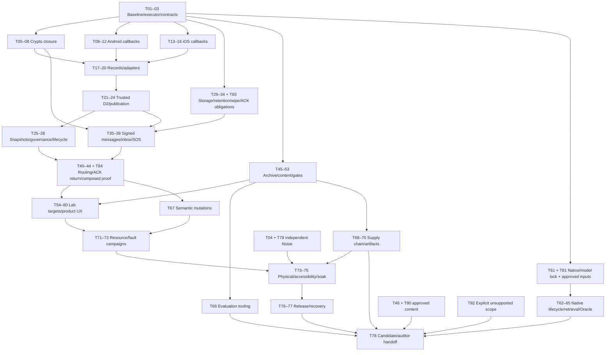

## 8. COMPLETE DEPENDENCY GRAPH

`TASKS.json.dependencies` is the complete machine-readable DAG. T01–T20 are the mandatory initial sequence even where the DAG permits independent work. Thereafter choose the lowest numbered dependency-satisfied task with available required executor/input. External task numbers79–81 may run earlier than their numbers when they unblock a lower-numbered task. Never bypass a failed dependency gate.

The full edge table below is authoritative over this compressed diagram. Model availability does not block Archive, mesh tooling, mutation work or general resource instrumentation. Oracle-specific measurements run when its native dependencies are satisfied.

| Task | Depends on | External input needed for completion |
|---|---|---|
| T01 Preserve the planning baseline and all earlier WIP | None | Internal task; separate device gates as specified |
| T02 Install the deterministic executor and evidence contracts | T01 | Internal task; separate device gates as specified |
| T03 Normalize the normative contract set and capability profiles | T02 | Internal task; separate device gates as specified |
| T04 Make the independent Noise input gate structurally rigorous | T03 | Internal task; separate device gates as specified |
| T05 Commit Android replay state only after authentication | T03 | Internal task; separate device gates as specified |
| T06 Unify Swift DATA nonce framing with Android | T05 | Internal task; separate device gates as specified |
| T07 Replace unilateral rekey with deterministic session retirement | T06 | Internal task; separate device gates as specified |
| T08 Make SessionSlot the serialization authority | T07 | Internal task; separate device gates as specified |
| T09 Advertise only the canonical service UUID on Android | T03 | Internal task; separate device gates as specified |
| T10 Use generated GATT characteristic UUIDs everywhere | T09 | Internal task; separate device gates as specified |
| T11 Bind Android scan callbacks to bounded scan epochs | T10 | Internal task; separate device gates as specified |
| T12 Terminate Android locally cancelled attempts explicitly | T11 | Internal task; separate device gates as specified |
| T13 Create fresh iOS manager contexts per transport epoch | T10 | Internal task; separate device gates as specified |
| T14 Reduce iOS validation and mutation on one serial executor | T13 | Internal task; separate device gates as specified |
| T15 Make every iOS timer own an immutable operation key | T14 | Internal task; separate device gates as specified |
| T16 Close iOS ambiguous subscription and terminal lifetimes | T15 | Internal task; separate device gates as specified |
| T17 Remove plaintext and synthetic READY from production paths | T08, T12, T16 | Internal task; separate device gates as specified |
| T18 Add whole-record reservation and completion to Android writes | T17 | Internal task; separate device gates as specified |
| T19 Add whole-record reservation and backpressure to iOS writes | T18 | Internal task; separate device gates as specified |
| T20 Prove platform lifetime rules with semantic adapter controls | T12, T16, T18, T19 | Internal task; separate device gates as specified |
| T21 Connect the trusted initiator to HS1/HS2/HS3 records | T20, T08 | Internal task; separate device gates as specified |
| T22 Connect the trusted responder to HS1 and HS3 records | T21 | Internal task; separate device gates as specified |
| T23 Complete handshake failure, duplicate and key-confirmation policy | T22 | Internal task; separate device gates as specified |
| T24 Publish only relation-bound authenticated peers | T23 | Internal task; separate device gates as specified |
| T25 Make LinkInfo snapshots nonblocking and subscription-owned | T24 | Internal task; separate device gates as specified |
| T26 Bound Android admission and authenticated traffic budgets | T24 | Internal task; separate device gates as specified |
| T27 Implement equivalent iOS traffic governance | T26 | Internal task; separate device gates as specified |
| T28 Unify runtime stop/start, power and transport invalidation | T25, T27 | Internal task; separate device gates as specified |
| T29 Prove Android private-store encryption and failure behavior | T03 | Internal task; separate device gates as specified |
| T30 Give iOS private stores an erasable encryption key | T29 | Internal task; separate device gates as specified |
| T31 Replace destructive schema upgrades with versioned migrations | T29, T30 | Internal task; separate device gates as specified |
| T32 Implement bounded receipt-relative retention across restarts | T31 | Internal task; separate device gates as specified |
| T33 Bound total store growth and observer lifetimes | T32, T25 | Internal task; separate device gates as specified |
| T34 Finish crash-resumable wipe across transport and storage | T28, T30, T33 | Internal task; separate device gates as specified |
| T35 Authenticate directed-message authors inside the sealed envelope | T08, T31 | Internal task; separate device gates as specified |
| T36 Expose an atomic authored DIRECT send command | T35, T33 | Internal task; separate device gates as specified |
| T37 Persist received inbox messages before generating recipient ACKs | T36, T24, T83 | Internal task; separate device gates as specified |
| T38 Define and verify one signed SOS envelope | T35 | Internal task; separate device gates as specified |
| T39 Make SOS enqueue/cancel one durable authority | T38, T33 | Internal task; separate device gates as specified |
| T40 Freeze bounded anti-entropy control payloads | T20, T33 | Internal task; separate device gates as specified |
| T41 Wire Android durable anti-entropy and forwarding | T40, T24, T26, T37, T39, T84 | Internal task; separate device gates as specified |
| T42 Wire iOS durable anti-entropy and forwarding | T41, T27 | Internal task; separate device gates as specified |
| T43 Align delivery labels with durable evidence | T37, T39, T42 | Internal task; separate device gates as specified |
| T44 Prove crash-safe multihop behavior through composed runtimes | T34, T43 | Internal task; separate device gates as specified |
| T45 Make archive construction atomic and deterministic | T03 | Internal task; separate device gates as specified |
| T46 Bind content approval and manifest trust to final bytes | T45 | Internal task; separate device gates as specified |
| T47 Install and query Android archives using verified FTS5 | T45, T46 | Internal task; separate device gates as specified |
| T48 Make iOS archive availability and failure explicit | T45, T46 | Internal task; separate device gates as specified |
| T49 Complete the Android Archive reading journey | T47 | Internal task; separate device gates as specified |
| T50 Complete the iOS Archive reading journey | T48 | Internal task; separate device gates as specified |
| T51 Fix iOS resource intake and installable bundle metadata | T50 | Internal task; separate device gates as specified |
| T52 Require exact approved Archive bytes inside APK/AAB/IPA | T47, T51 | Internal task; separate device gates as specified |
| T53 Make gate status exact-SHA, complete and profile-aware | T04, T52 | Internal task; separate device gates as specified |
| T54 Create isolated experimental runtime targets | T44, T53 | Internal task; separate device gates as specified |
| T55 Add Android identity verification, rotation and wipe UX | T54, T34, T37 | Internal task; separate device gates as specified |
| T56 Add equivalent iOS identity and recovery UX | T55 | Internal task; separate device gates as specified |
| T57 Add Android direct messaging and honest SOS controls | T55, T43 | Internal task; separate device gates as specified |
| T58 Add equivalent iOS message and SOS journeys | T56, T57 | Internal task; separate device gates as specified |
| T59 Encode platform permissions and background capability truth | T28, T54, T58 | Internal task; separate device gates as specified |
| T60 Automate accessibility and restoration checks | T49, T50, T58, T59 | Internal task; separate device gates as specified |
| T61 Define native/model provenance and compatibility locks | T03 | Internal task; separate device gates as specified |
| T62 Make Android JNI generation and embedding lifecycle safe | T61, T81 | Internal task; separate device gates as specified |
| T63 Make Swift/native generation cancellation independent | T62 | Internal task; separate device gates as specified |
| T64 Bind retrieval vectors to the exact embedding pipeline | T45, T62, T63 | Internal task; separate device gates as specified |
| T65 Close Oracle cancellation and private-draft release semantics | T64 | Internal task; separate device gates as specified |
| T66 Build content/Oracle adversarial evaluation tooling | T46 | Internal task; separate device gates as specified |
| T67 Replace misleading mutation scores with executable proof | T20, T44, T53 | Internal task; separate device gates as specified |
| T68 Pin the build supply chain and prove offline restoration | T53, T61 | Internal task; separate device gates as specified |
| T69 Audit and verify the real iOS release artifact | T51, T52, T68 | Internal task; separate device gates as specified |
| T70 Audit Android release ABI, shrinking and installation | T47, T52, T68 | Internal task; separate device gates as specified |
| T71 Instrument resource budgets without private telemetry | T44, T60 | Internal task; separate device gates as specified |
| T72 Run production-path stress and deterministic fault campaigns | T67, T71 | Internal task; separate device gates as specified |
| T73 Execute physical BLE interoperability and lifecycle matrix | T59, T72, T79 | HARDWARE |
| T74 Complete human accessibility and usability acceptance | T60, T69, T70 | HUMAN_HARDWARE |
| T75 Measure battery, thermal and long-soak behavior | T72, T73 | HARDWARE |
| T76 Prepare signing, store and privacy release inputs | T69, T70, T74 | HUMAN_SIGNING_POLICY |
| T77 Prove upgrade, failed update and rollback recovery | T34, T52, T69, T70 | Internal task; separate device gates as specified |
| T78 Assemble exact-SHA candidate evidence and stop for audit | T01, T02, T03, T04, T05, T06, T07, T08, T09, T10, T11, T12, T13, T14, T15, T16, T17, T18, T19, T20, T21, T22, T23, T24, T25, T26, T27, T28, T29, T30, T31, T32, T33, T34, T35, T36, T37, T38, T39, T40, T41, T42, T43, T44, T45, T46, T47, T48, T49, T50, T51, T52, T53, T54, T55, T56, T57, T58, T59, T60, T61, T62, T63, T64, T65, T66, T67, T68, T69, T70, T71, T72, T73, T74, T75, T76, T77, T79, T80, T81, T82, T83, T84 | Internal task; separate device gates as specified |
| T79 Consume independently approved A-06 fixtures | T04 | APPROVED_INDEPENDENT_ARTIFACT |
| T80 Consume approved production content and editorial decisions | T46 | APPROVED_CONTENT_HUMAN_REVIEW |
| T81 Restore approved native and model artifacts | T61 | APPROVED_NATIVE_MODEL_ARTIFACTS |
| T82 Close unsupported tier and bulk-plane promises explicitly | T03, T59, T61 | Internal task; separate device gates as specified |
| T83 Persist recipient ACK obligations and separate ACK frames | T33, T35 | Internal task; separate device gates as specified |
| T84 Forward durable ACKs through intermediate relays | T83, T40, T24 | Internal task; separate device gates as specified |

