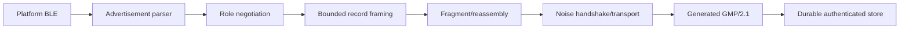

# Future BLE/Noise/GMP stack

```mermaid
flowchart LR
  BLE[Platform BLE] --> Adv[Advertisement parser]
  Adv --> Role[Role negotiation]
  Role --> Record[Bounded record framing]
  Record --> Frag[Fragment/reassembly]
  Frag --> Noise[Noise handshake/transport]
  Noise --> GMP[Generated GMP/2.1]
  GMP --> Store[Durable authenticated store]
```

Status: nonshipping design only.
