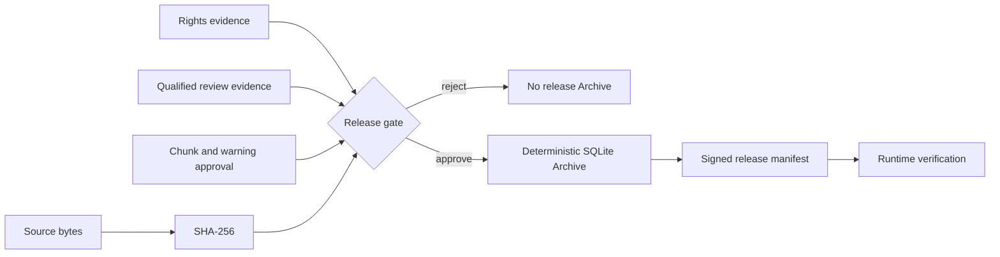

# Content flow

```mermaid
flowchart LR
  Source[Source bytes] --> Hash[SHA-256]
  Rights[Rights evidence] --> Gate{Release gate}
  Review[Qualified review evidence] --> Gate
  Chunk[Chunk and warning approval] --> Gate
  Hash --> Gate
  Gate -- reject --> NoBuild[No release Archive]
  Gate -- approve --> DB[Deterministic SQLite Archive]
  DB --> Manifest[Signed release manifest]
  Manifest --> App[Runtime verification]
```
