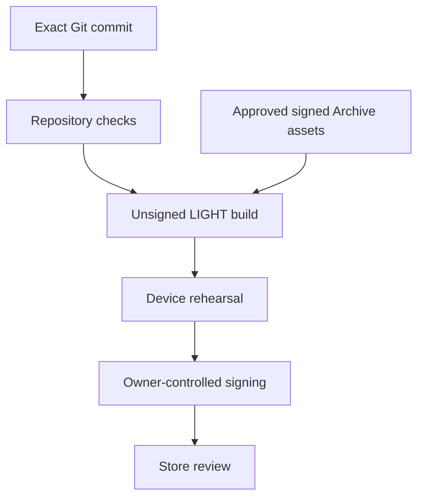

# Deployment

```mermaid
flowchart TB
  Source[Exact Git commit] --> Checks[Repository checks]
  Checks --> Unsigned[Unsigned LIGHT build]
  Assets[Approved signed Archive assets] --> Unsigned
  Unsigned --> DeviceQA[Device rehearsal]
  DeviceQA --> Sign[Owner-controlled signing]
  Sign --> Store[Store review]
```
