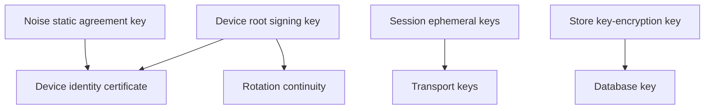

# Key lifecycle

```mermaid
flowchart TB
  Root[Device root signing key] --> Cert[Device identity certificate]
  Root --> Rotation[Rotation continuity]
  Static[Noise static agreement key] --> Cert
  Ephemeral[Session ephemeral keys] --> Transport[Transport keys]
  StoreKEK[Store key-encryption key] --> DBKey[Database key]
```

Signing, static agreement, session, and local-store keys must remain distinct.
