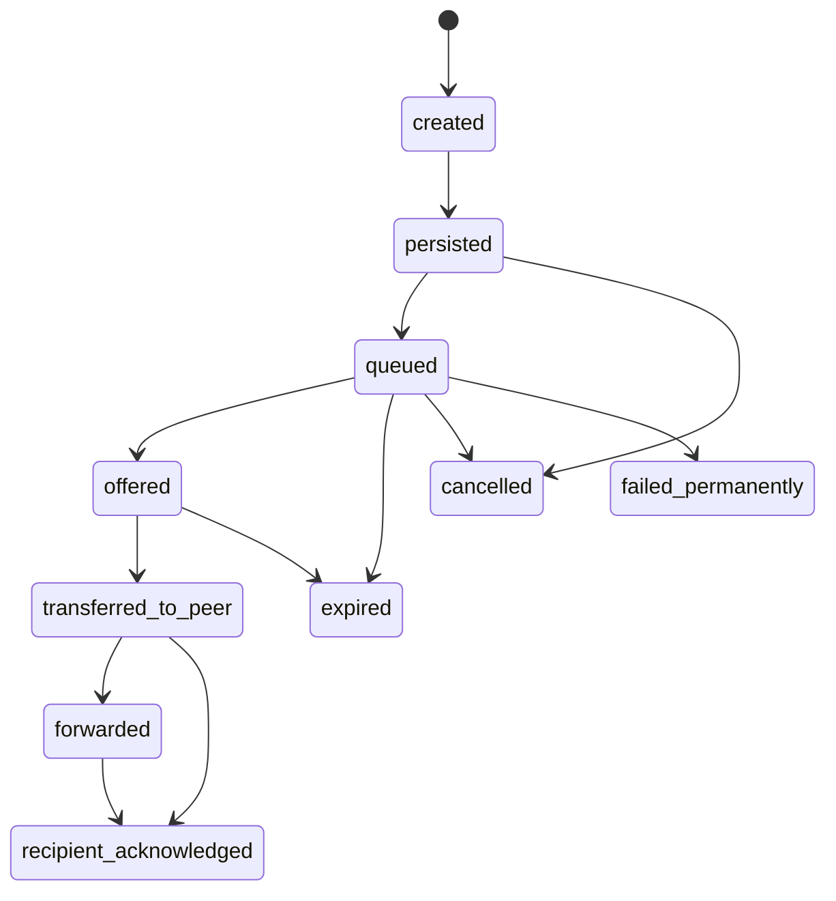

# Message state machine

```mermaid
stateDiagram-v2
  [*] --> created
  created --> persisted
  persisted --> queued
  queued --> offered
  offered --> transferred_to_peer
  transferred_to_peer --> forwarded
  transferred_to_peer --> recipient_acknowledged
  forwarded --> recipient_acknowledged
  queued --> expired
  offered --> expired
  persisted --> cancelled
  queued --> cancelled
  queued --> failed_permanently
```

Status: required contract; not yet integrated into shipping platform stores.
