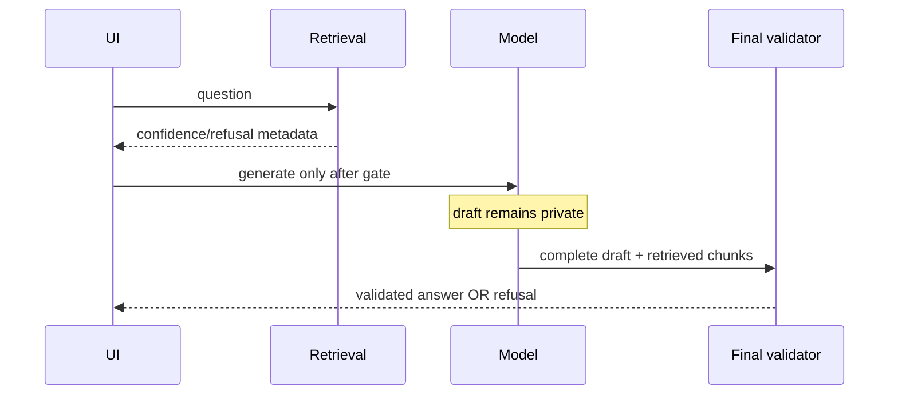

# Oracle validation

```mermaid
sequenceDiagram
  participant U as UI
  participant R as Retrieval
  participant M as Model
  participant V as Final validator
  U->>R: question
  R-->>U: confidence/refusal metadata
  U->>M: generate only after gate
  Note over M: draft remains private
  M->>V: complete draft + retrieved chunks
  V-->>U: validated answer OR refusal
```
