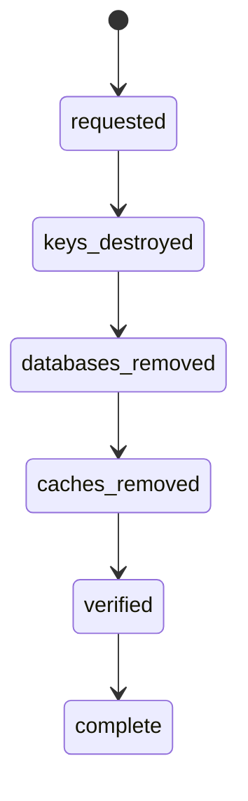

# Panic-wipe state machine

```mermaid
stateDiagram-v2
  [*] --> requested
  requested --> keys_destroyed
  keys_destroyed --> databases_removed
  databases_removed --> caches_removed
  caches_removed --> verified
  verified --> complete
```

Status: specification only. Key destruction is the security boundary; interruption-safe platform integration remains open.
