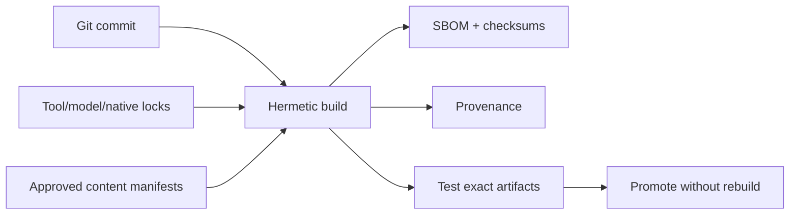

# Release supply chain

```mermaid
flowchart LR
  Git[Git commit] --> Build[Hermetic build]
  Locks[Tool/model/native locks] --> Build
  Content[Approved content manifests] --> Build
  Build --> SBOM[SBOM + checksums]
  Build --> Provenance[Provenance]
  Build --> Test[Test exact artifacts]
  Test --> Promote[Promote without rebuild]
```
